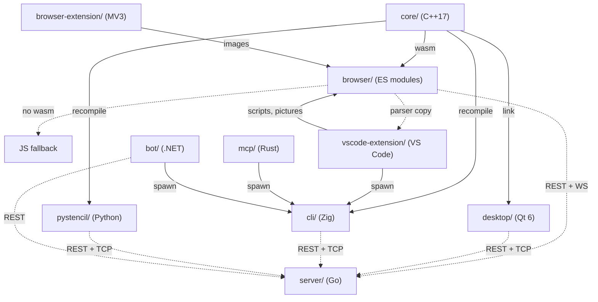

# Stencil architecture

The design of the system: the map, the core parity contract, the shared-data rails, the
layer model per app and the pattern vocabulary.

One shared C++ core feeds four front-ends; the remaining subprojects are adapters over the
CLI or the server. Everything below follows from that shape.

---

## 0. System map



Every surface has its own `ARCHITECTURE.md` with the same seven sections: **Layers**,
**Where things go**, **Entities**, **Patterns**, **Design**, **Rules**, **Tests**. Layers
and Patterns instantiate §3 and §4 below for that surface; Entities is its domain model;
Where things go is its placement table; Design is its flows and the schemas it owns.
Per surface: [core](core/ARCHITECTURE.md) ·
[browser](browser/ARCHITECTURE.md) · [desktop](desktop/ARCHITECTURE.md) ·
[cli](cli/ARCHITECTURE.md) · [pystencil](pystencil/ARCHITECTURE.md) ·
[browser-extension](browser-extension/ARCHITECTURE.md) ·
[vscode-extension](vscode-extension/ARCHITECTURE.md) · [mcp](mcp/ARCHITECTURE.md) ·
[bot](bot/ARCHITECTURE.md) · [server](server/ARCHITECTURE.md) · [e2e](e2e/ARCHITECTURE.md).
The `e2e/` harness drives the built artifacts rather than being a runtime component, so it
is not a node above.

The pure, GUI-free logic — the formula parser, the `.stc` script engine, geometry, color,
pixel↔page conversion, crop, a line rasteriser, history, project storage and expiry — lives
in `core/`, STL-only. It is compiled to WebAssembly so the browser runs that same C++ at
runtime; the wasm module (`browser/js/wasm/stencilCore.js`) is a generated artifact built in
CI and on demand ([core/WASM.md](core/WASM.md)), so each JS module keeps a behavior-identical
fallback for when wasm is absent and for `node --test`. The desktop links the core as a static library;
the CLI and pystencil recompile its sources and drive them over the `extern "C"` ABI in
`core/cliApi.h`, leaving codecs, HTTP, JSON and video to the adapter.

### Repository layout

```
core/                 # shared, GUI-free C++ logic library
  geometry/ raster/ color/ parse/ page/ format/ state/   # one directory per role
  script/             # the .stc language: lex · parse · args · templates · lower · dump
  abi/                # marshal · handleTable · linesCodec · shared.inc (shared by both ABIs)
  models.hpp          # shared Point / Line value types (+ rgba.hpp, text.hpp)
  wasm*Api.cpp        # extern "C" ABI compiled to WebAssembly (core/CMakeLists.txt only)
  cliApi.{h,cpp}      # extern "C" ABI consumed by the Zig CLI and pystencil
  tests/              # Doctest suite
  WASM.md             # how the core is built to wasm and wired into the browser
browser/              # the browser app: index.html, css/, js/, tests/, js/wasm/ (generated)
desktop/              # the Qt app: src/ (app · canvas · dialogs · io · llm · net · support),
                      #   tests/ (headless suites + MainWindow.<area>.gui.cpp), resources/, packaging/
cli/                  # the Zig tool: build.zig, src/ (params · pipeline · console · llm · scrape · server …)
pystencil/            # the Python package: build.py, pystencil/, tests/
mcp/                  # the Rust MCP server: src/ (server · args · pipeline · opplan · deliver · llm …)
server/               # the Go collaboration server: cmd/stencil-server/, internal/
browser-extension/    # the Chrome MV3 extension: manifest.json, src/, tests/
vscode-extension/     # the VS Code .stc/.stcjs/.pystc extension: package.json, syntaxes/, icons/, src/ (+ src/parser/ copies)
bot/                  # the .NET Telegram bot: src/ (Domain · Application · Infrastructure · Bot), tests/
e2e/                  # the Playwright smoke harness: helpers/, fixtures/, tests/, pins/
contracts/            # the normative contracts, one directory each
  llm/                # the LLM contract (llm-contract.md + providers · profiles · chat)
  stc/                # the .stc script language
tools/                # moveCheck.mjs and commentOnlyDiff.mjs
```

The desktop app's own end-to-end test lives with the desktop build (QtTest targets, one per
feature area), not in `e2e/`, which covers the browser, extension, cli and server surfaces.

---

## 1. The core parity contract

`core/` (C++17, **STL-only, codec-free, GUI-free**) is the shared logic. Four surfaces run
it, by four mechanisms:

| Surface | How it gets `core/` | ABI file |
|---|---|---|
| browser | compiled to wasm, **plus a JS fallback that matches it op-for-op** | `core/wasmApi.cpp` + `wasmCropApi`/`wasmStateApi`/`wasmProjectsApi.cpp` |
| desktop | `add_subdirectory(../core)` — links the CMake library | (direct C++) |
| cli | `cli/build.zig` **recompiles the sources** | `core/cliApi.cpp` |
| pystencil | `pystencil/build.py` **recompiles the sources**, driven by ctypes | `core/cliApi.cpp` |

Four invariants:

1. **Each core module is a port of a named `browser/js/` call site.** The mapping is at the
   top of every core header. Behaviour is identical down to edge cases; `core/tests/` are
   ports of `browser/tests/`.
2. **The JS fallback matches wasm op-for-op.** `browser/tests/wasm-parity.test.js` proves
   it and CI builds wasm fresh to run it.
3. **No `eval`, either side.** `browser/js/core/formulaEngine.js` and `core/parse/formulaParser`
   are both real recursive-descent parsers: `+ - * / ** ( )`, one variable, `**`
   right-associative, empty = identity, div-by-zero/overflow = invalid, recursion capped at
   the same depth (`MAX_DEPTH` on both sides).
4. **The source list lives in three files**: `STENCIL_CORE_SOURCES` in
   `core/CMakeLists.txt`, the array in `cli/build.zig` and the list in `pystencil/build.py`.
   The wasm exports are a separate list, `EXPORTED_FUNCTIONS` in `core/CMakeLists.txt`.

Codecs, HTTP, JSON, video, QImage/canvas rendering, persistence and the event loop are the
**adapters'** job, not `core/`'s.

`vscode-extension/`, `mcp/`, `server/`, `bot/` and `e2e/` never link or recompile `core/` —
the parity contract does not reach them. Their contract is the CLI's argv/stderr shape and
the server's wire protocol. `vscode-extension/` is the one that still needs core behaviour
in-process, to underline a `.stc` between keystrokes: it carries a byte-equal copy of the
browser's JS fallback rather than a second implementation, so the copy inherits parity
through the file it is pinned to.

---

## 2. Shared-data rails

**`browser/js/config/` is the canonical home for every shared data table.** Nothing else is a
source of truth. It covers accents, colour names, icons + icon motion, page/app
constants, hotkeys, help text, layout fields, media types, theme tokens, the three LLM
assets under `llm/` (`opRegistry.json`, `systemPrompt.json`, `providers.json`) and the
`.stc` fixture corpus under `script/fixtures/`.

Five consumption mechanisms, one per surface:

| Mechanism | Surface | Shape |
|---|---|---|
| **qrc alias** | desktop | `<file alias="X.json">../../browser/js/config/X.json</file>` in `desktop/resources/app.qrc` |
| **`@embedFile`** | cli | `mod.addAnonymousImport("X.json", …)` in `cli/build.zig`, then `@embedFile("X.json")` |
| **`include_str!`** | mcp | `include_str!("../../browser/js/config/X.json")` |
| **`<EmbeddedResource Link>`** | bot | `<EmbeddedResource Include="../../../browser/js/config/X.json" Link="Assets/X.json" />` |
| **checked-in copy + byte-equality drift test** | browser-extension, pystencil, vscode-extension | the copy ships with the surface; a test pins it to the canonical file |

A table a surface writes in its own words is held to the canonical list the same way, without
being a copy of it: `vscode-extension/src/config/stencilApiVocabulary.json` explains every
`window.stencil` member, and `tests/apiVocabulary.test.js` asserts its keys and signatures
against `interface Stencil` in `browser/js/console/stencilApi.d.ts`, both directions.

The fifth rail exists only where embedding is impossible: the extensions ship self-contained
(MV3 reads nothing outside its own tree, and a `.vsix` carries only what it packaged) and
pystencil stays relocatable. Every copy on this rail carries a byte-equality drift test:
`browser-extension/tests/dataParity.test.js` (modes `full` / `subset`, with declared
`extensionOnly` names), `pystencil/tests/test_canonical_drift.py`, and
`vscode-extension/tests/parserParity.test.js`, which pins both `src/config/colorNames.json`
and the copied `src/parser/script*.js` to `browser/js/` in **both directions** — no file may
appear, vanish or change on one side alone.

A value the core can compute is read rather than mirrored: page formats and colour names
come back out of the core over the C ABI (`pystencil` does this;
desktop and cli drift-test `PAGE_SIZES` against the core).

The **op registry table-drives all seven op-plan validators.** Each surface keeps only its
normalizers, its executors and the few native rules the registry names. Change a key's type,
range, enum or cap in `opRegistry.json` and every surface changes with it —
`browser/js/config/llm/opRegistry.README.md` is the spec.

The **`.stc` fixture corpus plays the same role for the script language.**
`script/fixtures/cases.txt` holds every case as a plain-text section — source, canonical
dump, expected diagnostics — because `core/` has no JSON parser and must read it directly.
The C++ engine, the JS fallback and the copy in `vscode-extension/src/parser/` walk that one
file, so the language has a single implementation in `core/script/` and no surface grows a
grammar of its own. `contracts/stc/stc-contract.md` is the normative prose.

---

## 3. Layer model, per app

Imports point **downward only**. A layer may use everything to its left and nothing to its
right. The order per surface, and what enforces it:

| Surface | Order (left → right) | Enforced by |
|---|---|---|
| browser | `config/` + `utils.js` → `core/` (no DOM) → `eventBus/` → `net/` → `llm/` → `console/` → `ui/` → render | `browser/tests/layerBoundary.test.js` |
| browser-extension | `lib/` → `config/` → `llm/` → `background/` → `content/` → `popup/`, `options/`, `crop/` | `browser-extension/tests/layerBoundary.test.js` |
| vscode-extension | `src/config/` + `src/parser/` → `src/lib/` → `src/*.js` → `src/extension.js` | `vscode-extension/tests/layerBoundary.test.js` |
| desktop | core seam (the `core/` includes the lint allows) → controllers → `net/`, `io/` → `support/` → `canvas/`, `dialogs/`, `llm/` → `app/` | `desktop/tests/layerBoundary.headless.cpp` |
| cli | `core.zig` → `args.zig` + `params/` → `net.zig` → ops → `llm/` → `console/` → `main.zig` | the layer lint in `logo.zig` |
| pystencil | `_native` + `core` → `image`, `codecs/`, `layout` → `editor/` → `llm/`, `server/`, `sitesource/` → `cli/` | `pystencil/tests/test_layer_boundary.py` |
| server | `cmd/` → `httpapi` (transport only) → `service` → `store` + `filestore` → `hub` → `protocol` | convention |
| bot | `Domain` ← `Application` ← `Infrastructure` ← `Bot` (dependencies point inward) | project references + `LayerBoundaryTests.cs` |
| mcp | `server/` + tools → `opplan/` → `args/` → `pipeline/` → `llm/` | `mcp/tests/layer_boundary_test.rs` |
| core | value types → `geometry/`, `color/`, `parse/` → `raster/`, `page/`, `format/`, `state/`, `script/` → `abi/` → the two ABIs | convention |

Two rules cut across every surface: the pure logic ring (browser `core/`, the desktop's core
seam, `core.zig`, `pystencil.core`) never touches a DOM, a terminal or a socket, which is what makes
the parity contract testable; and only the outermost ring may write to the user (the cli's
`console/`, the server's `httpapi`, the bot's `Bot` ring), so every layer below returns values
and errors. Each surface's `ARCHITECTURE.md` carries its own Layers section with the
reasoning.

---

## 4. Pattern vocabulary

The recurring structures, under the names the repo uses for them.

- **Facade over core** — `window.stencil` (browser), the lint-gated `core/` seam (desktop), `core.zig` (cli),
  `pystencil.core`. One narrow, guarded surface; every mutation goes through it, so console
  scripting, hotkeys, toolbar and LLM plans cannot diverge.
- **Mediator** — `DrawingApp` (browser) and `MainWindow` (desktop) wire collaborators to each
  other; the collaborators do not know one another.
- **Command** — every undoable operation is an entry on `historyStack` / `HistoryStack`,
  applied and reverted by the same code path.
- **Strategy** — LLM providers (one `wire` per provider) and image filters; selected by table
  lookup, never by a growing `if` chain.
- **Observer** — the event bus (`core/emitter.js`, Qt signals, the server's `internal/eventbus`).
- **Repository** — `projectsStore` / `internal/store` / `filestore`: persistence behind an
  interface the caller cannot see through.
- **Chain of Responsibility** — request middleware on the server, and the guard chains on
  each surface's fetch path.
- **Adapter** — CLI argv builders (`mcp/src/args.rs`, bot's `CliArgvBuilder`) translating a
  typed request into the CLI's documented flags.
- **Interpreter** — `core/parse/formulaParser` over an `f(x)` expression, and `core/script/`
  over a `.stc`: lex → parse → expand templates → lower to an op stream. Neither evaluates
  anything; each surface's runner maps the lowered ops onto the very facade calls its
  toolbar makes, so a script and a click are one code path.
- **Port (byte-equal copy)** — a module the consumer cannot import across subprojects, copied
  and pinned: the `browser/js/ui` + `llm/llmClient` modules into `browser-extension/src/lib/`,
  `browser/js/core/script*.js` into `vscode-extension/src/parser/`. The pin, not the copy, is the contract.
