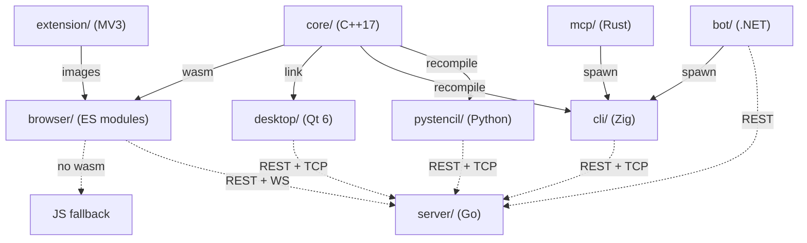

# Stencil architecture

The design of the system: the map, the core parity contract, the shared-data rails, the
layer model per app and the pattern vocabulary.

One shared C++ core feeds four front-ends; four more subprojects are protocol adapters over
the CLI or the server. Everything below follows from that shape.

---

## 0. System map



Per-surface diagrams and structure: [core](core/ARCHITECTURE.md) ·
[browser](browser/ARCHITECTURE.md) · [desktop](desktop/ARCHITECTURE.md) ·
[cli](cli/ARCHITECTURE.md) · [pystencil](pystencil/ARCHITECTURE.md) ·
[extension](extension/ARCHITECTURE.md) · [mcp](mcp/ARCHITECTURE.md) ·
[bot](bot/ARCHITECTURE.md) · [server](server/ARCHITECTURE.md) · [e2e](e2e/ARCHITECTURE.md).
The `e2e/` harness drives the built artifacts rather than being a runtime component, so it
is not a node above.

The pure, GUI-free logic — the formula parser, geometry, color, pixel↔page conversion, crop,
a line rasteriser, history, project storage and expiry — lives in `core/`, STL-only. It is
compiled to WebAssembly so the browser runs that same C++ at runtime; the wasm module
(`browser/js/wasm/stencilCore.js`) is a generated artifact built in CI and on demand
([core/WASM.md](core/WASM.md)), so each JS module keeps a behavior-identical fallback for
when wasm is absent and for `node --test`. The desktop links the core as a static library;
the CLI and pystencil recompile its sources and drive them over the `extern "C"` ABI in
`core/cliApi.h`, leaving codecs, HTTP, JSON and video to the adapter.

### Repository layout

```
core/                 # shared, GUI-free C++ logic library
  geometry/ raster/ color/ parse/ page/ format/ state/   # one directory per role
  abi/                # marshal · handleTable · linesCodec · shared.inc (shared by both ABIs)
  models.hpp          # shared Point / Line value types (+ rgba.hpp, text.hpp)
  wasm*Api.cpp        # extern "C" ABI compiled to WebAssembly (core/CMakeLists.txt only)
  cliApi.{h,cpp}      # extern "C" ABI consumed by the Zig CLI and pystencil
  tests/              # Doctest suite
  WASM.md             # how the core is built to wasm and wired into the browser
browser/              # the browser app: index.html, css/, js/, tests/, js/wasm/ (generated)
desktop/              # the Qt app: src/ (app · canvas · dialogs · io · llm · net · support),
                      #   tests/ (headless suites + MainWindow.<area>.gui.cpp), resources/, packaging/
cli/                  # the Zig tool: build.zig, src/ (params · pipeline · console · llm · scrape · server …)
pystencil/            # the Python package: build.py, pystencil/, tests/
mcp/                  # the Rust MCP server: src/ (server · args · pipeline · opplan · deliver · llm …)
server/               # the Go collaboration server: cmd/stencil-server/, internal/
extension/            # the Chrome MV3 extension: manifest.json, src/, tests/
bot/                  # the .NET Telegram bot: src/ (Domain · Application · Infrastructure · Bot), tests/
e2e/                  # the Playwright smoke harness: helpers/, fixtures/, tests/, pins/
llm-contract/         # the normative LLM contract
tools/                # moveCheck.mjs and commentOnlyDiff.mjs
```

The desktop app's own end-to-end test lives with the desktop build (QtTest targets, one per
feature area), not in `e2e/`, which covers the browser, extension, cli and server surfaces.

---

## 1. The core parity contract

`core/` (C++17, **STL-only, codec-free, GUI-free**) is the shared logic. Four surfaces run
it, by four mechanisms:

| Surface | How it gets `core/` | ABI file |
|---|---|---|
| browser | compiled to wasm, **plus a JS fallback that matches it op-for-op** | `core/wasmApi.cpp` + `wasmCropApi`/`wasmStateApi`/`wasmProjectsApi.cpp` |
| desktop | `add_subdirectory(../core)` — links the CMake library | (direct C++) |
| cli | `cli/build.zig` **recompiles the sources** | `core/cliApi.cpp` |
| pystencil | `pystencil/build.py` **recompiles the sources**, driven by ctypes | `core/cliApi.cpp` |

Four invariants:

1. **Each core module is a port of a named `browser/js/` call site.** The mapping is at the
   top of every core header. Behaviour is identical down to edge cases; `core/tests/` are
   ports of `browser/tests/`.
2. **The JS fallback matches wasm op-for-op.** `browser/tests/wasm-parity.test.js` proves
   it and CI builds wasm fresh to run it.
3. **No `eval`, either side.** `browser/js/core/formulaEngine.js` and `core/parse/formulaParser`
   are both real recursive-descent parsers: `+ - * / ** ( )`, one variable, `**`
   right-associative, empty = identity, div-by-zero/overflow = invalid, recursion capped at
   the same depth (`MAX_DEPTH` on both sides).
4. **The source list lives in three files**: `STENCIL_CORE_SOURCES` in
   `core/CMakeLists.txt`, the array in `cli/build.zig` and the list in `pystencil/build.py`.
   The wasm exports are a separate list, `EXPORTED_FUNCTIONS` in `core/CMakeLists.txt`.

Codecs, HTTP, JSON, video, QImage/canvas rendering, persistence and the event loop are the
**adapters'** job, not `core/`'s.

`mcp/`, `server/`, `bot/` and `e2e/` never link or recompile `core/` — the parity contract
does not reach them. Their contract is the CLI's argv/stderr shape and the server's wire
protocol.

---

## 2. Shared-data rails

**`browser/js/config/` is the canonical home for every shared data table.** Nothing else is a
source of truth. It covers accents, colour names, icons + icon motion, page/app
constants, hotkeys, help text, layout fields, media types, theme tokens, and the three LLM
assets under `llm/` (`opRegistry.json`, `systemPrompt.json`, `providers.json`).

Five consumption mechanisms, one per surface:

| Mechanism | Surface | Shape |
|---|---|---|
| **qrc alias** | desktop | `<file alias="X.json">../../browser/js/config/X.json</file>` in `desktop/resources/app.qrc` |
| **`@embedFile`** | cli | `mod.addAnonymousImport("X.json", …)` in `cli/build.zig`, then `@embedFile("X.json")` |
| **`include_str!`** | mcp | `include_str!("../../browser/js/config/X.json")` |
| **`<EmbeddedResource Link>`** | bot | `<EmbeddedResource Include="../../../browser/js/config/X.json" Link="Assets/X.json" />` |
| **checked-in copy + byte-equality drift test** | extension, pystencil | the copy ships with the surface; a test pins it to the canonical file |

The fifth rail exists only where embedding is impossible: the extension ships self-contained
(MV3 reads nothing outside its own tree) and pystencil stays relocatable. Every copy on this
rail carries a byte-equality drift test: `extension/tests/dataParity.test.js` (modes `full` /
`subset`, with declared `extensionOnly` names) and `pystencil/tests/test_canonical_drift.py`.

A value the core can compute is read rather than mirrored: page formats and colour names
come back out of the core over the C ABI (`pystencil` does this;
desktop and cli drift-test `PAGE_SIZES` against the core).

The **op registry table-drives all seven op-plan validators.** Each surface keeps only its
normalizers, its executors and the few native rules the registry names. Change a key's type,
range, enum or cap in `opRegistry.json` and every surface changes with it —
`browser/js/config/llm/opRegistry.README.md` is the spec.

---

## 3. Layer model, per app

Imports point **downward only**. A layer may use everything to its left and nothing to its
right. Each order is lint-enforced (`browser/tests/layerBoundary.test.js`,
`desktop/tests/layerBoundary.headless.cpp`, the cli's layer lint in `logo.zig`).

**browser** — `config/` + `utils.js` → `core/` (pure logic, **no DOM**) → bus (`core/emitter.js`)
→ `net/` → `llm/` → console facade (`console/stencilApi.js`) → `ui/` (pure string-returning
components) → render.
`core/` is DOM-free, which is what makes wasm parity testable. `ui/` never reaches into `net/` or
`llm/`; it emits on the bus. Every mutation — toolbar, hotkey, console script, LLM plan —
routes through the same core methods via the frozen `window.stencil` facade.

**extension** — `lib/` → `config/` → `llm/` → `background/` → `content/` → `popup/`,
`options/`, `crop/`.
`lib/` is the shared, dependency-free bottom; several of its modules are byte-for-byte ports
of `browser/js/ui/` files. The extension never reads `../browser` at runtime.

**desktop** — model (`CoreFacade` + `DocumentModel`) → controllers → `net/`, `io/` →
`support/` (motion, theme, widgets and platform helpers) → `canvas/`, `dialogs/`, `llm/` →
`app/`. `tests/layerBoundary.headless.cpp` enforces it.
`app/` is composition and the Qt main window; it owns no logic that a controller could hold.
QSS belongs to the shared ID-selector sheet in `support/theme.cpp`, not to a widget's own
`setStyleSheet` (a local sheet silently changes child metrics).

**cli** — core wrap (`core.zig`) → params (`args.zig` + `params/`) → `net.zig` → ops
(`pipeline/`, `image.zig`, `layout.zig`, `page.zig`, `video.zig`) → `llm/` (`llm.zig` is a
façade that re-exports it) → presentation (`console/`) → console app (`main.zig`).
**`console/` is the only layer allowed to write to a terminal.** Lower layers return values
and errors; they do not print.

**server** — `cmd/` → `internal/httpapi` (**transport only**: decode, authorize, encode) →
service → `internal/store` + `internal/filestore` → `internal/hub` → `internal/protocol`.
No business rule lives in a handler. `internal/protocol` is the wire contract the four
front-ends mirror; `internal/ratelimit`, `internal/auth`, `internal/config` are shared
infrastructure. The server never touches `core/`.

**bot** — four rings under `bot/src/Stencil.TelegramBot.<Ring>/`, dependencies pointing
**inward**: `Domain` (no dependencies) ←
`Application` (use cases) ← `Infrastructure` (CLI spawn, HTTP, Telegram, filesystem) ←
`Bot` (composition root + the Telegram edge). `Domain` is free of Telegram, HTTP and
process types.

**mcp** — `server/` + tools → `opplan/` → `args/` → `pipeline/` → `llm/` (`llmtransport/`
sits beside `llm/`).
A thin adapter: its whole contract is the CLI's documented flags and its
`wrote {path} ({w}x{h})` / `error:` stderr output.

**pystencil** — `_native.py` + `core.py` → `image.py`, `codecs/`, `layout.py` → `editor/` →
`llm/`, `server/`, `sitesource/` → `cli/`. Stdlib only, ctypes only; `_net.py` is the single
fetch guard every network path goes through.

---

## 4. Pattern vocabulary

The recurring structures, under the names the repo uses for them.

- **Facade over core** — `window.stencil` (browser), `CoreFacade` (desktop), `core.zig` (cli),
  `pystencil.core`. One narrow, guarded surface; every mutation goes through it, so console
  scripting, hotkeys, toolbar and LLM plans cannot diverge.
- **Mediator** — `DrawingApp` (browser) and `MainWindow` (desktop) wire collaborators to each
  other; the collaborators do not know one another.
- **Command** — every undoable operation is an entry on `historyStack` / `HistoryStack`,
  applied and reverted by the same code path.
- **Strategy** — LLM providers (one `wire` per provider) and image filters; selected by table
  lookup, never by a growing `if` chain.
- **Observer** — the event bus (`core/emitter.js`, Qt signals, the server's `internal/bus`).
- **Repository** — `projectsStore` / `internal/store` / `filestore`: persistence behind an
  interface the caller cannot see through.
- **Chain of Responsibility** — request middleware on the server, and the guard chains on
  each surface's fetch path.
- **Adapter** — CLI argv builders (`mcp/src/args.rs`, bot's `CliArgvBuilder`) translating a
  typed request into the CLI's documented flags.
