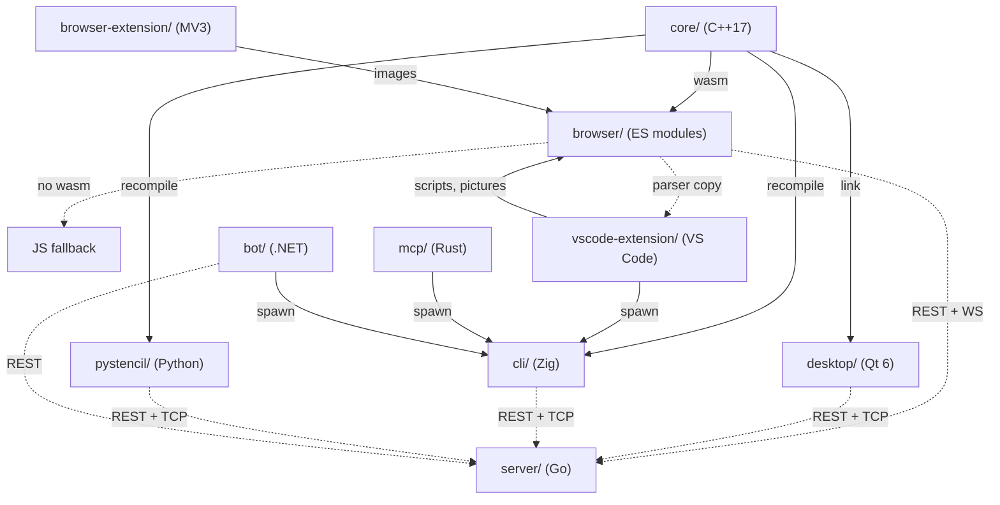

# Stencil architecture

One shared C++ core feeds four front-ends; the remaining subprojects are adapters over the
CLI or the server. Everything below follows from that shape.

---

## 0. System map


```mermaid
graph TD
    CORE["core/ (C++17)"]
    WEB["browser/ (ES modules)"]
    DESK["desktop/ (Qt 6)"]
    CLI["cli/ (Zig)"]
    PY["pystencil/ (Python)"]
    FB["JS fallback"]
    EXT["browser-extension/ (MV3)"]
    VSC["vscode-extension/ (VS Code)"]
    MCP["mcp/ (Rust)"]
    BOT["bot/ (.NET)"]
    SRV["server/ (Go)"]

    CORE -->|"wasm"| WEB
    CORE -->|"link"| DESK
    CORE -->|"recompile"| CLI
    CORE -->|"recompile"| PY
    WEB -.->|"no wasm"| FB
    EXT -->|"images"| WEB
    VSC -->|"scripts, pictures"| WEB
    WEB -.->|"parser copy"| VSC
    VSC -->|"spawn"| CLI
    MCP -->|"spawn"| CLI
    BOT -->|"spawn"| CLI
    WEB -.->|"REST + WS"| SRV
    DESK -.->|"REST + TCP"| SRV
    CLI -.->|"REST + TCP"| SRV
    PY -.->|"REST + TCP"| SRV
    BOT -.->|"REST"| SRV
```

Every surface has its own `ARCHITECTURE.md` with the same seven sections: **Layers**,
**Where things go**, **Entities**, **Patterns**, **Design**, **Rules**, **Tests**. Layers
and Patterns instantiate §3 and §4 for that surface; Entities is its domain model; Design is
its flows and the schemas it owns.
Per surface: [core](core/ARCHITECTURE.md) ·
[browser](browser/ARCHITECTURE.md) · [desktop](desktop/ARCHITECTURE.md) ·
[cli](cli/ARCHITECTURE.md) · [pystencil](pystencil/ARCHITECTURE.md) ·
[browser-extension](browser-extension/ARCHITECTURE.md) ·
[vscode-extension](vscode-extension/ARCHITECTURE.md) · [mcp](mcp/ARCHITECTURE.md) ·
[bot](bot/ARCHITECTURE.md) · [server](server/ARCHITECTURE.md) · [e2e](e2e/ARCHITECTURE.md).
`e2e/` drives the built browser, extension, cli and server and is not a runtime node; the
desktop's GUI e2e is QtTest targets beside its build.

The pure, GUI-free logic — the formula parser, the `.stc` script engine, the op-plan validator
over its own JSON reader, geometry, color, pixel↔page conversion, crop, a line rasteriser,
history, project storage and expiry — lives in `core/`, STL-only. The browser runs that same
C++ as WebAssembly; the module (`browser/js/wasm/stencilCore.js`) is generated in CI and on
demand ([core/WASM.md](core/WASM.md)), so each JS module keeps a behavior-identical fallback
for when wasm is absent and for `node --test`. The desktop links the core as a static library;
the CLI and pystencil recompile its sources and drive them over the `extern "C"` ABI in
`core/cliApi.h`, leaving codecs, HTTP, model calls and video to the adapter.

### Repository layout

```
core/                 # shared, GUI-free C++ logic, one directory per role
  script/             # the .stc language
  json/ opplan/       # an STL-only JSON reader and the op-plan validator that walks it
  abi/                # marshalling and handle tables shared by both ABIs
  wasm*Api.cpp        # extern "C" ABI compiled to WebAssembly (core/CMakeLists.txt only)
  cliApi.{h,cpp}      # extern "C" ABI consumed by the Zig CLI and pystencil
browser/              # the browser app; js/wasm/ is generated
desktop/              # the Qt app: src/, tests/ (headless + MainWindow.<area>.gui.cpp), resources/, packaging/
cli/                  # the Zig tool
pystencil/            # the Python package
mcp/                  # the Rust MCP server
server/               # the Go collaboration server
browser-extension/    # the Chrome MV3 extension
vscode-extension/     # the VS Code .stc/.stcjs/.pystc extension (+ src/parser/ copies)
bot/                  # the .NET Telegram bot
e2e/                  # the Playwright smoke harness
contracts/            # the normative contracts: llm/, stc/
```

---

## 1. The core parity contract

`core/` (C++17, **STL-only, codec-free, GUI-free**) is the shared logic. Four surfaces run
it, by four mechanisms:

| Surface | How it gets `core/` | ABI file |
|---|---|---|
| browser | compiled to wasm, **plus a JS fallback that matches it op-for-op** | `core/wasmApi.cpp` and its `core/wasm*Api.cpp` siblings |
| desktop | `add_subdirectory(../core)` — links the CMake library | (direct C++) |
| cli | `cli/build.zig` **recompiles the sources** | `core/cliApi.cpp` |
| pystencil | `pystencil/build.py` **recompiles the sources**, driven by ctypes | `core/cliApi.cpp` |

Four invariants:

1. **Each core module is a port of a named `browser/js/` call site.** The mapping is at the
   top of every core header. Behaviour is identical down to edge cases; `core/tests/` are
   ports of `browser/tests/`.
2. **The JS fallback matches wasm op-for-op.** `browser/tests/wasm/wasm-parity.test.js` proves
   it and CI builds wasm fresh to run it.
3. **No `eval`, either side.** `browser/js/core/parse/formulaEngine.js` and `core/parse/formulaParser`
   are both recursive-descent parsers: `+ - * / ** ( )`, both axes and the page/image
   constants of `FormulaContext`, `**` right-associative, empty = identity, div-by-zero /
   overflow / an unknown or unsupplied name = invalid, recursion capped at the same
   `MAX_DEPTH` on both sides.
4. **The source list lives in three files**: `STENCIL_CORE_SOURCES` in
   `core/CMakeLists.txt`, the array in `cli/build.zig` and the list in `pystencil/build.py`.
   The include directories are three more (`STENCIL_CORE_INCLUDE_DIRS`, `core_include_dirs`,
   `INCLUDE_DIRS`), and the wasm exports a separate list, `EXPORTED_FUNCTIONS` in
   `core/CMakeLists.txt`. Core never throws: the wasm build has no exceptions.

Codecs, HTTP, model calls, video, QImage/canvas rendering, persistence and the event loop are
the **adapters'** job. Core reads JSON only through its own reader in `core/json/`.

`vscode-extension/`, `mcp/`, `server/`, `bot/` and `e2e/` never link or recompile `core/`, so
the parity contract does not reach them. Their contract is the CLI's argv/stderr shape — mcp
and bot reach the core's op-plan validator through `--plan-check` — and the server's wire
protocol. `vscode-extension/` still needs core behaviour in-process, to underline a `.stc`
between keystrokes, so it carries a byte-equal copy of the browser's JS fallback, which
inherits parity through the file it is pinned to.

---

## 2. Shared-data rails

**`common/` is the canonical home for everything two or more surfaces share**; nothing else is a
source of truth. `common/config/` holds the data tables — the LLM assets under `llm/`
(`opRegistry.json`, `systemPrompt.json`, `providers.json`) and the SSRF address table every
fetch guard judges an address by (`net/blockedRanges.json`) among them; `common/fixtures/`
the conformance corpora, the `.stc` corpus (`script/cases.txt`) and the LLM fixtures;
`common/icons/` the logo and app-icon art; `common/samples/` the shared test picture. A table
only the browser reads stays in `browser/js/config/`.

Six consumption mechanisms:

| Mechanism | Surface | Shape |
|---|---|---|
| **served beside the app** | browser | the static servers, the nginx image and Pages serve `common/` next to `browser/`; a module imports the table from `common/config/` by its relative path |
| **qrc alias** | desktop | `<file alias="X.json">…/common/config/X.json</file>` in `desktop/resources/app.qrc` |
| **`@embedFile`** | cli | `mod.addAnonymousImport("X.json", …)` in `cli/build.zig`, then `@embedFile("X.json")` |
| **`include_str!`** | mcp | `include_str!("../../common/config/X.json")` |
| **`<EmbeddedResource Link>`** | bot | `<EmbeddedResource Include="../../../common/config/X.json" Link="Assets/X.json" />` |
| **generated copy** | pystencil, server | written from `common/` by the build (`pystencil/build.py`, the server's `go generate`), never checked in: package data and `//go:embed` cannot reach outside their tree |
| **checked-in copy + byte-equality drift test** | browser-extension, vscode-extension | the copy ships with the surface; a test pins it to the canonical file |

A table a surface writes in its own words is held to the canonical list without being a copy:
`vscode-extension/src/config/stencilApiVocabulary.json` explains every `window.stencil`
member, and `tests/lib/vocab/apiVocabulary.test.js` checks its keys and signatures against
`interface Stencil` in `browser/js/console/stencilApi.d.ts`, both directions.

The checked-in copy rail exists only where neither embedding nor a build step reaches: the
extensions ship self-contained (MV3 reads nothing outside its own tree; a `.vsix` carries only
what it packaged). Its drift tests are `browser-extension/tests/dataParity.test.js` (modes
`full` / `subset`, with declared `extensionOnly` names) and
`vscode-extension/tests/parserParity.test.js`, which pins `src/config/colorNames.json` and the
copied `src/parser/script/` in **both directions** — no file may appear, vanish or change on
one side alone; the parser copy is byte-equal except the import specifiers the
`tools/twins.json` tree entry's `rewrite` declares. The generated copies need no drift
test of their own: `pystencil/tests/test_canonical_drift.py` and the server's asset tests
compare what the build wrote against `common/`.

A value the core can compute is read rather than mirrored: page formats and colour names come
back out of the core over the C ABI (`pystencil` does this; desktop and cli drift-test
`PAGE_SIZES` against the core).

The **op registry drives one op-plan validator and its twin.** `core/opplan/` is the C++
validator — cli, pystencil and desktop call it directly, mcp and bot through `--plan-check` —
and `browser/js/llm/plan/` is its JS twin, which the extension copies. Each surface keeps only
its typed mapper and executors, shows core's canonical messages, and adds only the surface
rules the registry names. `common/fixtures/llm/opPlan/generated/normalized.json` pins the normalized
result per surface; `common/config/llm/opRegistry.README.md` is the spec.

The **`.stc` fixture corpus plays the same role for the script language.**
`common/fixtures/script/cases.txt` holds every case as a plain-text section — source, canonical
dump, expected diagnostics — so a case reads as a user writes and sees it. The C++ engine,
the JS fallback and the copy in `vscode-extension/src/parser/` walk that one file, so the
language has a single implementation in `core/script/` and no surface grows a grammar of its
own. `contracts/stc/stc-contract.md` is the normative prose.

---

## 3. Layer model, per app

Imports point **downward only**: a layer may use everything to its left and nothing to its
right. The order per surface, and what enforces it:

| Surface | Order (left → right) | Enforced by |
|---|---|---|
| browser | `config/` + `utils.js` → `core/` (no DOM) → `eventBus/` → `net/` → `llm/` → `console/` → `ui/` → render | `browser/tests/layerBoundary.test.js` |
| browser-extension | `lib/` → `config/` → `llm/` → `background/` → `content/` → `popup/`, `options/`, `crop/` | `browser-extension/tests/layerBoundary.test.js` |
| vscode-extension | `src/config/` + `src/parser/` → `src/lib/` → `src/*.js` → `src/extension.js` | `vscode-extension/tests/layerBoundary.test.js` |
| desktop | core seam (the `core/` includes the lint allows) → controllers → `net/`, `io/` → `support/` → `canvas/`, `dialogs/`, `llm/` → `app/` | `desktop/tests/layerBoundary.headless.cpp` |
| cli | `core.zig` → `args.zig` + `params/` → `net.zig` → ops → `llm/` → `console/` → `app/` → `main.zig` | the layer lint in `app/lint.zig` |
| pystencil | `_native` + `core` → `image`, `codecs/`, `layout` → `editor/` → `llm/`, `server/`, `sitesource/` → `cli/` | `pystencil/tests/test_layer_boundary.py` |
| server | `cmd/` → `httpapi` (transport only) → `service` → `store` + `filestore` → `hub` → `protocol` | convention |
| bot | `Domain` ← `Application` ← `Infrastructure` ← `Bot` (dependencies point inward) | project references + `LayerBoundaryTests.cs` |
| mcp | `server/` + tools → `opplan/` → `args/` → `pipeline/` → `llm/` | `mcp/tests/layer_boundary_test.rs` |
| core | value types → `geometry/`, `color/`, `parse/`, `json/` → `raster/`, `page/`, `format/`, `state/`, `script/`, `opplan/` → `abi/` → the two ABIs | convention + the no-throw lint |

Two rules cut across every surface: the pure logic ring (browser `core/`, the desktop's core
seam, `core.zig`, `pystencil.core`) never touches a DOM, a terminal or a socket, which is what
makes the parity contract testable; and only the outermost ring may write to the user (the
cli's `console/`, the server's `httpapi`, the bot's `Bot` ring), so every layer below returns
values and errors.

---

## 4. Pattern vocabulary

The recurring structures, under the names the repo uses for them.

- **Facade over core** — `window.stencil` (browser), the lint-gated `core/` seam (desktop),
  `core.zig` (cli), `pystencil.core`. One narrow, guarded surface that every mutation goes
  through, so console scripting, hotkeys, toolbar and LLM plans cannot diverge.
- **Mediator** — `DrawingApp` (browser) and `MainWindow` (desktop) wire collaborators that do
  not know one another.
- **Command** — every undoable operation is an entry on `historyStack` / `HistoryStack`,
  applied and reverted by the same code path.
- **Strategy** — LLM providers (one `wire` per provider) and image filters, selected by table
  lookup, never by a growing `if` chain.
- **Observer** — the event bus (`core/emitter.js`, Qt signals, the server's `internal/eventbus`).
- **Repository** — `projectsStore` / `internal/store` / `filestore`: persistence behind an
  interface the caller cannot see through.
- **Chain of Responsibility** — request middleware on the server, and the guard chains on
  each surface's fetch path.
- **Adapter** — CLI argv builders (`mcp/src/args/`, bot's `CliArgvBuilder`) translating a
  typed request into the CLI's documented flags.
- **Interpreter** — `core/parse/formulaParser` over an `f(x, y)` expression, and `core/script/`
  over a `.stc`: lex → parse → expand templates → lower to an op stream. Neither evaluates
  anything; each runner maps the lowered ops onto the facade calls its toolbar makes, so a
  script and a click are one code path.
- **Port (byte-equal copy)** — a module the consumer cannot import across subprojects, copied
  and pinned: the `browser/js/ui` modules into `browser-extension/src/lib/`, the `browser/js/llm/`
  client and plan modules into `browser-extension/src/llm/`, `browser/js/core/script/` into
  `vscode-extension/src/parser/script/`. The pin, not the copy, is the contract.
