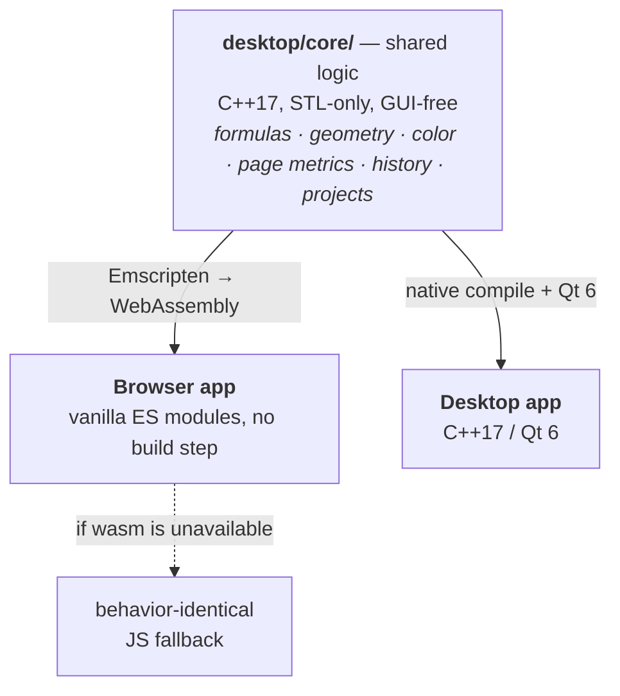

<p align="center">
  
</p>

# Stencil

[](https://github.com/andrew1407/stencil/actions/workflows/ci.yml)
[](https://github.com/andrew1407/stencil/actions/workflows/release.yml)

An image annotation / drawing tool: load an image, draw polylines and rectangles over
it, edit points numerically, convert pixel coordinates to page (cm) coordinates with
optional `f(x,y)` formula transforms, and save your work.

Stencil ships as **two front-ends over one shared logic core**:

| App | Path | Stack | Docs |
|---|---|---|---|
| **Browser** | [`browser/`](browser/) | Vanilla ES-module JS, no build step | [browser/README.md](browser/README.md) |
| **Desktop** | [`desktop/`](desktop/) | C++17 + Qt 6, CMake build | [desktop/README.md](desktop/README.md) |



The two apps deliberately mirror each other's architecture. The **pure, GUI-free logic**
— the formula parser, geometry, color, pixel↔page conversion, history, project storage and
expiry — lives in `desktop/core/`, written dependency-free (STL only). It is compiled to
**WebAssembly** and **the browser app runs that same compiled C++ at runtime** (formula
parsing, geometry/hit-testing, page conversion, rotation, the custom duotone filter, zoom
clamping). That module (`browser/js/wasm/stencilCore.js`) is a generated artifact — built in
CI and on demand locally (see [desktop/WASM.md](desktop/WASM.md)), not committed — so each JS
module keeps a behavior-identical fallback that runs when wasm hasn't been built or fails to
load, and under `node --test`.

## Repository layout

```
README.md             # this overview
browser/              # the browser app
  index.html
  css/  js/  tests/
  js/wasm/            # generated wasm module, gitignored (built from desktop/core; see WASM.md)
  package.json
  README.md
desktop/                  # the desktop app
  core/               # shared, GUI-free logic + its Doctest tests
  core/wasmApi.cpp    # extern "C" ABI compiled to WebAssembly for the browser
  gui/                # Qt widgets (mirrors the browser UI)
  tests/
  third_party/        # vendored doctest.h
  CMakeLists.txt
  WASM.md             # how the core is built to wasm and wired into the browser
  README.md
```

## Development

**Dependency policy:** the only permitted third-party libraries are **Qt 6** (desktop
GUI) and **Doctest** (C++ tests); the browser app stays dependency-free with no build
step.

- Build & run the browser app → [browser/README.md](browser/README.md)
- Build, test & run the desktop app → [desktop/README.md](desktop/README.md)
