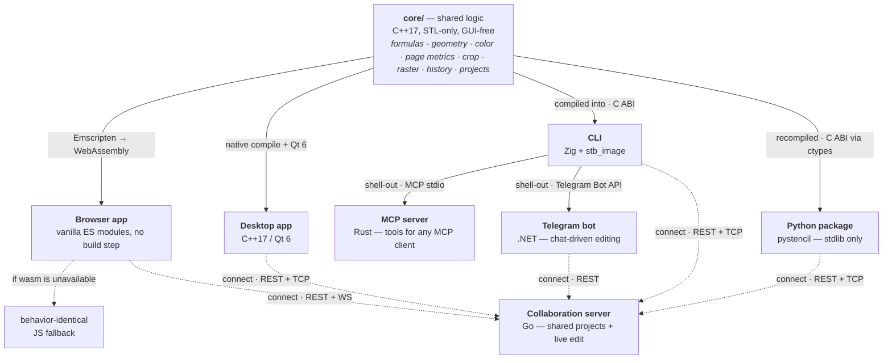

# Stencil

<p align="center">
  <a href="https://github.com/andrew1407/stencil/releases/tag/stencil-desktop"></a>
</p>

[](https://github.com/andrew1407/stencil/actions/workflows/ci.yml)
[](https://github.com/andrew1407/stencil/actions/workflows/release.yml)

An image annotation / drawing tool: load an image, draw polylines and rectangles over
it, edit points numerically, convert pixel coordinates to page (cm) coordinates with
optional `f(x,y)` formula transforms, and save your work.

Stencil ships as **one shared logic core with a family of front-ends and services**:

| App | Path | Stack | Docs |
|---|---|---|---|
| **Core** | [`core/`](core/) | C++17, STL-only, GUI-free shared library | [core/README.md](core/README.md) |
| **Browser** | [`browser/`](browser/) | Vanilla ES-module JS, no build step | [browser/README.md](browser/README.md) |
| **Desktop** | [`desktop/`](desktop/) | C++17 + Qt 6, CMake build | [desktop/README.md](desktop/README.md) |
| **CLI** | [`cli/`](cli/) | Zig, wraps the C++ core | [cli/README.md](cli/README.md) |
| **Python** | [`pystencil/`](pystencil/) | Stdlib-only Python, drives the C++ core via ctypes (no third-party deps) | [pystencil/README.md](pystencil/README.md) |
| **MCP server** | [`mcp/`](mcp/) | Rust, exposes the CLI's pipeline as MCP tools | [mcp/README.md](mcp/README.md) |
| **Collaboration server** | [`server/`](server/) | Go, stores/shares projects + live multi-client edit sessions (WS/TCP, Postgres) | [server/README.md](server/README.md) |
| **Telegram bot** | [`bot/`](bot/) | .NET (C#), clean architecture; chat-driven editing — shells out to the CLI + speaks the server REST | [bot/README.md](bot/README.md) |

A companion **Chrome extension** ([`extension/`](extension/)) feeds the browser editor: it
lists, searches and filters every image on any web page and opens a chosen image in the
Stencil editor (new tab) — with a quick in-page crop modal. Manifest V3, vanilla JS, no
build step.



The front-ends deliberately mirror each other's architecture. The **pure, GUI-free logic**
— the formula parser, geometry, color, pixel↔page conversion, crop, a line rasteriser,
history, project storage and expiry — lives in `core/`, written dependency-free (STL only).
It is compiled to **WebAssembly** so **the browser app runs that same compiled C++ at runtime**
(formula parsing, geometry/hit-testing, page conversion, rotation, the custom duotone filter,
zoom clamping); that module (`browser/js/wasm/stencilCore.js`) is a generated artifact — built
in CI and on demand locally (see [core/WASM.md](core/WASM.md)), not committed — so each JS module
keeps a behavior-identical fallback that runs when wasm hasn't been built or fails to load, and
under `node --test`. The **CLI** compiles the same core directly and drives it over a small
`extern "C"` ABI for headless crop / rotate / blank / layout-draw / filter, leaving image codecs
and video-frame extraction to Zig.

## Repository layout

```
README.md             # this overview
core/                 # shared, GUI-free C++ logic library (sibling of the apps)
  geometry/           # geometry · cropGeometry · imageOps · rasterize
  color/              # color · colorNames · imageFilter
  parse/              # formulaParser · lengthTokens · cropSpec
  page/               # pageMetrics · tooltipRows · localeUnit · hotkeyFormat
  state/              # historyStack · projectsStore · zoomPan
  models.hpp          # shared Point / Line value types
  wasmApi.cpp         # extern "C" ABI compiled to WebAssembly for the browser
  cliApi.{h,cpp}      # extern "C" ABI consumed by the Zig CLI
  tests/              # Doctest suite
  third_party/        # vendored doctest.h (fetched on demand)
  CMakeLists.txt
  README.md           # the core's own overview, layout & design principles
  WASM.md             # how the core is built to wasm and wired into the browser
browser/              # the browser app
  index.html
  css/  js/  tests/
  js/wasm/            # generated wasm module, gitignored (built from core/; see WASM.md)
  package.json
  README.md
desktop/              # the desktop app (links the shared core via add_subdirectory)
  src/                # Qt GUI by role: app · canvas · dialogs · io · net · support
  tests/              # Qt offscreen headless tests + the QtTest MainWindow GUI e2e
  resources/  packaging/
  CMakeLists.txt
  README.md
cli/                  # the command-line tool (Zig)
  build.zig  build.zig.zon
  src/                # args · pipeline · core ABI bridge · image/video/layout I/O
  README.md
pystencil/            # stdlib-only Python package — drives core/ via ctypes (no deps)
  build.py            # compiles core/ + cliApi.cpp into a shared lib for ctypes
  pystencil/          # core binding · codecs · image · layout · editor · server · cli
  tests/              # codecs · layout · core · editor · server · cli (unittest)
  README.md
mcp/                  # Model Context Protocol server (Rust) — wraps the CLI
  Cargo.toml
  src/                # server · args · pipeline · locate · layout · outcome
  tests/              # argv mapping · stderr parsing · gated end-to-end
  Dockerfile
  README.md
server/               # collaboration server (Go) — stores/shares projects + live edit
  cmd/stencil-server/ # entry point (HTTP/WS + raw-TCP listeners)
  internal/           # protocol · config · auth · filestore · store · bus · redisbus · transport · httpapi · hub
  Dockerfile  .env.example
  README.md
extension/            # companion Chrome extension (MV3) for the browser editor
  manifest.json
  src/                # background / popup / crop / options / lib
  tests/              # node:test unit tests (pure filtering + crop geometry)
  package.json
  README.md
bot/                  # Telegram bot (.NET, clean architecture) — wraps the CLI + server REST
  src/                # Domain · Application · Infrastructure · Bot (host)
  tests/              # xUnit suite (offline: no token/server/CLI/Redis)
  assets/             # raster icon + 640×360 description photo for @BotFather
  .env.example  README.md
e2e/                  # cross-surface Playwright smoke harness (drives the REAL artifacts)
  helpers/  fixtures/ # static server + stack compose + boot/REST/WS-TCP wire clients
  tests/              # browser · extension · fullstack · server · cli flows
  playwright.config.js  package.json  README.md
```

> The **desktop app's own end-to-end test** is a QtTest target that lives with the desktop
> build (`desktop/tests/mainWindow.gui.cpp`), not in `e2e/` — it drives the real `MainWindow`
> offscreen. The `e2e/` harness covers the browser, extension, and server surfaces.

## Development

**Dependency policy:** the C++ core and apps keep a tiny dependency surface — **Qt 6**
(desktop GUI) and **Doctest** (C++ tests); the browser app stays dependency-free with no
build step. The **CLI** adds **Zig** and the public-domain **stb_image** single-header
codecs (compiled from source, no native dependency); it fetches URLs with Zig's built-in
HTTP client (native TLS) and shells out to the system **ffmpeg** only for video input
(optional). The core itself remains STL-only.

- Build & test the shared core → [core/README.md](core/README.md) (`cmake -S core -B core/build && ctest --test-dir core/build`)
- Build & run the browser app → [browser/README.md](browser/README.md)
- Build, test & run the desktop app → [desktop/README.md](desktop/README.md)
- Build, test & run the CLI → [cli/README.md](cli/README.md)
- Build & test the Python package → [pystencil/README.md](pystencil/README.md) (`cd pystencil && python3 build.py && python3 -m unittest discover -s tests`)
- Build, test & run the MCP server → [mcp/README.md](mcp/README.md)
- Build, test & run the Telegram bot → [bot/README.md](bot/README.md) (`cd bot && dotnet test Stencil.TelegramBot.slnx`)
- Load & test the Chrome extension → [extension/README.md](extension/README.md)
- Run the cross-surface e2e smoke harness → [e2e/README.md](e2e/README.md) (`cd e2e && npm test`; UI-only: `npm run test:ui`, full stack: `E2E_STACK=1 npm test`)

**Docker.** Five subprojects ship a multi-stage `Dockerfile`
([`browser/`](browser/Dockerfile) — wasm build + nginx; [`cli/`](cli/Dockerfile) — Zig
build + ffmpeg runtime; [`mcp/`](mcp/Dockerfile) — Zig CLI + Rust server;
[`bot/`](bot/Dockerfile) — Zig CLI + .NET Telegram bot; [`server/`](server/Dockerfile) —
Go collaboration server). The first four compile `core/`, so **build them from the repo
root** (note the `-f`); the **server** image builds from its own `./server` context (a
standalone Go module — it does not compile `core/`):

```bash
docker build -f browser/Dockerfile -t stencil-browser . && docker run --rm -p 8080:80 stencil-browser
docker build -f cli/Dockerfile -t stencil-cli . && docker run --rm -v "$PWD:/work" -w /work stencil-cli --help
docker build -f mcp/Dockerfile -t stencil-mcp . && docker run --rm -i -v "$PWD:/work" -w /work stencil-mcp
docker build -f bot/Dockerfile -t stencil-bot . && docker run --rm -e TELEGRAM_BOT_TOKEN=123:abc stencil-bot
docker build -t stencil-server ./server   # server builds from its own context, not the repo root
```

For the full local stack — Postgres + Redis + the collaboration server (plus the browser
app and an on-demand `mcp` profile) — the repo-root [`docker-compose.yml`](docker-compose.yml)
wires it together; it also backs the full-stack [`e2e/`](e2e/) suite:

```bash
docker compose up --build server   # collab server on :8090 (REST/WS) + :8091 (TCP), with its db/redis
```

## Claude Code integration

This repo ships a Claude Code **skill** and **agent** for driving Stencil from the editor:

- **`/stencil` skill** ([`.claude/skills/stencil/SKILL.md`](.claude/skills/stencil/SKILL.md)) —
  headless image/video editing via the Zig CLI (`cli/`), which wraps the shared C++ `core/`.
  Crop, rotate (quarter-turns), tint/filter (b&w / sepia / duotone), draw a layout, grab a
  video frame, or make a blank page — for one or more local files or `http(s)` URLs. Because
  it uses the same core, results match the browser and desktop editors.
- **`stencil-operator` agent** ([`.claude/agents/stencil-operator.md`](.claude/agents/stencil-operator.md)) —
  drives any Stencil front-end end-to-end: the headless CLI, the Qt desktop app, the browser
  editor, and the Chrome extension. It prefers the frozen `window.stencil` scripting facade
  over clicking through the UI, picks the right surface for each request, and can scan/mark
  page images, apply layouts, and save projects.

For a tool-protocol integration that works with **any** MCP client (Claude Code, Claude
Desktop, or your own agent), the **MCP server** ([`mcp/`](mcp/)) exposes the same editing
pipeline as `stencil_edit` / `stencil_probe` tools over stdio — register it with
`claude mcp add stencil -- /path/to/stencil-mcp`. See [mcp/README.md](mcp/README.md).

## License

Licensed under the [Apache License, Version 2.0](LICENSE). The software is provided "AS IS",
without warranties or conditions of any kind.
