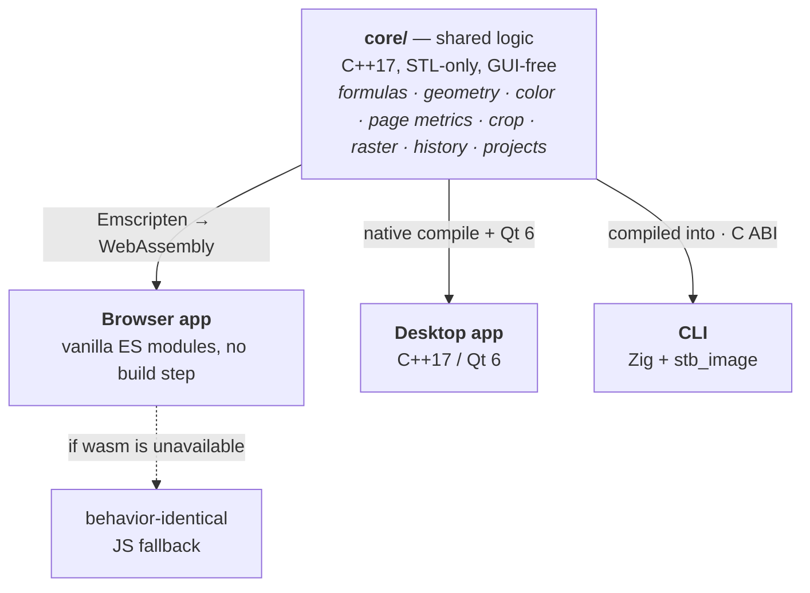

# Stencil

<p align="center">
  <a href="https://github.com/andrew1407/stencil/releases/tag/stencil-desktop"></a>
</p>

[](https://github.com/andrew1407/stencil/actions/workflows/ci.yml)
[](https://github.com/andrew1407/stencil/actions/workflows/release.yml)

An image annotation / drawing tool: load an image, draw polylines and rectangles over
it, edit points numerically, convert pixel coordinates to page (cm) coordinates with
optional `f(x,y)` formula transforms, and save your work.

Stencil ships as **three front-ends over one shared logic core**:

| App | Path | Stack | Docs |
|---|---|---|---|
| **Core** | [`core/`](core/) | C++17, STL-only, GUI-free shared library | [core/README.md](core/README.md) |
| **Browser** | [`browser/`](browser/) | Vanilla ES-module JS, no build step | [browser/README.md](browser/README.md) |
| **Desktop** | [`desktop/`](desktop/) | C++17 + Qt 6, CMake build | [desktop/README.md](desktop/README.md) |
| **CLI** | [`cli/`](cli/) | Zig, wraps the C++ core | [cli/README.md](cli/README.md) |

A companion **Chrome extension** ([`extension/`](extension/)) feeds the browser editor: it
lists, searches and filters every image on any web page and opens a chosen image in the
Stencil editor (new tab) — with a quick in-page crop modal. Manifest V3, vanilla JS, no
build step.



The front-ends deliberately mirror each other's architecture. The **pure, GUI-free logic**
— the formula parser, geometry, color, pixel↔page conversion, crop, a line rasteriser,
history, project storage and expiry — lives in `core/`, written dependency-free (STL only).
It is compiled to **WebAssembly** so **the browser app runs that same compiled C++ at runtime**
(formula parsing, geometry/hit-testing, page conversion, rotation, the custom duotone filter,
zoom clamping); that module (`browser/js/wasm/stencilCore.js`) is a generated artifact — built
in CI and on demand locally (see [core/WASM.md](core/WASM.md)), not committed — so each JS module
keeps a behavior-identical fallback that runs when wasm hasn't been built or fails to load, and
under `node --test`. The **CLI** compiles the same core directly and drives it over a small
`extern "C"` ABI for headless crop / rotate / blank / layout-draw / filter, leaving image codecs
and video-frame extraction to Zig.

## Repository layout

```
README.md             # this overview
core/                 # shared, GUI-free C++ logic library (sibling of the apps)
  geometry/           # geometry · cropGeometry · imageOps · rasterize
  color/              # color · colorNames · imageFilter
  parse/              # formulaParser · lengthTokens · cropSpec
  page/               # pageMetrics · tooltipRows · localeUnit · hotkeyFormat
  state/              # historyStack · projectsStore · zoomPan
  models.hpp          # shared Point / Line value types
  wasmApi.cpp         # extern "C" ABI compiled to WebAssembly for the browser
  cliApi.{h,cpp}      # extern "C" ABI consumed by the Zig CLI
  tests/              # Doctest suite
  third_party/        # vendored doctest.h (fetched on demand)
  CMakeLists.txt
  README.md           # the core's own overview, layout & design principles
  WASM.md             # how the core is built to wasm and wired into the browser
browser/              # the browser app
  index.html
  css/  js/  tests/
  js/wasm/            # generated wasm module, gitignored (built from core/; see WASM.md)
  package.json
  README.md
desktop/              # the desktop app (links the shared core via add_subdirectory)
  gui/                # Qt widgets (mirrors the browser UI)
  tests/              # Qt headless crop integration test
  CMakeLists.txt
  README.md
cli/                  # the command-line tool (Zig)
  build.zig  build.zig.zon
  src/                # args · pipeline · core ABI bridge · image/video/layout I/O
  README.md
extension/            # companion Chrome extension (MV3) for the browser editor
  manifest.json
  src/                # background / popup / crop / options / lib
  tests/              # node:test unit tests (pure filtering + crop geometry)
  package.json
  README.md
```

## Development

**Dependency policy:** the C++ core and apps keep a tiny dependency surface — **Qt 6**
(desktop GUI) and **Doctest** (C++ tests); the browser app stays dependency-free with no
build step. The **CLI** adds **Zig** and the public-domain **stb_image** single-header
codecs (compiled from source, no native dependency); it fetches URLs with Zig's built-in
HTTP client (native TLS) and shells out to the system **ffmpeg** only for video input
(optional). The core itself remains STL-only.

- Build & test the shared core → [core/README.md](core/README.md) (`cmake -S core -B core/build && ctest --test-dir core/build`)
- Build & run the browser app → [browser/README.md](browser/README.md)
- Build, test & run the desktop app → [desktop/README.md](desktop/README.md)
- Build, test & run the CLI → [cli/README.md](cli/README.md)
- Load & test the Chrome extension → [extension/README.md](extension/README.md)

**Docker.** The two deployable front-ends ship a multi-stage `Dockerfile`
([`browser/`](browser/Dockerfile) — wasm build + nginx; [`cli/`](cli/Dockerfile) — Zig
build + ffmpeg runtime). Both compile `core/`, so **build from the repo root**:

```bash
docker build -f browser/Dockerfile -t stencil-browser . && docker run --rm -p 8080:80 stencil-browser
docker build -f cli/Dockerfile -t stencil-cli . && docker run --rm -v "$PWD:/work" -w /work stencil-cli --help
```
