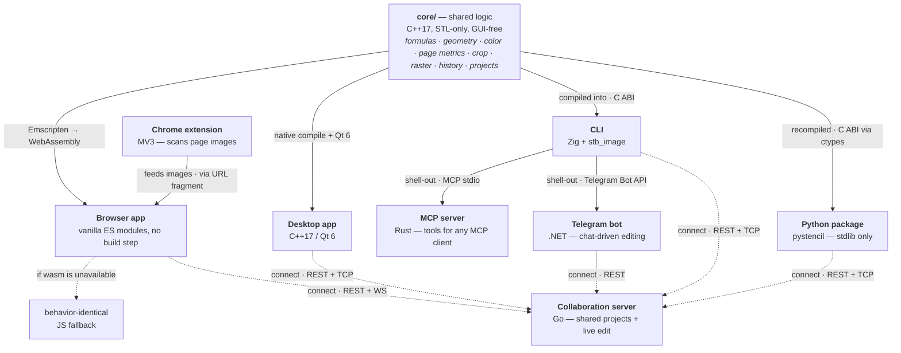

# Stencil

<p align="center">
  <a href="https://andrew1407.github.io/stencil/"></a>
</p>

[](https://github.com/andrew1407/stencil/actions/workflows/ci.yml)
[](https://github.com/andrew1407/stencil/actions/workflows/desktop-packages.yml)
[](https://github.com/andrew1407/stencil/actions/workflows/pages.yml)

An image annotation / drawing tool: load an image, draw polylines and rectangles over
it, edit points numerically, convert pixel coordinates to page (cm) coordinates with
optional `f(x,y)` formula transforms, and save your work.

Stencil ships as **one shared logic core with a family of front-ends and services**:

| App | Path | Stack | Docs |
|---|---|---|---|
| **Core** | [`core/`](core/) | C++17, STL-only, GUI-free shared library | [core/README.md](core/README.md) |
| **Browser** | [`browser/`](browser/) | Vanilla ES-module JS, no build step (optional single-file bundle) | [browser/README.md](browser/README.md) |
| **Desktop** | [`desktop/`](desktop/) | C++17 + Qt 6, CMake build | [desktop/README.md](desktop/README.md) |
| **CLI** | [`cli/`](cli/) | Zig, wraps the C++ core | [cli/README.md](cli/README.md) |
| **Python** | [`pystencil/`](pystencil/) | Stdlib-only Python, drives the C++ core via ctypes (no third-party deps) | [pystencil/README.md](pystencil/README.md) |
| **MCP server** | [`mcp/`](mcp/) | Rust, exposes the CLI's pipeline as MCP tools | [mcp/README.md](mcp/README.md) |
| **Collaboration server** | [`server/`](server/) | Go, stores/shares projects + live multi-client edit sessions (WS/TCP, Postgres) | [server/README.md](server/README.md) |
| **Telegram bot** | [`bot/`](bot/) | .NET (C#), clean architecture; chat-driven editing — shells out to the CLI + speaks the server REST | [bot/README.md](bot/README.md) |

A companion **Chrome extension** ([`extension/`](extension/)) feeds the browser editor: it
lists, searches and filters every image on any web page and opens a chosen image in the
Stencil editor (new tab) — with a quick in-page crop modal. Manifest V3, vanilla JS, no
build step.

Every surface also carries an **AI assistant** — describe an edit in words and a model you
point Stencil at plans it. Setup guide: [AI assistant — setting up a model](#ai-assistant--setting-up-a-model).

## Architecture


```mermaid
graph TD
    CORE["<b>core/</b> — shared logic<br/>C++17, STL-only, GUI-free<br/><i>formulas · geometry · color · page metrics · crop · raster · history · projects</i>"]
    CORE -->|"Emscripten → WebAssembly"| WEB["<b>Browser app</b><br/>vanilla ES modules, no build step"]
    CORE -->|"native compile + Qt 6"| DESK["<b>Desktop app</b><br/>C++17 / Qt 6"]
    CORE -->|"compiled into · C ABI"| CLI["<b>CLI</b><br/>Zig + stb_image"]
    CORE -->|"recompiled · C ABI via ctypes"| PY["<b>Python package</b><br/>pystencil — stdlib only"]
    WEB -.->|"if wasm is unavailable"| FB["behavior-identical<br/>JS fallback"]
    EXT["<b>Chrome extension</b><br/>MV3 — scans page images"] -->|"feeds images · via URL fragment"| WEB
    CLI -->|"shell-out · MCP stdio"| MCP["<b>MCP server</b><br/>Rust — tools for any MCP client"]
    CLI -->|"shell-out · Telegram Bot API"| BOT["<b>Telegram bot</b><br/>.NET — chat-driven editing"]
    WEB -.->|"connect · REST + WS"| SRV["<b>Collaboration server</b><br/>Go — shared projects + live edit"]
    DESK -.->|"connect · REST + TCP"| SRV
    CLI -.->|"connect · REST + TCP"| SRV
    PY -.->|"connect · REST + TCP"| SRV
    BOT -.->|"connect · REST"| SRV
```

> **Per-surface diagrams:** [core](core/README.md#architecture) · [browser](browser/README.md#architecture) · [desktop](desktop/README.md#architecture) · [cli](cli/README.md#architecture) · [python](pystencil/README.md#architecture) · [extension](extension/README.md#architecture) · [mcp](mcp/README.md#architecture) · [bot](bot/README.md#architecture) · [server](server/README.md#architecture) · [e2e](e2e/README.md#architecture). The cross-surface [`e2e/`](e2e/) harness drives the built artifacts, not a runtime component, so it isn't shown as a node above.

The front-ends deliberately mirror each other's architecture. The **pure, GUI-free logic**
— the formula parser, geometry, color, pixel↔page conversion, crop, a line rasteriser,
history, project storage and expiry — lives in `core/`, written dependency-free (STL only).
It is compiled to **WebAssembly** so **the browser app runs that same compiled C++ at runtime**
(formula parsing, geometry/hit-testing, page conversion, rotation, the custom duotone filter,
zoom clamping); that module (`browser/js/wasm/stencilCore.js`) is a generated artifact — built
in CI and on demand locally (see [core/WASM.md](core/WASM.md)), not committed — so each JS module
keeps a behavior-identical fallback that runs when wasm hasn't been built or fails to load, and
under `node --test`. The **CLI** compiles the same core directly and drives it over a small
`extern "C"` ABI for headless crop / rotate / blank / layout-draw / filter, leaving image codecs
and video-frame extraction to Zig.

## Repository layout

```
README.md             # this overview
core/                 # shared, GUI-free C++ logic library (sibling of the apps)
  geometry/           # geometry · cropGeometry · imageOps · rasterize
  color/              # color · colorNames · imageFilter
  parse/              # formulaParser · lengthTokens · cropSpec
  page/               # pageMetrics · tooltipRows · localeUnit · hotkeyFormat
  state/              # historyStack · projectsStore · zoomPan
  models.hpp          # shared Point / Line value types
  wasmApi.cpp         # extern "C" ABI compiled to WebAssembly for the browser
  cliApi.{h,cpp}      # extern "C" ABI consumed by the Zig CLI
  tests/              # Doctest suite
  third_party/        # vendored doctest.h (fetched on demand)
  CMakeLists.txt
  README.md           # the core's own overview, layout & design principles
  WASM.md             # how the core is built to wasm and wired into the browser
browser/              # the browser app
  index.html
  css/  js/  tests/
  js/wasm/            # generated wasm module, gitignored (built from core/; see WASM.md)
  package.json
  README.md
desktop/              # the desktop app (links the shared core via add_subdirectory)
  src/                # Qt GUI by role: app · canvas · dialogs · io · net · support
  tests/              # Qt offscreen headless tests + the QtTest MainWindow GUI e2e
  resources/  packaging/
  CMakeLists.txt
  README.md
cli/                  # the command-line tool (Zig)
  build.zig  build.zig.zon
  src/                # args · pipeline · core ABI bridge · image/video/layout I/O
  README.md
pystencil/            # stdlib-only Python package — drives core/ via ctypes (no deps)
  build.py            # compiles core/ + cliApi.cpp into a shared lib for ctypes
  pystencil/          # core binding · codecs · image · layout · editor · server · cli
  tests/              # codecs · layout · core · editor · server · cli (unittest)
  README.md
mcp/                  # Model Context Protocol server (Rust) — wraps the CLI
  Cargo.toml
  src/                # server · args · pipeline · locate · layout · outcome
  tests/              # argv mapping · stderr parsing · gated end-to-end
  Dockerfile
  README.md
server/               # collaboration server (Go) — stores/shares projects + live edit
  cmd/stencil-server/ # entry point (HTTP/WS + raw-TCP listeners)
  internal/           # protocol · config · auth · filestore · store · bus · redisbus · transport · httpapi · hub
  Dockerfile  .env.example
  README.md
extension/            # companion Chrome extension (MV3) for the browser editor
  manifest.json
  src/                # background / popup / crop / options / lib
  tests/              # node:test unit tests (pure filtering + crop geometry)
  package.json
  README.md
bot/                  # Telegram bot (.NET, clean architecture) — wraps the CLI + server REST
  src/                # Domain · Application · Infrastructure · Bot (host)
  tests/              # xUnit suite (offline: no token/server/CLI/Redis)
  assets/             # raster icon + 640×360 description photo for @BotFather
  .env.example  README.md
e2e/                  # cross-surface Playwright smoke harness (drives the REAL artifacts)
  helpers/  fixtures/ # static server + stack compose + boot/REST/WS-TCP wire clients
  tests/              # browser · extension · fullstack · server · cli flows
  playwright.config.js  package.json  README.md
```

> The **desktop app's own end-to-end test** is a QtTest target that lives with the desktop
> build (`desktop/tests/mainWindow.gui.cpp`), not in `e2e/` — it drives the real `MainWindow`
> offscreen. The `e2e/` harness covers the browser, extension, and server surfaces.

## Development

**Dependency policy:** the C++ core and apps keep a tiny dependency surface — **Qt 6**
(desktop GUI) and **Doctest** (C++ tests); the browser app stays dependency-free with no
build step. The **CLI** adds **Zig** and the public-domain **stb_image** single-header
codecs (compiled from source, no native dependency); it fetches URLs with Zig's built-in
HTTP client (native TLS) and shells out to the system **ffmpeg** only for video input
(optional). The core itself remains STL-only.

- Build & test the shared core → [core/README.md](core/README.md) (`cmake -S core -B core/build && ctest --test-dir core/build`)
- Build & run the browser app → [browser/README.md](browser/README.md)
- Build, test & run the desktop app → [desktop/README.md](desktop/README.md)
- Build, test & run the CLI → [cli/README.md](cli/README.md)
- Build & test the Python package → [pystencil/README.md](pystencil/README.md) (`cd pystencil && python3 build.py && python3 -m unittest discover -s tests`)
- Build, test & run the MCP server → [mcp/README.md](mcp/README.md)
- Build, test & run the Telegram bot → [bot/README.md](bot/README.md) (`cd bot && dotnet test Stencil.TelegramBot.slnx`)
- Load & test the Chrome extension → [extension/README.md](extension/README.md)
- Run the cross-surface e2e smoke harness → [e2e/README.md](e2e/README.md) (`cd e2e && npm test`; UI-only: `npm run test:ui`, full stack: `E2E_STACK=1 npm test`)

**Docker.** Five subprojects ship a multi-stage `Dockerfile`
([`browser/`](browser/Dockerfile) — wasm build + nginx; [`cli/`](cli/Dockerfile) — Zig
build + ffmpeg runtime; [`mcp/`](mcp/Dockerfile) — Zig CLI + Rust server;
[`bot/`](bot/Dockerfile) — Zig CLI + .NET Telegram bot; [`server/`](server/Dockerfile) —
Go collaboration server). The first four compile `core/`, so **build them from the repo
root** (note the `-f`); the **server** image builds from its own `./server` context (a
standalone Go module — it does not compile `core/`):

```bash
docker build -f browser/Dockerfile -t stencil-browser . && docker run --rm -p 8080:80 stencil-browser
docker build -f cli/Dockerfile -t stencil-cli . && docker run --rm -v "$PWD:/work" -w /work stencil-cli --help
docker build -f mcp/Dockerfile -t stencil-mcp . && docker run --rm -i -v "$PWD:/work" -w /work stencil-mcp
docker build -f bot/Dockerfile -t stencil-bot . && docker run --rm -e TELEGRAM_BOT_TOKEN=123:abc stencil-bot
docker build -t stencil-server ./server   # server builds from its own context, not the repo root
```

For the full local stack — Postgres + Redis + the collaboration server (plus the browser
app and an on-demand `mcp` profile) — the repo-root [`docker-compose.yml`](docker-compose.yml)
wires it together; it also backs the full-stack [`e2e/`](e2e/) suite:

```bash
docker compose up --build server   # collab server on :8090 (REST/WS) + :8091 (TCP), with its db/redis
```

## AI assistant — setting up a model

Every surface ships an **LLM assistant**: you describe an edit in words ("make it sepia and
crop 10% off each side", "give me 3 variants: rotated, tinted, contoured", "extract the lines
from this image") and the model answers with a validated *op-plan* that runs through the very
same operations the toolbar / CLI flags use. Stencil ships **no model and no API key** — you
point it at one. Three provider choices, identical everywhere:

| Provider | What it is | Default endpoint |
|---|---|---|
| `ollama` | a local [Ollama](https://ollama.com) daemon (native `/api/chat`) | `http://localhost:11434` |
| `openai-compat` | any OpenAI-style local server — LM Studio, `llama.cpp`, vLLM | `http://localhost:1234/v1` |
| `stencil-server` | Anthropic Claude proxied by a [collaboration server](server/) — the key stays server-side | your configured server URL |

The GUI surfaces (browser, desktop, extension) additionally offer **`none` — assistant off**:
nothing is probed or sent, and the assistant UI *disappears* (no sparkle button, no
**Assistant ▸** context-menu entry, no extension Assistant section) rather than sitting there
unable to answer. It is a client-side switch and never appears on any wire.

Conversations are session-only unless you opt in to **chat persistence** (contract §12,
off by default on every surface): the browser and desktop offer a "Save chats with
projects" toggle, the cli/pystencil consoles a `/chat on|off|clear` command, and the bot
`/chat save on|off` — the conversation (text only, most recent 32 turns) is then stored
with the project, restored on reopen, kept on the collaboration server for server-hosted
projects, and deleted with the project or by the surface's clear action. Incognito
sessions never persist chats.

The full spec is [`llm-contract.md`](llm-contract/llm-contract.md) — the op-plan schema, runtime
rules and the normative JSON assets (op registry, system prompt, provider constants) —
with providers/wire mappings in [`llm-contract/llm-providers.md`](llm-contract/llm-providers.md), the
per-surface op profiles in [`llm-contract/llm-profiles.md`](llm-contract/llm-profiles.md), and
ask-cards/chat persistence in [`llm-contract/llm-chat.md`](llm-contract/llm-chat.md). This section is
the setup guide.

### 1. Ollama (local, the default)

Install it from [ollama.com/download](https://ollama.com/download), then:

```bash
ollama serve                      # daemon on http://localhost:11434
ollama pull llama3.2-vision       # or: qwen2.5vl · llava — models that can SEE the image
ollama list                       # confirm what is installed
```

**Pick a vision-capable model.** Every turn ships the image you are working on, but a
text-only model (`llama3.2`, `mistral`, …) cannot see it: it is dropped, the chat says so, and
the turn is retried without it — so "crop 10% off each side" still works while "outline the
rabbit's head" or "what's in this photo?" needs a model that can see.

Then set **provider `ollama`**, base URL `http://localhost:11434`, model `llama3.2-vision`
(see [per-surface configuration](#4-per-surface-configuration)).

**Browser app only — CORS.** The browser calls Ollama from a page origin, so the daemon has to
allow it:

```bash
OLLAMA_ORIGINS='http://localhost:8080' ollama serve   # the origin `npm run serve` uses
```

Nothing else needs this: the Chrome extension reaches providers through its host permissions,
and the desktop / CLI / pystencil / bot / mcp clients aren't browsers.

### 2. OpenAI-compatible (LM Studio, llama.cpp, vLLM)

Start whichever server you have, note its port, and use a base URL that **ends in `/v1`** —
the clients append `/chat/completions` to it (contract §6.2):

```bash
# LM Studio: load a vision model → Developer tab → Start Server   →  http://localhost:1234/v1
llama-server -m ./model.gguf --host 127.0.0.1 --port 1234         #  http://localhost:1234/v1
vllm serve Qwen/Qwen2.5-VL-7B-Instruct --port 8000                #  http://localhost:8000/v1
```

Leave the model field empty to use whatever the server has loaded, or name it explicitly. The
optional **API key** (LM Studio and llama.cpp need none; a hosted OpenAI-compatible endpoint
does) goes in the surface's API-key field / `STENCIL_LLM_API_KEY` — it is sent as
`Authorization: Bearer …` on this provider only.

**Browser app only:** flip LM Studio's **"enable CORS"** switch in its server settings, same
reason as `OLLAMA_ORIGINS` above.

### 3. Stencil collaboration server (Anthropic proxy)

Give the [Go server](server/) an Anthropic key and it proxies chat turns for every client
that connects to it — the key **never leaves the server**, and clients authenticate with the
bearer token they already have for it.

```bash
cd server
cp .env.example .env       # then set DATABASE_URL + the LLM keys below
go run ./cmd/stencil-server
```

Server-side env keys ([`server/.env.example`](server/.env.example), see
[server/README.md → LLM proxy](server/README.md#llm-proxy)):

| Key | Default | Meaning |
|---|---|---|
| `ANTHROPIC_API_KEY` | *(empty)* | **empty = proxy disabled**; the only place the key lives |
| `LLM_MODEL` | `claude-opus-5` | default model when a request names none |
| `LLM_BASE_URL` | `https://api.anthropic.com` | Anthropic API base |
| `LLM_MAX_TOKENS` | `8192` | cap; a request's `maxTokens` is clamped to it |
| `LLM_TIMEOUT_SECONDS` | `120` | outbound request timeout |

In each client, connect to the server as usual, then pick provider **`stencil-server`** and
point it at that server's URL (the first configured connection is pre-filled). Auth reuses the
stored connection's token; `mcp/` has no connection store, so it takes an explicit
`STENCIL_LLM_SERVER_TOKEN`; the CLI console and the bot fall back to that key when no
`/connect`-ed server matches. With no `ANTHROPIC_API_KEY` set, `GET /llm/info` reports
`{"enabled":false,"model":""}` and `POST /llm/chat` answers `503 {"code":"llmDisabled"}`.

### 4. Per-surface configuration

| Surface | Where you set it | Stored as |
|---|---|---|
| [browser](browser/README.md) | open the chat (sparkle toolbar button, `Alt+G`, or **Assistant ▸** in the canvas right-click menu) → the input row's **…** menu ▸ **Settings** (or `Alt+Shift+G` anywhere) → assistant settings modal; scriptable as `stencil.llm` / `stencil.openAssistantSettingsWindow()` | `localStorage` key `drawingApp_llmSettings` |
| [desktop](desktop/README.md) | the chat dock's **…** menu ▸ **Settings** (or `Alt+Shift+G`, **View ▸ AI Assistant Settings…**) → **Assistant** dialog, or **Settings ▸ AI assistant** (same fields, same keys) | settings JSON: `llmProvider`, `llmBaseUrl`, `llmModel`, `llmApiKey`, `llmServerUrl` |
| [extension](extension/README.md) | **Options → AI assistant** | `chrome.storage.local` key `llmSettings` (+ `serverToken`) |
| [cli](cli/README.md) | `STENCIL_LLM_*` env for the initial values; `/llm provider\|url\|model\|key\|server <value>` overrides in-session (bare `/llm` prints the config, secrets masked). Ask with `/prompt` (`/p`) | env + session state |
| [pystencil](pystencil/README.md) | same `STENCIL_LLM_*` env and the same console `/llm` + `/prompt` commands; in code, `LlmConfig(provider=…, model=…)` (env fallback via `LlmConfig.from_env()`) | env / `LlmConfig` args |
| [bot](bot/README.md) | `STENCIL_LLM_*` (+ `STENCIL_LLM_SERVER_TOKEN` when the pinned server should authenticate every user) in `bot/.env` ([template](bot/.env.example)). Ask with `/prompt` (`/p`) or `/chat` mode | env/`.env` |
| [mcp](mcp/README.md) | `STENCIL_LLM_*` + `STENCIL_LLM_SERVER_TOKEN` in `mcp/.env` ([template](mcp/.env.example)); per-call `provider`/`base_url`/`model` overrides on `stencil_prompt` | env/`.env` |

The env family is the same everywhere it applies: `STENCIL_LLM_PROVIDER`,
`STENCIL_LLM_BASE_URL`, `STENCIL_LLM_MODEL`, `STENCIL_LLM_API_KEY`, `STENCIL_LLM_SERVER_URL`
(plus `STENCIL_LLM_SERVER_TOKEN` for cli/mcp/bot). For example:

```bash
export STENCIL_LLM_PROVIDER=ollama
export STENCIL_LLM_BASE_URL=http://localhost:11434
export STENCIL_LLM_MODEL=llama3.2-vision
cd cli && ./zig-out/bin/stencil --console        # then: /prompt make it sepia
```

### 5. Verify it works

Probe the endpoint first — these are the same URLs the clients' status probes hit:

```bash
curl http://localhost:11434/api/tags            # ollama: the models you pulled
curl http://localhost:11434/api/version         # ollama: what the status dot checks
curl http://localhost:1234/v1/models            # openai-compat: the loaded model(s)
curl -H "Authorization: Bearer $TOKEN" http://localhost:8090/llm/info   # {"enabled":true,"model":"claude-opus-5"}
```

Then send a first prompt against a loaded image — `make it sepia` is the smallest end-to-end
check (browser/desktop chat, `/prompt make it sepia` in the CLI, pystencil console or bot).
A healthy setup looks like:

- **browser** — the composer's gear shows a **green** dot and a status card reading
  `Provider: Ollama · Endpoint: localhost:11434 · Model: llama3.2-vision · Status: Connected — v0.5.7`
  (amber = still probing, red = unreachable/off).
- **desktop** — the same dot on the dock's settings gear.
- **cli / pystencil** — a bare `/llm` prints the resolved provider, URL and model (API key masked).
- Any surface: the reply text appears **and** the image changes (or variants come back as extra
  images) — a reply with no JSON object is just chat and edits nothing, by design.

### 6. Troubleshooting

| Symptom | Cause / fix |
|---|---|
| Browser only: status red, DevTools shows a **CORS** error | The local provider isn't allowing the app's origin. Restart with `OLLAMA_ORIGINS='http://localhost:8080' ollama serve`, or enable LM Studio's CORS switch. Other surfaces are unaffected. |
| The model chats fine but ignores the picture ("I can't see an image") | The model isn't **vision-capable** — `ollama pull llama3.2-vision` (or `qwen2.5vl` / `llava`), or load a vision model in LM Studio. |
| `openai-compat` returns **404** on every turn | The base URL is missing `/v1` — it must be `http://host:port/v1`, since `/chat/completions` is appended. |
| `ollama` returns 404 | The opposite mistake: Ollama's base URL takes **no** `/v1` (it uses the native `/api/chat`). |
| `503 llmDisabled` from a collaboration server | No `ANTHROPIC_API_KEY` in *that server's* environment. Check `GET /llm/info`; set the key and restart the server. |
| Turns hang or time out | First run on a local model can be slow (weights load on demand); for the server proxy raise `LLM_TIMEOUT_SECONDS`. The status probe's own short timeout only affects the dot, not a turn in flight. |
| No assistant UI at all — no sparkle button, no **Assistant ▸** entry | The provider is **`none` (assistant off)**. Pick a real provider in the settings modal / Options; the UI comes back live, no reload. |
| mcp: "https rejected" | `mcp/`'s hand-rolled transport is **plain-http only** — use a local provider or an `http://` collaboration server (which does the TLS hop to Anthropic itself). |

## Claude Code integration

This repo ships a Claude Code **skill** and **agent** for driving Stencil from the editor:

- **`/stencil` skill** ([`.claude/skills/stencil/SKILL.md`](.claude/skills/stencil/SKILL.md)) —
  headless image/video editing via the Zig CLI (`cli/`), which wraps the shared C++ `core/`.
  Crop, rotate (quarter-turns), tint/filter (b&w / sepia / duotone), draw a layout, grab a
  video frame, or make a blank page — for one or more local files or `http(s)` URLs. Because
  it uses the same core, results match the browser and desktop editors.
- **`stencil-operator` agent** ([`.claude/agents/stencil-operator.md`](.claude/agents/stencil-operator.md)) —
  drives any Stencil front-end end-to-end: the headless CLI, the Qt desktop app, the browser
  editor, and the Chrome extension. It prefers the frozen `window.stencil` scripting facade
  over clicking through the UI, picks the right surface for each request, and can scan/mark
  page images, apply layouts, and save projects.

For a tool-protocol integration that works with **any** MCP client (Claude Code, Claude
Desktop, or your own agent), the **MCP server** ([`mcp/`](mcp/)) exposes the same editing
pipeline as `stencil_edit` / `stencil_probe` tools over stdio — register it with
`claude mcp add stencil -- /path/to/stencil-mcp`. See [mcp/README.md](mcp/README.md).
