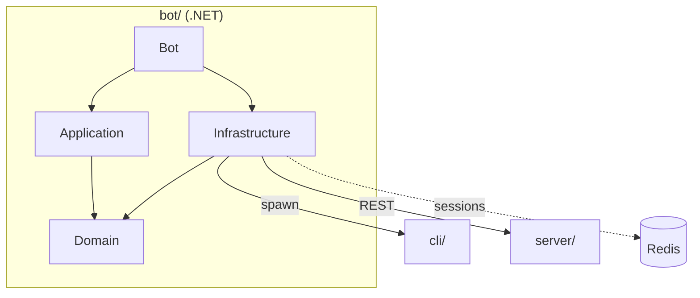
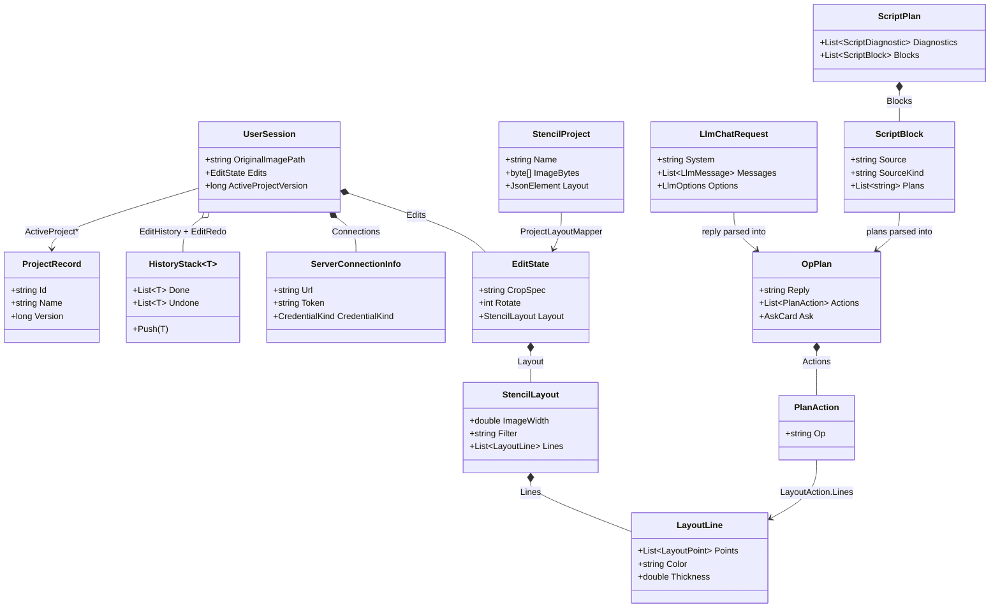

# Telegram bot architecture

The system-wide design — the parity contract, canonical data, the layer model, the pattern vocabulary — is in the root [`ARCHITECTURE.md`](../ARCHITECTURE.md).

A **thin adapter, not a core consumer**: every pixel transform is a shell-out to the Zig CLI,
projects go over the server's REST. It never links or recompiles `core/`; its contracts are
the CLI's flags + stderr grammar ([`cli/CONTRACT.md`](../cli/CONTRACT.md)) and
`server/internal/protocol`.

## Layers

`Domain` ← `Application` ← `Infrastructure` ← `Bot`: four projects under
`src/Stencil.TelegramBot.<Ring>/`, dependencies pointing inward. `Domain` has no project
references and stays free of Telegram, HTTP and process types. Enforced by the `.csproj`
`ProjectReference`s and by `tests/…/LayerBoundaryTests.cs`, which reads every `using` line and
forbids `Telegram.Bot`, `System.Net.Http`, `System.Diagnostics.Process` and
`StackExchange.Redis` inside `Domain`.

- `Domain`: the frozen contract; pure C#.
- `Application`: policy only; depends on Domain abstractions, never on an adapter.
- `Infrastructure`: depends only on Domain; every CLI run passes `--confine-output`.
- `Bot`: the only ring that sees Telegram types; strings and commands come from the assets,
  never literals.

## Where things go

| Path | Holds | Rule |
|---|---|---|
| `src/Stencil.TelegramBot.Domain/Editing/` | `EditState`, `HistoryStack<T>`, `CropSpecResolver`, `EditRequest`, `RenderResult`, `BlankSpec`, `ScrapeRequest`/`ScrapeResult`, `ColorSpec` | value objects; no I/O |
| `src/Stencil.TelegramBot.Domain/Layout/` | `StencilLayout`, `LayoutLine`, `LayoutPoint`, `LineStyle`, `StencilLayoutParser` | the CLI `--layout` shape; per-line defaults pinned to the other front-ends |
| `src/Stencil.TelegramBot.Domain/Project/`, `Projects/` | `StencilProject` + `StencilProjectFile` (the `.stencil` bundle), `ProjectRecord`, `ProjectFull`, `Create`/`UpdateProjectRequest`, `ProjectFileKind` | mirrors of `projectFile.js` and `server/internal/protocol` |
| `src/Stencil.TelegramBot.Domain/Llm/` (+ `Wire/`) | `OpPlan`, `OpVariant`, the `PlanAction` union, `AskCard`, `LlmProfile`, `ChatDocument`, `LlmGate`, `ScriptPlan`/`ScriptBlock`/`ScriptDiagnostic`, and under `Wire/` the request and reply shapes a provider is spoken to in — `ILlmClient`, `LlmChatRequest`/`LlmMessage`/`LlmReply`, `LlmOptions`, `LlmImage`, `LlmException`, `ProvidersAsset` | the contract's types; no wire format |
| `src/Stencil.TelegramBot.Domain/Sessions/` | `UserSession`, `ServerConnectionInfo`, `ServerHandshake`, `CredentialKind`, `PendingInputs` | one JSON value per user; paths, never bytes |
| `src/Stencil.TelegramBot.Domain/Abstractions/`, `Configuration/` | `IStencilCli`, `IStencilServerClient(+Factory)`, `ISessionStore`, `IUserWorkspace`, `IImageDownscaler`, `IBotPolicy` | the ports the adapters implement |
| `src/Stencil.TelegramBot.Domain/Serialization/`, `Exceptions/` | `StencilJson` (one camelCase serializer), `JsonRead`; `StencilCliException`, `ServerException` | every JSON goes through `StencilJson` |
| `src/Stencil.TelegramBot.Application/Editing/` | `EditingService` (one base image + a replayable `EditState`), `EditSessions`, `ProjectFileService`, `VideoFrames`, `RemoteImageUrl` (the surface's fetch guard), `ImageDimensionReader` | every render replays the state through `IStencilCli` |
| `src/Stencil.TelegramBot.Application/Servers/` | `ServerService` (connect/list/fetch/create/save/sync, one partial per concern), `ProjectLayoutMapper`/`Writer`, `InviteLink`, `ServerProjectInfo` | a port of pystencil's `ConnectionManager` + `remoteSync`; version-guarded writes |
| `src/Stencil.TelegramBot.Application/Llm/` (+ `Schema/`, `Plan/`) | `PromptService` (one partial per turn concern), `ScriptService`, `LlmAttachmentLoader`, `SystemPromptAsset`; `Schema/` is the table-driven validator (`OpSchema` over `SchemaJson`/`SchemaLoader`/`SchemaPath` and the key, native and presence rules), `Plan/` the plan itself (`OpPlanParser`, `OpRegistry`, `PlanFrameMapper`, `ActionContext`) | the validator is table-driven from the embedded `opRegistry.json` |
| `src/Stencil.TelegramBot.Infrastructure/Cli/`, `Processes/` | `ProcessStencilCli` + `CliArgvBuilder` + `CliOutcomeParser` (ports of the mcp adapters), `StencilCliLocator`, `ProcessRunner` | `NO_COLOR=1`; spawned in the output folder with `--confine-output`, except `--script-plan`, which writes nothing |
| `src/Stencil.TelegramBot.Infrastructure/Server/` | `HttpStencilServerClient` (a port of the pystencil client), `StencilServerClientFactory`, `UrlNormalizer` | REST only; every non-2xx is a `ServerException` |
| `src/Stencil.TelegramBot.Infrastructure/Llm/` | `HttpLlmClient` + one `IProviderMapping` per wire shape (`OllamaMapping`, `OpenAiMapping`, `StencilServerMapping`) | the platform's `HttpClient`; endpoint from configuration only |
| `src/Stencil.TelegramBot.Infrastructure/Sessions/`, `Workspace/` | `InMemorySessionStore`, `RedisSessionStore`; `UserWorkspace` (`<DataDir>/<userId>/<guid>`), `TempFiles` | Redis when `REDIS_URL` is set, else memory |
| `src/Stencil.TelegramBot.Infrastructure/Configuration/`, `Links/`, `Media/` | `DotEnv`/`BotOptions`/`RedisConnectionString`; `DeepLinkCodec`, `DesktopLinkBuilder`, `LayoutFetcher`; `FfmpegImageDownscaler` | operator environment in, never chat text |
| `src/Stencil.TelegramBot.Bot/` | `Program` + `BotComposition` (the DI root), `UpdatePump` | `Program` registers nothing else |
| `src/Stencil.TelegramBot.Bot/Telegram/` (+ `Commands/`, `Intake/`, `Messaging/`, `Access/`, `Sync/`) | `UpdateRouter` and `MessageRouter` at the top, then the update's path through it: `Commands/` parses and handles a verb (`CommandHandlers` partials by group, `CommandParser`, the argument and format tables), `Intake/` takes in photos, albums and documents, `Messaging/` speaks back (`Replies`, `Keyboards`, `BotStrings`, the callback tokens and card taps), `Access/` decides who may and what a failure says, `Sync/` keeps a workspace current | the only code that sees `Telegram.Bot` |
| `src/Stencil.TelegramBot.Bot/Assets/` | `botCommands.json`, `botStrings.json` | `<EmbeddedResource>`s; the dispatch table, the `/` menu and every reply |
| `tests/` | xUnit, offline: `Doubles/` (the shared mocks), `Goldens/` (rendered text, byte-pinned), `BenchTests` (opt-in) | never reads `TELEGRAM_BOT_TOKEN`; no server, CLI or Redis |

## Entities

| Entity | What it is | Owned by / lifetime | Relates to |
|---|---|---|---|
| `UserSession` | Everything the bot remembers about one Telegram user: base image path and size, edits, undo/redo snapshots, connections, the active server project, chat flags | `ISessionStore`; until `/drop` or a reset | `EditState`, `ServerConnectionInfo`, the active `ProjectRecord` fields |
| `EditState` | Editing intent, not pixels: crop spec, quarter-turns, filter, page format, formulas, the drawn layout and the pen | `UserSession.Edits`; replaced immutably on every edit | `StencilLayout`, `LineStyle`; replayed into an `EditRequest` |
| `HistoryStack<T>` | The bot's shape of `core/state/HistoryStack.hpp`: two bounded lists (25 per side); every step returns a new stack plus the snapshot to apply | projected from `EditHistory`/`EditRedo` by `EditSessions`, per call | `EditState` |
| `StencilLayout` | The JSON the CLI's `--layout` consumes, coordinates in image pixels | `EditState.Layout`; serialized to a workspace file per render | `LayoutLine`; canonical shape is the browser's layout payload |
| `LayoutLine` | One polyline with color, thickness, point size, style and fill; defaults pinned to the other front-ends | inside a `StencilLayout` or a `LayoutAction` | `LayoutPoint` |
| `ServerConnectionInfo` | One remembered server: normalized URL, session token, the connect credential and its kind, TLS flag | `UserSession.Connections`; until `/disconnect` | `HttpStencilServerClient` is rebuilt from it per call |
| `ProjectRecord` | A mirror of `server/internal/protocol` `ProjectRecord`; `Version` is the LWW counter | returned by `IStencilServerClient`; the active one is flattened into `UserSession` | `ProjectFull`, `Update`/`CreateProjectRequest` |
| `StencilProject` | The portable `.stencil` bundle: name, metadata, original image bytes, the raw layout | built/parsed by `StencilProjectFile` for `/project` and document uploads | `EditState` via `ProjectLayoutMapper`; canonical is the browser's `projectFile.js` |
| `OpPlan` | A validated model reply: text, top-level actions, up to 16 `OpVariant`s, an optional `AskCard` | produced by `OpPlanParser`; lives for one turn | `PlanAction`; canonical is `browser/js/config/llm/opRegistry.json` |
| `PlanAction` | The op-plan action union (`CropAction`, `RotateAction`, `LayoutAction`, `SaveAction`, `ConnectAction`, ...), one record per `Op` | inside an `OpPlan` | dispatched through `OpRegistry.HandlerFor` |
| `ScriptPlan` | One `.stc` as the CLI lowered it: the diagnostics, and — only when there is no error — one `ScriptBlock` per `@source`, each carrying its chunked op-plan actions as raw JSON | produced by `CliOutcomeParser.ParseScriptPlan`; lives for one `/script` run | `ScriptBlock`, `ScriptDiagnostic`; the envelope is `cli/CONTRACT.md` §5 |
| `ScriptBlock` | One block's source, its kind (`project`/`url`, or a `file`/`dir`/`glob` the bot refuses) and its plans | inside a `ScriptPlan` | each plan is parsed by `OpPlanParser` into an `OpPlan` |
| `LlmChatRequest` | The system prompt plus the full replayed history, the current turn last, the resolved server URL/token and the picked `LlmOptions` | built by `PromptService.BuildTurn`; one per model round | `LlmMessage`, `LlmImage`; mapped by an `IProviderMapping`; persisted as a `ChatDocument` |

## Patterns

| Pattern | Where | Notes |
|---|---|---|
| Ports & Adapters | `Domain/Abstractions/*` (`IStencilCli`, `IStencilServerClient`, `ISessionStore`, `IUserWorkspace`, `ILlmClient`, `IBotPolicy`) ← `Infrastructure/*` | the rings themselves; the tests swap every port for a `Doubles/Mock*` |
| Adapter | `CliArgvBuilder.BuildArgv`/`BuildScriptPlanArgv`, `CliOutcomeParser.ParseWrote`/`ParseRemotes`/`ParseScriptPlan`, `ProcessStencilCli` | a typed `EditRequest` to the CLI's documented flags and back; ports of `mcp/src/{args,outcome,pipeline}.rs` |
| Command | `HistoryStack<EditState>.Push`/`Undo`/`Redo` via `EditSessions.WithHistory`; the `OpHandler` delegate on each `OpDescriptor` | undo restores a whole `EditState` snapshot; each op-plan action is one executable entry |
| Strategy | `HttpLlmClient._mappings` → `IProviderMapping` (`OllamaMapping`, `OpenAiMapping`, `StencilServerMapping`) | one wire shape per provider, selected by table lookup |
| Chain of Responsibility | `MessageRouter.chain`: `CommandLink` → `UploadLink` → `PendingInputLink` → `UrlLink` → `ChatModeLink` → `FallbackLink`; the fetch guard `RemoteImageUrl.ValidateAsync` → `LayoutFetcher(isBlockedAddress)` → the CLI's own scheme guard | each `IMessageHandler.TryHandleAsync` claims or declines; link order is the precedence |
| Repository | `ISessionStore` → `InMemorySessionStore` / `RedisSessionStore` | `UserSession` behind an interface; chosen in `AddStencilInfrastructure` |
| Mediator | `CommandHandlers` over `IEditingService`, `IServerService`, `PromptService`, `SyncRegistry`, `ITelegramBotClient`; `UpdateRouter` over the gates and routers | the services never talk to each other or to the chat; every command and tap folds through `DispatchAsync` |
| Table-driven dispatch | `CommandHandlers._routes` keyed by `BotCommands.Canonical`; `OpRegistry.Ops` → `HandlerFor`; `OpSchema.Bot` over the embedded `opRegistry.json` | the prompt is assembled from the same entries the executor dispatches on |
| Hosted loop | `SyncWatcher`, `WorkspaceJanitor` (`BackgroundService`) | SIGTERM cancels and awaits both |
| Fixture walker, Golden pin | `*FixtureWalkerTests`, `SharedOutcomeFixturesTests`; `TextGoldenTests` over `Goldens/*.txt` | the shared corpora under `browser/js/config` and `cli/testdata`; byte-exact user-facing text |

## Design

- **An update.** `Telegram.Bot` hands each update to `UpdatePump` (a bounded channel, 32
  workers). `UpdateRouter.HandleMessageAsync` runs under `ErrorGuard`, asks
  `AccessGate.AllowsAsync` unless the command `IsUngated` (`/help`, bare `/start`), buffers
  album members into `AlbumRouter` outside the gate, takes `UserGate.AcquireAsync`, then walks
  `MessageRouter`; `CommandLink` parses with `CommandParser` and `CommandHandlers.DispatchAsync`
  looks the verb up in `_routes`. Taps go to `CallbackAction`; `STOP_TOKEN` skips the user gate.
- **A photo turn.** `UploadLink` → `MediaIntake.WithDownloadedAsync` (a `CappingWriteStream`)
  → `EditingService.SetImageFromLocalFileAsync` copies into `UserWorkspace`, reads the size and
  resets the session. `CommandHandlers.RenderAndSendAsync` → `EditingService.RenderAsync`
  replays `EditState` as an `EditRequest`; `ProcessStencilCli.EditAsync` spawns in the output's
  folder with `--confine-output` and the leaf name, and `CliOutcomeParser.ParseWrote` yields
  the re-rooted `RenderResult` sent with `Keyboards.EditMenu`. Every mutating command pushes
  the previous state through `HistoryStack.Push`.
- **An LLM turn.** `/prompt` or chat mode → `CommandHandlers` loads the image through
  `LlmAttachmentLoader` and calls `PromptService.PromptAsync` under `LlmGate` with a
  `PromptCancellations` token. `BuildTurn` replays the history plus the contour edge map, and
  `ILlmClient.ChatAsync` posts through an `IProviderMapping`. `OpPlanParser.Parse` validates
  against `OpSchema.Bot`; `executeAsync` pre-flights the whole plan (`ForbiddenOpError`, the
  `openUrl` user-echo guard, `preflightError`), then applies each `PlanAction` through
  `OpRegistry.HandlerFor` onto the same `IEditingService` methods the slash commands use, with
  `PlanFrameMapper` re-mapping coordinates. A `Mutated` `PromptOutcome` renders through
  `RenderAndSendAsync`; an `AskCard` becomes an inline keyboard handled by `AskCardTaps`.
- **A script turn.** `/script <text>`, or an uploaded `.stc` routed by `DocumentIntake`, reaches
  `CommandHandlers.RunScriptAsync`, which gates on a working image (unless the script opens its own
  with `@source`) and hands the text to `ScriptService`. That writes a temp `script-<guid>.stc` into
  the user's workspace and names the frame the CLI probes for `%` lengths — the base image itself,
  or a render when `PlanFrameMapper.ForSession` says a crop or rotation resized it — then calls
  `IStencilCli.ScriptPlanAsync`; the CLI's `--script-plan` envelope comes back as a `ScriptPlan`.
  Any error diagnostic ends it there — nothing runs. Otherwise each block's plans go through
  `OpPlanParser` and `PromptService.RunPlanAsync`, the same validator, pre-flight and executor a
  model plan takes, with the script text standing in as the `openUrl` echo source. A block naming a
  local path, directory or glob is refused; several blocks come back as an album. The temp file is
  deleted in a `finally`.
- **Save and sync.** `/save` → `ServerService.SaveActiveProjectAsync`: render,
  `ProjectLayoutWriter.BuildJson` merges `EditState` into `ActiveProjectLayoutJson`,
  `UpdateProjectAsync` guarded by `ActiveProjectVersion` (409 is a conflict), `PutFileAsync` of
  the result, the version re-read. `/fetch` adopts the original and rebuilds the state with
  `ProjectLayoutMapper.ToEditState`. `/sync` registers the chat in `SyncRegistry`;
  `SyncWatcher` polls every 6 s under the user's gate, compares `ActiveServerVersionAsync` with
  the session, then `PullActiveAsync` and a non-mutating render; a mutating edit on a synced
  project auto-saves. Clients are rebuilt per call by `StencilServerClientFactory` from the
  stored `ServerConnectionInfo`, re-minting from `Credential` when the token goes stale.
- **A fetch.** `/url` → `RemoteImageUrl.ValidateAsync` (http(s) only, every resolved address
  passes `IsBlockedAddress`, resolution bounded) → `SetImageFromUrlAsync` lets the CLI fetch.
  `/layout <url>` goes through `LayoutFetcher` with the same predicate; `/sourcesite` through
  `IStencilCli.ScrapeAsync` into a per-user scratch directory.
- **Sessions.** `ISessionStore` is `InMemorySessionStore` or, with `BotOptions.RedisUrl`,
  `RedisSessionStore` (one `StencilJson` value at `stencilbot:session:{userId}` in the Redis
  the Go server uses). `UserSession` carries paths; bytes live under `UserWorkspace`, and
  `WorkspaceJanitor` prunes files no session references past `WorkspaceTtl`. The LLM history
  (base64 images) stays in `PromptService`, bounded by `MAX_HISTORY_MESSAGES` and
  `MAX_TRACKED_USERS`; with `SaveChats` it is mirrored as a `ChatDocument` into the active
  project's chat file.
- **Composition.** `Program` loads `DotEnv`, builds `BotOptions.FromEnvironment()` and calls
  `BotComposition.AddStencilBot`: `AddStencilInfrastructure` (the options as `IBotPolicy`,
  `LlmGate`, `UserWorkspace`, `ProcessStencilCli`, `StencilServerClientFactory`,
  `HttpLlmClient`, `FfmpegImageDownscaler`, the session store), `AddStencilApplication`, then
  the Telegram client, `SyncRegistry`, `LayoutFetcher(isBlockedAddress:
  RemoteImageUrl.IsBlockedAddress)`, `UserGate`, `PromptCancellations`, `CommandHandlers`,
  `CallbackAction`, `UpdateRouter`, and the hosted `SyncWatcher` and `WorkspaceJanitor`.

## Rules

1. **The CLI is the pixel engine.** Locate (`STENCIL_CLI` → `cli/zig-out/bin/stencil` →
   `PATH`), run with `NO_COLOR=1`, parse stderr. Because `--confine-output` refuses an
   absolute path, the child is spawned *in* the output's folder with only the leaf name, and
   the relative paths it prints are re-rooted on the way back. `--script-plan` is the one mode
   that carries no `--confine-output`: it fetches, decodes and writes nothing, and prints its
   envelope on stdout.
2. **One base image + a replayable edit state** per user; every render replays `EditState`
   through the CLI, so results are reproducible and the layout is exportable. A `.stencil`
   maps to/from the same `EditState` via `ProjectLayoutMapper`/`Writer`.
3. **One command vocabulary, one copy deck.** `botCommands.json` drives the dispatch table,
   the Telegram `/` menu, `/help` and the README's generated tables; `botStrings.json`
   holds every reply and
   button label + callback token. Both are `<EmbeddedResource>`s pinned by goldens.
4. **Fail closed.** `STENCIL_BOT_ALLOWED_USERS` gates everything but `/start` and `/help`;
   an unlisted caller gets one sentence, the id goes to the log.
5. **Concurrency.** `UserGate` serializes each user's read-modify-write session updates;
   a process-wide semaphore caps CLI processes; every outbound call carries a timeout; a CLI
   run past its deadline is killed. All single-instance by design.
6. **Sessions** live in Redis when `REDIS_URL` is set, else in memory — tests need neither.
7. **Provider, URL, model and token come from the operator's environment**, never from a
   chat message; `/chatapi` is a picker over `STENCIL_LLM_PROFILES`.
8. **One model round per turn**; one image per turn (an album is one run per photo); `save`
   goes through the server save path because the bot keeps no local project store.
9. **Packages are project-local** (`nuget.config` → `bot/packages/`), lockfiles committed,
   CI restores `--locked-mode`; no globally installed tooling.
10. **Background loops are hosted services** so SIGTERM cancels *and awaits* them.

## Tests

Offline by construction: argv/outcome ports of the MCP suites, URL normalisation from
pystencil, the REST client against a stub `HttpMessageHandler`, services against `Doubles/`,
the background loops on injected clocks. `BenchTests` are opt-in and assert only ratios —
one pass over lines × points, per-case parser cost, rejection without throwing, a header
reader that never scans the body.

The `*FixtureWalkerTests` (op plans, provider wire, chat documents, `.stencil` files, sparse
layouts, deep links, the sanitizer) replay the shared corpora under `browser/js/config/`
through the real parsers, one case per vector, with measured divergences pinned in
`FixtureOverrides.json`; `SharedOutcomeFixturesTests` replays `cli/testdata/outcome_fixtures.json`,
the same file the Rust MCP server walks. The script suites run a canned `--script-plan` envelope
through the real `ScriptService`, so a lowered plan is proved to take the op-plan route rather than
a second one. `TextGoldenTests` pins every reply, keyboard label,
callback token and menu entry byte-exact in `Goldens/`. `LayerBoundaryTests` pins the ring
order and `CompositionRootTests` resolves the whole DI graph.
