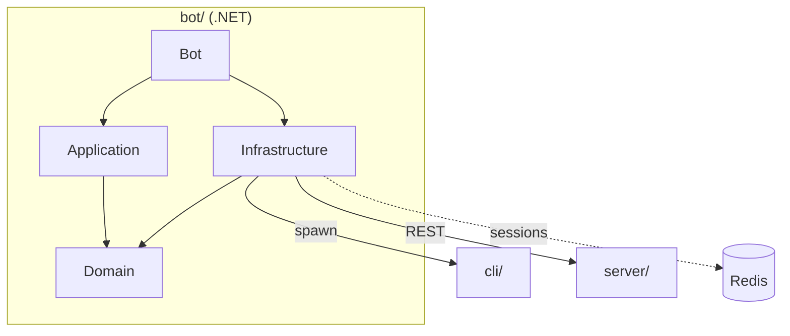

# Telegram bot architecture

The system-wide design — the parity contract, canonical data, the layer model, the pattern vocabulary — is in the root [`ARCHITECTURE.md`](../ARCHITECTURE.md).

A **thin adapter, not a core consumer**: every pixel transform is a shell-out to the Zig CLI,
projects go over the server's REST. It never links or recompiles `core/`; its contracts are
the CLI's flags + stderr grammar ([`cli/CONTRACT.md`](../cli/CONTRACT.md)) and
`server/internal/protocol`.

## Rings

Four projects under `src/Stencil.TelegramBot.<Ring>/`, dependencies pointing inward.
`Domain` has no project references and stays free of Telegram, HTTP and process types.

| Ring | Holds | Rule |
|---|---|---|
| `Domain` | entities and value objects (`EditState`, `HistoryStack`, `CropSpecResolver`, the layout and `.stencil` types, `OpPlan`, `UserSession`), the abstractions (`IStencilCli`, `IStencilServerClient`, `ISessionStore`, `IUserWorkspace`, `ILlmClient`, `IBotPolicy`), `StencilJson` (one camelCase serializer) | the frozen contract; pure C# |
| `Application` | `EditingService` (one base image + a replayable `EditState`), `ServerService` (connect/list/fetch/create/save/sync), `PromptService` (one partial per turn concern), `OpSchema`/`OpRegistry`/`OpPlanParser`, `RemoteImageUrl` (the surface's fetch guard), `ProjectFileService` | policy only; depends on Domain abstractions, never on an adapter |
| `Infrastructure` | `ProcessStencilCli` + `CliArgvBuilder` + `CliOutcomeParser` (ports of the mcp adapters), `HttpStencilServerClient` (a port of the pystencil client), `HttpLlmClient` + one provider mapping per wire shape, the in-memory and Redis session stores, `UserWorkspace`, `DotEnv`/`BotOptions`, the link builders, `FfmpegImageDownscaler` | depends only on Domain; every CLI run passes `--confine-output` |
| `Bot` | `Program` + `BotComposition` (the DI root), `UpdatePump`, `Telegram/` (the access gate, routers, intake, `CommandHandlers` partials by group, keyboards, replies, `SyncWatcher`, `WorkspaceJanitor`), `Assets/botCommands.json` + `botStrings.json` | the only ring that sees Telegram types; strings and commands come from the assets, never literals |
| `tests/` | xUnit, offline: `Doubles/` (the shared mocks), `Goldens/` (rendered text, byte-pinned), `BenchTests` (opt-in) | never reads `TELEGRAM_BOT_TOKEN`; no server, CLI or Redis |

## Rules

1. **The CLI is the pixel engine.** Locate (`STENCIL_CLI` → `cli/zig-out/bin/stencil` →
   `PATH`), run with `NO_COLOR=1`, parse stderr. Because `--confine-output` refuses an
   absolute path, the child is spawned *in* the output's folder with only the leaf name, and
   the relative paths it prints are re-rooted on the way back.
2. **One base image + a replayable edit state** per user; every render replays `EditState`
   through the CLI, so results are reproducible and the layout is exportable. A `.stencil`
   maps to/from the same `EditState` via `ProjectLayoutMapper`/`Writer`.
3. **One command vocabulary, one copy deck.** `botCommands.json` drives the dispatch table,
   the Telegram `/` menu, `/help` and the README's generated tables; `botStrings.json`
   holds every reply and
   button label + callback token. Both are `<EmbeddedResource>`s pinned by goldens.
4. **Fail closed.** `STENCIL_BOT_ALLOWED_USERS` gates everything but `/start` and `/help`;
   an unlisted caller gets one sentence, the id goes to the log.
5. **Concurrency.** `UserGate` serializes each user's read-modify-write session updates;
   a process-wide semaphore caps CLI processes; every outbound call carries a timeout; a CLI
   run past its deadline is killed. All single-instance by design.
6. **Sessions** live in Redis when `REDIS_URL` is set, else in memory — tests need neither.
7. **Provider, URL, model and token come from the operator's environment**, never from a
   chat message; `/chatapi` is a picker over `STENCIL_LLM_PROFILES`.
8. **One model round per turn**; one image per turn (an album is one run per photo); `save`
   goes through the server save path because the bot keeps no local project store.
9. **Packages are project-local** (`nuget.config` → `bot/packages/`), lockfiles committed,
   CI restores `--locked-mode`; no globally installed tooling.
10. **Background loops are hosted services** so SIGTERM cancels *and awaits* them.

## Tests

Offline by construction: argv/outcome ports of the MCP suites, URL normalisation from
pystencil, the REST client against a stub `HttpMessageHandler`, services against `Doubles/`,
the background loops on injected clocks. `BenchTests` are opt-in and assert only ratios —
one pass over lines × points, per-case parser cost, rejection without throwing, a header
reader that never scans the body.
