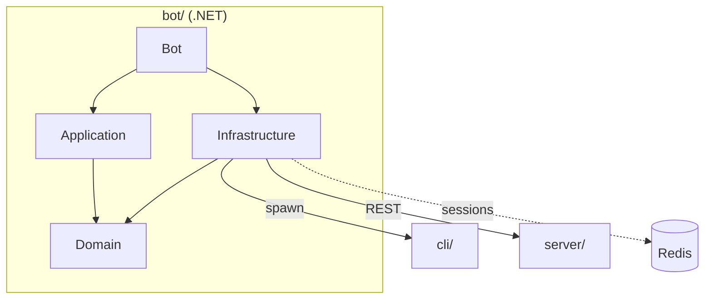
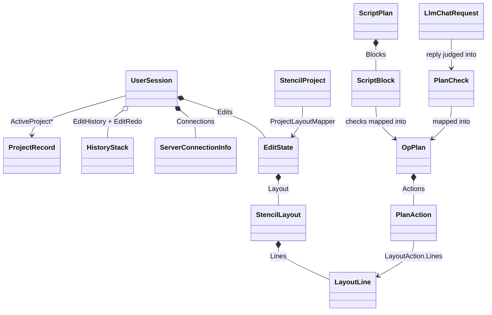

# Telegram bot architecture

The system-wide design — the parity contract, canonical data, the layer model, the pattern vocabulary — is in the root [`ARCHITECTURE.md`](../ARCHITECTURE.md).

A **thin adapter, not a core consumer**: every pixel transform and every op-plan verdict is a
shell-out to the Zig CLI (core judges each model and script plan through `--plan-check` /
`--plan-surface bot`); projects go over the server's REST. It never links or recompiles `core/`;
its contracts are the CLI's flags + stderr grammar ([`cli/CONTRACT.md`](../cli/CONTRACT.md)) and
`server/internal/protocol`.

```mermaid
graph TD
    subgraph BOT["bot/ (.NET)"]
      PRES["Bot"]
      APP["Application"]
      INFRA["Infrastructure"]
      DOMAIN["Domain"]
      PRES --> APP
      PRES --> INFRA
      APP --> DOMAIN
      INFRA --> DOMAIN
    end
    CLI["cli/"]
    SRV["server/"]
    RD[("Redis")]

    INFRA -->|"spawn"| CLI
    INFRA -->|"REST"| SRV
    INFRA -.->|"sessions"| RD
```

## Layers

`Domain` → `Application`, `Infrastructure` → `Bot`: one project per ring under
`src/Stencil.TelegramBot.<Ring>/`; a ring may use everything to its left, and `Application` and
`Infrastructure` share a tier, so neither uses the other. `Domain` is the contract in pure C#,
with no project references; `Application` is policy over Domain abstractions; `Infrastructure`
depends on Domain only; `Bot` is the only ring that sees Telegram types, and takes every string
and command from its assets. The `.csproj` `ProjectReference`s enforce the order, and
`tests/…/LayerBoundaryTests.cs` pins each ring's project references and `using` lines to it and
forbids `Telegram.Bot`, `System.Net.Http`, `System.Diagnostics.Process` and
`StackExchange.Redis` inside `Domain`.

## Where things go

| Path | Holds | Rule |
|---|---|---|
| `Domain/Editing/`, `Domain/Layout/` | `EditState`, `HistoryStack<T>`, crop resolution, the render request and result; `StencilLayout`, the CLI `--layout` shape | value objects, no I/O |
| `Domain/Project/`, `Domain/Projects/` | `StencilProject` (the `.stencil` bundle) and the server's project records | shaped by the `.stencil` format and `server/internal/protocol` |
| `Domain/Llm/` (+ `Wire/`) | the op-plan and chat types; under `Wire/`, `ILlmClient` and the provider request and reply | the contract's types; no wire format |
| `Domain/Sessions/` | `UserSession`, its server connections and pending inputs | one JSON value per user; paths, never bytes |
| `Domain/Abstractions/`, `Domain/Configuration/` | the ports (`IStencilCli`, `ISessionStore`, `IBotPolicy`, …) | `Infrastructure` implements them |
| `Domain/Serialization/`, `Domain/Exceptions/` | `StencilJson`, `JsonRead`; the CLI and server exceptions | every typed (de)serialization runs under `StencilJson.Options` (or `Indented`); a DOM read (`JsonDocument`, `JsonNode`) parses on its own |
| `Application/Editing/` | `EditingService`, project files, video frames, and `RemoteImageUrl`, the fetch guard over `AddressRanges` (the embedded `net/blockedRanges.json`) | every render replays the state through `IStencilCli` |
| `Application/Servers/` | `ServerService`, the project layout mapper and writer, invite links | version-guarded writes |
| `Application/Llm/` (+ `Plan/`) | the prompt and script turns; `Plan/` maps core's verdict onto typed actions | no validator: the mapper only types core's verdict; the embedded `opRegistry.json` feeds the prompt and the skew fingerprint |
| `Infrastructure/Cli/`, `Infrastructure/Processes/` | `ProcessStencilCli`, its argv builder and outcome parser, the CLI locator, `ChildEnvironment` | a child inherits only `ChildEnvironment`'s allowlist; output read up to a cap |
| `Infrastructure/Server/` | `HttpStencilServerClient`, its factory, `UrlNormalizer` | REST only; every non-2xx is a `ServerException`, redirects never followed |
| `Infrastructure/Net/` | `GuardedConnect`, `CappedBody` | the dial-time half of the fetch guard, shared by `LayoutFetcher` and the server clients |
| `Infrastructure/Llm/` | `HttpLlmClient` + one `IProviderMapping` per wire shape | the platform's `HttpClient`; endpoint from configuration only |
| `Infrastructure/Sessions/`, `Infrastructure/Workspace/` | the in-memory and Redis session stores; `UserWorkspace` | bytes live in the workspace, never in a session |
| `Infrastructure/Configuration/`, `Links/`, `Media/` | `BotOptions`; deep and desktop links, `LayoutFetcher`; the ffmpeg downscaler | operator environment in, never chat text |
| `src/Stencil.TelegramBot.Bot/` | `Program` + `BotComposition` (the DI root), `UpdatePump`, `UpdateIntake` | `Program` registers nothing else; it builds the `UpdatePump` and the `UpdateIntake` in front of it itself, outside DI, and loads the dotenv files beside the app (`AppContext.BaseDirectory`), in the CWD, then in `bot/` of the CWD and its parents, real environment variables winning |
| `Bot/Telegram/` (+ `Commands/`, `Intake/`, `Messaging/`, `Access/`, `Sync/`) | the routers, then a folder per step of an update's path | the only code that sees `Telegram.Bot` |
| `Bot/Assets/` | `botCommands.json`, `botStrings.json` | `<EmbeddedResource>`s; the dispatch table, the `/` menu and every reply |
| `tests/` | xUnit, offline: `Doubles/` (mocks and `planChecks.json`, core's recorded verdicts), `Goldens/`, the shared `TempDirs` scratch fixture and `TestHandlers` (the handler graph, a button `Tap`) | no token, server, CLI or Redis unless `BOT_TEST_CLI` names a built CLI |

## Entities

```mermaid
classDiagram
    UserSession *-- EditState : Edits
    UserSession *-- ServerConnectionInfo : Connections
    UserSession o-- HistoryStack : EditHistory + EditRedo
    UserSession --> ProjectRecord : ActiveProject*
    EditState *-- StencilLayout : Layout
    StencilLayout *-- LayoutLine : Lines
    StencilProject --> EditState : ProjectLayoutMapper
    OpPlan *-- PlanAction : Actions
    PlanAction --> LayoutLine : LayoutAction.Lines
    LlmChatRequest --> PlanCheck : reply judged into
    PlanCheck --> OpPlan : mapped into
    ScriptPlan *-- ScriptBlock : Blocks
    ScriptBlock --> OpPlan : checks mapped into
```

| Entity | What it is | Owned by / lifetime | Relates to |
|---|---|---|---|
| `UserSession` | Everything the bot remembers about one user: base image, edits, history, connections, the active project | `ISessionStore`; until `/drop` or a reset | `EditState`, `ServerConnectionInfo`, `ProjectRecord` |
| `EditState` | Editing intent, not pixels: crop, quarter-turns, filter, page format, formulas, the drawn layout and the pen | `UserSession.Edits`; replaced immutably on every edit | `StencilLayout`; replayed into an `EditRequest` |
| `HistoryStack<T>` | Two bounded lists; every step returns a new stack plus the snapshot to apply | projected from `EditHistory`/`EditRedo` per call | `EditState` |
| `StencilLayout` | The JSON the CLI's `--layout` consumes, in image pixels | `EditState.Layout`; written to a workspace file per render | `LayoutLine` |
| `LayoutLine` | One polyline with color, thickness, point size, style and fill | inside a `StencilLayout` or a `LayoutAction` | `LayoutPoint` |
| `ServerConnectionInfo` | One remembered server: URL, session token, the connect credential, TLS flag | `UserSession.Connections`; until `/disconnect` | a server client is rebuilt from it per call |
| `ProjectRecord` | The protocol's project record; `Version` is the LWW counter | returned by `IStencilServerClient`; the active one flattened into `UserSession` | `ProjectFull`, the create and update requests |
| `StencilProject` | The portable `.stencil` bundle: name, metadata, original image bytes, the raw layout | built and parsed by `StencilProjectFile` | `EditState` via `ProjectLayoutMapper` |
| `PlanCheck` | Core's verdict on one reply, kept raw, plus the CLI's registry fingerprint | returned by `IStencilCli.PlanCheckAsync` | mapped into an `OpPlan`; fingerprint checked by `OpRegistryAsset.Matches` |
| `OpPlan` | A validated model reply: text, actions, `OpVariant`s, an optional `AskCard` | mapped by `OpPlanParser` from core's verdict; one turn | `PlanAction`; canonical is `common/config/llm/opRegistry.json` |
| `PlanAction` | The op-plan action union, one record per `Op` | inside an `OpPlan` | dispatched through `OpRegistry.HandlerFor` |
| `ScriptPlan` | One `.stc` as the CLI lowered it: diagnostics and, without an error, one `ScriptBlock` per `@source` | parsed from the `--script-plan` envelope; one `/script` run | the envelope is `cli/CONTRACT.md` §4.3 |
| `ScriptBlock` | One block's source, its kind and core's verdict on each chunk | inside a `ScriptPlan` | each check mapped by `OpPlanParser.MapScriptChunk` |
| `LlmChatRequest` | The system prompt, the replayed history, the server URL/token and the picked `LlmOptions` | built by `PromptService.BuildTurn`; one per model round | mapped by an `IProviderMapping`; persisted as a `ChatDocument` |

## Patterns

| Pattern | Where | Notes |
|---|---|---|
| Ports & Adapters | `Domain/Abstractions/*` ← `Infrastructure/*` | the rings themselves; the tests swap every port for a `Doubles/Mock*` |
| Adapter | `CliArgvBuilder`, `CliOutcomeParser`, `ProcessStencilCli`; `OpPlanParser.Map` | a typed `EditRequest` to the CLI's documented flags and back |
| Command | `HistoryStack<EditState>` via `EditSessions.WithHistory`; the `OpHandler` on each `OpDescriptor` | undo restores a whole `EditState`; each op-plan action is one executable entry |
| Strategy | `HttpLlmClient` → `IProviderMapping` | one wire shape per provider, selected by table lookup |
| Chain of Responsibility | `MessageRouter.chain`; the fetch guard `RemoteImageUrl.ValidateAsync` → `LayoutFetcher` → the CLI's scheme guard | each link claims or declines; link order is the precedence |
| Actor | `UpdatePump` lanes keyed by `UpdateRouter.LaneOf` | a user's updates run one at a time in arrival order; a waiting lane holds no worker; an overfull lane drops the update |
| Repository | `ISessionStore` → in-memory or Redis | chosen in `AddStencilInfrastructure` |
| Mediator | `CommandHandlers`; `UpdateRouter` over the gates and routers | the services never talk to each other or to the chat |
| Table-driven dispatch | `CommandHandlers._routes` keyed by `BotCommands.Canonical`; `OpRegistry.Ops` → `HandlerFor` | the prompt is assembled from the same entries the executor dispatches on |
| Hosted loop | `SyncWatcher`, `WorkspaceJanitor` | `BackgroundService`s; SIGTERM cancels and awaits both |
| Fixture walker, Golden pin | `*FixtureWalkerTests`, `SharedOutcomeFixturesTests`; `TextGoldenTests`; `MockStencilCli` replaying `planChecks.json` | the shared corpora; byte-exact user-facing text; core's verdicts recorded once |

## Design

- **An update.** `UpdateIntake` drops an edited message — it is no new request — and asks
  `UpdateRouter.AdmitAsync` on the polling loop — the allowlist, unless the command `IsUngated` —
  so an unlisted sender's update never takes a pump slot. `UpdatePump` puts each admitted update in the sender's lane (a `STOP_TOKEN` tap takes
  none, since the turn it cancels heads its own). `UpdateRouter` runs under `ErrorGuard`, asks
  `AccessGate` again unless the command `IsUngated`, buffers album members into `AlbumRouter` (a
  settled album is queued on the sender's lane like any update), takes `UserGate`, re-registers a
  chat whose session is `SyncEnabled` with `SyncRegistry`, then walks `MessageRouter`; a verb is
  looked up in `CommandHandlers._routes`, a tap goes to `CallbackAction`.
- **A photo turn.** An upload is downloaded through a capping stream into `UserWorkspace`, which
  resets the session. A render replays `EditState` as an `EditRequest`; `ProcessStencilCli`
  parses the `wrote` line into a `RenderResult`; the layout file a render wrote and a result once
  sent or uploaded are deleted, the janitor only sweeping what a failure left. `/crop` answers a
  spec `CropSpecResolver` (the port of core's `cropSpec.cpp`) refuses — malformed, an edge outside
  the image, an overflowing ratio — with the crop help and stores nothing. Every mutating command
  pushes the previous state onto the history.
- **An LLM turn.** `/prompt` or chat mode calls `PromptService` under `LlmGate`; `BuildTurn`
  replays the history plus the contour edge map, and `ILlmClient` posts through an
  `IProviderMapping`. `OpPlanParser` hands the reply to `IStencilCli.PlanCheckAsync` — core
  extracts, validates and normalizes it under the bot's surface — and maps the verdict onto
  `PlanAction`s in core's words. `executeAsync` pre-flights the whole plan (forbidden ops, the
  `openUrl` user-echo guard), then applies each action through `OpRegistry.HandlerFor` onto the
  `EditingService` methods the slash commands use, `PlanFrameMapper` re-mapping coordinates. An
  `AskCard` becomes an inline keyboard.
- **A script turn.** `/script <text>` or an uploaded `.stc` is written to a temp file in the
  workspace and lowered by `--script-plan` with `--plan-surface bot`, so every chunk arrives
  judged; the planner treats it as a chat user's script (no local `@layout`, no loopback
  fetches). An error diagnostic ends it — nothing runs. Otherwise each chunk takes the model
  plan's mapper, pre-flight and executor. A local path, directory or glob block is refused.
- **Save and sync.** `/save` renders, merges `EditState` into the active project's layout JSON
  and updates it guarded by `ActiveProjectVersion`. A 409 re-reads the project and hands its
  lines, the session's and the previous pass's peer lines (`seen`) to `IStencilCli.MergeLinesAsync`
  — core's `mergeLines` through `--merge-lines` — then retries at the server's version over the
  server's layout; the bot keeps its own filter, rotation and page fields. Six tries, the
  browser's bound; a 409 after them is the conflict reply. The merged lines become the session's
  together with the version that names them, and a merged save re-renders the result before the
  upload. A version is adopted only with the layout it names: a metadata write, or the re-read
  after the result upload, adopts the server's version only when no peer wrote in between, else
  the stored one stays and the next save meets the peer's 409. `/fetch` opens an id with one
  `GET /projects/{id}` and walks the listing only for a name, rebuilding the state with
  `ProjectLayoutMapper.ToEditState`; the original is downloaded again only when its
  `originalHash` changed. `SyncWatcher` polls each `/sync`ed chat under the user's gate, skipping
  a user whose gate is busy until the next tick and logging a user's failed pull without
  stopping the rest; a mutating edit on a synced project auto-saves the render it just sent.
  Clients are rebuilt per call from `ServerConnectionInfo`, re-minting from `Credential` when the
  token goes stale; a re-minted token is written back to the connection, so the next call does
  not mint again. The assistant's context line lists one page of 21 per server.
- **A connect.** `/connect` → `RemoteImageUrl.ValidateServerUrlAsync` refuses what the
  `serverTarget` policy refuses, and loopback / private hosts too unless `AllowPrivateServers`.
  The handshake probes the token, re-minting once from the credential on 401/403. Every server
  client dials through `GuardedConnect` with `RemoteImageUrl.ServerAddressGuard` — the same
  verdict for the address actually connected — with no proxy and no redirect followed; a host
  with no allowed address is refused, one whose allowed address does not answer is unreachable,
  and a reply past `HttpClient.Timeout` is a timeout, each a sentence in the chat. A looping or
  unbounded cursor, or pages past the reply cap together, fail a listing, never truncate it. The
  `stencil-server` LLM provider dials a server the user connected through the same guard; only
  the operator's own `STENCIL_LLM_SERVER_URL` uses the unguarded client.
- **A fetch.** `/url` → `RemoteImageUrl.ValidateAsync` (http(s) only; every resolved address
  passes `IsBlockedAddress`, the table's `fetch` policy), then the CLI fetches. `/layout <url>`
  goes through `LayoutFetcher` with the same predicate; `/sourcesite` scrapes through the CLI into
  a per-user scratch directory.
- **Sessions.** `UserSession` carries paths; bytes live under `UserWorkspace`, and
  `WorkspaceJanitor` prunes files no session references. The bounded LLM history stays in `PromptService`; with `SaveChats` it is
  mirrored as a `ChatDocument` into the active project's chat file.
- **Composition.** `BotComposition.AddStencilBot` registers every ring and the hosted loops;
  once started, `OpPlanParser.RegistrySkewAsync` logs a CLI built from another registry.

## Concurrency

Telegram.Bot's polling loop hands each update to `UpdatePump`, which detaches it onto a fixed
pool of workers: one serial lane per user, so a user's updates run one at a time in arrival
order and a waiting lane holds no worker. Handlers are async all the way down; the CLI, ffmpeg
and the LLM are I/O awaited on the pool. The hosted loops (`SyncWatcher`, `WorkspaceJanitor`)
run beside the pump, and SIGTERM cancels the host's `ApplicationStopping` token every handler
carries. State is per process: the bot is single-instance by design, so `UserGate`, the lanes
and every semaphore below hold for one process only, whichever session store is configured.

| Owner | Runs on | Shares | Guard | On overflow or teardown |
|---|---|---|---|---|
| `UpdatePump` (`Bot/UpdatePump.cs`) | `STENCIL_BOT_UPDATE_WORKERS` (32) worker tasks; the Stop tap on a task of its own, off every lane | the lanes and the ready channel | `_lanes` lock; `UpdateQueueCapacity` (256) process-wide slots, a full pump holding the poller back, the Stop tap included; `MaxPendingPerUser` (64) per lane; only an update `UpdateIntake` admitted takes a slot | a full lane drops the update and logs it; dispose stops intake and waits up to `ShutdownDrainTimeout` (10 s) |
| `UserGate` (`Telegram/Access/UserGate.cs`) | the message and callback routers, the album flush, the sync poller | one user's session read-modify-write, a save across all its merge passes | a `SemaphoreSlim(1)` per user, never nested: the album buffer and the Stop tap run outside it; the sync poller only tries it | a gate is forgotten once its last holder leaves |
| `AlbumCollector` (`Telegram/Intake/`) | a settle task per album group, whose flush is queued on the user's lane | the group's photos | the group lock; a flushed group is marked under it, so a late photo starts a new group | cancellation drops the buffered group unflushed |
| CLI spawns (`Infrastructure/Cli/ProcessStencilCli.cs`) | the calling handler | the process budget | `STENCIL_BOT_MAX_CONCURRENT_CLI` (one per CPU) awaited slots; a per-run deadline | a run past its deadline is killed |
| ffmpeg (`Infrastructure/Media/FfmpegImageDownscaler.cs`) | the calling handler, outside the CLI semaphore | — | the CLI's per-run deadline | a failure keeps the original image |
| `AccessGate` (`Telegram/Access/AccessGate.cs`) | the polling loop, then the lane | the last refusal per unlisted id | a lock over that map | a refused id is answered once per `STENCIL_BOT_REFUSAL_WINDOW_SECONDS` (300); the map resets past 1024 ids; a failed send is logged, never thrown |
| `LlmGate` (`Domain/Llm/LlmGate.cs`) | prompt and chat turns | in-flight model calls | `STENCIL_BOT_MAX_CONCURRENT_LLM` (8) slots, taken without waiting | over the cap the turn is refused at once |
| `SyncWatcher` | a hosted loop | synced users' sessions | `UserGate.TryAcquire` per pull; a busy user waits for the next tick | a user's failure is logged and the tick goes on; SIGTERM cancels and awaits it |
| `WorkspaceJanitor` | a hosted loop | the workspace files | prunes only files older than `WorkspaceTtl` that no session references, so a render in flight survives | SIGTERM cancels and awaits it |

## Rules

1. **The CLI is the pixel engine.** Located `STENCIL_CLI` → `cli/zig-out/bin/stencil` → `PATH`,
   run with `NO_COLOR=1`, its stderr parsed. `--confine-output` refuses an absolute path, so the
   child is spawned *in* the output's folder with only the leaf name, and the relative paths it
   prints are re-rooted on the way back. `--script-plan`, `--plan-check` and
   `--merge-lines` carry no `--confine-output`: they write nothing and print their envelope on stdout.
2. **Core judges every plan.** The bot validates none itself: a model reply goes through
   `--plan-check`, a script chunk arrives judged, and the mapper only types core's normalized
   result and shows its `message`.
3. **One base image + a replayable edit state** per user; every render replays `EditState`
   through the CLI, so results are reproducible and the layout exportable. A `.stencil` maps to
   and from the same `EditState`.
4. **One command vocabulary, one copy deck.** `botCommands.json` drives the dispatch table, the
   Telegram `/` menu, `/help` and the README's generated tables; `botStrings.json` holds every
   reply, button label and callback token. Both are `<EmbeddedResource>`s pinned by goldens.
5. **Fail closed.** `STENCIL_BOT_ALLOWED_USERS` gates everything but `/start` and `/help`, before
   the update takes a pump slot; an unlisted caller gets one sentence per refusal window, the id
   goes to the log.
6. **Bounded and single-instance.** One user never holds more than one worker; every outbound
   call carries a timeout and every read a size cap; a CLI run past its deadline is killed. The
   locks are per process, so the bot runs as one instance.
7. **Sessions** live in Redis when `REDIS_URL` is set, else in memory — tests need neither.
8. **Provider, URL, model and token come from the operator's environment**, never from a chat
   message; `/chatapi` is a picker over `STENCIL_LLM_PROFILES`.
9. **One model round per turn**; one image per turn (an album is one run per photo); `save` goes
   through the server because the bot keeps no local project store.
10. **Packages are project-local** (`nuget.config` → `bot/packages/`), lockfiles committed, CI
    restores `--locked-mode`; no globally installed tooling.
11. **Background loops are hosted services** so SIGTERM cancels *and awaits* them.
12. **A namespace is its folder**, except a partial class split into feature subfolders
    (`Commands/Assistant/`, `Llm/Prompt/`, `Editing/CropSpec/`): every part keeps the class's
    namespace.

## Tests

Offline by construction: the REST client runs against a stub `HttpMessageHandler` and loopback
sockets (a 3xx never followed), services against `Doubles/`, the background loops on injected
clocks, the update pump's lanes on gated handlers. `BenchTests` are opt-in and assert only ratios.

Plans are judged offline by `MockStencilCli`, which replays core's verdict per reply from
`Doubles/planChecks.json`; a reply without a recording fails its test. The op-plan walker feeds
`generated/normalized.json`'s bot results through the typed mapper. With `BOT_TEST_CLI` set,
`PlanCheckCliParityTests` prove the live CLI judges every case as recorded and embeds the bot's
registry. A save's merge runs offline on `MockStencilCli`'s `mergeLines` in miniature;
`CliMergeLinesTests` prove the live `--merge-lines` merges every case as it does.

The fixture walkers replay the shared corpora under `common/fixtures/` through the real parsers,
measured divergences pinned in `FixtureOverrides.json`; `SharedOutcomeFixturesTests` replays
`cli/testdata/outcome_fixtures.json`. The script suites run a canned `--script-plan` envelope
through the real `ScriptService`, proving a lowered plan takes the op-plan route.
`TextGoldenTests` pins every reply, keyboard label, callback token and menu entry byte-exact;
`LayerBoundaryTests` pins the ring order and `CompositionRootTests` resolves the whole DI graph.
