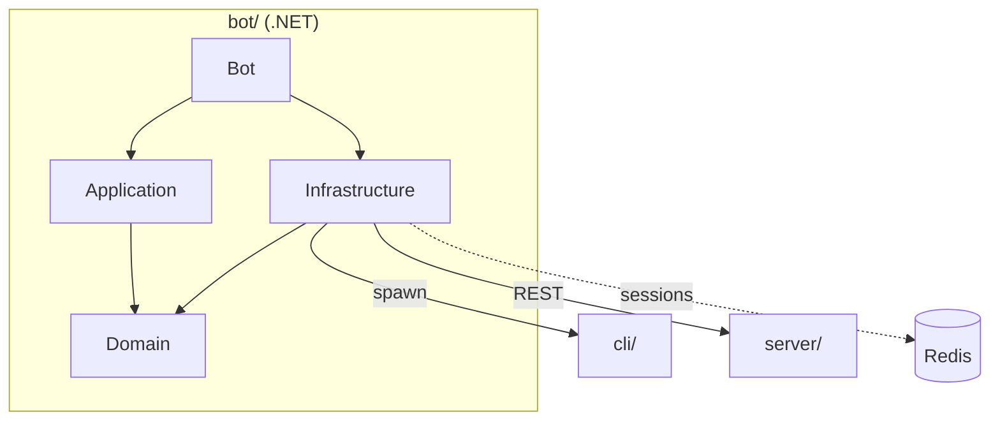
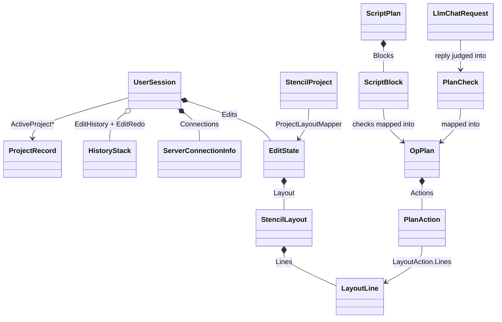

# Telegram bot architecture

The system-wide design — the parity contract, canonical data, the layer model, the pattern vocabulary — is in the root [`ARCHITECTURE.md`](../ARCHITECTURE.md).

A **thin adapter, not a core consumer**: every pixel transform and every op-plan verdict is a
shell-out to the Zig CLI (core judges each model and script plan through `--plan-check` /
`--plan-surface bot`); projects go over the server's REST. It never links or recompiles `core/`;
its contracts are the CLI's flags + stderr grammar ([`cli/CONTRACT.md`](../cli/CONTRACT.md)) and
`server/internal/protocol`.

```mermaid
graph TD
    subgraph BOT["bot/ (.NET)"]
      PRES["Bot"]
      APP["Application"]
      INFRA["Infrastructure"]
      DOMAIN["Domain"]
      PRES --> APP
      PRES --> INFRA
      APP --> DOMAIN
      INFRA --> DOMAIN
    end
    CLI["cli/"]
    SRV["server/"]
    RD[("Redis")]

    INFRA -->|"spawn"| CLI
    INFRA -->|"REST"| SRV
    INFRA -.->|"sessions"| RD
```

## Layers

`Domain` ← `Application` ← `Infrastructure` ← `Bot`: one project per ring under
`src/Stencil.TelegramBot.<Ring>/`, dependencies pointing inward. `Domain` is the frozen contract
in pure C#, with no project references; `Application` is policy over Domain abstractions, never
an adapter; `Infrastructure` depends only on Domain; `Bot` is the only ring that sees Telegram
types, and takes every string and command from its assets, never a literal. The `.csproj`
`ProjectReference`s enforce the order, and `tests/…/LayerBoundaryTests.cs` reads every `using`
line and forbids `Telegram.Bot`, `System.Net.Http`, `System.Diagnostics.Process` and
`StackExchange.Redis` inside `Domain`.

## Where things go

| Path | Holds | Rule |
|---|---|---|
| `Domain/Editing/`, `Domain/Layout/` | `EditState`, `HistoryStack<T>`, crop resolution, the render request and result; `StencilLayout`, the CLI `--layout` shape | value objects, no I/O; per-line defaults pinned to the other front-ends |
| `Domain/Project/`, `Domain/Projects/` | `StencilProject` (the `.stencil` bundle) and the server's project records | mirrors of `project/file.js` and `server/internal/protocol` |
| `Domain/Llm/` (+ `Wire/`) | the op-plan and chat types; under `Wire/`, `ILlmClient` and the request and reply a provider is spoken to in | the contract's types; no wire format |
| `Domain/Sessions/` | `UserSession`, its server connections and pending inputs | one JSON value per user; paths, never bytes |
| `Domain/Abstractions/`, `Domain/Configuration/` | the ports (`IStencilCli`, `ISessionStore`, `IBotPolicy`, …) | `Infrastructure` implements them |
| `Domain/Serialization/`, `Domain/Exceptions/` | `StencilJson`, `JsonRead`; the CLI and server exceptions | every JSON goes through `StencilJson`, one camelCase serializer |
| `Application/Editing/` | `EditingService`, project files, video frames, and `RemoteImageUrl`, the surface's fetch guard, over `AddressRanges` (the embedded `net/blockedRanges.json`) | every render replays the state through `IStencilCli` |
| `Application/Servers/` | `ServerService`, the project layout mapper and writer, invite links | a port of pystencil's `ConnectionManager` + `remoteSync`; version-guarded writes |
| `Application/Llm/` (+ `Plan/`) | the prompt and script turns; `Plan/` maps core's verdict onto typed actions | no validator: core judges and words, the mapper only types and shows core's `message`; the embedded `opRegistry.json` feeds the prompt bullets, the forbidden names and the skew fingerprint |
| `Infrastructure/Cli/`, `Infrastructure/Processes/` | `ProcessStencilCli`, its argv builder and outcome parser, the CLI locator, `ChildEnvironment` | `NO_COLOR=1`; a reply reaches `--plan-check` on stdin; a child inherits only `ChildEnvironment`'s allowlist, and its output is read up to a cap |
| `Infrastructure/Server/` | `HttpStencilServerClient` (a port of the pystencil client), its factory, `UrlNormalizer` | REST only; every non-2xx (a 3xx included — redirects are never followed) is a `ServerException`; replies are read up to `MaxServerResponseBytes` |
| `Infrastructure/Net/` | `GuardedConnect`, `CappedBody` | the dial-time half of the fetch guard: a no-redirect handler that dials only addresses a predicate passes, shared by `LayoutFetcher` and the server clients |
| `Infrastructure/Llm/` | `HttpLlmClient` + one `IProviderMapping` per wire shape | the platform's `HttpClient`; endpoint from configuration only |
| `Infrastructure/Sessions/`, `Infrastructure/Workspace/` | the in-memory and Redis session stores; `UserWorkspace` (`<DataDir>/<userId>/<guid>`) | bytes live in the workspace, never in a session |
| `Infrastructure/Configuration/`, `Links/`, `Media/` | `BotOptions` from `.env` and the environment; deep and desktop links, `LayoutFetcher`; the ffmpeg downscaler | operator environment in, never chat text |
| `src/Stencil.TelegramBot.Bot/` | `Program` + `BotComposition` (the DI root), `UpdatePump` | `Program` registers nothing else |
| `Bot/Telegram/` (+ `Commands/`, `Intake/`, `Messaging/`, `Access/`, `Sync/`) | the routers, then a folder per step of an update's path: a verb, an upload, a reply, who may, a synced workspace | the only code that sees `Telegram.Bot` |
| `Bot/Assets/` | `botCommands.json`, `botStrings.json` | `<EmbeddedResource>`s; the dispatch table, the `/` menu and every reply |
| `tests/` | xUnit, offline: `Doubles/` (the shared mocks and `planChecks.json`, core's recorded verdicts), `Goldens/` (byte-pinned text) | never reads `TELEGRAM_BOT_TOKEN`; no server, CLI or Redis unless `BOT_TEST_CLI` names a built CLI |

## Entities

```mermaid
classDiagram
    UserSession *-- EditState : Edits
    UserSession *-- ServerConnectionInfo : Connections
    UserSession o-- HistoryStack : EditHistory + EditRedo
    UserSession --> ProjectRecord : ActiveProject*
    EditState *-- StencilLayout : Layout
    StencilLayout *-- LayoutLine : Lines
    StencilProject --> EditState : ProjectLayoutMapper
    OpPlan *-- PlanAction : Actions
    PlanAction --> LayoutLine : LayoutAction.Lines
    LlmChatRequest --> PlanCheck : reply judged into
    PlanCheck --> OpPlan : mapped into
    ScriptPlan *-- ScriptBlock : Blocks
    ScriptBlock --> OpPlan : checks mapped into
```

| Entity | What it is | Owned by / lifetime | Relates to |
|---|---|---|---|
| `UserSession` | Everything the bot remembers about one user: base image path and size, edits, undo/redo snapshots, connections, the active server project, chat flags | `ISessionStore`; until `/drop` or a reset | `EditState`, `ServerConnectionInfo`, the active `ProjectRecord` fields |
| `EditState` | Editing intent, not pixels: crop, quarter-turns, filter, page format, formulas, the drawn layout and the pen | `UserSession.Edits`; replaced immutably on every edit | `StencilLayout`; replayed into an `EditRequest` |
| `HistoryStack<T>` | The bot's shape of `core/state/HistoryStack.hpp`: two bounded lists (25 per side); every step returns a new stack plus the snapshot to apply | projected from `EditHistory`/`EditRedo` per call | `EditState` |
| `StencilLayout` | The JSON the CLI's `--layout` consumes, in image pixels | `EditState.Layout`; written to a workspace file per render | `LayoutLine`; canonical is the browser's layout payload |
| `LayoutLine` | One polyline with color, thickness, point size, style and fill | inside a `StencilLayout` or a `LayoutAction` | `LayoutPoint` |
| `ServerConnectionInfo` | One remembered server: normalized URL, session token, the connect credential and its kind, TLS flag | `UserSession.Connections`; until `/disconnect` | a server client is rebuilt from it per call |
| `ProjectRecord` | A mirror of the protocol's `ProjectRecord`; `Version` is the LWW counter | returned by `IStencilServerClient`; the active one is flattened into `UserSession` | `ProjectFull`, the create and update requests |
| `StencilProject` | The portable `.stencil` bundle: name, metadata, original image bytes, the raw layout | built and parsed by `StencilProjectFile` | `EditState` via `ProjectLayoutMapper`; canonical is `project/file.js` |
| `PlanCheck` | Core's verdict on one reply: the §7 `result` document kept raw, plus the CLI's registry size and FNV-1a 64 | returned by `IStencilCli.PlanCheckAsync`; one parse | mapped into an `OpPlan`; its fingerprint checked by `OpRegistryAsset.Matches` |
| `OpPlan` | A validated model reply: text, top-level actions, up to 16 `OpVariant`s, an optional `AskCard` | mapped by `OpPlanParser` from core's verdict; one turn | `PlanAction`; canonical is `browser/js/config/llm/opRegistry.json` |
| `PlanAction` | The op-plan action union, one record per `Op` | inside an `OpPlan` | dispatched through `OpRegistry.HandlerFor` |
| `ScriptPlan` | One `.stc` as the CLI lowered it: the diagnostics and, only when there is no error, one `ScriptBlock` per `@source` | parsed from the `--script-plan` envelope; one `/script` run | the envelope is `cli/CONTRACT.md` §4.3 |
| `ScriptBlock` | One block's source, its kind (`project`/`url`, or a `file`/`dir`/`glob` the bot refuses) and core's raw verdict on each chunk | inside a `ScriptPlan` | each check mapped by `OpPlanParser.MapScriptChunk` into an `OpPlan` |
| `LlmChatRequest` | The system prompt, the replayed history with the current turn last, the resolved server URL/token and the picked `LlmOptions` | built by `PromptService.BuildTurn`; one per model round | mapped by an `IProviderMapping`; persisted as a `ChatDocument` |

## Patterns

| Pattern | Where | Notes |
|---|---|---|
| Ports & Adapters | `Domain/Abstractions/*` ← `Infrastructure/*` | the rings themselves; the tests swap every port for a `Doubles/Mock*` |
| Adapter | `CliArgvBuilder`, `CliOutcomeParser`, `ProcessStencilCli`; `OpPlanParser.Map` over core's result | a typed `EditRequest` to the CLI's documented flags and back; ports of `mcp/src/args/mod.rs`, `mcp/src/outcome.rs` and `mcp/src/pipeline/mod.rs` |
| Command | `HistoryStack<EditState>` via `EditSessions.WithHistory`; the `OpHandler` on each `OpDescriptor` | undo restores a whole `EditState` snapshot; each op-plan action is one executable entry |
| Strategy | `HttpLlmClient` → `IProviderMapping` | one wire shape per provider, selected by table lookup |
| Chain of Responsibility | `MessageRouter.chain` (command → upload → pending input → URL → chat mode → fallback); the fetch guard `RemoteImageUrl.ValidateAsync` → `LayoutFetcher` → the CLI's own scheme guard | each link claims or declines; link order is the precedence |
| Actor | `UpdatePump` lanes keyed by `UpdateRouter.LaneOf` | a user's updates run one at a time in arrival order on any free worker; a waiting lane holds no worker, ready lanes take turns, and a lane past `MaxPendingPerUser` drops the update |
| Repository | `ISessionStore` → in-memory or Redis | chosen in `AddStencilInfrastructure` |
| Mediator | `CommandHandlers` over the services, `SyncRegistry` and the bot client; `UpdateRouter` over the gates and routers | the services never talk to each other or to the chat; every command and tap folds through `DispatchAsync` |
| Table-driven dispatch | `CommandHandlers._routes` keyed by `BotCommands.Canonical`; `OpRegistry.Ops` → `HandlerFor`; the per-op mapper over `OpRegistryAsset` | the prompt is assembled from the same entries the executor dispatches on |
| Hosted loop | `SyncWatcher`, `WorkspaceJanitor` | `BackgroundService`s; SIGTERM cancels and awaits both |
| Fixture walker, Golden pin | `*FixtureWalkerTests`, `SharedOutcomeFixturesTests`; `TextGoldenTests`; `MockStencilCli` replaying `planChecks.json` | the shared corpora under `browser/js/config` and `cli/testdata`; byte-exact user-facing text; core's verdicts recorded once |

## Design

- **An update.** `UpdatePump` puts each update in the lane `UpdateRouter.LaneOf` names — the
  sender's id; a `STOP_TOKEN` tap takes no lane and skips the user gate, since the turn it
  cancels heads its own. `UpdateWorkers` serve the ready lanes, and `UpdateQueueCapacity`
  updates in flight hold polling back. `UpdateRouter` runs under `ErrorGuard`, asks `AccessGate`
  unless the command `IsUngated` (`/help`, bare `/start`), buffers album members into
  `AlbumRouter` outside the gate, takes `UserGate`, then walks `MessageRouter`; a verb is looked
  up in `CommandHandlers._routes`, a tap goes to `CallbackAction`.
- **A photo turn.** An upload is downloaded through a capping stream into `UserWorkspace`, which
  resets the session. A render replays `EditState` as an `EditRequest`; `ProcessStencilCli`
  spawns in the output's folder with `--confine-output` and the leaf name, and the parsed `wrote`
  line yields the re-rooted `RenderResult`. Every mutating command pushes the previous state onto
  the history.
- **An LLM turn.** `/prompt` or chat mode calls `PromptService` under `LlmGate` with a
  cancellation token; `BuildTurn` replays the history plus the contour edge map, and `ILlmClient`
  posts through an `IProviderMapping`. `OpPlanParser` hands the reply to
  `IStencilCli.PlanCheckAsync` — core extracts, validates and normalizes it under the bot's
  surface — and maps the verdict onto `PlanAction`s in core's words, dropping, in core's frame, a
  variant or preview that carries a non-image op. The exchange is recorded with the reply the plan
  carried, which a §12.1 chat document shows as it is. `executeAsync` pre-flights the whole plan
  (forbidden ops, the `openUrl` user-echo guard), then applies each action through
  `OpRegistry.HandlerFor` onto the `IEditingService` methods the slash commands use,
  `PlanFrameMapper` re-mapping coordinates. A `layout` sets the drawn lines to exactly its own (an
  empty one clears them), one history entry; a `crop` cuts the view it was given, and
  `EditState.WithViewCrop` composes it onto the stored crop as one px window over the unturned
  original, the lines scaling by the width ratio or clearing on an album/portrait flip
  (`core::cropChange`). An `AskCard` becomes an inline keyboard.
- **A script turn.** `/script <text>` or an uploaded `.stc` needs a working image unless the
  script opens its own with `@source`. `ScriptService` writes a temp `.stc` into the workspace,
  names the frame the CLI probes for `%` lengths — the base image, or a render when a crop or
  rotation resized it — and reads back the `--script-plan` envelope. It asks for
  `--plan-surface bot`, so every chunk arrives judged, and the planner treats the script as a chat
  user's: it never reads a local `@layout`, and its fetches refuse loopback too. An error
  diagnostic ends it — nothing runs. Otherwise each chunk takes the model plan's mapper,
  pre-flight and executor, the script text standing in as the `openUrl` echo source. A local
  path, directory or glob block is refused; several blocks come back as an album. The temp file
  is deleted in a `finally`.
- **Save and sync.** `/save` renders, merges `EditState` into the active project's layout JSON,
  updates it guarded by `ActiveProjectVersion` (409 is a conflict), uploads the result and
  re-reads the version. `/fetch` adopts the original and rebuilds the state with
  `ProjectLayoutMapper.ToEditState`. `SyncWatcher` polls a `/sync`ed chat every
  `SyncPollInterval` under the user's gate and pulls a newer server version without mutating; a
  mutating edit on a synced project auto-saves. Clients are rebuilt per call from the stored
  `ServerConnectionInfo`, re-minting from `Credential` when the token goes stale.
- **A connect.** `/connect` → `RemoteImageUrl.ValidateServerUrlAsync` refuses what the
  `serverTarget` policy always refuses (link-local, cloud metadata, unspecified, multicast,
  reserved), and loopback / private hosts too when `AllowPrivateServers` is off. The handshake
  probes the token with `GET /auth/session` (`GET /projects?limit=1` where that 404s); a 401/403
  re-mints once from the credential, which proves an admin token. Every server client dials
  through `GuardedConnect` with `RemoteImageUrl.ServerAddressGuard` — the same verdict for the
  address actually connected — and never follows a redirect; a repeated `nextCursor`, or one
  still handed out after 1000 pages, fails a listing, never truncates it.
- **A fetch.** `/url` → `RemoteImageUrl.ValidateAsync` (http(s) only; every resolved address
  passes `IsBlockedAddress`, the table's `fetch` policy, an IPv6 form judged by the IPv4 address
  it carries; resolution bounded by `ResolveTimeout`), then the CLI fetches. `/layout <url>` goes
  through `LayoutFetcher` with the same predicate; `/sourcesite` scrapes through the CLI into a
  per-user scratch directory.
- **Sessions.** `UserSession` is one `StencilJson` value in memory or, with `REDIS_URL`, at
  `stencilbot:session:{userId}` in the Redis the Go server uses. It carries paths; bytes live
  under `UserWorkspace`, and `WorkspaceJanitor` prunes files no session references past
  `WorkspaceTtl`. The LLM history (base64 images) stays in `PromptService`, bounded by
  `MAX_HISTORY_MESSAGES` and `MAX_TRACKED_USERS`; with `SaveChats` it is mirrored as a
  `ChatDocument` into the active project's chat file.
- **Composition.** `BotComposition.AddStencilBot` registers the infrastructure ring (the options
  as `IBotPolicy`, the server clients over `ServerAddressGuard(AllowPrivateServers)`), the
  application ring, the Telegram-facing gates, routers and handlers, `LayoutFetcher` over
  `IsBlockedAddress`, and the hosted loops. Once started, `OpPlanParser.RegistrySkewAsync`
  compares the CLI's `registryBytes`/`registryFnv1a64` with the embedded registry and logs a
  mismatch.

## Rules

1. **The CLI is the pixel engine.** Located `STENCIL_CLI` → `cli/zig-out/bin/stencil` → `PATH`,
   run with `NO_COLOR=1`, its stderr parsed. `--confine-output` refuses an absolute path, so the
   child is spawned *in* the output's folder with only the leaf name, and the relative paths it
   prints are re-rooted on the way back. `--script-plan` and `--plan-check` carry no
   `--confine-output`: they write nothing and print their envelope on stdout.
2. **Core judges every plan.** The bot validates none itself: a model reply goes through
   `--plan-check`, a script chunk arrives judged, and the mapper only types core's normalized
   result and shows its `message`. A CLI built from another registry is logged at startup.
3. **One base image + a replayable edit state** per user; every render replays `EditState`
   through the CLI, so results are reproducible and the layout exportable. A `.stencil` maps to
   and from the same `EditState`.
4. **One command vocabulary, one copy deck.** `botCommands.json` drives the dispatch table, the
   Telegram `/` menu, `/help` and the README's generated tables; `botStrings.json` holds every
   reply, button label and callback token. Both are `<EmbeddedResource>`s pinned by goldens.
5. **Fail closed.** `STENCIL_BOT_ALLOWED_USERS` gates everything but `/start` and `/help`; an
   unlisted caller gets one sentence, the id goes to the log.
6. **Concurrency.** `UpdatePump` runs one user's updates one at a time and never lets one user
   hold more than one worker; `UserGate` serializes each user's read-modify-write session updates
   against the album flush and the sync poller; a process-wide semaphore caps CLI processes;
   every outbound call carries a timeout and every read a size cap; a CLI run past its deadline
   is killed. All single-instance by design.
7. **Sessions** live in Redis when `REDIS_URL` is set, else in memory — tests need neither.
8. **Provider, URL, model and token come from the operator's environment**, never from a chat
   message; `/chatapi` is a picker over `STENCIL_LLM_PROFILES`.
9. **One model round per turn**; one image per turn (an album is one run per photo); `save` goes
   through the server save path because the bot keeps no local project store.
10. **Packages are project-local** (`nuget.config` → `bot/packages/`), lockfiles committed, CI
    restores `--locked-mode`; no globally installed tooling.
11. **Background loops are hosted services** so SIGTERM cancels *and awaits* them.
12. **A namespace is its folder**, except a partial class split into feature subfolders
    (`Commands/Assistant/`, `Llm/Prompt/`, `Editing/CropSpec/`): every part keeps the class's
    namespace, as the desktop's `MainWindow*.cpp` keep `MainWindow::`.

## Tests

Offline by construction: argv/outcome ports of the MCP suites, URL normalisation from pystencil,
the REST client against a stub `HttpMessageHandler` and its pooled handlers against loopback
sockets (a 3xx answered, never followed), services against `Doubles/`, the background loops on
injected clocks, the update pump's lanes on gated handlers. `BenchTests` are opt-in and assert
only ratios.

Plans are judged offline by `MockStencilCli`, which replays core's verdict per reply from
`Doubles/planChecks.json`; a reply without a recording fails its test, and
`BOT_UPDATE_GOLDENS=1` with `BOT_TEST_CLI` records it. The op-plan walker feeds
`generated/normalized.json`'s bot results through the typed mapper, which passes core's
`message` through and treats a result without one as a CLI failure. With `BOT_TEST_CLI` set,
`PlanCheckCliParityTests` prove the live CLI judges every case as recorded and embeds the bot's
registry.

The fixture walkers replay the shared corpora under `browser/js/config/` through the real
parsers, one case per vector, measured divergences pinned in `FixtureOverrides.json`;
`SharedOutcomeFixturesTests` replays `cli/testdata/outcome_fixtures.json`, which the Rust MCP
server walks too. The script suites run a canned `--script-plan` envelope through the real
`ScriptService`, proving a lowered plan takes the op-plan route, not a second one. `TextGoldenTests` pins every reply, keyboard
label, callback token and menu entry byte-exact; `LayerBoundaryTests` pins the ring order and
`CompositionRootTests` resolves the whole DI graph.
