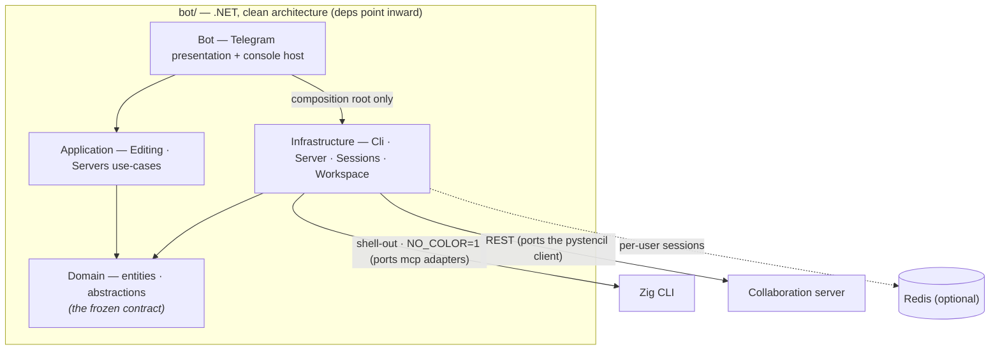

# Stencil — Telegram bot (.NET)

A Telegram bot that drives Stencil's image pipeline from a chat: upload a photo (or start a
blank canvas), crop / rotate / filter / draw a layout onto it, and download the result image
or its layout JSON — and connect to a Stencil [collaboration server](../server/README.md) to
list, fetch, create and save shared projects. Like `mcp/` and `pystencil/`, it is a **thin
adapter, not a core consumer**: it **shells out to the Zig CLI** (`cli/`) for every pixel
transform (so results match the browser, desktop, CLI and Python editors by construction) and
speaks the server's **REST** contract for projects. For the project overview see the
[repository README](../README.md).

Live instance: [@stencil_editor_bot](https://t.me/stencil_editor_bot).

```
You: (send a photo)
Bot: result.png — 1280x720    [🔄 Rotate] [B&W] [Sepia] [♻︎ Reset] [📄 JSON] …
You: /crop x1=10% x2=90% y1=10% y2=90%
You: /color #ff5623   /thickness 4
You: /draw rect 20%,20% 80%,80%   → annotates the image
You: /json            → downloads the layout JSON
You: /connect http://localhost:8090
You: /create Shared   → publishes the result as a new server project
```

## Dependencies

| Purpose | Tool | How it's provided |
|---|---|---|
| Build + language | **.NET 10** (C#) | the `dotnet` SDK |
| Telegram Bot API client | **Telegram.Bot** | the official library, a **project-local** NuGet `<PackageReference>` (see below) |
| Per-user session state (optional) | **StackExchange.Redis** | a project-local NuGet reference; only used when `REDIS_URL` is set |
| Hosting / DI / logging | **Microsoft.Extensions.*** | project-local NuGet references |
| The actual pixel/geometry work | **`../cli/`** (and through it, **`../core/`**) | invoked as a subprocess; **not** linked or recompiled here |

> The bot uses **only** the official `Telegram.Bot` library to talk to Telegram — no other
> third-party Bot API. Image work is the CLI's job; talking to the collaboration server is
> plain `System.Net.Http`. As with `mcp/`/`server/`, this subproject never links or
> recompiles `core/`, so the `core/` source-list parity rules don't apply to it — its only
> contracts are the CLI's documented flags and the server's REST routes.

### Packages are installed locally, not globally

Every dependency is a per-project `<PackageReference>` in the relevant `.csproj`, **not** a
global `dotnet tool`. On top of that, [`bot/nuget.config`](nuget.config) redirects
`globalPackagesFolder` to a repo-local **`bot/packages/`** folder, so `dotnet restore` fills
it there instead of the machine-global `~/.nuget/packages` cache. The folder is git-ignored
(node_modules-style) and rebuilt on demand:

```bash
cd bot
dotnet restore Stencil.TelegramBot.slnx   # populates bot/packages/ (never ~/.nuget)
```

Every project sets `RestorePackagesWithLockFile`, so a restore writes a **tracked**
`packages.lock.json` beside its `.csproj`. CI restores with `--locked-mode`, which fails
instead of resolving anything the lockfile does not pin — so commit the regenerated lockfiles
whenever you change a `<PackageReference>`.

That keeps the bot's dependencies self-contained and off the global cache. If you ever need
to re-add one, do it against the project, e.g.:

```bash
# from bot/ — adds a local <PackageReference> to that project's .csproj
dotnet add src/Stencil.TelegramBot.Bot package Telegram.Bot
```

Do **not** `dotnet tool install -g` anything for this bot.

## Architecture

A **clean-architecture** .NET app that shells out to the CLI and speaks the server's REST:



> **Surface diagrams:** [cli](../cli/README.md#architecture) · [server](../server/README.md#architecture) — or the whole-system view in the [repository README](../README.md#architecture).

Five projects, dependencies pointing inward (`Domain` has no project references):

```
bot/
  Stencil.TelegramBot.slnx
  src/
    Stencil.TelegramBot.Domain/          entities, value objects, abstractions — the frozen contract
      Abstractions/  IStencilCli · IStencilServerClient(+Factory) · ISessionStore · IUserWorkspace ·
                     IImageDownscaler
      Configuration/ IBotPolicy          (the operator policy the presentation layer reads)
      Editing/       EditState · EditRequest · BlankSpec · RenderResult · ImageSize · HistoryStack ·
                     CropSpecResolver (+.Tokens) · ColorSpec · RemoteDelivery ·
                     Scrape{Request,Result} · ScrapedFile
      Exceptions/    StencilCliException · ServerException
      Layout/        LayoutPoint · LayoutLine · LineStyle · StencilLayout · StencilLayoutParser
      Llm/           OpPlan · PlanAction · AskCard · ChatDocument · ILlmClient · LlmGate ·
                     LlmException · Llm{ChatRequest,Image,Message,Options,Profile,Reply} ·
                     ProvidersAsset
      Project/       StencilProjectFile  (the portable single-file .stencil format)
      Projects/      ProjectRecord · ProjectFull · Create/UpdateProjectRequest · FileWriteResult
      Serialization/ StencilJson (one camelCase JsonSerializerOptions shared everywhere) · JsonRead
      Sessions/      UserSession · ServerConnectionInfo · CredentialKind · ServerHandshake ·
                     PendingInputs
    Stencil.TelegramBot.Application/      use cases over the Domain abstractions
      Editing/       IEditingService + EditingService (one base image + a replayable EditState) ·
                     EditSessions · ProjectFileService · VideoFrames · RemoteImageUrl (the guard)
      Llm/           OpSchema (+SchemaLoader/SchemaJson/SchemaPath/KeySpecChecker/PresenceRules/
                     NativeRules) · OpRegistry · OpPlanParser (.Extract/.Actions/.Ask/.Validate) ·
                     PromptService (ten partials, one per turn concern) · PlanFrameMapper ·
                     ActionContext · LlmAttachmentLoader · ImageDimensionReader · SystemPromptAsset
      Servers/       IServerService + ServerService (connect/list/fetch/create/save/sync, split
                     .Connections/.Projects/.Metadata/.Sync) · ServerProjectInfo ·
                     ProjectLayout{Mapper,Writer} · InviteLink
      DependencyInjection/  ServiceCollectionExtensions (what the composition root binds)
    Stencil.TelegramBot.Infrastructure/   the adapters (depend only on Domain)
      Cli/           StencilCliLocator · CliArgvBuilder (+.Scrape) · CliOutcomeParser (+.Scrape) ·
                     ProcessStencilCli
      Configuration/ BotOptions (: IBotPolicy) · LlmProfileOptions · EnvRead · DotEnv ·
                     RedisConnectionString
      Links/         DeepLinkCodec · DesktopLinkBuilder · LayoutFetcher
      Llm/           HttpLlmClient + one IProviderMapping per §6 wire shape
      Media/         FfmpegImageDownscaler          Processes/  ProcessRunner (the spawn deadline)
      Server/        UrlNormalizer · HttpStencilServerClient(+.Transport) · StencilServerClientFactory
      Sessions/      InMemorySessionStore · RedisSessionStore
      Workspace/     UserWorkspace (per-user scratch dir for working images) · TempFiles
      DependencyInjection/  ServiceCollectionExtensions (the adapter bindings)
    Stencil.TelegramBot.Bot/              the Telegram presentation + console host
      Program.cs · BotComposition (the DI root) · UpdatePump (the bounded update queue)
      Telegram/      AccessGate (the allowlist), UpdateRouter, MessageRouter + its IMessageHandler
                     chain (TextLinks, UploadLinks), AlbumRouter, AlbumCollector, MediaIntake,
                     DocumentIntake + DocumentKinds + CappingWriteStream, ErrorGuard,
                     CommandParser, CommandHandlers (twelve partials by command group),
                     CallbackAction + CallbackTokens, AskCardTaps, Keyboards (+.Menus),
                     Replies (+.Editing/.Servers/.Chat), BotCommands + BotCommandList +
                     BotStrings (the Assets readers), PageFormats, DrawArguments,
                     DurationParser, ProgressNotice + PromptCancellations, UserGate,
                     SyncWatcher + SyncRegistry, WorkspaceJanitor
      Assets/        botCommands.json · botStrings.json   (the command vocabulary + the chat copy)
  tests/
    Stencil.TelegramBot.Tests/            xUnit — offline (no token, server, CLI or Redis)
      Doubles/       the hand-written mocks every service suite shares
```

- **`IStencilCli` → the Zig CLI.** `ProcessStencilCli` locates the binary (`STENCIL_CLI` →
  the repo's `cli/zig-out/bin/stencil` → `stencil` on `PATH`), runs it with `NO_COLOR=1`, and
  parses its `wrote {path} ({w}x{h})` / `error: …` stderr — a direct port of `mcp/src/{locate,
  args,outcome,pipeline}.rs`. `ScrapeAsync` drives the CLI's `--source-site` scrape mode
  (`CliArgvBuilder.BuildScrapeArgv` + `CliOutcomeParser.ParseScraped`, whose multi-file
  `wrote …` / `scraped {n} file(s) from {host} into {dir}` grammar is pinned by the shared
  golden fixtures at `cli/testdata/scrape_fixtures.json`); the HTML parsing/fetch lives entirely
  in the CLI, never in `core/`. **Every run passes `--confine-output`** — a destination a model
  or a chat message chose can then never escape: since the flag refuses an absolute path, the
  child is spawned *in* the output's own folder and handed only the leaf name, and the relative
  paths it prints are re-rooted on the way back.
- **`IStencilServerClient` → the Go server's REST API.** `HttpStencilServerClient` is a port
  of `pystencil/pystencil/server.py` (`/auth/token`, `/projects[...]`, file upload/download,
  `{code,message}` → `ServerException`, last-writer-wins version guard).
- **One base image + a replayable edit state.** Each user has one original on disk plus an
  `EditState` (crop/rotate/filter/layout); every render replays it through the CLI, so the
  result is reproducible and the layout JSON is exportable. Mirrors the CLI console's single
  working image.
- **Sessions** live in Redis when `REDIS_URL` is set (the same store the Go server uses for
  fan-out), else in an in-memory map — so dev and tests need no external services.
- **Load handling.** Session edits are read-modify-write, so a `UserGate` serializes each user's
  updates (both interactive routing and the background sync pull) — one user's bursts can't race
  and lose edits, while different users stay concurrent. A process-wide semaphore
  (`STENCIL_BOT_MAX_CONCURRENT_CLI`) caps how many CLI processes run at once, so a crowd of
  simultaneous edits queues instead of forking an unbounded pile of processes. Both are
  single-instance; scaling out would move them to a distributed lock/limiter.
- **Resource bounds.** Outbound REST calls carry a timeout (`STENCIL_BOT_HTTP_TIMEOUT_SECONDS`)
  and `/url` host resolution a 5s cap, so a slow peer can't wedge a handler; a CLI run is killed
  past `STENCIL_BOT_CLI_TIMEOUT_SECONDS` rather than pinning a concurrency slot; Telegram downloads
  are size-capped (`STENCIL_BOT_MAX_DOWNLOAD_MB`, and a far tighter 4 MB for a non-image document,
  which streams to disk instead of into a `byte[]`) to bound memory/disk; and a background
  `WorkspaceJanitor` sweeps each user's orphaned render/layout artifacts once they age past
  `STENCIL_BOT_WORKSPACE_TTL_MINUTES` (the session's live image/video are never swept).
- **One command vocabulary, one copy deck.** [`Assets/botCommands.json`](src/Stencil.TelegramBot.Bot/Assets/botCommands.json)
  is the single source for the dispatch table, the `/` menu Telegram registers, `/help` and this
  README's command tables (the generated block below — `BOT_UPDATE_PROSE=1 dotnet test` rewrites
  it); [`Assets/botStrings.json`](src/Stencil.TelegramBot.Bot/Assets/botStrings.json) holds the
  reply wording and every inline button's label + callback token. Both are `<EmbeddedResource>`s
  like the shared `constants.json`, read through `BotCommands` / `BotStrings`, and the goldens
  under `tests/…/Goldens/` pin the rendered text byte-for-byte.
- **Hosted background loops.** `SyncWatcher` and `WorkspaceJanitor` run as `IHostedService`s under
  a generic host, so Ctrl+C / SIGTERM cancels *and awaits* them instead of tearing a sweep down
  mid-flight. The update pump itself stays deliberately detached (see `Program.cs`).

## Configuration

Copy the template and set at least the token:

```bash
cp bot/.env.example bot/.env   # then paste your @BotFather token into TELEGRAM_BOT_TOKEN
```

Real environment variables always win over `.env`. The real `bot/.env` is gitignored.

| Variable | Default | Purpose |
|---|---|---|
| `TELEGRAM_BOT_TOKEN` | — (**required**) | Bot token from [@BotFather](https://t.me/BotFather) |
| `STENCIL_BOT_ALLOWED_USERS` | empty (**required**) | Comma-separated Telegram user ids allowed to use the bot **at all** — see [the allowlist](#the-bot-is-opt-in-per-user) below. Empty = the bot is off for everyone |
| `STENCIL_CLI` | auto-discovered | Path to the `stencil` CLI binary |
| `REDIS_URL` | — (in-memory) | Redis for per-user session state. Either form works: `redis://[user:password@]host[:port][/db]` (`rediss://` for TLS) or StackExchange's own `host:port[,option=value]` |
| `STENCIL_BOT_DATA_DIR` | `<temp>/stencil-bot` | Scratch dir for working images |
| `STENCIL_TLS_INSECURE` | `false` | Accept self-signed certs for `https` servers (dev) |
| `STENCIL_BOT_BROWSER_URL` | `http://localhost:8080` | Base URL of the **served browser app**, e.g. `https://stencil.example/app` — the same setting as the desktop app's "Browser app URL", the extension's editor URL and mcp's `STENCIL_BROWSER_URL`. `/link` builds its desktop hand-off links through that app's `launch.html` bounce page. A bot link is tapped on someone else's machine, so **set a public address** (a Pages deployment, say): on the localhost default `/link` still answers, but flags the link as local-only |
| `STENCIL_BOT_MAX_CONCURRENT_CLI` | CPU count | Cap on concurrent CLI processes (per-process) |
| `STENCIL_BOT_MAX_CONCURRENT_LLM` | `8` | Cap on concurrent LLM calls (per-process); full ⇒ an immediate "busy" reply; `0` = unlimited |
| `STENCIL_BOT_HTTP_TIMEOUT_SECONDS` | `30` | Per-request timeout for server REST calls |
| `STENCIL_BOT_MAX_DOWNLOAD_MB` | `50` | Max size of a Telegram photo/video download. A non-image document (`.json` layout, `.stencil` project) is parsed whole, so it caps at 4 MB — or this value when it is smaller |
| `STENCIL_BOT_CLI_TIMEOUT_SECONDS` | `120` | Wall-clock limit on one CLI run before it is killed, so a hung fetch can't pin a `STENCIL_BOT_MAX_CONCURRENT_CLI` slot |
| `STENCIL_BOT_WORKSPACE_TTL_MINUTES` | `60` | Age after which orphaned scratch files are swept |

**AI assistant (`/prompt`, or `/chat` for hands-free chat mode)** — the same `STENCIL_LLM_*` keys as pystencil, per
[`llm-contract.md`](../llm-contract/llm-contract.md) (the op-plan schema, canonical system prompt,
wire mappings and history rules all live there); how to actually get a model running behind
these keys is the [root README](../README.md#ai-assistant--setting-up-a-model):

| Variable | Default | Purpose |
|---|---|---|
| `STENCIL_LLM_PROVIDER` | `ollama` | `ollama` \| `openai-compat` \| `stencil-server` |
| `STENCIL_LLM_BASE_URL` | `http://localhost:11434` (ollama) / `http://localhost:1234/v1` (openai-compat) | Endpoint origin for the local providers |
| `STENCIL_LLM_MODEL` | empty | Model name (empty = provider/server default) |
| `STENCIL_LLM_API_KEY` | empty | Sent as `Authorization: Bearer` on `openai-compat` only |
| `STENCIL_LLM_SERVER_URL` | empty | `stencil-server` only: which collaboration server proxies Anthropic; unset = the user's first `/connect`-ed server (their existing session token authenticates) |
| `STENCIL_LLM_SERVER_TOKEN` | empty | `stencil-server` with a pinned `STENCIL_LLM_SERVER_URL`: the operator's bearer for that server, used for users who have not `/connect`-ed to it themselves (their own token still wins). Unset = the assistant asks them to `/connect` first |

**Multi-image ops (contract §2.1).** A plan may carry `{"op":"image","index":N}` and
`{"op":"save","name":…}` — top-level only, never inside `variants` or an ask option's preview
(one that lands there — like any §10 settings op — costs that variant, or that option's
preview, its place with a warning naming it; the rest of the plan still runs, per contract §1).
One prompt turn here carries exactly ONE image (the captioned photo, or the one a `/prompt`
reply targets; a media-group album is batched **one prompt run per photo** by the adapter), so
`index` 1 means "start again from this run's photo" — it drops the edits made so far and resets
the coordinate frame — and any higher index is skipped with a warning instead of failing the
plan. `save` goes through the bot's existing server save path: with an active `/create`d or
`/fetch`ed project it renames it (when the plan named one) and saves it back version-guarded;
without one it warns, since the bot keeps no local project store.

**One model round per turn (contract §3.0).** A `/prompt` turn ends when its plan has executed
and the reply is shown — the bot makes no follow-up model call of any kind, so a layout-drawing
turn costs exactly one round and the model's traced lines are the result. (An earlier build ran
the withdrawn §3.2 whole-layout correction pass here; it is gone, along with its progress and
degradation notes.) The one exception is §7's auto-continuation — a plan that LOADS a picture it
has not seen and draws no layout is re-sent once with the fresh image, which is a new turn's
worth of work, not a post-plan pass.

Attached images larger than 1568 px on the long edge are downscaled (and re-encoded as PNG)
through `ffmpeg` before being sent, per the contract's §7 — so `ffmpeg` on `PATH` benefits
`/prompt` as well as `/frame`. It stays optional: without it, oversized images up to 8 MB are
attached as-is and anything larger is skipped, leaving a text-only turn.

### The bot is opt-in per user

`STENCIL_BOT_ALLOWED_USERS` gates **every** command, button and upload except `/start` and
`/help`, and it **fails closed**: with the list unset the bot answers nobody. Anyone who finds a
running bot can message it, and there is no command that costs the operator nothing — `/url` and
`/sourcesite` fetch user-named hosts, every edit forks a CLI process, an upload writes to the data
dir, `/connect` dials out, and each `/prompt` spends the one `STENCIL_LLM_API_KEY` configured.

An unlisted caller gets one plain sentence and nothing else runs. That sentence is all they see —
the variable to set and the id to add go to the **server log** instead (one warning per user id),
since configuring the bot is the operator's business, not the chat's. Send `/start` to the bot and
it reports your id (or ask [@userinfobot](https://t.me/userinfobot)); a `/start` carrying a deep
link is gated like everything else, because it connects out and fetches a project.

## Build · test · run

```bash
# from bot/
dotnet build Stencil.TelegramBot.slnx          # build all five projects
dotnet test  Stencil.TelegramBot.slnx          # 2141 offline tests — no token/server/CLI/LLM/Redis needed
dotnet test  Stencil.TelegramBot.slnx --filter Category=Bench   # the opt-in timing tripwires
dotnet run --project src/Stencil.TelegramBot.Bot   # run the bot (needs TELEGRAM_BOT_TOKEN + the CLI)
```

Build the CLI first so the bot can shell out to it: `cd cli && zig build`.

The test suite is deliberately **offline**: argv building and stderr parsing (ports of the
MCP suites), URL normalisation (port of the pystencil suite), CLI locator, `.env` parsing,
layout/protocol JSON round-trips, the in-memory session store, the REST client against a
stub `HttpMessageHandler`, and the editing/server services against hand-written mocks (they live in `tests/…/Doubles`). It
never reads `TELEGRAM_BOT_TOKEN`.

The background loops are covered the same way, on injected clocks and waits rather than real
sleeps: `SyncWatcher` (a peer's version bump pulls and pushes into the chat), `AlbumCollector`
(the settle window and where the caption sits), `WorkspaceJanitor` (an orphan ages out, a
session-referenced file never does) and `UpdatePump` (the bounded hand-off and its drain).
`CompositionRootTests` resolves the whole `BotComposition` graph, so a missing registration
fails there rather than at start-up.

### Benchmarks

`BenchTests` is the opt-in timing suite; the project's `Category!=Bench` filter keeps it out of
the default run, so it only runs on the `--filter Category=Bench` command above. Every
assertion is **relative** — a ratio between two measurements, or how one measurement scales as
its input doubles — never a wall-clock ceiling, so the same ceilings hold on CI and on a loaded
laptop. The µs/op are reported, not asserted on; they are the baseline to compare a change
against (`--logger "console;verbosity=detailed"` prints them).

Baselines below: best of 5 reps, `dotnet test` Debug build, Apple M-series, 2026-09-12. The
whole bench suite runs in ~9 s.

| Measurement | µs/op | Relative assertion | Measured | Ceiling |
|---|---|---|---|---|
| `OpSchema.ValidateAction` — `rotate`, 1 key | 0.9 | — | — | — |
| `OpSchema.ValidateAction` — `crop`, 5 sub-keys | 4.3 | vs `rotate` (key count only) | 4.7x | 10x |
| `OpSchema.ValidateAction` — `layout` 40 lines x 20 points | 778 | — | — | — |
| `OpSchema.ValidateAction` — `layout` 80 x 20 | 1535 | twice the lines | 1.97x | 3x |
| `OpSchema.ValidateAction` — `layout` 40 x 40 | 1460 | twice the points | 1.88x | 3x |
| `OpPlanParser.Parse` — per corpus case (369 bot cases) | 10.7 | whole vs half corpus, per case | 1.15x | 2.5x |
| `CropSpecResolver.Resolve` — 4 keys, valid | 0.97 | — | — | — |
| `CropSpecResolver.Resolve` — 4 keys, malformed | 0.76 | reject vs resolve (no throwing) | 0.77x | 3x |
| `CropSpecResolver.Resolve` — 20 tokens | 2.0 | — | — | — |
| `CropSpecResolver.Resolve` — 160 tokens | 12.0 | 8x the spec length (linear = 8x) | 5.85x | 16x |
| `ImageDimensionReader.TryRead` — header only | 0.038 | — | — | — |
| `ImageDimensionReader.TryRead` — + 256 KiB body | 0.041 | untouched body vs none | 1.08x | 3x |

What each ceiling is actually guarding: the `layout` rows pin that validation is one pass over
lines x points rather than a re-walk; the corpus row pins per-case, not per-corpus, cost; the
malformed-spec row pins that rejection returns null instead of throwing; and the padded-header
row pins the reader's whole purpose — it reads the header and never scans the body.

## Chat surface

Every slash command has a matching inline **button** (the buttons mirror the commands, like
the browser toolbar mirrors the console). A command that needs arguments, sent bare, replies
with its possible values (or a usage line with a concrete example) instead of failing — e.g.
`/filter` lists the modes with the filter submenu, `/rotate` lists the quarter-turn variants,
`/format` lists every page format, and `/fetch` lists the fetchable projects.

**Reply tones.** Replies the bot can categorise open with one glyph, so an outcome reads at a
glance: **🔴** it didn't happen (errors, server/CLI failures, refusals), **🟡** it did, with a
caveat (plan warnings, best-effort save-backs), **✅** a confirmed action (connect, fetch,
create, save, delete), **ℹ️** a plain notice. The convention lives in one place —
`Replies.Tag(Tone, text)` — and a message that already opens with its own glyph (🗑, ↑) keeps
it rather than wearing two.

**Sources** — set the working image by sending a **photo** or an **image file** (compressed
or uncompressed both work), or by pasting an **image link** (a bare `http(s)` URL loads like
`/url`). Add a **caption command** to apply it immediately — e.g. a photo captioned
`/crop x1=10% x2=90% y1=10% y2=90%`, `/filter bw`, or `/draw rect 20%,20% 80%,80%` — and while
`/chat` mode is on, a plain-text caption is handed to the assistant as a `/prompt` about that
photo. Send a
**video** (or video file) to grab a frame — caption `/frame n` to pick a specific frame,
otherwise frame 0 is used. A `.json` document with caption `/apply` draws that whole layout
onto the image. Send a **`.stencil` project file** to open a whole project at once — its image
plus its layout (crop/rotation/filter/lines) — and `/project` downloads the current working
image + edits as one portable `.stencil` file (openable on every Stencil surface; see
`browser/README.md`). Parsing/serialization is `StencilProjectFile` (Domain); the layout maps
to/from the session `EditState` with the same `ProjectLayoutMapper`/`Writer` used for server projects.

**Albums** — a multi-photo message (a Telegram media group) is treated as one batch, not as
separate uploads. The bot buffers the members for a short settle window, then runs the album's
caption — wherever it sits, a slash command like `/filter bw`, a `/prompt …`, or plain assistant
text while `/chat` mode is on — once per photo, sequentially in album order, and sends the edited
results back as **one** media album. Captionless members are never echoed individually. After the
batch, the **last** photo's edited result is the working image (the bot holds one working image at
a time). An album with no caption at all adopts only its last photo, with a single note saying so.

<!-- generated from src/Stencil.TelegramBot.Bot/Assets/botCommands.json — rewrite with `BOT_UPDATE_PROSE=1 dotnet test` -->
**Image**

| Command | Effect |
|---|---|
| `/start`, `/help` | Greeting / full command list + the main menu |
| `/prompt <request>` (alias `/p`) | **Ask the AI assistant** to plan and apply edits — e.g. `/prompt make it sepia and crop 10% off each side`, or `/prompt give me 3 variants: rotated, tinted red, contoured`. The reply's validated op-plan (see [`llm-contract.md`](../llm-contract/llm-contract.md)) executes through the **same** editing service as the slash commands, so `/undo` etc. work on AI edits; the working image rides along as the vision attachment (a photo captioned `/prompt …`, or `/prompt` sent as a reply to a photo, targets that photo). One updated result comes back with the edit menu; variants arrive as a media album. A spinning **◐ Working on your request…** notice goes up the moment the turn starts (a vision plan over a big image can take a minute) and is deleted when the reply — or the error — lands. A turn that never delivered — it failed (timeout, unreachable endpoint, a truncated reply) or you ended it with the notice's **⏹ Stop** button — comes back with a **🔄 Retry** button that re-runs the same request, so recovering costs one tap instead of retyping it on a phone; a *refusal* has no button, since re-sending it verbatim would only repeat it |
| `/chatapi [name]` | **Pick which chat API the assistant uses** — bare, it lists the ones the operator configured (`STENCIL_LLM_PROFILES`, see [`.env.example`](.env.example)) with a button each and a ✅ on the current one; `/chatapi llama` selects by name. The choice is **per user** and lives in the session, so one person trying a local model never moves anyone else, and it survives restarts. It is a picker, not free text: provider, base URL, model and token all come from the operator's environment, never from a chat message — a bot that took a URL from a message would issue requests to whatever host that message named. With no profiles configured the bot has exactly one chat API and says so |
| `/chat [on\|off\|clear]` | **Chat mode** — keep talking to the assistant without retyping `/prompt`. While it is on, every plain message you send is handled exactly like `/prompt <that text>` (same op-plan execution, same edit menu, variants as a media album). Started by `/chat` (or the **💬 Chat with assistant** button on the main menu / the **💬 Chat** button on the edit menu), stopped by `/chat off` or the **🚪 Chat off** button that rides the confirmation. `/chat clear` (or the **🧹 Clear chat** button next to it) makes the assistant forget the conversation so far without leaving chat mode; `/drop` clears it too. Precedence is strict: slash commands are never swallowed, an in-progress free-text flow (Rename / Describe / custom expiry) answers first, and a bare image link still loads like `/url` — only what's left over goes to the assistant. The flag lives in the per-user session (`UserSession.ChatMode`), so it survives across messages and shows in `/status`. `/chat save on\|off` (or the **💾 Save chats** toggle on the chat menu) is the contract-§12 **chat persistence** opt-in (default off, `UserSession.SaveChats`): with it on, after each assistant turn the conversation (text only, displayed replies, ≤ 32 messages — never images) is uploaded to the active **server** project's `chat` file kind and restored (history reseeded, "Restored N…" noted) when that project is `/fetch`ed again; `/chat clear` then also deletes the server copy. The bot keeps no local chat store, so without an active server project nothing is written |
| `/blank [format] [w h] [color]` | Start a blank canvas: a named ISO format (e.g. `b5`) **or** pixel dims (default A4 @ 96 dpi, white) |
| `/format [name\|custom w h]` | Set the page format (A0–C10, case-insensitive, or custom cm dims) — the `/blank` default page (custom cm dims convert to pixels at 96 dpi, like the CLI console), written into the saved layout's `pageSize`; bare lists all 33 formats |
| `/url <link>` | Load an `http(s)` image |
| `/sourcesite <link> [count] [filter=…] [format=…] [minw/maxw/minh/maxh=…] [group=N]` | **Scrape a web page's media** into the chat: the CLI fetches the page, extracts + filters its ``/`<video>`/`poster`/CSS-background URLs and downloads the matches (`--source-site` mode — HTML parsing is the CLI's job, not `core/`). Each measured image comes back as a photo, each video/unmeasured item as a document, plus a summary. Bare integer = count (**default 5**; `0` = all); `filter=` category tokens (`img\|video\|background\|poster`), `format=` extension tokens (`png\|jpg\|…`), `min/max` inclusive px bounds, `group=` a 0-based page. The link is SSRF-vetted like `/url` |
| `/sourceupload <link> [index=0] [format=…] [minw/maxw/minh/maxh=…]` | **Scrape a page and load ONE image to edit** — the chat analog of the console `/source-upload`. Isolates the still at 0-based `index` (image-category only: `img\|background\|poster`, video excluded) via a one-item scrape, adopts it as the **editable** working image (replacing the session, like `/url`), then renders + sends it with the edit menu. Bare integer = the index; `format=`/`min/max` filter the candidate stills. Replies `No image at index N` when nothing lives there. The link is SSRF-vetted like `/url` |
| `/frame [n]` | Grab frame `n` of the loaded video (needs `ffmpeg` on `PATH`) |
| `/crop <spec> [album]` | Crop, e.g. `x1=10% x2=90% y1=10% y2=90%` |
| `/rotate <n>` | Rotate `n` quarter-turns clockwise (bare lists the variants: `1`, `2`, `-1`) |
| `/filter <bw\|sepia\|invert\|contour\|none\|color>` | Black & white, sepia, invert, edge-detect contour, clear, or a duotone tint |
| `/reset` · `/drop` | Clear pending edits (keep image) · forget the image entirely — `/drop` is a full start-over, so it also clears the assistant's conversation |
| `/layout <json \| link>` | Apply a layout: inline JSON or an `http(s)` link to a layout `.json` (same validation as uploading the file; links are SSRF-vetted like `/url`) |
| `/image` · `/json` | Download the rendered result · download the layout JSON |
| `/status` | Show the working image, pending edits, pen and active project |

**Drawing / annotation** — coordinates are image pixels, or `x%,y%` of the image:

| Command | Effect |
|---|---|
| `/draw line x1,y1 x2,y2 …` | Draw a polyline (2+ points) |
| `/draw rect x1,y1 x2,y2` | Draw a rectangle (two opposite corners) |
| `/draw poly x1,y1 x2,y2 x3,y3 …` | Draw a closed polygon (3+ points) |
| `/color` · `/thickness` · `/points` · `/style` · `/fill` | Set the pen (style for new lines) |
| `/pen` · `/undoline` · `/clearlines` | Show the pen · remove the last line · clear all lines |

**Server**

| Command | Effect |
|---|---|
| `/connect <url> [token]` · `/disconnect [url]` · `/connections [admin\|session]` | Manage server connections. The URL may be an **invite link** (`<url>#token=<tok>`) — its fragment supplies the token; a token argument still wins over it. Each connection remembers what its credential turned out to be (browser parity: an **admin** token can't list projects but mints session tokens, and is proven once a mint-then-validate round succeeds); `/connections` marks those `[admin]` and takes an optional `admin` / `session` filter — tokens themselves are never printed |
| `/projects [url]` | List server projects as tappable buttons (tap to fetch) |
| `/fetch <name\|id>` | Load a server project as the working image |
| `/create [name]` | Publish the current result as a **new** server project |
| `/save` | Save the result + layout back to the active project (version-guarded) |
| `/link` (`/desktop`, `/open-in`) | **Outbound deep link** — the reverse of `/start`: an `https` link (also the 🔗 Link button on the `/status` and edit menus) that opens the active project in the **desktop app**. Chat apps only linkify `http(s)`, so it points at the browser app's `launch.html` bounce page, which forwards to `stencil://open?server=…&id=…&version=…`. Server projects only (a link carries a reference, not image bytes) and **no token rides it** — whoever follows it connects with their own credential. The bounce page comes from `STENCIL_BOT_BROWSER_URL` |
| `/expire <n unit \| never>` | Set the active project's expiry (version-guarded) — bare `/expire` (or the ⏳ Expiration button in `/status`) opens a duration picker: **1 day · 3 days · 1 week · Fortnight · 1 month · 3 months · Custom · Never**; **Custom** awaits a free-text span like `3 days`, `week 4`, `2 weeks`, `1 month` |
| `/start <payload>` | Inbound deep link: t.me `?start=` payloads from the browser/desktop **"Open in… → Telegram"** button decode to (server, project id); the bot connects like a fresh client (token minted via `POST /auth/token`) and fetches the project into the chat. Failures reply with the manual `/connect` + `/fetch` recipe |
<!-- /generated -->

## Docker

A multi-stage [`Dockerfile`](Dockerfile) builds the Zig CLI (recompiling `core/`) and the
.NET bot into one runtime image with `ffmpeg`. Because it pulls in `core/` and `cli/`,
**build from the repo root** with `-f`, and pass the token at runtime (never baked in):

```bash
docker build -f bot/Dockerfile -t stencil-bot .
docker run --rm -e TELEGRAM_BOT_TOKEN=123456:ABC stencil-bot
# optional: persist working images, share sessions via Redis
docker run --rm -e TELEGRAM_BOT_TOKEN=123456:ABC -e REDIS_URL=redis://host:6379/0 \
  -v stencil-bot-data:/data stencil-bot
```

This makes the bot a standalone long-running service — no repo checkout or local CLI needed.

## BotFather assets

[`assets/`](assets/) holds the bot's branding, drawn from the shared Stencil icon family
(rounded violet panel + the signature yellow annotation polyline) with a paper-plane badge.
Telegram needs **raster** uploads, so only the ready-to-send images are kept:

| File | Use | Format / size |
|---|---|---|
| `assets/icon.png` | Bot profile picture (`/setuserpic`) | 512×512 PNG |
| `assets/description.jpg` | "What can this bot do?" photo | **640×360** JPEG |

Send `description.jpg` to @BotFather as a **Photo** (not a File) — the slot requires exactly
640×360.

## CI

The `bot` job in `.github/workflows/ci.yml` builds the solution and runs the offline test
suite on every push/PR. No token, Postgres, Redis or CLI binary is needed for the tests.
