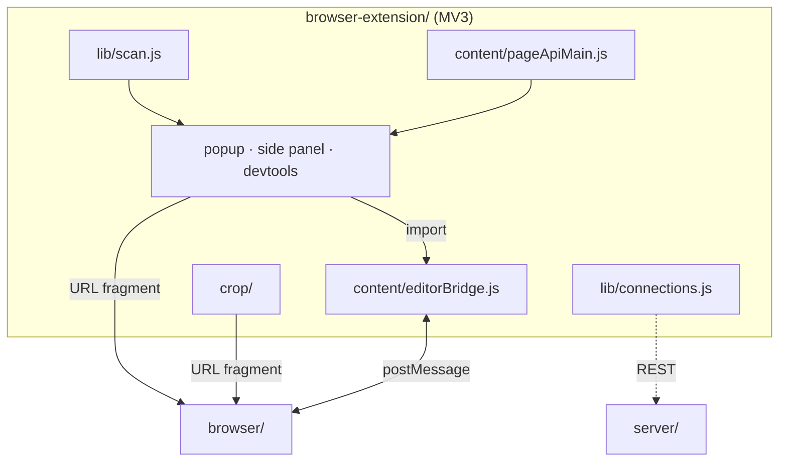
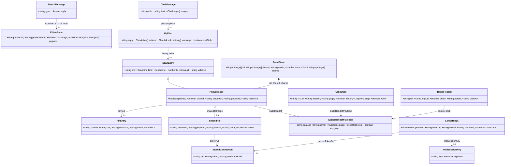

# Extension architecture

The system-wide design — the parity contract, canonical data, the layer model, the pattern vocabulary — is in the root [`ARCHITECTURE.md`](../ARCHITECTURE.md).

The extension is a Chrome MV3 adapter: it scans the images on any page, lists them in a
popup, side panel or DevTools panel, and hands one to the `browser/` editor through a URL
fragment. It runs no `core/`, parses no `.stencil` file and never reads `../browser` at runtime.



## Layers

`lib/` → `config/` → `llm/` → `background/` → `content/` → `popup/`, `options/`, `crop/`.
`lib/` is the dependency-free bottom. `tests/layerBoundary.test.js` lints every relative
import in `src/`.

## Where things go

| Path | Holds | Rule |
|---|---|---|
| `manifest.json` | MV3 manifest | CSP `script-src 'self'`, no `unsafe-inline`; `web_accessible_resources` is exactly `src/crop/crop.html` — `tests/manifestSecurity.test.js` |
| `src/config/` | copies of `common/config/{,llm/}` tables | byte-pinned to the originals by `tests/dataParity.test.js` |
| `src/lib/` | the shared bottom, one folder per feature: the fetch guard (`connection/urlGuard.js` over `addressRanges` and a pinned `blockedRanges.json`), `stencil.js` (the editor launch), the scanner, pins, connections, menus, drop zones, the ported browser modules, and the theme, motion, `webcore/` and `logo/` kits | pure where possible and node-tested; a ported or copied file stays byte-identical to its browser original (`tests/portParity.test.js`); `numericWatch` is the one page-wide observer upgrading numeric fields |
| `src/llm/` | settings, client, the Anthropic session key, the registry-driven validator (byte-identical to the browser's; `planCaps` holds the §1 JSON caps checked before the walk), the extension profile, executors, the chat controller | plans validate before any executor runs; the Anthropic key lives in `chrome.storage.session` only |
| `src/background/` | the service worker: `background.js` is wiring only; `handlers/` holds one module per message group | every function handed to `chrome.scripting.executeScript` stays self-contained (`tests/injectedFuncs.test.js`) |
| `src/content/` | `ctxResolve.js` + `ctxTarget.js` (the one always-on content script), the `pageApi` files (`window.stencil`), `editorApiMain` + `editorBridge` (editor origin only, `stencil.extension`) | content scripts cannot import modules: a multi-file one is one ordered registration (`CTX_PROBE_FILES`, `PAGE_API_MAIN_FILES`) sharing one namespace object, which the MAIN-world facade deletes once it stands; `pageApiMedia` mirrors `lib/image/pageImages.js` |
| `src/popup/` | the panel controller (`popup.js`, wiring only), the editor mode, the assistant | the same controller runs the popup, the side panel and the DevTools panel |
| `src/sidepanel/`, `src/devtools/` | the docked and the DevTools surfaces | reuse `popup.js` and the popup CSS; DevTools targets `inspectedWindow.tabId` |
| `src/crop/` | the quick-crop tool | the only web-accessible resource |
| `src/options/` | one section file per group behind a boot-order-only `options.js`; `secrets/` — the logo shows' triggers and the page's `window.stencil.EasterEggs` | the Provider list is built from `config/providers.json`; the shows run on this page only |
| `tests/` | `node --test` suites, `helpers/` (chrome/DOM stubs), `pins/css.json`, `fixtureOverrides.json` | |

## Entities



| Entity | What it is | Owned by / lifetime | Relates to |
|---|---|---|---|
| `PanelState` (`popup/list/model.js`) | the one live state of a panel document: rows, filtered view, page/editor mode, its tabs | module singleton `state`, for the document's life | composes `PopupImage`; refreshed by `popup/list/scan.js` and the `pollClock` |
| `ScanEntry` (`lib/image/scan.js`) | one image or video the injected scanner found, deduped by `src` across frames | produced per scan by `scanPageForImages`, merged by `mergeScanFrames` | base of `PopupImage`; the model's listing indexes into it |
| `PopupImage` (`popup/list/model.js`) | a `ScanEntry` attributed (tab, resource, name) and annotated with pin/opened state, or a server project standing in for one | `PanelState.all`, rebuilt on every scan | `PinEntry`, `SharedPin`, `EditorHandoffPayload` |
| `PinEntry` (`lib/prefs/pins.js`) | a pinned source URL keyed by (site, source), with keywords and a colour | `chrome.storage` under `PINS_KEY`; `background/tabState.js` keeps a synchronous `pinsCache` | annotates `PopupImage`; mirrored on a server as `SharedPin` |
| `SharedPin` (`lib/connection/model.js`) | a server project projected onto the pin shape; `ServerProject` is canonical in `server/internal/protocol` | derived on each `refreshSharedPins`, never stored; the last list and its ETags are kept per server for the panel's life | `StoredConnection`; becomes a `PopupImage` via `sharedToImage` |
| `StoredConnection` (`lib/connection/store.js`) | a server URL, its bearer token and whether it is an admin credential; `Connection` adds the live `credential` | `chrome.storage` under `CONNECTIONS_KEY`, edited from `options/connections.js` | `SharedPin`, `LlmSettings` (`stencil-server` token) |
| `EditorState` (`lib/messages.js`) | what one editor tab reports: project, image, incognito, its project list | answered by `content/editorBridge.js` per request, 1500 ms timeout | `StencilMessage` (`EDITOR_STATE`, `EDITOR_LIST`) |
| `EditorHandoffPayload` (`lib/stencil.js`) | the `#stencil=` fragment body; the receiving side (`normalizeLaunchPayload`, `applyExternalLaunch` in `browser/js/core/launch/controller.js`) is canonical | built by `buildHandoff`/`buildHandoffPayload` per launch, capped at `MAX_PAYLOAD` | `PopupImage`, `CropState`, `TargetRecord`, `OpenLaunch` (`llm/openActions.js`) |
| `CropState` (`crop/handoff.js`) | the quick-crop page's whole mutable state: source, decoded size, page format, orientation, rect, zoom | one per `crop.html` document, seeded from `chrome.storage.session` | `EditorHandoffPayload` |
| `TargetRecord` (`background/tabState.js`) | what the `ctxTarget.js` probe last resolved under the cursor in one tab (image, CSS background, video, poster) | `lastTargetByTab` in the worker, overwritten per probe | the context-menu click handlers (`background/ctxActions.js`) |
| `StencilMessage` (`lib/messages.js`) | a `chrome.runtime` message: a `MSG` channel tag plus its fields; request/response channels answer `Answer<T>` | transient; one handler per `type` in `background/handlers/` | `EditorState`, every popup and content module |
| `OpPlan` (`llm/op/plan.js`) | a validated model reply: prose, whitelisted `PlanAction`s, an optional `PlanAsk`, warnings; `common/config/llm/opRegistry.json` is canonical | per model round inside `ChatController.send` | `ChatMessage`, `ScanEntry` (index-bound), `ExecContext` (`llm/op/executors.js`) |
| `ChatMessage` (`llm/client.js`) | one replayed turn with base64 `ChatImage`s; the wire shape shared byte-for-byte with the browser client | `ChatController.history`, in memory only, trimmed to `HISTORY_LIMIT` | `OpPlan`, `LlmSettings` |
| `LlmSettings` (`llm/settings.js`) | the explicit provider configuration: provider, endpoint, model, key, server URL, `shareTabs` | `chrome.storage` under `LLM_SETTINGS_KEY`, edited from `options/llm.js` | `StoredConnection`; `createLlmClient` reads it |
| `HeldSessionKey` (`llm/sessionKey.js`) | the user's own Anthropic key and when it lapses (llm-providers §5) | `chrome.storage.session`, trusted contexts only (`lockSessionKeyArea` on every worker start); dropped on browser close, extension reload, `ttlMinutes` or Forget | joined to one request by `withSessionKey`; never in `storage.local` |

## Patterns

| Pattern | Where | Notes |
|---|---|---|
| Facade | `window.stencil` (`content/pageApiMain.js`, a frozen `Proxy` via `guard`) and `stencil.extension` (`content/editorApiMain.js`, `StencilExtensionApi`) | No core behind it: every page-side call is a `MSG` relay; nothing else is reachable from a page. |
| Mediator | `background/background.js` `messageHandlers` + `resolveClickHandler`; `llm/chatController.js` over `ChatCapabilities` | The worker routes by `msg.type` and menu id; the popup, bridges and editor never address each other. The controller owns history, prompt and rounds and calls injected capabilities only. |
| Strategy | `llm/client.js` over `providers.json` `wire`; `lib/drop/zones.js` `quadrantAt` → `background/handlers/dropZones.js` | The provider and the drop action are picked by table lookup. |
| Observer | `chrome.storage.onChanged` in `background.js` and `popup/storageSync.js`; each server's `/ws` project feed (`lib/connection/events.js`, driven by `popup/pin/sharedLive.js`); `lib/pollClock.js` (`POLL_MS` 8 s); `watchAccentActionIcon` | Feeds live only while a panel document is open; one heartbeat per panel, idle while hidden; no background socket. |
| Repository | `lib/prefs/{pins,ledger,settings}.js`, `lib/connection/store.js`, `llm/settings.js` | Each wraps one `chrome.storage` key behind load/save/upsert functions; callers never touch storage. |
| Chain of Responsibility | `urlGuard` → `fetchAsDataUrl` → `lib/image/rasterize.js`; `background/frameCapture.js` routes, tried in order | A fetch passes the guard, then decoding, then re-encoding. A video still is tried in-tab, then via fetch, then from a screenshot. |
| Adapter | `llm/openActions.js` `translateOpenActions`; `popup/pin/sharedPins.js` `sharedToImage`; `lib/menu/editorTabs.js` `editorRow` | An op plan onto launch options, a server project onto a row, a chrome tab plus `EditorState` onto an `EditorRow`. |
| MAIN ⇄ ISOLATED bridge | `pageApiMain` ↔ `pageApiBridge`; `editorApiMain` ↔ `editorBridge` (`SRC.EXT_API`/`EXT_API_RES`, `SRC.EXT_REQ`/`EXT_RES`) | Id-correlated `postMessage` envelopes, same window only; the ISOLATED half owns `chrome.*`. |
| Injected function | `scanPageForImages`, `mountDropZones`, `mountStencilModal`, the probe in `registrars.js` | Handed to `chrome.scripting.executeScript({ func })`; each closes over nothing and carries its own mirror of `MSG`. |
| Table-driven validator | `llm/op/schema.js` `createSchema` + `llm/op/validate.js` `OP_REGISTRY` / `EXT_VALIDATORS` | The op registry is the schema; per-op code adds only listing-bound rules. |
| Double-click reset | `installDblReset` (`lib/control/dblReset.js`) on the Options page and the popup | The editor's twin: a select or checkbox returns to its default through `change`; Options still saves on Save |
| Anchored entrance | `growFrom` (`lib/control/dropdownMenu.js`), the Options accent picker, the logo's colour menu | The editor's twin: a list grows out of the point its particle cloud flies from — the caret, or the logo's centre |
| Alt peek | `wireAltPeek` (`lib/tip/altPeek.js`) over the ported `createModalOpenGesture`, on every enhanced select, the accent picker and the logo's colour menu (`lib/accent/logoAccent.js`) | The editor's twin: Alt+hover peeks a list, which lingers if Alt is released over it and closes otherwise; a click-opened list ignores Alt; on the logo's menu a release on a colour picks it (`wireReleasePick`) |

## Design

- **A page scan.** `popup/list/scan.js` runs `scanPageForImages` in every frame of the source
  tab; `mergeScanFrames` dedupes the `ScanEntry`s into `PopupImage`s in `PanelState.all`, and
  `annotatePinned`/`annotateOpened` join pins and the ledger; the worker scans another tab on
  `MSG.SCAN_TAB`. On the right-click path `ctxTarget.js` resolves (via `ctxResolve.js`) once a
  pointer rests on an element — a 150 ms dwell re-armed per `pointerover`, so motion costs one
  timer reset — then on a right `mousedown` and on `contextmenu`; posters are stamped at load
  and on `play`. `handlers/ctxProbe.js` stores the `TargetRecord` that relabels the menu.
- **The hand-off.** `fetchAsDataUrl` fetches through `urlGuard` (`allowSameHostAs` the scanned
  page), `buildHandoff` folds provenance into an `EditorHandoffPayload`, and `buildLaunchUrl`
  appends it as `#stencil=<encodeURIComponent(JSON)>`, capped at `MAX_PAYLOAD`. `openEditorTab`
  opens a tab, `launchEditorModal` frames the editor in the page (`mountStencilModal`), and
  `resumeInOpenEditor` sends `MSG.EDITOR_SWITCH` to an open editor tab;
  `MSG.EDITOR_IMPORT` carries `src`, `mode` and `crop` into one.

  ```
  { dataUrl, name, page: { size, width?, height? }, source, resource, incognito,
    open?: 'resume' | 'copy', crop?: { x, y, w, h } }
  ```
- **The crop page.** `launchCrop` puts the source URL and `{ source, resource }` in
  `chrome.storage.session` and frames `crop.html` through `mountStencilModal` (`SRC.MODAL` is
  the ready/close handshake). There `CropState` is seeded, `cropStage` owns fit/zoom and the
  drag box, `cropControls` locks the aspect to a `cropGeometry` page format, and
  `buildHandoffPayload` keeps the original plus the rect (`apply`) or bakes the region (`cut`).
- **An LLM turn.** `popup/assistant/turnRunner.js` drains the attachment tray into
  `ChatController.send`. One round: the `opPrompt` system prompt with the `ScanEntry` listing
  (and the open tabs if `shareTabs`); `LlmClient.chat` over the provider wire — `anthropic`
  goes straight to Anthropic (§6.5) with the `HeldSessionKey` from `withSessionKey`, never
  without one or over plain http off loopback; `parseOpPlan` against
  `{ listingLength, tabsLength }`; the executors run each `PlanAction` through injected
  capabilities. A round that only gathered context (`continuationOnly`) earns one more.
- **The webcore skin.** The browser's Win95 look, in both themes. A 3 s still press on a page's
  header mark flips it, only under the grey accent and motion None (the `logoStage.json`
  webcore row). `StencilSkin` stores `stencil_skin` and stamps `<html data-skin="webcore">`
  pre-paint. Turning it on holds a motion mode other than None in `stencil_motion_held` and
  writes None; turning it off restores it unless the user picked one since — the browser's
  session override, stored because the skin outlives the popup. `installWebcore` swaps every
  glyph and the mark to `iconsWebcore.json` pixel art (a pinned copy).
- **The logo shows.** The options page runs the browser's shows (`logoStage.json`, a pinned
  copy): the held mark, a typed name and `window.stencil.EasterEggs` all reach `activateShow`
  (`secrets/trigger.js`), which toggles the webcore skin or opens `lib/logo/stage.js`'s
  full-window canvas and posts the gold notice. `pinkVibe` paints an image, so it stays the
  editor's own.
- **A server connection.** `addServer(rawUrl, token)` (`lib/connection/connections.js`) calls
  `connect` — a session from `POST /auth/token`, proven by `GET /auth/session` or, on a server
  without it, by one project — then persists a `StoredConnection`. `refreshSharedPins` pages
  each connection's projects by `nextCursor`, each page sending its last ETag, into
  `SharedPin`s; `fetchProjectImage` pulls bytes with the bearer token. `sharedLive` refreshes
  on each server's `/ws` `project-event` and polls a feedless server every 8 s, stretching to
  64 s while nothing changes; `isLoopbackHost` unlocks only a user-typed loopback URL.
- **The message contract.** `MSG` names every `chrome.runtime` channel and `SRC` every
  `window.postMessage` envelope; each handler lives in one `background/handlers/` module.
  Fire-and-forget channels return nothing. The editor-mode group is request/response:
  `answers` guarantees `{ ok:true, … } | { ok:false, error }`, `privileged` admits only the
  extension's own pages and the editor origin, and `askEditorTab` times out after 1500 ms.
  A two-hop channel keeps one name on both legs; the two `chrome` send APIs cannot cross.
  The groups: probe (`ctxTarget.js` → worker), page API (page → bridge → worker; sync and
  filter requests stop at the bridge), drop zones (panel ⇄ worker ⇄ overlay), editor mode
  (panel or editor API → worker → `editorBridge`).

## Rules

1. **One fetch guard.** Every fetch — thumbnails, the hand-off, an LLM attachment, a scraped
   poster — goes through `lib/connection/urlGuard.js`. It refuses non-`http(s)`, loopback,
   private, link-local, CGNAT/ULA and the metadata IP, also embedded in an IPv6 literal (mapped,
   compatible, NAT64, 6to4); `data:`/`blob:` pass. Like the CLI, pystencil and desktop,
   `guardedFetch` follows no redirect (an http URL is retried once as its same-host https twin),
   and `readCapped` (`cappedBody.js`, a port of the browser's) stops a body at 64 MiB — a
   server's project file (`fetchProjectImage`) and every server or provider JSON reply included. `allowSameHostAs` (a scanned page's host) and `allowLoopback` (a URL the user
   typed) are the two narrow unlocks; neither unlocks the metadata IP.
2. **The hand-off is a fragment.** Bytes are fetched here (host permissions bypass page
   CORS), converted to a `data:` URL and passed in the `#stencil=` fragment, which never
   reaches a server; the editor's `applyExternalLaunch` consumes and strips it.
3. **Ports stay byte-identical.** Every module `tools/twins.json` copies from the
   browser is pinned byte-equal by `tests/portParity.test.js`; it is edited at its original.
4. **Bridges share one shape.** A MAIN-world script defines a hard-guarded, non-enumerable
   object and postMessages requests to an ISOLATED script that relays them to the worker and
   answers on the same id. "Is this the editor?" is an origin match against the Options
   editor URL (`lib/menu/editorTabs.js` `isEditorTab`) — the same rule scopes the content script.
5. **Imports into an editor go through the editor's own flows** (`loadImageFromFile`,
   `replaceProjectImage`, `projectTransfer.switchToProject`); the extension never touches its
   project registry. "New project" is the fallback whenever the editor's state is unknown —
   the only mode that cannot destroy work on screen.
6. **Two context-menu roots.** The static root declares only `action`/`image`/`video`
   contexts so Chrome hides it itself; the `ctxTarget.js` probe reveals the dynamic root
   *with* its children. The failure mode is "no Stencil entry", not an empty submenu.
7. **Feeds, then one poll.** MV3 popups are short-lived, so shared pins follow each server's
   `/ws` feed only while a surface is open, and editor previews plus any server without a feed
   ride the single 8 s `lib/pollClock.js` heartbeat, skipped while hidden — never a background
   socket, never a second periodic timer.
8. **No native `title`.** Tooltips come from `data-title` via `lib/tip/controlTooltip.js`; the
   injected modal shell (`lib/drop/overlay.js`) is the one exception, themed through
   `lib/prefs/shellTheme.js` as data because it cannot link the theme sheets.
9. **Attachments are rasterised** to PNG (`lib/image/rasterize.js`) before they are sent; the
   contract accepts only png/jpeg/webp/gif and Chrome refuses SVG in `createImageBitmap`.
10. **Motion** mirrors `browser/js/ui/motion/` value for value.

## Tests

`tests/` runs under `node --test`, offline and without Chrome: stubs in `helpers/` stand in
for `chrome.*` and the document, and every REST and LLM function takes an injected `fetch`. Cross-surface drift is pinned, not re-tested:
the ported modules, the `src/config/` copies and the MAIN-world inline helpers stay byte-equal
to their originals. The fixture walkers run the shared corpora under `common/fixtures/`
(the `extension` op-plan profile and its adversarial inputs among them), measured divergences
in `fixtureOverrides.json`. Source text
asserts the import direction, every `.d.ts`, self-contained injected functions, every `MSG`
mirror, the manifest's CSP and its one web-accessible resource. The CSS pin holds every
declaration per document; the guard's negative suites cover private, loopback and metadata
addresses and a redirect refused at the first hop by a live loopback server. The content
scripts run in a `vm` over a stub page in registration order; the shared-pin feed and poll run
on a fake clock.
