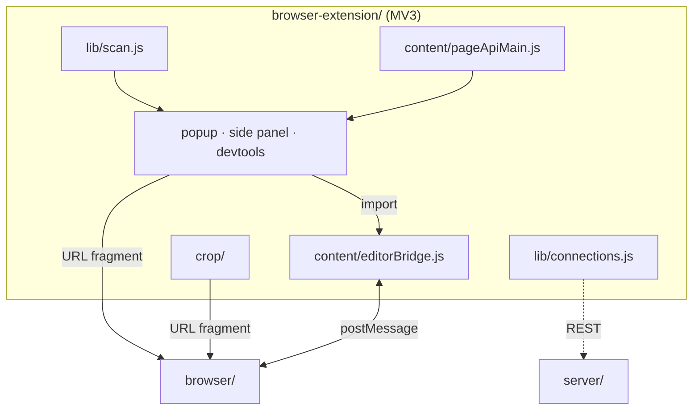

# Extension architecture

The system-wide design — the parity contract, canonical data, the layer model, the pattern vocabulary — is in the root [`ARCHITECTURE.md`](../ARCHITECTURE.md).

The extension is a Chrome MV3 adapter: it scans the images on any page, lists them in a
popup, side panel or DevTools panel, and hands one to the `browser/` editor through a URL
fragment. It runs no `core/`, parses no `.stencil` file and never reads `../browser` at runtime.



## Layers

`lib/` → `config/` → `llm/` → `background/` → `content/` → `popup/`, `options/`, `crop/`.
`lib/` is the dependency-free bottom. `tests/layerBoundary.test.js` lints every relative
import in `src/`.

## Where things go

| Path | Holds | Rule |
|---|---|---|
| `manifest.json` | MV3 manifest | strict CSP; `web_accessible_resources` is exactly `src/crop/crop.html` (`tests/manifestSecurity.test.js`) |
| `src/config/` | copies of `common/config/{,llm/}` tables | byte-pinned to the originals by `tests/dataParity.test.js` |
| `src/lib/` | the shared bottom, one folder per feature: the fetch guard (`connection/urlGuard.js`), `stencil.js` (the editor launch), the scanner, pins, connections, menus, drop zones, the ported browser modules, the UI kits | pure where possible and node-tested; a ported file stays byte-identical to its original (`tests/portParity.test.js`) |
| `src/llm/` | settings, client, the session key, the registry-driven validator, executors, the chat controller | plans validate before any executor runs; the Anthropic key lives in `chrome.storage.session` only |
| `src/background/` | the service worker: `background.js` is wiring only; `registrars.js` holds the content-script registration and the settings keys that re-run it; `handlers/` holds one module per message group | every function handed to `chrome.scripting.executeScript` stays self-contained (`tests/injectedFuncs.test.js`) |
| `src/content/` | `ctxResolve.js` + `ctxTarget.js` (the one always-on content script), the `pageApi` files (`window.stencil`), `editorApiMain` + `editorBridge` (editor origin only, `stencil.extension`) | content scripts cannot import modules: a multi-file one is one ordered registration (`CTX_PROBE_FILES`, `PAGE_API_MAIN_FILES`) sharing one namespace object |
| `src/popup/` | the panel controller (`popup.js`, wiring only), the editor mode, the assistant | the same controller runs the popup, the side panel and the DevTools panel |
| `src/sidepanel/`, `src/devtools/` | the docked and the DevTools surfaces | reuse `popup.js` and the popup CSS; DevTools targets `inspectedWindow.tabId` |
| `src/crop/` | the quick-crop tool | the only web-accessible resource |
| `src/options/` | one section file per group behind a boot-order-only `options.js`; `secrets/`, the logo shows | the Provider list is built from `config/providers.json`; the shows run on this page only |
| `tests/` | `node --test` suites, `helpers/` (chrome/DOM stubs), pins | |

## Entities


| Entity | What it is | Owned by / lifetime | Relates to |
|---|---|---|---|
| `PanelState` (`popup/list/model.js`) | the one live state of a panel document | module singleton `state`, for the document's life | composes `PopupImage`; refreshed by `popup/list/scan.js` |
| `ScanEntry` (`lib/image/scan.js`) | one image or video the injected scanner found, deduped by `src` across frames | produced per scan by `scanPageForImages`, merged by `mergeScanFrames` | base of `PopupImage`; the model's listing indexes into it |
| `PopupImage` (`popup/list/model.js`) | a `ScanEntry` annotated with its tab and pin/opened state, or a server project standing in for one | `PanelState.all`, rebuilt on every scan | `PinEntry`, `SharedPin`, `EditorHandoffPayload` |
| `PinEntry` (`lib/prefs/pins.js`) | a pinned source URL keyed by (site, source), with keywords and a colour | `chrome.storage` under `PINS_KEY` | annotates `PopupImage`; mirrored on a server as `SharedPin` |
| `SharedPin` (`lib/connection/model.js`) | a server project projected onto the pin shape; `ServerProject` is canonical in `server/internal/protocol` | derived on each `refreshSharedPins`, never stored | `StoredConnection`; becomes a `PopupImage` via `sharedToImage` |
| `StoredConnection` (`lib/connection/store.js`) | a server URL and its bearer token | `chrome.storage` under `CONNECTIONS_KEY`, edited from `options/connections.js` | `SharedPin`, `LlmSettings` (`stencil-server` token) |
| `EditorState` (`lib/messages.js`) | what one editor tab reports: project, image, incognito, its project list | answered by `content/editorBridge.js` per request | `StencilMessage` (`EDITOR_STATE`, `EDITOR_LIST`) |
| `EditorHandoffPayload` (`lib/stencil.js`) | the `#stencil=` fragment body; the editor's launch controller is canonical | built by `buildHandoff`/`buildHandoffPayload` per launch, capped at `MAX_PAYLOAD` | `PopupImage`, `CropState`, `TargetRecord`, `OpenLaunch` (`llm/openActions.js`) |
| `CropState` (`crop/handoff.js`) | the quick-crop page's whole mutable state | one per `crop.html` document, seeded from `chrome.storage.session` | `EditorHandoffPayload` |
| `TargetRecord` (`background/tabState.js`) | what the `ctxTarget.js` probe last resolved under the cursor in one tab | `lastTargetByTab` in the worker, overwritten per probe | the context-menu click handlers (`background/ctxActions.js`) |
| `StencilMessage` (`lib/messages.js`) | a `chrome.runtime` message tagged by its `MSG` channel | transient; one handler per `type` in `background/handlers/` | `EditorState`, every popup and content module |
| `OpPlan` (`llm/op/plan.js`) | a validated model reply; `common/config/llm/opRegistry.json` is canonical | per model round inside `ChatController.send` | `ChatMessage`, `ScanEntry` (index-bound), `ExecContext` (`llm/op/executors.js`) |
| `ChatMessage` (`llm/client.js`) | one replayed turn with base64 `ChatImage`s | `ChatController.history`, in memory only, trimmed to `HISTORY_LIMIT` | `OpPlan`, `LlmSettings` |
| `LlmSettings` (`llm/settings.js`) | the explicit provider configuration | `chrome.storage` under `LLM_SETTINGS_KEY`, edited from `options/llm.js` | `StoredConnection`; `createLlmClient` reads it |
| `HeldSessionKey` (`llm/sessionKey.js`) | the user's own Anthropic key and when it lapses (llm-providers §5) | `chrome.storage.session`, trusted contexts only (`lockSessionKeyArea`), until browser close, extension reload, `ttlMinutes` or Forget | joined to one request by `withSessionKey`; never in `storage.local` |

## Patterns

| Pattern | Where | Notes |
|---|---|---|
| Facade | `window.stencil` (`content/pageApiMain.js`, a frozen `Proxy` via `guard`) and `stencil.extension` (`content/editorApiMain.js`, `StencilExtensionApi`) | No core behind it: every page-side call is a `MSG` relay; nothing else is reachable from a page. |
| Mediator | `background/background.js` `messageHandlers` + `resolveClickHandler`; `llm/chatController.js` over `ChatCapabilities` | The worker routes by `msg.type` and menu id, so the popup, bridges and editor never address each other; the controller calls injected capabilities only. |
| Strategy | `llm/client.js` over `providers.json` `wire`; `lib/drop/zones.js` `quadrantAt` → `background/handlers/dropZones.js` | The provider and the drop action are picked by table lookup. |
| Observer | `chrome.storage.onChanged` in `background.js` and `popup/storageSync.js`; each server's `/ws` project feed (`lib/connection/events.js`, driven by `popup/pin/sharedLive.js`); `lib/pollClock.js`; `watchAccentActionIcon` | Feeds live only while a panel document is open (Rule 7). |
| Repository | `lib/prefs/{pins,ledger,settings}.js`, `lib/connection/store.js`, `llm/settings.js` | Each wraps one `chrome.storage` key behind load/save/upsert functions; callers never touch storage. A key with writers in several contexts writes through `lib/prefs/writeChain.js`. |
| Chain of Responsibility | `urlGuard` → `fetchAsDataUrl` → `lib/image/rasterize.js`; `background/frameCapture.js` routes, tried in order | Each step runs only if the one before passed or failed over to it. |
| Adapter | `llm/openActions.js` `translateOpenActions`; `popup/pin/sharedPins.js` `sharedToImage`; `lib/menu/editorTabs.js` `editorRow` | Each maps an outside shape onto one the panel already handles. |
| MAIN ⇄ ISOLATED bridge | `pageApiMain` ↔ `pageApiBridge`; `editorApiMain` ↔ `editorBridge` (`SRC.EXT_API`/`EXT_API_RES`, `SRC.EXT_REQ`/`EXT_RES`) | Id-correlated `postMessage` envelopes, same window only; the ISOLATED half owns `chrome.*`. |
| Injected function | `scanPageForImages`, `mountDropZones`, `mountStencilModal`, the probe in `registrars.js` | Handed to `chrome.scripting.executeScript({ func })`; each closes over nothing and carries its own mirror of `MSG`. |
| Table-driven validator | `llm/op/schema.js` `createSchema` + `llm/op/validate.js` `OP_REGISTRY` / `EXT_VALIDATORS` | The op registry is the schema; per-op code adds only listing-bound rules. |
| Double-click reset | `installDblReset` (`lib/control/dblReset.js`) | A control returns to its default through `change` |
| Gesture machines | `wireAltPeek` (`lib/tip/altPeek.js`), `wireDragPick` (`lib/control/dropdownMenu.js`) over ported pure machines | A pure machine under thin DOM wiring; only the release acts |

## Design

- **A page scan.** `popup/list/scan.js` runs `scanPageForImages` in every frame of the source
  tab; `mergeScanFrames` dedupes the `ScanEntry`s into `PopupImage`s in `PanelState.all`, and
  `annotatePinned`/`annotateOpened` join pins and the ledger; the worker scans another tab on
  `MSG.SCAN_TAB`. On the right-click path `ctxTarget.js` resolves (via `ctxResolve.js`) the element
  under a resting pointer, and `handlers/ctxProbe.js` stores the `TargetRecord` that relabels the
  menu.
- **The hand-off.** `fetchAsDataUrl` fetches through `urlGuard`, `buildHandoff` folds
  provenance into an `EditorHandoffPayload`, and `buildLaunchUrl` appends it as the `#stencil=`
  fragment. The editor opens in a tab (`openEditorTab`) or framed in the page
  (`launchEditorModal`); an open editor tab takes `MSG.EDITOR_SWITCH` or `MSG.EDITOR_IMPORT`.

  ```
  { dataUrl, name, page: { size, width?, height? }, source, resource, incognito,
    open?: 'resume' | 'copy', crop?: { x, y, w, h } }
  ```
- **The crop page.** `launchCrop` seeds `chrome.storage.session` and frames `crop.html` through
  `mountStencilModal`. There `CropState` is edited, and `buildHandoffPayload` keeps the original
  plus the rect (`apply`) or bakes the region (`cut`).
- **An LLM turn.** `popup/assistant/turnRunner.js` drains the attachment tray into
  `ChatController.send`. One round: the `opPrompt` system prompt with the `ScanEntry` listing;
  `LlmClient.chat` over the provider wire (`anthropic` only with the `HeldSessionKey` from
  `withSessionKey`, never over plain http off loopback); `parseOpPlan` against the listing; the
  executors run each `PlanAction` through injected capabilities. A context-only round
  (`continuationOnly`) earns one more.
- **The webcore skin.** `StencilSkin` stores the skin and stamps `<html data-skin="webcore">`
  pre-paint; while it is on, motion is held at None and restored when it goes off.
  `installWebcore` swaps the glyphs to the pinned `iconsWebcore.json` copy.
- **The logo shows.** On the options page every trigger reaches `activateShow`
  (`secrets/trigger.js`), which toggles the webcore skin or opens `lib/logo/stage.js`'s canvas,
  resolved from the pinned `logoStage.json` copy.
- **A server connection.** `addServer(rawUrl, token)` (`lib/connection/connections.js`)
  opens and proves a session, then persists a `StoredConnection`. `refreshSharedPins` pages each
  connection's projects into `SharedPin`s; `fetchProjectImage` pulls bytes with the bearer
  token; `sharedLive` refreshes on each server's `/ws` `project-event`.
- **The message contract.** `MSG` names every `chrome.runtime` channel and `SRC` every
  `window.postMessage` envelope; each handler lives in one `background/handlers/` module.
  Fire-and-forget channels return nothing; the editor-mode group is request/response, where
  `answers` guarantees `{ ok:true, … } | { ok:false, error }`. A two-hop channel keeps one
  name on both legs. The groups: probe, page API, drop zones, editor mode, store writes.
- **The editor-origin trust boundary.** `privileged` (`background/editorRelay.js`) admits the
  extension's own pages and, while `editorPageApi` is on (the default), any page on the
  configured editor origin (default `http://localhost:8080/`): every page served from that
  origin can list editor and source tabs, scan another tab and import into an editor. The
  origin is the user's choice, so it is trusted as the extension itself is.
- **A cross-context write.** `chrome.storage` has no atomic read-modify-write. A pin or ledger
  write from the popup, side panel, DevTools panel, options or crop page goes to the worker as
  `MSG.STORE_WRITE` (`routeStoreWrites`), which only the extension's own pages may send; the
  worker runs it on that key's one `writeChain`, reading the list inside its turn, so every
  context's writes are one serial sequence. A document whose worker does not answer writes on
  its own chain.

## Concurrency

Every context is one JavaScript event loop, and they share nothing but `chrome.storage` and
messages. The MV3 service worker starts on an event and is terminated when idle, losing its
module state: `background/tabState.js`'s per-tab maps and pins cache, `menus.js`'s
`desktopSchemeSet` and `registrars.js`'s `registrationQueue`. Each start re-asserts what it
needs — the menus are rebuilt, the bridge registration re-runs, the pins cache is re-read, the
session-key area is locked — and the per-tab maps refill on the next probe. Each panel document
(popup, side panel, DevTools panel), the options page and the crop page live only while open.

| Owner | Runs on | Shares | Guard | On overflow or teardown |
|---|---|---|---|---|
| `registrationQueue` (`background/registrars.js`) | the worker | content-script registrations | one pass at a time, the settings read inside the pass | a rejected pass does not stop the next; dies with the worker, the next start re-registers |
| `PINS_KEY` writers (`lib/prefs/pins.js`) | the worker (context menu, page API); panels and options through `MSG.STORE_WRITE` | `chrome.storage.local` `stencil-pinned` | the worker's `writeChain`, read inside each turn | a rejected write does not stop the chain; with no answering worker a document writes on its own chain |
| `LEDGER_KEY` writers (`lib/prefs/ledger.js`) | the worker (hand-offs, drops, `pruneLedger` on `MSG.REGISTRY`); panels and the crop page through `MSG.STORE_WRITE` | `chrome.storage.local` `stencil-opened` | the worker's `writeChain`, read inside each turn | as for pins; capped at 500 entries, oldest dropped |
| `pinsCache` (`background/tabState.js`) | the worker | the pins list, read synchronously by the CTX handler | `storage.onChanged` replaces it; a cold worker's first relabel waits for the start-up read up to `PIN_CACHE_WAIT_MS` (the probe's 150 ms dwell) | dies with the worker; re-read at start |
| Panel scan (`popup/list/scan.js`) | the panel document | `PanelState.all` | `createScanTurns`: a later scan retires every earlier one, which then writes nothing | — |
| Project feeds (`popup/pin/sharedLive.js`) | the panel document | one `/ws` socket per server per panel document | a burst of events coalesces into one refresh after 250 ms; a refresh mid-refresh runs once more | closed on `pagehide`; a dropped feed falls back to the poll |
| `pollClock` (`lib/pollClock.js`) | each document | one 8 s interval for every periodic job | the one timer in a document | ticks skip while hidden and run once on `resume`; no jobs, no timer |
| Bridge legs | worker → tab (`editorRelay.js`), bridge → page (`editorBridge.js`), page → bridge (`editorApiMain.js`) | id-correlated requests | timeouts of 1.5 s, 1.5 s, then 4 s (30 s for the slow calls), each longer than the leg it wraps | a timeout answers `{ ok:false }`; a late answer finds no pending id and is dropped |
| `ChatController` (`llm/chatController.js`) | the panel document | the replayed history | `state.busy` admits one turn; the send button aborts the running one | a turn that ends with no reply drops its user turn |

## Rules

1. **Two classes of fetch.** A page-derived URL (a scanned image, a page-API target, a drop,
   a context click) is fetched only through `lib/connection/urlGuard.js`, which refuses
   non-`http(s)` and the address classes of `common/config/net/blockedRanges.json` (also
   embedded in IPv6 literals); `data:`/`blob:` pass. `guardedFetch` follows no redirect and
   `readCapped` (`cappedBody.js`) caps every body. `allowSameHostAs` (a scanned page's host) and
   `allowLoopback` (a URL the user typed) are the two narrow unlocks; neither unlocks the
   metadata IP. A user-configured endpoint (a server connection's REST client
   `lib/connection/rest.js`, its `/ws` feed `lib/connection/events.js`, the LLM client
   `llm/http.js`) is dialled directly, since its URL is explicit user configuration and never
   read out of content; those clients follow no redirect and read replies through
   `cappedBody.js`.
2. **The hand-off is a fragment.** Bytes are fetched here (host permissions bypass page
   CORS), converted to a `data:` URL and passed in the `#stencil=` fragment, which never
   reaches a server; the editor's `applyExternalLaunch` consumes and strips it.
3. **Ports stay byte-identical.** Every module `tools/twins.json` copies from the
   browser, `.d.ts` copies included, is pinned byte-equal by `tests/portParity.test.js`; it is edited at
   its original. `lib/logo/stage.js` pins only the functions it shares with
   `browser/js/ui/logo/stage.js` (the bare-window test and the mark's selector are the page's
   own); `lib/logo/stageLook.js` (motion read from `StencilMotion`, a `MutationObserver` on `<html>`
   where the app subscribes to its event bus) and `lib/control/customSelect.js` (its own face,
   row match and hover delay) are extension-owned modules derived from their browser
   namesakes, not ports.
4. **Bridges share one shape.** A MAIN-world script defines a hard-guarded, non-enumerable
   object and postMessages requests to an ISOLATED script that relays them to the worker and
   answers on the same id. "Is this the editor?" is an origin match against the configured
   editor URL (`lib/menu/editorTabs.js` `isEditorTab`), which also scopes the content script.
5. **Imports into an editor go through the editor's own flows** (`loadImageFromFile`,
   `replaceProjectImage`, `projectTransfer.switchToProject`); the extension never touches its
   project registry; "New project" is the fallback whenever the editor's state is unknown.
6. **Two context-menu roots.** The static root declares only `action`/`image`/`video`
   contexts so Chrome hides it itself; the `ctxTarget.js` probe reveals the dynamic root
   *with* its children, so a failure is no entry, never an empty submenu.
7. **Feeds, then one poll.** Shared pins follow one `/ws` feed per server per open panel
   document, closed on `pagehide`; everything else rides the single `lib/pollClock.js`
   heartbeat, skipped while hidden — never a background socket, never a second periodic timer.
8. **No native `title`.** Tooltips come from `data-title` via `lib/tip/controlTooltip.js`. The
   injected modal shell (`lib/drop/overlay.js`) carries `data-title` too, and shows no tooltip
   over the host page, where that module never runs.
9. **Attachments are rasterised** to PNG (`lib/image/rasterize.js`) before they are sent.
10. **Motion** mirrors `browser/js/ui/motion/` value for value; `tests/portParity.test.js`
    pins the ports.
11. **Typed boundaries are a pinned allowlist.** `tests/helpers/dtsDocumented.js` lists every
    `src/` module that carries a `.d.ts`, and `tests/dts.test.js` holds the tree to exactly that
    list and every declaration to a real export. A ported module carries its original's `.d.ts`
    as a port; `lib/motion.js`, a re-export barrel, carries none.

## Tests

`tests/` runs under `node --test`, offline and without Chrome: stubs in `helpers/` stand in
for `chrome.*` and the document, and every REST and LLM function takes an injected `fetch`.
Cross-surface drift is pinned, not re-tested: the ported modules, the `src/config/` copies and the MAIN-world inline helpers stay byte-equal
to their originals. The fixture walkers run the shared corpora under `common/fixtures/`, measured
divergences in `fixtureOverrides.json`. Source text
asserts the import direction, every `.d.ts`, self-contained injected functions, every `MSG`
mirror, the manifest's CSP and its one web-accessible resource. The CSS pin holds every
declaration per document; the guard's negative suites cover blocked addresses and a refused
redirect. The content scripts run in a `vm` over a stub page; the feed and poll run on a fake
clock. Concurrent storage writers race over the stub's deferred `set`, and gated promises drive
the cross-context store writes, the scan turns, the cold-worker relabel and a stopped chat turn.
