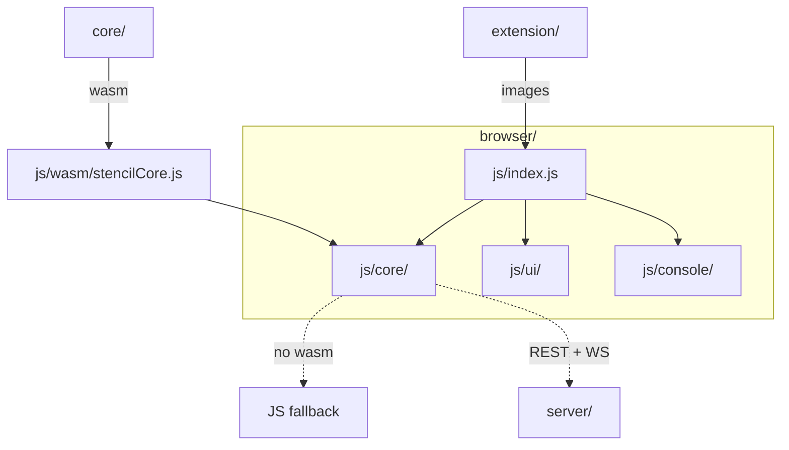

# Browser app architecture

The system-wide design — the parity contract, canonical data, the layer model, the pattern vocabulary — is in the root [`ARCHITECTURE.md`](../ARCHITECTURE.md).



## Layers

`config/` + `utils.js` → `core/` (**no DOM**) → bus (`core/emitter.js`) → `net/` → `llm/` →
console facade (`console/stencilApi.js`) → `ui/` → render. A layer imports only from its
left; `tests/layerBoundary.test.js` enforces it.

## Where things go

| Path | Holds | Rule |
|---|---|---|
| `index.html` | the single `<script type="module">` entry and the CSS link order | the link order **is** the cascade; the CSP meta is identical to the `nginx.conf` header |
| `css/` | `theme.css`, then `layout/`, `components/` (+ `chat/`), `animations/` | one file per section; tokens live in `theme.css` and are mirrored in `js/config/themeTokens.json` |
| `js/config/` | constants, hotkey + help-text registries, and every cross-surface table (`themeTokens`, `mediaTypes`, `uiStrings`, `events`, `motion`, `svgArt`, `llm/`) | **the canonical home of shared data**; the other surfaces embed or drift-test it |
| `js/utils.js` + `js/utils/` | DOM, geometry, color, hotkey helpers | one import point; pure |
| `js/core/` | `DrawingApp` and its collaborators: renderer, storage, history, zoom/pan, coord table, formulas, projects store, `deepLink`, `projectFile`, `extensionBridge`, `stencilCore` (the wasm singleton) | **no DOM access** — it runs under `node --test` |
| `js/bus/` | `appBus.js`, the app-wide event channel | channel names come from `config/events.json` |
| `js/net/` | abortable fetch, the connection store + manager, remote sync | every fetch goes through the one guard here |
| `js/llm/` | provider client, op-plan parser/executor, chat controller, the one shared chat session | validates every plan against `config/llm/opRegistry.json` before anything runs |
| `js/console/` | the `window.stencil` facade, one module per concern | frozen; every mutation routes through the same core methods the toolbar uses |
| `js/ui/` | string-returning components composed by `layout()`; `bindings/` wires controls to the app; `motion/` + `dustCloud.js` | components return strings and emit on the bus — never reach into `net/` or `llm/` |
| `js/worker/` | the cross-tab projects sync worker | message constants shared with the app |
| `js/wasm/` | the generated `stencilCore.js` | gitignored; built by `npm run build-wasm` / CI |
| `sw.js`, `manifest.webmanifest`, `launch.html`, `vite.config.js` | the PWA shell, the `stencil://` bounce page, the optional single-file build | nothing in the app may depend on the build |
| `tools/` | the static server, the single-file build and its self-check | dev only |
| `tests/` | `node --test` suites, `wasm-parity.test.js`, `layerBoundary.test.js`, `dts.test.js` | never loads wasm — always the JS fallback |

## Rules

1. **Every mutation goes through the facade.** Toolbar, hotkey, console script, LLM plan —
   all reach the same `DrawingApp` methods via `window.stencil`; the facade is typed in
   `stencilApi.d.ts`.
2. **wasm with a fallback.** Each module that calls the core keeps its JS body as the
   fallback and the two match op-for-op (`tests/wasm-parity.test.js`). No `eval` /
   `new Function` anywhere.
3. **`js/config/` is canonical.** A value another surface needs is a table here, never a
   literal in code.
4. **Ported modules stay byte-identical.** `ui/controlTooltip`, `numericInput`,
   `dropdownMenu`, `tipContent`, `scrollbarHover`, `dustCloud`, `motionIcons` and
   `llm/llmClient` are copied into `extension/src/lib/` and pinned byte-identical
   (`extension/tests/portParity.test.js`).
5. **Typed boundary.** Every public module has a sibling `.d.ts`.
6. **Motion is decoration.** Every particle cloud is one canvas (`dustCloud.js`); never a
   DOM node per grain. The OS `prefers-reduced-motion` wins over every setting.
7. **Storage split.** Image-heavy project payloads live in IndexedDB; the small registry
   (names, thumbnails, expiry) in `localStorage`. Chat persistence is opt-in, text only,
   never in incognito.
8. **Nothing local goes outward.** The `#stencil=` fragment never reaches a server
   (`e2e/tests/browser/fragment-privacy`); deep links carry `{url, id, version}`, never a
   token.

## Design

- **Boot.** `js/index.js` calls `core.init()` on the singleton in `js/core/stencilCore.js`,
  which instantiates the wasm module and installs typed wrappers; long strings are marshalled
  over the heap.
- **Project files.** `js/core/projectFile.js` is the pure `.stencil` (de)serializer; IO is
  `ExportService`. It is an adapter-level format, not part of `core/`, so each surface
  serializes it independently and `e2e/` proves they agree on the same bytes. The document:

  ```jsonc
  { "format": "stencil-project", "version": 1, "name": "…",
    "color": "#rrggbb", "keywords": [], "source": "…", "resource": "…",   // each optional
    "blank": true, "blankColor": "#rrggbb",                                 // blank canvases only
    "image":  { "dataUrl": "data:image/png;base64,…", "ext": "png", "w": 1280, "h": 720 },
    "layout": { /* exactly buildLayoutPayload(): imageWidth, imageHeight, lines[], cropRect,
                  rotationQuarters, imageFilter, filterColor, pageSize, customPage*, formulas */ },
    "theme":  { "mode": "dark|light", "accent": "…" } }                     // optional, opt-in
  ```

  The console surfaces (cli, pystencil) may add an optional `chat` key (llm-contract §12.1,
  text only); the browser keeps chats in IndexedDB and on the server's `chat` file instead.
- **Deep links.** `js/core/deepLink.js` normalizes the inbound `#stencil=` fragment
  (`server` / `dataUrl` / `src` / `layout`) and builds the outbound `stencil://` and Telegram
  `?start=` links. `js/core/extensionBridge.js` answers the extension's state/import/switch
  requests through the same core methods.
- **Single-file build.** `vite.config.js` carries its rules inline (no plugins);
  `tools/assertSelfContained.js` re-reads the output, and `tests/singleFileBuild.test.js`
  fails `npm test` if a loader outruns `tools/singleFilePatterns.js`.
