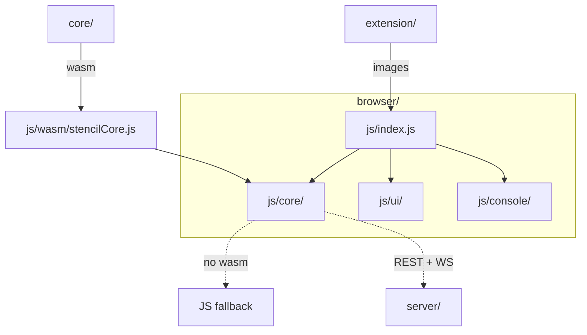
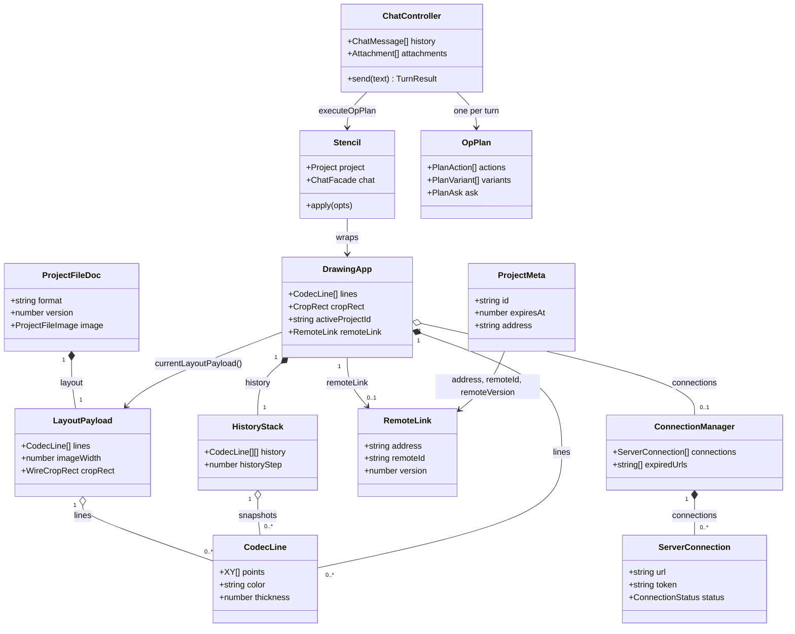

# Browser app architecture

The system-wide design — the parity contract, canonical data, the layer model, the pattern vocabulary — is in the root [`ARCHITECTURE.md`](../ARCHITECTURE.md).

The browser app is the reference front-end: a vanilla ES-module editor with no build step,
running `core/` as wasm behind a JS fallback that matches it op-for-op. It owns the canonical
data tables in `js/config/`, the `.stencil` document format and the layout payload the other
surfaces mirror. It does not own the collaboration protocol (`server/internal/protocol`) and
carries no codec beyond what the DOM provides.



## Layers

`config/` + `utils.js` → `core/` (**no DOM**) → bus (`core/emitter.js`) → `net/` → `llm/` →
console facade (`console/stencilApi.js`) → `ui/` → render. A layer imports only from its
left; `tests/layerBoundary.test.js` enforces it.

## Where things go

| Path | Holds | Rule |
|---|---|---|
| `index.html` | the single `<script type="module">` entry and the CSS link order | the link order **is** the cascade; the CSP meta is identical to the `nginx.conf` header |
| `css/` | `theme.css`, then `layout/`, `components/` (+ `chat/`), `animations/` | one file per section; tokens live in `theme.css` and are mirrored in `js/config/themeTokens.json` |
| `js/config/` | constants, hotkey + help-text registries, and every cross-surface table (`themeTokens`, `mediaTypes`, `uiStrings`, `events`, `motion`, `svgArt`, `llm/`) | **the canonical home of shared data**; the other surfaces embed or drift-test it |
| `js/utils.js` + `js/utils/` | DOM, geometry, color, hotkey helpers | one import point; pure |
| `js/core/` | `DrawingApp` and its collaborators: renderer, storage, history, zoom/pan, coord table, formulas, projects store, `deepLink`, `projectFile`, `extensionBridge`, `stencilCore` (the wasm singleton) | **no DOM access** — it runs under `node --test` |
| `js/bus/` | `appBus.js`, the app-wide event channel | channel names come from `config/events.json` |
| `js/net/` | abortable fetch, the connection store + manager, remote sync | every fetch goes through the one guard here |
| `js/llm/` | provider client, op-plan parser/executor, chat controller, the one shared chat session | validates every plan against `config/llm/opRegistry.json` before anything runs |
| `js/console/` | the `window.stencil` facade, one module per concern | frozen; every mutation routes through the same core methods the toolbar uses |
| `js/ui/` | string-returning components composed by `layout()`; `bindings/` wires controls to the app; `motion/` + `dustCloud.js` | components return strings and emit on the bus — never reach into `net/` or `llm/` |
| `js/worker/` | the cross-tab projects sync worker | message constants shared with the app |
| `js/wasm/` | the generated `stencilCore.js` | gitignored; built by `npm run build-wasm` / CI |
| `sw.js`, `manifest.webmanifest`, `launch.html`, `vite.config.js` | the PWA shell, the `stencil://` bounce page, the optional single-file build | nothing in the app may depend on the build |
| `tools/` | the static server, the single-file build and its self-check | dev only |
| `tests/` | `node --test` suites, `wasm-parity.test.js`, `layerBoundary.test.js`, `dts.test.js` | never loads wasm — always the JS fallback |

## Entities



| Entity | What it is | Owned by / lifetime | Relates to |
|---|---|---|---|
| `DrawingApp` | The editor: image, provenance, lines, viewport, selection, settings and the project session as plain fields (`core/editorState.js`) | One per window, created by `js/index.js` | Mediates every collaborator; facade and toolbar call its methods |
| `CodecLine` | One drawn line, every field explicit (`core/linesCodec.js`, twin of `core/models.hpp`) | `DrawingApp.lines`; copied into snapshots and layouts | `HistoryStack`, `LayoutPayload` |
| `HistoryStack` | Line-snapshot undo/redo with a cursor and `MAX_STEPS`, shared with `core/state/HistoryStack.hpp` | One per app, reset on each project switch | `CodecLine` snapshots |
| `LayoutPayload` | The export subset of `LAYOUT_FIELDS` (`config/layoutFields.json`) plus `lines`; `cropRect` crosses as `{x,y,w,h}` | Built by `buildLayoutPayload` (`core/layout.js`); the browser definition is canonical | `ProjectFileDoc.layout`, the server's project `layout` |
| `ProjectFileDoc` | The `.stencil` document (`core/projectFile.js`); `format` is the sentinel, `version` the schema | Built by `buildProjectFile`, hardened by `parseProjectFile`; the browser definition is canonical | `LayoutPayload` |
| `ProjectMeta` | One registry row: name, colour, keywords, thumbnail, expiry, optional server link (`core/projectsStore.js`) | The `localStorage` registry behind `ProjectsStore`; expiry arithmetic twinned with `core/state/ProjectsStore.cpp` | `RemoteLink` |
| `RemoteLink` | The editor's link to a server project; `version` is the save-back guard (`core/remoteSyncController.js`) | `DrawingApp.remoteLink` for a server-linked session | `ProjectMeta`, `ServerConnection` |
| `ServerConnection` | One connected server: session token, REST surface, `/ws` feed (`net/serverConnection.js`); its `RemoteProjectRecord` is the server's `protocol.Project` | Created by `ConnectionManager.connect`, closed on disconnect | `ConnectionManager`, `RemoteLink` |
| `ConnectionManager` | The servers one session is connected to plus the expired-credential set; `snapshot()` is what `net/connectionStore.js` persists | Created lazily by the facade, one per app | `ServerConnection` |
| `Stencil` | The frozen `window.stencil` facade (`console/stencilApi.js`): settings, `Line` / `Point` / `Project` handles, `chat`, `llm` | `createStencil(app)` once at boot | Wraps `DrawingApp`; the executor's only target |
| `OpPlan` | A validated model reply: `reply`, `actions`, `variants`, `ask`, `warnings`, `chatOnly` (`llm/opPlan.js`); the op set is `config/llm/opRegistry.json`, canonical for every surface | Returned by `parseOpPlan` for one turn | `PlanAction`, `PlanVariant`, `PlanAsk` |
| `ChatController` | The client-side conversation: replayed history, queued `Attachment`s, the send loop (`llm/chatController.js`); its transcript is the `ChatRow` log in `llm/chatSession.js` | One memoized per app via `sharedChatController` | `OpPlan`, `Stencil`, `LlmClient` |

## Patterns

| Pattern | Where | Notes |
|---|---|---|
| Facade over core | `createStencil(app)` in `console/stencilApi.js`, installed as `window.stencil` | Frozen; toolbar, hotkey, console script and op plan reach the same `DrawingApp` methods through it |
| Mediator | `DrawingApp` (`core/drawingApp.js`) | `HistoryStack`, `Renderer`, `Storage`, `RemoteSyncController`, `ProjectTransferController`, `InputController`, `ZoomPan` each take the app and reach back through it; they do not know one another |
| Command | `HistoryStack.push` / `undo` / `redo` behind `DrawingApp.saveHistory()` | Every undoable edit is a line snapshot, applied and reverted by one code path; wasm twin via `coreHandles.js` |
| Strategy | The provider `wire` in `llm/llmClient.js`, keyed by `config/llm/providers.json`; `FilterMode` in `core.applyFilterRGBA` | Selected by table lookup |
| Observer | `Emitter` (`core/emitter.js`) behind `TabsCoordinator` channels and `ServerConnection.onEvent`; `publish` / `subscribe` in `bus/appBus.js` over the `config/events.json` window events | The `stencil:*` window events are the contract the extension's content scripts read |
| Repository | `ProjectsStore` over a `StorageBackend`; `projectsBackend.js` moves payload keys to IndexedDB; `connectionStore.js` for saved servers; `chatStore.js` for chat documents | Callers see a synchronous `localStorage`-shaped contract |
| Chain of Responsibility | Every `ServerConnection` request: `normalizeUrl` → `isInsecureRemote` → `timeoutSignal()` → `isAuthStatus` / `isExpiredSession` (`net/urlRules.js`, `net/abortable.js`) | The one browser fetch guard; a refused credential lands in the `expired` status, not `error` |
| Adapter | `llm/adapters/{dialog,editor,media,project}.js` (the `ChatCapabilities` bag), `core/extensionBridge.js`, `core/deepLink.js` | Each translates an outside request into the same app methods the toolbar uses |
| State machine | `HoldDrawController` (`core/holdDraw.js`): idle → armed → drawing → idle, or armed → aborted | The host injects time and coordinates; wasm twin via `coreHandles.js` |
| Interpreter | `FormulaEngine` (`core/formulaEngine.js`), a recursive-descent evaluator over one variable | Port of `core/parse/formulaParser.cpp`; never `eval` |

## Design

- **Boot.** `js/index.js` awaits `core.init()` on the singleton in `js/core/stencilCore.js`,
  which instantiates the wasm module and installs typed wrappers (long strings are
  marshalled over the heap), alongside `initProjectsBackend()`. It then constructs
  `DrawingApp`, installs `createStencil(app)` as `window.stencil`, wires chat persistence and
  `publishReady(app)` hands every `<stencil-*>` element the app.
- **An edit.** A pointer event reaches `InputController` / `PointerController`, which mutate
  `DrawingApp.lines` through the same methods the facade exposes. `saveHistory()` pushes a
  snapshot onto `HistoryStack`, `Renderer` repaints, `Storage.saveSoon()` debounces a
  `ProjectsStore.upsert` of `{ image, layout }`, and a server-linked session schedules
  `RemoteSyncController.scheduleRemoteSync()`.
- **Save and sync.** `ProjectsStore.upsert` writes the payload key first, so a quota failure
  leaves the registry untouched. `RemoteSyncController.saveToServer()` calls
  `saveRemoteProject(conn, link, { layout })` guarded by `RemoteLink.version`; a 409 merges
  the peer's lines with `mergeLines` and retries. A `project-event` on the `/ws` feed passes
  `shouldReloadFromEvent` before `reloadRemoteActive()` replaces the editor.
- **An LLM turn.** `sharedChatController(app)` memoizes one `ChatController`;
  `send(text)` replays history (`replayMessages`), calls `LlmClient.chat`, then `parseOpPlan`
  validates the reply against `SCHEMA` (built from `opRegistry.json` for the browser profile)
  and `executeOpPlan(plan, stencil, capabilities)` maps each op 1:1 onto a facade call.
  Variants and ask previews branch through `planSandbox` capture and restore;
  `runLoggedChatTurn` writes the `ChatRow`s the panel and context-menu chat both render.
- **Project files.** `js/core/projectFile.js` is the pure `.stencil` (de)serializer; IO is
  `ExportService`. It is an adapter-level format, not part of `core/`, so each surface
  serializes it independently and `e2e/` proves they agree on the same bytes. The document:

  ```jsonc
  { "format": "stencil-project", "version": 1, "name": "…",
    "color": "#rrggbb", "keywords": [], "source": "…", "resource": "…",   // each optional
    "blank": true, "blankColor": "#rrggbb",                                 // blank canvases only
    "image":  { "dataUrl": "data:image/png;base64,…", "ext": "png", "w": 1280, "h": 720 },
    "layout": { /* exactly buildLayoutPayload(): imageWidth, imageHeight, lines[], cropRect,
                  rotationQuarters, imageFilter, filterColor, pageSize, customPage*, formulas */ },
    "theme":  { "mode": "dark|light", "accent": "…" } }                     // optional, opt-in
  ```

  The console surfaces (cli, pystencil) may add an optional `chat` key (llm-contract §12.1,
  text only); the browser keeps chats in IndexedDB and on the server's `chat` file instead.
- **Deep links.** `js/core/deepLink.js` normalizes the inbound `#stencil=` fragment
  (`server` / `dataUrl` / `src` / `layout`) and builds the outbound `stencil://` and Telegram
  `?start=` links. `js/core/extensionBridge.js` answers the extension's state/import/switch
  requests through the same core methods.
- **Single-file build.** `vite.config.js` carries its rules inline (no plugins);
  `tools/assertSelfContained.js` re-reads the output, and `tests/singleFileBuild.test.js`
  fails `npm test` if a loader outruns `tools/singleFilePatterns.js`.

## Rules

1. **Every mutation goes through the facade.** Toolbar, hotkey, console script, LLM plan —
   all reach the same `DrawingApp` methods via `window.stencil`; the facade is typed in
   `stencilApi.d.ts`.
2. **wasm with a fallback.** Each module that calls the core keeps its JS body as the
   fallback and the two match op-for-op (`tests/wasm-parity.test.js`). No `eval` /
   `new Function` anywhere.
3. **`js/config/` is canonical.** A value another surface needs is a table here, never a
   literal in code.
4. **Ported modules stay byte-identical.** `ui/controlTooltip`, `numericInput`,
   `dropdownMenu`, `tipContent`, `scrollbarHover`, `dustCloud`, `motionIcons` and
   `llm/llmClient` are copied into `extension/src/lib/` and pinned byte-identical
   (`extension/tests/portParity.test.js`).
5. **Typed boundary.** Every public module has a sibling `.d.ts`.
6. **Motion is decoration.** Every particle cloud is one canvas (`dustCloud.js`); never a
   DOM node per grain. The OS `prefers-reduced-motion` wins over every setting.
7. **Storage split.** Image-heavy project payloads live in IndexedDB; the small registry
   (names, thumbnails, expiry) in `localStorage`. Chat persistence is opt-in, text only,
   never in incognito.
8. **Nothing local goes outward.** The `#stencil=` fragment never reaches a server
   (`e2e/tests/browser/fragment-privacy`); deep links carry `{url, id, version}`, never a
   token.

## Tests

- Every suite in `tests/` runs offline under `node --test`, on the JS fallback path: Node
  never loads wasm. The DOM, `fetch`, `localStorage` and speech are stubbed once in
  `tests/helpers/` (`dom.js`, `fetchStub.js`, `memoryStorage.js`, `speech.js`), which
  `net/` and `llm/` take as injected implementations.
- **wasm parity.** `wasm-parity.test.js` (pure ops and marshalling), `-history` (the snapshot
  codec and cursor), `-projects` (expiry arithmetic) and `-state` (the stateful handle
  classes) load the generated `js/wasm/stencilCore.js` and drive the JS reference and the
  compiled core through one script; they self-skip without the artifact, which CI builds.
- **Structural lints.** `layerBoundary.test.js` pins the import direction and the
  `window.stencil` name to `js/console`; `dts.test.js` keeps every `.d.ts` equal to its
  module's exports in both directions; `events.test.js`, `themeTokens.test.js`,
  `csp.test.js` and `opRegistryCanon.test.js` are the drift guards for `events.json`,
  `themeTokens.json`, the CSP meta versus `nginx.conf`, and the registry versus `OPS`.
- **Pins.** `cssInventory.test.js` pins every declaration `index.html` loads to
  `tests/pins/css.json`, file-blind; `ui-markup.test.js` pins the static body ids of `layout()`.
- **Fixture walkers.** `formatFixtures.test.js`, `opPlanFixtures.test.js` and
  `llmWireFixtures.test.js` run the shared corpora through the real browser modules; they
  are the reference the other surfaces' walkers copy.
- **Cross-surface reads.** `helpers/desktopSource.js` and `helpers/extensionCss.js` read the
  desktop and extension trees for parity pins; the byte-identical port check for the copied
  modules lives in `extension/tests/portParity.test.js`. `singleFileBuild.test.js` holds
  without vite: it checks the rewrite patterns in `tools/singleFilePatterns.js` still match.
