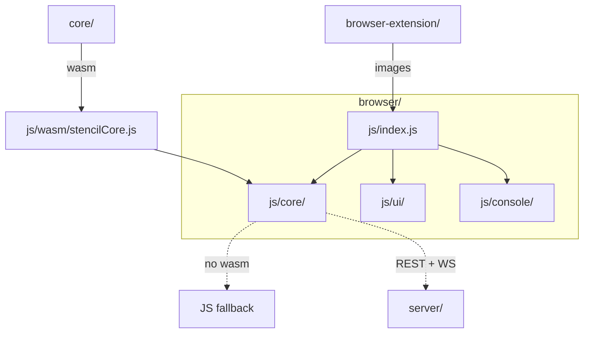
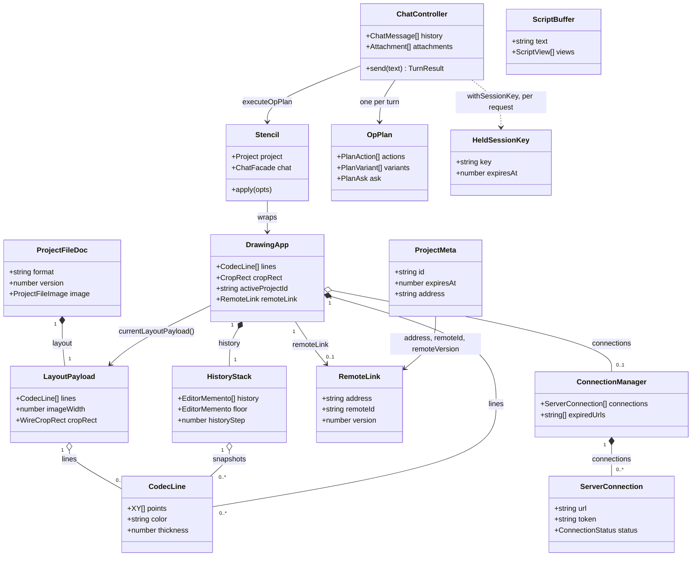

# Browser app architecture

The system-wide design — the parity contract, canonical data, the layer model, the pattern vocabulary — is in the root [`ARCHITECTURE.md`](../ARCHITECTURE.md).

The browser app is the reference front-end: a vanilla ES-module editor with no build step,
running `core/` as wasm behind a JS fallback that matches it op-for-op. It is served beside
the repo's `common/` (the shared tables, corpora and brand art it imports), and owns the
`.stencil` document format and the layout payload the other
surfaces mirror. It does not own the collaboration protocol (`server/internal/protocol`) and
carries no codec beyond what the DOM provides.


```mermaid
graph TD
    CORE["core/"]
    WASM["js/wasm/stencilCore.js"]
    subgraph APP["browser/"]
      IDX["js/index.js"]
      COREJS["js/core/"]
      UI["js/ui/"]
      API["js/console/"]
    end
    FB["JS fallback"]
    EXT["browser-extension/"]
    SRV["server/"]

    CORE -->|"wasm"| WASM
    WASM --> COREJS
    IDX --> COREJS
    IDX --> UI
    IDX --> API
    COREJS -.->|"no wasm"| FB
    EXT -->|"images"| IDX
    COREJS -.->|"REST + WS"| SRV
```

## Layers

`config/` + `utils.js` → `core/` (**no DOM**) → `eventBus/` (`core/emitter.js`) → `net/` → `llm/` →
console facade (`console/stencilApi.js`) → `ui/` → render. A layer imports only from its
left; `tests/layerBoundary.test.js` enforces it. The core reaches the view two ways only: the
change feed a ui area subscribes to (`core/app/changes.js`), and the app's view seam
(`VIEW_SEAM` in `core/drawingApp.js`, the one core file that may import `ui/`).

## Where things go

| Path | Holds | Rule |
|---|---|---|
| `index.html` | the single `<script type="module">` entry and the CSS link order | the link order **is** the cascade; the CSP meta is identical to the `nginx.conf` header |
| `css/` | `theme.css`, then `layout/`, `components/`, `animations/`, and last `webcore/`, the session skin | one file per section; `theme.css` tokens mirror `common/config/themeTokens.json`, a skin's own `tokens.css` mirrors `common/config/webcore.json` |
| `js/config/` | the operator's `openInConfig` and its example | operator config, fetched beside its module; never shared, never committed |
| `../common/` | the shared tables (`config/`), corpora (`fixtures/`, the `.stc` `script/cases.txt` among them), the logo (`icons/`) | served next to `browser/` by every server; a module imports it by relative path, never by a root URL, so the Pages subpath works |
| `js/utils.js` + `js/utils/` | DOM, geometry, color, hotkey helpers | one import point; pure |
| `js/core/` | `DrawingApp` and its collaborators, one folder per feature (`abi/` the wasm singleton, `app/` the DOM-free mixin, change feed and seam) | **no DOM access** — it runs under `node --test` |
| `js/core/script/` (+ `script.js`, `scriptHandles.js`) | the `.stc` engine: lex → parse → templates → lower, plus `dump` | one file per `core/script/*.cpp`; pure — it resolves ops but calls no facade |
| `js/eventBus/` | `appBus.js`, the app-wide event channel | channel names come from `config/events.json` |
| `js/net/` | the fetch guard, abortable fetch, the capped body read, the connection store + manager, remote sync | every fetch goes through `fetchGuard.js` here, every server or provider reply through `cappedBody.js` |
| `js/llm/` | provider client, op-plan parser/executor, chat controller and session, the anthropic session key | every plan is validated against `config/llm/opRegistry.json` before anything runs |
| `js/console/` | the `window.stencil` facade, one module per concern | frozen; it calls what the toolbar calls |
| `js/ui/` | string-returning components composed by `layout()`, one folder per region, plus `bindings/` wiring controls to the app and `control/` the control areas | components return strings and emit on the bus — never reach into `net/` or `llm/` |
| `js/worker/` | the cross-tab projects sync worker and the image worker | a worker filter is bit-identical to the main-thread one, and a worker result paints the inline fallback's `imageRaster.js` sequence |
| `js/wasm/` | the generated `stencilCore.js` | gitignored; built by `npm run build-wasm` / CI |
| `sw.js`, `manifest.webmanifest`, `launch.html`, `vite.config.js` | the PWA shell, the `stencil://` bounce page, the optional single-file build | nothing in the app may depend on the build |
| `tools/` | the static server, the single-file build and its self-check | dev only |
| `tests/` | `node --test` suites mirroring `js/`, and the structural lints | never loads wasm — always the JS fallback |

## Entities


```mermaid
classDiagram
    class DrawingApp { +CodecLine[] lines
      +CropRect cropRect
      +string activeProjectId
      +RemoteLink remoteLink }
    class CodecLine { +XY[] points
      +string color
      +number thickness }
    class HistoryStack { +EditorMemento[] history
      +EditorMemento floor
      +number historyStep }
    class LayoutPayload { +CodecLine[] lines
      +number imageWidth
      +WireCropRect cropRect }
    class ProjectFileDoc { +string format
      +number version
      +ProjectFileImage image }
    class ProjectMeta { +string id
      +number expiresAt
      +string address }
    class RemoteLink { +string address
      +string remoteId
      +number version }
    class ServerConnection { +string url
      +string token
      +ConnectionStatus status }
    class ConnectionManager { +ServerConnection[] connections
      +string[] expiredUrls }
    class Stencil { +apply(opts)
      +Project project
      +ChatFacade chat }
    class OpPlan { +PlanAction[] actions
      +PlanVariant[] variants
      +PlanAsk ask }
    class ChatController { +ChatMessage[] history
      +Attachment[] attachments
      +send(text) TurnResult }
    class ScriptBuffer { +string text
      +ScriptView[] views }
    class HeldSessionKey { +string key
      +number expiresAt }
    DrawingApp "1" *-- "0..*" CodecLine : lines
    DrawingApp "1" *-- "1" HistoryStack : history
    HistoryStack "1" o-- "0..*" CodecLine : snapshots
    DrawingApp --> LayoutPayload : currentLayoutPayload()
    LayoutPayload "1" o-- "0..*" CodecLine : lines
    ProjectFileDoc "1" *-- "1" LayoutPayload : layout
    ProjectMeta --> RemoteLink : address, remoteId, remoteVersion
    DrawingApp "1" --> "0..1" RemoteLink : remoteLink
    DrawingApp "1" o-- "0..1" ConnectionManager : connections
    ConnectionManager "1" *-- "0..*" ServerConnection : connections
    Stencil --> DrawingApp : wraps
    ChatController --> Stencil : executeOpPlan
    ChatController --> OpPlan : one per turn
    ChatController ..> HeldSessionKey : withSessionKey, per request
```

| Entity | What it is | Owned by / lifetime | Relates to |
|---|---|---|---|
| `DrawingApp` | The editor: image, provenance, lines, viewport, selection, settings and the project session as plain fields (`core/editorState.js`), its collaborators and its change feed (`app.changes`) | One per window, created by `js/index.js` | Mediates every collaborator |
| `CodecLine` | One drawn line, every field explicit (`core/line/linesCodec.js`, twin of `core/models.hpp`) | `DrawingApp.lines`; copied into snapshots and layouts | `HistoryStack`, `LayoutPayload` |
| `HistoryStack` | Undo/redo over `{lines, cropRect, rotationQuarters, filter, filterColor}` mementos (a step without a filter leaves it as it is), with a cursor, `MAX_STEPS` and the floor step 0 undoes to; twin of `core/state/HistoryStack.hpp` | One per app, reset on each project switch | `CodecLine` snapshots |
| `LayoutPayload` | The export subset of `LAYOUT_FIELDS` (`common/config/layoutFields.json`) plus `lines`; `cropRect` crosses as `{x,y,w,h}` | Built by `buildLayoutPayload` (`core/layout.js`); the browser definition is canonical | `ProjectFileDoc.layout`, the server's project `layout` |
| `ProjectFileDoc` | The `.stencil` document (`core/project/file.js`); `format` is the sentinel, `version` the schema | Built by `buildProjectFile`, hardened by `parseProjectFile`; the browser definition is canonical | `LayoutPayload` |
| `ProjectMeta` | One registry row: name, colour, keywords, expiry, optional server link (`core/project/store/projectsStore.js`) | The `localStorage` registry behind `ProjectsStore`; expiry arithmetic twinned with `core/state/ProjectsStore.cpp` | `RemoteLink` |
| `RemoteLink` | The editor's link to a server project; `version` is the save-back guard (`core/remote/syncController.js`) | `DrawingApp.remoteLink` for a server-linked session | `ProjectMeta`, `ServerConnection` |
| `ServerConnection` | One connected server: session token, REST surface, `/ws` feed (`net/serverConnection.js`); its `RemoteProjectRecord` is the server's `protocol.Project` | Created by `ConnectionManager.connect` — each of a batch stands alone, so one refusal costs only itself — closed on disconnect | `ConnectionManager`, `RemoteLink` |
| `ConnectionManager` | The servers one session is connected to plus the expired-credential set; `snapshot()` is what `net/connectionStore.js` persists | Created lazily by the facade, one per app | `ServerConnection` |
| `Stencil` | The frozen `window.stencil` facade (`console/stencilApi.js`): settings, `Line` / `Point` / `Project` handles, `chat`, `llm` | `createStencil(app)` once at boot | Wraps `DrawingApp`; the executor's only target |
| `OpPlan` | A validated model reply: `reply`, `actions`, `variants`, `ask`, `warnings`, `chatOnly` (`llm/plan/parser.js`) | Returned by `parseOpPlan` for one turn | `PlanAction`, `PlanVariant`, `PlanAsk` |
| `ScriptBuffer` | The one `.stc` the page is editing (`ui/script/buffer.js`): the text plus its views, so the script window and the context-menu flyout cannot diverge | Module state for the session; never persisted | `wireScriptEditor` (`ui/script/editor.js`) |
| `ChatController` | The client-side conversation: replayed history, queued `Attachment`s, the send loop (`llm/chat/controller.js`); its transcript is the `ChatRow` log in `llm/chat/session.js` | One memoized per app via `sharedChatController` | `OpPlan`, `Stencil`, `LlmClient` |
| `HeldSessionKey` | The user's own Anthropic key and when it lapses (`llm/sessionKey.js`, llm-providers §5) | This tab's `sessionStorage`: a reload keeps it; the tab closing, `sessionKey.ttlMinutes` or Forget drop it | Joined to one request by `withSessionKey`; never in `LlmSettings`, `localStorage`, a project, an export or a fragment |

## Patterns

| Pattern | Where | Notes |
|---|---|---|
| Facade over core | `createStencil(app)` in `console/stencilApi.js`, installed as `window.stencil` | Frozen; every entry point reaches the core through it |
| Mediator | `DrawingApp` (`core/drawingApp.js`) | Each collaborator (`Renderer`, `Storage`, `HistoryStack`, …) takes the app and reaches back through it, never another; `core/app/delegates.js` installs the DOM-free mixin (`core/app/editing.js`) and `VIEW_SEAM` |
| Memento | `HistoryStack.push` / `undo` / `redo` behind `saveHistory()` and `restoreHistoryStep()` | Every undoable edit (stroke, crop, turn, filter or tint commit) is one memento, applied and reverted by one code path; a filter commit pushes only when it moves the filter off the step on screen (`core/settings/filterStep.js`); a step naming another crop or turn is re-derived from the original by `ImageModel.restoreView` without a decode |
| Strategy | The provider `wire` in `llm/client.js` (`config/llm/providers.json`); `FilterMode` in `core.applyFilterRGBA`; the filter painters in `core/image/filterCanvas.js` over one cached base per (image, filter, tint) in `core/draw/baseLayer.js`; the `NotificationSink` pair in `ui/shell/notifySinks.js` | Selected by table lookup. A filter switch builds its base on the frame that asks; only a duotone tint change is painted in the image worker |
| Observer | `app.changes` (an `Emitter`, `core/emitter.js`) over the channels of `core/app/changes.js`; the `Emitter` behind `TabsCoordinator` and `ServerConnection.onEvent`; `eventBus/appBus.js` over the `config/events.json` window events; `ui/domWatch.js`, the one page-wide subtree observer | The `stencil:*` window events are the contract the extension's content scripts read |
| Composite | `StencilElement` (`ui/base.js`): light-DOM custom elements whose `inner()` markup `layout()` concatenates, `$(id)` scoped to its own subtree, `emit()` for the reply upward | Light DOM, because `cssInventory` follows `index.html`'s link order and the extension consumes these modules inside its own shadow roots; a nested host carries `display:contents` |
| Repository | `ProjectsStore` over a `StorageBackend` (`projectsBackend.js`, IndexedDB; an image or thumbnail read back as an object URL, the open image as its data URL); `net/connectionStore.js`; `llm/chat/store.js` | Callers see a synchronous `localStorage`-shaped contract; another tab's write reaches this tab's mirror through `refresh(id)` on its `projectsChanged` |
| Layered canvas | `core/draw/stageLayers.js` behind `Renderer`: `#canvas` the picture, `#canvas-overlay` above it the lines and handles | The picture repaints only when its source, compare mode, split or size changes; every frame repaints the overlay, which takes no pointer. A pixel reader composites `renderer.layers()`; an export, thumbnail or co-edit result repaints through `core/draw/restingPaint.js` |
| Chain of Responsibility | Any URL: scheme → `timeoutSignal()` (`net/fetchGuard.js`). Every `ServerConnection` request: `normalizeUrl` → `isInsecureRemote` → `timeoutSignal()` → `isAuthStatus` / `isExpiredSession` → `readJsonCapped` | The one browser fetch guard: a `file:` URL never reaches `fetch`, nothing leaves without a deadline, and a refused credential lands in `expired`, not `error` |
| Adapter | `llm/adapters/` (the `ChatCapabilities` bag), `core/launch/extensionBridge.js`, `core/launch/deepLink.js` | Each translates an outside request (a chat capability, the extension's state/import/switch, a launch) into the core functions the toolbar calls |
| State machine | `HoldDrawController` (`core/draw/holdDraw.js`): idle → armed → drawing → idle, or armed → aborted | The host injects time and coordinates; wasm twin via `coreHandles.js` |
| State | `DrawingApp.gesture` (`core/pointer/gesture.js`), one drag kind or none | The `is*` drag flags are accessors over it, so two can never both be set |
| Interpreter | `FormulaEngine` (`core/parse/formulaEngine.js`), recursive descent over both axes and `core/parse/formulaContext.js` | Port of `core/parse/formulaParser.cpp`; never `eval` |
| Interpreter + runner | `core/script/` lowers a `.stc` to an op stream; `console/scriptRunner.js` executes it | The parser never touches the editor and the runner never re-parses. Outside `llm/`: an op plan's caps guard model output, not the user's own script |
| Session override | `setMotionOverride` (`ui/motion/motionPrefs.js`), `setIconSkin` (`ui/icons.js`), `setFaviconArt` (`core/settings/accents.js`), laid down by `ui/webcore/toggle.js` | Read by everything, written to no store; the user's next choice through the ordinary setter lifts the motion one |
| Double-click reset | `installDblReset` (`ui/control/dblReset.js`), one capture listener on `document`; the Lines-tab swatch (`ui/panel/linesList.js`) | A select, checkbox or colour field takes its default (`DEFAULTS` by id, else `data-default`, else the markup's) and fires `change`; a line's own colour returns to the toolbar's. A colour field with a default opens its picker only after `POPOVER.doubleClickMs`, so the second click resets instead |
| Nested row menu | `ui/projects/window/rowSubmenu.js` | A row-menu item with `items` flies its list out beside it, on the same surface motion; the parent's click-away asks it whether a press is its own |
| Anchored entrance | `growFrom` (`ui/control/dropdownMenu.js`) | A list's slide entrance grows out of the point its particle cloud flies from, from the edge nearest its trigger |
| Alt peek | `createModalOpenGesture` (`ui/tip/popover.js`) on the modal icons, the logo accent menu and the export list; `wireAltPeek` (`ui/tip/altPeek.js`) on every dropdown | Alt+hover peeks; released over the list it lingers until the pointer leaves, elsewhere closes; one glide registry, so a new peek closes the last unless the window `holds` it; a click-opened list ignores Alt. The logo's colour menu alone commits on release (`wireReleasePick`) |

## Design

- **Boot.** `js/index.js` awaits `core.init()` (`js/core/abi/stencilCore.js`: the wasm module and
  its typed wrappers, long strings marshalled over the heap) and `initProjectsBackend()`, then
  constructs `DrawingApp` (the change feed, the collaborators, then `wireControls`, whose first
  act subscribes the control areas), installs `window.stencil`, wires chat persistence, and
  `publishReady(app)` hands every `<stencil-*>` element the app.
- **A touch.** One finger on a point or segment drags it, a still press taps, a held one
  draws (`HoldDrawController`), and a press on empty canvas that wanders past
  `TOUCH_DEFAULTS.moveTol` pans the viewport 1:1 (`core/touch/pan.js`); two fingers pinch.
  The read-only compare view only pans.
- **An edit.** A pointer event reaches `InputController` / `PointerController`, which call the
  core functions the facade calls. `saveHistory()` pushes a memento onto `HistoryStack` — as a
  crop or a turn does from `ImageModel` — `Renderer` repaints the overlay (a drag once per frame
  through `requestRedraw()`), `Storage.saveSoon()` debounces a `ProjectsStore.upsert` of
  `{ image, layout }`, and a server-linked session schedules `scheduleRemoteSync()`.
- **The controls follow.** An edit signals `changed(app, …channels)` and `FLUSH` runs, in sweep
  order, each area of `ui/control/state.js` that follows one of them: gates first, then one
  tooltip pass, then what repaints after them, then the followers. A pointer move, a hover or a
  zoom signals nothing; a drag's release pushes history alone. `updateButtons()` runs every
  area where anything may have changed.
- **Save and sync.** `ProjectsStore.upsert` writes the image and payload keys before the
  registry, so a quota failure leaves the registry untouched; an edit saves through `saveSoon`,
  a synchronous `save()` only where what follows reads the row. A data-URL `source` enters the
  registry as a hash reference, so the same image still dedupes; its text stays in
  `layout.imageSource`, is shed first over the quota, and never leaves the browser
  (`keptSource`). The co-edit debounce pushes the layout alone under `RemoteLink.version`, a 409
  merging the peer's lines (`mergeLines`) and retrying; the rendered result trails it once the
  edits go quiet (`core/remote/resultUpload.js`). Server writes run one at a time. A peer's
  `project-event` naming the picture on screen (its `originalHash`) is adopted in place as one
  undo step when its lines, filter, crop or turn moved, a crop or turn re-derived from the original
  as an undo re-derives it (`core/remote/peerLayout.js`); another original reloads.
- **An LLM turn.** `ChatController.send(text)` replays history, calls `LlmClient.chat`, `parseOpPlan` validates the reply against the browser
  profile of `opRegistry.json`, and `executeOpPlan` maps each op 1:1 onto a facade call; variants
  and ask previews branch through `planSandbox`, whose snapshot is an editor memento beside the page and formula settings. On the `anthropic` wire (llm-providers §6.5)
  `withSessionKey` joins the `HeldSessionKey` to one request; without one, or over plain http off
  loopback, nothing is sent (`keyedInit` in `llm/http.js`; no LLM request follows a redirect), upstream text
  echoing any eight characters of the key is dropped, and `stencil.llm.apiKey` reads `'[redacted]'`.
- **A copy.** The projects row's "Make a copy ›", the canvas menu's, the Image section's button,
  `Project.copy` / `stencil.copyProject` and the `copyProject` op all reach
  `projectTransfer.copyProject` (`core/project/copy/`): it reads the source (the live editor, a
  stored row or a server-only row), names it with `copySuffixName`, saves it as a detached local
  row or on the source's server, then opens it here, in a new tab, or unsaved in incognito. An
  incognito copy writes nothing, a server copy is never incognito, and a whole-project copy
  takes its saved chat along (`chatPersistence.projectCopied`).
- **A script.** `stencil.execScript(text)`, the script window and a dropped `.stc` call
  `runScript` (`js/console/scriptRunner.js`): one parse through `js/core/script.js`, nothing run
  on an error diagnostic, then each lowered op is one facade call (a `layout` fetches
  http(s) only). A source the browser cannot
  open (a local path) fails at run time and names the line; the edits before it stay.
- **Project files.** `js/core/project/file.js` is the pure `.stencil` (de)serializer; IO is
  `ExportService`. Each surface serializes it independently and `e2e/` proves they agree:

  ```jsonc
  { "format": "stencil-project", "version": 1, "name": "…",
    "color": "#rrggbb", "keywords": [], "source": "…", "resource": "…",   // each optional
    "blank": true, "blankColor": "#rrggbb",                                 // blank canvases only
    "image":  { "dataUrl": "data:image/png;base64,…", "ext": "png", "w": 1280, "h": 720 },
    "layout": { /* exactly buildLayoutPayload(): imageWidth, imageHeight, lines[], cropRect,
                  rotationQuarters, imageFilter, filterColor, pageSize, customPage*, formulas */ },
    "theme":  { "mode": "dark|light", "accent": "…" } }                     // optional, opt-in
  ```

  The console surfaces (cli, pystencil) may add an optional `chat` key (llm-contract §12.1,
  text only); the browser keeps chats in IndexedDB and on the server's `chat` file instead.
- **Deep links.** `js/core/launch/deepLink.js` normalizes the inbound `#stencil=` fragment
  (`server` / `dataUrl` / `src` / `layout`) and builds the outbound `stencil://` and Telegram
  `?start=` links; `applyExternalLaunch` (`core/launch/controller.js`) loads it and strips it. A
  `.stc` and the incognito flag ride the same fragment, with `scriptMode`: `run` (the default)
  runs it once the launch settles, leaving it in the buffer; `open` puts it in the Script window
  and runs nothing. `stencil://` carries it as `script=` / `scriptMode=`, alone or beside the
  picture (`core/launch/desktopLink.js`, shared with Open In).
- **A logo show.** The held mark, a typed name and `stencil.EasterEggs.<show>()` reach
  `activateShow` (`ui/logo/stageTrigger.js`): the stage (`ui/logo/stage.js`, one canvas
  swallowing the keyboard but Escape), or for the pink show one `installLayout` edit;
  `config/logoStage.json` resolves a show on both front-ends. The webcore show toggles
  (`ui/webcore/toggle.js`) the session overrides and `config/iconsWebcore.json`.
- **A notice.** `notify()` (`utils/dom.js`) hands the message to the sink `notifyChannel()` names:
  the corner toasts, or the browser's own `Notification` when chosen in Visuals and granted; a
  sink that cannot deliver (permission refused or revoked) returns false and the toasts show it.
  Desktop twin: `support/notify/Notifications`.
- **Single-file build.** `vite.config.js` carries its rules inline (no plugins);
  `tools/assertSelfContained.js` re-reads the output, and `tests/singleFileBuild.test.js`
  fails `npm test` if a loader outruns `tools/singleFilePatterns.js`.

## Rules

1. **Every mutation goes through the facade's own path.** Toolbar, hotkey, console script,
   LLM plan — all reach the same core functions and collaborators; the facade is typed in
   `stencilApi.d.ts`. A core function is imported by its caller, never forwarded through the
   app; only the view seam, the mixin and the gesture flags are installed on `DrawingApp`.
2. **wasm with a fallback.** Each module that calls the core keeps its JS body as the
   fallback and the two match op-for-op (`tests/wasm/wasm-parity.test.js`). A value the core
   owns is read from it, never mirrored: the fallback twin is its one JS home and the UI
   derives from that. No `eval` / `new Function` anywhere.
3. **`common/` is canonical.** A value another surface needs is a table in `common/config/`, never a
   literal in code.
4. **Ported modules stay byte-identical.** The modules `tools/twins.json` copies into
   `browser-extension/src/lib/` and `vscode-extension/src/parser/script/` are pinned in both
   directions (`browser-extension/tests/portParity.test.js`,
   `vscode-extension/tests/parserParity.test.js`). Edit here, then re-copy.
5. **Typed boundary.** Every public module has a sibling `.d.ts`. A shape file with no module
   behind it declares types only, and what a module installs on `DrawingApp` merges into the class (`AppCollaborators`).
6. **An edit names what changed.** The core signals channels on `app.changes`, never a
   control; a control area follows the channels its inputs move on, and a narrow flush leaves
   every control where the full sweep would.
7. **Motion is decoration.** Every particle cloud is one canvas (`cloud.js`), never a DOM node
   per grain; the OS `prefers-reduced-motion` wins over every setting. A row cloud belongs to its
   window and its close sweeps it (`sweepDust`); a control's cloud rides its control
   (`followDust`). The coordinates panel folds as the desktop's (`panel/coordFold.js`, `PANEL_*`
   clocks). A skin stamps `<html>`, writes no store.
8. **Storage split.** A project's payload, image and thumbnail live in IndexedDB, each under
   its own key, the image and thumbnail as Blobs written only when they change; the small registry
   (names, expiry) in `localStorage`, never a data URL. An older build's inline image or
   thumbnail moves out on its first read or save. Chat persistence is opt-in, text only, never
   in incognito. The anthropic key is the one secret in `sessionStorage`, and
   `saveLlmSettings` cannot write it.
9. **Nothing local goes outward.** The `#stencil=` fragment never reaches a server
   (`e2e/tests/browser/fragment-privacy.spec.js`); deep links carry `{url, id, version}`, never a
   token.
10. **A child answers its parent by event.** Child → parent is a bubbling `CustomEvent`
   declared in the child's `.d.ts`; app-wide is the bus (`config/events.json`); a region
   never reaches another region's nodes by id (`layerBoundary.test.js` freezes each `ui/`
   module's reaches).
11. **Every control is named, once.** An icon-only control's accessible name is its tooltip
   heading and a field's is the label beside it (`ui/ariaLabels.js`); only a control whose
   name is nowhere on the page writes its own `aria-label`.

## Tests

Every suite in `tests/` runs offline under `node --test` on the JS fallback: Node never loads
wasm. The DOM, `fetch`, the storages and speech are stubbed once in `tests/helpers/`; a test
drives the real core functions over a partial app rather than stubbing a method the app does
not own. The `wasm-parity*` suites load the generated `js/wasm/stencilCore.js` and run the JS
reference and the compiled core through one script; they self-skip without it, and CI builds it.
The op-plan validator stays out of wasm: no `abi/opplanShared.inc` name is in `EXPORTED_FUNCTIONS`
or the export lists, and the built module carries no `_stencil_opplan*` export.

The structural lints assert the design: the import direction and the `window.stencil` name, no
pass-through call on the app, the test-count floor, every `.d.ts` against its module, and each
config table against its consumer. The control areas are proved by count — an edit runs only
its areas, each flush matching a full sweep. The CSS pin holds every declaration `index.html`
loads, the markup pin the body ids of `layout()`; the fixture walkers run the shared corpora
through the real modules.
