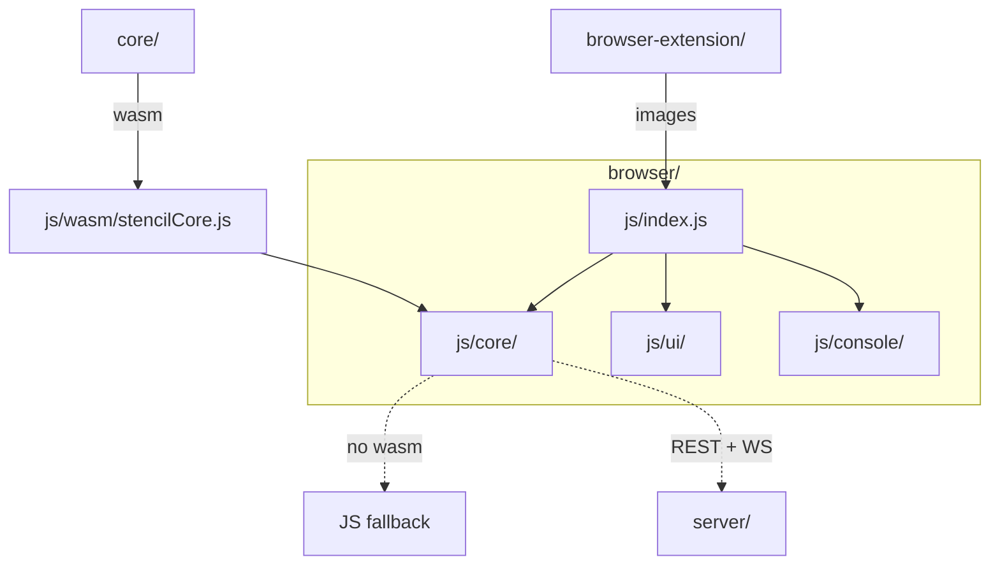
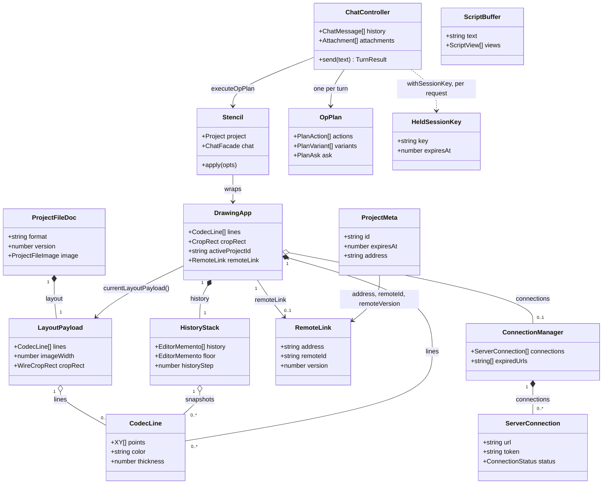

# Browser app architecture

The system-wide design — the parity contract, canonical data, the layer model, the pattern vocabulary — is in the root [`ARCHITECTURE.md`](../ARCHITECTURE.md).

The browser app is the reference front-end: a vanilla ES-module editor with no build step,
running `core/` as wasm behind a JS fallback that matches it op-for-op. It is served beside
the repo's `common/` (the shared tables, corpora and brand art it imports), and owns the
canonical `.stencil` document format and layout payload. It does not own the collaboration protocol (`server/internal/protocol`) and
carries no codec beyond what the DOM provides.


```mermaid
graph TD
    CORE["core/"]
    WASM["js/wasm/stencilCore.js"]
    subgraph APP["browser/"]
      IDX["js/index.js"]
      COREJS["js/core/"]
      UI["js/ui/"]
      API["js/console/"]
    end
    FB["JS fallback"]
    EXT["browser-extension/"]
    SRV["server/"]

    CORE -->|"wasm"| WASM
    WASM --> COREJS
    IDX --> COREJS
    IDX --> UI
    IDX --> API
    COREJS -.->|"no wasm"| FB
    EXT -->|"images"| IDX
    COREJS -.->|"REST + WS"| SRV
```

## Layers

`config/` + `utils.js` → `core/` (**no DOM**) → `eventBus/` (`core/emitter.js`) → `net/` → `llm/` →
console facade (`console/stencilApi.js`) → `ui/` → render. A layer imports only from its
left. `tests/layerBoundary.test.js` lints it as ratchets: each frozen allowance names the files
that still cross and how often, a new site or a grown count fails, and a count that shrank must
be lowered — `CORE_DOM_ALLOWANCE` (core files that still touch `document`/`window`),
`UI_IMPORT_ALLOWANCE` (core files that still import a `ui/` paint helper; `llm/` and `net/` import
none), `FACADE_ALLOWANCE` (`window.stencil` read outside `console/`) and `UI_ID_ALLOWANCE` (`ui/`
modules that still look a node up by global id). The core reaches the view through the change
feed a ui area subscribes to (`core/app/changes.js`) and the app's view seam (`VIEW_SEAM` in
`core/drawingApp.js`), and beyond `UI_IMPORT_ALLOWANCE` in no other way.

## Where things go

| Path | Holds | Rule |
|---|---|---|
| `index.html` | the single `<script type="module">` entry and the CSS link order | the link order **is** the cascade; the CSP meta is identical to the `nginx.conf` header |
| `css/` | `theme.css`, then `layout/`, `components/`, `animations/`, and last `webcore/`, the session skin | one file per section; tokens come from `common/config/themeTokens.json` and `common/config/webcore.json` |
| `js/config/` | the operator's `openInConfig` and its example | operator config, fetched beside its module; never shared, never committed |
| `../common/` | the shared tables (`config/`), corpora (`fixtures/`), the logo (`icons/`) | served next to `browser/`; imported by relative path, never a root URL, so a subpath deploy works |
| `js/utils.js` + `js/utils/` | DOM, geometry, color, hotkey helpers | one import point; pure |
| `js/core/` | `DrawingApp` and its collaborators, one folder per feature (`abi/` the wasm singleton, `app/` the mixin, change feed and seam) | **no DOM access** beyond the frozen `CORE_DOM_ALLOWANCE` in `tests/layerBoundary.test.js` — it runs under `node --test` |
| `js/core/script/` (+ `script.js`, `scriptHandles.js`) | the `.stc` engine: lex → parse → templates → lower, plus `dump` | one file per `core/script/*.cpp`; pure — it resolves ops but calls no facade |
| `js/eventBus/` | `appBus.js`, the app-wide event channel | channel names come from `config/events.json` |
| `js/net/` | the fetch guard, abortable fetch, the capped body read, the connection store + manager, remote sync | a URL the user or a page names goes through `guardedFetch` (`fetchGuard.js`: http(s)/data:/blob: only, the 30 s `NETWORK.fetchTimeoutMs` deadline); the launch `src` image and a dragged image URL are CORS fetches under the same deadline. `ServerConnection` wraps `globalThis.fetch` itself (`redirect: 'manual'`, the same deadline), and so does the LLM client (`llm/http.js`: `redirect: 'error'`, a turn ended by its Stop signal, a probe by the `providers.json` probe timeout). Every server, provider or fetched-image body is read through `cappedBody.js` (64 MiB; a provider reply 8 MiB) |
| `js/llm/` | provider client, op-plan parser/executor, chat controller, the session key | every plan is validated against `config/llm/opRegistry.json` before anything runs |
| `js/console/` | the `window.stencil` facade, one module per concern | frozen; it calls what the toolbar calls |
| `js/ui/` | string-returning components composed by `layout()`, one folder per region; `bindings/` wires controls to the app, `control/` holds the control areas | a region answers its parent by event and the app by the bus; it may import `net/` and `llm/` (left of it in the layer order) for the connection and assistant controls it renders |
| `js/worker/` | the cross-tab projects sync worker and the image worker | a worker filter is bit-identical to the main-thread one |
| `js/wasm/` | the generated `stencilCore.js` | gitignored; built by `npm run build-wasm` / CI |
| `sw.js`, `manifest.webmanifest`, `launch.html`, `vite.config.js` | the PWA shell, the `stencil://` bounce page, the optional single-file build | nothing in the app may depend on the build |
| `tools/` | the static server, the single-file build and its self-check | dev only |
| `tests/` | `node --test` suites mirroring `js/`, and the structural lints | never loads wasm — always the JS fallback |

## Entities


```mermaid
classDiagram
    class DrawingApp { +CodecLine[] lines
      +CropRect cropRect
      +string activeProjectId
      +RemoteLink remoteLink }
    class CodecLine { +XY[] points
      +string color
      +number thickness }
    class HistoryStack { +EditorMemento[] history
      +EditorMemento floor
      +number historyStep }
    class LayoutPayload { +CodecLine[] lines
      +number imageWidth
      +WireCropRect cropRect }
    class ProjectFileDoc { +string format
      +number version
      +ProjectFileImage image }
    class ProjectMeta { +string id
      +number expiresAt
      +string address }
    class RemoteLink { +string address
      +string remoteId
      +number version }
    class ServerConnection { +string url
      +string token
      +ConnectionStatus status }
    class ConnectionManager { +ServerConnection[] connections
      +string[] expiredUrls }
    class Stencil { +apply(opts)
      +Project project
      +ChatFacade chat }
    class OpPlan { +PlanAction[] actions
      +PlanVariant[] variants
      +PlanAsk ask }
    class ChatController { +ChatMessage[] history
      +Attachment[] attachments
      +send(text) TurnResult }
    class ScriptBuffer { +string text
      +ScriptView[] views }
    class HeldSessionKey { +string key
      +number expiresAt }
    DrawingApp "1" *-- "0..*" CodecLine : lines
    DrawingApp "1" *-- "1" HistoryStack : history
    HistoryStack "1" o-- "0..*" CodecLine : snapshots
    DrawingApp --> LayoutPayload : currentLayoutPayload()
    LayoutPayload "1" o-- "0..*" CodecLine : lines
    ProjectFileDoc "1" *-- "1" LayoutPayload : layout
    ProjectMeta --> RemoteLink : address, remoteId, remoteVersion
    DrawingApp "1" --> "0..1" RemoteLink : remoteLink
    DrawingApp "1" o-- "0..1" ConnectionManager : connections
    ConnectionManager "1" *-- "0..*" ServerConnection : connections
    Stencil --> DrawingApp : wraps
    ChatController --> Stencil : executeOpPlan
    ChatController --> OpPlan : one per turn
    ChatController ..> HeldSessionKey : withSessionKey, per request
```

| Entity | What it is | Owned by / lifetime | Relates to |
|---|---|---|---|
| `DrawingApp` | The editor: its state as plain fields (`core/editorState.js`), its collaborators and its change feed (`app.changes`) | One per window, created by `js/index.js` | Mediates every collaborator |
| `CodecLine` | One drawn line, every field explicit (`core/line/linesCodec.js`; ports `core/models.hpp`) | `DrawingApp.lines`; copied into snapshots and layouts | `HistoryStack`, `LayoutPayload` |
| `HistoryStack` | Undo/redo over editor mementos with a cursor, `MAX_STEPS` and a floor (ports `core/state/HistoryStack.hpp`) | One per app, reset on each project switch | `CodecLine` snapshots |
| `LayoutPayload` | The export subset of `LAYOUT_FIELDS` (`common/config/layoutFields.json`) plus `lines`; `cropRect` crosses as `{x,y,w,h}` | Built by `buildLayoutPayload` (`core/layout.js`); the browser definition is canonical | `ProjectFileDoc.layout`, the server's project `layout` |
| `ProjectFileDoc` | The `.stencil` document (`core/project/file.js`); `format` is the sentinel, `version` the schema | Built by `buildProjectFile`, hardened by `parseProjectFile`; the browser definition is canonical | `LayoutPayload` |
| `ProjectMeta` | One registry row: name, expiry, optional server link (`core/project/store/projectsStore.js`) | The `localStorage` registry behind `ProjectsStore`; expiry ports `core/state/ProjectsStore.cpp` | `RemoteLink` |
| `RemoteLink` | The editor's link to a server project; `version` is the save-back guard (`core/remote/syncController.js`) | `DrawingApp.remoteLink` for a server-linked session | `ProjectMeta`, `ServerConnection` |
| `ServerConnection` | One connected server: session token, REST surface, `/ws` feed (`net/serverConnection.js`); its `RemoteProjectRecord` is the server's `protocol.Project` | Created by `ConnectionManager.connect`, closed on disconnect | `ConnectionManager`, `RemoteLink` |
| `ConnectionManager` | The servers one session is connected to plus the expired-credential set; `snapshot()` is what `net/connectionStore.js` persists | Created lazily by the facade, one per app | `ServerConnection` |
| `Stencil` | The frozen `window.stencil` facade (`console/stencilApi.js`): settings, `Line` / `Point` / `Project` handles, `chat`, `llm` | `createStencil(app)` once at boot | Wraps `DrawingApp`; the executor's only target |
| `OpPlan` | A validated model reply (`llm/plan/parser.js`) | Returned by `parseOpPlan` for one turn | `PlanAction`, `PlanVariant`, `PlanAsk` |
| `ScriptBuffer` | The one `.stc` the page is editing (`ui/script/buffer.js`): the text plus every view of it | Module state for the session; never persisted | `wireScriptEditor` (`ui/script/editor.js`) |
| `ChatController` | The client-side conversation: replayed history, queued `Attachment`s, the send loop (`llm/chat/controller.js`); its transcript is the `ChatRow` log in `llm/chat/session.js` | One memoized per app via `sharedChatController` | `OpPlan`, `Stencil`, `LlmClient` |
| `HeldSessionKey` | The user's own Anthropic key and when it lapses (`llm/sessionKey.js`, llm-providers §5) | This tab's `sessionStorage`, until the tab closes, `sessionKey.ttlMinutes` lapses or Forget | Joined to one request by `withSessionKey`; never persisted elsewhere |

## Patterns

| Pattern | Where | Notes |
|---|---|---|
| Facade over core | `createStencil(app)` in `console/stencilApi.js`, installed as `window.stencil` | Frozen; every entry point reaches the core through it |
| Mediator | `DrawingApp` (`core/drawingApp.js`) | Each collaborator (`Renderer`, `Storage`, `HistoryStack`, …) reaches others only through the app; `core/app/delegates.js` installs the mixin (`core/app/editing.js`) and `VIEW_SEAM` |
| Memento | `HistoryStack.push` / `undo` / `redo` behind `saveHistory()` and `restoreHistoryStep()` | Every undoable edit is one memento, applied and reverted by one code path; a crop or turn step is re-derived from the original by `ImageModel.restoreView` |
| Strategy | The provider `wire` in `llm/client.js` (`config/llm/providers.json`); `FilterMode` in `core.applyFilterRGBA`; the filter painters in `core/image/filterCanvas.js` over a cached base (`core/draw/baseLayer.js`); the `NotificationSink`s in `ui/shell/notifySinks.js` | Selected by table lookup |
| Observer | `app.changes` (an `Emitter`, `core/emitter.js`) over the channels of `core/app/changes.js`; `TabsCoordinator`, `ServerConnection.onEvent`; `eventBus/appBus.js` over `config/events.json`; `ui/domWatch.js`, the one page-wide subtree observer | The `stencil:*` window events are the contract the extension's content scripts read |
| Composite | `StencilElement` (`ui/base.js`): light-DOM custom elements whose `inner()` markup `layout()` concatenates | `$(id)` is scoped to the element's subtree, `emit()` replies upward; light DOM because the extension consumes these modules inside its own shadow roots |
| Repository | `ProjectsStore` over a `StorageBackend` (`projectsBackend.js`, IndexedDB); `net/connectionStore.js`; `llm/chat/store.js` | Callers see a synchronous `localStorage`-shaped contract; another tab's write reaches this tab through `refresh(id)` |
| Layered canvas | `core/draw/stageLayers.js` behind `Renderer`: `#canvas` the picture, `#canvas-overlay` the lines and handles | The picture repaints only when its source or size changes, the overlay every frame; an export or result repaints through `core/draw/restingPaint.js` |
| Chain of Responsibility | Any URL: scheme → `timeoutSignal()` (`net/fetchGuard.js`). Every `ServerConnection` request: `normalizeUrl` → `isInsecureRemote` → `timeoutSignal()` → `isAuthStatus` / `isExpiredSession` → `readJsonCapped` | The one browser fetch guard: a `file:` URL never reaches `fetch`, nothing leaves without a deadline, a refused credential lands in `expired` |
| Adapter | `llm/adapters/` (the `ChatCapabilities` bag), `core/launch/extensionBridge.js`, `core/launch/deepLink.js` | Each translates an outside request into the core functions the toolbar calls |
| State machine | `HoldDrawController` (`core/draw/holdDraw.js`): idle → armed → drawing → idle, or armed → aborted | The host injects time and coordinates; wasm-backed via `coreHandles.js` |
| State | `DrawingApp.gesture` (`core/pointer/gesture.js`), one drag kind or none | The `is*` drag flags are accessors over it, so two can never both be set |
| Interpreter | `FormulaEngine` (`core/parse/formulaEngine.js`), recursive descent over `core/parse/formulaContext.js` | Ports `core/parse/formulaParser.cpp`; never `eval` |
| Interpreter + runner | `core/script/` lowers a `.stc` to an op stream; `console/scriptRunner.js` executes it | The parser never touches the editor and the runner never re-parses; op-plan caps guard model output, not the user's script |
| Session override | `setMotionOverride` (`ui/motion/motionPrefs.js`), `setIconSkin` (`ui/icons.js`), `setFaviconArt` (`core/settings/accents.js`), set by `ui/webcore/toggle.js` | Read by everything, written to no store |
| Double-click reset | `installDblReset` (`ui/control/dblReset.js`), one capture listener on `document` | A control returns to its default and fires `change` |
| Gesture machines | `createIconDrag` (`ui/drag/iconDrag.js`), `createDragPick` (`ui/control/dropdownMenu.js`), `createDragMenu` (`ui/projects/list/dragMenu.js`), `wireColorDrag` (`ui/drag/colorDrag.js`), `wireAltPeek` (`ui/tip/altPeek.js`) | A pure machine under thin DOM wiring; a drag acts only on release, and a release back on its source or Escape changes nothing |
| View preview | `previewFill` and `previewClean` on `Renderer` (`core/draw/renderer.js`) | The view alone paints a trial while no app field moves; a commit goes through each control's own setter |
| Page copy | `buildPageCopy` (`ui/accent/themeCopy.js`) in a shadow tree, shown by the theme lens (`ui/drag/themeLens.js`) | An inert still copy of the page under its own sheets; `COPY_ATTR` (`ui/base.js`) keeps its regions from wiring |

## Design

- **Boot.** `js/index.js` awaits `core.init()` (`js/core/abi/stencilCore.js`, the wasm module and
  its typed wrappers) and `initProjectsBackend()`, constructs `DrawingApp`, installs
  `window.stencil`, wires chat persistence, and `publishReady(app)` hands every `<stencil-*>`
  element the app.
- **An edit.** A pointer or touch event reaches `InputController` / `PointerController`, which
  call the core functions the facade calls, and hits only what is drawn
  (`core/pointer/markHits.js`). `saveHistory()` pushes a memento, `Renderer` repaints the overlay
  (a drag once per frame through `requestRedraw()`), `Storage.saveSoon()` debounces a
  `ProjectsStore.upsert`, and a server-linked session schedules `scheduleRemoteSync()`.
- **The controls follow.** An edit signals `changed(app, …channels)` and `FLUSH` runs, in sweep
  order, each area of `ui/control/state.js` that follows one of them; `updateButtons()` runs
  every area. A pointer move, hover or zoom signals nothing.
- **The line panels.** The Lines tab (`ui/panel/lines/`) is the `list` area, rendered only while
  visible; a row edits its line through `applyLineChange` (`core/line/selection.js`), one history
  step each. A line set replaced whole resets the selection (`settleReplacedLines`); a turn, flip,
  undo or redo keeps it on the lines that still exist (`keepLineSelection`).
- **Save and sync.** An edit's trailing save runs `ProjectsStore.upsert` through the quota
  ladder (`core/storage/quotaWriter.js`: shed a data-URL source's text, sweep expired projects,
  evict the oldest other project, compress the image, then lines only), and the upsert writes the
  image, payload and thumbnail keys before the registry row, so a synchronous quota failure leaves
  the registry untouched. On IndexedDB those keys commit after the call returns: `confirmCommit`
  (`core/storage/quotaConfirm.js`) awaits the commit, resumes the ladder where it stopped on an
  asynchronous quota failure, and removes the registry row of a project whose payload never
  committed; the cross-tab `UPDATED` goes out only once the save has committed. A data-URL
  `source` enters the registry as a hash reference and never leaves the browser (`keptSource`).
  The co-edit debounce pushes the layout under `RemoteLink.version`; a 409 merges the peer's
  lines (`mergeLines`, each pass against the peer set the previous pass saw, one undo step per
  save) and retries. The rendered result follows once edits go quiet
  (`core/remote/resultUpload.js`), and the link adopts only the one version bump its own file
  write produced, so a peer's save in between still 409s the next push. A peer's
  `project-event` on the picture on screen is adopted as one undo step
  (`core/remote/peerLayout.js`); another original reloads.
- **Persistent schema.** IndexedDB `stencil_projects`, store `payloads`: `stencil_project_<id>`
  (the payload JSON without its image), `stencil_image_<id>` and `stencil_thumb_<id>` (Blob
  records). IndexedDB `stencil_chats`, store `chats`: one §12 chat document per project id.
  localStorage: the registry `stencil_projects_v1`, `stencil_schema_migrated`, the projects
  window's `stencil_projects_order` / `_sortmode` / `_searchmode`, and the `drawingApp_*`
  settings — `constants.STORAGE_KEYS` (`theme`, `hotkeys`, and the legacy `image` / `layout` the
  migration reads once), `accent`, `motion`, `notify`, `servers`, `autoConnectServers`,
  `syncToServer`, `stencilLiveSync`, `llmSettings`, `voiceSettings`. sessionStorage:
  `stencil_llm_session_key` alone.
- **An LLM turn.** `ChatController.send(text)` replays history, calls `LlmClient.chat`,
  `parseOpPlan` validates the reply against the browser profile of `opRegistry.json`, and
  `executeOpPlan` maps each op 1:1 onto a facade call; variants and ask previews branch through
  `planSandbox`. On the `anthropic` wire (llm-providers §6.5) `withSessionKey` joins the
  `HeldSessionKey` to one request; without one, or over plain http off loopback, nothing is sent
  (`keyedInit` in `llm/http.js`), no LLM request follows a redirect, and upstream text echoing
  the key is dropped.
- **A copy.** Every copy entry point (the UI, `stencil.copyProject`, the `copyProject` op) reaches
  `projectTransfer.copyProject` (`core/project/copy/`): it reads the source, names it with
  `copySuffixName`, saves it locally or on the source's server, then opens it. An incognito copy
  writes nothing and a server copy is never incognito.
- **Closing a project.** `app.closeProject(id)` leaves the tab an empty editor; the hotkey asks
  first (`confirmCloseProject`, `ui/projects/closeProject.js`), `stencil.closeProject()` does not.
- **A script.** `stencil.execScript(text)`, the script window and a dropped `.stc` call
  `runScript` (`js/console/scriptRunner.js`): one parse through `js/core/script.js`, nothing run
  on an error diagnostic, then each lowered op is one facade call. A failing op names its line;
  the edits before it stay.
- **Project files.** `js/core/project/file.js` is the pure `.stencil` (de)serializer; IO is
  `ExportService`. Each surface serializes it independently and `e2e/` proves they agree:

  ```jsonc
  { "format": "stencil-project", "version": 1, "name": "…",
    "color": "#rrggbb", "keywords": [], "source": "…", "resource": "…",   // each optional
    "blank": true, "blankColor": "#rrggbb",                                 // blank canvases only
    "image":  { "dataUrl": "data:image/png;base64,…", "ext": "png", "w": 1280, "h": 720 },
    "layout": { /* exactly buildLayoutPayload(): imageWidth, imageHeight, lines[], cropRect,
                  rotationQuarters, imageFilter, filterColor, pageSize, customPage*, formulas, mirrored */ },
    "theme":  { "mode": "dark|light", "accent": "…" } }                     // optional, opt-in
  ```

  An optional `chat` key (llm-contract §12.1) is written by the console surfaces; the browser
  keeps chats in IndexedDB and on the server's `chat` file instead.
- **Deep links.** `js/core/launch/deepLink.js` normalizes the inbound `#stencil=` fragment and
  builds the outbound `stencil://` and Telegram `?start=` links; `applyExternalLaunch`
  (`core/launch/controller.js`) loads the fragment and strips it. A `.stc` in a launch opens in
  the Script window and never runs (`core/launch/desktopLink.js` carries it on `stencil://`).
- **A logo show.** Every trigger reaches `activateShow` (`ui/logo/stageTrigger.js`), which runs
  the stage (`ui/logo/stage.js`) resolved from `config/logoStage.json`; the webcore show toggles
  the session overrides (`ui/webcore/toggle.js`).
- **A notice.** `notify()` (`utils/dom.js`) hands the message to the sink `notifyChannel()` names;
  a sink that cannot deliver returns false and the toasts show it.
- **Drag gestures.** A toolbar icon dragged off its spot carries its action to the release
  point (`ui/bindings/controls/toolbarDrags.js`): an opener opens its window there, a canvas
  action applies only on the canvas frame, and a zoom drag scales with distance. The header logo
  dragged onto the canvas previews and then applies the clean view through the controls' own
  setters. The theme switch dragged opens a preview-only lens over a page copy in the other
  theme; the theme itself changes only on a click.
- **Single-file build.** `vite.config.js` carries its rules inline (no plugins);
  `tools/assertSelfContained.js` re-reads the output, and `tests/singleFileBuild.test.js`
  fails `npm test` if a loader outruns `tools/singleFilePatterns.js`.

## Concurrency

The app runs on the page's one JS thread: handlers, timers and promise continuations interleave at
each `await`, never in parallel. Two workers run off it — the image worker
(`worker/imageWorker.js`, a module Worker with its own wasm instance, each request correlated by
id, retired for the session on its first error, after which the same raster sequence runs inline)
and the cross-tab router (`worker/projectsWorker.js`, a SharedWorker that relays pings between
tabs and touches no storage; `core/launch/tabsCoordinator.js` falls back to a BroadcastChannel
roll-call, then to one tab). What overlaps on the main thread is the async writers below: the
debounced saves and the IndexedDB and server writes they start.

| Owner | Runs on | Shares | Guard | On overflow or teardown |
|---|---|---|---|---|
| Image worker (`worker/imageTasks.js`) | a module Worker, own wasm instance | transferred bitmaps; the id → promise map | one id per request | an error rejects every pending request and retires the worker; renders run inline from then on |
| Cross-tab router (`projectsWorker.js` / `tabsCoordinator.js`) | SharedWorker, else BroadcastChannel | each port's active project id; `projectsChanged` pings | messages only, no storage | a closed port leaves the tab count; no coordinator means one tab |
| Trailing project save (`Storage.saveSoon`) | main-thread timer, 400 ms trailing | the active project's keys and registry row | one timer; a burst saves once | flushed at once on a project switch, `beforeunload`, `pagehide` and a hidden `visibilitychange` |
| IndexedDB write-through mirror (`projectsBackend.js`) | IndexedDB transactions | the in-memory mirror and the stored keys | reads served from the mirror; each key's latest write outcome kept; a write settles when its transaction commits | a failed write keeps the mirror; `confirmCommit` resumes the quota ladder (a newer save supersedes it) or removes the orphaned registry row |
| Cross-tab save ping (`Storage.scheduleSyncBroadcast`) | main-thread timer, 400 ms | the `UPDATED` message | sent once the last save's commit resolves | a failed or superseded commit sends nothing |
| A peer tab's save (`core/remote/projectsWatch.js`) | main thread | the open project's stored payload; across tabs the last writer wins | deferred while a gesture runs, re-checked every 120 ms, adopted once idle | an edit the gesture committed is saved after it and wins; a project switched away is left alone |
| Co-edit layout push (`RemoteSyncController`) | main thread; the serial `#writes` promise queue | `RemoteLink.version` and the server project | 350 ms trailing debounce capped at 1.5 s; one server write at a time; a 409 merges and retries up to `MAX_TRIES` (6) | never converged: reload from the server; a push landing mid-reload is deferred and supersedes the pending reload |
| Result upload (`ResultUploader`) | the same `#writes` queue | the `result` file and the link version | `COEDIT.resultIdleMs` idle, `resultMinGapMs` gap; the link adopts only the bump its own write produced | flushed on a switch or unload; cancelled when the project is deleted |
| Peer project-event pull (`reloadRemoteActive`) | main thread, outside `#writes` | the editor's lines and the link version | adopted only for a newer version than the link, not mid-stroke, and outside the 150 ms echo window of our own save; one reload at a time | an event mid-reload collapses into one follow-up pass |
| Server writers outside the queue | `project/meta/projectMetaOps.js` (field sets), `image/settle.js` (original replace), `llm/chat/persistence.js` (the `chat` file) | the server project | a field set re-reads the version on 409, 4 attempts; the original replace then saves through the queue; the chat file is versionless and best-effort | a failure is a notice; the link moves only while it still names that project |
| Chat turn (the one `ChatController` per app) | main thread | history, attachments, the transcript log | the controller refuses a second `send` while one runs; the panel, the context menu, `stencil.prompt` and voice check `chatTurnInFlight()` first | a refused turn logs nothing and says the assistant is answering; Stop aborts the running one |
| `HeldSessionKey` (`llm/sessionKey.js`) | this tab's sessionStorage | the Anthropic key and its `expiresAt` | read at each request, its TTL checked at use | an expired record is dropped on read; it goes with the tab |
| Live `.stencil` file sync (`core/remote/stencilSync.js`) | main-thread timers | the linked file | 800 ms debounced save, polled watch | a conflict prompts mine / theirs / merge |

## Rules

1. **Every mutation goes through the facade's own path.** Toolbar, hotkey, console script,
   LLM plan — all reach the same core functions and collaborators; the facade is typed in
   `stencilApi.d.ts`. A core function is imported by its caller, never forwarded through the
   app (`tests/core/app/delegates.test.js` holds the retired forwarders as an enumerated
   denylist); only the view seam, the mixin and the gesture flags are installed on `DrawingApp`.
2. **wasm with a fallback.** Each module that calls the core keeps its JS body as the
   fallback and the two match op-for-op (`tests/wasm/wasm-parity.test.js`). A value the core
   owns is read from it, never mirrored: the fallback twin is its one JS home, and `ui/` reads
   it through the core module that names it (the page table through `core/settings/units.js`).
   No `eval` / `new Function` anywhere.
3. **`common/` is canonical.** A value another surface needs is a table in `common/config/`, never a
   literal in code.
4. **Ported modules stay byte-identical.** The modules `tools/twins.json` copies into
   `browser-extension/src/lib/` and `vscode-extension/src/parser/script/` are pinned in both
   directions (`browser-extension/tests/portParity.test.js`,
   `vscode-extension/tests/parserParity.test.js`). Edit here, then re-copy.
5. **Typed boundary.** Every public module has a sibling `.d.ts`, beyond the frozen
   `NO_SHAPE_YET` list in `tests/dts.test.js`. A shape file with no module
   behind it declares types only, and what a module installs on `DrawingApp` merges into the class (`AppCollaborators`).
6. **An edit names what changed.** The core signals channels on `app.changes`, never a
   control; a control area follows the channels its inputs move on, and a narrow flush leaves
   every control where the full sweep would.
7. **Motion is decoration.** Every particle cloud is one canvas (`cloud.js`), never a DOM node
   per grain, and dies with its owner (`sweepDust`, `followDust`); the OS
   `prefers-reduced-motion` wins over every setting. A skin stamps `<html>`, writes no store.
8. **Storage split.** A project's payload, image and thumbnail live in IndexedDB, each under
   its own key, the image and thumbnail as Blobs written only when they change; the small registry
   (names, expiry) in `localStorage`, never a data URL. Chat persistence is opt-in, text only, never
   in incognito. The anthropic key is the one secret in `sessionStorage`, and
   `saveLlmSettings` cannot write it.
9. **Nothing local goes outward.** The `#stencil=` fragment never reaches a server
   (`e2e/tests/browser/fragment-privacy.spec.js`); deep links carry `{url, id, version}`, never a
   token.
10. **A child answers its parent by event.** Child → parent is a bubbling `CustomEvent`
   declared in the child's `.d.ts`; app-wide is the bus (`config/events.json`); a region
   never reaches another region's nodes by id, beyond the frozen `UI_ID_ALLOWANCE` in
   `tests/layerBoundary.test.js`.
11. **Every control is named, once.** An icon-only control's accessible name is its tooltip
   heading and a field's is the label beside it (`ui/ariaLabels.js`); only a control whose
   name is nowhere on the page writes its own `aria-label`.

## Tests

Every suite in `tests/` runs offline under `node --test` on the JS fallback: Node never loads
wasm. The DOM, `fetch`, the storages and speech are stubbed once in `tests/helpers/`; a test
drives the real core functions over a partial app rather than stubbing a method the app does
not own. The `wasm-parity*` suites run the JS reference and the generated `js/wasm/stencilCore.js`
through one script; they self-skip without it, and CI builds it.
The op-plan validator stays out of wasm: no `abi/opplanShared.inc` name is in `EXPORTED_FUNCTIONS`
or the export lists, and the built module carries no `_stencil_opplan*` export.

The structural lints assert the design as ratchets: the import direction and the `window.stencil`
name, the retired pass-through calls on the app, every `.d.ts` against its module, and each config table against
its consumer. An edit runs only its control areas, each flush matching a full sweep. The CSS pin holds every declaration `index.html`
loads, the markup pin the body ids of `layout()`; the fixture walkers run the shared corpora
through the real modules.
