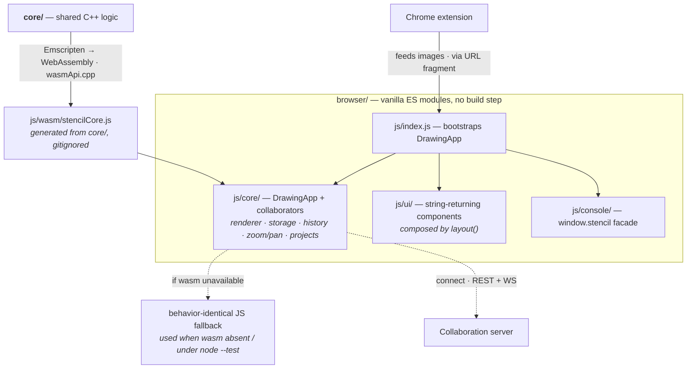

# Stencil — Browser app

The browser front-end of Stencil. Built with **vanilla JavaScript and native ES
modules** — no build step, no bundler, no third-party runtime dependencies. (There is one
*optional* build, [`npm run build`](#single-file-build), which packs the app into a single
self-contained HTML file; the app itself never depends on it.)

For the project overview and the desktop (C++/Qt) app, see the
[repository README](../README.md).

## Architecture



> **Surface diagrams:** [core](../core/README.md#architecture) · [extension](../extension/README.md#architecture) · [server](../server/README.md#architecture) — or the whole-system view in the [repository README](../README.md#architecture).

## Features

- Draw polylines and lockable, fillable rectangles/areas over an uploaded image
- **Hold-to-draw**: press and hold the left button (no modifiers) to auto-enter
  drawing and drop the first point, then dwell to add more and release to commit —
  hold over an existing point to extend its line, over a line body to insert a
  point. Delay is configurable (Visuals modal / `stencil.holdDrawDelay`). Delete a
  selected line with **Alt+Delete** (⌥⌫ on macOS) or a focused point with
  **Alt+Shift+Delete** (⌥⇧⌫)
- Blank-image creator (white / black / any color, sized to the page by default) for
  starting from an empty canvas
- Per-line color, thickness, point size, and style (solid / dashed / dotted)
- Editable points table with pixel ↔ page (cm) coordinate conversion and optional
  `f(x,y)` formula transforms; page formats cover the full ISO A/B/C series (A0–C10,
  searchable selector) plus a custom size
- Image filters (B&W, sepia, invert, contour edges, custom tint), zoom/pan, and
  fit-to-window
- Undo / redo, drag-and-drop and clipboard paste for images and layout JSON
- Configurable keyboard shortcuts, context menu, fullscreen, and light/dark theme
  (preset brand accents in the Visuals modal; **double-click the logo** for a one-off
  custom accent colour, applied to that page only — not saved or synced)
- **Motion settings** (Visuals modal → Motion): *Drawing animation* on/off — the stroke
  flight, landing pop and ripple on the canvas — and *Interface animation* with five
  settings: **Dust** (the default: windows, menus, checkbox marks, chat entries, the
  canvas and the listening mic all form out of round specks), **Water** (the same flights
  as drops) and **Fire** (as embers) — both painted in `--accent` / `--accent-2` rather
  than the surface's own pixels — **Sliding** (no particles anywhere: each surface plays
  its own plain grow/rise/fade instead) and **None**. Each mode's dropdown row wears its
  glyph and plays it on hover (`js/ui/motionIcons.js`). The OS's `prefers-reduced-motion`
  still overrides all of it. Also on the facade (`stencil.drawingAnimations`,
  `stencil.motionMode`) and mirrored, grain for grain, by the desktop app and the
  extension
- Session autosave (image + layout), multi-project storage with a one-week expiry
  sweep. The image-heavy per-project payloads live in **IndexedDB** (no ~5MB
  localStorage ceiling; existing payloads migrate over on first load), while the
  small project registry — names, thumbnails, expiry — stays in `localStorage`
- **Opening a project from the list, by gesture**: a **single click** asks first
  ("Open … here?") and switches this tab on confirm; a **double click** opens it
  straight away; **⌘/Ctrl + click** asks and opens in a **new tab**; **⌘/Ctrl + double
  click** opens a new tab immediately. The single click waits one double-click interval
  (250 ms) before acting, so a double click never flashes the confirmation open and shut.
  Rows are keyboard-activatable (**Enter/Space** = the confirmed single click, ⌘/Ctrl
  held targets a new tab). On **touch** a **tap** asks and opens here; **"Open in new
  tab" lives in the row's ⋯ menu** there, because press-and-hold is already how the list
  picks a row up for **drag-to-reorder** (`touchDrag.js`, 280 ms) — that gesture is left
  alone rather than overloaded. **Movement always wins**: as soon as a pointer travels
  past ~10 px the gesture belongs to the drag or the scroll, any pending open is dropped,
  and the click a drop may synthesize is swallowed — reordering never opens a project
- Installable as a **PWA** (Progressive Web App): "Install app" button + browser
  install UI, runs in its own window, and works offline via a service-worker cache
- **Open in… (desktop app / Telegram bot)**: the toolbar button next to Share mirrors
  the current session into another Stencil front-end. A server-linked project sends
  only the server reference (`{url, id, version}` — never a token; the receiver
  connects like a fresh client, minting a token via `POST /auth/token` or prompting);
  a local/incognito project embeds the image + full layout inline in a `stencil://`
  link the OS routes to the installed desktop app. The Telegram option (server
  projects only — a 64-char `?start=` payload can't carry bytes) appears once your
  bot is configured; payloads that can't fit the limit fall back to copyable
  `/connect` + `/fetch` commands. **Config** is the static-site equivalent of a
  `.env` file: copy `js/config/openInConfig.example.json` to
  `js/config/openInConfig.json` (gitignored, per-operator) and set
  `telegramBotUsername` (your bot's `@name` without the `@`). It loads at runtime, so
  a fresh clone with no local file still boots — the Telegram option just stays hidden.
  "Incognito" always means Stencil's own never-persisted mode on the receiving side.
  Inbound, the `#stencil=` fragment accepts `server` / `dataUrl` / `src` / `layout`
  fields (see `js/core/deepLink.js` `normalizeLaunchPayload`). `launch.html` is a
  standalone helper that forwards `#stencil-desktop=<encoded stencil:// URL>` to the
  OS scheme — useful for opening a `stencil://` link shared through a channel that
  won't linkify custom schemes (it validates the target is exactly `stencil:`)
- **Project files (`.stencil`)**: save a whole project — original image, layout, and
  settings (plus, optionally, the current colour theme) — as one portable file, openable
  on any Stencil surface (browser, CLI, desktop, pystencil, bot). See below.
- **Toolbar windows** (projects, servers, links, assistant, assistant settings `Alt+Shift+G`, shortcuts `Alt+K`, visuals `Alt+V`, help `Alt+H`): a window's own shortcut **closes** it again, another window's shortcut swaps to that one, and every one of them works from inside a window's own search box. Scripts open them by title — `stencil.openWindow('Projects')`, or the named `stencil.openProjectsWindow()` / `openServersWindow()` / `openAssistantSettingsWindow()` / … (Console API below).
- **Canvas context menu from the keyboard**: `Shift+F10` (rebindable, `contextMenu`) opens the right-click menu under the pointer when it rests over the canvas, else at the viewport centre — the desktop binds the same chord.
- **Server invite links**: in the Servers window, a connected row with a saved
  credential offers an **Invite** action — it mints a fresh session token
  (`POST /auth/token`, label `invite`) and copies `<server-url>#token=<token>` to the
  clipboard. Pasting an invite link into the Connect **URL** field (Token left empty)
  adopts the fragment token as the credential; an explicitly entered Token wins over
  the fragment, and the fragment itself never goes over the wire.
- **AI assistant chat**: the sparkle toolbar button (Alt+G) opens a chat panel dockable
  left/right/top/bottom or free-floating (drag the header to move or to re-dock on an
  edge zone, corner handle to resize; placement and size are session-only — every load
  starts closed at the defaults, and only the LLM settings persist). On **phones**
  (`max-width: 680px`) none of that fits, so the panel presents as an ordinary **centred
  modal** over a dimmed backdrop, with the placement and resize affordances hidden and
  the usual modal dismissals — a tap on the backdrop, or Escape. Attachments can also be pasted (Ctrl+V) or dropped straight onto the
  open panel; hover the input row's "…" for live provider status, and open the assistant's settings from that menu or with `Alt+Shift+G` (rebindable, `openAssistantSettings`). Prompts run against your configured LLM — Ollama or any local
  OpenAI-compatible server (LM Studio etc.) called directly, or Anthropic Claude proxied
  by a connected collaboration server (the API key stays server-side). The model answers
  with a validated *op-plan* executed through the same `window.stencil` facade as the
  toolbar (crop, quarter rotates, filters/tint, layouts — including vision-based "extract
  the lines from this image", formulas, page formats, blanks), and can return several
  variant images per prompt. It can also adjust the editor itself (contract §10): theme,
  accent, default line style, display units, points/lines visibility, and connect/
  disconnect of collaboration servers — restricted to servers you have already saved
  (exact URL or unique host; the stored connection's own token is used, plans never
  carry tokens), and never inside variants. **Every turn carries a snapshot of the working
  image** (contract §7), so "outline the rabbit's head" is answered against the pixels on
  the canvas rather than from memory; a model that has no vision gets it dropped, with a
  note in the chat, and the turn is retried once so text-only edits still work. On top of
  that you can attach images ("use as working image" or "analyze") and
  videos (frames are extracted in-browser; the video itself is never sent). Provider,
  endpoint URL (editable, sensible localhost defaults), model, and key are configured in
  the chat settings modal, alongside an opt-in **"Save chats with projects"** toggle
  (off by default; contract §12): when on, the conversation is stored **per project** in
  IndexedDB (text only, most recent 32 turns, never in incognito), restored when you
  reopen the project, mirrored onto a linked server project's `chat` file, removed with
  the project, and deleted — locally and server-side — by the panel's Clear button.
  Contract: `llm-contract.md`. Note: calling local
  providers directly requires their CORS allowance (Ollama `OLLAMA_ORIGINS`, LM Studio
  "enable CORS"). Runnable setup — installing/serving a model, the CORS commands,
  verification and troubleshooting — is in the
  [root README](../README.md#ai-assistant--setting-up-a-model).
  The canvas **right-click menu carries the same chat**: an **Assistant ▸** entry sits with
  the other submenu parents (Style, Image Filter, …) and its **flyout is the chat** — ask,
  send (Enter; Shift+Enter for a newline), watch the transcript, and press the same button
  again to **stop** a turn, without ever opening the panel. Its composer carries the panel's
  full action row — **send · attach · settings gear** (with the provider-status dot):
  attaching images/videos queues them on the same shared controller (chips show in both
  surfaces, and the queue rides whichever surface sends next), and the gear closes the menu
  and opens the one assistant-settings modal. It is the **same conversation** as the panel
  (one controller for the app, so history is continuous whichever surface you use) with the
  same op-plan capabilities and the same result cards (download · open as the working image). The menu and its flyout **stay open** through the whole exchange —
  typing, sending, and a plan executing on the canvas; the menu still closes on an outside
  click, on Escape (including from the chat input), or when you choose any other menu item,
  and hovering another submenu parent hands the flyout over as usual. On **phones and touch
  devices** (`max-width: 680px` or a coarse pointer — a hover-opened flyout is unusable
  there) the entry is a plain item instead: it closes the menu and opens the chat panel,
  which is already a full-screen modal at those sizes, on the same conversation. The entry
  appears only when a provider is configured: with the assistant off (provider *None*) the
  context menu is exactly what it has always been.

## Project files (`.stencil`)

A `.stencil` file is a **single JSON document** that bundles a whole project so it can be
moved between machines and surfaces: the **original** image (base64 `data:` URL, with
crop/rotation kept in the layout), the shared export **layout** (lines + filter + crop +
page + formulas), project **metadata** (name, accent, keywords, provenance, blank fill),
and an **optional** local colour **theme** (light/dark + accent) written only when you opt in.

Save with the **Project** button in the Data section (or `Ctrl+Shift+S`; **Shift+click** to
save a theme-neutral file), open with the folder button next to it (`Ctrl+Shift+F`) or by
dropping a `.stencil` onto the canvas. The **live-sync** toggle (`Ctrl+Shift+Y`) keeps a
file-linked project auto-saved to (and watching) its `.stencil` on disk. The **trash** button
(`Ctrl+Shift+Backspace`) deletes the linked `.stencil` from disk after a confirm — the project
stays open in the editor, only its on-disk file is removed (Chromium only; enabled once linked).
The same file opens in the CLI (`stencil -i project.stencil out.png`, or `/open` in `--console`),
the desktop app, `pystencil` (`Editor.open_project`), and the Telegram bot.

Three more project/image chords, all rebindable in the Shortcuts window: `Ctrl+Alt+R`
**removes the current project** from the editor (the red trash in Data — the session, not
the file), `Ctrl+Alt+N` **renames** it (opens the toolbar name field for inline editing,
like the ✎ beside it), and `Ctrl+Alt+S` **shares the image** wherever the browser can hand
files to the OS share sheet (mobile / PWA — the Share button is hidden elsewhere).

```jsonc
{
  "format": "stencil-project",
  "version": 1,
  "name": "road sign",
  "color": "#7c3aed",
  "image": { "dataUrl": "data:image/png;base64,iVBOR…", "ext": "png", "w": 1280, "h": 720 },
  "layout": { "imageWidth": 1280, "imageHeight": 720, "lines": [ /* … */ ],
              "cropRect": { "x": 0, "y": 0, "w": 1280, "h": 720 },
              "rotationQuarters": 0, "imageFilter": "none" },
  "theme": { "mode": "dark", "accent": "violet" }
}
```

The (de)serializer is `js/core/projectFile.js` (pure, DOM-free, reuses `layout.js`'s
`buildLayoutPayload` + `sanitizeLines`); IO lives in `ExportService`
(`saveProjectFile` / `openProjectFile`, exposed on `window.stencil`). It's an adapter-level
format — **not** part of `core/` — so each surface serializes it independently; the `e2e/`
cross-surface check (author in the browser, open in the CLI) guards that they agree.

## Running

Because the app uses native ES modules (`import` / `export`), browsers refuse to load it
over the `file://` protocol (CORS / module-origin restrictions). It must be served over
HTTP — or packed into one file first, see [Single-file build](#single-file-build). The
`serve` script uses Python's built-in server:

```bash
# from this directory (browser/) — serves http://localhost:8080 by default
npm run serve
```

Then open <http://localhost:8080/> in your browser.

The address and port default to `localhost:8080` and can be overridden with env vars:

```bash
PORT=9000 npm run serve                # custom port
ADDR=0.0.0.0 PORT=3000 npm run serve   # bind all interfaces (LAN access)
```

> If `python` maps to Python 2 on your system, use `python3`. Any other static file
> server works too.

> **WebAssembly core.** This app can run the shared C++ core via wasm, but that module
> (`js/wasm/stencilCore.js`) is a generated artifact that isn't committed — so on a fresh
> checkout the app transparently uses its behavior-identical JS fallback. To run the real
> wasm path, build it once (needs Emscripten on `PATH` — see [`../core/WASM.md`](../core/WASM.md)):
>
> ```bash
> npm run build-wasm   # builds core/ → js/wasm/stencilCore.js
> ```

### Single-file build

`npm run build` folds the whole app — every module, all four stylesheets, the icons — into
**one self-contained `stencil.html`** that opens straight off disk, no server involved.
Handy for handing the editor to someone as a single attachment, or for an air-gapped
machine.

```bash
npm run build                  # -> browser/stencil.html (gitignored)
npm run build -- notes.html    # any name; a bare name gets .html appended
npm run build -- ~/dist/app    # any path, relative to where you ran it
```

This is the one place the browser app uses a build step, and it stays strictly optional —
the app itself is unchanged and `npm run serve` never touches it. It needs the sole dev
dependency, **vite** (`npm install` in this directory); the bundling rules are written out
inline in [`vite.config.js`](vite.config.js) so no plugin packages come with it. Its
No lockfile is tracked, so CI installs with `npm install` and resolves vite's own
dependency ranges fresh on each run.

Every build ends by re-reading what it just wrote ([`tools/assertSelfContained.js`](tools/assertSelfContained.js)):
no `src`/`href` may point at a sibling file, no local JSON may have been baked in, and the
inline module has to parse — a page truncated by a stray `</script` in a string looks
perfectly fine until you open it. CI runs
the same build on every push (the *Browser (single-file build)* job), and
[`tests/singleFileBuild.test.js`](tests/singleFileBuild.test.js) fails the ordinary
`npm test` if an edit to `index.html` or one of the three loaders outruns the rewrites in
[`tools/singleFilePatterns.js`](tools/singleFilePatterns.js) — no vite install needed.

What a single file gives up, and why nothing breaks:

| Sibling file | In `stencil.html` |
|---|---|
| `js/wasm/stencilCore.js` | not bundled — the app runs its JS reference implementations (the ones the wasm build is parity-tested against) |
| `js/worker/projectsWorker.js` | not bundled — cross-tab coordination drops to its `BroadcastChannel` path, as on any browser without `SharedWorker` |
| `js/config/openInConfig.json` | not bundled — the builder's own operator config stays on their disk; the Open-in modal uses its defaults |
| `sw.js`, `manifest.webmanifest` | dropped — offline is moot for a file already on disk, and there is no shell to install |

Everything else is intact: projects still persist (IndexedDB + `localStorage` work from
`file://`), the `window.stencil` console API is fully wired, and servers/LLM endpoints you
configure are reachable as long as they send CORS headers for a `null` origin.

### GitHub Pages

[`.github/workflows/pages.yml`](../.github/workflows/pages.yml) publishes this app on every
push to `main` (and on demand via *Run workflow*). It builds the wasm core with Emscripten
first, so the deployed site runs the **real C++ core**, not the JS fallback — then serves
`browser/` as the site root, with the single-file build alongside at `stencil.html` as a
copy visitors can save and keep offline.

Nothing deploys until Pages is turned on for the repo: **Settings → Pages → Build and
deployment → Source: "GitHub Actions"**. The manifest's `start_url`/`scope` are relative, so
the app and its service worker work unchanged under the `/<repo>/` subpath Pages serves from.

### Docker

A multi-stage [`Dockerfile`](Dockerfile) builds the wasm core (Emscripten) and serves
the static app with nginx. Because the wasm step needs `core/`, **build from the repo
root** and select the Dockerfile with `-f`:

```bash
# from the repo root
docker build -f browser/Dockerfile -t stencil-browser .
docker run --rm -p 8080:80 stencil-browser   # -> http://localhost:8080
```

The image bakes in the freshly built `js/wasm/stencilCore.js`, so it runs the real wasm
path (no JS fallback). Map a different host port with e.g. `-p 9000:80`.

## Project structure

```
index.html            # single <script type="module"> entrypoint
vite.config.js        # the OPTIONAL single-file build (npm run build) — nothing else uses it
launch.html           # standalone bounce page: #stencil-desktop=<url> → stencil:// scheme
manifest.webmanifest  # PWA metadata (name, icons, standalone display)
sw.js                 # service worker: offline app-shell + runtime cache
favicon.svg           # icon (also the PWA "any"-purpose icon)
icon-maskable.svg     # full-bleed PWA icon for adaptive (maskable) masks
css/                  # theme, layout, component styles
js/
  index.js            # bootstraps the app on window load
  pwa.js              # registers the service worker (best-effort)
  utils.js            # shared DOM / geometry / color / hotkey helpers
  config/             # constants, hotkey + help-text registries
  core/               # DrawingApp and its collaborators (renderer, storage,
                      #   history, zoom/pan, coord table, formulas, projects store)
  llm/                # AI-assistant chat: provider client, op-plan parser/executor,
                      #   chat controller, the app's one shared chat session
                      #   (chatSession.js — panel + context menu), settings
                      #   (see llm-contract.md)
  ui/                 # pure string-returning components composed by layout()
                      #   (incl. installButton.js — the PWA install affordance)
  worker/             # cross-tab projects sync worker + message constants
tools/                # dev scripts: static server, single-file build + its self-check
tests/                # node:test unit tests (run with `node --test`)
```

Every module declares its dependencies with `import` and exposes its public API with
`export`. The HTML loads only `js/index.js`; the module graph pulls in everything else.

### Motion (`js/ui/motion.js` + `css/animations.css`)

Three effects share one small module; all of them are decoration, so a browser without
`IntersectionObserver`/`MutationObserver` — or a user with `prefers-reduced-motion: reduce`
— just gets the static view, never a stuck one.

- **Scroll reveal** — `observeReveal(root, selector)` fades and lifts rows in as they enter
  a scroller and back out as they leave. Used by the assistant transcript (both the panel
  and the context-menu flyout, bound inside `renderChatLog`) and the projects list. The
  observer picks up new rows itself, so callers never re-scan after a render.
- **Drop landing** — a dropped image's canvas scales up into place with one accent pulse
  (`.canvas-container.drop-landing`), and the drop overlay leaves on an animation instead
  of blinking out (`.drop-closing`, click-through while it plays).
- **Disintegration** — a removed row doesn't fade, it comes apart: `disintegrate()` paints
  one grain per grid cell — a speck, a drop or a spark, by the motion setting, in the
  theme's accent and its shade — and scatters them, each on its own bent path, in a
  top-down sweep while the row's own box collapses so the list closes the gap. The
  particles are drawn on one canvas in a fixed layer over the page
  (`js/ui/dustCloud.js`), because the row under them is collapsing to zero height at the
  same moment. Clearing the image plays the same idea on
  the canvas (`ghostOut()` copies the pixels first — `clearRect` is instant and leaves
  nothing to animate — and flies the painted cells as grains).
- **Theme / accent swap** — `themeSwap()` floods the new palette out of the CONTROL that
  changed it (the moon button, the Visuals accent picker, the logo), as a growing circle,
  via the native View Transitions API; without it every colour consumer just gets one beat
  of transition (`html.theme-swapping`). With no such control on screen — a collapsed
  toolbar, a change pushed from another tab — the circle blooms from the viewport centre;
  it is never anchored to the last click, which is how it used to end up in a corner.
- **Fullscreen stretch** — `flipFrom(el, rectBefore)` plays the canvas viewport's new box
  out of the one it had, so entering fullscreen stretches out of the editor's canvas box
  and leaving minimises back into it. `.flip-active` lifts the viewport above the page
  chrome and suppresses its scrollbars for the flight.

The desktop app mirrors all three (`desktop/src/app/scrollReveal.hpp`,
`MainWindow::consumeDropReveal` / `beginFullscreenZoom`), and the extension mirrors the
first two (`extension/src/lib/motion.js`).

## Console API (`window.stencil`)

The editor exposes a chainable scripting API on `window.stencil` (built in
`js/console/stencilApi.js`, wired in `js/index.js`). It is a thin facade — every
mutation routes through the **same shared core methods the toolbar uses**
(`setColor`, `setPageSize`, `applyCrop`, `loadImageFromFile`, …), so scripting from the
console and clicking the UI stay in sync. Most calls return the facade (or a
`Project`/`Line`/`Point`) for chaining.

The whole object is a **hard-guarded, frozen facade**: settings, lines, points, and
projects all reject reassigning a method or read-only field (`stencil.load = 0` throws),
so only the documented setters below mutate anything. `console.log(stencil)` reads as a
clean `{}` (members are non-enumerable) — access and autocomplete still work.

```js
// ── Settings (each is get/set; every key works BOTH on the facade and under .settings,
//    and mirrors a top-menu control — changes reflect in the toolbar live) ──
stencil.lineColor        = 'red';      // current/last-used line color — any CSS color (named / rgb()/hsl() → normalized to hex)
stencil.thickness        = 3;          // line thickness (px)
stencil.pointSize        = 9;          // point size (px)
stencil.lineStyle        = 'dashed';   // 'solid' | 'dashed' | 'dotted'
stencil.pointStyle       = true;       // points visible? (alias: showPoints)
stencil.showPoints       = true;       // show points
stencil.showLines        = true;       // show connecting lines
stencil.filter           = 'sepia';    // image filter: 'none' | 'bw' | 'sepia' | 'invert' | 'contour' | 'custom'
stencil.filterColor      = '#7c3aed';  // tint color when filter === 'custom'
stencil.unit             = 'in';       // page unit: 'cm' | 'mm' | 'in'
stencil.pageSize         = 'b5';       // case-insensitive: any ISO A/B/C name ('a3', 'B5', 'c10') or 'custom'
stencil.pageWidth        = 30;         // cm; applies when pageSize === 'custom'
stencil.pageHeight       = 40;         // cm; applies when pageSize === 'custom'
stencil.darkTheme        = true;       // dark mode on/off (true = dark, false = light)
stencil.mainTheme        = 'green';    // brand accent: a preset key (see .mainThemes) — persists + syncs across tabs
stencil.mainTheme        = '#ff5623';  // …or any hex → a custom accent for THIS page only (not saved, not synced)
stencil.projectColor     = '#ec4899';  // active project's accent colour: paints its NAME everywhere ('' = neutral grey)
stencil.description      = 'Site plan, north wing';   // active project's free-text description ('' clears; shown in the projects list)
stencil.keywords         = ['plan', 'north'];         // active project's search keywords — an array or a 'comma, space separated' string
stencil.drawMode         = 'rect';     // 'line' | 'rect'
stencil.holdDrawDelay    = 500;        // hold-to-draw hold/dwell delay, ms (clamped 100–3000)
stencil.voiceSilenceMs   = 1000;       // voice input: the pause that ends an utterance, ms (clamped 500–10000) —
                                       // voice chat sends it; the composer stops dictating and keeps the words
stencil.voiceInputLanguage = 'default'; // voice input language: 'default' (English) or a BCP-47 tag ('de-DE', 'uk-UA', …)
stencil.allowFormulas    = true;       // enable the f(x,y) coordinate transforms
stencil.formulaX         = 'x*2';      // x transform (also formulaY)
stencil.formulaY         = 'y+10';
stencil.drawingAnimations = false;     // canvas stroke motion: a new vertex flies to where it was put,
                                       // pops and ripples as it lands (true by default)
stencil.motionMode       = 'slide';    // how the INTERFACE moves: 'particles' (windows, menus, marks and
                                       // the canvas form out of dust — the default), 'water' / 'fire' (the
                                       // same particles as drops / embers, in the accent and its shade),
                                       // 'slide' (no particles: each surface plays its own plain entrance)
                                       // or 'none' (nothing moves).
                                       // prefers-reduced-motion still wins on its own. See .motionModes
stencil.fillColor        = '#3399ff';  // default rect/area fill
stencil.selectionGlow    = '#ffd400';  // visuals: selection glow color
stencil.hoverRing        = '#22c55e';  // visuals: hover ring color
stencil.focusRing        = '#7c3aed';  // visuals: focus ring color
stencil.settings.lineColor = '#f00';   // …or namespace them all under stencil.settings.<key>

// ── Modes & view ──
stencil.fullscreen = true;             // get/set fullscreen editor mode
stencil.incognito  = true;             // get/set (only on a blank editor; edits won't be saved)
stencil.imageSize;                     // { width, height } of the loaded image (or undefined)
stencil.tooltip.enabled = true;        // tooltip sections (get/set): enabled / page / screen / coords
stencil.tooltip.page = false;
stencil.zoomLevel = 150;               // absolute zoom % (get/set)
stencil.zoom(0.25);                    // relative zoom step (+ in / − out) → facade
stencil.zoom(1, { x: 100, y: 80 });    // …keeping image point (100,80) fixed on screen
stencil.zoomFit();                     // fit image to window → facade

// ── Image actions (each returns the facade for chaining) ──
stencil.rotateLeft();  stencil.rotateRight();
stencil.undo();        stencil.redo();
stencil.startDrawing();  stencil.stopDrawing();   // enter / leave point-adding mode
stencil.drawing = true;                // …or toggle it (get/set; needs a loaded image)
stencil.voiceChat = true;              // hands-free voice chat (get/set; the toolbar mic / Alt+M): listens even with the
                                       // chat closed and sends every utterance as a turn — toasts show what was sent and
                                       // answered; ends on a pause (voiceSilenceMs) or a spoken "send" / "execute";
                                       // throws where the browser has no speech recognition
stencil.clearLines();                  // remove all lines
stencil.newEditor();                   // clear to a fresh blank (unsaved) editor
await stencil.blank('red', { size: { width: 800, height: 600 } });  // blank image to draw on
await stencil.blank();                 // white, sized to the current page (any CSS color)
stencil.crop({ x1: '10%', y1: '10%', x2: '-10%', y2: '-10%' });  // %, '3cm'/'-4in', px; '-' = from end
stencil.crop({ scale: 1.2 });          // grow (>1) / shrink (<1) the crop about its centre (aspect kept)
stencil.move({ x: 10, y: -5 });        // pan the view by px
stencil.downloadImage();               // download image + lines (PNG) — 'current' (during a split compare
                                        // view, downloads the split composite shown instead, divider baked in)
stencil.downloadImage('original');     // …or 'tint', or 'split' explicitly (split-compare view only)
stencil.copyImage();                   // copy the rendered image to the clipboard — 'current' (during a split
                                        // compare view, copies the split composite shown, with no divider)
stencil.copyImage('original');         // …or 'tint', or 'split' explicitly (split-compare view only)
stencil.copyLayout();                  // copy the layout JSON to the clipboard
stencil.downloadLayout();              // download the layout JSON
stencil.layout;                        // get the current layout object
stencil.layout = layoutObject;         // apply (import) a layout object

// Bulk-apply + chain (apply() takes any settings key plus tooltip/zoom/crop/move/layout):
stencil
  .apply({ page: 'a4', pointSize: 6, lineColor: 'aqua', tooltip: { screen: true } })
  .rotateLeft()
  .crop({ x2: '-2cm' });

// ── Load an image — or a video frame — by URL (resolves to the facade) ──
(await stencil.load('https://example.com/pic.png', { source: 'https://example.com/pic.png' }))
  .crop({ x2: '-2cm' })
  .apply({ lineColor: '#123456' });
await stencil.load('https://example.com/clip.webm', { frame: 1.5 });   // grab the frame at 1.5s
// The "Open Another Image" toolbar modal also accepts a local video file: pick one,
// choose the frame time, and (with a server connected) the "Save to" target creates
// the captured frame as a project on that server — the UI peer of load(url,{address}).

// ── Coordinate conversion ──
stencil.px2Page({ x: 100, y: 100 });   // → { x, y } in page cm (formulas applied)
stencil.page2Px({ x: 5, y: 5 });       // → { x, y } in pixels

// ── Projects ──
stencil.current;                       // the active Project (or null on a blank editor)
stencil.openedProjects;                // open in some tab/window (incl. this tab's incognito)
stencil.archivedProjects;              // saved but not open anywhere
stencil.incognitoProjects;             // this tab's incognito project, if any
stencil.getProjects({ archived: true, incognito: true });   // filtered list
const p = stencil.getProjectByName('Floor plan');
p.id; p.incognito; p.isOpened; p.isExpired; p.expiresAt; p.layout;   // getters
p.size;                                // { image: { width, height } }
p.name = 'Floor plan v2';              // get/set; throws on a duplicate name
p.color = '#ec4899';                   // get/set the project's accent colour ('' clears → neutral grey)
p.imageName = 'plan.png';              // get/set (active project only)
p.source = 'https://example.com/x.png';   // get/set provenance link (updates live)
p.resource = 'https://example.com/page';  // get/set the page the image came from
p.renew();                             // restart the 7-day expiry
p.open();                              // switch this tab to the project
p.close({ fully: false });             // drop the editor (fully:true also closes the tab)

// ── Lines & points (the current line's points are stencil.points) ──
stencil.lines;                         // array of Line wrappers
const line = stencil.lines[0];
line.idx; line.points;                 // getters
line.color = '#f00'; line.thickness = 4; line.pointSize = 8;   // get/set
line.style = 'dotted'; line.fillColor = '#3399ff';              // get/set
line.apply({ style: 'dashed', pointSize: 8 }).move({ x: 10 }).rotate(15, { x: 0, y: 0 });
line.add({ x: 120, y: 40 }, { neighbour: 0, after: true });     // insert a point
line.remove(2);                        // remove by index or point ref
line.join(stencil.lines[1]);           // append another line's points and drop it
const pt = line.points[0];
pt.lineIdx; pt.ptIdx; pt.x; pt.y;      // getters (x/y also settable)
pt.x = 50; pt.y = 60;                  // absolute set (px)
pt.apply({ x: 50, y: 60, size: 7 }).move({ x: 5, y: -3 });
pt.remove();                           // drop this point (empties the line → line is dropped)

// ── Shortcuts ──
stencil.shortcuts;                     // { undo: 'Ctrl+Z', … }
stencil.changeShortcut('Ctrl+Z', 'Ctrl+Alt+U');   // by current combo or action id

// ── Windows (the toolbar windows, by title) ──
stencil.windows;                       // every title: 'Projects', 'Servers', 'Image links', 'Project description',
                                       // 'Project keywords', 'Assistant' (the AI settings), 'Keyboard Shortcuts',
                                       // 'Visuals & Settings', 'Controls & Shortcuts Info', 'Open Image', 'Open In…', 'Crop Image'
stencil.openWindow('Projects');        // by title — case/punctuation-free ('visuals', 'open in'), a hotkey id works too
stencil.openProjectsWindow();          // …and one named opener per window: openServersWindow() (alias
stencil.openConnectionsWindow();       // openConnectionsWindow()), openLinksWindow(), openDescriptionWindow(),
stencil.openAssistantSettingsWindow(); // openKeywordsWindow(), openShortcutsWindow(), openVisualsWindow(),
                                       // openHelpWindow(), openImageWindow(), openCropWindow()
                                       // Each opens through the window's own shell, flying out of its toolbar
                                       // control; a disabled control (keywords before the project is saved, crop
                                       // with no image) throws with the button's own reason. Already open ⇒ no-op.
stencil.openedWindow;                  // the showing window's title, or null
stencil.closeWindow();                 // dismiss whatever window is up

// ── AI assistant (llm-contract.md; the scripting peer of the chat panel) ──
stencil.llm;                           // current provider config (§5 shape); each key is get/set
stencil.llm.provider = 'ollama';       // 'ollama' | 'openai-compat' | 'stencil-server' (validated)
stencil.llm.baseUrl  = 'http://localhost:11434';   // http(s) only; switching provider refills its default
stencil.llm.model    = 'llama3.2-vision';
stencil.llm.apiKey   = 'sk-…';         // openai-compat only; reads back as-is (same trust stance as tokens)
stencil.llm.serverUrl = 'https://srv:8090';        // stencil-server only (a configured connection)
stencil.llm.setup({ provider: 'openai-compat', model: 'qwen-vl' });   // partial update in one call
// One chat turn through the SAME pipeline as the panel and the context-menu chat
// (one controller ⇒ one continuous history, whichever surface you use; the exchange
// renders in the panel's transcript). Resolves { reply, warnings, results } where
// results = [{ label, dataUrl }] (one per requested variant / extracted frame).
await stencil.prompt('rotate left and give me a sepia variant');
await stencil.prompt('extract the lines', { images: ['data:image/png;base64,…'] });
// Panel control — the same code paths as the panel's own buttons.
stencil.chat.open(); stencil.chat.close(); stencil.chat.isOpen;
stencil.chat.dock('left');             // 'left' | 'right' | 'top' | 'bottom' | 'float'
stencil.chat.history;                  // settled transcript: [{ role, text }] copies —
                                       // no raw model JSON, no error cards, no in-flight row
stencil.chat.abort();                  // stop the in-flight turn (the Stop button's path);
                                       // true when a turn was actually running
stencil.chat.clear();                  // fresh conversation — the trash button's exact path
                                       // (history, queued attachments, transcript, and the
                                       // persisted per-project copy); throws mid-turn
stencil.chat.isSending;                // a turn is in flight right now
stencil.chat.voiceInput = true;        // dictate into the panel's composer (the mic face: the "…" item, a double-click
                                       // or a hold on Send) — sends ONLY on a spoken "send" / "execute", which ends the
                                       // dictation with it; a pause (voiceSilenceMs) ends it too and leaves the words in
                                       // the box. Either way the button keeps its (paused) mic face — a click resumes.
                                       // One voice mode at a time, so this turns voiceChat off and vice versa

// ── Browser extension (the Chrome extension's editor-page API, when it's there) ──
stencil.extension;                     // null unless the extension is installed AND its
                                       // editor-page API setting is on — always check first
await stencil.extension.editors();     // every open editor tab: project, image size, preview
await stencil.extension.focus(tabId);  // raise one of them
await stencil.extension.tabs();        // the other open pages an image can be pulled from
await stencil.extension.images(tabId); // scan one of those pages (the popup's own scanner)
await stencil.extension.open(0);       // import a scanned image into THIS tab (no new tab)
await stencil.extension.current;       // what the extension sees in this tab
```

`stencil.extension` is installed by the extension, not by this app: the facade only
re-exports what its content script put on the page, so the extension owns the method list —
see `extension/README.md` ("Editor mode") for the full surface and the Options toggle that
gates it. The editor side of that conversation is `js/core/extensionBridge.js`, which answers
the extension's state/import/switch requests through the same core methods everything else
uses (`loadImageFromFile` / `replaceProjectImage` / `switchToProject`).

> An extension-side `window.stencil` (opt-in, for scanning/opening images on any
> page) is planned as a separate, default-off feature — see `extension/`.

## Tests

Unit tests (pure logic: formulas, history, geometry, color, hotkeys, projects store, and
static markup) run under Node's built-in test runner — no dependencies to install:

```bash
# from this directory (browser/)
node --test
# or
npm test
```

## Relationship to the C++ core

This app **runs the shared C++ core at runtime via WebAssembly**. At boot,
`js/index.js` calls `core.init()` on the `core` singleton in `js/core/stencilCore.js`,
which instantiates the compiled core (`js/wasm/stencilCore.js`, a generated artifact
built from `core/` — gitignored, see `core/WASM.md`) and installs typed wrappers into
that singleton. Each pure-logic module calls through it and keeps its JS body as a
fallback — used when the module hasn't been built or fails to load, and by
`node --test`, which never loads wasm. The C++ counterparts in `core/`:

| This app | C++ core |
|---|---|
| `js/core/formulaEngine.js` | `core/formulaParser.*` |
| `js/utils.js` (`distToSegment`, color) | `core/geometry.*`, `core/color.*` |
| `js/core/drawingApp.js` (`pixelToPageCoords`) | `core/pageMetrics.*` |
| `js/core/historyStack.js` | `core/historyStack.*` |
| `js/core/projectsStore.js` | `core/projectsStore.*` |

> Note: the C++ `formulaParser` is a real recursive-descent parser for `+ - * / ** ( )`,
> replacing this app's `new Function(...)` (`eval`) approach. When wasm is loaded,
> `formulaEngine.js` delegates to it; the JS `new Function` path remains as the
> fallback. Keep the two behaviorally aligned (same operators, same precedence,
> same identity-on-error semantics) so the fallback matches the C++.
>
> `historyStack.js` / `projectsStore.js` run as JS (their C++ counterparts exist
> but need a handle-based ABI rather than the flat numeric surface used by the
> rest); they are the natural candidates to route through wasm next.
