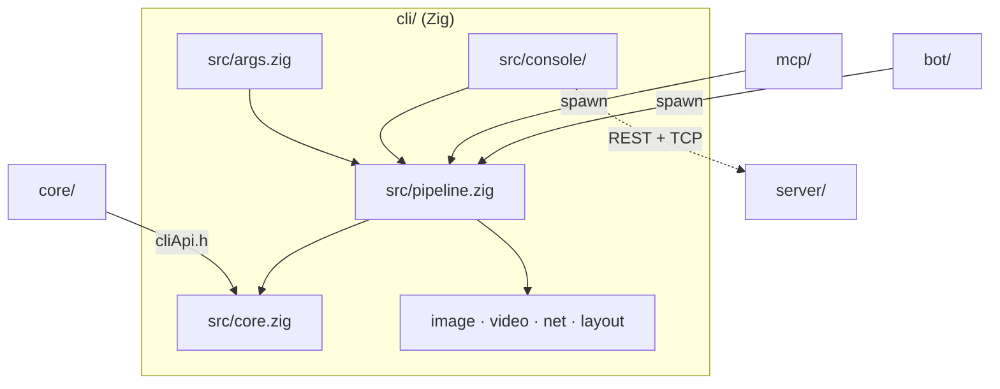
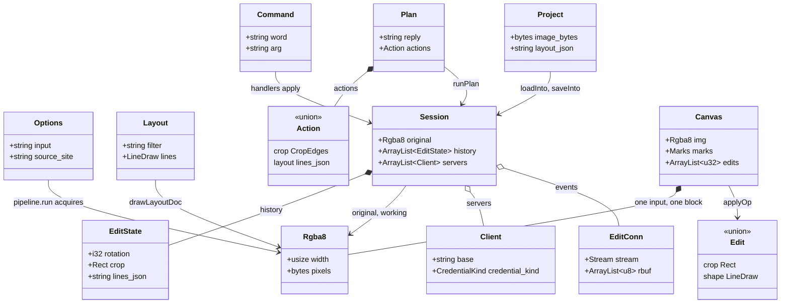

# CLI architecture

The system-wide design — the parity contract, canonical data, the layer model, the pattern vocabulary — is in the root [`ARCHITECTURE.md`](../ARCHITECTURE.md); the argv + stderr contract the mcp and bot adapters parse is [`CONTRACT.md`](CONTRACT.md).

The C++ core does every pixel/geometry transform; Zig owns I/O, codecs (stb_image), video
(ffmpeg), HTTP (`std.http`) and JSON. The build recompiles the core sources directly from
the list in `build.zig`, a mirror of `STENCIL_CORE_SOURCES` in `../core/CMakeLists.txt`.

## Layers

`core.zig` + `script/core.zig` → `args.zig` (+ `params/`) → `net.zig` (+ `net/`) → ops (`pipeline/`, `script/`,
`media/`) → `llm/` → `console/` → `app/` → `main.zig`.
**Only the presentation layer may write to a terminal** — `app/`, the
entry points and the two interactive surfaces (`console/`, `line_edit/`). Everything below
reports through `app/report.zig` and never spells an ANSI escape; `app/logo.zig`'s
`test "layering: …"` fails on a new file that breaks it.

## Where things go

| Path | Holds | Rule |
|---|---|---|
| `build.zig`, `build.zig.zon` | the build (core `.cpp` + `cliApi.cpp` + the stb TUs, libc++) and the pinned stb dependency | the core file list mirrors `STENCIL_CORE_SOURCES` |
| `src/main.zig`, `help.txt`, `app/` (`logo.zig` + `logo/`, `report.zig`, `brand.zig`, `theme.zig`, `skin.zig`, `messages.zig`) | the entry point, the generated `--help` body, then the presentation ring: the console logo + layer lint, the report sink, the brand colours, the secret console skins, the user-facing strings | every user-facing string is a named constant in `app/messages.zig`, pinned in `tests/pins/` |
| `src/args.zig` + `params/` | the flag surface: `options.zig` (Options + Mode), `parse.zig` (argv → Options) | the flag surface is `CONTRACT.md`, mirrored by `mcp/src/args/` and the bot's `CliArgvBuilder` |
| `src/pipeline.zig` + `pipeline/` | orchestration: resolve a source, run the steps, the one-shot run | headless; reports through `report.zig` |
| `src/script.zig` + `script/` (`core.zig` is the core's script bridge) | `.stc` script modes: read, check, lower to an op plan, emit the script for another surface (`emit/`, one backend per target), expand a `@source` into files, run the lowered ops, name the output | the core owns the language; this owns files, pixels and where output lands. An emit backend is the twin of that surface's own runner, and refuses what stc-contract §10 says the surface cannot honour |
| `src/core.zig` + `core/` (`formula.zig`), `media/` (`image.zig`, `imageRows.zig`, `stb_*_impl.c`, `types.zig`, `page.zig`, `layout.zig`, `video.zig`) | the core bridge and its formula half (the named values a coordinate formula may read), then codecs, the row-band threading policy, media-type tables, page policy, layout JSON, ffmpeg frame grab | the decoder TU stays narrowed (`STBI_NO_*`, `STBI_MAX_DIMENSIONS`) with UBSan on; the encoder TU builds without it |
| `src/net.zig` + `net/` (`host.zig`, `send.zig`, `fetchPool.zig`) | the **one fetch guard** (http(s) only, SSRF/redirect checks, 64 MiB cap), the authority split, the exchange under its per-request deadline, the bounded fan-out | every outbound URL passes `net.zig`; no code path re-derives the checks, and none waits on a host without a deadline |
| `src/safety/` (`confine.zig`, `sanitize.zig`, `child.zig`) | output-path guards, the one sanitizer for untrusted prose, child spawning without `STENCIL_LLM_*` | `..` always refused; absolute/`~` refused under `--confine-output` |
| `src/console.zig` + `console/` | the REPL: `session` (+ history, edits, attachments, chat, servers), `commands` (pure grammar), `ui`, `render/` (ansi, spinner, logo effects, the derived view, the projects table), `handlers/` (one file per feature), `llmPrompt` + `llm/`, `screen` + `screen/` (the full-screen TUI) | grammar is parsed in `commands.zig`, executed in `handlers/`; never both in one place |
| `src/line_edit.zig` + `line_edit/` | the raw-mode line editor | TTY only; piped stdin takes the plain reader |
| `src/clipboard.zig` + `clipboard/` | `/paste` + `/copy` over the per-OS shell helpers | |
| `src/llm.zig` + `llm/` | the wire, transport, registry, op schema and `opplan/` (validator + §10 guards) | plans validate against the embedded registry before anything runs |
| `src/scrape.zig` + `scrape/` | `--source-site`: page walker, filters, window, run loop; `regex_shim.c` for `--source-name` | adapter-only, no `core/` involvement; patterns capped at 200 chars |
| `src/project.zig` + `project/` (`cli.zig` is the one-shot front) | `.stencil` codec, shape, session bridge; the one-shot open/bundle | |
| `src/server/` (`client.zig` + the wire parts) | the collaboration-server client (urls, payload, parse, edit channel) | mirrors `server/internal/protocol` |
| `src/bench/` (`bench.zig` + its fixtures) | the opt-in `zig build bench` | ratio assertions only |
| `tests/` | `*_test.zig` integration suites banded by seam, `*_drift_test.zig` byte-pins of embedded `browser/js/config/` tables, `pins/` text goldens, `fixtures/` | |
| `testdata/` | the language-neutral stderr goldens `mcp/` and `bot/` replay | one set of goldens for all three suites |
| `scripts/tui_smoke.py` | the manual pseudo-terminal smoke check for the TUI | not in CI; timing-dependent |

## Entities

| Entity | What it is | Owned by / lifetime | Relates to |
|---|---|---|---|
| `Options` (`params/options.zig`) | One invocation's flags; `modeOf` derives the `Mode` (`usage`, `console`, `scrape`, `project`, `pipeline`) | `main.zig`, the process | Read by `pipeline.run`, `scrape.run`, `project_cli.runOneShot` |
| `Rgba8` (`media/image.zig`) | A decoded interleaved RGBA8 buffer, the only pixel type the core transforms | The caller's allocator; `decoded` marks stb's over-aligned plane | Produced by `image.decode`, consumed by every `pipeline/steps` op and `image.encode` |
| `Layout` (`media/layout.zig`) | A parsed layout document: dims, filter, page and `core.LineDraw` lines | Its own arena, per run | The browser's `buildLayoutPayload` shape is canonical; re-mapped through `FrameStep` |
| `Session` (`console/session.zig`) | The console's working document: the original, the undo stack, the derived view, the server pool, the LLM `Config`, `Attachment`s and chat `Turn`s | `console.run` or `project_cli.runOneShot`, for the process | Holds `EditState`, `Client`, `EditConn` |
| `EditState` (`console/session/state.zig`) | One undoable snapshot: rotation, crop, filter, lines JSON | `Session.history`, up to `max_states` | The browser layout model is canonical; serialized by `currentLayoutJson` |
| `Command` (`console/commands.zig`) | A parsed console line; `verbOf` yields a `Verb`, `actionOf` a transform `Action` (`crop`/`rotate`/`filter`/`layout`) | Slices into the input line, one dispatch | Switched on by `dispatch.handle` into `handlers.do*` |
| `Plan` (`llm/opplan/model.zig`) | A validated op plan: reply, actions, variants, an optional `Ask`, warnings | Its own arena, one `/prompt` turn | `opRegistry.json` (browser) is canonical; produced by `parsePlan`, run by `plan.runPlan` |
| `Action` (`llm/opplan/model.zig`) | One normalized op as a tagged union, one variant per registered op | Arena of its `Plan` | Pinned 1:1 onto `op_registry` at comptime; applied by `applyPlanAction` |
| `Project` (`project/shape.zig`) | A parsed `.stencil` document: metadata, encoded original, layout JSON, optional chat block | Its own arena; returned by `loadInto` | The browser's `.stencil` writer is canonical; built by `codec.build` from `BuildOpts` |
| `Client` (`server/rest.zig`) | One collaboration-server connection: origin, session token, what the credential proved to be; its `Transport` returns bodies, and every other fetch ends in a `net.Response` (status + capped body) | `Session.servers` or a one-shot `pipeline.run` | Mirrors `server/internal/protocol`; `request` re-mints once on a stale session |
| `EditConn` (`server/edit.zig`) | The read-only NDJSON events subscription over the raw-TCP edit port; yields `Event`s (id, name, version, deleted) | `Session.events`, while a project is synced | `pullAction` decides what a peer's edit means |
| `Edit` (`script/decode.zig`) | One lowered `.stc` op as a tagged union — crop rect, shape `LineDraw`, filter, layout, save, frame, undo steps — with every length already in pixels | The caller's `ResolveBuf`, until the next decode | The core owns the op stream; the runner, the console and the planner all read it through this |
| `Canvas` (`script/run.zig`) | One input carried through one block: its pixels, save format, frame, the `Marks` not yet burned, and the edits applied so far with a cursor into them | `runBlockOn`, one input | `@undo` moves the cursor and `rewind` replays the survivors onto a freshly opened input |

## Patterns

| Pattern | Where | Notes |
|---|---|---|
| Facade over core | `core.zig` over `cliApi.h`; package roots `pipeline.zig`, `llm.zig`, `server/client.zig`, `project.zig` | Typed, allocation-free wrappers; each root re-exports the names its callers bind to |
| Command | `EditState` on `Session.history` (`pushState`, `undo`, `redo`, `revert`); `Verb` → `dispatch.handle` → `handlers.do*` | Every edit is a snapshot; the view is rebuilt from it, never patched |
| Strategy | `Provider` → `wire/body.zig writeBody`; `scrape.Deps`; `server/http.zig Transport`; `report.Writer` | Selected by enum or injected fn pointer; tests swap the seam, production wires the real one |
| Observer | `EditConn` drained by `remoteEvents.pollEvents` at the prompt boundary; `markDirty` / `flushSync` | `PullAction` is a pure decision over version, dirty and id |
| Repository | `project.loadInto` / `saveInto`; `Client.getProject` / `updateProject` / `uploadFile` | Persistence behind one bridge, shared by the console and the one-shot path |
| Chain of Responsibility | `net.request`: `guardHost` (literal host, DNS resolution, `strict`), redirect refusal, `MAX_FETCH_BYTES`, `timeout_ms`; `confine.hasParentTraversal` then `outsideCwd` | One guard per concern, in a fixed order |
| Adapter | `media/layout.zig parse` (browser JSON → `LineDraw`), `server/payload.zig buildLayout` (session → envelope), `media/image.zig` over stb | The CLI never edits the layout schema, it translates to and from it |
| Pipeline | `pipeline/oneshot.run` over `pipeline/steps.zig` | acquire → crop → rotate → filter → layout → encode; the console drives the same steps one at a time |
| Table-driven validator | `opSchema.Schema` over the embedded `opRegistry.json`; `registry/table.zig op_registry` | A comptime check pins one descriptor per `Action` variant; forbidden names fail at build |
| Traits table | `app/skin.zig` `Traits`, one row per `Skin` | Its word, phrase, wordmark and how it paints; every consumer reads a field, none switches on the skin |

## Design

- **A script run.** `--script` reads the file (or stdin), hands it to the core, and refuses
  to run anything if a diagnostic is an error. The core returns blocks and a flat op stream;
  `script/sources.zig` turns a block's spec into concrete inputs (a file, a fetched URL, or
  every media file in a directory or glob), and the block replays over each one. Lengths
  resolve per op against the image as it stands, so a `%` after a crop means what it says.
  `script/decode.zig` reads one op out of the core as a typed edit — every walker of the
  stream shares it — and `script/apply.zig` turns that edit into pixels; `@line`/`@rect`/
  `@layout` queue as `Marks` and burn in one pass before a `@crop` or a `@save`.
  An `@undo N` moves a `Canvas` cursor over the edits it has applied and the image is rebuilt
  by re-opening the input and replaying the survivors: the lowerer resolves the history, the
  runner still has to execute the rewind it emitted.
  `@save` names its file through `script/save.zig`: bare, it writes beside the source with a
  `-stencil` suffix, which is what makes a whole-directory run safe in place — and into the
  working directory when the source was a URL.

- **A script plan.** `--script-plan` lowers the same stream for an adapter that drives an
  editor instead of pixels. `script/planActions.zig` rewrites each block's ops in the
  op-plan vocabulary of the embedded `opRegistry.json` — the wire names `applyPlanAction`
  already executes — resolving shape geometry against a header-only size probe of the
  block's first input and chunking the result at `MAX_ACTIONS`. `script/plan.zig` wraps that
  in the envelope `CONTRACT.md` §4.3 pins and writes it, and only it, to stdout; a script
  with an error plans no blocks at all.

- **A one-shot run.** `args.parse` turns argv into `Options`, `modeOf` picks the `Mode`.
  `pipeline.run` acquires an `Rgba8` (`acquireInput`: a local read, `net.fetch` or
  `video.extractFrame`; `acquireBlank`; a server `downloadFile`), then `cropInPlace`,
  `applyRotateBy`, `loadLayoutDoc` → `Layout`, `applyFilterMode`, `drawLayoutDoc`
  (`core.rasterizeLine`). `writeOutputLabeled` encodes and prints
  `wrote {path} ({w}x{h} px · {page})` through `report.print`, the one exit for every
  line below the presentation layer (an installed `Writer` captures them headlessly).
- **A console turn.** The console is POSIX-only: its raw mode is termios, so `main.zig`
  refuses it on Windows and every one-shot mode still ships there.
  `commands.parseCommand` yields a `Command`; `dispatch.handle` routes
  a `Verb` to its handler or a transform to `handlers/edit.zig runAction`, which calls
  `applyCrop`, `applyRotate`, `setFilter` or `addLines`. Each dupes the current
  `EditState`, `pushState`s it and `rebuild`s the view (`derivedView.Base` caches rotate →
  crop → filter, then the lines). `/undo` and `/redo` move `cursor`; a recorded edit
  `markDirty`s and `flushSync` uploads at the prompt boundary.
- **A secret skin.** A word `app/skin.zig` knows (listed only by `/eastereggs`, never by
  `help` or Tab) is caught in `dispatch.zig` before `verbOf`, so it has no `Verb`. The skin
  is global presentation state: `render/ansi/restyle.zig` re-dresses every row the full-screen
  console paints (the clip walkers, the status rule, the prompt), `logo/mark.zig` swaps the S
  art, and an animated skin repaints from the idle hook at a frame rate, writing only the rows
  whose bytes differ from their last paint (`Screen.row_hashes`). A logo click or `/theme`
  takes it off.
- **An LLM turn.** `/prompt` → `console/llm/run.doPrompt`: `Session.llmConfig()` resolves
  the `Config`, the working image, edge map and `Attachment`s ride as images,
  `buildRequestWithHistory` builds the `Request` for the `Provider`, `transport.postJson`
  waits with a `Waiter`, `extractReply` pulls the text. `plan.runPlan` calls `parsePlan`;
  a `Plan`'s actions run through `applyPlanAction` onto the same handlers, an `Ask` is
  remembered in `ask_options`, a load-without-trace plan re-sends once.
- **A server connection.** `/connect url [token]` → `server.connect`: `normalizeBase`,
  `resolveToken` (a GET /projects probe, an admin re-mint, or an anonymous mint) → a
  `Client` in `Session.servers`. `/fetch name` uses `findProjectRef`, `downloadFile` and
  `getProject`, then `adoptServerLayout`, `setRemote` and `openEvents` (an `EditConn`
  hello). A push sends the `buildLayout` envelope to `updateProject(id, layout, version)`
  and `uploadFile`s the result; each drained `Event` goes through `pullAction`.
- **A `.stencil` project.** `Mode.project` runs `project_cli.runOneShot` on a `Session`.
  `project.loadInto` parses a `Project`, decodes `image_bytes`, `loadImage`s it with the
  encoded source retained and `adoptServerLayout(layout_json)`; `saveInto` bundles the
  verbatim source, `currentLayoutJson` and a `SaveMeta` through `codec.build`. The shape is
  `{format: "stencil-project", version: 1, name, image: {dataUrl, ext, w, h}, layout, chat?}`.
- **A scrape.** `Mode.scrape` → `scrape.run` with the real `Deps`. The page is fetched
  non-strict through `net.fetch`, `parseMedia` yields `Media` items, `categoryPass`,
  `formatPass` and `NameMatcher` filter them, `window` cuts the slice. `fetchPool.fetchAll`
  runs the `Job`s (`strict = subStrict`) on at most `max_workers` tasks into a `Batch` in
  submission order; each write prints `wrote {path} ({w}x{h} px · source {host})`.

## Rules

1. **A module that outgrows one file becomes a package**: `x.zig` stays as the surface its
   callers bind to (re-exporting the names they used) and `x/` holds the pieces.
2. **Every file is test-registered.** A package root pulls its files into the test build with
   `test { _ = @import("…"); }`; `tests/test_registration_test.zig` fails on any module no
   `test {}` block names.
3. **Embedded tables come from `browser/js/config/`** via `@embedFile` and are drift-tested
   byte for byte. No value is hand-copied.
4. **The stderr grammar is a contract.** `wrote {path} ({w}x{h})`, `error: …`, `note: …`
   and the scrape lines are parsed by mcp and bot and pinned by `CONTRACT.md`,
   `testdata/` and both adapters' fixtures.
5. **Security guards are singular**: one fetch guard (`net.zig`), one output confinement
   (`safety/confine.zig`), one prose sanitizer (`safety/sanitize.zig`), one child spawner
   (`safety/child.zig`).

## Tests

Inline unit tests in `src/` and integration suites in `tests/` banded by seam: the PNG
fixture through every op and output format, a full `pipeline.run`, a console session
through `console.handle`, the drift tests of the embedded tables and the text goldens. The
`*_fixtures_test.zig` suites walk the shared corpora under `browser/js/config/` (op plans,
provider wire, chat documents, sanitizer, `.stencil`); `testdata/` holds the stderr goldens
mcp and bot replay; `tests/pins/` the colour and plain rendering of every console screen.
Every network or disk seam (`scrape.Deps`, `http.Transport`, `report.Writer`) takes an
in-memory fake, so the suite runs offline; the raw-mode TUI has a manual pseudo-terminal
smoke script. Benchmarks assert only ratios between two input sizes, never a wall-clock.
