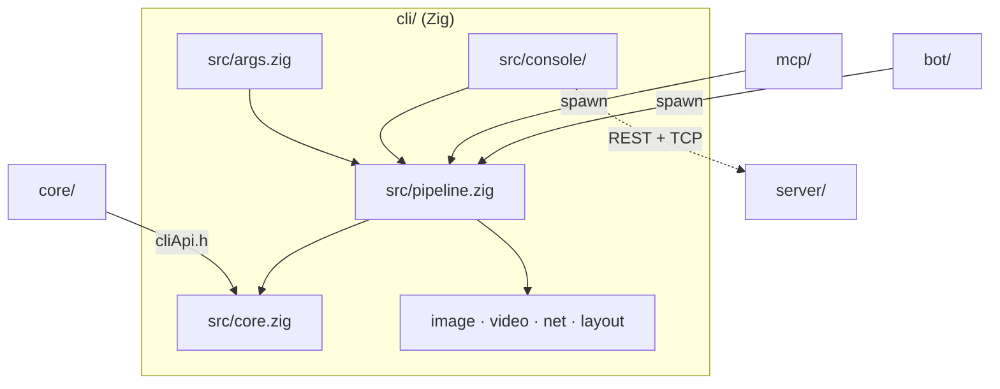

# CLI architecture

The system-wide design — the parity contract, canonical data, the layer model, the pattern vocabulary — is in the root [`ARCHITECTURE.md`](../ARCHITECTURE.md); the argv + stderr contract the mcp and bot adapters parse is [`CONTRACT.md`](CONTRACT.md).

The C++ core does every pixel/geometry transform; Zig owns I/O, codecs (stb_image), video
(ffmpeg), HTTP (`std.http`) and JSON. The build recompiles the core sources directly from
the list in `build.zig`, a mirror of `STENCIL_CORE_SOURCES` in `../core/CMakeLists.txt`.

## Layers

`core.zig` → `args.zig` (+ `params/`) → `net.zig` → ops (`pipeline/`, `image.zig`,
`layout.zig`, `page.zig`, `video.zig`) → `llm/` → `console/` → `main.zig`.
**Only the presentation layer may write to a terminal** — `logo.zig`, `report.zig`, the
entry points and the two interactive surfaces (`console/`, `line_edit/`). Everything below
reports through `report.zig` and never spells an ANSI escape; `logo.zig`'s
`test "layering: …"` fails on a new file that breaks it.

## Where things go

| Path | Holds | Rule |
|---|---|---|
| `build.zig`, `build.zig.zon` | the build (core `.cpp` + `cliApi.cpp` + the stb TUs, libc++) and the pinned stb dependency | the core file list mirrors `STENCIL_CORE_SOURCES` |
| `src/main.zig`, `logo.zig` (+ `logo/`), `report.zig`, `help.txt`, `brand.zig`, `theme.zig`, `messages.zig` | the entry point, the console logo + layer lint, the report sink, the generated `--help` body, the brand colours, the user-facing strings | every user-facing string is a named constant in `messages.zig`, pinned in `tests/pins/` |
| `src/args.zig` + `params/` | the flag surface: `options.zig` (Options + Mode), `parse.zig` (argv → Options) | the flag surface is `CONTRACT.md`, mirrored by `mcp/src/args/` and the bot's `CliArgvBuilder` |
| `src/pipeline.zig` + `pipeline/` | orchestration: resolve a source, run the steps, the one-shot run | headless; reports through `report.zig` |
| `src/core.zig`, `image.zig`, `imageRows.zig`, `stb_*_impl.c`, `mediaTypes.zig`, `page.zig`, `layout.zig`, `video.zig` | the core bridge, codecs, the row-band threading policy, media-type tables, page policy, layout JSON, ffmpeg frame grab | the decoder TU stays narrowed (`STBI_NO_*`, `STBI_MAX_DIMENSIONS`) with UBSan on; the encoder TU builds without it |
| `src/net.zig`, `host.zig`, `fetchPool.zig` | the **one fetch guard** (http(s) only, SSRF/redirect checks, 64 MiB cap), the authority split, the bounded fan-out | every outbound URL passes `net.zig`; no code path re-derives the checks |
| `src/confine.zig`, `sanitize.zig`, `child.zig` | output-path guards, the one sanitizer for untrusted prose, child spawning without `STENCIL_LLM_*` | `..` always refused; absolute/`~` refused under `--confine-output` |
| `src/console.zig` + `console/` | the REPL: `session` (+ history, edits, attachments, chat, servers), `commands` (pure grammar), `ui`, `handlers/` (one file per feature), `llmPrompt` + `llm/`, `screen` + `screen/` (the full-screen TUI) | grammar is parsed in `commands.zig`, executed in `handlers/`; never both in one place |
| `src/line_edit.zig` + `line_edit/` | the raw-mode line editor | TTY only; piped stdin takes the plain reader |
| `src/clipboard.zig` + `clipboard/` | `/paste` + `/copy` over the per-OS shell helpers | |
| `src/llm.zig` + `llm/` | the wire, transport, registry, op schema and `opplan/` (validator + §10 guards) | plans validate against the embedded registry before anything runs |
| `src/scrape.zig` + `scrape/` | `--source-site`: page walker, filters, window, run loop; `regex_shim.c` for `--source-name` | adapter-only, no `core/` involvement; patterns capped at 200 chars |
| `src/project.zig` + `project/`, `project_cli.zig` | `.stencil` codec, shape, session bridge; the one-shot open/bundle | |
| `src/serverClient.zig` + `server/` | the collaboration-server client (urls, payload, parse, edit channel) | mirrors `server/internal/protocol` |
| `src/bench.zig` + `bench/` | the opt-in `zig build bench` | ratio assertions only |
| `tests/` | `*_test.zig` integration suites banded by seam, `*_drift_test.zig` byte-pins of embedded `browser/js/config/` tables, `pins/` text goldens, `fixtures/` | |
| `testdata/` | the language-neutral stderr goldens `mcp/` and `bot/` replay | one set of goldens for all three suites |
| `scripts/tui_smoke.py` | the manual pseudo-terminal smoke check for the TUI | not in CI; timing-dependent |

## Rules

1. **A module that outgrows one file becomes a package**: `x.zig` stays as the surface its
   callers bind to (re-exporting the names they used) and `x/` holds the pieces.
2. **Every file is test-registered.** A package root pulls its files into the test build with
   `test { _ = @import("…"); }`; `tests/test_registration_test.zig` fails on any module no
   `test {}` block names.
3. **Embedded tables come from `browser/js/config/`** via `@embedFile` and are drift-tested
   byte for byte. No value is hand-copied.
4. **The stderr grammar is a contract.** `wrote {path} ({w}x{h})`, `error: …`, `note: …`
   and the scrape lines are parsed by mcp and bot and pinned by `CONTRACT.md`,
   `testdata/` and both adapters' fixtures.
5. **Security guards are singular**: one fetch guard (`net.zig`), one output confinement
   (`confine.zig`), one prose sanitizer (`sanitize.zig`), one child spawner (`child.zig`).

## Tests

Inline unit tests in `src/` and integration suites in `tests/` banded by seam: the PNG
fixture through every op and output format, a full `pipeline.run`, a console session
through `console.handle`, the drift tests of the embedded tables and the text goldens. The
raw-mode TUI is covered by a manual pseudo-terminal smoke script. Benchmarks assert only
ratios between two input sizes of the same stage, never a wall-clock number.
