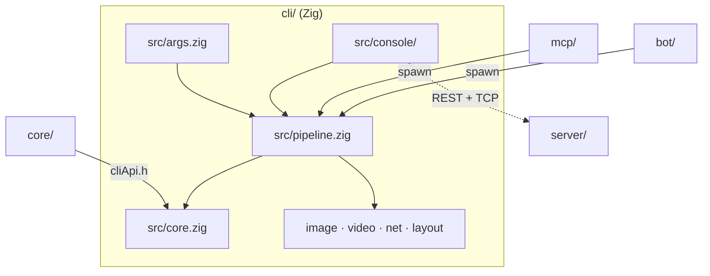
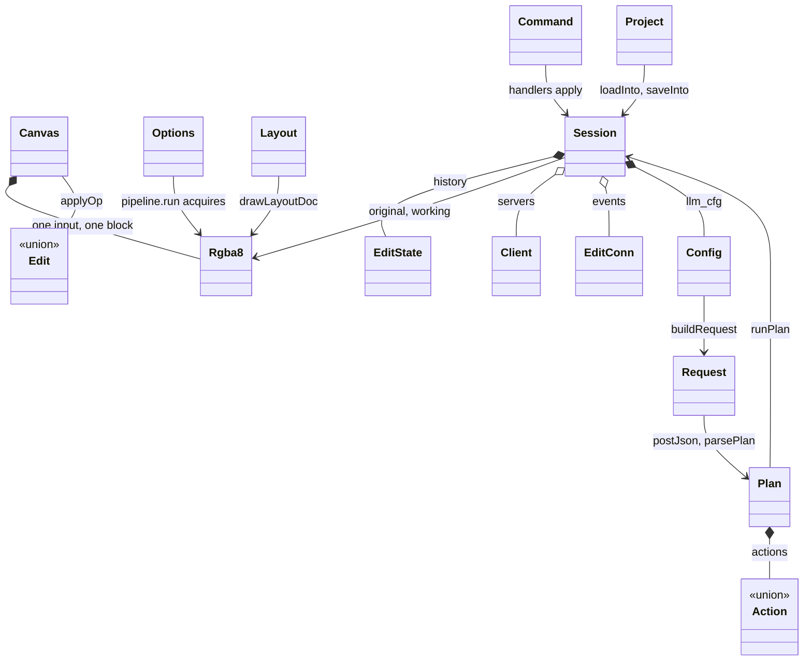

# CLI architecture

The system-wide design — the parity contract, canonical data, the layer model, the pattern vocabulary — is in the root [`ARCHITECTURE.md`](../ARCHITECTURE.md); the argv + stderr contract the mcp and bot adapters parse is [`CONTRACT.md`](CONTRACT.md).

```mermaid
graph TD
    subgraph CLIP["cli/ (Zig)"]
      ARGS["src/args.zig"]
      PIPE["src/pipeline.zig"]
      COREZ["src/core.zig"]
      IO["image · video · net · layout"]
      REPL["src/console/"]
    end
    CORE["core/"] -->|"cliApi.h"| COREZ
    ARGS --> PIPE
    PIPE --> COREZ
    PIPE --> IO
    REPL --> PIPE
    REPL -.->|"REST + TCP"| SRV["server/"]
    MCP["mcp/"] -->|"spawn"| PIPE
    BOT["bot/"] -->|"spawn"| PIPE
```

The C++ core does every pixel/geometry transform, recompiled from the list in `build.zig`; Zig
owns I/O, codecs (stb_image), video (ffmpeg), HTTP (`std.http`) and JSON.

## Layers

`core.zig` + `script/core.zig` → `args.zig` (+ `params/`) → `net.zig` (+ `net/`) → ops
(`pipeline/`, `script/`, `media/`, `inspect/`) → `llm/` → `console/` → `app/` → `main.zig`.
**Only the presentation layer may write to a terminal.** `app/lint.zig` names it: the files
`main.zig`, `args.zig`, `console.zig` and `project/cli.zig`, and everything under `app/`,
`bench/`, `console/`, `line_edit/` and `params/`. Every other file reports through
`app/report.zig`; the lint fails on one that calls a `logo` print or writes an ANSI escape, on
an `error: `/`note: ` prefix spelled outside `app/logo/severity.zig`, and on a private alias
or import nothing reads.

## Where things go

| Path | Holds | Rule |
|---|---|---|
| `build.zig`, `build.zig.zon` | the build and the pinned stb dependency | the core file list matches `STENCIL_CORE_SOURCES` |
| `src/main.zig`, `help.txt`, `app/` | the entry point, `--help`, the presentation ring, the report sink and the source lints | the console's strings and skins are named in `app/messages.zig` and `app/skin/`, pinned in `tests/pins/`; a one-shot line is spelled at its call through `app/report.zig` and pinned by `CONTRACT.md` and `testdata/` |
| `src/args.zig` + `params/` | `Options` + `Mode` and the argv loop | the flag surface is `CONTRACT.md`; `tests/help_flags_test.zig` scans every parser file |
| `src/pipeline.zig` + `pipeline/` | the one-shot orchestration | headless; reports through `report.zig` |
| `src/script.zig` + `script/` | the `.stc` modes, including emit for another surface (`emit/`) | the core owns the language; this owns files, pixels and output |
| `src/core.zig` + `core/`, `media/` | the core bridge, codecs, page policy, layout JSON, the ffmpeg frame grab and ffprobe read | the decoder TU stays narrowed (`STBI_NO_*`, `STBI_MAX_DIMENSIONS`) with UBSan on; `media/decodeGuard.zig` bounds what stb may read; ffmpeg and ffprobe read only a local file (`media/remoteVideo.zig`) |
| `src/net.zig` + `net/` | the **one fetch guard** over the embedded `common/config/net/blockedRanges.json`, the pinned server dial, the bounded fan-out, the watched call | every outbound URL passes `net.zig`; nothing keeps its own address list or waits on a host without a deadline |
| `src/safety/` | output-path confinement, the one sanitizer for untrusted text, child spawning without `STENCIL_LLM_*` or server tokens and under a deadline | `..` always refused; absolute or symlinked escapes refused under `--confine-output`; every child is killed at its deadline |
| `src/console.zig` + `console/` | the REPL: session, `commands`, `handlers/`, `render/`, `screen/` (the TUI) | grammar is parsed in `commands.zig` and executed in `handlers/`; a model's or server's text prints through `render/inert.zig` |
| `src/line_edit/` | the raw-mode line editor and the hidden secret read | TTY only; piped stdin takes the plain reader |
| `src/clipboard.zig` + `clipboard/` | `/paste` + `/copy` over the per-OS shell helpers | |
| `src/llm.zig` + `llm/` | the provider `Config`, the embedded `providers.json`, `wire/` (one mapping per provider), the transport, `opplan/` and `--plan-check` | the validator is core's; nothing here re-checks a key; a key is never printed and is zeroed when dropped |
| `src/scrape.zig` + `scrape/` | `--source-site` and `regex_shim.c` for `--source-name` | adapter-only, no `core/` involvement |
| `src/project.zig` + `project/` | the `.stencil` codec and session bridge; the one-shot front, `--prompt` included | |
| `src/server/` | the collaboration-server client and `tokens.zig`, which credential a URL is dialled with | follows `server/internal/protocol`; a token is never printed |
| `src/inspect.zig` + `inspect/` | `--probe` and the project report modes | one JSON document on stdout, only on success |
| `src/bench/` | the opt-in `zig build bench` | ratio assertions only |
| `tests/` | suites and rigs, `config/*_drift_test.zig` cross-checks, `pins/` text goldens, `fixtures/` | a suite sits in the folder of the `src/` area it covers; `test_root.zig` names every `*_test.zig`, and `tests/test_registration_test.zig` fails on one it does not |
| `testdata/` | the stderr goldens `mcp/` and `bot/` replay | one set of goldens for all three suites |
| `scripts/tui_smoke.py` | the manual pseudo-terminal smoke check for the TUI | not in CI |

## Entities

```mermaid
classDiagram
    Canvas *-- Rgba8 : one input, one block
    Canvas --> Edit : applyOp
    Options --> Rgba8 : pipeline.run acquires
    Layout --> Rgba8 : drawLayoutDoc
    Session *-- EditState : history
    Session --> Rgba8 : original, working
    Session o-- Client : servers
    Session o-- EditConn : events
    Command --> Session : handlers apply
    Plan *-- Action : actions
    Plan --> Session : runPlan
    Project --> Session : loadInto, saveInto
    Session *-- Config : llm_cfg
    Config --> Request : buildRequest
    Request --> Plan : postJson, parsePlan
    <<union>> Action
    <<union>> Edit
```

| Entity | What it is | Owned by / lifetime | Relates to |
|---|---|---|---|
| `Options` (`params/options.zig`) | One invocation's flags and server tokens; `modeOf` derives its `Mode` | `main.zig`, the process | Read by each mode's runner |
| `Rgba8` (`media/image.zig`) | A decoded RGBA8 buffer, the only pixel type the core transforms | The caller's allocator | Read by every step |
| `Layout` (`media/layout.zig`) | A parsed layout document: dims, filter, page, lines held to core's layout caps | Its own arena, per run | The browser's layout payload is canonical |
| `Session` (`console/session.zig`) | The console's working document: original, undo stack, view, servers, LLM `Config`, attachments, chat | The console or the one-shot front, for the process | Holds `EditState`, `Client`, `EditConn`, `Config` |
| `EditState` (`console/session/state.zig`) | One undoable snapshot: rotation, crop, filter, lines JSON | `Session.history`, capped | The browser layout model is canonical |
| `Command` (`console/commands.zig`) | A parsed console line, yielding a `Verb` or a transform | One dispatch | Routed into `handlers/` |
| `Plan` (`llm/opplan/model.zig`) | A validated op plan: reply, actions, variants, ask, warnings | Its own arena, one turn | `common/config/llm/opRegistry.json` is canonical |
| `Action` (`llm/opplan/model.zig`) | One normalized op, one union variant per registered op | Its `Plan`'s arena | Pinned 1:1 onto the registry at comptime |
| `Project` (`project/shape.zig`) | A parsed `.stencil` document: metadata, encoded original, layout, chat | Its own arena | The browser's `.stencil` writer is canonical |
| `Client` (`server/rest.zig`) | One server connection: origin, session token, what the credential proved to be | `Session.servers` or one one-shot run | Re-mints once on a stale session |
| `EditConn` (`server/edit.zig`) | The read-only NDJSON events subscription on the raw-TCP edit port | `Session.events`, while a project is synced | `pullAction` decides what a peer's edit means |
| `Edit` (`script/decode.zig`) | One lowered `.stc` op as a union, every length already in pixels | The caller's buffer, until the next decode | How runner, console and planner read core's op stream |
| `Config` (`llm/config.zig`) | The provider configuration: provider, URL, model, key (an anthropic key with its expiry) | `Session.llm_cfg`, from `STENCIL_LLM_*`; the key zeroed when dropped | `providers.json` is canonical |
| `Request` (`llm/wire/request.zig`) | One ready call: URL, credential header, body | One round; credentials zeroed on `deinit` | Built from a `Config` |
| `Canvas` (`script/run.zig`) | One input through one block: pixels, placed `Marks`, the applied edits and a cursor | One input | `@undo` moves the cursor; a rewind replays the survivors |

## Patterns

| Pattern | Where | Notes |
|---|---|---|
| Facade over core | `core.zig` over `cliApi.h`; the package roots | Typed, allocation-free wrappers |
| Command | `EditState` on `Session.history`; `Verb` → `dispatch.handle` → `handlers/` | Every edit is a snapshot; the view is rebuilt from it, never patched |
| Strategy | `Provider` wire mappings; the injected transport, scrape and report seams | Selected by enum or fn pointer; tests swap the seam |
| Observer | `EditConn` drained at the prompt boundary | `PullAction` is a pure decision over version, dirty and id |
| Repository | `project.loadInto` / `saveInto`; the `Client` project calls | Persistence behind one bridge, shared by console and one-shot |
| Chain of Responsibility | `net.request`; `safety/confine.zig` | One guard per concern, in a fixed order |
| Adapter | `media/layout.zig`, `server/payload.zig`, `media/image.zig` over stb | The CLI never edits the layout schema, it translates to and from it |
| Pipeline | `pipeline/steps.zig` | acquire → crop → rotate → filter → layout → thumbnail → encode; the console drives the same steps one at a time |
| Validator in core | `core/opplan.zig` over `cliApi.h`; `registry/table.zig` | core judges the reply against the embedded `opRegistry.json` and its messages print as they are; a comptime check pins one descriptor per `Action` variant |
| Traits table | `app/skin.zig` `Traits`, one row per `Skin` | Every consumer reads a field, none switches on the skin |
| Frame buffer | `console/screen/frame.zig` | A frame is one synchronized `write` |

## Design

- **A script run.** `--script` hands the file (or stdin) to the core and runs nothing if a
  diagnostic is an error. A block replays over each input its spec expands to, lengths
  resolving against the image as it stands. `@line`/`@rect`/`@layout` place `Marks` that stay
  vectors: a `@crop` rescales them (`core.cropChange`) and a `@save` draws them onto a copy, so
  a later `@filter` never recolours them.
- **A script plan.** `--script-plan` lowers the same stream into the `CONTRACT.md` §4.3
  envelope on stdout: `opRegistry.json` actions with lengths resolved as `--script` resolves
  them, so replaying them leaves what `--script` saves. The planner tracks the executor's
  lines, history and crop origins; what a plan cannot carry is a diagnostic.
- **A plan check.** `--plan-check` judges a reply under the `--plan-surface` schema into the
  `CONTRACT.md` §7 envelope; the exit code separates an invalid plan from nothing to judge.
- **A console script.** `/script` and `/script-run` fold the lowered ops into one state, so
  `/undo` takes the whole script back; a failing op stops the run with nothing applied.
- **A report.** `Mode.inspect` writes the `CONTRACT.md` §6 document (`--probe`, the project
  modes), each record cut to whitelisted fields.
- **A one-shot run.** `pipeline.run` acquires an `Rgba8` (a file, `net.fetch`, a video frame, a
  blank page or a server download) and runs the Pipeline; the `wrote …` line goes through
  `report.print`, the one exit below the presentation layer.
- **A video frame.** A path whose extension `looksLikeVideo` accepts goes to ffmpeg (`--probe`:
  ffprobe first). A URL is first fetched by `net.fetch` under the image policy (the guard, no
  redirects, the 64 MiB cap) into an owner-only temp file deleted after the call, and the tool
  runs with `-protocol_whitelist file` on that path, so it never dials a host.
- **A console turn.** The console is POSIX-only; a Windows build ships every one-shot mode.
  A transform pushes a copy of the current `EditState` and rebuilds the view
  (`derivedView.Base` caches rotate → crop → filter). Lines live in view coordinates and follow
  a rotate or crop through core. A recorded edit marks the session dirty and `flushSync`
  uploads at the prompt boundary.
- **A secret skin.** A skin word is caught before `verbOf`, so it has no `Verb`; it is global
  presentation state over every painted row.
- **A full-screen paint.** Each tick is one write that leaves the cursor where it found it; the
  sink strips controls from scrollback. `screen/terminal.zig` records what the console borrowed
  from the terminal and hands it back from the panic hook and the termination signals.
- **An LLM turn.** `/prompt` sends a `Request` with the working image and attachments on a
  watched worker. `parsePlan` walks the reply through core; the `Plan`'s actions run through
  `applyPlanAction` onto the same handlers.
- **A one-shot prompt.** `--prompt <text>` loads the input into a `Session` seeded from
  `STENCIL_LLM_*`, runs one turn and writes the result, or exits 1 writing nothing without a
  usable plan.
- **The anthropic session key** (llm-contract §5, §6.5). It comes from `STENCIL_LLM_API_KEY` or
  `/llm key`, is masked wherever it is typed, expires after the configured TTL and is zeroed on
  expiry, `/llm key forget` or a provider switch. It travels as `x-api-key`, never over plain
  http other than loopback; upstream error text echoing the key is dropped. No key reaches a file.
  What is zeroed: the `Config` key on expiry, forget or switch, a `Request`'s `auth` and
  `api_key` on `deinit`, and the console's line buffers after a typed key. What cannot be: the
  process environment the key arrived in, the request head `std.http.Client` serialises into its
  connection buffer, and a server `Client`'s token and credential, which are freed unzeroed.
- **A server connection.** `/connect url [token]` resolves a token into a `Client`;
  `server.tokenFor` picks each URL's token in `CONTRACT.md`'s order. Every exchange resolves
  the host once and dials only an address `serverTarget` admitted (`net/pin.zig`). A push is a
  version-guarded update; a 409 re-reads the project, joins the peer's lines with ours
  (`core.mergeKeep`, `session/peerMerge.zig`) and retries. Each drained `Event` goes through
  `pullAction`.
- **A watched call.** The input loop runs every `net.request` on `jobCall.zig`'s worker while
  Ctrl-C is polled; a Ctrl-C stops the worker at its next Io call and waits for it, so nothing
  borrowed outlives the wait. While one thread owns the human channel, another thread's print
  is held whole (`app/logo/deferred.zig`) and landed by the owner.
- **A `.stencil` project.** `project.loadInto` parses a `Project` into a `Session`, keeping the
  encoded source; `saveInto` bundles that source, the current layout and its metadata. The
  shape is `{format: "stencil-project", version: 1, name, image: {dataUrl, ext, w, h}, layout, chat?}`.
- **A scrape.** The page is fetched, its media filtered by category, format and name and cut to
  the window; `fetchPool.fetchAll` fetches them on a bounded pool in submission order.

## Concurrency

One thread owns the process: the one-shot run, or the console's input loop with every paint,
`EditConn` poll and handler. Concurrency comes from `std.Io.Threaded` tasks the Io owns (the
watched call, each request's deadline, the pinned-dial race, the fetch pool), from plain
`std.Thread`s that `media/imageRows.zig` joins before returning, and from child processes. Io
cancellation interrupts only an Io call (a syscall the Io issued), so a worker stops at its
next one, and a child process is stopped by its deadline alone. `init.gpa` is thread-safe and
shared by every task; a fetch-pool job allocates from its own arena. Thread-locals hold
per-thread state that must never be read across a worker: the thread's watch (`net/job.zig`),
the parsed range table (`net/ranges.zig`), the body scratch (`net/fetchPool.zig`), the last
server rejection (`server/http.zig`, set and read on the caller), stb's allocator
(`media/imageAlloc.zig`) and the format scratch buffers of `core.zig`, `app/logo/severity.zig`,
`console/render/ansi/restyle.zig` and `console/session/scriptLog.zig`.

| Owner | Runs on | Shares | Guard | On overflow or teardown |
|---|---|---|---|---|
| `net/jobCall.zig` watched call | an Io concurrent task; the caller polls the terminal every beat | the borrowed arguments | `finished` atomic, then `fut.await` or `fut.cancel` before returning | Ctrl-C or the waiter's timeout cancels it and waits; what the stopped call returned is the caller's to free; no worker to spare runs it inline |
| `net/send.zig` deadlined exchange | an Io concurrent task | the `Task` on the caller's stack | `done` event, `muted` atomic | past `timeout_ms` (30 s, the LLM's 600 s) it is cancelled, its body freed, its error muted, and `no answer from … within Ns` printed |
| `net/pin.zig` dial race | one Io task per judged address, at most `max_pins` (8) | the dial context | the first connection wins | the losers are cancelled and their connections closed |
| `net/fetchPool.zig` pool | Io tasks in waves of `max_workers` (8) | a per-job arena and result row | submission-order `await` | a task the Io will not spawn runs on the caller; each job releases its thread's body scratch when it ends |
| `media/imageRows.zig` bands | `std.Thread`s, at most 8, the caller taking the last band | disjoint output rows | `join` before returning | a band that will not spawn runs on the caller |
| child processes (`safety/child.zig`) | another process, read on the calling thread | its stdout and stderr pipes | `media_timeout_ms` (60 s) for ffmpeg and ffprobe, `helper_timeout_ms` (10 s) for clipboard helpers | killed (SIGTERM, then reaped) at the deadline, with `error: <tool> did not finish within Ns — stopped`; output past `stdout_limit` ends the run |
| `app/logo/deferred.zig` held prints | any thread that does not own the human channel | the held queue | a spinlock; no callback runs inside it | past 1 MiB a print is dropped; the owner lands the rest at its next flush |
| `console/screen/terminal.zig` signal handlers | the interrupted thread, in signal context | the borrowed terminal state | only `write` and `raise`, which are async-signal-safe | TERM, HUP, INT and QUIT restore the terminal and re-raise under `SA_RESETHAND`; WINCH writes one byte to a non-blocking pipe |
| `server/edit.zig` `EditConn` | the console thread, at each prompt boundary | its frame buffer | single owner; `poll` never blocks | a line past `max_frame_bytes` (16 MiB, the server's frame cap) closes the feed with a note; one boundary handles at most `max_events_per_poll` (64) events, the rest wait for the next |
| once-parsed tables (`app/theme.zig`, `llm/opplan/guards.zig`) | the first thread to read | a static table | atomic state, the losers spin until it is ready | parsed once, never freed |

## Rules

1. **A module that outgrows one file becomes a package**: `x.zig` stays the surface its callers
   bind to (re-exporting the names they used) and `x/` holds the pieces — or, in a full parent
   folder, the entry moves inside its own folder (`bench/bench.zig`). `app/`, `media/`,
   `params/`, `safety/` and `server/` are folders with no surface file: each is a set of
   independent modules its callers import one by one (`server/client.zig` is the server
   client's own surface), and `main.zig` registers them.
2. **Every file is test-registered.** A package root names its files in a `test {}` block;
   `tests/test_registration_test.zig` fails on any module none names, and `test_root.zig` names
   every suite under `tests/`.
3. **Embedded tables come from `common/config/`** via `@embedFile` straight from the canonical
   file, so there is no copy to drift. A value read at comptime (`app/brand.zig`'s colours and
   `tokenLight`, `llm/providers.zig`'s `cli_chat_seconds`) is cross-checked against a real
   parse of the same bytes, and the one port of a constant no build can embed
   (`net/fetchPool.zig` `max_workers` = pystencil's `MAX_FETCH_WORKERS`) is pinned by
   `tests/config/fetch_workers_drift_test.zig`.
4. **The stderr grammar is a contract.** `wrote {path} ({w}x{h})`, `error: …`, `note: …` and the
   scrape lines are parsed by mcp and bot and pinned by `CONTRACT.md`, `testdata/` and both
   adapters' fixtures.
5. **Security guards are singular**: one fetch guard (`net.zig`), one output confinement
   (`safety/confine.zig`), one prose sanitizer (`safety/sanitize.zig`), one child spawner
   (`safety/child.zig`). A video URL passes the fetch guard like any other before a child
   sees its bytes. A collaboration server is dialled at the address judged; any other fetch
   judges a name's resolved addresses and lets `std.http.Client` resolve it again
   (`net/host.zig` `hostResolvesToBlocked`), so a host that rebinds between the two lookups
   is not caught.

## Tests

Unit tests sit inline in `src/` or under `tests/<area>/`; integration suites are banded by
seam: every op, a full `pipeline.run`, a console session. The `*_fixtures_test.zig` suites walk the shared corpora
under `common/fixtures/`, the anthropic wire through a capturing `SendFn`, so the headers sent
and the reason printed are real. The op-plan rules are proved in core (`core/tests/opplan/`);
the cli covers its typed mapping and messages, pinned over the whole corpus by
`tests/pins/opplan_oracle.json`. `tests/pins/` holds every console screen's rendering and each
effect's frames on a fake terminal and clock. Every network or disk seam takes an in-memory
fake, so the suite runs offline; `--prompt` runs end to end against a loopback mock. The
video path takes a spawn seam, so a refused host is proved never to reach ffmpeg; a child's
deadline is proved on a real `sleep`. `test`
depends on `fmt`, so every Zig file is `zig fmt` clean. Benchmarks assert only ratios, never a
wall-clock.
