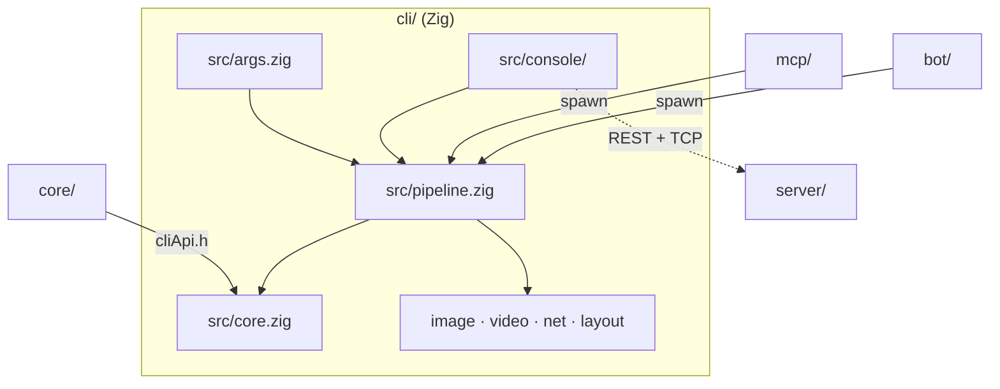
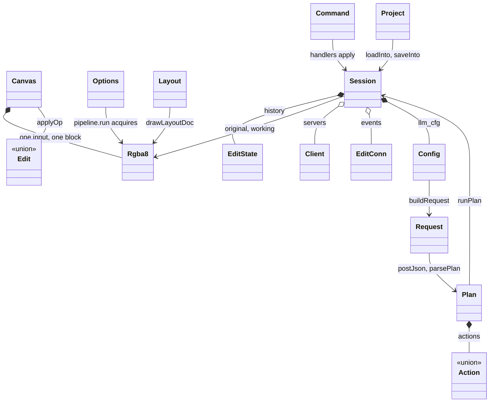

# CLI architecture

The system-wide design — the parity contract, canonical data, the layer model, the pattern vocabulary — is in the root [`ARCHITECTURE.md`](../ARCHITECTURE.md); the argv + stderr contract the mcp and bot adapters parse is [`CONTRACT.md`](CONTRACT.md).

```mermaid
graph TD
    subgraph CLIP["cli/ (Zig)"]
      ARGS["src/args.zig"]
      PIPE["src/pipeline.zig"]
      COREZ["src/core.zig"]
      IO["image · video · net · layout"]
      REPL["src/console/"]
    end
    CORE["core/"] -->|"cliApi.h"| COREZ
    ARGS --> PIPE
    PIPE --> COREZ
    PIPE --> IO
    REPL --> PIPE
    REPL -.->|"REST + TCP"| SRV["server/"]
    MCP["mcp/"] -->|"spawn"| PIPE
    BOT["bot/"] -->|"spawn"| PIPE
```

The C++ core does every pixel/geometry transform, recompiled from the list in `build.zig`; Zig
owns I/O, codecs (stb_image), video (ffmpeg), HTTP (`std.http`) and JSON.

## Layers

`core.zig` + `script/core.zig` → `args.zig` (+ `params/`) → `net.zig` (+ `net/`) → ops
(`pipeline/`, `script/`, `media/`, `inspect/`) → `llm/` → `console/` → `app/` → `main.zig`.
**Only the presentation layer may write to a terminal** — `app/`, the entry points, `console/`
and `line_edit/`. Everything below reports through `app/report.zig` and never spells an ANSI
escape; `app/lint.zig` fails on a file that breaks the layering or an unread private name.

## Where things go

| Path | Holds | Rule |
|---|---|---|
| `build.zig`, `build.zig.zon` | the build and the pinned stb dependency | the core file list mirrors `STENCIL_CORE_SOURCES` |
| `src/main.zig`, `help.txt`, `app/` | the entry point (its panic hook restores the terminal first), the generated `--help`, the presentation ring and the source lints | every user-facing string is a named constant in `app/messages.zig`, pinned in `tests/pins/` |
| `src/args.zig` + `params/` | `Options` + `Mode` and the argv loop | the flag surface is `CONTRACT.md`, mirrored by `mcp/src/args/` and the bot's `CliArgvBuilder`; `tests/help_flags_test.zig` scans every parser file |
| `src/pipeline.zig` + `pipeline/` | the one-shot orchestration | headless; reports through `report.zig` |
| `src/script.zig` + `script/` | `.stc` modes: check, run, lower to an op plan, emit for another surface (`emit/`), expand a `@source` | the core owns the language; this owns files, pixels and where output lands. An emit backend twins that surface's runner and refuses what stc-contract §10 says it cannot honour |
| `src/core.zig` + `core/`, `media/` | the core bridge, codecs with stb's zero-filling allocator (a truncated file decodes the same whatever the heap held), page policy, layout JSON, the ffmpeg frame grab | the decoder TU stays narrowed (`STBI_NO_*`, `STBI_MAX_DIMENSIONS`) with UBSan on; the encoder TU builds without it; `media/decodeGuard.zig` grows a short PNG or BMP palette to 256 black entries, refuses a BMP shorter than its rows and caps every stb block at the header's largest plane, as pystencil does |
| `src/net.zig` + `net/` | the **one fetch guard** (http(s) only, SSRF and redirect checks, 64 MiB cap, a per-request deadline) over the embedded `browser/js/config/net/blockedRanges.json`, the pinned server dial, the bounded fan-out, the watched call | every outbound URL passes `net.zig`; nothing re-derives its checks, keeps its own address list or waits on a host without a deadline; a server host is judged under `serverTarget` by every address it resolves to and dialled at one of them |
| `src/safety/` | output-path confinement, the one sanitizer for untrusted text, child spawning without `STENCIL_LLM_*` or the server tokens | `..` always refused; absolute/`~` or out through a symbolic link refused under `--confine-output` |
| `src/console.zig` + `console/` | the REPL: session, `commands` (pure grammar), `handlers/`, `render/`, `screen/` (the full-screen TUI) | grammar is parsed in `commands.zig` and executed in `handlers/`, never both in one place; a model's or a server's text prints through `render/inert.zig` |
| `src/line_edit/` | the raw-mode line editor and the hidden secret read | TTY only; piped stdin takes the plain reader |
| `src/clipboard.zig` + `clipboard/` | `/paste` + `/copy` over the per-OS shell helpers | |
| `src/llm.zig` + `llm/` | the §5 `Config`, the embedded `providers.json`, `wire/` (one mapping per provider), the transport, `opplan/` (core's verdict as typed `Action`s, + §10 guards) and `--plan-check` | the validator is core's (`core/opplan`); nothing here re-checks a key; a key is never printed, and every copy is zeroed when dropped |
| `src/scrape.zig` + `scrape/` | `--source-site` and `regex_shim.c` for `--source-name` | adapter-only, no `core/` involvement; patterns capped at 200 chars |
| `src/project.zig` + `project/` | the `.stencil` codec and session bridge; the one-shot front, `--prompt` included | |
| `src/server/` | the collaboration-server client and `tokens.zig`, which credential a URL is dialled with | mirrors `server/internal/protocol`; a token is never printed |
| `src/inspect.zig` + `inspect/` | `--probe` and the project report modes | one JSON document on stdout, only once the work has succeeded; only `--project-file` writes a file, under the one-shot's output guards |
| `src/bench/` | the opt-in `zig build bench` | ratio assertions only |
| `tests/` | suites and rigs, `*_drift_test.zig` byte-pins of embedded tables, `pins/` text goldens, `fixtures/` | a suite sits in the folder of the `src/` area it covers; `test_root.zig` names every suite |
| `testdata/` | the stderr goldens `mcp/` and `bot/` replay | one set of goldens for all three suites |
| `scripts/tui_smoke.py` | the manual pseudo-terminal smoke check for the TUI | not in CI; timing-dependent |

## Entities

```mermaid
classDiagram
    Canvas *-- Rgba8 : one input, one block
    Canvas --> Edit : applyOp
    Options --> Rgba8 : pipeline.run acquires
    Layout --> Rgba8 : drawLayoutDoc
    Session *-- EditState : history
    Session --> Rgba8 : original, working
    Session o-- Client : servers
    Session o-- EditConn : events
    Command --> Session : handlers apply
    Plan *-- Action : actions
    Plan --> Session : runPlan
    Project --> Session : loadInto, saveInto
    Session *-- Config : llm_cfg
    Config --> Request : buildRequest
    Request --> Plan : postJson, parsePlan
    <<union>> Action
    <<union>> Edit
```

| Entity | What it is | Owned by / lifetime | Relates to |
|---|---|---|---|
| `Options` (`params/options.zig`) | One invocation's flags and server tokens; `modeOf` derives its `Mode` | `main.zig`, the process | Read by each mode's runner |
| `Rgba8` (`media/image.zig`) | A decoded RGBA8 buffer, the only pixel type the core transforms | The caller's allocator | Read by every step |
| `Layout` (`media/layout.zig`) | A parsed layout document: dims, filter, page, `core.LineDraw` lines held to core's layout caps, cut as the browser's `sanitizeLines` cuts them | Its own arena, per run | The browser's `buildLayoutPayload` shape is canonical |
| `Session` (`console/session.zig`) | The console's working document: original, undo stack, view, servers, the LLM `Config`, attachments, chat | The console or the one-shot front, for the process | Holds `EditState`, `Client`, `EditConn`, `Config` |
| `EditState` (`console/session/state.zig`) | One undoable snapshot: rotation, crop, filter, lines JSON | `Session.history`, up to `max_states` | The browser layout model is canonical |
| `Command` (`console/commands.zig`) | A parsed console line, yielding a `Verb` or a transform | One dispatch | Routed into `handlers/` |
| `Plan` (`llm/opplan/model.zig`) | A validated op plan: reply, actions, variants, ask, warnings | Its own arena, one turn | `opRegistry.json` (browser) is canonical |
| `Action` (`llm/opplan/model.zig`) | One normalized op, one union variant per registered op | Its `Plan`'s arena | Pinned 1:1 onto the registry at comptime |
| `Project` (`project/shape.zig`) | A parsed `.stencil` document: metadata, encoded original, layout, chat | Its own arena | The browser's `.stencil` writer is canonical |
| `Client` (`server/rest.zig`) | One server connection: origin, session token, what the credential proved to be | `Session.servers` or one one-shot run | Mirrors `server/internal/protocol`; re-mints once on a stale session |
| `EditConn` (`server/edit.zig`) | The read-only NDJSON events subscription on the raw-TCP edit port | `Session.events`, while a project is synced | `pullAction` decides what a peer's edit means |
| `Edit` (`script/decode.zig`) | One lowered `.stc` op as a union, every length already in pixels | The caller's buffer, until the next decode | How runner, console and planner read core's op stream |
| `Config` (`llm/config.zig`) | The §5 provider configuration: provider, URL, model, key (an anthropic key with its expiry) | `Session.llm_cfg`, from `STENCIL_LLM_*`; the key zeroed when forgotten, expired, switched away from or at exit | `providers.json` (browser) is canonical |
| `Request` (`llm/wire/request.zig`) | One ready call: URL, credential header, body | One round, borrowed by a watched call until its worker ends; credentials zeroed on `deinit` | Built from a `Config` |
| `Canvas` (`script/run.zig`) | One input through one block: pixels, placed `Marks`, the applied edits and a cursor | One input | `@undo` moves the cursor; a rewind replays the survivors |

## Patterns

| Pattern | Where | Notes |
|---|---|---|
| Facade over core | `core.zig` over `cliApi.h`; the package roots | Typed, allocation-free wrappers |
| Command | `EditState` on `Session.history`; `Verb` → `dispatch.handle` → `handlers/` | Every edit is a snapshot; the view is rebuilt from it, never patched |
| Strategy | `Provider` wire mappings; the injected transport, scrape and report seams | Selected by enum or fn pointer; tests swap the seam |
| Observer | `EditConn` drained at the prompt boundary | `PullAction` is a pure decision over version, dirty and id |
| Repository | `project.loadInto` / `saveInto`; the `Client` project calls | Persistence behind one bridge, shared by console and one-shot |
| Chain of Responsibility | `net.request`; `safety/confine.zig` | One guard per concern, in a fixed order |
| Adapter | `media/layout.zig`, `server/payload.zig`, `media/image.zig` over stb | The CLI never edits the layout schema, it translates to and from it |
| Pipeline | `pipeline/steps.zig` | acquire → crop → rotate → filter → layout → thumbnail → encode; the console drives the same steps one at a time |
| Validator in core | `core/opplan.zig` over `cliApi.h`; `registry/table.zig` | core judges the reply against the embedded `opRegistry.json`; its §1 messages print as they are; a comptime check pins one descriptor per `Action` variant |
| Traits table | `app/skin.zig` `Traits`, one row per `Skin` | Every consumer reads a field, none switches on the skin |
| Frame buffer | `console/screen/frame.zig` | The outermost close is one `write` in DECSET 2026, cursor hidden |

## Design

- **A script run.** `--script` hands the file (or stdin) to the core and runs nothing if a
  diagnostic is an error. A block replays over each input its spec expands to (a file, a URL, a
  directory or glob), lengths resolving against the image as it stands, so a `%` after a crop
  means what it says. `@line`/`@rect`/`@layout` place `Marks` that stay vectors: a `@crop`
  scales or clears them by the editors' crop rule (`core.cropChange`), and a `@save` draws them
  onto a copy, so a later `@filter` never recolours them. A bare `@save` writes beside the
  source with a `-stencil` suffix, or into the working directory for a URL.
- **A script plan.** `--script-plan` lowers the same stream into the `CONTRACT.md` §4.3
  envelope, alone on stdout, for an adapter that drives an editor: `opRegistry.json` actions
  with lengths resolved as `--script` resolves them, so replaying them leaves what `--script`
  saves. A `layout` replaces the drawn lines (llm-contract §2), so the planner tracks the
  executor's lines, history and crop origins: an `@undo` becomes its step count, and points are
  written in the frame it maps back from (§1). What a plan cannot carry is a diagnostic;
  `--plan-surface` adds core's verdict to each chunk, and `bot` makes every fetch strict.
- **A plan check.** `--plan-check` judges a reply under the `--plan-surface` schema into the
  `CONTRACT.md` §7 envelope, beside the registry's size and FNV-1a; exit 1 is an invalid plan,
  2 nothing to judge.
- **A console script.** `/script` and `/script-run` fold the lowered ops into one state, so
  `/undo` takes the whole script back; an op that resolves to nothing, or an unreadable layout,
  stops the run with nothing applied.
- **A report.** `Mode.inspect` writes the `CONTRACT.md` §6 document: `--probe` reads a still's
  header or a video through ffprobe; the project modes cut each record to whitelisted fields,
  and `--project-file` judges its output before it dials.
- **A one-shot run.** `pipeline.run` acquires an `Rgba8` (a file, `net.fetch`, a video frame, a
  blank page or a server download) and runs the Pipeline; `wrote {path} ({w}x{h} px · {page})`
  goes through `report.print`, the one exit below the presentation layer.
- **A console turn.** The console is POSIX-only (termios raw mode); a Windows build refuses it
  and ships every one-shot mode. A transform pushes a copy of the current `EditState` and
  rebuilds the view (`derivedView.Base` caches rotate → crop → filter). Lines live in view
  coordinates, as in the browser: a rotate turns them in the old window (core
  `rotateEditQuarter`), a crop follows the script's rule. A recorded edit marks the session
  dirty and `flushSync` uploads at the prompt boundary.
- **A secret skin.** A word `app/skin.zig` knows (listed only by `/eastereggs`), typed with its
  slash, is caught before `verbOf`, so it has no `Verb`; bare, it is an unknown command. As global
  presentation state it re-dresses every painted row until a logo click or `/theme`.
- **A full-screen paint.** Each tick is one write. The console's own look paints only rows
  whose hash changed and slides new lines up in a scroll region; effects and skins paint every
  row, paced against the input tty, and every frame of a skin or an effect ends with the cursor
  back where it found it (`frame.keepCursor`). The sink cleans every scrollback line (`stripControls`:
  colour kept, other controls dropped) and no OSC is drawn. `screen/terminal.zig` records what
  the console borrowed (raw mode, alternate screen, bracketed paste) and hands it back from the
  panic hook and the termination signals.
- **An LLM turn.** `/prompt` sends a `Request` with the working image, edge map and attachments
  on a watched worker. `parsePlan` walks the reply through core; the `Plan`'s actions run
  through `applyPlanAction` onto the same handlers, and a load-without-trace plan re-sends once.
- **A one-shot prompt.** `--prompt <text>` loads the input into a `Session` seeded from
  `STENCIL_LLM_*`, applies the flag edits, runs one turn and writes the result, or exits 1
  writing nothing without a usable plan. It is the console's assistant, so Windows refuses it.
- **The anthropic session key** (llm-contract §5, §6.5). It comes from `STENCIL_LLM_API_KEY`,
  `/llm key` read unechoed, or a typed `/llm key <key>` masked in the echo, history and
  terminal row. It expires ttlMinutes after it is set, and is zeroed once expired, on
  `/llm key forget` or on a switch to or from `anthropic`. It travels as `x-api-key`, never as a
  bearer or over plain http other than loopback. A non-2xx maps to the contract's one reason,
  upstream text kept only when unrecognised and free of any 8-byte run of the key. No key
  reaches a file.
- **A server connection.** `/connect url [token]` resolves a token (a session probe, an admin
  re-mint or an anonymous mint) into a `Client`; `server.tokenFor` picks each URL's token in
  `CONTRACT.md`'s order, so a fetch and a publish can use different servers. Every exchange and
  the events socket resolve the host once and dial only an address `serverTarget` admitted
  (`net/pin.zig`), so a metadata name is refused and a changed answer is judged again. A push
  sends the layout through a version-guarded update; a 409 re-reads the project, adopts its
  version, joins the peer's lines with ours (`core.mergeKeep`) and takes its filter unless ours
  changed since the last push, one history state when either moved (`session/peerMerge.zig`),
  then retries; `/apply combine` stays a concatenation. Both keep the join as JSON, cut at the
  layout caps on every draw as the GUIs cut it on joining. Each drained `Event` goes through
  `pullAction`.
- **A watched call.** The input loop installs a watch for its thread, so every `net.request`
  made there runs on `jobCall.zig`'s worker while Ctrl-C is polled; an LLM turn brings its own.
  A Ctrl-C stops the worker at its next Io call and waits for it, so nothing borrowed outlives
  the wait. A one-shot run blocks. While a thread owns the human channel (a sink installed or a
  pre-print hook armed), another thread's print is held whole (`app/logo/deferred.zig`) and that
  thread lands it on its next print, wait beat or join, so the screen is only ever painted from it.
- **A `.stencil` project.** `project.loadInto` parses a `Project` into a `Session`, keeping the
  encoded source; `saveInto` bundles that source, the current layout and its metadata. The
  shape is `{format: "stencil-project", version: 1, name, image: {dataUrl, ext, w, h}, layout, chat?}`.
- **A scrape.** The page is fetched non-strict, its media filtered by category, format and name
  and cut to the window; `fetchPool.fetchAll` fetches them (strict per `subStrict`) on at most
  `max_workers` tasks in submission order.

## Rules

1. **A module that outgrows one file becomes a package**: `x.zig` stays the surface its callers
   bind to (re-exporting the names they used) and `x/` holds the pieces — or, in a full parent
   folder, the entry moves inside its own folder (`bench/bench.zig`).
2. **Every file is test-registered.** A package root names its files in a `test {}` block;
   `tests/test_registration_test.zig` fails on any module none names, and `test_root.zig` names
   every suite under `tests/`.
3. **Embedded tables come from `browser/js/config/`** via `@embedFile` and are drift-tested
   byte for byte. No value is hand-copied.
4. **The stderr grammar is a contract.** `wrote {path} ({w}x{h})`, `error: …`, `note: …` and the
   scrape lines are parsed by mcp and bot and pinned by `CONTRACT.md`, `testdata/` and both
   adapters' fixtures.
5. **Security guards are singular**: one fetch guard (`net.zig`), one output confinement
   (`safety/confine.zig`), one prose sanitizer (`safety/sanitize.zig`), one child spawner
   (`safety/child.zig`).

## Tests

Unit tests sit inline in `src/`, or under `tests/<area>/` once they would carry a module past
the line cap; integration suites are banded by seam: the PNG fixture through every op, a full
`pipeline.run`, a console session. The `*_fixtures_test.zig` suites walk the shared corpora
under `browser/js/config/` (op plans, provider wire, chat documents, sanitizer, `.stencil`, the
SSRF hosts under every policy, the image headers), the anthropic wire through a capturing
`SendFn`, so the headers sent and the reason printed are real. The op-plan rules are proved in
core (`core/tests/opplan/`); the cli covers its typed mapping and the messages it shows, and
`tests/pins/opplan_oracle.json` pins that mapping over the whole op-plan corpus.
`tests/pins/` holds every console screen's colour and plain rendering and each effect's frames
by tick, on a fake terminal and clock. Every network or disk seam takes an in-memory fake, so
the suite runs offline; `--prompt` runs end to end against a loopback Messages mock. `test`
depends on `fmt`, so every Zig file is `zig fmt` clean.
Benchmarks assert only ratios between two input sizes, never a wall-clock.
