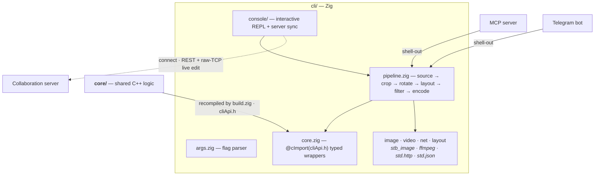

# Stencil — CLI (Zig)

A small command-line image tool that wraps Stencil's shared C++ core for quick, headless
image manipulation: load an image, video frame, or blank page, crop / rotate it, draw a
layout, apply a filter, and write the result. For the project overview see the
[repository README](../README.md).

```bash
stencil -i photo.jpg -c "x1=10% x2=90% y1=10% y2=90%" -r 1 out.png
stencil --blank 800 600 red --layout notes.json --filter sepia out
stencil -i clip.mp4 -f 24 frame.png
```

## Architecture



> **Surface diagrams:** [core](../core/README.md#architecture) · [server](../server/README.md#architecture) · [mcp](../mcp/README.md#architecture) · [bot](../bot/README.md#architecture) — or the whole-system view in the [repository README](../README.md#architecture). The [pipeline data-flow](#how-it-works)
> is detailed below.

## Dependencies

| Purpose | Tool | How it's provided |
|---|---|---|
| Build + language | **Zig 0.16** | the `zig` toolchain |
| Image decode/encode (PNG/JPEG/BMP/TGA) | **stb_image** | public-domain single-header C codecs, fetched on demand (pinned by content hash in `build.zig.zon`) and compiled from source — no native dependency |
| Shared geometry / crop / raster / filter | **`../core/`** | the C++ core, recompiled from source by `build.zig` and called over `../core/cliApi.h` |
| Video frame extraction | **ffmpeg** | optional system tool, shelled out only for video input; if it's not on `PATH` the CLI says so and everything else still works |

Zig ships its own clang, so building needs **no separate C/C++ toolchain**. URL inputs
(`http(s)://`) are fetched with Zig's standard-library HTTP client (`std.http`, native
TLS) — part of Zig, not an added dependency — so image and URL handling need **no system
tools at all**; only video does. The C++ core stays STL-only and codec-free: image codecs,
HTTP, video, and JSON all live in Zig.

## Layout

```
build.zig            # compiles ../core/*.cpp + cliApi.cpp + stb_impl.c, links libc++
build.zig.zon        # package manifest + the pinned stb_image dependency
src/
  main.zig           # entry: logo, parse args, run pipeline
  args.zig           # flag parser (+ --help text)
  logo.zig           # ANSI-coloured console logo (echoes browser/favicon.svg)
  pipeline.zig       # orchestration: source -> crop -> rotate -> layout -> filter -> encode
  console.zig        # interactive --console REPL: input loop + verb/action dispatch
  console/           # the REPL package, driven by console.zig:
    session.zig      #   working image + undo/redo snapshot stack
    commands.zig     #   command grammar (pure parsing: verbs, transforms, /blank, album)
    ui.zig           #   presentation: header, acks, prompt, help, /theme listing
    handlers.zig     #   command implementations over pipeline.zig's steps
    screen.zig       #   full-screen TUI: pinned logo header, scrollback, mouse (TTY only)
  line_edit.zig      # raw-mode line editor: Up/Down history, cursor keys, mouse (TTY only)
  theme.zig          # brand-accent palette (mirrors browser/desktop); drives /theme + logo colour
  clipboard.zig      # /paste + /copy clipboard image I/O (macOS via osascript)
  core.zig           # typed wrappers over the C++ core's extern "C" ABI (@cImport)
  image.zig          # stb_image decode/encode (RGBA8 <-> file formats)
  stb_impl.c         # the stb_image / stb_image_write implementation translation unit
  video.zig          # ffmpeg frame grab (to PNG on stdout)
  net.zig            # std.http(s) URL fetch (native TLS, no external tool)
  layout.zig         # std.json -> drawable lines
  project.zig        # .stencil project files: parse/build (image + layout + metadata in one file)
  project_cli.zig    # one-shot .stencil open/bundle (reuses the console Session for the layout)
test_root.zig        # test entry point (inline unit tests + the integration suite)
tests/
  *_test.zig         # integration tests (decode, crop, rotate, format, layout, e2e)
  fixtures/          # sample.png + layout.json used by the tests
```

`src/` is kept flat: it's a small, cohesive set of modules and that's the idiomatic
Zig layout.

> The Zig build recompiles the core sources directly (it does not link the CMake static
> library), so the file list in `build.zig` must stay in sync with `STENCIL_CORE_SOURCES`
> in `../core/CMakeLists.txt`.

## Build

```bash
# from this directory (cli/)
zig build                 # -> zig-out/bin/stencil
zig build run -- --help   # build and run with arguments
```

The first build fetches the `stb` headers (network required once; cached afterwards).

### Docker

A multi-stage [`Dockerfile`](Dockerfile) compiles the CLI (recompiling `core/`) and ships
a slim runtime image with `ffmpeg` for video input. Because `build.zig` pulls in `core/`,
**build from the repo root** and select the Dockerfile with `-f`:

```bash
# from the repo root
docker build -f cli/Dockerfile -t stencil-cli .

# mount a working directory for inputs/outputs (ENTRYPOINT is `stencil`)
docker run --rm -v "$PWD:/work" -w /work stencil-cli -i in.png -r 1 out.png
```

Override the toolchain with `--build-arg ZIG_VERSION=…` (and `ZIG_ARCH=aarch64` on
arm64); for a Zig dev/nightly build, set `--build-arg ZIG_URL=…` to the `ziglang.org/builds/`
tarball. The build fetches the `stb` dependency, so it needs network access.

## Usage

```
stencil [options] <output>
```

| Flag | Description |
|---|---|
| `-i, --input <path\|url>` | Image or video source (file or `http(s)://` URL) |
| `--blank [format] [w h] [color]` | Create a blank page; a leading page-format name (`a0`…`a10`, `b0`…`b10`, `c0`…`c10`, case-insensitive) **or** explicit `w h` picks the size (they are mutually exclusive; omit both for the default A4), color is a name or `#hex` (default white) |
| `-f, --frame <n>` | Video frame index to grab (default 0) |
| `-c, --crop "<spec>"` | Crop, e.g. `"x1=10% x2=90% y1=10% y2=90%"`. Each edge is a length token: `px`, `cm`, `mm`, `in`, `%`, or a bare pixel delta. Omit an edge to keep the image bound. |
| `--album` | When only one crop axis is given, derive the other from the page proportion (landscape) |
| `-r, --rotate <int>` | Rotate `int × 90°` (e.g. `-1` = −90°, `3` = 270°) |
| `-l, --layout <path\|url>` | Layout JSON to draw onto the image (same schema the browser exports) |
| `--filter <bw\|sepia\|invert\|contour\|color>` | Apply an image filter (`invert` = negative, `contour` = edge detection). A colour name/`#hex` makes a duotone tint. **Overrides** the layout's filter if both are present. |
| `--source-site <url>` | **Scrape mode:** fetch a page, extract + filter its media, and download the matches into `<output>` (a **directory**). See [Scraping a page](#scraping-a-page). Mutually exclusive with `-i`, `--blank`, `--server`. |
| `--source-count <n>` | Items per page/group in scrape mode (default `5`; `0` = all matches, `--group` ignored). |
| `--group <g>` | 0-based page index over the filtered list; window = `filtered[g*n : g*n+n]` (default 0). |
| `--source-filter <s>` | Category tokens, `\|`-joined: `img` \| `video` \| `background` \| `poster` (default `all`). |
| `--source-format <s>` | Format tokens, `\|`-joined, e.g. `png\|jpg\|webp\|mp4` (default `all`; unknown-ext items bucket as `etc`). |
| `--source-min-width` / `--source-max-width` / `--source-min-height` / `--source-max-height` `<px>` | Inclusive pixel bounds (`0` = unset); images are measured from a header sniff, unmeasured items pass. |
| `--console` | Start [interactive console mode](#console-mode) instead of running a one-shot pipeline. |
| `--console-full-screen` | Console in a [full-screen TUI](#console-mode): pinned logo header, scrollback (wheel/PgUp/PgDn), click the logo to change the theme. Implies `--console`; falls back to the plain editor on a too-small terminal. |
| `--server <url>` | Connect to a [collaboration server](../server/README.md); then `-i <name>` names a **server project** to fetch and edit. |
| `--remote-update` | With `--server`, write the result back into the fetched server project. |
| `--remote <url>` | Upload the result as a **new** project on a server (for a local/web input). |
| `--remote-name <name>` | Name for the `--remote` project (default: the input image's base name). A web input's URL is recorded as the project source. |
| `-h, --help` | Show help |
| `<output>` | Result path. A missing/unknown extension is filled in from the input format (`png`, `jpg`, `bmp`, `tga`). |

`--input` and `--blank` are mutually exclusive. URL inputs are fetched with Zig's built-in
HTTP client (no external tool); video input requires `ffmpeg` on `PATH`, and the CLI exits
with a clear message if it's missing.

**Server examples** (the result is always saved locally too):

```bash
# Upload a local image as a new shared project, after rotating it:
stencil -i photo.png -r 1 --remote http://host:8090 --remote-name "Shared" out.png

# Fetch a server project by name, apply a filter, and write the result back:
stencil --server http://host:8090 -i Shared --filter sepia --remote-update out.png
```

### Examples

```bash
# Centre-crop to 80% and rotate a quarter turn clockwise
stencil -i photo.jpg -c "x1=10% x2=90% y1=10% y2=90%" -r 1 out.png

# Blank red 800×600, draw a saved layout, tone it sepia (extension auto-filled -> out.png)
stencil --blank 800 600 red --layout notes.json --filter sepia out

# Default-size (A4 @ 96 dpi) blank in a custom colour
stencil --blank "#102030" page.png

# Blank on a named page format (B5 @ 96 dpi), pink
stencil --blank b5 pink page.png

# Grab the 24th frame of a video
stencil -i clip.mp4 -f 24 frame.png

# Crop a single axis and derive the other from the page proportion, landscape
stencil -i wide.png -c "x1=0 x2=1200px" --album out.png
```

### Project files (`.stencil`)

A `.stencil` file is one portable document bundling a whole project — the original image, the
layout (crop/rotation/filter/lines), and metadata — openable in every Stencil surface (see
`browser/README.md`). The CLI reads and writes it on either side of a one-shot, and via
`/open` / `/save` in `--console`:

```bash
# Render a project someone shared to a PNG (crop/rotation/filter/lines are applied for you)
stencil -i project.stencil out.png

# Bundle an image + edits into a portable project (prints "wrote out.stencil (project)")
stencil -i photo.jpg -c "x1=10% x2=90%" -r 1 --filter sepia out.stencil

# In the REPL: open a project, edit, save it back
stencil --console
> /open project.stencil
> rotate 1
> /save project.stencil
> /delete old.stencil        # delete a local .stencil file from disk (aliases: del / remove / rm)
```

`/delete <file.stencil>` removes a local `.stencil` file from disk (parity with the
browser/desktop trash button). It is scoped to `.stencil` paths — it won't delete other
files or URLs — and leaves the open session untouched.

### Scraping a page

`--source-site <url>` switches the CLI into **scrape mode**: it fetches the page over the
same guarded HTTP client (http(s) only; SSRF/redirect protections apply, plus a 64 MiB
per-response size cap). Loopback is allowed for the **user-named page URL** (dev/fixture
servers), but a media **sub-resource** URL harvested from the page can reach loopback/internal
only when it is on that same host — a public page pointing at `http://127.0.0.1/…` (a
different internal host) is refused. It hand-parses the HTML — `` (with lazy-attr /
`srcset` fallbacks),
inline `<svg><image>`, `<video>` + its `poster`, `<picture><source src>`, and CSS
`background-image: url(...)` from inline `style=` and `<style>` blocks — then filters and
downloads the matches into `<output>` (a **directory**, created if missing; default `.`). It
is adapter-only: no `core/` involvement. The semantics mirror the Chrome extension's image
scanner, adapted for static HTML.

Filtering runs **category → format → dimension**. Dimension bounds are inclusive and apply to
images, whose pixel size is read from a header sniff (PNG/JPEG/GIF/BMP/WebP); videos and any
unmeasured item pass the size filter. Results are paged by `--source-count` (default `5`;
`0` = all matches): `--group g` selects `filtered[g*n : g*n+n]`.

Output goes to stderr, one line per file plus a summary:

```
wrote out/logo.png (200x80 px · source example.com)     # image (measured)
wrote out/clip.mp4 (source example.com)                 # video / unmeasured
scraped 2 file(s) from example.com into out
```

A per-item fetch failure prints `error: could not fetch {url} ({reason})` and the run
continues; zero matches is a hard error (`error: no media matched at {url}`, exit 1). The line
grammar is pinned by `testdata/scrape_fixtures.json` and documented in `CONTRACT.md` §3.

```bash
# Download every image at least 200px wide into ./shots/
stencil --source-site https://example.com --source-filter img --source-min-width 200 shots/

# Just the PNGs and JPEGs, first page of 10
stencil --source-site https://example.com --source-format png|jpg --source-count 10 out/
```

In the console, `/source-upload <url> [index] [format] [name=<label>] [minW] [maxW] [minH] [maxH]`
(alias `/scrape`) scrapes a page and loads its *index*-th image-category match as the working
image (`-1` for any bound = unset). An optional `name=<label>` token (allowed anywhere after the
URL) overrides the URL-derived project label.

## Console mode

`stencil --console` (alias `--repl`) skips the one-shot pipeline and instead reads
`/command <args>` lines from stdin, applying each to a single **in-memory working image**.
Every edit is snapshotted, so `/undo`, `/redo` and `/reset` walk a full history. It's handy
for interactively trying a few crops/filters, or for scripting a session by piping commands
in — it reuses the exact same `core/` transforms as the flag pipeline, so results are identical.

```
stencil --console
```

The leading `/` is optional (`crop ...` ≡ `/crop ...`). On a TTY you also get raw-mode line
editing: **Tab** completes the command word, **Up/Down** recall the last 50 commands,
Left/Right/Home/End/Backspace edit the line, and **Ctrl-A/E** jump to line start/end. Word
motion and deletion work too: **Alt/Option + ←/→** (or **Alt-b/f**) move by word, **Ctrl-W** /
**Alt-Backspace** delete the word before the cursor, **Alt-d** deletes the word ahead, **Ctrl-U**
clears the line and **Ctrl-K** kills to end.

> **macOS: enabling the modifier keys.** The word-motion chords only work if your terminal
> actually *sends* them — by default macOS Terminal.app swallows **Option+arrow** and never
> passes **⌘+arrow** to any app. Turn them on once: **Terminal.app** → Settings → Profiles →
> Keyboard → check *Use Option as Meta key* (gives you Option+←/→ and Option-Delete);
> **iTerm2** → Settings → Profiles → Keys → Key Mappings → Presets → *Natural Text Editing*
> (also maps ⌘+←/→ to line start/end and ⌘/Option-Delete). ⌘+arrow can't be delivered to a
> program in Terminal.app at all — use iTerm2's preset, or the portable **Ctrl-A/E** (line
> start/end) and **Ctrl-W** (delete word) which need no configuration and work in every terminal
> and OS. **Ctrl-S** copies the current mouse text-selection to
the clipboard (full-screen mode). Multi-line **pastes** are bracketed, so they land in the input
as a single editable line (newlines become spaces) and nothing runs until you press Enter; a line
wider than the window scrolls horizontally to keep the cursor visible. The prompt + leading `/command` token render in the brand accent. Two clipboard chords
work mid-prompt: **Ctrl-Alt-V** pastes an
image from the clipboard as the working image, and **Ctrl-Alt-C** copies the current image to
the clipboard. (These arrive as a Meta/ESC prefix, so on macOS the terminal's Option key must
be set to send Meta/Esc+ — Terminal.app: *Use Option as Meta key*; iTerm2: Option key → *Esc+*.
Otherwise use the `/copy` and `/paste` commands.) To leave, press **Ctrl-C** twice (or use
`/exit` / **Ctrl-D**) — the first press arms the exit, so any other key cancels it.

`stencil --console-full-screen` runs it as a **full-screen TUI**: the logo banner is pinned as
a fixed header at the top, output flows just beneath it with a strong accent-coloured rule and
the terse `>` prompt floating right below the last line, and each command you run is echoed
above its output so it's clear what produced what. Older output stays in a scrollback you can
page back through (**mouse wheel**, **PgUp** / **PgDn**). Mouse reporting is on, so — mirroring
the browser app's clickable logo — a **click on the pinned logo cycles the accent colour**
through the presets (wrapping), and a **double-click sets a random custom colour** outside the
preset list (a short debounce distinguishes the two). Either way the logo plays a
`S T E N C I L` colour-wave, everything tinted in the accent (logo, rule, prompt,
**and previously-printed output**) recolours, and there's no confirmation line — the recolour is
the feedback. **Dragging over output selects text** — the selection is drawn as a translucent
wash of the live theme colour and stays highlighted after you release. Nothing is copied
automatically; press **Ctrl-S** to copy the highlighted text to the clipboard (on macOS the
system's ⌘C can't reach the app while mouse tracking is on, so Ctrl-S is the copy key), then
paste it anywhere with ⌘V. Prefer the terminal's own selection? Run `/mouse off` to hand the
mouse fully back for native select + copy. If the terminal is too short or its
size can't be read, it falls back to the plain line-oriented editor; `NO_COLOR` keeps
full-screen but renders it monochrome. Plain `--console` stays line-oriented (banner printed
inline, scrolling via the terminal's own scrollback).

| Command | Effect |
|---|---|
| `/upload <path\|url>` | Load an image (or video frame) as the working image (TTY: asks for a yes/no confirmation first). Aliases: `open`, `load`. |
| `/source-upload <url> [index] [format] [name=<label>] [minW] [maxW] [minH] [maxH]` | Scrape a page and load its *index*-th image-category match (img / background / poster) as the working image, after applying the format + inclusive dimension filters (`-1` for any bound = unset; `format` `all` = any). `name=<label>` overrides the URL-derived label. TTY: asks before replacing an existing image. Alias: `scrape`. |
| `/paste` | Load an image from the clipboard (macOS, via `osascript`). Also bound to **Ctrl-Alt-V**. |
| `/blank [format] [w h] [color]` | Create a blank page (default: the picked page format — see `/format` — else A4, @ 96 dpi, white). A leading page-format name picks the page (`/blank b5 pink`); a format and explicit `w h` are mutually exclusive (explicit dims size the blank and keep the current `/format` pick). Alias: `new`. |
| `/format [name\|custom w h]` | A **bare** `/format` lists every page format (`A0`…`C10`) with its cm size, current marked; a name (case-insensitive, e.g. `/format b5`) picks the session's page format, and `custom <w> <h>` sets explicit cm dims. The pick shows in the image header, is written into saved/synced layouts (`pageSize`), and sets the `/blank` default page. Alias: `formats`. |
| `/apply <file.json>` | Draw a layout JSON onto the image. Alias: `draw`. |
| `/crop <spec> [album]` | Crop, e.g. `x1=10% x2=90% y1=10% y2=90%` (add `album` to derive the missing axis). A **bare** `/crop` prints the spec vocabulary + an example (it never silently crops). |
| `/rotate <int>` | Rotate `int × 90°` (e.g. `-1`, `2`, `3`); a **bare** `/rotate` lists the variants. Aliases: `rot`, `turn`. |
| `/filter <mode>` | `bw` \| `sepia` \| `invert` \| `contour` \| `none` \| a colour name/`#hex` (duotone tint). A **bare** `/filter` lists the modes. Shorthands: `/bw`, `/sepia`, `/invert`, `/contour`, `/tint <color>`. |
| `/exec <action> ...` | Run a transform by name (`crop` \| `rotate` \| `filter` \| `apply`); a **bare** `/exec` lists the action words. Aliases: `do`, `run`. |
| `/undo` `/redo` | Step back / forward through edits. Aliases: `u`, `r`. |
| `/reset` | Revert to the original, dropping all edits. Alias: `revert`. |
| `/save [path]` | Encode + write the working image to a file (extension filled in if omitted). A **bare** `/save` (no path) pushes the current result to the active server project — the manual counterpart to `/sync`, so you can update the server image on demand when sync is off. Alias: `write`. |
| `/layout [path]` | **Export** the current structured layout JSON (lines + filter + crop + rotation) to a local file — distinct from `/apply`, which *draws* a layout onto the image. A `path` ending in `.json` (case-insensitive) is written verbatim; a non-`.json` `path` is treated as a directory/prefix and gets `<path>/<project>.json` (a trailing `/` is not doubled); a **bare** `/layout` writes `<project>.json` in the cwd. `project` is the working image's base name (its file name minus the extension), falling back to `layout`. Aliases: `savelayout`, `exportlayout`. |
| `/connect <url[ url2 …]>` | Connect to one or more [collaboration servers](../server/README.md) for the session. |
| `/connections` | List the connected servers, each with a live reachability status (`[connected]`, `[unreachable]`, or `[auth expired — /reconnect]` from a quick probe) and a marker for the active project's server. Alias: `servers`. |
| `/projects [url]` | List a server's projects as an aligned table (`NAME` / `SIZE` / `CHANGED`, plus a `SERVER` column when listing across more than one server). With no URL it lists **every** connected server's projects; with a URL, just that one. Projects with no stored dimensions show `-` for size. Each project's `NAME` is printed in its own per-project colour (set with `/project-color`), falling back to the theme accent when unset. Open one with `/fetch <name>`. Alias: `ls`. |
| `/disconnect [url]` | Close one connection, or the most recently opened when omitted. |
| `/reconnect [url]` | Re-establish one connection by URL, or **all** of them when omitted: re-issue the auth token and, for the active project's server while syncing, revive the live edit-events feed (the one socket that goes stale when the server bounces or the connection drops). Alias: `refresh`. |
| `/fetch <name> [url]` | Load a server project's image to keep editing (give a URL when more than one server is connected); a stored **filter** (b&w/sepia/invert/contour/tint) is re-applied on load. A **bare** `/fetch` renders the projects table (what there is to fetch) + a usage hint. Alias: `pull`. |
| `/sync [on\|off]` | **Live-editing mode** for the active fetched project (off by default); a bare `/sync` with no argument toggles it. When on it works in both directions: your edits auto-upload the result (debounced — a burst of edits coalesces into one upload, flushed once the input settles), **and** a live feed over the server's raw-TCP edit channel (REST port + 1, e.g. `8091`) **auto-pulls** a peer's change into your working image the moment they save (it replaces the working image and resets the undo history to that point, showing `↺ pulled "…" from the server (changed 5s ago)`). If you have your own unsynced local edits when a peer's change arrives, it does **not** clobber them — you get `↺ "…" changed on the server (… ago) — you have local edits; '/save' to push yours or '/fetch' to take theirs`. The feed is plaintext, so it is skipped for `https://` servers (whose edit channel is TLS-wrapped) — REST sync still works over TLS. Use a bare `/save` to push manually when sync is off, and `/reconnect` to revive the feed after a drop. Beyond uploading the rendered `result`, a sync **also writes the image filter into the project layout** (`imageFilter`/`filterColor`, preserving any peer's lines + geometry), so a `/filter bw\|sepia\|invert\|contour\|tint` shows live in open browser/desktop editors (which render `original` + layout). *(Syncing the CLI's own `/crop`, `/rotate` and `/apply` line drawings as structured layout is not yet implemented — those still bake into the `result` only.)* |
| `/copy` | Copy the current image to the clipboard (macOS). Also bound to **Ctrl-Alt-C** (paste is **Ctrl-Alt-V**). |
| `/status` | Show the working image (path, size, edit position). Aliases: `info`, `image`. |
| `/project-color [#hex\|name\|clear]` | Get or set the **active fetched project's** accent colour — the colour its NAME is painted in (here in the `/projects` table, and across the browser/desktop editors). With no argument, prints the current colour rendered in that colour; with a value (`#ff5623`, a CSS colour name, validated via the core colour parser) sets it and pushes the change to the server (LWW-guarded, so it syncs to every client with the project open); `clear`/`none`/`default` resets it to the neutral grey. Needs an active server project (`/fetch` first). |
| `/theme [name\|#hex]` | List the accent colours, or switch: a preset name, `default` (violet), or any colour like `#ff5623`. Also repaints the logo. In full-screen mode you can also **click the pinned logo** to cycle presets, or **double-click** it for a random custom colour. |
| `/mouse [on\|off]` | Full-screen only (a bare `/mouse` toggles): turn mouse reporting off to select/copy terminal text, or on to re-enable logo clicks + wheel scrolling. |
| `/clear` | Clear the scrollback (full-screen) or the screen, and redraw the image header. Alias: `cls`. |
| `/drop` | Forget the working image entirely. Aliases: `close`, `forget`. |
| `/help` | List the commands. Aliases: `?`, `h`. |
| `/exit` | Leave console mode. Aliases: `quit`, `q`, **Ctrl-D**, or **Ctrl-C** pressed twice. |

`/apply` is **layout-only** now — crop/rotate/filter are their own commands (or `/exec`). The
image identity is shown as a header just under the logo, refreshed on `/clear`, `/theme` and
after a source change; per-edit feedback is a concise `cropped -> WxH [n/m]` line. A
**URL / blank / clipboard** source lives only in memory: its buffers are freed when another
image is loaded, on `/drop`, or when the session ends. Prompts and messages go to **stderr**
(the CLI's human channel), so a `/save` to stdout-adjacent tooling stays clean. Unknown
commands and failed steps print an error and keep the session running.

```bash
# Script a session by piping commands in (no TTY → plain reader, no line editing)
printf '/upload photo.png\n/crop x1=10%% x2=90%% y1=10%% y2=90%%\n/rotate 1\n/sepia\n/save out.png\n/exit\n' \
  | stencil --console
```

## How it works

```
cli (Zig)  decode file/URL/video-frame ─► RGBA8 buffer
           std.json ─► layout lines / filter
           @cImport(core/cliApi.h) ─► C++ core: crop · rotate · blank · rasterise · filter
           stb_image_write ─► encode ─► output file
```

The C++ core does every pixel/geometry transform (so behaviour matches the browser and
desktop apps by construction); Zig owns all I/O, codecs, video, and JSON. The crop string,
length tokens, album derivation, named-colour parsing, and the line rasteriser are
implemented once in `../core/` and exercised by both this CLI and the core's Doctest suite.

## Test

```bash
zig build test --summary all
```

Two layers run together:

- **Inline unit tests** (in `src/*.zig`) — argument parsing, the C-ABI bridge (colour,
  crop, rotate, fill, filter), codec round-trips, layout JSON parsing, video/URL detection,
  and console-mode command parsing (`parseCommand` / `parseAction` / `parseBlank`).
- **Integration tests** (`tests/*_test.zig`, using `tests/fixtures/`) — decode the PNG
  fixture, crop/rotate it, round-trip every output format, rasterise the layout fixture,
  a full **end-to-end** `pipeline.run` (file in → crop + rotate + layout + filter override
  → file out) that reads the result back and checks its dimensions, and a console-mode
  session driven through `console.handle` (upload → crop → rotate → filter → save → reset).

The core's own geometry/crop/raster logic is additionally covered by its Doctest suite
(`../core`).

### Full-screen TUI smoke check

The raw-mode `--console-full-screen` renderer only runs on a real terminal, so it can't be
covered by `zig build test` (which never enters raw mode). `scripts/tui_smoke.py` (stdlib
Python, macOS/Linux) drives the built binary over a pseudo-terminal and asserts on the escape
stream it emits — alt-screen entry, the pinned header, mouse reporting, the accent rule, a
theme cycle from a synthetic logo click, and a clean teardown:

```bash
zig build && python3 scripts/tui_smoke.py    # or: python3 scripts/tui_smoke.py path/to/stencil
```

It is **not** wired into CI — it's timing-dependent (the deferred single-click and the logo
flourish are clock-paced) — so run it manually when touching `console/screen.zig` or
`line_edit.zig`.

### Benchmark

An opt-in perf benchmark times the pipeline stages (crop → rotate → layout → filter →
contour → encode) on a large synthetic image. It is **not** part of `zig build test`, so
CI never gates on a timing number — it just prints throughput:

```bash
zig build bench                  # default 4000x3000, 3000 lines
zig build bench -- 6000 4000 8000    # width height line-count
```

It's the adapter-level counterpart to the core's own micro-benchmarks
(`../core/build/stencil_tests -ts=bench --no-skip`); watch for order-of-magnitude drift
release-over-release rather than exact milliseconds. See `src/bench.zig`.
