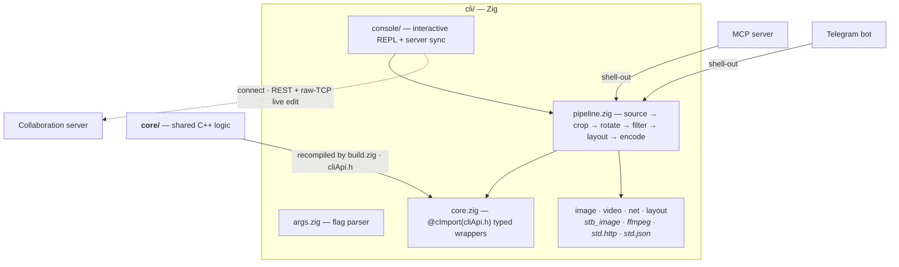

# Stencil — CLI (Zig)

A small command-line image tool that wraps Stencil's shared C++ core for quick, headless
image manipulation: load an image, video frame, or blank page, crop / rotate it, draw a
layout, apply a filter, and write the result. For the project overview see the
[repository README](../README.md).

```bash
stencil -i photo.jpg -c "x1=10% x2=90% y1=10% y2=90%" -r 1 out.png
stencil --blank 800 600 red --layout notes.json --filter sepia out
stencil -i clip.mp4 -f 24 frame.png
```

## Architecture


```mermaid
graph TD
    CORE["<b>core/</b> — shared C++ logic"]
    subgraph CLIP["cli/ — Zig"]
      ARGS["args.zig — flag parser"]
      PIPE["pipeline.zig — source → crop → rotate → filter → layout → encode"]
      COREZ["core.zig — @cImport(cliApi.h) typed wrappers"]
      IO["image · video · net · layout<br/><i>stb_image · ffmpeg · std.http · std.json</i>"]
      REPL["console/ — interactive REPL + server sync"]
    end
    SRV["Collaboration server"]
    MCP["MCP server"]
    BOT["Telegram bot"]

    CORE -->|"recompiled by build.zig · cliApi.h"| COREZ
    PIPE --> COREZ
    PIPE --> IO
    REPL --> PIPE
    REPL -.->|"connect · REST + raw-TCP live edit"| SRV
    MCP -->|"shell-out"| PIPE
    BOT -->|"shell-out"| PIPE
```

> **Surface diagrams:** [core](../core/README.md#architecture) · [server](../server/README.md#architecture) · [mcp](../mcp/README.md#architecture) · [bot](../bot/README.md#architecture) — or the whole-system view in the [repository README](../README.md#architecture). The [pipeline data-flow](#how-it-works)
> is detailed below.

## Dependencies

| Purpose | Tool | How it's provided |
|---|---|---|
| Build + language | **Zig 0.16** | the `zig` toolchain |
| Image decode/encode (PNG/JPEG/BMP/TGA) | **stb_image** | public-domain single-header C codecs, fetched on demand (pinned by content hash in `build.zig.zon`) and compiled from source — no native dependency |
| Shared geometry / crop / raster / filter | **`../core/`** | the C++ core, recompiled from source by `build.zig` and called over `../core/cliApi.h` |
| Video frame extraction | **ffmpeg** | optional system tool, shelled out only for video input; if it's not on `PATH` the CLI says so and everything else still works |

Zig ships its own clang, so building needs **no separate C/C++ toolchain**. URL inputs
(`http(s)://`) are fetched with Zig's standard-library HTTP client (`std.http`, native
TLS) — part of Zig, not an added dependency — so image and URL handling need **no system
tools at all**; only video does. The C++ core stays STL-only and codec-free: image codecs,
HTTP, video, and JSON all live in Zig.

## Layout

```
build.zig            # compiles ../core/*.cpp + cliApi.cpp + stb_impl.c, links libc++
build.zig.zon        # package manifest + the pinned stb_image dependency
src/
  main.zig           # entry: logo, parse args, run pipeline
  args.zig           # flag parser (+ --help text)
  logo.zig           # ANSI-coloured console logo (echoes browser/favicon.svg)
  pipeline.zig       # orchestration: source -> crop -> rotate -> layout -> filter -> encode
  console.zig        # interactive --console REPL: input loop + verb/action dispatch
  console/           # the REPL package, driven by console.zig:
    session.zig      #   working image + undo/redo snapshot stack
    commands.zig     #   command grammar (pure parsing: verbs, transforms, /blank, album)
    ui.zig           #   presentation: header, acks, prompt, help, /theme listing
    handlers.zig     #   command implementations over pipeline.zig's steps
    screen.zig       #   full-screen TUI: pinned logo header, scrollback, mouse (TTY only)
  line_edit.zig      # raw-mode line editor: history, cursor keys, mouse, pasted-image markers (TTY only)
  theme.zig          # brand-accent palette (mirrors browser/desktop); drives /theme + logo colour
  clipboard.zig      # /paste + /copy clipboard image I/O (macOS osascript · Linux wl-paste/xclip · Windows PowerShell)
  core.zig           # typed wrappers over the C++ core's extern "C" ABI (@cImport)
  image.zig          # stb_image decode/encode (RGBA8 <-> file formats)
  stb_impl.c         # the stb_image / stb_image_write implementation translation unit
  video.zig          # ffmpeg frame grab (to PNG on stdout)
  net.zig            # std.http(s) URL fetch (native TLS, no external tool)
  layout.zig         # std.json -> drawable lines
  project.zig        # .stencil project files: parse/build (image + layout + metadata in one file)
  project_cli.zig    # one-shot .stencil open/bundle (reuses the console Session for the layout)
test_root.zig        # test entry point (inline unit tests + the integration suite)
tests/
  *_test.zig         # integration tests (decode, crop, rotate, format, layout, e2e)
  fixtures/          # sample.png + layout.json used by the tests
```

`src/` is kept flat: it's a small, cohesive set of modules and that's the idiomatic
Zig layout.

> The Zig build recompiles the core sources directly (it does not link the CMake static
> library), so the file list in `build.zig` must stay in sync with `STENCIL_CORE_SOURCES`
> in `../core/CMakeLists.txt`.

## Build

```bash
# from this directory (cli/)
zig build                 # -> zig-out/bin/stencil
zig build run -- --help   # build and run with arguments
```

The first build fetches the `stb` headers (network required once; cached afterwards).

### Docker

A multi-stage [`Dockerfile`](Dockerfile) compiles the CLI (recompiling `core/`) and ships
a slim runtime image with `ffmpeg` for video input. Because `build.zig` pulls in `core/`,
**build from the repo root** and select the Dockerfile with `-f`:

```bash
# from the repo root
docker build -f cli/Dockerfile -t stencil-cli .

# mount a working directory for inputs/outputs (ENTRYPOINT is `stencil`)
docker run --rm -v "$PWD:/work" -w /work stencil-cli -i in.png -r 1 out.png
```

Override the toolchain with `--build-arg ZIG_VERSION=…` (and `ZIG_ARCH=aarch64` on
arm64); for a Zig dev/nightly build, set `--build-arg ZIG_URL=…` to the `ziglang.org/builds/`
tarball. The build fetches the `stb` dependency, so it needs network access.

## Usage

```
stencil [options] <output>
```

| Flag | Description |
|---|---|
| `-i, --input <path\|url>` | Image or video source (file or `http(s)://` URL) |
| `--blank [format] [w h] [color]` | Create a blank page; a leading page-format name (`a0`…`a10`, `b0`…`b10`, `c0`…`c10`, case-insensitive) **or** explicit `w h` picks the size (they are mutually exclusive; omit both for the default A4), color is a name or `#hex` (default white) |
| `-f, --frame <n>` | Video frame index to grab (default 0) |
| `-c, --crop "<spec>"` | Crop, e.g. `"x1=10% x2=90% y1=10% y2=90%"`. Each edge is a length token: `px`, `cm`, `mm`, `in`, `%`, or a bare pixel delta. Omit an edge to keep the image bound. |
| `--album` | When only one crop axis is given, derive the other from the page proportion (landscape) |
| `-r, --rotate <int>` | Rotate `int × 90°` (e.g. `-1` = −90°, `3` = 270°) |
| `-l, --layout <path\|url>` | Layout JSON to draw onto the image (same schema the browser exports) |
| `--filter <bw\|sepia\|invert\|contour\|color>` | Apply an image filter (`invert` = negative, `contour` = edge detection). A colour name/`#hex` makes a duotone tint. **Overrides** the layout's filter if both are present. |
| `--source-site <url>` | **Scrape mode:** fetch a page, extract + filter its media, and download the matches into `<output>` (a **directory**). See [Scraping a page](#scraping-a-page). Mutually exclusive with `-i`, `--blank`, `--server`. |
| `--source-count <n>` | Items per page/group in scrape mode (default `5`; `0` = all matches, `--group` ignored). |
| `--group <g>` | 0-based page index over the filtered list; window = `filtered[g*n : g*n+n]` (default 0). |
| `--source-filter <s>` | Category tokens, `\|`-joined: `img` \| `video` \| `background` \| `poster` (default `all`). |
| `--source-format <s>` | Format tokens, `\|`-joined, e.g. `png\|jpg\|webp\|mp4` (default `all`; unknown-ext items bucket as `etc`). |
| `--source-min-width` / `--source-max-width` / `--source-min-height` / `--source-max-height` `<px>` | Inclusive pixel bounds (`0` = unset); images are measured from a header sniff, unmeasured items pass. |
| `--console` | Start [interactive console mode](#console-mode) instead of running a one-shot pipeline. |
| `--console-full-screen` | Console in a [full-screen TUI](#console-mode): pinned logo header, scrollback (wheel/PgUp/PgDn), click the logo to change the theme. Implies `--console`; falls back to the plain editor on a too-small terminal. |
| `--server <url>` | Connect to a [collaboration server](../server/README.md); then `-i <name>` names a **server project** to fetch and edit. |
| `--remote-update` | With `--server`, write the result back into the fetched server project. |
| `--remote <url>` | Upload the result as a **new** project on a server (for a local/web input). |
| `--remote-name <name>` | Name for the `--remote` project (default: the input image's base name). A web input's URL is recorded as the project source. |
| `--token <tok>` | Access token for `--server` / `--remote` — needed when the server gates token minting (`ADMIN_TOKEN`). Takes a **session token** or the **admin token** itself (a session is minted from it automatically); without it the CLI self-issues a session, which open servers allow. |
| `-h, --help` | Show help |
| `<output>` | Result path. A missing/unknown extension is filled in from the input format (`png`, `jpg`, `bmp`, `tga`). |

`--input` and `--blank` are mutually exclusive. URL inputs are fetched with Zig's built-in
HTTP client (no external tool); video input requires `ffmpeg` on `PATH`, and the CLI exits
with a clear message if it's missing.

**Server examples** (the result is always saved locally too):

```bash
# Upload a local image as a new shared project, after rotating it:
stencil -i photo.png -r 1 --remote http://host:8090 --remote-name "Shared" out.png

# Fetch a server project by name, apply a filter, and write the result back:
stencil --server http://host:8090 -i Shared --filter sepia --remote-update out.png

# An admin-gated server (ADMIN_TOKEN set) needs --token (session or admin token):
stencil -i photo.png --remote https://host:8090 --token <tok> --remote-name "Shared" out.png
```

### Examples

```bash
# Centre-crop to 80% and rotate a quarter turn clockwise
stencil -i photo.jpg -c "x1=10% x2=90% y1=10% y2=90%" -r 1 out.png

# Blank red 800×600, draw a saved layout, tone it sepia (extension auto-filled -> out.png)
stencil --blank 800 600 red --layout notes.json --filter sepia out

# Default-size (A4 @ 96 dpi) blank in a custom colour
stencil --blank "#102030" page.png

# Blank on a named page format (B5 @ 96 dpi), pink
stencil --blank b5 pink page.png

# Grab the 24th frame of a video
stencil -i clip.mp4 -f 24 frame.png

# Crop a single axis and derive the other from the page proportion, landscape
stencil -i wide.png -c "x1=0 x2=1200px" --album out.png
```

### Project files (`.stencil`)

A `.stencil` file is one portable document bundling a whole project — the original image, the
layout (crop/rotation/filter/lines), and metadata — openable in every Stencil surface (see
`browser/README.md`). The CLI reads and writes it on either side of a one-shot, and via
`/open` / `/save` in `--console`:

```bash
# Render a project someone shared to a PNG (crop/rotation/filter/lines are applied for you)
stencil -i project.stencil out.png

# Bundle an image + edits into a portable project (prints "wrote out.stencil (project)")
stencil -i photo.jpg -c "x1=10% x2=90%" -r 1 --filter sepia out.stencil

# In the REPL: open a project, edit, save it back
stencil --console
> /open project.stencil
> rotate 1
> /save project.stencil
> /delete old.stencil        # delete a local .stencil file from disk (aliases: del / remove / rm)
```

`/delete <file.stencil>` removes a local `.stencil` file from disk (parity with the
browser/desktop trash button). It is scoped to `.stencil` paths — it won't delete other
files or URLs — and leaves the open session untouched.

### Scraping a page

`--source-site <url>` switches the CLI into **scrape mode**: it fetches the page over the
same guarded HTTP client (http(s) only; SSRF/redirect protections apply, plus a 64 MiB
per-response size cap). Loopback is allowed for the **user-named page URL** (dev/fixture
servers), but a media **sub-resource** URL harvested from the page can reach loopback/internal
only when it is on that same host — a public page pointing at `http://127.0.0.1/…` (a
different internal host) is refused. It hand-parses the HTML — `` (with lazy-attr /
`srcset` fallbacks),
inline `<svg><image>`, `<video>` + its `poster`, `<picture><source src>`, and CSS
`background-image: url(...)` from inline `style=` and `<style>` blocks — then filters and
downloads the matches into `<output>` (a **directory**, created if missing; default `.`). It
is adapter-only: no `core/` involvement. The semantics mirror the Chrome extension's image
scanner, adapted for static HTML.

Filtering runs **category → format → dimension**. Dimension bounds are inclusive and apply to
images, whose pixel size is read from a header sniff (PNG/JPEG/GIF/BMP/WebP); videos and any
unmeasured item pass the size filter. Results are paged by `--source-count` (default `5`;
`0` = all matches): `--group g` selects `filtered[g*n : g*n+n]`.

Output goes to stderr, one line per file plus a summary:

```
wrote out/logo.png (200x80 px · source example.com)     # image (measured)
wrote out/clip.mp4 (source example.com)                 # video / unmeasured
scraped 2 file(s) from example.com into out
```

A per-item fetch failure prints `error: could not fetch {url} ({reason})` and the run
continues; zero matches is a hard error (`error: no media matched at {url}`, exit 1). The line
grammar is pinned by `testdata/scrape_fixtures.json` and documented in `CONTRACT.md` §3.

```bash
# Download every image at least 200px wide into ./shots/
stencil --source-site https://example.com --source-filter img --source-min-width 200 shots/

# Just the PNGs and JPEGs, first page of 10
stencil --source-site https://example.com --source-format png|jpg --source-count 10 out/
```

In the console, `/source-upload <url> [index] [format] [name=<label>] [minW] [maxW] [minH] [maxH]`
(alias `/scrape`) scrapes a page and loads its *index*-th image-category match as the working
image (`-1` for any bound = unset). An optional `name=<label>` token (allowed anywhere after the
URL) overrides the URL-derived project label.

## Console mode

`stencil --console` (alias `--repl`) skips the one-shot pipeline and instead reads
`/command <args>` lines from stdin, applying each to a single **in-memory working image**.
Every edit is snapshotted, so `/undo`, `/redo` and `/reset` walk a full history. It's handy
for interactively trying a few crops/filters, or for scripting a session by piping commands
in — it reuses the exact same `core/` transforms as the flag pipeline, so results are identical.

```
stencil --console
```

The leading `/` is optional (`crop ...` ≡ `/crop ...`). On a TTY you also get raw-mode line
editing: **Tab** completes the command word, **Up/Down** recall the last 50 commands — but
when the line you are typing has wrapped onto several rows they first walk **between those
rows**, keeping the screen column, and only recall once the cursor is on the top (Up) or
bottom (Down) row — Left/Right/Home/End/Backspace edit the line, and **Ctrl-A/E** jump to line start/end. Word
motion and deletion work too: **Alt/Option + ←/→** (or **Alt-b/f**) move by word, **Ctrl-W** /
**Alt-Backspace** / **Ctrl-Backspace** delete the word before the cursor, **Alt-d** / **Alt-** or
**Ctrl-Delete** delete the word ahead, **Ctrl-U** clears the line and **Ctrl-K** kills to end.
Every encoding a terminal uses for those is accepted — the bare control byte (`^W`, `^H`), the
Meta form (`ESC DEL`), the parameterised CSI (`ESC [ 3;5~`, i.e. Ctrl-Delete) and the CSI-u form
xterm's *modifyOtherKeys* and the kitty protocol report modified keys with (`ESC [ 127;5u`) — so
Ctrl/Alt+Backspace and Ctrl/Alt+Delete kill a word on macOS, Windows and Linux alike. `^H` is
read as Ctrl-Backspace **unless** the tty's own erase key is `^H` (termios `VERASE`), where it
stays a plain one-character backspace.

> **macOS: enabling the modifier keys.** The word-motion chords only work if your terminal
> actually *sends* them — by default macOS Terminal.app swallows **Option+arrow** and never
> passes **⌘+arrow** to any app. Turn them on once: **Terminal.app** → Settings → Profiles →
> Keyboard → check *Use Option as Meta key* (gives you Option+←/→ and Option-Delete);
> **iTerm2** → Settings → Profiles → Keys → Key Mappings → Presets → *Natural Text Editing*
> (also maps ⌘+←/→ to line start/end and ⌘/Option-Delete). ⌘+arrow can't be delivered to a
> program in Terminal.app at all — use iTerm2's preset, or the portable **Ctrl-A/E** (line
> start/end) and **Ctrl-W** (delete word) which need no configuration and work in every terminal
> and OS. **Ctrl-S** copies the current mouse text-selection to
the clipboard (full-screen mode). Multi-line **pastes** are bracketed, so they land in the input
as a single editable line (newlines become spaces) and nothing runs until you press Enter; a line
wider than the window **wraps onto as many rows as it needs** — the input block grows upward into
the output (capped at 8 rows / half the window, after which it scrolls by rows), so a long prompt
stays readable before you send it, and long output lines wrap in the scrollback rather than being
cut off at the right edge. The prompt + leading `/command` token render in the brand accent.

**Ctrl-V pastes the clipboard onto the line you are typing** — a picture *attaches*, plain text is
simply typed in (it is the paste key; refusing what was copied because it is not a picture helps
nobody). An attached image works the way Claude Code's CLI does it: the picture is held against that line and shown inline as an `[Image #1 <name>]` marker,
so you keep writing around it — `/prompt what changed between [Image #1 before.png] and
[Image #2 after.png]?`. How many a line may carry depends on what it is: a **`/prompt`** (or a
line with no command word yet) takes up to **3**, a **`/upload`** exactly **1** — it loads a
single picture, so a second would quietly change what Enter does. Either way the one over the
cap is refused with a note, never silently dropped. **Backspace** or **Delete** over a marker takes that whole picture back —
the marker is one thing on screen, so it is one thing to delete — **Ctrl-Z** removes the last
one, and Ctrl-U / Ctrl-C drop them all. Nothing is loaded until you press **Enter**, which turns
each marker into an upload, in marker order: they become this turn's `/images` attachments (§2.1),
the last of them the working image. A line of *nothing but* images — or a bare `/upload` — **is**
the upload and runs nothing else; any other command (a `/prompt`, say) then runs with them
attached. A bare **`/upload`** with no path also takes the clipboard's picture, so a copied
screenshot needs no path typed at all. **Ctrl-Alt-C** copies the current image back out, and
**Ctrl-Z** with no marker left in the line is the session's `/unpaste`.

**The system paste (⌘V / Ctrl-Shift-V) is picked up too.** It belongs to the terminal and carries
TEXT, so with only a picture copied it delivers an *empty* paste — and an empty paste is exactly
the signal that the clipboard holds something the terminal could not hand over, so the console
reads the image off the clipboard itself, same as Ctrl-V. When the paste instead carries the
**path of an image file** (what a file manager puts on the clipboard) that path is taken as an
image, quotes and `\ ` escapes and all — under `/prompt`, `/upload`, or a line with no command
word yet. Pasted into anything else — `/save …` — a path is still just a path, and real pasted
text is always just text.

(Plain Ctrl-V/Ctrl-Z are what every terminal delivers untouched — the console clears `IEXTEN` so
the tty driver cannot eat Ctrl-V as its own "literal next" key, which is what made the chord look
dead. The Meta forms **Ctrl-Alt-V** / **Ctrl-Alt-Z** work too, but only where Option is set to
send Meta/Esc+ — Terminal.app: *Use Option as Meta key*; iTerm2: Option key → *Esc+*; VS Code:
`terminal.integrated.macOptionIsMeta`. That is also why copy stayed on Ctrl-Alt-C.)
**Ctrl-C during a running `/prompt` cancels that turn** — the console keeps watching the tty
while the model works, so the press ends the wait (the reply is abandoned when it lands) instead
of queueing up as a quit-later keystroke. That is a `note:`, not an `error:` — you asked for the
stop and got it. A call that never answers is abandoned on its own after
`llm.request_timeout_ms` (10 min), and that one *is* an `error:`. Type-ahead typed during a turn
is dropped: it has no line to land in. To leave, press **Ctrl-C** twice (or use
`/exit` / **Ctrl-D**) — the first press arms the exit, so any other key cancels it.

`stencil --console-full-screen` runs it as a **full-screen TUI**: the logo banner is pinned as
a fixed header at the top, output flows just beneath it with a strong accent-coloured rule and
the terse `>` prompt floating right below the last line, and each command you run is echoed
above its output so it's clear what produced what. Older output stays in a scrollback you can
page back through (**mouse wheel**, **PgUp** / **PgDn**). Mouse reporting is on, so — mirroring
the browser app's clickable logo — a **click on the pinned logo cycles the accent colour**
through the presets (wrapping), and a **double-click sets a random custom colour** outside the
preset list (a short debounce distinguishes the two). Either way the **icon** first dips to a
smaller frame and springs back — panel, margin and the S mark inside it all shrink together, a
button going down under the cursor, with the wordmark beside it left alone — then the new colour
**sweeps in from the left**, jumping character by character across everything tinted in the
accent (rule, and previously-printed output: `note:` lines, echoed commands) rather than
flipping it all in one instant — it runs only as far as the accent
actually reaches (past the last tinted character nothing changes), in a fixed number of jumps, so
a wide terminal covers more characters per jump instead of taking longer, and the full-width rule
turns over several times faster than the seam that paces the text. The **S icon itself turns like
a clock**: rather than being crossed by that seam, the icon you clicked recolours from a hand
pivoting on its middle, starting at 12 o'clock and coming round clockwise — one full turn taken
1.25× as fast as the seam travels, so the icon is home with a little of the seam's run still to
go rather than dragging out to the last frame (rows count double against columns there, since a
terminal cell is about twice as tall as it is wide, or the hand would trace an ellipse). And `S T E N C I L` rides the same clock, its own letter-by-letter
colour-wave starting with the wash rather than queueing behind it, then settling back to plain. There's no confirmation line — the recolour is the
feedback. **Dragging selects text** — over the output AND over the input rows you are typing on (which the scrollback never holds), including a drag that runs from one into the other. The selection is drawn as a translucent
wash of the live theme colour and stays highlighted after you release. Nothing is copied
automatically; press **Ctrl-C** — or **Ctrl-S** — to copy the highlighted text to the clipboard (on macOS the
system's ⌘C can't reach the app while mouse tracking is on, so Ctrl-S is the copy key) — with
nothing highlighted, Ctrl-S copies **the line you are typing**, which the mouse cannot select
(drag-selection covers the scrollback body, not the prompt row) — then
paste it anywhere with ⌘V. Want the terminal's OWN selection instead? Hold **Shift** while dragging — xterm, VS Code and most others force a local selection then, even while an app owns the mouse (on macOS VS Code it is **Option**, once `terminal.integrated.macOptionClickForcesSelection` is on). `/mouse off` hands the mouse over for the whole session, and **`STENCIL_CONSOLE_MOUSE=on|off`** makes either mode your default. Tracking stays ON by default everywhere: turning it off also costs the logo click and wheel scrolling, which is too much to trade for a modifier key.

**New output sweeps in from the left.** Each line the console prints arrives a few columns at a
time rather than blinking into place — the same jump-by-jump motion the recolour uses, run about
ten times faster, so it reads as text arriving rather than as a wait. Any queued keystroke ends
the sweep immediately and shows the finished text, so a burst of output never holds you up (and
a handler printing dozens of lines cascades them instead of animating each in turn, giving up
altogether once output has been pouring for a while). The echo of the command you just typed is
not animated — you watched yourself type it — so nothing stands between Enter and the output.

How fast it goes is **`/reveal-speed <speed>`**, a number from **0.01 to 1** — default **0.5**.
It is a speed, so **1 means instantly**: no waiting at all, the text is simply there, which is
how you turn the animation off. Below that, smaller is slower, down to 0.01 (about a hundred
times the default's dwell). Zero is not on the scale — a speed of zero is an animation that
never finishes — so `/reveal-speed 0` is refused and 0.01 is the floor. Bare `/reveal-speed`
reports the current setting, `/reveal-speed off` and `/reveal-speed on` are kept as words for 1
and the default, and **`STENCIL_CONSOLE_REVEAL_SPEED=<0.01…1|on|off>`** sets your own default
for every session. Frames
short enough to matter are spun for exact pacing; a slow speed's long frames block on the input
poll instead, so a leisurely sweep costs no CPU. Like the recolour, it belongs to full-screen
mode: plain `--console` and piped input print straight through.

Whichever selection you end up with wears the accent: ours is painted, and the terminal's is tinted through **OSC 17** (re-sent on `/theme`). On the way out the terminal's own colour is put back **exactly** — the console asks for it with `OSC 17;?` at startup and re-sends that answer on exit, because the documented reset (`OSC 117`) is honoured by fewer terminals than the setter is, which left the accent highlight stuck after quitting. Terminals that implement it — xterm, iTerm2 — recolour their highlight; ones that do not simply keep their own (VS Code's terminal registers OSC 7/9/99/133/633/1337 and ignores 17, so there the choice is its blue selection with ⌘C, or `/mouse on` for the accent one with Ctrl-S). If the terminal is too short or its
size can't be read, it falls back to the plain line-oriented editor; `NO_COLOR` keeps
full-screen but renders it monochrome. Plain `--console` stays line-oriented (banner printed
inline, scrolling via the terminal's own scrollback).

| Command | Effect |
|---|---|
| `/upload <path\|url>` | Load an image (or video frame) as the working image (TTY: asks for a yes/no confirmation first). A **bare** `/upload` (no path) loads the clipboard's picture instead, like `/paste` — including the images pasted into the line with **Ctrl-V**. Each upload also joins the **current turn's attachments** for the next `/prompt` (see below). Aliases: `open`, `load`. |
| `/source-upload <url> [index] [format] [name=<label>] [minW] [maxW] [minH] [maxH]` | Scrape a page and load its *index*-th image-category match (img / background / poster) as the working image, after applying the format + inclusive dimension filters (`-1` for any bound = unset; `format` `all` = any). `name=<label>` overrides the URL-derived label. TTY: asks before replacing an existing image. Alias: `scrape`. |
| `/paste` | Load an image from the clipboard — **macOS** (`osascript`, driving NSPasteboard), **Linux** (`wl-paste`, else `xclip`) and **Windows** (PowerShell). It takes what is actually on the board: a PNG, else a **TIFF** re-encoded (what most apps put there), else an image **file copied in a file manager**. Like an upload it also joins the **current turn's attachments**, so several pastes all ride the next `/prompt`. **Ctrl-V** (and **Ctrl-Alt-V**) does the same thing from the prompt, except it *attaches to the line you are typing* — loaded when you press Enter — rather than loading immediately: up to 3 on a `/prompt`, exactly 1 on a `/upload`. |
| `/unpaste [n]` | Take back an image added this turn — **Ctrl-Z** first removes an image still pending on the line being typed, and only then reaches back into the turn — bare removes the newest, `/unpaste 2` the one `/images` numbers 2: the newest attachment goes and the one before it becomes the working image again; with none left to take back, the working image is dropped. Does nothing to a turn a `/prompt` already spent (that turn is over) — it drops the working image instead. Also bound to **Ctrl-Z** (and **Ctrl-Alt-Z**). Alias: `pop`. |
| `/images` | List the images this turn will send to the assistant, in the order an `{"op":"image","index":N}` action indexes them, with the working image marked. Aliases: `attachments`, `attached`. |
| `/blank [format] [w h] [color]` | Create a blank page (default: the picked page format — see `/format` — else A4, @ 96 dpi, white). A leading page-format name picks the page (`/blank b5 pink`); a format and explicit `w h` are mutually exclusive (explicit dims size the blank and keep the current `/format` pick). Alias: `new`. |
| `/format [name\|custom w h]` | A **bare** `/format` lists every page format (`A0`…`C10`) with its cm size, current marked; a name (case-insensitive, e.g. `/format b5`) picks the session's page format, and `custom <w> <h>` sets explicit cm dims. The pick shows in the image header, is written into saved/synced layouts (`pageSize`), and sets the `/blank` default page. Alias: `formats`. |
| `/apply <file.json>` | Draw a layout JSON onto the image. Alias: `draw`. |
| `/crop <spec> [album]` | Crop, e.g. `x1=10% x2=90% y1=10% y2=90%` (add `album` to derive the missing axis). A **bare** `/crop` prints the spec vocabulary + an example (it never silently crops). |
| `/rotate <int>` | Rotate `int × 90°` (e.g. `-1`, `2`, `3`); a **bare** `/rotate` lists the variants. Aliases: `rot`, `turn`. |
| `/filter <mode>` | `bw` \| `sepia` \| `invert` \| `contour` \| `none` \| a colour name/`#hex` (duotone tint). A **bare** `/filter` lists the modes. Shorthands: `/bw`, `/sepia`, `/invert`, `/contour`, `/tint <color>`. |
| `/exec <action> ...` | Run a transform by name (`crop` \| `rotate` \| `filter` \| `apply`); a **bare** `/exec` lists the action words. Aliases: `do`, `run`. |
| `/undo` `/redo` | Step back / forward through edits. Aliases: `u`, `r`. |
| `/reset` | Revert to the original, dropping all edits. Alias: `revert`. |
| `/save [path]` | Encode + write the working image to a file (extension filled in if omitted). The path may be **anywhere you can write** — absolute, a subdirectory, or `~/…` (a leading tilde is expanded to `$HOME`, since a path typed inside the console never passes through a shell). Only `..` traversal is refused. A **bare** `/save` (no path) pushes the current result to the active server project — the manual counterpart to `/sync`, so you can update the server image on demand when sync is off. Alias: `write`. |
| `/layout [path]` | **Export** the current structured layout JSON (lines + filter + crop + rotation) to a local file — distinct from `/apply`, which *draws* a layout onto the image. A `path` ending in `.json` (case-insensitive) is written verbatim; a non-`.json` `path` is treated as a directory/prefix and gets `<path>/<project>.json` (a trailing `/` is not doubled); a **bare** `/layout` writes `<project>.json` in the cwd. `project` is the working image's base name (its file name minus the extension), falling back to `layout`. Aliases: `savelayout`, `exportlayout`. |
| `/connect <url [token][ url2 …]>` | Connect to one or more [collaboration servers](../server/README.md) for the session. A token word after a URL authenticates against an admin-gated server (`ADMIN_TOKEN`): a session token is used as-is, the admin token mints a session automatically; `/reconnect` reuses it. An **invite link** (`<url>#token=<tok>`, produced by the editors' Servers window) works as the URL word on its own — its fragment supplies the token, and an explicitly typed token word still wins. |
| `/connections [admin\|session]` | List the connected servers, each with a live reachability status (`[connected]`, `[unreachable]`, or `[auth expired — /reconnect]` from a quick probe) and a badge for the active project's server. A connection whose credential is proven to be the server's **admin** token (it minted the session, at connect or on a mid-session re-mint) is tagged `[admin]`; token values are never printed. The optional argument filters the listing: no argument lists everything, `admin` only the admin-credential connections, `session` only the rest (a plain session token, or none supplied). Any other word prints a short usage note. Alias: `servers`. |
| `/projects [url]` | List a server's projects as an aligned table (`NAME` / `SIZE` / `CHANGED`, plus a `SERVER` column when listing across more than one server). With no URL it lists **every** connected server's projects; with a URL, just that one. Projects with no stored dimensions show `-` for size. Each project's `NAME` is printed in its own per-project colour (set with `/project-color`), falling back to the theme accent when unset. Open one with `/fetch <name>`. Alias: `ls`. |
| `/disconnect [url]` | Close one connection, or the most recently opened when omitted. |
| `/reconnect [url]` | Re-establish one connection by URL, or **all** of them when omitted: re-issue the auth token and, for the active project's server while syncing, revive the live edit-events feed (the one socket that goes stale when the server bounces or the connection drops). Alias: `refresh`. |
| `/fetch <name> [url]` | Load a server project's image to keep editing (give a URL when more than one server is connected); a stored **filter** (b&w/sepia/invert/contour/tint) is re-applied on load. A **bare** `/fetch` renders the projects table (what there is to fetch) + a usage hint. Alias: `pull`. |
| `/sync [on\|off]` | **Live-editing mode** for the active fetched project (off by default); a bare `/sync` with no argument toggles it. When on it works in both directions: your edits auto-upload the result (debounced — a burst of edits coalesces into one upload, flushed once the input settles), **and** a live feed over the server's raw-TCP edit channel (REST port + 1, e.g. `8091`) **auto-pulls** a peer's change into your working image the moment they save (it replaces the working image and resets the undo history to that point, showing `↺ pulled "…" from the server (changed 5s ago)`). If you have your own unsynced local edits when a peer's change arrives, it does **not** clobber them — you get `↺ "…" changed on the server (… ago) — you have local edits; '/save' to push yours or '/fetch' to take theirs`. The feed is plaintext, so it is skipped for `https://` servers (whose edit channel is TLS-wrapped) — REST sync still works over TLS. Use a bare `/save` to push manually when sync is off, and `/reconnect` to revive the feed after a drop. Beyond uploading the rendered `result`, a sync **also writes the image filter into the project layout** (`imageFilter`/`filterColor`, preserving any peer's lines + geometry), so a `/filter bw\|sepia\|invert\|contour\|tint` shows live in open browser/desktop editors (which render `original` + layout). *(Syncing the CLI's own `/crop`, `/rotate` and `/apply` line drawings as structured layout is not yet implemented — those still bake into the `result` only.)* |
| `/prompt <text>` | Ask the configured **LLM assistant** (see [`llm-contract.md`](../llm-contract/llm-contract.md)) to plan edits: the working image is attached for vision (as a PNG, skipped with a note over 8 MiB), the model's chat `reply` is printed, and its validated op-plan runs through the **same session operations** as the commands above (crop / rotate / filter / layout lines / formula / page / blank — each undoable and synced like any other edit). The turn ends there (contract §3.0): one model round, the reply, and the edits it planned — nothing runs after the plan. Plan *variants* each render as a separate `variant-<label>.png` in the working directory (label sanitized to `[a-z0-9-]`), reported with the normal `wrote …` line. A reply with no JSON object is just chat; unknown ops are skipped with a note; a known op with bad params rejects the whole plan. A *variant* (or an ask-option preview) carrying a top-level-only or console op is the one exception: that variant is dropped with a note naming it, and the plan's other actions and variants still run. **Several images in one turn** (contract §2.1): every `/upload` since the last `/prompt` is an attachment of this turn — with more than one they all ride along in upload order, an `{"op":"image","index":N}` action switches the working image to the Nth of them (resetting the coordinate frame), and `{"op":"save","name":…}` bundles the current image + layout as `<name>.stencil` in the working directory (defaulting to the active upload's file name, then the session label, with a " 2"/" 3"… suffix rather than an overwrite). An index this turn cannot satisfy — or a save with nothing loaded — is a skipped action with a note, not a failed plan. **Console ops** (the CLI's analog of the editors' settings profile): `{"op":"accent","color":"#rrggbb"}` recolours the console theme through `/theme`; `{"op":"connect"\|"disconnect","server":…}` manage connections but resolve **only** against servers you already `/connect`-ed this session (exact URL, else a unique host — the model can never introduce an address; a miss is a note pointing at `/connect`); `{"op":"delete","path":"x.stencil"}` removes a local project file through `/delete`'s own guards (confirmless, exactly like the command); `{"op":"openFile","path":"~/Pictures/a.png"}` loads a LOCAL file the way `/upload` does (a `.stencil` restores the project, a `.json` draws its layout, anything else is the picture) and `{"op":"save",…,"path":"~/Downloads"}` writes the result to a folder or file — both **only** for a path you yourself wrote in the conversation (the same user-echo rule `openUrl` has; an un-echoed path fails the plan for `openFile`, and is dropped with a note for `save`), gated to the formats the CLI opens, with a leading `~` expanded. All console ops are top-level only (a variant carrying one is dropped with a note, never the whole plan), and their misses are printed notes, never failed plans. Every prompt also carries a short **console-state suffix** — connection URLs (never tokens), the active project, and each server's project names — so "what am I connected to?" / "which projects do I have?" are answered in the reply. Alias: `p`. |
| `/llm [provider\|url\|model\|key\|server <value>]` | Show (bare — secrets masked) or override the session's LLM provider config: `provider` is `ollama` (default, `http://localhost:11434`) \| `openai-compat` (LM Studio & friends, `http://localhost:1234/v1`) \| `stencil-server` (a collaboration server proxying Anthropic — auth reuses a matching `/connect` token, else `STENCIL_LLM_SERVER_TOKEN`). Changing the provider re-fills its default URL unless `/llm url` was used this session. Initial values come from the `STENCIL_LLM_PROVIDER` / `STENCIL_LLM_BASE_URL` / `STENCIL_LLM_MODEL` / `STENCIL_LLM_API_KEY` / `STENCIL_LLM_SERVER_URL` / `STENCIL_LLM_SERVER_TOKEN` environment keys. |
| `/copy` | Copy the current image to the clipboard (macOS `osascript`, Linux `wl-copy`/`xclip`, Windows PowerShell). Also bound to **Ctrl-Alt-C** (paste is **Ctrl-V**, un-paste **Ctrl-Z**). Plain **Ctrl-C** copies the mouse *text* selection when there is one, and only confirms the exit when there is not. |
| `/status` | Show the working image (path, size, edit position). Aliases: `info`, `image`. |
| `/project-color [#hex\|name\|clear]` | Get or set the **active fetched project's** accent colour — the colour its NAME is painted in (here in the `/projects` table, and across the browser/desktop editors). With no argument, prints the current colour rendered in that colour; with a value (`#ff5623`, a CSS colour name, validated via the core colour parser) sets it and pushes the change to the server (LWW-guarded, so it syncs to every client with the project open); `clear`/`none`/`default` resets it to the neutral grey. Needs an active server project (`/fetch` first). |
| `/theme [name\|#hex]` | List the accent colours, or switch: a preset name, `default` (violet), or any colour like `#ff5623`. Also repaints the logo. In full-screen mode you can also **click the pinned logo** to cycle presets, or **double-click** it for a random custom colour. |
| `/mouse [on\|off]` | Full-screen only (a bare `/mouse` toggles): turn mouse reporting off to select/copy terminal text, or on to re-enable logo clicks + wheel scrolling. |
| `/reveal-speed [0.01-1]` | Full-screen only (a bare `/reveal-speed` shows the setting): how fast new output is revealed on screen — 1 = instantly (no animation), 0.5 default, 0.01 slowest. |
| `/clear` | Clear the scrollback (full-screen) or the screen, and redraw the image header. Alias: `cls`. |
| `/drop` | Forget the working image entirely. Aliases: `close`, `forget`. |
| `/help` | List the commands. Aliases: `?`, `h`. |
| `/exit` | Leave console mode. Aliases: `quit`, `q`, **Ctrl-D**, or **Ctrl-C** pressed twice. |

`/apply` is **layout-only** now — crop/rotate/filter are their own commands (or `/exec`). The
image identity is shown as a header just under the logo, refreshed on `/clear`, `/theme` and
after a source change; per-edit feedback is a concise `cropped -> WxH [n/m]` line. A
**URL / blank / clipboard** source lives only in memory: its buffers are freed when another
image is loaded, on `/drop`, or when the session ends. Prompts and messages go to **stderr**
(the CLI's human channel), so a `/save` to stdout-adjacent tooling stays clean. Unknown
commands and failed steps print an error and keep the session running.

Before `/prompt` can do anything you need a model behind it — installing/serving Ollama or an
OpenAI-compatible server, or pointing `/llm provider stencil-server` at a collaboration
server's Anthropic proxy, is written up in the
[root README](../README.md#ai-assistant--setting-up-a-model).

```bash
# Script a session by piping commands in (no TTY → plain reader, no line editing)
printf '/upload photo.png\n/crop x1=10%% x2=90%% y1=10%% y2=90%%\n/rotate 1\n/sepia\n/save out.png\n/exit\n' \
  | stencil --console
```

## How it works

```
cli (Zig)  decode file/URL/video-frame ─► RGBA8 buffer
           std.json ─► layout lines / filter
           @cImport(core/cliApi.h) ─► C++ core: crop · rotate · blank · rasterise · filter
           stb_image_write ─► encode ─► output file
```

The C++ core does every pixel/geometry transform (so behaviour matches the browser and
desktop apps by construction); Zig owns all I/O, codecs, video, and JSON. The crop string,
length tokens, album derivation, named-colour parsing, and the line rasteriser are
implemented once in `../core/` and exercised by both this CLI and the core's Doctest suite.

## Test

```bash
zig build test --summary all
```

Two layers run together:

- **Inline unit tests** (in `src/*.zig`) — argument parsing, the C-ABI bridge (colour,
  crop, rotate, fill, filter), codec round-trips, layout JSON parsing, video/URL detection,
  and console-mode command parsing (`parseCommand` / `parseAction` / `parseBlank`).
- **Integration tests** (`tests/*_test.zig`, using `tests/fixtures/`) — decode the PNG
  fixture, crop/rotate it, round-trip every output format, rasterise the layout fixture,
  a full **end-to-end** `pipeline.run` (file in → crop + rotate + layout + filter override
  → file out) that reads the result back and checks its dimensions, and a console-mode
  session driven through `console.handle` (upload → crop → rotate → filter → save → reset).

The core's own geometry/crop/raster logic is additionally covered by its Doctest suite
(`../core`).

### Full-screen TUI smoke check

The raw-mode `--console-full-screen` renderer only runs on a real terminal, so it can't be
covered by `zig build test` (which never enters raw mode). `scripts/tui_smoke.py` (stdlib
Python, macOS/Linux) drives the built binary over a pseudo-terminal and asserts on the escape
stream it emits — alt-screen entry, the pinned header, mouse reporting, the accent rule, a
theme cycle from a synthetic logo click (including its press frame and the recolour sweep — a
left-to-right seam for the text, a clockwise turn for the icon), and a clean teardown:

```bash
zig build && python3 scripts/tui_smoke.py    # or: python3 scripts/tui_smoke.py path/to/stencil
```

It is **not** wired into CI — it's timing-dependent (the deferred single-click and the logo
press / recolour sweep / wordmark flourish are clock-paced) — so run it manually when touching `console/screen.zig` or
`line_edit.zig`.

### Benchmark

An opt-in perf benchmark times the pipeline stages (crop → rotate → filter → layout →
contour → encode) on a large synthetic image. It is **not** part of `zig build test`, so
CI never gates on a timing number — it just prints throughput:

```bash
zig build bench                  # default 4000x3000, 3000 lines
zig build bench -- 6000 4000 8000    # width height line-count
```

It's the adapter-level counterpart to the core's own micro-benchmarks
(`../core/build/stencil_tests -ts=bench --no-skip`); watch for order-of-magnitude drift
release-over-release rather than exact milliseconds. See `src/bench.zig`.
