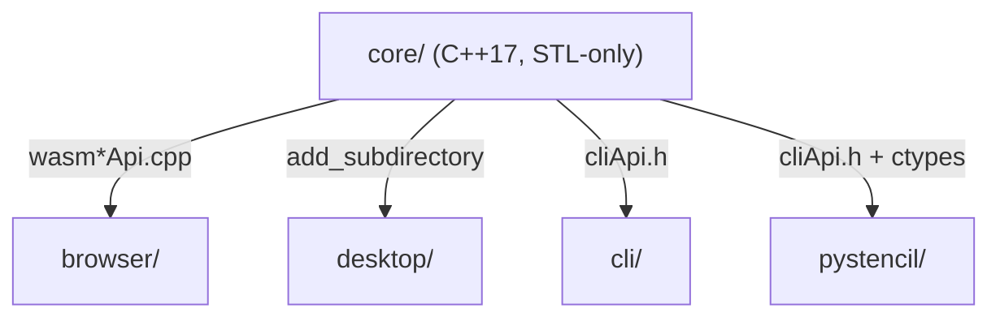

# Core architecture

The system-wide design — the parity contract, canonical data, the layer model, the pattern vocabulary — is in the root [`ARCHITECTURE.md`](../ARCHITECTURE.md); the wasm build is in [`WASM.md`](WASM.md).

The shared C++17 library: STL-only, codec-free, GUI-free. It moves bytes and numbers over
plain values and caller-owned RGBA8 buffers; everything platform-specific lives in the
adapters.

## Where things go

| Path | Holds | Rule |
|---|---|---|
| `models.hpp`, `text.hpp`, `rgba.hpp` | the shared value types (Point / Line) and header-only helpers used across groups | header-only; no group may define its own Point |
| `geometry/` | point math, hit-testing, crop-window geometry | pure functions over `Point`/`Line` |
| `raster/` | whole-image RGBA8 transforms, the line rasteriser, the per-pixel filters + Sobel contour | operates on caller-owned buffers, never allocates the image |
| `color/` | hex/keyword parsing, the two luma formulas | `luma.hpp` names both formulas once; there is no third |
| `parse/` | the formula parser, length tokens, crop spec, duration spec | recursive descent only — no `eval`, no arbitrary identifiers |
| `page/` | pixel ↔ page (cm) conversion, the ISO `PAGE_SIZES` table, locale unit | the page table is the one source; adapters read it over the ABI |
| `format/` | tooltip rows, hotkey display formatting | string building only |
| `state/` | history stack, projects store + expiry, zoom/pan, hold-draw state machine, `ProjectMeta` | in-memory only; persistence and the event loop belong to the GUI |
| `abi/` | marshalling, the handle table, the lines codec, `shared.inc` | used by **both** `extern "C"` surfaces, never by the library itself |
| `wasm*Api.cpp` | the `extern "C"` ABI compiled to WebAssembly, split by export family | listed only in `core/CMakeLists.txt`; plain STL, so they also compile natively into the tests |
| `cliApi.{h,cpp}` | the `extern "C"` ABI the CLI and pystencil call | flat `double*` / RGBA8 buffers and C strings; no embind, no host allocation |
| `tests/` | the Doctest suite, one suite per module, plus the wasm and CLI ABI suites and the `bench` suite | each suite is a port of the matching `browser/tests/` file |
| `third_party/` | `doctest.h`, fetched at configure time | gitignored; the one dependency, tests only |

## Rules

1. **Parity.** Each module is a port of a specific browser JS call site, named at the top of
   its header, and stays behaviorally identical down to edge cases. Its tests are ports of
   `browser/tests/`. `browser/tests/wasm-parity.test.js` asserts the compiled core agrees
   with the JS reference op-for-op.
2. **No `eval`.** `parse/formulaParser` is a real recursive-descent parser for
   `+ - * / ** ( )` and one variable (`**` right-associative, empty expression = identity,
   division-by-zero / overflow = invalid), aligned with `browser/js/core/formulaEngine.js`
   down to the shared `MAX_DEPTH`.
3. **STL-only, codec-free, GUI-free.** No Qt, no image codec, no DOM, no HTTP, no JSON, no
   third-party library; every such concern belongs to an adapter.
4. **Three source lists.** The `core/*.cpp` set is held in `STENCIL_CORE_SOURCES`
   (`CMakeLists.txt`), the array in `cli/build.zig` and the list in `pystencil/build.py`;
   the `wasm*Api.cpp` units are CMake-only.
5. **Two ABIs, one body.** An export that exists in both ABIs is written once in
   `abi/shared.inc`. The wasm exports are the `EXPORTED_FUNCTIONS` list in `CMakeLists.txt`;
   an export absent from it reaches the browser only through the JS fallback.
6. **Build targets.** `stencil_core` (the static library), `stencil_tests` (on by default,
   off under Emscripten and in the desktop build, which defers to this one), `stencil_wasm`
   (only under `emcmake`).

## Tests

One Doctest suite per module, each a port of the matching `browser/tests/` file, plus the
wasm and CLI ABI suites. The `bench` suite is opt-in (`doctest::skip()`) and asserts
algorithmic properties as ratios — contour vs. the per-pixel filter, rotate as a tiled
transpose, rasterising and hit tests linear in line count, the parser at `MAX_DEPTH`, the
two luma forms within 1 of each other, `HistoryStack::push` amortised O(1) — never a
wall-clock number.
