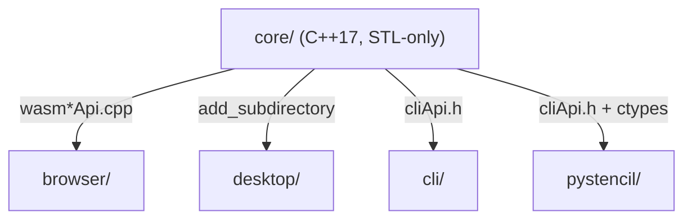
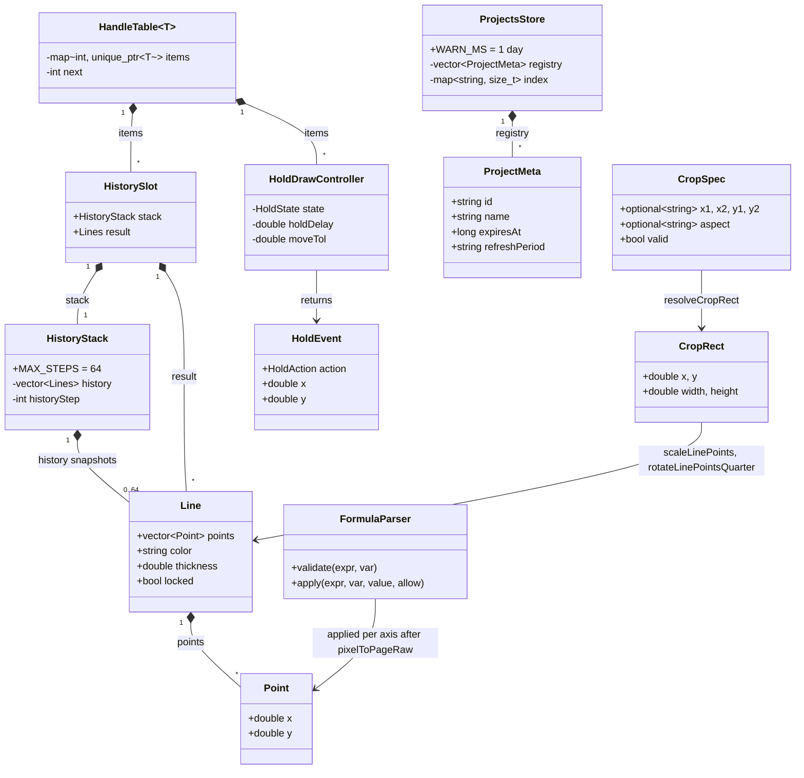

# Core architecture

The system-wide design — the parity contract, canonical data, the layer model, the pattern vocabulary — is in the root [`ARCHITECTURE.md`](../ARCHITECTURE.md); the wasm build is in [`WASM.md`](WASM.md).

The shared C++17 library: STL-only, codec-free, GUI-free. It moves bytes and numbers over
plain values and caller-owned RGBA8 buffers; everything platform-specific lives in the
adapters.



## Layers

`models.hpp` / `text.hpp` / `rgba.hpp` → `geometry/`, `color/`, `parse/` → `raster/`,
`page/`, `format/`, `state/`, `script/` → `abi/` → `wasm*Api.cpp`, `cliApi.cpp`.

A group includes only what is to its left. `parse/cropSpec` includes `geometry/cropGeometry`;
`raster/rasterize` includes `color/colorNames` and `raster/imageFilter` includes
`color/luma`; `format/tooltipRows` includes `page/pageMetrics`; `state/` and `page/` include
nothing but the root value types; `script/` includes `parse/`, `color/` and `raster/` — it
lowers a script into their vocabulary rather than growing its own; `abi/` includes only `models.hpp`; the library itself never
includes `abi/`. By convention; no lint. Every group directory is on one flat include path, so
the includes are bare (`"cropGeometry.hpp"`) and the direction is visible only in the
`#include` lines.

## Where things go

| Path | Holds | Rule |
|---|---|---|
| `models.hpp`, `text.hpp`, `rgba.hpp` | the shared value types (Point / Line) and header-only helpers used across groups | header-only; no group may define its own Point |
| `geometry/` | point math, hit-testing, crop-window geometry | pure functions over `Point`/`Line` |
| `raster/` | whole-image RGBA8 transforms, the line rasteriser, the per-pixel filters + Sobel contour | operates on caller-owned buffers, never allocates the image |
| `color/` | hex/keyword parsing, the two luma formulas | `luma.hpp` names both formulas once; there is no third |
| `parse/` | the formula parser, length tokens, crop spec, duration spec | recursive descent only — no `eval`, no arbitrary identifiers |
| `page/` | pixel ↔ page (cm) conversion, the ISO `PAGE_SIZES` table, locale unit | the page table is the one source; adapters read it over the ABI |
| `format/` | tooltip rows, hotkey display formatting | string building only |
| `state/` | history stack, projects store + expiry, zoom/pan, hold-draw state machine, `ProjectMeta` | in-memory only; persistence and the event loop belong to the GUI |
| `script/` | the `.stc` language: lexer, parser, template expansion, lowering, diagnostics, the canonical dump | parses and lowers only — it opens no file, fetches no URL and touches no pixel |
| `abi/` | marshalling, the handle table, the lines codec, `shared.inc` | used by **both** `extern "C"` surfaces, never by the library itself |
| `wasm*Api.cpp` | the `extern "C"` ABI compiled to WebAssembly, split by export family | listed only in `core/CMakeLists.txt`; plain STL, so they also compile natively into the tests |
| `cliApi.{h,cpp}` | the `extern "C"` ABI the CLI and pystencil call | flat `double*` / RGBA8 buffers and C strings; no embind, no host allocation |
| `tests/` | the Doctest suite, one suite per module, plus the wasm and CLI ABI suites and the `bench` suite | each suite is a port of the matching `browser/tests/` file |
| `third_party/` | `doctest.h`, fetched at configure time | gitignored; the one dependency, tests only |

## Entities



| Entity | What it is | Owned by / lifetime | Relates to |
|---|---|---|---|
| `Point` (`models.hpp`) | one image-pixel coordinate | value; inside a `Line` or a flat `[x0,y0,…]` array; `pixelToPageRaw` maps it onto a `PageSize` | `Line` |
| `Line` (`models.hpp`) | one drawn polyline or closed area; `Lines` is `vector<Line>`. Twin of the plain line object in `browser/js/core/drawingApp.js`, which is canonical | value; snapshotted by `HistoryStack`, burned by `raster/rasterize` after `parseColor` resolves its colours to `Rgba` | `Point`, `CropRect` |
| `HistoryStack` (`state/HistoryStack.hpp`) | the undo/redo stack of whole-`Lines` snapshots, capped at `MAX_STEPS` | owned by the desktop's `CanvasWidget` directly, or by a `HistorySlot` over wasm | `Line` |
| `HistorySlot` (`wasmStateApi.cpp`) | a `HistoryStack` plus the last undo/redo result held until the host reads it | process-global `HandleTable<HistorySlot>`, created and destroyed by the host | `HistoryStack`, `HandleTable` |
| `HandleTable<T>` (`abi/HandleTable.hpp`) | opaque int → owned instance; a stale or forged handle looks up to `nullptr` | one static table per stateful class in `wasmStateApi.cpp` | `HistorySlot`, `HoldDrawController` |
| `HoldDrawController` (`state/holdDraw.hpp`) | the hold-to-draw gesture machine over `HoldState` IDLE / ARMED / DRAWING / ABORTED; time-injected, host screen space | the GUI's pointer handler, or a wasm handle | `HoldEvent` |
| `HoldEvent` (`state/holdDraw.hpp`) | one `HoldAction` (NONE, ARMED, ABORT, START, DROP, PREVIEW, COMMIT) with optional coordinates | value returned per pointer call | `HoldDrawController` |
| `ProjectMeta` (`state/ProjectMeta.hpp`) | one saved project's metadata, field for field the browser project object (`projectMeta.js`, canonical) and the server `ProjectRecord`; payloads are the adapter's | value inside `ProjectsStore::registry` | `ProjectsStore` |
| `ProjectsStore` (`state/ProjectsStore.hpp`) | the in-memory registry with an id index, name rules and the expiry rules; port of the pure parts of `projectsStore.js` | the adapter that loads and persists it | `ProjectMeta` |
| `ScriptProgram` (`script/program/scriptProgram.hpp`) | one parsed `.stc`: its tokens, diagnostics, blocks and lowered ops. Immutable after `parse`, which is what lets the ABI hand out pointers into it | created per parse; owned by an `abi::HandleTable` slot until destroyed | `Token`, `Diagnostic`, `Block`, `Op` |
| `Token` (`script/types.hpp`) | one lexed span with its line, column, length and `TokenKind` | value inside a `ScriptProgram`; an editor colours by kind | `ScriptProgram` |
| `Diagnostic` (`script/types.hpp`) | one error or warning: a stable code, a span and a message | value inside a `ScriptProgram` | `ScriptProgram` |
| `Block` (`script/types.hpp`) | one `@source` run, or the implicit project block: the spec, its `SourceKind` and its slice of the op stream | value inside a `ScriptProgram` | `Op` |
| `Op` (`script/types.hpp`) | one lowered operation: plain strings, length tokens resolved lazily, and plain numbers | value inside a `ScriptProgram`; `resolveOp` turns its tokens into pixels | `Block`, `CropRect`, `Line` |
| `EditLedger` (`script/undo.hpp`) | the per-block record of which edits are still live, and the rewind-and-replay that reconciles them at each `@save` | lives only during lowering | `Op` |
| `CropRect` (`geometry/cropGeometry.hpp`) | the crop window in original-image pixel space; lines are crop-local | value, kept by the adapter beside a 0..3 quarter-turn count | `CropSpec`, `Line` |
| `CropSpec` (`parse/cropSpec.hpp`) | the CLI's parsed crop string, one length token per edge plus `aspect` | value, consumed by `resolveCropRect` | `CropRect` |
| `FormulaParser` (`parse/formulaParser.hpp`) | the `f(x)` / `f(y)` arithmetic evaluator; identity on empty or invalid input | stateless; `Eval` lives for one call | `Point` (page coordinates after `pixelToPageRaw`) |

## Patterns

| Pattern | Where | Notes |
|---|---|---|
| Facade over core | `cliApi.h`, `wasm*Api.cpp` | the `extern "C"` seam beneath every adapter facade (`window.stencil`, `core.zig`, `pystencil.core`); the desktop links the library directly at the seam its layer lint allows |
| Command | `HistoryStack` (`state/HistoryStack.hpp`) | an entry is a whole-`Lines` snapshot, so apply and revert are the same copy; `push` truncates the redo branch |
| Strategy | `FilterMode` + `filterPixel` (`raster/imageFilter.hpp`), `luma::rec709Truncated` / `rec709Scaled` | the mode is chosen by `filterModeFromString`, the per-pixel kernel by one hoisted `switch`; the two luma forms are distinct strategies pinned to distinct JS twins |
| Repository | `ProjectsStore` (`state/ProjectsStore.hpp`) | registry + `index` behind `upsert` / `find` / `remove`; serialisation and storage are the adapter's |
| State machine | `HoldDrawController` (`state/holdDraw.hpp`) | `pointerDown` arms, a move past `moveTol` aborts, `tick` past `holdDelay` starts at the press point, a dwell drops a point, `pointerUp` commits; times are injected monotonic ms |
| Interpreter (recursive descent) | `Eval` in `parse/formulaParser.cpp`, `DurationParser`, `parseCropSpec` + `parseLengthToken` | grammar functions per rule; `DepthGuard` caps recursion at `MAX_DEPTH` = 256, shared with `formulaEngine.js` |
| Interpreter (lowering) | `script/` | a `.stc` is lexed, parsed, template-expanded and lowered to a flat `Op` stream; the adapters execute ops, never grammar, so every surface runs one language |
| Rewind and replay | `EditLedger::reconcile` (`script/undo.hpp`) | `@undo` is resolved when the script is lowered: one `undo` back to where the applied and surviving edits agree, then the survivors again — so no adapter computes an undo count |
| Handle table | `abi::HandleTable<T>` | stateful classes cross the ABI as opaque ints; an unknown handle is a no-op returning a neutral value |
| Flat codec | `abi::encodeLines` / `decodeLines` (`abi/linesCodec.hpp`), `abi::toPoints` (`abi/marshal.hpp`) | `Lines` travel as a doubles buffer plus a UTF-8 text buffer; lengths are honoured, never trusted |
| One body, two symbols | `abi/shared.inc` with `STENCIL_ABI(wasmName, cliName)` | exports identical on both ABIs are written once and emitted under each spelling |
| Row-range kernel | the `*Rows` functions in `raster/imageOps.hpp`, `raster/imageFilter.hpp`, `fillPolygonRows` | half-open `[y0, y1)` slices of a whole-image op for a caller-owned thread pool; the core owns no threading |

## Design

- **A wasm call.** `browser/js/core/stencilCore.js` imports the generated module, checks
  every `EXPORTED_FUNCTIONS` entry is present, and `cwrap`s each; a missing or stale artifact
  degrades to the JS fallback. Scalars and C strings pass directly, a point list as one flat
  `[x0,y0,…]` array read through `abi::toPoints`, a result into a `_malloc`ed slot read back
  from `HEAPF64`. Stateful classes go through `coreHandles.js`: `stencil_history_create`
  returns an int from `HandleTable<HistorySlot>`, `push` sends `Lines` encoded by
  `linesCodec.js` and decoded by `abi::decodeLines`, `undo` reports the two buffer sizes and
  `stencil_history_readResult` encodes the retained `HistorySlot::result`.
- **A CLI ABI call.** The Zig CLI or pystencil decodes the image itself and owns a `w*h*4`
  RGBA8 buffer. `stencil_cli_resolveCrop` runs `parseCropSpec` → `resolveCropRect` and clamps
  to integer pixels; `stencil_cli_cropImageRGBA` / `rotateImageRGBA` write a caller-sized
  `dst`; `stencil_cli_rasterizeLine` builds a `Line` from flat points and C strings and burns
  it in place; the `*Rows` exports take `[y0, y1)` for the caller's pool, contour in two
  phases (`buildLumaRows` for every row, then `sobelRows`). Nothing allocates, frees or
  retains caller memory; returned strings are static.
- **A script run.** `ScriptProgram::parse` lexes (where `#` opens a comment unless the token
  is a hex colour, and `://` never breaks a word), parses statements into blocks whose bodies
  end where their indentation does, expands `@use stencil` by longest-defined-prefix, then
  lowers everything to a flat `Op` stream. Lengths stay as tokens because a crop changes the
  image mid-script: `resolveOp` turns them into pixels against the size the host holds right
  then, reusing `resolveCropRect` and `resolveAxisPx`. `@undo` never reaches an adapter —
  `EditLedger` resolves it at each `@save` into one rewind plus a replay of the survivors.
  The language is normative in `contracts/stc/stc-contract.md`; the corpus in
  `browser/js/config/script/fixtures/` is what proves every surface agrees.
- **A formula evaluation.** `FormulaParser::apply(expr, var, value, allowFormulas)` is the
  identity when formulas are off, the expression is empty, or evaluation fails. `Eval` walks
  `expr → term → unary → power → primary` with a `DepthGuard` per nested rule; a non-finite
  result is invalid. The caller composes it after `pixelToPageRaw`, per axis, as the browser
  does. `formulaValidate` / `formulaApply` reach both ABIs from `shared.inc`;
  `stencil_formulaEvaluate` is wasm-only.
- **A history push and undo.** `push(lines)` advances the step, drops the redo branch,
  appends the snapshot, and past `MAX_STEPS` erases the oldest and shifts the cursor down.
  `undo()` at step > 0 returns the previous snapshot; at step 0 returns empty `Lines` and
  moves to -1; otherwise `nullopt`. `reset(lines)` seeds step 0 with lines, else -1.
- **Projects store expiry.** The adapter seeds `ProjectMeta::expiresAt` (0 = keep forever)
  from `addPeriod(now, refreshPeriod)`; `periodMs` uses fixed presets (day, week, fortnight,
  month = 30 d, 3month, 6month, year = 365 d, unknown = week) so no calendar library enters.
  `isExpired(meta, now)` is `expiresAt != 0 && now > expiresAt`; `isExpiringSoon` is due
  within `WARN_MS` and not yet past; `sweepExpired(now)` removes and returns the expired ids.
  The `expire` command gets its ms from `DurationParser`. Only these pure rules are exported
  to wasm (`stencil_projects_*`); the registry itself is not a browser twin.

The one wire schema the core owns is the `Lines` snapshot of `abi/linesCodec.hpp`, in two
caller-owned buffers (`browser/js/core/line/linesCodec.js` is its twin):

```
nums (double[]): lineCount, then per line:
                 pointCount, thickness, pointSize, locked,
                 len(color), len(style), len(fillColor), len(pointColor),
                 x0, y0, x1, y1, …
text (uint8[]):  color, style, fillColor, pointColor per line, UTF-8, concatenated
```

## Rules

1. **Parity.** Each module is a port of a specific browser JS call site, named at the top of
   its header, and stays behaviorally identical down to edge cases. Its tests are ports of
   `browser/tests/`. `browser/tests/wasm/wasm-parity.test.js` asserts the compiled core agrees
   with the JS reference op-for-op.
2. **No `eval`.** `parse/formulaParser` is a real recursive-descent parser for
   `+ - * / ** ( )` and one variable (`**` right-associative, empty expression = identity,
   division-by-zero / overflow = invalid), aligned with `browser/js/core/parse/formulaEngine.js`
   down to the shared `MAX_DEPTH`.
3. **STL-only, codec-free, GUI-free.** No Qt, no image codec, no DOM, no HTTP, no JSON, no
   third-party library; every such concern belongs to an adapter.
4. **Three source lists.** The `core/*.cpp` set is held in `STENCIL_CORE_SOURCES`
   (`CMakeLists.txt`), the array in `cli/build.zig` and the list in `pystencil/build.py`;
   the `wasm*Api.cpp` units are CMake-only.
5. **Two ABIs, one body.** An export that exists in both ABIs is written once in
   `abi/shared.inc`. The wasm exports are the `EXPORTED_FUNCTIONS` list in `CMakeLists.txt`;
   an export absent from it reaches the browser only through the JS fallback.
6. **Build targets.** `stencil_core` (the static library), `stencil_tests` (on by default,
   off under Emscripten and in the desktop build, which defers to this one), `stencil_wasm`
   (only under `emcmake`).

## Tests

One Doctest suite per module, each a port of the matching `browser/tests/` file, plus the
wasm and CLI ABI suites. The `bench` suite is opt-in (`doctest::skip()`) and asserts
algorithmic properties as ratios — contour vs. the per-pixel filter, rotate as a tiled
transpose, rasterising and hit tests linear in line count, the parser at `MAX_DEPTH`, the
two luma forms within 1 of each other, `HistoryStack::push` amortised O(1) — never a
wall-clock number.

The script suites are two: `script.test.cpp` over the lexer, the argument grammars and
resolution, and `scriptLower.test.cpp` over templates, history and the caps. Both assert that
malformed input yields a diagnostic rather than a crash, the way the formula suite does.
`scriptFixtures.test.cpp` walks the shared corpus, comparing the canonical dump and the
diagnostics byte for byte and holding the `err-*` naming rule; it also re-parses a fixture
truncated at every seventh byte, so a half-written script in an editor can never crash a
surface.

The `wasm*Api.cpp` and `cliApi.cpp` units are plain STL, so `stencil_tests` compiles them
natively and drives every export through its `extern "C"` prototype, guarding the
marshalling (flat arrays, out pointers, enum codes, char-code variable names) without
Emscripten or Zig. `tests/abi/abiShared.test.cpp` calls each `shared.inc` export under both
spellings and asserts they agree. `tests/raster/rowRanges.test.cpp` pins every `*Rows` kernel
byte-for-byte against its whole-image call. The browser's `wasm-parity*.test.js` files drive
the compiled module and the JS fallback through one script; the `Lines` codec is proved
symmetric by the round trip in `wasm-parity-history.test.js`.
