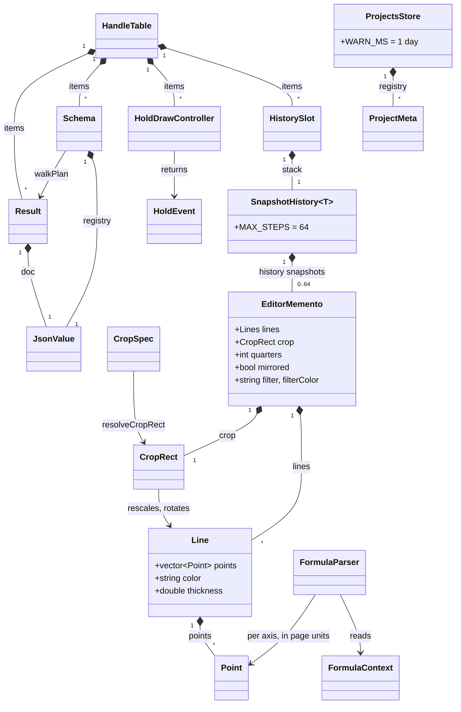

# Core architecture

The system-wide design is in the root [`ARCHITECTURE.md`](../ARCHITECTURE.md); the wasm build in [`WASM.md`](WASM.md).

The shared C++17 library: STL-only, codec-free, GUI-free. It moves bytes and numbers over
plain values and caller-owned RGBA8 buffers; everything platform-specific lives in the
adapters. The browser runs it as wasm (`wasm*Api.cpp`), the desktop links it
(`add_subdirectory`), and the CLI and pystencil recompile it behind `cliApi.h`.

## Layers

`models.hpp` / `text.hpp` / `rgba.hpp` → `geometry/`, `color/`, `parse/`, `json/` → `raster/`,
`page/`, `format/`, `state/`, `script/`, `opplan/` → `abi/` → `wasm*Api.cpp`, `cliApi.cpp`.

A group includes only what is to its left: `page/` nothing but the root value types, `json/`
only `parse/decimal`, `abi/` only `models.hpp`; `script/` lowers into the vocabulary of
`parse/` and `color/` rather than growing its own, and `opplan/` walks `json/` with
`color/colorNames`; the library itself never includes `abi/`. By convention, no lint: every
group directory is on one flat include path, so includes are bare (`"cropGeometry.hpp"`) and
the direction shows only in the `#include` lines.

## Where things go

| Path | Holds | Rule |
|---|---|---|
| `models.hpp`, `text.hpp`, `rgba.hpp` | the shared value types (Point / Line), the ASCII string helpers and the keyed word table | header-only; no group may define its own Point |
| `geometry/` | point math, hit-testing, crop-window geometry and its commit, the chain edits | pure functions over `Point`/`Line` |
| `raster/` | whole-image RGBA8 transforms, the line rasteriser, the per-pixel filters + Sobel contour, the area-average downscale | caller-owned buffers, never allocates the image; `downscale` is adapter-only, so has no JS twin |
| `color/` | hex/keyword parsing, the two luma formulas | `luma.hpp` names both formulas once; there is no third |
| `parse/` | the formula parser and its context of named constants, length tokens, crop spec, duration spec | recursive descent only — no `eval`; a name is the bound axis or a `FormulaContext` constant, never arbitrary |
| `page/` | pixel ↔ page (cm) conversion, the ISO `PAGE_SIZES` table, locale unit | the page table is the one source; adapters read it over the ABI |
| `format/` | the hover tooltip's coordinate rows (pixel, page, to-edge) in the shown unit | string building only |
| `state/` | the snapshot history, the co-edit line merge, projects store + expiry, zoom/pan, the hold-draw state machine | in-memory only; persistence and the event loop belong to the GUI |
| `script/` | the `.stc` language: lexer, parser, template expansion, lowering, diagnostics, the canonical dump | parses and lowers only — it opens no file, fetches no URL and touches no pixel |
| `json/` | a `JSON.parse`-equal value and reader under caps, a `JSON.stringify`-equal writer, JS string and number semantics | nothing recurses on input; strings are WTF-8 inside, well-formed UTF-8 out |
| `opplan/` | the LLM op-plan validator over `opRegistry.json`, resolved per surface | the host passes the registry text and the reply; no model call, file or network; files prefixed `plan`, as every group shares one include path |
| `abi/` | marshalling, the handle table, the lines codec and the `*.inc` export bodies | used by **both** `extern "C"` surfaces, never by the library itself |
| `wasm*Api.cpp` | the `extern "C"` ABI compiled to WebAssembly, split by export family | CMake-only; plain STL, so the tests also compile them natively |
| `cliApi.{h,cpp}` | the `extern "C"` ABI the CLI and pystencil call | flat `double*` / RGBA8 buffers and C strings; no embind, no host allocation |
| `third_party/` | `doctest.h`, fetched at configure time | gitignored; the one dependency, tests only |

## Entities


```mermaid
classDiagram
    class Line {
        +vector~Point~ points
        +string color
        +double thickness
    }
    class SnapshotHistory~T~ {
        +MAX_STEPS = 64
    }
    class EditorMemento {
        +Lines lines
        +CropRect crop
        +int quarters
        +bool mirrored
        +string filter, filterColor
    }
    class ProjectsStore {
        +WARN_MS = 1 day
    }

    Line "1" *-- "*" Point : points
    SnapshotHistory "1" *-- "0..64" EditorMemento : history snapshots
    EditorMemento "1" *-- "*" Line : lines
    EditorMemento "1" *-- "1" CropRect : crop
    HistorySlot "1" *-- "1" SnapshotHistory : stack
    HandleTable "1" *-- "*" HistorySlot : items
    HandleTable "1" *-- "*" HoldDrawController : items
    HandleTable "1" *-- "*" Schema : items
    HandleTable "1" *-- "*" Result : items
    HoldDrawController --> HoldEvent : returns
    ProjectsStore "1" *-- "*" ProjectMeta : registry
    CropSpec --> CropRect : resolveCropRect
    CropRect --> Line : rescales, rotates
    FormulaParser --> FormulaContext : reads
    FormulaParser --> Point : per axis, in page units
    Schema "1" *-- "1" JsonValue : registry
    Schema --> Result : walkPlan
    Result "1" *-- "1" JsonValue : doc
```

| Entity | What it is | Owned by / lifetime | Relates to |
|---|---|---|---|
| `Point` (`models.hpp`) | one image-pixel coordinate | value; inside a `Line` or a flat `[x0,y0,…]` array | `Line` |
| `Line` (`models.hpp`) | one drawn polyline or closed area; `Lines` is `vector<Line>`. Twin of the plain line object in `browser/js/core/drawingApp.js`, which is canonical | value; snapshotted by the history, burned by `raster/rasterize` | `Point`, `CropRect` |
| `SnapshotHistory<T>` (`state/HistoryStack.hpp`) | the undo/redo stack of whole snapshots, capped at `MAX_STEPS`; `HistoryStack` over `Lines`, `EditorHistory` over `EditorMemento` | `HistoryStack` owned by the desktop's `CanvasWidget`; `EditorHistory` by a `HistorySlot` over wasm | `Line`, `EditorMemento` |
| `EditorMemento` (`state/HistoryStack.hpp`) | one editor undo step: the lines and the view they sit on — crop, quarter turns, a mirror, a filter; a step without a view is lines alone. Twin of the mementos of `browser/js/core/historyStack.js` | value inside an `EditorHistory` | `Line`, `CropRect` |
| `HistorySlot` (`wasmHistoryApi.cpp`) | an `EditorHistory` plus the last undo/redo step, held until the host reads it | process-global `HandleTable<HistorySlot>`, created and destroyed by the host | `SnapshotHistory`, `HandleTable` |
| `HandleTable<T>` (`abi/HandleTable.hpp`) | opaque int → owned instance; a stale or forged handle looks up to `nullptr` | one static table per stateful class | `HistorySlot`, `HoldDrawController`, `Schema`, `Result` |
| `HoldDrawController` (`state/holdDraw.hpp`) | the hold-to-draw gesture machine over IDLE / ARMED / DRAWING / ABORTED; time-injected, host screen space | the GUI's pointer handler, or a wasm handle | `HoldEvent` |
| `HoldEvent` (`state/holdDraw.hpp`) | one `HoldAction` with optional coordinates | value returned per pointer call | `HoldDrawController` |
| `ProjectMeta` (`state/ProjectMeta.hpp`) | one saved project's metadata, field for field the browser project object (`projectMeta.js`, canonical) and the server `ProjectRecord`; payloads are the adapter's | value inside `ProjectsStore::registry` | `ProjectsStore` |
| `ProjectsStore` (`state/ProjectsStore.hpp`) | the in-memory registry with an id index, name rules and expiry rules; port of the pure parts of `projectsStore.js` | the adapter that loads and persists it | `ProjectMeta` |
| `ScriptProgram` (`script/program/scriptProgram.hpp`) | one parsed `.stc`: tokens, diagnostics, blocks and lowered ops. Immutable after `parse`, which lets the ABI hand out pointers into it | per parse; an `abi::HandleTable` slot until destroyed | `Token`, `Diagnostic`, `Block`, `Op` |
| `Token`, `Diagnostic` (`script/types.hpp`) | a lexed span and the `TokenKind` an editor colours by; an error or warning with a stable code, span and message | values inside a `ScriptProgram` | `ScriptProgram` |
| `Block` (`script/types.hpp`) | one `@source` run, or the implicit project block: its spec, `SourceKind` and slice of the op stream | value inside a `ScriptProgram` | `Op` |
| `Op` (`script/types.hpp`) | one lowered operation: plain strings, plain numbers and length tokens resolved lazily | value inside a `ScriptProgram` | `Block`, `CropRect`, `Line` |
| `EditLedger` (`script/undo.hpp`) | the per-block record of which edits are still live, reconciled at each `@save` | lives only during lowering | `Op` |
| `CropRect` (`geometry/cropGeometry.hpp`) | the crop window in original-image pixel space; lines are crop-local | value, beside a 0..3 quarter-turn count or inside an `EditorMemento` | `CropSpec`, `Line`, `EditorMemento` |
| `CropSpec` (`parse/cropSpec.hpp`) | the CLI's parsed crop string, one length token per edge plus `aspect` | value, consumed by `resolveCropRect` | `CropRect` |
| `FormulaParser` (`parse/formulaParser.hpp`) | the `f(x)` / `f(y)` arithmetic evaluator; identity on empty or invalid input | stateless; `Eval` lives for one call | `Point` (page coordinates), `FormulaContext` |
| `FormulaContext` (`parse/formulaContext.hpp`) | the names a formula may read besides its own axis: the other axis, the page in cm, the image in pixels, the display unit | value, built per call by the caller that knows the page and the image | `FormulaParser` |
| `JsonValue` (`json/jsonValue.hpp`) | one value as `JSON.parse` returns it: `Object.keys` order, a duplicate's last value at its first place, WTF-8 strings, numbers as double plus lexeme | value; the reader builds it, the writer prints it; destroyed without recursion | `Schema`, `Result` |
| `Schema` (`opplan/planSchema.hpp`) | `opRegistry.json` resolved for one surface — entries, forbidden names, `surfaceRules`, JSON caps; twin of `createSchema` in `browser/js/llm/plan/opSchema.js` | per host, from the registry text; a bad registry sets `error` | `JsonValue`, `Result` |
| `Result` (`opplan/planResult.hpp`) | one walked reply as one document; each warning and error a code plus its canonical message | per parse; an `abi::HandleTable` slot until destroyed | `Schema` |

## Patterns

| Pattern | Where | Notes |
|---|---|---|
| Facade over core | `cliApi.h`, `wasm*Api.cpp` | the `extern "C"` seam beneath every adapter facade (`window.stencil`, `core.zig`, `pystencil.core`); the desktop links the library directly |
| Memento | `SnapshotHistory` | an entry is a whole snapshot, so apply and revert are one copy and a crop or turn is one undo step like a stroke |
| Strategy | `FilterMode` (`raster/imageFilter.hpp`), the `luma` forms | one hoisted `switch` picks the per-pixel kernel; each luma form is pinned to its own JS twin |
| Repository | `ProjectsStore` | registry + index behind `load` / `find` / `remove`; serialisation and storage are the adapter's |
| State machine | `HoldDrawController` | a press arms, a move past `moveTol` aborts, a tick past `holdDelay` starts at the press point, a dwell drops a point, release commits; times are injected monotonic ms |
| Interpreter (recursive descent) | `parse/formulaParser.cpp`, `DurationParser`, `parseCropSpec` | a function per grammar rule; `DepthGuard` caps recursion at `MAX_DEPTH` = 256, shared with `formulaEngine.js` |
| Interpreter (lowering) | `script/` | a `.stc` is lowered to a flat `Op` stream; the adapters execute ops, never grammar, so every surface runs one language |
| Rewind and replay | `EditLedger::reconcile` (`script/undo.hpp`) | `@undo` resolves at lowering: one `undo` back to where applied and surviving edits agree, then the survivors again — no adapter computes an undo count |
| Handle table | `abi::HandleTable<T>` | stateful classes cross the ABI as opaque ints; an unknown handle is a no-op returning a neutral value |
| Flat codec | `abi/linesCodec.hpp`, `abi/marshal.hpp` | `Lines` travel as a doubles buffer plus a UTF-8 text buffer; lengths are honoured, never trusted |
| One body, two symbols | `abi/shared.inc` with `STENCIL_ABI(wasmName, cliName)` | exports identical on both ABIs are written once and emitted under each spelling |
| Keyed word table | `Keyed<T>` (`text.hpp`) over a `constexpr std::array` | every string → value resolution is one table matched in declaration order, never an `if` chain |
| Two-pass reader | `json/jsonReader.cpp` over `json/jsonScan.hpp` | pass one proves the syntax and measures the value; pass two builds it, skipping dropped values — so the caps bound the memory too |
| Golden twin | `opplan/` against `browser/js/llm/plan/parser.js` | core emits the JS walk's normalized result byte for byte, per core surface |
| Row-range kernel | the `*Rows` functions of `raster/` | half-open `[y0, y1)` slices of a whole-image op for a caller-owned thread pool; the core owns no threading |

## Design

- **A wasm call.** `browser/js/core/abi/stencilCore.js` checks every `EXPORTED_FUNCTIONS`
  entry is present and `cwrap`s each; a missing or stale artifact degrades to the JS fallback.
  Points pass as one flat `[x0,y0,…]` array, results through a `_malloc`ed slot, stateful
  classes as `HandleTable` ints, and `Lines` through the lines codec.
- **A CLI ABI call.** The Zig CLI or pystencil decodes the image and owns a `w*h*4` RGBA8
  buffer. A crop spec resolves through `parseCropSpec` → `resolveCropRect` to integer pixels;
  crop, rotate and rasterise write caller-sized buffers in place, contour in two row phases
  (luma, then Sobel). Nothing allocates, frees or retains caller memory; returned strings are
  static.
- **A script run.** `ScriptProgram::parse` lexes, parses statements into blocks whose bodies
  end where their indentation does, expands `@use stencil` by longest-defined-prefix, then
  lowers to a flat `Op` stream. Lengths stay tokens because a crop changes the image
  mid-script: `resolveOp` turns them into pixels against the size the host holds right then.
  `contracts/stc/stc-contract.md` is normative; the corpus in
  `common/fixtures/script/` proves every surface agrees.
- **A formula evaluation.** The caller composes `FormulaParser::apply` after `pixelToPageRaw`,
  per axis, as the browser does; a failure leaves the value unchanged. A name
  (`[A-Za-z_][A-Za-z0-9_]*`, whole, case-sensitive) resolves to the caller's binding, then
  `x` / `y`, `PAGE_WIDTH` / `PAGE_HEIGHT` in `ctx.unit` (and `_CM` / `_IN`), then
  `IMAGE_WIDTH` / `IMAGE_HEIGHT` in pixels; an unsupplied `FormulaContext` field is NaN, so
  its name fails rather than reading zero.
- **A history push and undo.** `push` advances the step, drops the redo branch, appends, and
  past `MAX_STEPS` erases the oldest. `undo()` above step 0 returns the previous snapshot, at
  step 0 the floor (moving to -1), else `nullopt`. The floor has no lines and the view the
  stack was `reset` with — or, once trimmed, the last one dropped — so undoing the first crop
  restores the crop before it.
- **A co-edit merge.** `mergeLines(server, local)` keeps the peer's lines in order, then each
  local line whose `lineDedupeKey` no earlier line carries. The key spells every field in a
  fixed order and each number as its exact bits (−0 as 0, one NaN), so it matches exactly
  when the JS `String(n)` key does, without linking printf's float formatting into wasm.
- **Projects store expiry.** The adapter seeds `ProjectMeta::expiresAt` (0 = keep forever)
  from `addPeriod(now, refreshPeriod)` over fixed presets (month = 30 d, year = 365 d,
  unknown = week), so no calendar library enters. Expired is `expiresAt != 0 && now >
  expiresAt`; expiring soon is due within `WARN_MS`. Only these pure rules reach wasm; the
  registry itself is not a browser twin.
- **A plan walk.** A host creates a `Schema` from its surface's registry text, then hands each
  model reply to `walkPlan`. Non-UTF-8 bytes read as U+FFFD, as `TextDecoder` would; fences
  go; the first balanced `{…}` is read under the registry's JSON caps (none or not JSON: a
  chat-only turn; over a cap: `E_JSON_LIMIT`); actions, variants and the card then pass the
  key-spec checks, the native rules, normalization and `surfaceRules`. Each surface maps the
  one result document onto its typed actions. The ABI is `abi/opplanShared.inc`,
  mutex-guarded because ctypes releases the GIL.

The one wire schema the core owns is the `Lines` snapshot of `abi/linesCodec.hpp`, in two
caller-owned buffers (`browser/js/core/line/linesCodec.js` is its twin):

```
nums (double[]): lineCount, then per line:
                 pointCount, thickness, pointSize, locked,
                 len(color), len(style), len(fillColor), len(pointColor),
                 x0, y0, x1, y1, …
text (uint8[]):  color, style, fillColor, pointColor per line, UTF-8, concatenated
```

## Rules

1. **Parity.** Each module ports the browser call site named at the top of its header,
   identical down to edge cases; its tests port `browser/tests/`, and
   `browser/tests/wasm/wasm-parity.test.js` holds the compiled core to the JS fallback op-for-op.
2. **No `eval`.** `parse/formulaParser` is recursive descent over `+ - * / ** ( )`, both axes
   and the `FormulaContext` constants — `**` right-associative, empty = identity, division by
   zero, overflow or an unknown or unsupplied name = invalid — agreeing with
   `browser/js/core/parse/formulaEngine.js` down to the shared `MAX_DEPTH`.
3. **STL-only, codec-free, GUI-free.** No Qt, image codec, DOM, HTTP, third-party library or
   model call, and JSON only through `json/`; every such concern belongs to an adapter.
4. **Three source lists, three include lists.** The `core/*.cpp` set is held in
   `STENCIL_CORE_SOURCES` (`CMakeLists.txt`), the array in `cli/build.zig` and the list in
   `pystencil/build.py`, every group directory in `STENCIL_CORE_INCLUDE_DIRS`,
   `core_include_dirs` and `INCLUDE_DIRS` beside them; the `wasm*Api.cpp` units are CMake-only.
5. **Two ABIs, one body.** An export that exists in both ABIs is written once in
   `abi/shared.inc`. The wasm exports are the `EXPORTED_FUNCTIONS` list in `CMakeLists.txt`;
   an export absent from it reaches the browser only through the JS fallback.
6. **Build targets.** `stencil_core` (the static library), `stencil_tests` (on by default,
   off under Emscripten and in the desktop build, which defers to this one), `stencil_wasm`
   (only under `emcmake`).
7. **Never throw.** The wasm build has no exceptions, so a throw aborts the module: no `try`,
   `catch` or `throw`, no `.at(`, `std::sto*` or `std::regex`; a failure is a value
   (`std::optional`, an error string, a status). `tests/noThrowLint.test.cpp` scans the tree.

## Tests

Each suite ports the matching `browser/tests/` file. The `wasm*Api.cpp` and `cliApi.cpp`
units are plain STL, so `stencil_tests` drives every export natively through its `extern "C"`
prototype; `tests/abi/` calls each `*.inc` export under both spellings and asserts they agree.
`tests/twinDrift.test.cpp` reads the refresh presets and `.stc` caps out of their canonical
browser `.js`, so a twin edited alone fails natively, not only in the self-skipping wasm run.
The browser's `wasm-parity*.test.js` drive the compiled module and the JS fallback through
one script and round-trip the `Lines` codec.

Malformed input yields a diagnostic, never a crash: the script corpus, the JSON reader and
the op-plan walk also run on input cut at every seventh byte. `scriptFixtures.test.cpp`
compares the corpus's canonical dump and diagnostics byte for byte; `tests/json/` pins the
reader and writer to `JSON.parse` / `JSON.stringify` and numbers to JS `String(n)`;
`tests/opplan/` walks every op-plan case on every core surface against the JS walk's
normalized output byte for byte, and pins each grammar and the caps to the registry.

`tests/raster/` pins every `*Rows` kernel against its whole-image call byte for byte, holds
stroke coverage under a tenth of the disc stamper's pixel work, and pins the marker pass byte
for byte to stamping each marker in turn while its work stays off markers × area. The opt-in `bench`
suite asserts algorithmic properties as ratios, never wall-clock time. The suite also builds
under `STENCIL_SANITIZE` (ASan + UBSan, UB fatal), which CI runs beside the plain build, so a
memory error, a leak or UB fails the push.
