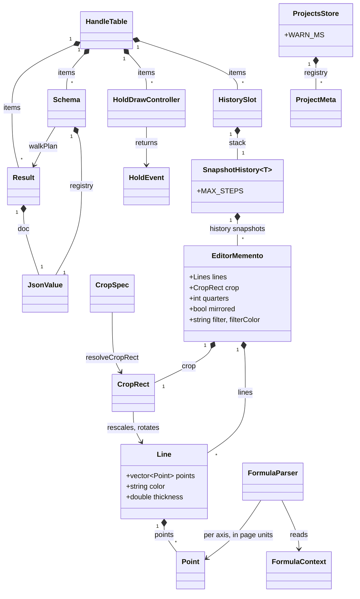

# Core architecture

The system-wide design is in the root [`ARCHITECTURE.md`](../ARCHITECTURE.md); the wasm build in [`WASM.md`](WASM.md).

The shared C++17 library: STL-only, codec-free, GUI-free. It moves bytes and numbers over
plain values and caller-owned RGBA8 buffers; everything platform-specific lives in the
adapters, which reach it through `wasm*Api.cpp`, a direct link, or `cliApi.h`.

## Layers

`models.hpp` / `text.hpp` / `rgba.hpp` → `geometry/`, `color/`, `parse/`, `json/` → `raster/`,
`page/`, `format/`, `state/`, `script/`, `opplan/` → `abi/` → `wasm*Api.cpp`, `cliApi.cpp`.

A group includes only what is to its left; `script/` lowers into the vocabulary of `parse/` and
`color/` rather than growing its own, spells its numbers through `json/jsNumber.hpp`, and the
library never includes `abi/`. By convention, no
lint: every group directory is on one flat include path, so includes are bare
(`"cropGeometry.hpp"`) and the direction shows only in the `#include` lines.

## Where things go

| Path | Holds | Rule |
|---|---|---|
| `models.hpp`, `text.hpp`, `rgba.hpp` | the shared value types (Point / Line), ASCII string helpers, the keyed word table | header-only; no group defines its own Point |
| `geometry/` | point math, hit-testing, crop-window geometry, chain edits | pure functions over `Point`/`Line` |
| `raster/` | whole-image RGBA8 transforms, the line rasteriser, per-pixel filters and contour, downscale | writes caller-owned buffers and never allocates an output image; the three-argument `applyContourRGBA` allocates one width×height luma plane per call, the four-argument form reuses the caller's scratch; `downscale` is adapter-only, so has no JS twin |
| `color/` | hex/keyword parsing, the luma formulas | `luma.hpp` names each formula once |
| `parse/` | the formula parser and its context, length tokens, crop and duration specs | recursive descent only — no `eval`; a name is the bound axis or a `FormulaContext` constant |
| `page/` | pixel ↔ page conversion, the `PAGE_SIZES` table, locale unit | the one page table; adapters read it over the ABI |
| `format/` | the hover tooltip's coordinate rows | string building only |
| `state/` | snapshot history, co-edit line merge, projects store + expiry, zoom/pan, the hold-draw state machine | in-memory only; persistence and the event loop belong to the GUI |
| `script/` | the `.stc` language: lexer, parser, templates, lowering, diagnostics, canonical dump | parses and lowers only — no file, URL or pixel |
| `json/` | a `JSON.parse`-equal reader under caps and a `JSON.stringify`-equal writer | nothing recurses on input |
| `opplan/` | the LLM op-plan validator over `opRegistry.json`, resolved per surface | the host passes registry text and reply; no model call, file or network; files prefixed `plan` on the shared include path |
| `abi/` | marshalling, the handle table, the lines codec, the `*.inc` export bodies | used by **both** `extern "C"` surfaces, never by the library |
| `wasm*Api.cpp` | the `extern "C"` ABI compiled to WebAssembly | CMake-only; plain STL, so tests compile them natively |
| `cliApi.{h,cpp}` | the `extern "C"` ABI the CLI and pystencil call | flat `double*` / RGBA8 buffers and C strings; no host allocation |
| `third_party/` | `doctest.h`, fetched at configure time | gitignored; tests only |

## Entities


```mermaid
classDiagram
    class Line {
        +vector~Point~ points
        +string color
        +double thickness
    }
    class SnapshotHistory~T~ {
        +MAX_STEPS
    }
    class EditorMemento {
        +Lines lines
        +CropRect crop
        +int quarters
        +bool mirrored
        +string filter, filterColor
    }
    class ProjectsStore {
        +WARN_MS
    }

    Line "1" *-- "*" Point : points
    SnapshotHistory "1" *-- "*" EditorMemento : history snapshots
    EditorMemento "1" *-- "*" Line : lines
    EditorMemento "1" *-- "1" CropRect : crop
    HistorySlot "1" *-- "1" SnapshotHistory : stack
    HandleTable "1" *-- "*" HistorySlot : items
    HandleTable "1" *-- "*" HoldDrawController : items
    HandleTable "1" *-- "*" Schema : items
    HandleTable "1" *-- "*" Result : items
    HoldDrawController --> HoldEvent : returns
    ProjectsStore "1" *-- "*" ProjectMeta : registry
    CropSpec --> CropRect : resolveCropRect
    CropRect --> Line : rescales, rotates
    FormulaParser --> FormulaContext : reads
    FormulaParser --> Point : per axis, in page units
    Schema "1" *-- "1" JsonValue : registry
    Schema --> Result : walkPlan
    Result "1" *-- "1" JsonValue : doc
```

| Entity | What it is | Owned by / lifetime | Relates to |
|---|---|---|---|
| `Point` (`models.hpp`) | one image-pixel coordinate | value; inside a `Line` or a flat `[x0,y0,…]` array | `Line` |
| `Line` (`models.hpp`) | one drawn polyline or closed area; `Lines` is `vector<Line>` | value; snapshotted by the history, burned by `raster/rasterize` | `Point`, `CropRect` |
| `SnapshotHistory<T>` (`state/HistoryStack.hpp`) | the undo/redo stack of whole snapshots, capped at `MAX_STEPS`; `HistoryStack` over `Lines`, `EditorHistory` over `EditorMemento` | the GUI canvas, or a `HistorySlot` over wasm | `Line`, `EditorMemento` |
| `EditorMemento` (`state/HistoryStack.hpp`) | one editor undo step: the lines and the view (crop, quarter turns, mirror, filter) | value inside an `EditorHistory` | `Line`, `CropRect` |
| `HistorySlot` (`wasmHistoryApi.cpp`) | an `EditorHistory` plus the last undo/redo step, held until the host reads it | a `HandleTable` entry, created and destroyed by the host | `SnapshotHistory`, `HandleTable` |
| `HandleTable<T>` (`abi/HandleTable.hpp`) | opaque int → owned instance; a stale or forged handle looks up to `nullptr` | one static table per stateful class | `HistorySlot`, `HoldDrawController`, `Schema`, `Result` |
| `HoldDrawController` (`state/holdDraw.hpp`) | the hold-to-draw gesture machine; time-injected, host screen space | the GUI's pointer handler, or a wasm handle | `HoldEvent` |
| `HoldEvent` (`state/holdDraw.hpp`) | one `HoldAction` with optional coordinates | value returned per pointer call | `HoldDrawController` |
| `ProjectMeta` (`state/ProjectMeta.hpp`) | one saved project's metadata; payloads are the adapter's | value inside `ProjectsStore::registry` | `ProjectsStore` |
| `ProjectsStore` (`state/ProjectsStore.hpp`) | the in-memory registry with an id index, name rules and expiry rules | the adapter that loads and persists it | `ProjectMeta` |
| `ScriptProgram` (`script/program/scriptProgram.hpp`) | one parsed `.stc`: tokens, diagnostics, blocks and lowered ops; immutable after `parse`, so the ABI hands out pointers into it | per parse; a `HandleTable` slot until destroyed | `Token`, `Diagnostic`, `Block`, `Op` |
| `Token`, `Diagnostic` (`script/types.hpp`) | a lexed span with its `TokenKind`; an error or warning with a stable code, span and message | values inside a `ScriptProgram` | `ScriptProgram` |
| `Block` (`script/types.hpp`) | one `@source` run, or the implicit project block, and its slice of the op stream | value inside a `ScriptProgram` | `Op` |
| `Op` (`script/types.hpp`) | one lowered operation: plain strings, numbers and lazily resolved length tokens | value inside a `ScriptProgram` | `Block`, `CropRect`, `Line` |
| `EditLedger` (`script/undo.hpp`) | the per-block record of which edits are still live, reconciled at each `@save` | lowering only | `Op` |
| `CropRect` (`geometry/cropGeometry.hpp`) | the crop window in original-image pixel space; lines are crop-local | value, beside a quarter-turn count or inside an `EditorMemento` | `CropSpec`, `Line`, `EditorMemento` |
| `CropSpec` (`parse/cropSpec.hpp`) | a parsed crop string, one length token per edge plus `aspect` | value, consumed by `resolveCropRect` | `CropRect` |
| `FormulaParser` (`parse/formulaParser.hpp`) | the `f(x)` / `f(y)` arithmetic evaluator; identity on empty or invalid input | stateless; `Eval` lives for one call | `Point`, `FormulaContext` |
| `FormulaContext` (`parse/formulaContext.hpp`) | the names a formula may read besides its own axis: the other axis, the page, the image, the display unit | value, built per call by the caller | `FormulaParser` |
| `JsonValue` (`json/jsonValue.hpp`) | one value as `JSON.parse` returns it, key order and number lexeme kept | value; destroyed without recursion | `Schema`, `Result` |
| `Schema` (`opplan/planSchema.hpp`) | `opRegistry.json` resolved for one surface — entries, forbidden names, `surfaceRules`, JSON caps | per host, from the registry text; a bad registry sets `error` | `JsonValue`, `Result` |
| `Result` (`opplan/planResult.hpp`) | one walked reply as one document; each warning and error a code plus its canonical message | per parse; a `HandleTable` slot until destroyed | `Schema` |

## Patterns

| Pattern | Where | Notes |
|---|---|---|
| Facade over core | `cliApi.h`, `wasm*Api.cpp` | the `extern "C"` seam beneath every adapter facade |
| Memento | `SnapshotHistory` | an entry is a whole snapshot, so a crop or turn is one undo step like a stroke |
| Strategy | `FilterMode` (`raster/imageFilter.hpp`), the `luma` forms | one hoisted `switch` picks the per-pixel kernel |
| Repository | `ProjectsStore` | registry + index behind `load` / `find` / `remove`; storage is the adapter's |
| State machine | `HoldDrawController` | press arms, moving aborts, a held tick starts drawing, release commits; times are injected |
| Interpreter (recursive descent) | `parse/formulaParser.cpp`, `DurationParser`, `parseCropSpec` | a function per grammar rule; `DepthGuard` caps recursion at `MAX_DEPTH` |
| Interpreter (lowering) | `script/` | a `.stc` lowers to a flat `Op` stream; adapters execute ops, never grammar |
| Rewind and replay | `EditLedger::reconcile` (`script/undo.hpp`) | `@undo` resolves at lowering, so no adapter computes an undo count |
| Handle table | `abi::HandleTable<T>` | stateful classes cross the ABI as opaque ints; an unknown handle is a no-op |
| Flat codec | `abi/linesCodec.hpp`, `abi/marshal.hpp` | `Lines` travel as a doubles buffer plus a UTF-8 text buffer; lengths are never trusted |
| One body, two symbols | `abi/shared.inc` with `STENCIL_ABI(wasmName, cliName)` | an export common to both ABIs is written once |
| Keyed word table | `Keyed<T>` (`text.hpp`) | every string → value resolution is one table, never an `if` chain |
| Two-pass reader | `json/jsonReader.cpp` over `json/jsonScan.hpp` | pass one proves and measures, pass two builds, so the caps bound memory too |
| Golden twin | `opplan/` against `browser/js/llm/plan/parser.js` | core emits the JS walk's normalized result byte for byte |
| Row-range kernel | the `*Rows` functions of `raster/` | `[y0, y1)` slices for a caller-owned thread pool; the core owns no threading |

## Design

- **A wasm call.** `browser/js/core/abi/stencilCore.js` checks every `EXPORTED_FUNCTIONS`
  entry and `cwrap`s it; a missing or stale artifact degrades to the JS fallback. Points pass
  as a flat array, stateful classes as `HandleTable` ints, `Lines` through the lines codec.
- **A CLI ABI call.** The adapter decodes the image and owns the RGBA8 buffer. A crop spec
  resolves through `parseCropSpec` → `resolveCropRect` to pixels; transforms write
  caller-sized buffers in place. Core never allocates, frees or retains caller memory.
- **The C ABI contract.** `cliApi.h` trusts its buffers and bounds-checks nothing: a
  `w`×`h` pixel buffer is exactly `w*h*4` bytes (R,G,B,A, contiguous rows, no stride), a
  `pixelCount` buffer `pixelCount*4`, a `pts` array `2*nPts` doubles, a `luma` plane `w*h`
  bytes; `src` and `dst` never overlap, and an in-place call takes one buffer. A row-range
  call takes a half-open `[y0, y1)` and clamps it, except `applyFilterRows`, which trusts `y1`.
  No pointer argument is retained past the call. A `const char*` argument is NUL-terminated
  or NULL (read as `""`); a returned `const char*` is static storage the caller never frees,
  except in the `script*` and `opplan*` families, whose strings point into their handle and
  stay valid until it is destroyed. An out-pointer may be NULL (not written) unless a
  function says otherwise, and a 0 or failure return leaves the out-pointers untouched. An
  unknown handle returns NULL, 0 or -1, never a crash.
- **A script run.** `ScriptProgram::parse` lexes, parses indentation-scoped blocks, expands
  templates, then lowers to a flat `Op` stream. Lengths stay tokens because a crop changes the
  image mid-script: `resolveOp` turns them into pixels against the host's current size.
  `contracts/stc/stc-contract.md` is normative.
- **A formula evaluation.** The caller applies `FormulaParser::apply` per axis after
  `pixelToPageRaw`; a failure leaves the value unchanged, and an unsupplied `FormulaContext`
  field is NaN, so its name fails rather than reading zero.
- **A history push and undo.** `push` drops the redo branch and trims past `MAX_STEPS`. Below
  the first entry sits a floor with no lines and the stack's base view, so undoing the first
  crop restores the crop before it.
- **A co-edit merge.** `mergeLines(server, local)` keeps the peer's lines, then each local line
  whose `lineDedupeKey` is new. The key spells each number by its exact bits, matching the JS
  `String(n)` key without linking float formatting into wasm.
- **Projects store expiry.** `ProjectMeta::expiresAt` (0 = keep forever) is seeded from fixed
  period presets, so no calendar library enters; only these pure rules reach wasm.
- **A plan walk.** A host creates a `Schema` from its registry text and hands each model reply
  to `walkPlan`: fences go, the first balanced `{…}` is read under the JSON caps, then actions
  pass the key-spec checks, native rules, normalization and `surfaceRules`. Each surface maps
  the result document onto its typed actions.

The one wire schema the core owns is the `Lines` snapshot of `abi/linesCodec.hpp`, in two
caller-owned buffers:

```
nums (double[]): lineCount, then per line:
                 pointCount, thickness, pointSize, locked, hidden,
                 len(color), len(style), len(fillColor), len(pointColor), len(name),
                 x0, y0, x1, y1, …
text (uint8[]):  color, style, fillColor, pointColor, name per line, UTF-8, concatenated
```

## Concurrency

Core owns no thread and starts none: every call runs on its caller's thread. The adapters
bring the parallelism — the CLI and pystencil slice whole-image work across a caller-owned pool
through the `*Rows` kernels, and pystencil calls the C ABI from a thread pool with the GIL
released, so a script's `__del__` may destroy a handle on any thread. Shared mutable state
exists only in the ABI's handle tables and the two memos they own; every other `static` in the
tree is a `static const` (or `constexpr`) table whose function-local initialisation C++11
makes thread-safe. `HandleTable` itself is unsynchronised: its ids are monotonic and never
reused, so a stale handle stays stale, and callers rely on the ABI's lock. The wasm module is
built without pthreads and runs on the browser's one thread, so its mutexes compile to
Emscripten's single-thread stubs.

| Owner | Runs on | Shares | Guard | On overflow or teardown |
|---|---|---|---|---|
| op-plan ABI (`abi/opplanShared.inc`) | any caller thread, both ABIs | the `Schema` and `Result` tables and `Schema`'s lazily built entries text | `opplanLock()`, one mutex taken by every export | destroy frees under the lock; a returned string lives until its handle is destroyed |
| script ABI (`abi/scriptShared.inc`) | any caller thread, both ABIs | the `ScriptProgram` table and its memoized `getDump()` | `scriptLock()`, one mutex taken by every export; `parse` runs before the lock, only the insert holds it | destroy frees under the lock; pointers into a program stay valid until `scriptDestroy`, since it is immutable after `parse` |
| holdDraw and history tables (`wasmStateApi.cpp`, `wasmHistoryApi.cpp`) | the browser's main thread (wasm only) | their `HandleTable`s | none: wasm-only, single-threaded | an unknown handle is a no-op |
| `*Rows` kernels (`raster/`) | the adapter's pool threads | the caller's buffers, disjoint row ranges | none needed: re-entrant, no statics, each writes only its own rows | `applyFilterRows` trusts `y1`; the others clamp |
| contour two-phase (`buildLumaRows` → `sobelRows`) | the adapter's pool threads | the caller's `luma` plane | the caller's barrier: every luma row is built before any Sobel row runs, since Sobel reads one row past each end of its range | — |

## Rules

1. **Parity.** Each module ports the browser call site its header's doc banner names,
   identical down to edge cases (the helpers with no browser call site — `abi/HandleTable.hpp`,
   `abi/marshal.hpp`, `cliApi.h`, `raster/downscale.hpp`, `raster/pixelBlend.hpp`,
   `color/hexNibble.hpp`, `rgba.hpp`, `text.hpp` — name none); its tests port `browser/tests/`, and
   `browser/tests/wasm/wasm-parity.test.js` holds the compiled core to the JS fallback op-for-op.
2. **No `eval`.** `parse/formulaParser` is recursive descent over `+ - * / ** ( )`, both axes
   and the `FormulaContext` constants — `**` right-associative, empty = identity, division by
   zero, overflow or an unknown or unsupplied name = invalid — agreeing with
   `browser/js/core/parse/formulaEngine.js` down to the shared `MAX_DEPTH`.
3. **STL-only, codec-free, GUI-free.** No Qt, image codec, DOM, HTTP, third-party library or
   model call, and JSON only through `json/`.
4. **Three source lists, three include lists.** The `core/*.cpp` set is held in
   `STENCIL_CORE_SOURCES` (`CMakeLists.txt`), the array in `cli/build.zig` and the list in
   `pystencil/build.py`, every group directory in `STENCIL_CORE_INCLUDE_DIRS`,
   `core_include_dirs` and `INCLUDE_DIRS`; the `wasm*Api.cpp` units are CMake-only.
5. **Two ABIs, one body.** An export in both ABIs is written once in `abi/shared.inc`. The
   wasm exports are `EXPORTED_FUNCTIONS` in `CMakeLists.txt`; an export absent from it reaches
   the browser only through the JS fallback.
6. **Build targets.** `stencil_core` (the static library), `stencil_tests` (off under
   Emscripten and in the desktop build), `stencil_wasm` (only under `emcmake`).
7. **Never throw.** The wasm build has no exceptions: no `try`, `catch` or `throw`, no `.at(`,
   `std::sto*` or `std::regex`; a failure is a value. `tests/noThrowLint.test.cpp` scans the tree.

## Tests

Each suite ports the matching `browser/tests/` file. The ABI units are plain STL, so
`stencil_tests` drives every export natively; `tests/abi/` calls each `*.inc` export under both
spellings and asserts they agree, and drives the op-plan and script handle tables from
concurrent threads. `tests/twinDrift.test.cpp` reads constants out of their
canonical browser `.js`, so a twin edited alone fails natively. The browser's
`wasm-parity*.test.js` drive the compiled module and the JS fallback through one script.

Malformed input yields a diagnostic, never a crash: the script corpus, the JSON reader and the
op-plan walk also run on truncated input. `scriptFixtures.test.cpp` compares the corpus's dump
and diagnostics byte for byte; `tests/json/` pins the reader and writer to `JSON.parse` /
`JSON.stringify`; `tests/opplan/` walks every op-plan case against the JS walk's normalized
output byte for byte.

`tests/raster/` pins every `*Rows` kernel against its whole-image call. The opt-in `bench`
suite asserts algorithmic ratios, never wall-clock time. The suite also builds under
`STENCIL_SANITIZE` (ASan + UBSan), which CI runs, so a memory error or UB fails the push.
