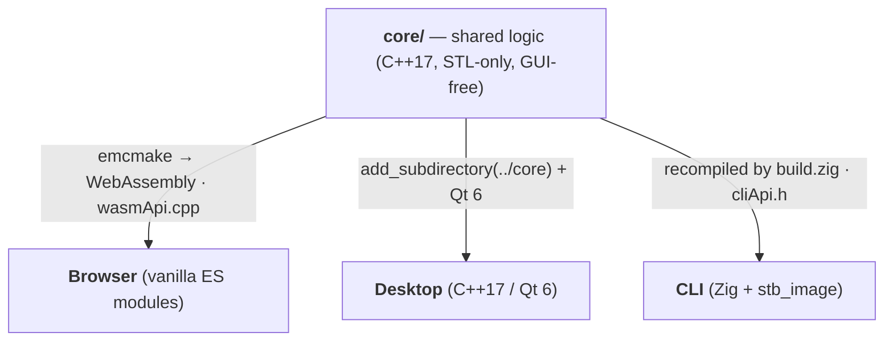

# Stencil — Core (C++17, STL-only)

The shared logic that backs every Stencil front-end. A small, **GUI-free, STL-only**
C++17 library: formula parsing, geometry & hit-testing, colour, pixel↔page (cm)
conversion, crop, a software line rasteriser, image filters, undo/redo history and
project storage. It never includes Qt, touches the DOM, or links a codec — pure
functions over plain values and caller-owned RGBA8 buffers. For the project overview
see the [repository README](../README.md).

One implementation, three consumers:



- **Desktop** ([`../desktop/`](../desktop/)) links the static `stencil_core` library via
  `add_subdirectory(../core)`.
- **CLI** ([`../cli/`](../cli/)) recompiles the same `.cpp` sources from `build.zig` and
  drives them over the [`cliApi.h`](cliApi.h) `extern "C"` ABI.
- **Browser** ([`../browser/`](../browser/)) compiles [`wasmApi.cpp`](wasmApi.cpp) to
  **WebAssembly** and runs that compiled C++ at runtime, with a behavior-identical JS
  fallback when wasm isn't built — see [WASM.md](WASM.md).

## Dependencies

By design the core sits at the **bottom of the dependency policy**: the apps add at most
Qt 6 (desktop), Zig + stb_image (CLI) or nothing (browser), but the core itself depends on
**only the C++17 standard library** — plus one header for its own tests.

| Purpose | Library | How it's provided |
|---|---|---|
| Runtime | **C++17 STL** | the standard library — nothing else |
| Unit tests | **Doctest** (pinned v2.4.11) | single header fetched into `third_party/doctest.h` at configure time with SHA-256 verification — not committed |

## Layout

Sources are grouped by role; headers are included bare across groups.

```
models.hpp            # shared Point / Line / Lines value types (mirror the browser line object)
text.hpp              # header-only ASCII string helpers (toLowerAscii, trim, …) shared by groups
geometry/
  geometry            # distToSegment · shouldCloseShape · findLineAt / nearest point / segment
  cropGeometry        # axis-aligned crop window math (page-locked aspect, lossless re-edit)
  imageOps            # whole-image RGBA8 transforms: crop · quarter-turn rotate · solid fill
  rasterize           # software rasteriser: burns layout Lines into an RGBA8 buffer
color/
  color               # hex parse (#rrggbb) + hexToRgba — port of utils.js colour helpers
  colorNames          # CSS keyword / #rgb..#rrggbbaa / 'transparent' → RGBA resolver
  imageFilter         # bw / sepia / invert / duotone-tint per-pixel math + Sobel contour (canonical, shared)
parse/
  formulaParser       # safe recursive-descent f(x)/f(y) parser (the eval-free replacement)
  lengthTokens        # '3cm' '-4in' '50%' '120px' bare-number length tokens
  cropSpec            # parse + resolve the CLI crop string ("x1=.. x2=.. y1=.. y2=..")
page/
  pageMetrics         # pixel ↔ page (cm) conversion + the PAGE_SIZES table (full ISO A0–C10)
  tooltipRows         # builder for the hover-tooltip coordinate rows (Pixel / Page / To edge)
  localeUnit          # metric vs imperial default display unit (cm / in)
  hotkeyFormat        # portable key-sequence ("Ctrl+Shift+Z") → native / macOS (⇧⌘Z) display
state/
  historyStack        # line-snapshot undo/redo with the browser's exact cursor semantics
  projectsStore       # in-memory project registry + one-week expiry sweep (I/O lives in the GUI)
  zoomPan             # zoom clamp + anchored / rect zoom math
wasmApi.cpp           # extern "C" ABI compiled to WebAssembly for the browser (see WASM.md)
cliApi.{h,cpp}        # extern "C" ABI consumed by the Zig CLI (RGBA8 buffers + C strings)
tests/                # Doctest suite — one suite per module, plus the wasm and CLI ABIs
third_party/          # vendored doctest.h (fetched on demand, gitignored)
CMakeLists.txt
WASM.md               # how the core is built to wasm and wired into the browser
```

## Build & test

```bash
cmake -S core -B core/build -DCMAKE_BUILD_TYPE=Release
cmake --build core/build -j
ctest --test-dir core/build --output-on-failure   # or run core/build/stencil_tests directly
```

(From inside this directory drop the `core` prefix: `cmake -S . -B build`.)

Targets:

- **`stencil_core`** — the static library of shared logic (the desktop app pulls this in
  via `add_subdirectory`; the CLI recompiles the sources instead of linking it).
- **`stencil_tests`** — the Doctest binary (one suite per module, plus `wasmApi` and
  `cliApi`). Built when `STENCIL_CORE_BUILD_TESTS=ON` (the default) and **off under
  Emscripten**; the desktop build turns it off and defers to this dedicated core build.
- **`stencil_wasm`** — produced **only** when configured through `emcmake` (which defines
  `EMSCRIPTEN`); a normal native build never enters that branch. See [WASM.md](WASM.md).

`wasmApi.cpp` is plain STL, so it is also compiled **natively into `stencil_tests`** and
fully exercised even on a machine without `emcc`.

> The Zig CLI recompiles the core's `.cpp` files directly rather than linking the CMake
> library, so the file list in [`../cli/build.zig`](../cli/build.zig) must stay in sync with
> `STENCIL_CORE_SOURCES` in [`CMakeLists.txt`](CMakeLists.txt).

## Design principles

**Behavioral parity with the browser app.** Each core module is a port of a specific
browser JS call site (noted at the top of every header, e.g. `geometry` ← `utils.js`,
`pageMetrics` ← `drawingApp.js`, `historyStack` ← `historyStack.js`) and is kept
**behaviorally identical** to it — down to edge cases like the history stack's "step 0 →
empty lines, step -1" undo. The test cases are themselves ported from `browser/tests/`, so
the C++ and JS implementations stay in lock-step by construction; the WebAssembly parity
suite (`browser/tests/wasm-parity.test.js`) then asserts the compiled core agrees with the
JS reference op-for-op.

**One deliberate divergence — no `eval`.** The browser's `formulaEngine.js` evaluates
`f(x,y)` transforms with `new Function(...)` (JavaScript `eval`). The core's
[`formulaParser`](parse/formulaParser.hpp) is instead a real **recursive-descent parser**
for `+ - * / ** ( )` and a single variable — right-associative for `**`, treating an empty
expression as identity and reporting division-by-zero / overflow as invalid, matching the
engine's validate/apply contract. No `eval`, no arbitrary identifiers (`foo(x)` is a parse
error). This is the implementation the browser runs once compiled to wasm.

**STL-only, codec-free, GUI-free.** The core moves bytes and numbers; everything
platform-specific lives in the adapters. Image codecs, HTTP, video and JSON are the Zig
CLI's concern; QImage / canvas rendering, file persistence and the event loop are the GUI
apps'. The `extern "C"` surfaces ([`wasmApi.cpp`](wasmApi.cpp), [`cliApi.h`](cliApi.h))
keep that boundary explicit — flat `double*` / RGBA8 buffers and C strings, no embind, no
host allocation.
