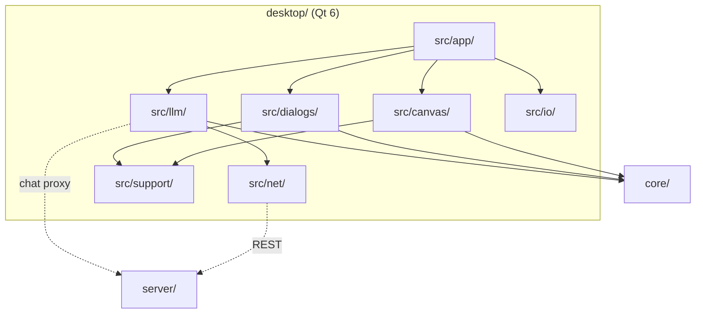

# Desktop app architecture

The system-wide design — the parity contract, canonical data, the layer model, the pattern vocabulary — is in the root [`ARCHITECTURE.md`](../ARCHITECTURE.md).

## Layers

model → controllers → `net/`, `io/` → `support/` → `canvas/`, `dialogs/`, `llm/` → `app/`.
`tests/layerBoundary.headless.cpp` enforces it. The model ring is `CoreFacade` +
`DocumentModel`.

## Where things go

| Path | Holds | Rule |
|---|---|---|
| `src/app/` | `main.cpp`, `launchOptions`, the controllers, and `MainWindow` — one `MainWindow.hpp` (moc runs on the header) with method groups spread over `MainWindow*.cpp` TUs | composition only; no logic a controller could hold; a new method group is a new TU, not a longer one |
| `src/canvas/` | `CanvasWidget` (QPainter), split into paint / press / hold TUs, plus the tooltip | pixel, geometry and page math come from `core/`, never re-derived |
| `src/dialogs/` | one dialog per file: settings, projects, blank, crop, connect, links, info, shortcuts, expiration, assistantSettings | every prompt/picker goes through `promptModal` / `chooseModal` — no `QInputDialog` / `QMessageBox` |
| `src/llm/` | chat dock + widgets, `LlmClient`, `QtLlmTransport`, op registry/schema/plan, `planExecutor` | plans validate against the shared registry before execution; the executor calls the same appliers the toolbar uses |
| `src/io/` | `fileStore` (settings, projects, autosave, `.stencil` (de)serialization), `mediaLoader` (image/video) | QtCore-only serialization; QImage codec work stays in `MainWindow` |
| `src/net/` | `serverClient` (REST + `ConnectionManager`), `connectionStore` (0600 tokens), `fetchGuard` | `fetchGuard` is the surface's one SSRF guard, a port of `cli/src/net.zig`; tokens never go in `QSettings` |
| `src/support/` | theme (the shared ID-selector QSS), motion (`motionPrefs`, `dustKit`, `ThemeSwapOverlay`, `DisintegrateOverlay`, `scrollReveal`), widgets (`modalChrome`, `makeToolSection`), platform helpers | QSS lives here only — a widget's own `setStyleSheet` silently changes child metrics |
| `resources/` | `app.qrc`: `app.qss` and the browser's shared config JSON as qrc aliases | shared tables are aliased from `browser/js/config/`, never copied |
| `packaging/` | plist template, `.desktop`, mime xml, `make-icns.sh` | nothing binary committed; the icon is derived from `browser/favicon.svg` |
| `cmake/` | `StencilSources`, `StencilTests`, `StencilPackaging` | source lists live here, not in `CMakeLists.txt` |
| `tests/` | headless suites per concern, `MainWindow.<area>.gui.cpp` (one QtTest binary per area over one `stencil_gui_objs` library) and the layer lint | every suite reports its own failures |

## Rules

1. **The core is the logic.** Filters, crop, rotation, page coordinates, history, project
   expiry all come from the linked `stencil_core`; pixels match the browser by construction.
2. **Shared data is aliased, not copied.** Hotkeys, info text, theme tokens, motion tunings
   and the LLM assets are the browser's files in the qrc.
3. **REST only.** The server connection is `QNetworkAccessManager` REST — no `QWebSocket`,
   no third-party WebSocket library, no TCP edit channel; server projects refresh by polling
   while the Projects dialog is open.
4. **Secrets.** Connection tokens live in the 0600 `connectionStore`; the LLM API key in the
   settings JSON only. `STENCIL_LLM_*` is never forwarded to child processes.
5. **Motion** is gated by `support/motionPrefs.hpp` (`drawingAnimations`, `motionMode`,
   `STENCIL_NO_ANIM=1` overrides) and mirrors `browser/js/ui/dustCloud.js` value for value.
   Sprite blits, not `drawEllipse`; a `QTimer` at the screen's refresh rate, not
   `QVariantAnimation`.
6. **State directory** is baked at build time (`STENCIL_STATE_DIR`): the gitignored
   `desktop/.stencil/` in dev, the per-user config dir when packaged
   (`-DSTENCIL_DEV_STATE_DIR=OFF`).
7. **Every user-facing path is one path.** OS open events, drag-and-drop, file arguments and
   deep links all route through `openPathFromOS`; the model's `openFile`/`save` ops go
   through the same, gated to paths the user wrote in the conversation.

## Packaging

`cmake/StencilPackaging.cmake` drives CPack (`macdeployqt` / `windeployqt`; best-effort on
Linux, Qt ≥ 6.3). The `.stencil` type and the `stencil://` scheme are registered on macOS
(`com.stencil.project` UTI, `CFBundleDocumentTypes`, `CFBundleURLTypes` in
`packaging/MacOSXBundleInfo.plist.in`) and Linux (`stencil-mime.xml`, `stencil.desktop`).
The macOS icon is a flat `.icns` generated at configure time from `browser/favicon.svg`.
