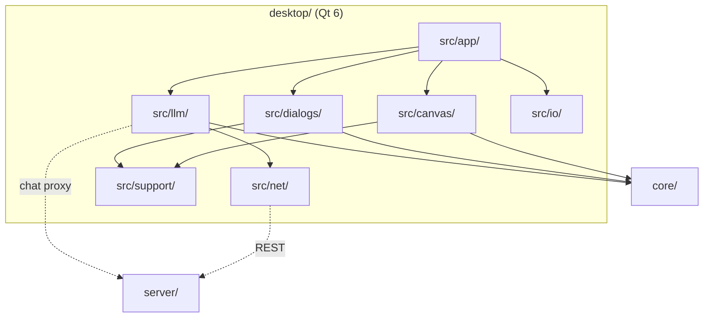
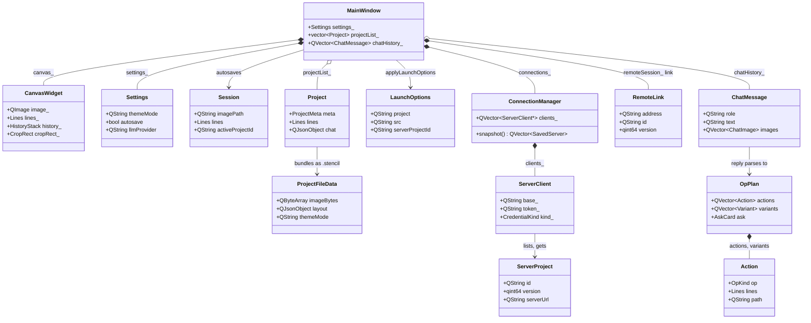

# Desktop app architecture

The system-wide design — the parity contract, canonical data, the layer model, the pattern vocabulary — is in the root [`ARCHITECTURE.md`](../ARCHITECTURE.md).

## Layers

the core seam (`src/model/` plus the files the lint lists) → controllers → `net/`, `io/` →
`support/` → `canvas/`, `dialogs/`, `llm/` → `app/`. `tests/layerBoundary.headless.cpp` enforces it: nothing below `app/` includes an `app/`
header, `dialogs/` never includes `canvas/`, and a `core/` header enters the GUI only through
the files the lint lists as the core seam. The document state itself lives in `CanvasWidget`
(`core::Lines` + `core::HistoryStack`); the controllers are the `*Controller` classes and
`RemoteSession` in `src/app/`.

## Where things go

| Path | Holds | Rule |
|---|---|---|
| `src/app/` | `main.cpp`, `launchOptions`, the controllers, and `MainWindow` — one `MainWindow.hpp` (moc runs on the header) with method groups spread over `MainWindow*.cpp` TUs | composition only; no logic a controller could hold; a new method group is a new TU, not a longer one |
| `src/canvas/` | `CanvasWidget` (QPainter), split into paint / press / hold TUs, plus the tooltip | pixel, geometry and page math come from `core/`, never re-derived |
| `src/model/` | Qt-shaped wrappers over a core type the GUI needs whole: `ScriptDoc` over `core/script` (tokens, diagnostics, ops, and the `core::CropRect` / `core::Lines` an op resolves to) | the core seam — `model/` may include `core/` freely, and nothing above it may |
| `src/dialogs/` | one dialog per file: settings, projects, blank, crop, connect, links, info, shortcuts, expiration, assistantSettings, script | every prompt/picker goes through `promptModal` / `chooseModal` — no `QInputDialog` / `QMessageBox` |
| `src/llm/` | chat dock + widgets, `LlmClient`, `QtLlmTransport`, op registry/schema/plan, `planExecutor` | plans validate against the shared registry before execution; the executor calls the same appliers the toolbar uses |
| `src/io/` | `fileStore` (settings, projects, autosave, `.stencil` (de)serialization), `mediaLoader` (image/video) | QtCore-only serialization; QImage codec work stays in `MainWindow` |
| `src/net/` | `serverClient` (REST + `ConnectionManager`), `connectionStore` (0600 tokens), `fetchGuard` | `fetchGuard` is the surface's one SSRF guard, a port of `cli/src/net.zig`; tokens never go in `QSettings` |
| `src/support/` | theme (the shared ID-selector QSS), motion (`motionPrefs`, `dustKit`, `ThemeSwapOverlay`, `DisintegrateOverlay`, `scrollReveal`), widgets (`modalChrome`, `makeToolSection`), platform helpers | QSS lives here only — a widget's own `setStyleSheet` silently changes child metrics |
| `resources/` | `app.qrc`: `app.qss` and the browser's shared config JSON as qrc aliases | shared tables are aliased from `browser/js/config/`, never copied |
| `packaging/` | plist template, `.desktop`, mime xml, `make-icns.sh` | nothing binary committed; the icon is derived from `browser/favicon.svg` |
| `cmake/` | `StencilSources`, `StencilTests`, `StencilPackaging` | source lists live here, not in `CMakeLists.txt` |
| `tests/` | headless suites per concern, `MainWindow.<area>.gui.cpp` (one QtTest binary per area over one `stencil_gui_objs` library) and the layer lint | every suite reports its own failures |

## Entities

| Entity | What it is | Owned by / lifetime | Relates to |
|---|---|---|---|
| `MainWindow` | The editor window and mediator; holds settings, the project list, the active project id and the chat history | `main.cpp`, one per process (a second for "open in new window") | Everything below through signals and `Hooks` structs |
| `CanvasWidget` | The document state: the working pixels, committed `core::Lines`, the in-progress `core::Line`, the `core::HistoryStack`, crop and rotation | `MainWindow`, window lifetime; `CanvasPlanTarget` owns offscreen copies for variant sandboxes | Every edit applier, `SelectionPanel`, `ChatPlanTarget` |
| `Settings` | Persisted preferences and default visuals (`io/fileStore.hpp`); the browser's `DEFAULT_VISUALS` plus the desktop-only keys | `MainWindow::settings_`, loaded at boot, saved on change | `LlmSettings` is derived from its `llm*` fields |
| `Session` | The autosaved in-progress drawing, the browser's localStorage layout blob twin | Written by `SessionController`'s debounce, read once at boot | `CanvasWidget` state, `activeProjectId` |
| `Project` | One saved local project: `core::ProjectMeta` plus layout, crop, chat and view | `MainWindow::projectList_`, persisted by `fileStore::saveProjects` | `core::ProjectsStore` for the registry; `ProjectFileData` for export |
| `ProjectFileData` | The portable `.stencil` document (image bytes, layout, metadata, theme, optional chat); canonical definition `browser/js/core/projectFile.js` | Transient, built by `buildStencilBytes` or parsed by `openProjectFile` | `Project`, the linked file watcher |
| `ScriptDoc` | One parsed `.stc`: its token stream, its diagnostics and the op stream the core lowered it to, plus the resolvers that turn an op into a `core::CropRect` or a `core::Line` | Transient, rebuilt on every keystroke in `ScriptDialog` and once per run | `ScriptHighlighter` colours from its tokens; `scriptRun` drives `PlanTarget` from its ops |
| `LaunchOptions` | Parsed argv or a `stencil://` link; the desktop twin of the browser deep-link | `main.cpp`, consumed once by `applyLaunchOptions` | `MediaLoader`, `openServerLaunch` |
| `ConnectionManager` | The set of live `ServerClient`s; its `changed()` persists the `SavedServer` snapshot | `MainWindow`, created lazily by `ensureConnections` | `connectionStore`, `RemoteSession` |
| `ServerClient` | One REST connection: base, bearer token, credential kind, status | `ConnectionManager::clients_` | `ServerProject`, `LiveFeed` |
| `ServerProject` | A server project record; mirror of `server/internal/protocol` `ProjectRecord`, which is canonical | Transient reply value stamped with `serverUrl` | `RemoteLink` on open, `ProjectsDialog` rows |
| `RemoteLink` | The bound server project (address, id, version) of the open editor | `RemoteSession::link_`, bound on open, unbound on close | `RemoteSyncController` pushes and polls it |
| `ChatMessage` | One chat turn with attached images; replayed in full each call | `MainWindow::chatHistory_`, cleared with the conversation | `LlmClient::chat`, `fileStore::buildChatDoc` |
| `OpPlan` | A parsed, registry-validated assistant reply; the contract in `contracts/llm/llm-contract.md` is canonical | Transient, from `parseOpPlan` to `executePlan` | `Action`, `Variant`, `AskCard`, `ExecResult` |
| `Action` | One op of a plan, a tagged union on `OpKind` | Inside `OpPlan` | `PlanTarget` appliers |

## Patterns

| Pattern | Where | Notes |
|---|---|---|
| Facade over core | `CanvasWidget` over `core::HistoryStack`, `cropGeometry`, `holdDraw`, `pageMetrics`; `PlanTarget` over the same appliers | Toolbar, hotkeys and LLM plans mutate through one set of appliers |
| Mediator | `MainWindow` | Wires `CanvasWidget`, `ChatDock`, `SelectionPanel`, `RemoteSession` and the controllers; collaborators reach it only through `Hooks` structs |
| Command | `core::HistoryStack` inside `CanvasWidget` (`commitHistory`, `undo`, `redo`); `PlanTarget::stepHistory` | Every undoable edit is a pushed `core::Lines` snapshot, reverted by the same path |
| Strategy | `LlmClient::chatOllama` / `chatOpenAi` / `chatServer` picked by `LlmSettings.provider`; `CanvasWidget::setFilter` modes; `MotionMode` → `ParticleStyle` | Table lookup, no growing `if` chain |
| Observer | Qt signals: `CanvasWidget::changed`, `selectionChanged`; `ConnectionManager::changed`; `LiveFeed::projectUpdated`; `MediaLoader::loaded`/`failed`; `ChatDock::sendRequested` | Async completions run on the GUI thread and guard captures with `QPointer` |
| Repository | `fileStore` (settings, session, projects, secrets, hotkeys), `connectionStore`, `core::ProjectsStore` | Callers see typed structs, never JSON or paths |
| Chain of Responsibility | `fetchGuard::checkAsync` → `request` → `get` (`isBlockedHost`, `resolvesToBlocked`, no redirects, byte cap) | The surface's one guard on every untrusted `http(s)` fetch |
| Adapter | `LlmTransport` → `QtLlmTransport` (production) or a test mock; `PlanTarget` → `ChatPlanTarget` (live editor) / `CanvasPlanTarget` (offscreen sandbox) | One seam per boundary so the tests run offline |
| Debounced write | `SessionController` (`AUTOSAVE_MS`, `VIEW_SAVE_MS`), `RemoteSyncController` push/poll/reload timers, `io/deferredWrite`, `scheduleStencilAutosave` | Gates (`incognito`, `remoteUnsynced`) are checked at fire time |
| Guarded write loop | `ServerClient::runGuardedWriteAsync`, `RemoteSession::putVersionGuardedAsync` | Version echoed on PUT; a 409 re-reads, merges and retries a bounded number of times |
| Golden pin / fixture walker | `tests/uiPins.headless.cpp`; `opPlanFixtures`, `llmWireFixtures`, `storeFixtures`, `deepLinkFixtures` | Pins guard pixels and QSS; walkers prove the shared `browser/js/config` corpora on this surface |

## Design

- **Boot.** `main.cpp` builds `StencilApplication` (it buffers macOS `QFileOpenEvent`s until a
  window registers), sets the Fusion style, and parses `LaunchOptions` before any window so
  bad arguments exit cleanly. `MainWindow(restoreLast)` loads `Settings`, restores the
  `Session` unless the launch is incognito, and queues `autoConnectServers` over the saved
  `SavedServer` rows. After `show()`, `applyLaunchOptions` applies theme, then one source by
  priority: `--project`, a `stencil://` server reference, `--src`, a positional file. Exit
  flushes `deferredWrite`.
- **A canvas press.** `CanvasWidget::mousePressEvent` resolves the gesture by precedence
  (context menu, pan, alt-drag, zoom-rect, multi-select, drawing click), converts the widget
  point with `toImageSpace`, and mutates `currentLine_` / `lines_` through core geometry.
  `commitHistory` pushes the `core::Lines` snapshot and emits `changed()`;
  `MainWindow::onCanvasChanged` refreshes actions, rebuilds the `SelectionPanel` rows from
  core page coordinates, and schedules the session autosave, the remote push and the
  `.stencil` autosave. The repaint reads its pixels from the core filter and crop results.
- **Running a script.** The Data section's script action opens `ScriptDialog`, a plain editor
  whose every keystroke re-parses the text through `ScriptDoc` and hands the token stream to
  `ScriptHighlighter`; a re-colour is itself a document change, so the paint is guarded
  against the `textChanged` it causes. Nothing is REPORTED until Run: only then do the
  diagnostics reach the strip under the editor and the wavy underlines reach the tokens.
  Run accepts the dialog, and `MainWindow::openScript` drives `scriptRun` over a
  `ChatPlanTarget` — the same `PlanTarget` an assistant op plan uses, so a scripted edit and
  a clicked one take one path. A script with any error runs nothing; a failure part-way keeps
  the edits already applied and names the line. A `.stc` dropped on the open window fills the
  editor; dropped on the window behind it, or opened from the OS, it runs at once.
- **Open and save `.stencil`.** `openPathFromOS` routes by suffix: `.json` to the layout
  applier, `.stencil` to `openProjectFile`, `.stc` to `runScriptFile`, anything else to
  `MediaLoader`. `openProjectFile`
  reads the bytes, `fileStore::parseProjectFile` yields `ProjectFileData`, the image is decoded,
  `loadImageWithLayout` fills the canvas, a local `Project` is created and `linkStencilFile`
  installs the file watcher. `saveProjectFileAs` builds `ProjectFileData` from the untouched
  source bytes (or a PNG re-encode), `buildLayoutJson`, the theme and the opt-in chat, writes
  `fileStore::buildProjectFile` and links the file; later edits reach it through
  `scheduleStencilAutosave`, and an external change comes back through `applyStencilExternal`.
- **Server connect and project fetch.** `ConnectDialog` or `openServerLaunch` calls
  `ensureConnections()` then `ConnectionManager::connectToAsync(url, token, kind)`; each
  `ServerClient` speaks REST over `QNetworkAccessManager` with a bearer token and a 20 s bound,
  and `changed()` persists `snapshot()` through `connectionStore` (tokens in the 0600 secrets
  file). `openServerProject` chains `getProjectAsync` (a `ServerProject` plus layout),
  `downloadFileAsync("original")`, decode, `loadImageWithLayout`, and `RemoteLink::bind`.
  Writes go through `RemoteSession::putVersionGuardedAsync`; `RemoteSyncController` debounces
  pushes, polls while linked, and subscribes `LiveFeed` (raw TCP NDJSON, plaintext only).
- **An LLM turn.** `ChatDock::sendRequested` → `MainWindow::onChatSend` derives `LlmSettings`
  from `Settings`, appends the `ChatMessage` (text plus downscaled attachments) to
  `chatHistory_`, and calls `LlmClient::chat` with the system prompt assembled from the
  shared op registry, over `QtLlmTransport`. `onChatReply` runs `parseOpPlan` (validated by
  `OpSchema::desktop()`), builds a `ChatPlanTarget(*this)` and `executePlan`; the
  `ExecResult` notes, variants (rendered in `CanvasPlanTarget` sandboxes) and ask card are
  posted to the dock, and a changed result runs the same refresh and autosave as a toolbar edit.
- **Packaging.** `cmake/StencilPackaging.cmake` drives CPack (`macdeployqt` / `windeployqt`;
  best-effort on Linux, Qt ≥ 6.3). The `.stencil` type and the `stencil://` scheme are
  registered on macOS (`com.stencil.project` UTI, `CFBundleDocumentTypes`, `CFBundleURLTypes`
  in `packaging/MacOSXBundleInfo.plist.in`) and Linux (`stencil-mime.xml`, `stencil.desktop`).
  The macOS icon is a flat `.icns` generated at configure time from `browser/favicon.svg`.

## Rules

1. **The core is the logic.** Filters, crop, rotation, page coordinates, history, project
   expiry all come from the linked `stencil_core`; pixels match the browser by construction.
2. **Shared data is aliased, not copied.** Hotkeys, info text, theme tokens, motion tunings
   and the LLM assets are the browser's files in the qrc.
3. **REST only.** The server connection is `QNetworkAccessManager` REST — no `QWebSocket`,
   no third-party WebSocket library, no TCP edit channel; server projects refresh by polling
   while the Projects dialog is open.
4. **Secrets.** Connection tokens live in the 0600 `connectionStore`; the LLM API key in the
   settings JSON only. `STENCIL_LLM_*` is never forwarded to child processes.
5. **Motion** is gated by `support/motionPrefs.hpp` (`drawingAnimations`, `motionMode`,
   `STENCIL_NO_ANIM=1` overrides) and mirrors `browser/js/ui/dustCloud.js` value for value.
   Sprite blits, not `drawEllipse`; a `QTimer` at the screen's refresh rate, not
   `QVariantAnimation`.
6. **State directory** is baked at build time (`STENCIL_STATE_DIR`): the gitignored
   `desktop/.stencil/` in dev, the per-user config dir when packaged
   (`-DSTENCIL_DEV_STATE_DIR=OFF`).
7. **Every user-facing path is one path.** OS open events, drag-and-drop, file arguments and
   deep links all route through `openPathFromOS`, which forks on suffix: `.json` a layout,
   `.stencil` a project, `.stc` a script to RUN, anything else an image or video. The model's
   `openFile`/`save` ops go through the same, gated to paths the user wrote in the
   conversation.

## Tests

`cmake/StencilTests.cmake` registers every suite through one `stencil_headless_test()` call:
offscreen (`QT_QPA_PLATFORM=offscreen`), with an isolated `STENCIL_STATE_DIR` per test, so
nothing touches the developer's app state. Headless suites are one per concern
(`tests/<concern>.headless.cpp`: crop, hold-draw, chain edit, project file, transfer, deep
link, server auth, co-edit, LLM op plan, executor, script runner, script dialog, settings,
fetch guard, motion prefs, and the rest), each reporting its own failures. The GUI suites are `MainWindow.<area>.gui.cpp`,
one QtTest binary per area (`stencil_mainwindow_<area>_gui`) linked over the single
`stencil_gui_objs` object library and sharing `MainWindow.gui.hpp`; they drive the real
`MainWindow` with `STENCIL_NO_ANIM=1`. The fixture walkers (`opPlanFixtures`,
`llmWireFixtures`, `storeFixtures`, `deepLinkFixtures`, `configCanon`, `canonAssets`) prove
the shared `browser/js/config` corpora on this surface; the LLM suites substitute a mock
`LlmTransport`, so the whole suite runs offline. `layerBoundary.headless.cpp` is the import
lint. `uiPins.headless.cpp` pins the app stylesheet hash per theme and accent
(`tests/pins/stylesheets.txt`) and the rendered states at device pixel ratio 1 and 2
against `tests/pins/<platform>/`; the render baselines are platform-specific, and a platform
without them skips that half. The desktop build links `core/` via `add_subdirectory(../core)`
with the core's own doctest suite off; those tests run under core's own target.
