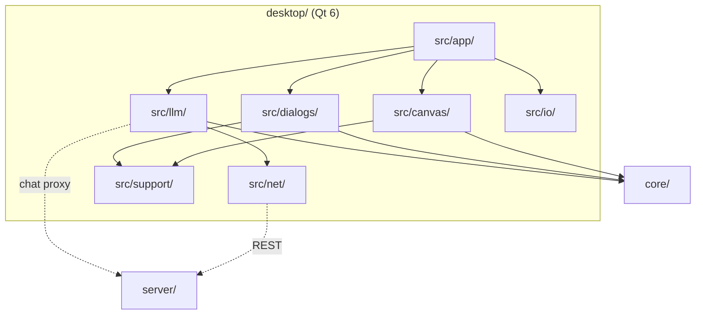
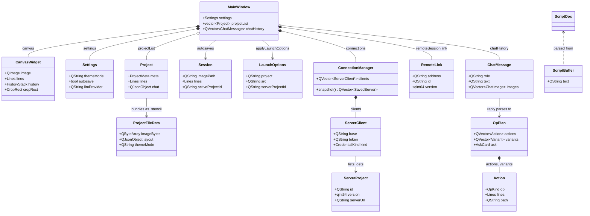

# Desktop app architecture

The system-wide design — the parity contract, canonical data, the layer model, the pattern vocabulary — is in the root [`ARCHITECTURE.md`](../ARCHITECTURE.md).

## Layers

the core seam (`src/model/` plus the files the lint lists) → controllers → `net/`, `io/` →
`support/` → `canvas/`, `dialogs/`, `llm/` → `app/`. `tests/layerBoundary.headless.cpp` enforces it: nothing below `app/` includes an `app/`
header, `dialogs/` never includes `canvas/`, and a `core/` header enters the GUI only through
the files the lint lists as the core seam. The document state itself lives in `CanvasWidget`
(`core::Lines` + `core::HistoryStack`); the controllers are the `*Controller` classes and
`RemoteSession` in `src/app/`.

## Where things go

| Path | Holds | Rule |
|---|---|---|
| `src/app/` | `main.cpp`, the controllers, and `MainWindow` — one `MainWindow.hpp` (moc runs on the header) with its method groups in feature folders beneath (`chat/` with `session/` + `planTarget/`, `toolbar/`, `project/`, `theme/`, `setup/`, `open/`, `events/`, `actions/`, `context/`, `logo/` (the stage and the webcore toggle), `selection/`, `remote/`, `view/`, `meta/`) | composition only; no logic a controller could hold; a new method group is a new TU in the folder it belongs to, not a longer one |
| `src/canvas/` (+ `input/`, `draw/`, `paint/`, `overlay/`) | `CanvasWidget` (QPainter) and its tooltip, its TUs banded by gesture, stroke, paint and the overlays that float above it (`DropZonesOverlay` over the whole window) | pixel, geometry and page math come from `core/`, never re-derived |
| `src/model/` | Qt-shaped wrappers over a core type the GUI needs whole: `ScriptDoc` over `core/script` (tokens, diagnostics, ops, and the `core::CropRect` / `core::Lines` an op resolves to), plus `ScriptBuffer`, the session-scoped text the two script hosts share | the core seam — `model/` may include `core/` freely, and nothing above it may; nothing here is persisted |
| `src/dialogs/` | one folder per window (`projects/` with `row/` + `list/`, `openImage/` with `preview/` + `dust/`, `script/`, `connect/`, `settings/`, `meta/` with `links/` + `keywords/`, `crop/`), one dialog per file: settings, projects, blank, crop, connect, links, info, shortcuts, expiration, assistantSettings, script — plus `ScriptEditorWidget`, the .stc editor both script surfaces host, and `ScriptMenuPanel`, that script window at menu scale | every prompt/picker goes through `promptModal` / `chooseModal` — no `QInputDialog` / `QMessageBox`; a menu-hosted panel reuses the window's widgets, never a second copy of them |
| `src/llm/` (+ `dock/card/`, `dock/compose/`, `plan/executor/`) | `dock/` and `panel/` (the two chat surfaces), `client/` (`LlmClient`, `QtLlmTransport`), `plan/` (op registry, schema, `planExecutor`) | plans validate against the shared registry before execution; the executor calls the same appliers the toolbar uses |
| `src/io/` | `fileStore` (settings, projects, autosave, `.stencil` (de)serialization), `mediaLoader` (image/video) | QtCore-only serialization; QImage codec work stays in `MainWindow` |
| `src/net/` | `serverClient` (REST + `ConnectionManager`), `connectionStore` (0600 tokens), `fetchGuard`, `httpStatus` | `fetchGuard` is the surface's one SSRF guard, a port of `cli/src/net.zig`; tokens never go in `QSettings`; `httpStatus` names the 2xx/401-403 triage both clients share |
| `src/support/` | one folder per shared concern — `theme/` (the shared ID-selector QSS), `motion/`, `dust/`, `icon/`, `control/` (with `reveal/` + `swap/`), `tip/`, `menu/`, `modal/`, `logo/`, `webcore/` (the session skin: its table, picture, overlay sheet, pixel icons and look), `share/`, `notify/` — plus the platform helpers and the session switches (`motionPrefs.hpp`, `skinPrefs.hpp`) (`shareImage*`, `modalDismissMac`, `dragPasteboard*`: one declaration, a body per OS) | QSS lives here only — a widget's own `setStyleSheet` silently changes child metrics |
| `resources/` | `app.qrc`: `app.qss`, the `webcore.qss` overlay, and the browser's shared config JSON as qrc aliases | shared tables are aliased from `browser/js/config/`, never copied |
| `packaging/` | plist template, `.desktop`, mime xml, `mkicon.cpp` | nothing binary committed; every icon is rasterised from `browser/favicon.svg` |
| `cmake/` | `StencilSources`, `StencilTests`, `StencilPackaging` | source lists live here, not in `CMakeLists.txt` |
| `tests/` | headless suites per concern, `MainWindow.<area>.gui.cpp` (one QtTest binary per area over one `stencil_gui_objs` library) and the layer lint | every suite reports its own failures |

## Entities

| Entity | What it is | Owned by / lifetime | Relates to |
|---|---|---|---|
| `MainWindow` | The editor window and mediator; holds settings, the project list, the active project id and the chat history | `main.cpp`, one per process (a second for "open in new window") | Everything below through signals and `Hooks` structs |
| `CanvasWidget` | The document state: the working pixels, committed `core::Lines`, the in-progress `core::Line`, the `core::HistoryStack`, crop and rotation | `MainWindow`, window lifetime; `CanvasPlanTarget` owns offscreen copies for variant sandboxes | Every edit applier, `SelectionPanel`, `ChatPlanTarget` |
| `Settings` | Persisted preferences and default visuals (`io/fileStore.hpp`); the browser's `DEFAULT_VISUALS` plus the desktop-only keys | `MainWindow::settings`, loaded at boot, saved on change | `LlmSettings` is derived from its `llm*` fields |
| `Session` | The autosaved in-progress drawing, the browser's localStorage layout blob twin | Written by `SessionController`'s debounce, read once at boot | `CanvasWidget` state, `activeProjectId` |
| `Project` | One saved local project: `core::ProjectMeta` plus layout, crop, chat and view | `MainWindow::projectList`, persisted by `fileStore::saveProjects` | `core::ProjectsStore` for the registry; `ProjectFileData` for export |
| `ProjectFileData` | The portable `.stencil` document (image bytes, layout, metadata, theme, optional chat); canonical definition `browser/js/core/project/file.js` | Transient, built by `buildStencilBytes` or parsed by `openProjectFile` | `Project`, the linked file watcher |
| `ScriptDoc` | One parsed `.stc`: its token stream in QChar columns, its diagnostics and the op stream the core lowered it to, plus the resolvers that turn an op into a `core::CropRect` or a `core::Line` | Held by the `ScriptEditorWidget` that parsed it, rebuilt on every keystroke | `ScriptHighlighter` colours from its tokens; `scriptRun` drives `PlanTarget` from its ops |
| `ScriptBuffer` | The one `.stc` both script hosts edit: a session-scoped `QString` with a `changed` signal, so the window and the flyout never diverge | A process-wide instance, alive for the run; never written to settings, a project or a file | `ScriptEditorWidget` reads it at construction and writes it on every keystroke |
| `EditState` | One checkpoint of the editable state — crop, filter and committed lines — the `.stc` runner keeps per numbered edit, since the canvas history holds lines alone | Transient, one per applied edit for the length of a run | `PlanTarget::captureEdit` / `restoreEdit`, the `@undo` of `contracts/stc` §7 |
| `LaunchOptions` | Parsed argv or a `stencil://` link; the desktop twin of the browser deep-link | `main.cpp`, consumed once by `applyLaunchOptions` | `MediaLoader`, `openServerLaunch` |
| `ConnectionManager` | The set of live `ServerClient`s; its `changed()` persists the `SavedServer` snapshot | `MainWindow`, created lazily by `ensureConnections` | `connectionStore`, `RemoteSession` |
| `ServerClient` | One REST connection: base, bearer token, credential kind, status | `ConnectionManager::clients` | `ServerProject`, `LiveFeed` |
| `ServerProject` | A server project record; mirror of `server/internal/protocol` `ProjectRecord`, which is canonical | Transient reply value stamped with `serverUrl` | `RemoteLink` on open, `ProjectsDialog` rows |
| `RemoteLink` | The bound server project (address, id, version) of the open editor | `RemoteSession::link`, bound on open, unbound on close | `RemoteSyncController` pushes and polls it |
| `ChatMessage` | One chat turn with attached images; replayed in full each call | `MainWindow::chatHistory`, cleared with the conversation | `LlmClient::chat`, `fileStore::buildChatDoc` |
| `OpPlan` | A parsed, registry-validated assistant reply; the contract in `contracts/llm/llm-contract.md` is canonical | Transient, from `parseOpPlan` to `executePlan` | `Action`, `Variant`, `AskCard`, `ExecResult` |
| `Action` | One op of a plan, a tagged union on `OpKind` | Inside `OpPlan` | `PlanTarget` appliers |

## Patterns

| Pattern | Where | Notes |
|---|---|---|
| Facade over core | `CanvasWidget` over `core::HistoryStack`, `cropGeometry`, `holdDraw`, `pageMetrics`; `PlanTarget` over the same appliers | Toolbar, hotkeys and LLM plans mutate through one set of appliers |
| Mediator | `MainWindow` | Wires `CanvasWidget`, `ChatDock`, `SelectionPanel`, `RemoteSession` and the controllers; collaborators reach it only through `Hooks` structs |
| Command | `core::HistoryStack` inside `CanvasWidget` (`commitHistory`, `undo`, `redo`); `PlanTarget::stepHistory` | Every undoable edit is a pushed `core::Lines` snapshot, reverted by the same path |
| Strategy | `LlmClient::chatOllama` / `chatOpenAi` / `chatServer` picked by `LlmSettings.provider`; `CanvasWidget::setFilter` modes; `MotionMode` → `ParticleStyle`; `NotificationSink` (`support/notify/`) — `ToastStack` or `SystemNotifier` behind `Notifications`, picked by `Settings.notifyChannel` | Table lookup, no growing `if` chain; every notice comes through `Notifications`, which never knows which sink it holds and falls back to the toasts when the OS declines |
| Observer | Qt signals: `CanvasWidget::changed`, `selectionChanged`; `ConnectionManager::changed`; `LiveFeed::projectUpdated`; `MediaLoader::loaded`/`failed`; `ChatDock::sendRequested` | Async completions run on the GUI thread and guard captures with `QPointer` |
| Repository | `fileStore` (settings, session, projects, secrets, hotkeys), `connectionStore`, `core::ProjectsStore` | Callers see typed structs, never JSON or paths |
| Chain of Responsibility | `fetchGuard::checkAsync` → `request` → `get` (`isBlockedHost`, `resolvesToBlocked`, no redirects, byte cap) | The surface's one guard on every untrusted `http(s)` fetch |
| Adapter | `LlmTransport` → `QtLlmTransport` (production) or a test mock; `PlanTarget` → `ChatPlanTarget` (live editor) / `CanvasPlanTarget` (offscreen sandbox) | One seam per boundary so the tests run offline |
| Debounced write | `SessionController` (`AUTOSAVE_MS`, `VIEW_SAVE_MS`), `RemoteSyncController` push/poll/reload timers, `io/deferredWrite`, `scheduleStencilAutosave` | Gates (`incognito`, `remoteUnsynced`) are checked at fire time |
| Guarded write loop | `ServerClient::runGuardedWriteAsync`, `RemoteSession::putVersionGuardedAsync` | Version echoed on PUT; a 409 re-reads, merges and retries a bounded number of times |
| Hosted menu panel | `ChatMenuPanel` behind the Assistant row, `ScriptMenuPanel` behind the Stencil Script row — a `QWidgetAction` in a `StayOpenMenu`, scoped by `setInteractiveArea(panel, keyTarget)` | The `QWidgetAction` owns the panel, so the transcript and the typed script outlive the per-right-click menu rebuild; a control that needs a modal dismisses the popup chain first |
| Shared editor widget | `ScriptEditorWidget` — the halo, the box, the editor, the diagnostics strip and one `ScriptHighlighter`, hosted by `ScriptDialog` and `ScriptMenuPanel` | The hosts differ only in the `Style` they pass (names, metrics, which keys the editor owns) and in the buttons around it; the behaviour has one home |
| Session override | `support/motionPrefs.hpp`, `support/skinPrefs.hpp` — header-only switches every restyle and animation asks, plus the palette and icon hooks `support/webcore/look.cpp` installs | Read by everything, written to no file: `Settings` never carries a skin, and `applySettings` re-pushes the stored switches only when the user moved one |
| Golden pin / fixture walker | `tests/uiPins.headless.cpp`; `opPlanFixtures`, `llmWireFixtures`, `storeFixtures`, `deepLinkFixtures` | Pins guard pixels and QSS; walkers prove the shared `browser/js/config` corpora on this surface |
| Double-click reset | `DblResetFilter` (`support/control/dblReset.hpp`), app-wide; a control opts in with `setResetDefault` | A combo's two quick presses (it opens on the first) or a check's double-click sets the declared default through `activated` / `click()`, so the row's own wiring applies it; a caption resets its box through `captionToggles` |

## Design

- **Boot.** `main.cpp` builds `StencilApplication` (it buffers macOS `QFileOpenEvent`s until a
  window registers), sets the Fusion style, and parses `LaunchOptions` before any window so
  bad arguments exit cleanly. `MainWindow(restoreLast)` loads `Settings`, restores the
  `Session` unless the launch is incognito, and queues `autoConnectServers` over the saved
  `SavedServer` rows. After `show()`, `applyLaunchOptions` applies theme, then one source by
  priority: `--project`, a `stencil://` server reference, `--src`, a positional file. Exit
  flushes `deferredWrite`.
- **A canvas press.** `CanvasWidget::mousePressEvent` resolves the gesture by precedence
  (context menu, pan, alt-drag, zoom-rect, multi-select, drawing click), converts the widget
  point with `toImageSpace`, and mutates `currentLine` / `lines` through core geometry.
  `commitHistory` pushes the `core::Lines` snapshot and emits `changed()`;
  `MainWindow::onCanvasChanged` refreshes actions, rebuilds the `SelectionPanel` rows from
  core page coordinates, and schedules the session autosave, the remote push and the
  `.stencil` autosave. The repaint reads its pixels from the core filter and crop results.
- **Running a script.** Two hosts, one editor, one runner. The Data section's script action
  opens `ScriptDialog` and the context menu's own row a flyout over `ScriptMenuPanel`; both
  host a `ScriptEditorWidget`, whose every keystroke re-parses the text through `ScriptDoc`
  and hands the token stream to `ScriptHighlighter`, which repaints only the lines whose spans
  moved. A re-colour is itself a document change, so the paint is guarded against the
  `textChanged` it causes. Nothing is REPORTED until Run: only then do the diagnostics reach
  the strip under the editor and the wavy underlines reach the tokens, and they read the parse
  the run itself used, so a Run lexes the text once. Run accepts the dialog, and
  `MainWindow::openScript` drives `scriptRun` over a `ChatPlanTarget` — the same `PlanTarget`
  an assistant op plan uses, so a scripted edit and a clicked one take one path. A `@line` or
  `@rect` COMBINES with the layout already there and commits one undo step; `@crop`, `@filter`
  and the shapes each leave an `EditState` checkpoint, so the `undo N` the lowerer emits
  (`contracts/stc` §7) puts the editor back where it was instead of unwinding the user's own
  history; `@frame` re-opens its own block's source at that frame. A script with any error runs
  nothing; a failure part-way keeps the edits already applied and names the line. A `.stc`
  dropped on the open window fills the editor; dropped on the window behind it, or opened from
  the OS, it runs at once. Both hosts edit ONE script: `model::ScriptBuffer` holds it for the
  life of the process, so what is typed in either is there when the other opens and Clear
  empties both — and nothing about it is persisted. The flyout runs in place: typing, running
  and failing all leave the menu open. Its Upload and Download are the window's, because Qt
  takes every popup down the moment a file dialog opens; they dismiss the chain themselves and
  put it BACK on the script row afterwards. The editor owns Tab (it indents) and Ctrl+Enter runs.
- **An open-image question's flight.** Every dialog in the open-image flow starts and ends at one
  of two boxes, resolved in `support/modal/imageAnchor.hpp` (the twin of the browser's
  `ui/modal/imageAnchor.js`): `canvasAnchorRect` is a 40 px box on the canvas viewport's centre,
  valid with no image open and standing in with the window's own centre before layout, and
  `openImageAnchorRect` is whichever half of the toolbar's Open pair is showing — the pair swaps on
  `hasImage`, so the rect is read at flight time, not from a fixed control. A confirm about opening
  an image (the dropped-image ask, the blank-replace, the paste-replace) grows out of the canvas
  whatever gesture raised it, and the Open Image window does too when nothing anchored it. Where it
  lands follows the OUTCOME, asked as the dialog hides (`FlightAnchors::closeRectFor`): an answer
  that opened an image pours into the Open control, a cancel back into the canvas. Every modal also
  dims and blurs the windows behind it (`support/modal/ModalBackdrop`, the browser's
  `.app-modal-overlay` scrim plus its `backdrop-filter`); only the compact popover stays undimmed,
  as `.modal-popover` does. A host child carrying `ModalBackdrop::ABOVE_PROPERTY` — the toasts —
  is kept out of the photograph and raised back over the scrim, as `#notify-balloon` outranks the
  overlay in the browser. `motionReduced()` drops the flight and keeps the dim.
- **A notice.** Every `notify->info/success/error` and the chat's finished-turn toast go through
  `Notifications` (`support/notify/`), which hands the `Notice` to the sink the stored
  `notifyChannel` names: `ToastStack`, the corner stack, or `SystemNotifier`, a
  `QSystemTrayIcon::showMessage` from a tray icon that exists only while that channel is chosen.
  A sink that cannot deliver — no tray, no message support — returns false and the toasts show
  it, so the setting is a preference, never a way to lose a message; `applySettings` says so once
  when the pick cannot be honoured. Browser twin: `ui/shell/notifySinks.js`.
- **Open and save `.stencil`.** `openPathFromOS` routes by suffix: `.json` to the layout
  applier, `.stencil` to `openProjectFile`, `.stc` to `runScriptFile`, anything else to
  `MediaLoader`. `openProjectFile`
  reads the bytes, `fileStore::parseProjectFile` yields `ProjectFileData`, the image is decoded,
  `loadImageWithLayout` fills the canvas, a local `Project` is created and `linkStencilFile`
  installs the file watcher. `saveProjectFileAs` builds `ProjectFileData` from the untouched
  source bytes (or a PNG re-encode), `buildLayoutJson`, the theme and the opt-in chat, writes
  `fileStore::buildProjectFile` and links the file; later edits reach it through
  `scheduleStencilAutosave`, and an external change comes back through `applyStencilExternal`.
- **Server connect and project fetch.** `ConnectDialog` or `openServerLaunch` calls
  `ensureConnections()` then `ConnectionManager::connectToAsync(url, token, kind)`; each
  `ServerClient` speaks REST over `QNetworkAccessManager` with a bearer token and a 20 s bound,
  and `changed()` persists `snapshot()` through `connectionStore` (tokens in the 0600 secrets
  file). `openServerProject` chains `getProjectAsync` (a `ServerProject` plus layout),
  `downloadFileAsync("original")`, decode, `loadImageWithLayout`, and `RemoteLink::bind`.
  Writes go through `RemoteSession::putVersionGuardedAsync`; `RemoteSyncController` debounces
  pushes, polls while linked, and subscribes `LiveFeed` (raw TCP NDJSON, plaintext only).
- **An LLM turn.** `ChatDock::sendRequested` → `MainWindow::onChatSend` derives `LlmSettings`
  from `Settings`, appends the `ChatMessage` (text plus downscaled attachments) to
  `chatHistory`, and calls `LlmClient::chat` with the system prompt assembled from the
  shared op registry, over `QtLlmTransport`. `onChatReply` runs `parseOpPlan` (validated by
  `OpSchema::desktop()`), builds a `ChatPlanTarget(*this)` and `executePlan`; the
  `ExecResult` notes, variants (rendered in `CanvasPlanTarget` sandboxes) and ask card are
  posted to the dock, and a changed result runs the same refresh and autosave as a toolbar edit.
  The appliers await server and media work in nested event loops, so the execution is scoped by
  `planRunning`: `RemoteSyncController` holds its poll and reload off while it is set (the third
  of its re-entrancy flags, beside `remoteReloading` and `remotePushing`), and `onChatSend`
  ignores a Send, since the dock is already idle by the time the plan runs.
- **A logo show.** Holding the header mark, or typing a show's name, reaches `LogoStage`
  (`app/LogoStage*.cpp`), a full-window child of the window that asks its `Hooks` for a bare
  window — not fullscreen, nothing modal, no popover — before it opens; a hold is refused
  otherwise, while a typed word has `clearWay` close the modal or popover and leave fullscreen,
  then opens once the window is bare. Stage shows are exclusive: another word replaces the one
  that is up (the lock still hears words), its own word does nothing. `logoStage.json` in the
  qrc is the table both front-ends resolve a show from: which accent opens which effect, the
  motion mode a styled effect also needs, and the custom hexes. The stage paints the big mark,
  its light and its cloud (`support/logoStage{Rules,Motion,Cloud}` over `dustKit`), and while it
  is up it filters `qApp`: it accepts every `ShortcutOverride` so no action fires, swallows the
  press that follows, and takes Escape as the way out. Each frame it re-resolves what it wears from the skin, the
  motion mode, the accent and the theme — the mark's art, the cloud's style and whether it flies
  (a styled show keeps its own), and the light, which with no cloud only the neon and sun shows
  keep — so a toggle under a running show restyles it without restarting it. The pink show opens no stage — it runs
  through `ChatPlanTarget`, the same applier a toolbar click and a script op take, so the tint
  and the heart are one step on the user's own history. `motionReduced()` keeps the stage and
  drops every loop. The webcore show is a toggle, not a stage, so it neither closes nor waits
  for one: `MainWindow::toggleWebcore`
  (`app/logo/MainWindowWebcore.cpp`) sets the session skin, the motion switches and the forced
  light theme, swaps the Windows style and the skin's face in (`support/webcore/look`), and
  restyles with `themePainted` cleared, so `applyTheme` re-issues the palette — answered through
  the skin's hook — the overlay sheet and every icon; an empty editor reopens the local project
  named by the skin, or else `webcoreScene` leaves
  incognito, loads the picture `support/webcore/image` paints, installs the word as one step
  through `ChatPlanTarget` and creates the local project by the skin's name. The same word puts
  the stored look back through `applySettings(settings, false)`.
- **Packaging.** `cmake/StencilPackaging.cmake` drives CPack (`macdeployqt` / `windeployqt`;
  best-effort on Linux, Qt ≥ 6.3). The `.stencil` type and the `stencil://` scheme are
  registered on macOS (`com.stencil.project` UTI, `CFBundleDocumentTypes`, `CFBundleURLTypes`
  in `packaging/MacOSXBundleInfo.plist.in`) and Linux (`stencil-mime.xml`, `stencil.desktop`).
  Icons come from one host tool, `packaging/mkicon.cpp`, built against Qt and run at build
  time: it rasterises `browser/favicon.svg` straight into a macOS `.icns` or a Windows `.ico`,
  both of which are typed containers around PNG frames, so no OS image tool takes part. macOS
  additionally names a themed `AppIcon` where `actool` is present (full Xcode only), compiled
  from an `.icon` layer bundle whose foreground the same tool renders.

## Rules

1. **The core is the logic.** Filters, crop, rotation, page coordinates, history, project
   expiry all come from the linked `stencil_core`; pixels match the browser by construction.
2. **Shared data is aliased, not copied.** Hotkeys, info text, theme tokens, motion tunings
   and the LLM assets are the browser's files in the qrc.
3. **REST only.** The server connection is `QNetworkAccessManager` REST — no `QWebSocket`,
   no third-party WebSocket library, no TCP edit channel; server projects refresh by polling
   while the Projects dialog is open.
4. **Secrets.** Connection tokens live in the 0600 `connectionStore`; the LLM API key in the
   settings JSON only. `STENCIL_LLM_*` is never forwarded to child processes.
5. **Motion** is gated by `support/motionPrefs.hpp` (`drawingAnimations`, `motionMode`,
   `STENCIL_NO_ANIM=1` overrides) and mirrors `browser/js/ui/dust/cloud.js` value for value.
   Sprite blits, not `drawEllipse`; a `QTimer` at the screen's refresh rate, not
   `QVariantAnimation`. A skin (`support/skinPrefs.hpp`) is a session override over these and
   the theme: it writes nothing, so a restart wears the user's own look.
6. **State directory** is baked at build time (`STENCIL_STATE_DIR`): the gitignored
   `desktop/.stencil/` in dev, the per-user config dir when packaged
   (`-DSTENCIL_DEV_STATE_DIR=OFF`).
7. **Every user-facing path is one path.** OS open events, drag-and-drop, file arguments and
   deep links all route through `openPathFromOS`, which forks on suffix: `.json` a layout,
   `.stencil` a project, `.stc` a script to RUN, anything else an image or video. The model's
   `openFile`/`save` ops go through the same, gated to paths the user wrote in the
   conversation. A dragged picture is not one url but RANKED candidates — whatever names an
   image first, then the PROMISED FILE, then the `` (an image whatever its url spells),
   then the BITMAP the drag source rendered — a `data:` candidate `MediaLoader` decodes itself —
   then the rest, and `MediaLoader::loadFirstOf` keeps the first that resolves, reporting the
   FIRST failure when none does. The candidates are not QMimeData's alone: macOS maps only some
   flavors onto it, so `support/dragPasteboard` reads `public.html`, the urls Qt dropped and the
   file a browser promises Finder straight off the drag pasteboard, on the drop alone. A promise
   is fulfilled into a per-user owner-only scratch under a `PROMISE_BUDGET_MS` deadline, so one
   that never lands cannot hold the drop; the named url still leads, because the promise is bytes
   already written and costs nothing to fall through to. The list rides `LaunchOptions`, so "New
   window" gets the same tries. A drag that published LINKS ONLY — every candidate an
   http(s) url naming no picture, and no bitmap, promised file or `` src behind it — carried
   no image at all, so the drop opens nothing and SAYS SO: the failure is the drag's, not an
   unreadable picture's, and the toast names it that way. The save/incognito half is the one the
   ZONES paint: the overlay is hosted by the WINDOW, as the browser's `#global-drop-overlay`
   covers the whole page, so it spans toolbar, canvas, status
   row and docked panel alike and its split is the window midline; both the lit half and the
   drop read it from the overlay's own rect. It follows the drag wherever Qt delivers it — a
   child that accepts drops (the chat dock) becomes the target and the window is sent no move
   of its own. A dock torn off into its own top-level window is not covered: a child overlay
   cannot paint over another window.

## Tests

`cmake/StencilTests.cmake` registers every suite through one `stencil_headless_test()` call:
offscreen (`QT_QPA_PLATFORM=offscreen`), with an isolated `STENCIL_STATE_DIR` per test, so
nothing touches the developer's app state. Headless suites are one per concern
(`tests/<concern>.headless.cpp`: crop, hold-draw, chain edit, project file, transfer, deep
link, server auth, co-edit, LLM op plan, executor, script runner, script open, script dialog, script flyout, settings,
fetch guard, motion prefs, and the rest), each reporting its own failures. The GUI suites are `MainWindow.<area>.gui.cpp`,
one QtTest binary per area (`stencil_mainwindow_<area>_gui`) linked over the single
`stencil_gui_objs` object library and sharing `MainWindow.gui.hpp`; they drive the real
`MainWindow` with `STENCIL_NO_ANIM=1`. The fixture walkers (`opPlanFixtures`,
`llmWireFixtures`, `storeFixtures`, `deepLinkFixtures`, `configCanon`, `canonAssets`) prove
the shared `browser/js/config` corpora on this surface; the LLM suites substitute a mock
`LlmTransport`, so the whole suite runs offline. `layerBoundary.headless.cpp` is the import
lint, and `sizeBudget.headless.cpp` the line cap, the comment share and the folder fan-out
(a header and its `.cpp` count once), scanning through `sizeBudgetParts.hpp`.
`uiPins.headless.cpp` pins the app stylesheet hash per theme and accent
(`tests/pins/stylesheets.txt`) and the rendered states at device pixel ratio 1 and 2
against `tests/pins/<platform>/`; the render baselines are platform-specific, and a platform
without them skips that half. The desktop build links `core/` via `add_subdirectory(../core)`
with the core's own doctest suite off; those tests run under core's own target.
