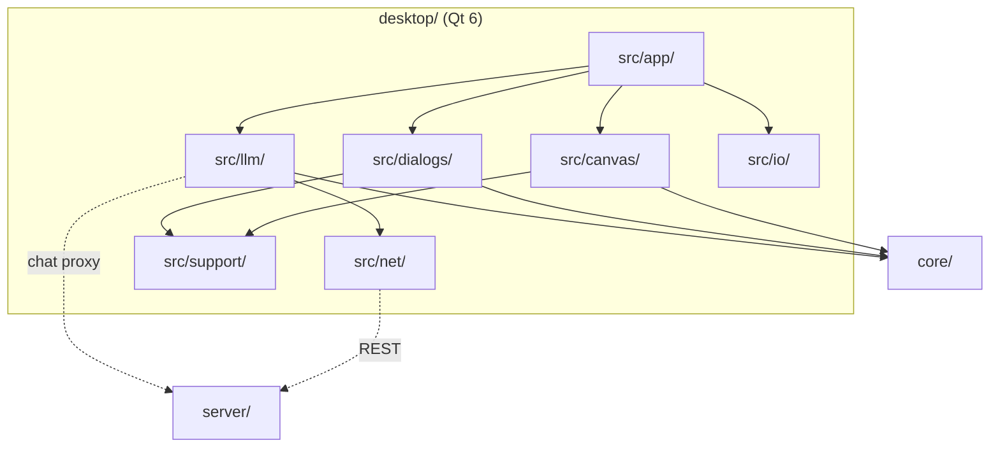

# Desktop app architecture

The system-wide design — the parity contract, canonical data, the layer model, the pattern vocabulary — is in the root [`ARCHITECTURE.md`](../ARCHITECTURE.md).

```mermaid
graph TD
    CORE["core/"]
    subgraph APP["desktop/ (Qt 6)"]
      MAIN["src/app/"]
      CANVAS["src/canvas/"]
      DLG["src/dialogs/"]
      LLM["src/llm/"]
      IO["src/io/"]
      NET["src/net/"]
      SUP["src/support/"]
    end
    SRV["server/"]

    MAIN --> CANVAS & DLG & LLM & IO
    CANVAS & DLG --> SUP
    LLM --> NET
    CANVAS & DLG & LLM --> CORE
    NET -.->|"REST"| SRV
    LLM -.->|"chat proxy"| SRV
```

## Layers

The core seam (`src/model/` plus the files the lint lists) → controllers → `net/`, `io/` →
`support/` → `canvas/`, `dialogs/`, `llm/` → `app/`. `tests/layerBoundary.headless.cpp` enforces
it: nothing below `app/` includes an `app/` header, `dialogs/` never includes `canvas/`, a `core/`
header enters the GUI only through the core seam, and no header passes `MainWindow.hpp` (or,
outside `canvas/`, `CanvasWidget.hpp`) on — a header forward-declares them, and only the units that
reach into them include them. The document state lives in `CanvasScene` (`core::Lines` +
`core::EditorHistory`), which `CanvasWidget` is; the controllers are the `*Controller` classes,
`StencilFileSync`, `ArrowPanner` and `RemoteSession` in `src/app/`.

## Where things go

| Path | Holds | Rule |
|---|---|---|
| `src/app/` | `main.cpp`, the controllers, and `MainWindow`: `MainWindow.hpp` (moc runs on the header) holding the hub and the state groups, `WindowParts.hpp` the parts it composes, a folder per feature | composition only, no logic a controller could hold; a new job is a part or a TU in its feature folder, not a longer one, and a part never reaches into another |
| `src/canvas/` | `scene/` `CanvasScene`, the document and its paint path with no widget; `CanvasWidget` (QPainter), the scene plus the pointer | pixel, geometry and page math come from `core/` through `model/canvasCore.hpp`, never re-derived; pointer timings, hit radii, the hold ghost's dash and alphas and ring metrics come from `constants.json` through `input/pointerTuning` and `scene/markMetrics`, the thickness and point-size ranges from its `LIMITS` through `support/control/lineLimits`; an offscreen render uses a `CanvasScene`, never a hidden widget; the canvas never reads a file, it adopts pixels decoded off the GUI thread |
| `src/model/` | Qt-shaped wrappers over a core type the GUI needs whole (`ScriptDoc`, `imageTurn`, `lineUnion`, `markHits`, `OpPlanSchema`, `canvasCore.hpp`) and `ScriptBuffer` | the core seam: `model/` may include `core/`, nothing above it may; nothing here is persisted; a turned crop is cut from the unturned picture, then only that piece turned |
| `src/dialogs/` | a folder per window, one dialog per file, plus `ScriptEditorWidget` (the .stc editor both script surfaces host) and `ScriptMenuPanel` | every prompt/picker goes through `promptModal` / `chooseModal`, never `QInputDialog` / `QMessageBox`; a menu-hosted panel reuses the window's widgets, never a copy |
| `src/llm/` | `dock/` and `panel/` (the chat surfaces), `client/` (`LlmClient`, `QtLlmTransport`, `SessionKey`), `plan/` (registry, typed plan mapping, executor) | plans validate in `core/opplan` against the shared registry before execution; `plan/` only maps core's result to typed actions and shows core's canonical messages; the executor calls the toolbar's appliers |
| `src/io/` | `fileStore` (settings, projects, autosave, `.stencil`), `mediaLoader`, `mediaTypes` (suffix sniffers and `sniffImageHeader`, the image-header corpus's sniffer) | QtCore-only serialization; `MediaLoader` decodes every picture it resolves on the pool and answers only from the event loop; any other decode is the window's (`decodeForCanvas`) |
| `src/net/` | `serverClient` (REST + `ConnectionManager`), `connectionStore`, `fetchGuard`, `blockedRanges`, `httpStatus` | `fetchGuard` is the one SSRF guard, a port of `cli/src/net.zig`, judging every address by `net/blockedRanges.json` (`fetch`; `serverTarget`, private ranges allowed, for a server the user names); tokens never go in `QSettings`; `httpStatus` is the 2xx/401-403 triage both clients share |
| `src/support/` | a folder per shared concern (`theme/` the ID-selector QSS, `webcore/` the session skin), the session switches `motionPrefs.hpp` / `skinPrefs.hpp`, the platform helpers | QSS lives here only — a widget's own `setStyleSheet` silently changes child metrics; a platform helper is one declaration with a body per OS |
| `resources/` | `app.qrc`: one `.qss` per feature under `qss/app/`, the `qss/webcore/` overlay, the browser's shared config JSON as aliases | shared tables are aliased from `common/config/`, never copied; sheet pieces load in the one cascade order `stylesheetPieces` (`support/theme/themeStylesheet.cpp`) lists, each once in the qrc |
| `packaging/` | plist template, `.desktop`, mime xml, `mkicon.cpp` | nothing binary committed; every icon is rasterised from `common/icons/favicon.svg` |
| `cmake/` | `StencilSources` and `StencilTests` (indexes over per-area parts), `StencilPackaging`, `StencilDeploy` | source lists live here, not in `CMakeLists.txt`; a source or suite joins its area's part, and parts are included in registration order |
| `tests/` | headless suites per concern, `MainWindow.<area>.gui.cpp` and the layer lint | every suite reports its own failures |

## Entities

```mermaid
classDiagram
    ChatSessionController : +bool planRunning
    CanvasScene : +Lines lines
    CanvasScene : +EditorHistory history
    CanvasWidget : +CanvasGesture gesture
    Project : +ProjectMeta meta
    RemoteLink : +qint64 version
    SessionKey : +QDateTime expiry
    ScriptDoc <.. ScriptBuffer : parsed from
    MainWindow *-- CanvasWidget : canvas
    CanvasScene <|-- CanvasWidget : the scene plus the pointer
    MainWindow *-- Settings : settings
    MainWindow o-- Project : projectList
    MainWindow --> Session : autosaves
    MainWindow --> LaunchOptions : applyLaunchOptions
    MainWindow *-- WindowParts : parts
    WindowParts --> MainWindow : each part holds it by reference
    MainWindow *-- ConnectionManager : remote.connections
    MainWindow *-- RemoteLink : remote.session link
    MainWindow *-- ChatSessionController : chatSession
    MainWindow *-- ProjectTitleController : projectTitle
    ChatSessionController o-- ChatMessage : chatHistory
    ChatSessionController ..> SessionKey : read per request
    ConnectionManager *-- ServerClient : clients
    ServerClient --> ServerProject : lists, gets
    Project --> ProjectFileData : bundles as .stencil
    ChatMessage --> OpPlan : reply parses to
    OpPlan *-- Action : actions, variants
    Action ..> PlanAwait : an op that waits on I/O
```

| Entity | What it is | Owned by / lifetime | Relates to |
|---|---|---|---|
| `MainWindow` | The editor window and mediator: settings, the project list, the active project id | `main.cpp`, one per process (another for "open in new window") | Everything, through signals, `Hooks` and its parts |
| `WindowParts` | The parts the window is composed of, one job each: builders, dispatchers and feature parts (`DockChrome`, `ThemePainter`, …) | `MainWindow::parts`, built in member order with the window, destroyed with it | Each holds the window by reference as its named friend |
| `ChatSessionController` | One assistant conversation across dock and menu panel: the turn, the §7 history and attachments, the `planRunning` gate, the §12 chat doc | `MainWindow::chatSession`, window lifetime | `ChatDock`, `ChatMenuPanel`, `LlmClient`; the window through `Hooks` |
| `ProjectTitleController` | The project's name as the window wears it (the browser's `updateProjectTitle`): title, name field, chips, rename in place | `MainWindow::projectTitle`, window lifetime | `ProjectNameBar`, `WindowActions`, `RemoteSession`; the window through `Hooks` |
| `CanvasScene` | The document and its paint path, no widget: pixels, `core::Lines`, the `core::EditorHistory` of `EditorMemento`s (lines, crop, turn, filter), crop, rotation, look, filter, and a picture generation every replacement bumps; a `renderCopy` is what a pool-thread render reads | Base of `CanvasWidget`; alone, owned by a plan sandbox, a thumbnail batch or a co-edit result render | `LiveMarks`, `sceneChanged` |
| `CanvasWidget` | The scene plus the pointer: selection, `HoverMarks`, the one `CanvasGesture`, zoom, `HoldGlue`, stroke flights | `MainWindow`, window lifetime | Every edit applier, `SelectionPanel`, `ChatPlanTarget` |
| `Settings` | Persisted preferences and default visuals: the browser's `DEFAULT_VISUALS`, read through `support/theme/defaultVisuals`, plus desktop-only keys | `MainWindow::settings`, loaded at boot, saved on change | `LlmSettings` derives from its `llm*` fields |
| `Session` | The autosaved in-progress drawing, twin of the browser's localStorage layout blob | Written by `SessionController`'s debounce, read once at boot | `CanvasWidget`, `activeProjectId` |
| `Project` | One saved local project: `core::ProjectMeta` plus layout, crop, chat and view | `MainWindow::projectList`, persisted by `fileStore::saveProjects` | `core::ProjectsStore`; `ProjectFileData` for export |
| `ProjectFileData` | The portable `.stencil` document (image bytes, layout, metadata, theme, optional chat); canonical in `browser/js/core/project/file.js` | Transient: built by `buildStencilBytes`, parsed by `openProjectFile` | `Project`, the linked file watcher |
| `ScriptDoc` | One parsed `.stc`: tokens in QChar columns, diagnostics, the lowered op stream, and the resolvers from an op to a `core::CropRect` or `core::Line` | The `ScriptEditorWidget` that parsed it, rebuilt per keystroke | `ScriptHighlighter`; `scriptRun` drives `PlanTarget` from its ops |
| `ScriptBuffer` | The one `.stc` both script hosts edit, a session `QString` with a `changed` signal | Process-wide; never written to settings, a project or a file | `ScriptEditorWidget` |
| `LaunchOptions` | Parsed argv or a `stencil://` link; twin of the browser deep-link | `main.cpp`, consumed once by `applyLaunchOptions` | `MediaLoader`, `openServerLaunch` |
| `ConnectionManager` | The live `ServerClient`s; `changed()` persists the `SavedServer` snapshot | `MainWindow::remote`, created lazily | `connectionStore`, `RemoteSession` |
| `ServerClient` | One REST connection: base, bearer token, credential kind, status | `ConnectionManager::clients` | `ServerProject`, `LiveFeed` |
| `ServerProject` | A server project record, mirroring the canonical `server/internal/protocol` `ProjectRecord` | Transient reply value stamped with `serverUrl` | `RemoteLink`, `ProjectsDialog` rows |
| `RemoteLink` | The server project (address, id, version) bound to the open editor | `RemoteSession::link`, bound on open, unbound on close | `RemoteSyncController` pushes and polls it |
| `ChatMessage` | One chat turn with its images, replayed in full each call | `ChatSessionController::chatHistory`, cleared with the conversation | `LlmClient::chat`, `fileStore::buildChatDoc` |
| `SessionKey` | The user's Anthropic API key (`llm-providers.md` §5), expiring `sessionKey.ttlMinutes` after entry; a timer drops it, every read re-checks the clock | Process-wide; `forget()`, the TTL or quitting wipes it; never in settings, `QSettings` or `connectionStore` | `LlmSettingsForm` sets and forgets it; the chat reads it per request |
| `OpPlan` | A registry-validated assistant reply typed from `core/opplan`'s result document; `contracts/llm/llm-contract.md` is canonical | Transient, `parseOpPlan` to the end of its run | `Action`, `Variant`, `AskCard`, `ExecResult` |
| `Action` | One op of a plan, a tagged union on `OpKind` | Inside `OpPlan` | `PlanTarget` appliers |
| `PlanAwait` | One plan or `.stc` op waiting on I/O: it settles once (answer, timeout or close) and resumes the run | A child of `MainWindow` until answered, in `PopoverHost::awaits` while unsettled | `PlanTarget`'s `…Then` ops, the close guard |

## Patterns

| Pattern | Where | Notes |
|---|---|---|
| Facade over core | `CanvasScene` over `core::EditorHistory`, crop and filter; `CanvasWidget` and `HoverTip` over `lineChain`, `holdDraw`, `hitTest`, `pageMetrics`; `PlanTarget` over the same appliers | Toolbar, hotkeys, plans and scripts mutate through one set of appliers; the hover tooltip hits what the browser's does |
| Pure fabrication + hook | `CanvasScene`, whose `sceneChanged()` the widget overrides to repaint | A thumbnail, plan sandbox or co-edit result renders the same paint path without a widget, its timers or its event filter; a `renderCopy` renders off the GUI thread |
| State | `CanvasGesture` (`input/gesture.hpp`), `GestureRoutes` (`input/gestureRoutes`) | One gesture at a time, as the browser's `core/pointer/gesture.js`: raising one ends any other. A move or release is looked up by the gesture in one table, as the browser's `onMove` and `ON_RELEASE`, never a chain over it; the compare divider outranks a hold, a hold every other gesture |
| Mediator | `MainWindow` | Wires canvas, chat, selection panel, remote session and controllers; a controller reaches it only through its `Hooks`, a part through friendship |
| Parts and dispatchers | `WindowParts`; the builders (`ToolbarBuilder`, `MenuBuilder`, …) and dispatchers (`WindowAssembly`, `WindowEvents`, `ChatPlanTarget`) | A part holds the window by reference, is its one explicit `friend`, and reaches only the hub and state groups; parts are unaware of each other, so a flow spanning two goes through a window method. Only builders and dispatchers reach a part through the window (`w.parts.x`), to connect or forward. A small behaviour stays a controller behind `Hooks` |
| State group | `WindowActions`, `ToolbarControls`, `PopoverHost`, `RemoteState`, …, held by value in `MainWindow` | Plain structs with no back-reference, read by name (`w.remote.session`) |
| Memento | `core::EditorHistory` in `CanvasScene`; `PlanTarget::stepHistory` | A stroke, crop, quarter-turn or committed filter pick pushes an `EditorMemento` of the lines, the crop and turn under them and the filter over them; a pick is measured against the step on screen, so a hover preview, a no-op or a picture-less pick pushes none. A restore rebuilds from the original only when crop or turn differ and returns a differing filter through the window's applier, pushing nothing; a load starts the stack with its filter, a peer's filter-only edit is its own step, and a peer's crop or turn is one step rebuilt as a restore is |
| Strategy | `LlmClient`'s per-wire `chat*` and the probe's `WIRES` table, keyed by `providers.json` `wire`; `CanvasScene::setFilter` modes; `MotionMode` → `ParticleStyle`; `NotificationSink` by `Settings.notifyChannel` | Table lookup, no growing `if` chain; `Notifications` never knows which sink it holds and falls back to the toasts when the OS declines |
| Observer | Qt signals (`CanvasWidget::changed`, `LiveFeed::projectUpdated`, `MediaLoader::loaded`, …) | Async completions run on the GUI thread, captures guarded with `QPointer` |
| Repository | `fileStore`, `connectionStore`, `core::ProjectsStore` | Callers see typed structs, never JSON or paths |
| Chain of Responsibility | `fetchGuard::checkAsync` → `request` → `get` (`isBlockedHost`, `resolvesToBlocked`, no redirects, byte cap) | The one guard on every untrusted `http(s)` fetch; a literal is refused when its `inet_aton` or its `QHostAddress` reading is, and an IPv6 address carrying an IPv4 one is judged as that IPv4 |
| Adapter | `LlmTransport` → `QtLlmTransport` or a test mock; `PlanTarget` → `ChatPlanTarget` (live editor) / `CanvasPlanTarget` (offscreen sandbox) | One seam per boundary, so the tests run offline |
| Debounced write | `SessionController`, `RemoteSyncController` and its result throttle (`constants.json` `COEDIT`), `io/deferredWrite`, `StencilFileSync` | Gates (`incognito`, `remoteUnsynced`) are checked at fire time |
| Guarded write loop | `ServerClient::runGuardedWriteAsync`, `RemoteSession::putVersionGuardedAsync` | Version echoed on PUT; a 409 re-reads, merges (`model::unionLines` over `core::mergeLines`) and retries a bounded number of times |
| Continuation | `executePlanThen`, `runScriptThen` (`app/scriptRun.cpp`) over `PlanTarget`'s `…Then` ops; `PlanAwait` | An op waiting on I/O suspends the run; its answer resumes it at the next op, never inside the emitter that answered. The run holds only that callback, so a window torn down mid-await takes the plan with it |
| Off-thread decode | `MainWindow::decodeForCanvas` over `support::runOnPool`, checked against `CanvasScene::pictureGeneration`; `MediaLoader::decodeThen` (its own `loadSerial`) | No user picture decodes on the GUI thread. The pool job touches no GUI object; its answer runs only while its context lives; a load a newer one overtook is dropped |
| Hosted menu panel | `ChatMenuPanel`, `ScriptMenuPanel`: a `QWidgetAction` in a `StayOpenMenu` | The action owns the panel, so transcript and typed script outlive the per-right-click menu rebuild; a control that needs a modal dismisses the popup chain first |
| Shared editor widget | `ScriptEditorWidget` in `ScriptDialog` and `ScriptMenuPanel` | Hosts differ only in the `Style` they pass and the buttons around it |
| Session override | `support/motionPrefs.hpp`, `support/skinPrefs.hpp`, and the hooks `support/webcore/look.cpp` installs | Asked by every restyle and animation, written to no file: `Settings` never carries a skin, and `applySettings` re-pushes stored switches only when the user moved one |
| Golden pin / fixture walker | `uiPins`, `opPlanOracle`; the `*Fixtures` walkers | Pins guard pixels, QSS and typed plan results; walkers prove the shared corpora here |
| Double-click reset | `DblResetFilter` (`support/control/dblReset.hpp`), app-wide, opted into by `setResetDefault` | A combo's two quick presses or a check's double-click sets the declared default through `activated` / `click()`, so the row's own wiring applies it |
| Deferred click | `support::wireColorChip` (`support/control/dblReset.hpp`); the Lines-tab chips in `SelectionPanel` | A colour chip's click waits one `POPOVER.doubleClickMs` before its modal picker opens, so a double-click resets it (the toolbar line colour to `DEFAULT_VISUALS`, a line's own to the toolbar's, its points' to none of their own) instead of landing outside the picker |
| Popup entrance by motion mode | `revealPopup` / `dismissPopup` (`support/menu/menuReveal`), `slidePopupIn` (`support/menu/popupSlide`) | One origin — a selector's caret, else the control's centre: particle modes fly dust out and back, 'slide' grows the list from it (0.66 scale, 6px lift, the browser's `menuFromAnchor` curve) with no exit, 'none' just shows it; the slide lands on the exact geometry |
| Alt-peek gesture + glide registry | `AltPeekGesture`, `addGlideHandle` / `glideFrom` (`support/tip/altPeek`); `installComboAltPeek` (`support/menu/comboAltPeek`), app-wide | Port of the browser's `createModalOpenGesture` peek half: Alt+hover peeks; Alt release or focus loss closes unless the pointer is over the list, which lingers until it leaves (`LINGER_CLOSE_MS`); a click-open list ignores Alt. One filter, first on `qApp`, drives a gesture per `QComboBox`, polling while a `Qt::Popup` grabs the pointer. A registered handle (the popover) stays open under a selector peeking inside it; a glide onto an icon marked `ALT_PEEK_TARGET_PROPERTY` opens its peek; the Alt press that opened a peek is consumed. Only the accent popover picks on release (`commitAccent`) |
| View-only paint flag | `CanvasScene::setCleanPreview` | A transient state only the live paint honours: `renderToImage` and `renderCopy` never read it, so no thumbnail, export or co-edit result sees it, and no setting, control or history step moves |
| Silent restyle | `ThemePainter::otherThemeShot` over `PaintedTheme::silent` | The other theme applied through `support::setForcedDark`, photographed with `grab()` and put back inside one event-loop turn: no frame of it reaches the screen, no wipe plays, nothing is stored |
| Control drag | `installIconDrag` (`support/drag/iconDrag`), a pure `IconDragMachine` under a source event filter; browser twin `ui/drag/iconDrag.js` | Past the press slop the button reads the pointer as gone (a hold stops, its release clicks nothing) and a mouse-transparent ghost follows; released back over the button the drag cancels, as Escape or deactivation does; the drop and the cancel run on the next turn, so a hook may open a modal. A double-click's second press drags as a first does. A source that is no button (an item view's viewport) drags only from what its `grab` hook takes hold of, that spot is the origin, and it sees neither the live drag's moves nor its release. No tip shows while a drag is live: its start takes down Qt's, the app's and any window marked `TIP_WINDOW_PROPERTY` (the canvas tip), and `QEvent::ToolTip` is swallowed until its release. `markDropTarget` paints a glow over the window |
| Colour drag | `installColorDrag` on each colour chip and well, `installColorDragCells` on a table of swatch cells such as the Lines tab's (`support/drag/colorDrag`); browser twin `ui/drag/colorDrag.js` | A control drag with no ghost: a chip of the colour rides beside the pointer and every other live swatch glows (under a modal, only its window's); the one released on takes the RGBA when both carry alpha, else the RGB over its own alpha, through its own pick path (`ColorSwatch::apply`), and nothing when it already shows it. A source at alpha 0 has nothing to hand over. A table drags from a press on a swatch cell or on a chip button inside one, and every cell button is adopted as it arrives |
| Press-drag pick | `SearchComboBox::dragPick` (`support/menu/SearchComboPopup.cpp`); browser twin `wireDragPick` (`ui/control/dropdownMenu.js`) | The list opens on the press; held past the slop, a release on a row is that row's click and off the list a close with no change, while a plain click keeps it open. Qt's own combo list already picks this way, so only the themed popup filters `qApp`, and only while the press that opened it is held |
| Drag release menu | `ProjectDragMenu` (`dialogs/projects/list/`); browser twins `ui/projects/list/dragMenu.js`, `dragClose.js` | A held row's ⋯ beside the title — the opaque accent chip (`nameAffordance`), accent-2 while its menu is up — forms out of its dust veiled until the cloud lands and leaves into it (`veilBehindDust`, the browser's `surfaceIn` / `surfaceOut` clocks from `motion.json`), or takes the controls' slot slide in a non-particle mode, and pops the row's own menu up (`showRowMenu`'s held form, its own `revealMenu` entrance and exit or `slidePopupIn`), its rows lit in the accent (`markAccentRows`). The header polls the cursor, as the drag-out zones do: the row under it is lit as a hover lights it and an opener opens its flyout, and only the release takes an item, which runs on the held row once the drag loop has unwound — a modal raised inside macOS's drag loop never sees the release — while that release reorders nothing and opens no zone. The project this window holds, local or the server session, arms Close; the ⋯, its menu and an armed Close take the drop, so a release there never slides the row back. The drag-out zones are the main window's child and cover it whole, under the dialog |

## Design

- **Boot.** `main.cpp` builds `StencilApplication` (holding macOS open events until a window
  registers), sets Fusion and parses `LaunchOptions` before any window, so bad arguments exit cleanly.
  `MainWindow(restoreLast)` loads `Settings`, restores the `Session` unless incognito and queues
  `autoConnectServers`; a first show before the session picture lands stays invisible until it
  does, holding session writes off. After `show()`, `applyLaunchOptions` applies the theme, then
  one source by priority: `--project`, a `stencil://` reference, `--src`, a positional file. Exit
  flushes `deferredWrite`.
- **A canvas press.** `CanvasWidget::mousePressEvent` resolves one gesture by precedence (context
  menu, pan, alt-drag, zoom-rect, multi-select, draw) and edits in image space through core
  geometry. It hits only what the scene draws (`model/markHits`, browser `core/pointer/markHits.js`):
  a hidden point or line is never a target, the close-shape click and the hold-to-draw target
  included; `commitHistory` pushes the memento, and `MainWindow::onCanvasChanged` refreshes the
  actions and `SelectionPanel` and schedules the session, remote and `.stencil` autosaves.
- **Running a script.** `ScriptDialog` and the context menu's `ScriptMenuPanel` flyout host a
  `ScriptEditorWidget` over the one `ScriptBuffer`; each keystroke re-parses through `ScriptDoc`,
  and `ScriptHighlighter` repaints only lines whose spans moved. Nothing is REPORTED until Run,
  which shows the diagnostics of the parse it ran. `ScriptHost::openScript` drives
  `runScriptThen` over a `ChatPlanTarget`, so a scripted and a clicked edit take one path. A
  `@line` or `@rect` COMBINES with the layout as one undo step; `@crop`, `@filter` and the shapes
  each leave a checkpoint (`PlanTarget::captureEdit`, a `core::EditorMemento`), so the lowerer's
  `undo N` restores turn, crop, filter and lines without unwinding the user's own history. A
  script with any error runs nothing; a failure part-way keeps the applied edits and names the
  line. A `.stc` dropped on the open editor fills it; elsewhere, or opened from the OS, it runs at
  once. The flyout runs in place; its file dialogs, which take every popup down, reopen the
  chain on the script row.
- **A linked script.** A `stencil://` link may carry `script=` (at most `LAUNCH.scriptMaxChars`);
  `ScriptHost::adoptLinkedScript` waits for the linked picture to land, then fills the Script
  window. A link never runs a script: a `scriptMode=` beside it is read by no one.
- **An open-image question's flight.** Every open-image dialog starts and ends at
  `canvasAnchorRect` (40 px on the canvas centre) or `openImageAnchorRect` (the Open half
  `hasImage` shows, read at flight time), from `support/modal/imageAnchor.hpp`, twin of the
  browser's `ui/modal/imageAnchor.js`. It grows out of the canvas and lands by OUTCOME
  (`FlightAnchors::closeRectFor`): an opened image pours into Open, a cancel into the canvas.
  Every modal but the compact popover dims and blurs what is behind it
  (`support/modal/ModalBackdrop`, the browser's `.app-modal-overlay`), toasts kept above the
  scrim; `motionReduced()` drops the flight, keeps the dim. A modal is parented to the window it
  covers, never a floating chat, centred on its client area — or, the first to show inside a
  `support::DialogLanding`, with its frame's top-left on the point that names (shifted left or up
  only as far as the screen needs) and grown out of a `CURSOR_ORIGIN_PX` box there, its close still
  flying to its opener — dismissed by an outside press (on macOS through a transparent `Qt::Tool`
  child) and eased in height about its middle (`support/easeWindowHeight.hpp`).
- **A notice.** Every notice reaches, through `Notifications` (browser twin
  `ui/shell/notifySinks.js`), the sink `notifyChannel` names: `ToastStack`, or `SystemNotifier`
  — a macOS `UNUserNotificationCenter` banner (a signed app, `STENCIL_CODESIGN_IDENTITY`),
  elsewhere a tray message. A sink that cannot deliver returns false and the toasts show it; the
  user is told once when the pick cannot be honoured or macOS refuses later.
- **A picture load.** Every picture decodes on the pool, and what follows runs in its completion,
  never assuming it landed; an overtaken load hears false and the old picture stays up. Bytes
  `MediaLoader` cannot decode reach the video decoder only when their header names no still
  image, so a corrupt still fails at once. A chat drop is taken on its header; one that will not
  decode gets the browser's attachment-failed toast.
- **A key in the selection lists.** Delete or Backspace on the focused row of the points table or
  lines list removes that point or line and focuses the row that took its place (the browser's
  `coordTable.js` / `lines/events.js`); the panel takes the `ShortcutOverride`, so no window shortcut
  sees it, except in a read-only compare view. A point's line stays selected while it keeps points.
- **A Lines row.** A row is its line's number, its own colour and thickness, its points' colour and
  size, its point count and its bin (`app/selection/SelectionPanelLines.cpp`, the browser's
  `ui/panel/lines/`); `PairedHeader` heads each colour-and-size pair once. A chip picks after the
  double-click window and its double-click resets — the line to the toolbar's colour, its points to
  none of their own, so they draw in the line's; a thickness or point size opens in place on a
  double-click, held to `LIMITS`. Each edits that row's line through the bar's appliers, one undo step,
  and the selection stays where it was; the line chip, as before, also selects its line. A removal, a
  clear, a new picture and a new layout leave no index into the old line set in the selection, the
  multi-selection included; a turn, a flip, an undo or redo keep it on the lines that still exist.
- **Open and save `.stencil`.** `openProjectFile` parses the bytes, decodes on the pool, fills the
  canvas, creates a local `Project` and links the file. The save writes
  `fileStore::buildProjectFile` over the untouched source bytes (or a PNG re-encode), the layout,
  theme and opt-in chat, and links the file. `StencilFileSync` (the browser's `StencilSync`) owns
  the link, baseline, watcher and debounced auto-save; an external change returns through
  `applyStencilExternal`, merged or taken whole after the three-way choice.
- **Make a copy.** The projects row menu, the canvas context menu and the toolbar's Image button
  build one "Make a copy ›" flyout (`dialogs/projects/copy/copyProjectMenu.hpp`); a pick opens
  `CopyProjectDialog` (`dialogs/projects/copy/`). Every entry point, the `copyProject` op
  included, runs `ProjectCopy::run` (`app/project/copy/`): it reads the source (the live editor,
  a stored row, or a server row fetched with its original), keeps incognito only for a local
  copy that opens, names it with core `ProjectsStore::copySuffixName` past every taken name (the
  server's too for a server copy), writes a fresh local row over its own image file or a new
  project on the source's server, then opens it here, in a new window, or unsaved in incognito.
- **Closing a project.** The Close Project action (`closeProject` in the shared table) and the open
  project dropped on the Projects window's Close run `ProjectFlows::closeActiveProject` — the
  action after one question, no danger, the drop unasked: the project this window holds — local,
  saved first as a fresh editor saves it, or the server session — leaves an empty editor, stays in
  Projects and a notice says it closed; with nothing open a notice says so.
- **Server connect and project fetch.** Each `ServerClient` speaks REST with a bearer token under
  `constants.json` `NETWORK.fetchTimeoutMs`, the browser's bound too. `listProjectsAsync` walks
  the `nextCursor` pages, failing on a repeated cursor or past `MAX_LIST_PAGES`.
  `openServerProject` chains the record, the original, a pool decode and `RemoteLink::bind`. A
  peer's edit is a silent reopen: with an equal `originalHash` the layout lands in place as one
  undo step — lines, filter, page format, formulas, and a new crop or turn rebuilt from the
  original already held (`CanvasScene::commitLayout`); only a changed original is a full reload.
  Writes go through `RemoteSession::putVersionGuardedAsync`;
  `RemoteSyncController` debounces pushes, polls while linked and subscribes `LiveFeed` (raw TCP
  NDJSON, plaintext only). A push marks the baked `result` stale; a `renderCopy` is rendered and
  encoded on the pool and uploaded once edits idle, never twice within `COEDIT.resultMinGapMs` nor
  during a push, and a closing window waits (capped) for the last. Save toasts follow outcomes,
  not pushes; a re-read after our own write adopts only our own version bump, so a peer's edit in
  between still reloads.
- **An LLM turn.** `ChatSessionController::onChatSend` appends the `ChatMessage` (text plus
  downscaled attachments) and calls `LlmClient::chat` with the system prompt built from the shared
  registry. `onChatReply` runs `parseOpPlan` (walked by `core/opplan`) and `executePlanThen` over
  `ChatPlanTarget`; notes, variants (rendered in `CanvasPlanTarget` sandboxes) and the ask card go
  to the dock. The `anthropic` provider posts the server's upstream body straight to Anthropic
  (contract §6.5) with `x-api-key` and `anthropic-version`, never `Authorization` or the
  browser-only direct-access header, wording failures as the server does under the
  secret-fragment veto. Plain http carries the key only to a loopback host; anything else, probe
  and model list included, fails typed before a request exists (`plainHttpRefusal`), and
  `QtLlmTransport` follows no redirect. With no `SessionKey` a turn sends nothing and shows the
  unreachable card; the form never fills a held key back and writes no `llmApiKey` equal to it.
  An I/O op is a continuation, never a nested loop, so a plan spans event-loop turns under
  `planRunning`: `RemoteSyncController` holds poll and reload off, and a Send is refused, its text
  handed back. A close mid-plan lapses every `PopoverHost::awaits` entry as its timeout would; the
  popover's modal exec, the one nested loop left, registers in `PopoverHost::loops`, and a close
  inside it ends it first and re-posts itself, so the window is never deleted under a suspended
  frame.
- **The chat's placement.** The central widget is an inner `QMainWindow`, the editor shell
  (`MainWindow::editor`) of toolbars, docks, points panel and canvas, whose `saveState` is
  `Settings::windowState`. `ChatDock` is the window's only dock, so its side runs the full window
  edge outside the shell, as the browser's fixed `stencil-chat-panel` insets the page
  (`css/components/chat/panel.css`). `DockChrome::dockChatTo` places it and slides a side switch
  across; the chat resizes from a strip inside its own edge, the separator being the browser's
  10px of page. The shell hosts its own surfaces' dust, so those motes vanish under a docked chat,
  as `surfaces.js` `belowChat` does.
- **A logo show.** Holding the header mark, or typing a show's name, reaches `LogoStage`
  (`app/logo/`), a full-window child that needs a bare window: a hold is refused under
  fullscreen, a modal or the popover, while a typed word clears them first. Stage shows are
  exclusive: another word replaces the one up, its own word does nothing. `logoStage.json` is the
  table both front-ends resolve a show from. While up, the stage filters `qApp` — every
  `ShortcutOverride` accepted, the following press swallowed, Escape the way out — and re-resolves
  its look each frame from skin, motion mode, accent and theme; `motionReduced()` keeps the stage
  and drops every loop. The pink show opens no stage: it runs through `ChatPlanTarget`, one step
  on the user's own history. The webcore show is a toggle: `ThemePainter::toggleWebcore` sets the
  session skin, motion switches and forced light theme, swaps in the Windows style and the skin's
  face (`support/webcore/look`) and restyles from scratch; an empty editor reopens or builds the
  skin's local project, and the same word restores the stored look.
- **A logo drag.** Past the press slop the header mark is a control drag (`app/logo/LogoDrag`,
  browser `ui/drag/logoDrag.js`) whose ghost wears the mark; with a picture up the canvas region
  glows as its target, and over it the scene paints its clean view — the bare picture, no filter,
  line, point or compare split. A drop there sets that view through the toolbar's appliers
  (`applyImageFilter`, the Show Lines and Show Points actions, `setCompareModeUi`), each only where
  something is applied, so the filter is one undo step and the switches persist; anywhere else, back
  on the mark, Escape or an empty canvas sets nothing. A modified press is the accent menu's and a
  press whose hold opened a show is the show's; a drag reads to the hold as a move away.
- **A theme lens.** Dragging the theme switch opens `ThemeLens` (`app/theme/`, browser
  `ui/drag/themeLens.js`): a disc at the pointer, under the switch's ghost and a two-pass rim,
  showing one photograph of the window in the other theme with the visible picture inverted.
  `ThemePainter::otherThemeShot` takes it as the drag starts. No lens opens under the webcore skin,
  over a wipe in flight or under the popover; the drag goes on without one. The lens only previews:
  a release anywhere, or Escape, takes it down and switches nothing, stores nothing and plays no
  wipe; only a click on the switch toggles the theme.
- **A toolbar icon drag.** `ToolbarBuilder::buildIconDrags` (`app/drag/`, browser
  `ui/bindings/controls/toolbarDrags.js`) gives a control drag to these icons alone. A dialog icon
  — `PopoverHost::dialogActions` but the chat, plus crop — dropped away from itself triggers its
  action as a click does inside a `support::DialogLanding`: the full dialog, its top-left on the
  drop and grown out of the cursor, once any popover up has unwound. The chat icon shows the bands
  its title drag shows (`DockChrome::showChatDockZones`); a band docks the chat on its side, an open
  one sliding there, anywhere else floats it with its top-left on the drop, grown out of the cursor. Clear-all, rotate and flip act only when dropped on
  the canvas viewport, which glows meanwhile: clear-all without its confirm, still one undo step
  with the confirmed clear's notice, the transforms as their click. Zoom − and + follow
  z0·e^(∓k·d) about the drag-start view's centre (`zoomFollow.hpp`); fit lights both and steps
  over either at the browser's hold-zoom rate. A popover icon's double-click opens its popover on
  that press's release, as the browser's `dblclick` follows the mouseup, so a quick click then a
  drag only drags: a drag start clears the deferred click, the double-click and its own icon's Alt
  peek close, a popover icon's release then clicks nothing, and back on its icon or on Escape the
  drag restores whatever it previewed.
- **Packaging.** `cmake/StencilDeploy.cmake` drives CPack over Qt's deploy (`macdeployqt`,
  `windeployqt`, the generic Linux deploy; Qt ≥ 6.3): the installed binary's rpath points at the
  bundled Qt, Qt's own translations stay out, the macOS bundle keeps only the architecture the
  app was built for and is sealed again after the deploy (`packaging/thin.cmake`), the Linux
  package ships no eglfs integrations and its bundled ICU keeps only the data Qt's ICU calls read
  (`packaging/trimicu.cpp`, a host tool, and `trimicu.cmake`, which links the trimmed data back
  in), and `packaging/smoke.sh` / `smoke.ps1` start each package from its own files in CI. The
  `.stencil` type and `stencil://` scheme are registered on
  macOS (`packaging/MacOSXBundleInfo.plist.in`) and Linux (`stencil-mime.xml`,
  `stencil.desktop`). `packaging/mkicon.cpp`, a Qt host tool run at build time, rasterises
  `common/icons/favicon.svg` into `.icns` / `.ico` with no OS image tool; with Xcode's `actool`, macOS
  also gets a themed `AppIcon`.

## Rules

1. **The core is the logic.** Filters, crop, rotation, page coordinates, history, project expiry and
   op-plan verdicts come from the linked `stencil_core`, matching the browser by construction.
2. **Shared data is aliased, not copied.** Hotkeys, info text, theme tokens, motion, pointer and
   highlight tunings, the LLM assets and the SSRF address table are the browser's files in the qrc.
3. **REST only.** The server connection is `QNetworkAccessManager` REST — no WebSocket of any kind,
   no TCP edit channel; server projects refresh by polling while the Projects dialog is open.
4. **Secrets.** Connection tokens live in the 0600 `connectionStore`, the openai-compat LLM key in
   the settings JSON only, the anthropic key in process memory only (`SessionKey`).
   `STENCIL_LLM_*` never reaches a child process.
5. **Motion** is gated by `support/motionPrefs.hpp` (`STENCIL_NO_ANIM=1` overrides) and mirrors
   `browser/js/ui/dust/cloud.js` value for value: sprite blits, not `drawEllipse`; a `QTimer` at
   the screen's refresh rate, not `QVariantAnimation`. A widget hidden under its dust or a fade
   wears `veilBehindDust`, never a bare opacity effect, under which Qt still counts an opaque child
   as covering. A skin (`support/skinPrefs.hpp`) overrides these and the theme for the session only.
6. **State directory** is baked at build time (`STENCIL_STATE_DIR`): the gitignored
   `desktop/.stencil/` in dev, the per-user config dir when packaged (`-DSTENCIL_DEV_STATE_DIR=OFF`).
7. **Every user-facing path is one path.** OS open events, drops, file arguments and deep links
   route through `openPathFromOS`, which forks on suffix: `.json` a layout, `.stencil` a project,
   `.stc` a script to RUN, else an image or video; the model's `openFile`/`save` ops too, gated to
   paths the user wrote in the conversation. A dragged picture is RANKED candidates — whatever
   names an image, the PROMISED FILE, the ``, the BITMAP the source rendered, then the
   rest — and `MediaLoader::loadFirstOf` keeps the first that resolves, reporting the FIRST
   failure. `support/dragPasteboard` reads what macOS keeps off QMimeData from the drag pasteboard
   on the drop alone, fulfilling a promise into a per-user owner-only scratch under a
   `PROMISE_BUDGET_MS` deadline; the list rides `LaunchOptions` into a new window. A drag of LINKS ONLY opens nothing and SAYS SO. The save/incognito
   ZONES overlay is the WINDOW's, as the browser's `#global-drop-overlay` covers the page, and
   follows the drag wherever Qt delivers it; a torn-off dock is not covered.
8. **A tooltip is read as text.** Qt hands the raw `toolTip()` to accessibility, so every rich tip
   carries its plain reading as the accessible description (`syncTipDescription`), never its markup.
9. **A script that arrives by link never runs unasked and never reads a local file.** A web page
   can craft a `stencil://` link, and a desktop script could otherwise open a local picture and
   `@save` it to a linked server.

## Tests

`cmake/StencilTests.cmake` defines `stencil_headless_test()`, which registers every suite offscreen
with an isolated `STENCIL_STATE_DIR` per test, so nothing touches the developer's app state.
Headless suites are one per concern, each reporting its own failures. The GUI suites are
`MainWindow.<area>.gui.cpp`, one QtTest binary per area over `stencil_gui_objs`, driving the real
`MainWindow` with `STENCIL_NO_ANIM=1`; each writes its pictures into its own state dir, since ctest
runs the areas side by side. A case that opens a picture waits for it to land, never sleeps. The
suites pin the off-thread decode, the overtaken load and a close mid-decode. The drag suites drive a
control's press, moves and release as its pointer grab delivers them; they pin the logo's clean view
out of every render, and the theme lens's photograph inside one event-loop turn and equal, region by
region, to a grab after a real switch. The fixture walkers prove the
shared `common/fixtures` corpora here (core's plan result byte-equal to
`generated/normalized.json`); `opPlanOracle` pins `parseOpPlan`'s typed result over the corpus and
adversarial inputs. The LLM suites use a mock `LlmTransport`, so all runs offline; the anthropic key
is proved on a fake clock, over the wire fixtures, and through the real `QtLlmTransport` to a
loopback `/v1/messages`, then found in no file under the state dir and no `QSettings`.
`tests/support/mockRest.hpp` stands in for the server's REST routes. `layerBoundary.headless.cpp`
is the import lint; `testFloor.headless.cpp` holds the floor of registered targets.
`uiPins.headless.cpp` pins the stylesheet hash per theme and accent (`tests/pins/stylesheets.txt`)
and the renders at device pixel ratio 1 and 2 against `tests/pins/<platform>/`, a gitignored
per-platform baseline recorded from the pre-change tree (a platform without one skips that half).
Core's doctest suite runs under core's target, not here.
