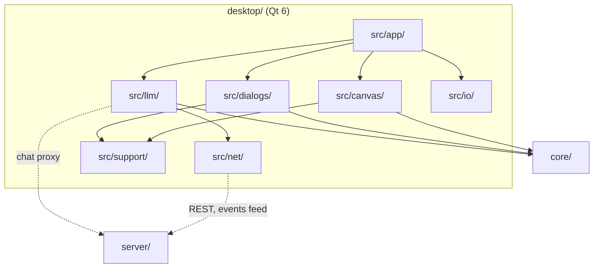
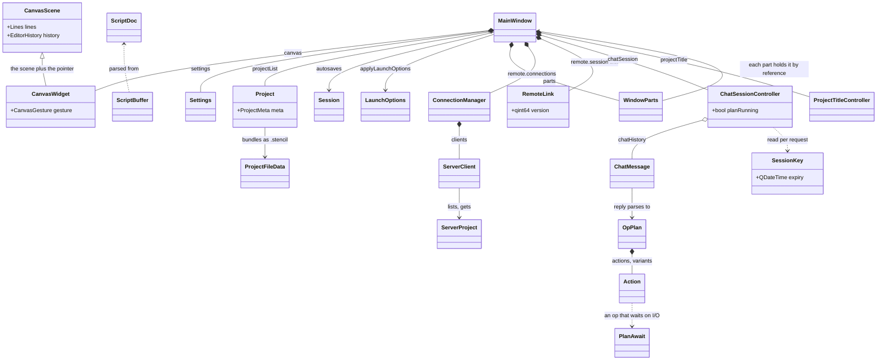

# Desktop app architecture

The system-wide design — the parity contract, canonical data, the layer model, the pattern vocabulary — is in the root [`ARCHITECTURE.md`](../ARCHITECTURE.md).

```mermaid
graph TD
    CORE["core/"]
    subgraph APP["desktop/ (Qt 6)"]
      MAIN["src/app/"]
      CANVAS["src/canvas/"]
      DLG["src/dialogs/"]
      LLM["src/llm/"]
      IO["src/io/"]
      NET["src/net/"]
      SUP["src/support/"]
    end
    SRV["server/"]

    MAIN --> CANVAS & DLG & LLM & IO
    CANVAS & DLG --> SUP
    LLM --> NET
    CANVAS & DLG & LLM --> CORE
    NET -.->|"REST, events feed"| SRV
    LLM -.->|"chat proxy"| SRV
```

## Layers

The core seam (`src/model/` plus the files the lint lists) → controllers → `net/`, `io/` →
`support/` → `canvas/`, `dialogs/`, `llm/` → `app/`. `tests/layerBoundary.headless.cpp` enforces
it: nothing below `app/` includes an `app/` header beyond its one allowance
(`dialogs/projects/ProjectsDialog.cpp` reaching `app/mainWindowHelpers.hpp` for the name-chip
metrics), `dialogs/` never includes `canvas/`, a `core/` header enters the GUI only through
`model/` beyond the frozen allowance in `layerBoundary.headless.cpp`, and no header passes `MainWindow.hpp` (or,
outside `canvas/`, `CanvasWidget.hpp`) on — a header forward-declares them, and only the units that
reach into them include them. The document state lives in `CanvasScene` (`core::Lines` +
`core::EditorHistory`), which `CanvasWidget` is; the controllers are the `*Controller` classes,
`StencilFileSync`, `ArrowPanner` and `RemoteSession` in `src/app/`.

## Where things go

| Path | Holds | Rule |
|---|---|---|
| `src/app/` | `main.cpp`, the controllers, and `MainWindow` (hub and state groups in `MainWindow.hpp`, its parts in `WindowParts.hpp`), a folder per feature | composition only; a new job is a part or a TU in its feature folder, and a part never reaches into another |
| `src/canvas/` | `scene/` `CanvasScene`, the document and its paint path with no widget; `CanvasWidget`, the scene plus the pointer | pixel, geometry and page math come from `core/` through `model/canvasCore.hpp`; pointer tunings come from `constants.json` through `input/pointerTuning` and `scene/markMetrics`, ranges through `support/control/lineLimits`; an offscreen render uses a `CanvasScene`, never a hidden widget; the canvas never reads a file |
| `src/model/` | Qt-shaped wrappers over core types the GUI needs whole (`ScriptDoc`, `imageTurn`, `lineUnion`, `markHits`, `lineName`, `OpPlanSchema`, `canvasCore.hpp`) and `ScriptBuffer` | the core seam: `core/` headers enter through `model/`, beyond the frozen `CORE_INCLUDE_ALLOWANCE` in `tests/layerBoundary.headless.cpp`; nothing here is persisted |
| `src/dialogs/` | a folder per window, one dialog per file, plus `ScriptEditorWidget` and `ScriptMenuPanel` | every prompt and choice goes through `promptModal` / `chooseModal`, never `QInputDialog` / `QMessageBox`; the native file picker (`QFileDialog`) and the non-native `QColorDialog` inside the reveal helper are the exempt pickers; a menu-hosted panel reuses the window's widgets |
| `src/llm/` | `dock/` and `panel/` (chat surfaces), `client/` (`LlmClient`, `QtLlmTransport`, `SessionKey`), `plan/` (registry, typed plan mapping, executor) | plans validate in `core/opplan` before execution; `plan/` only maps core's result to typed actions; the executor calls the toolbar's appliers |
| `src/io/` | `fileStore` (settings, projects, autosave, `.stencil`), `mediaLoader`, `mediaTypes` (suffix and header sniffers) | QtCore-only serialization; `MediaLoader` decodes on the pool and answers only from the event loop |
| `src/net/` | `serverClient` (REST + `ConnectionManager`), `LiveFeed` (the read-only events subscription), `connectionStore`, `fetchGuard`, `blockedRanges`, `httpStatus` | `fetchGuard` is the one SSRF guard, a port of `cli/src/net.zig`, judging every address by `net/blockedRanges.json`; tokens never go in `QSettings` |
| `src/support/` | a folder per shared concern (`theme/`, `webcore/`, `sheets/` for the per-widget style sheets, `process/` for a child's environment), the session switches `motionPrefs.hpp` / `skinPrefs.hpp`, `rowWork.hpp` (the pool helpers), the platform helpers | QSS text lives here only, a caller passing `setStyleSheet` what a `support::…Sheet` returns; a platform helper is one declaration with a body per OS |
| `resources/` | `app.qrc`: per-feature `.qss` under `qss/app/`, the `qss/webcore/` overlay, the shared config JSON as aliases | shared tables are aliased from `common/config/`, never copied; sheet pieces load in the one order `stylesheetPieces` (`support/theme/themeStylesheet.cpp`) lists |
| `packaging/` | plist template, `.desktop`, mime xml, `mkicon.cpp` | nothing binary committed; every icon is rasterised from `common/icons/favicon.svg` |
| `cmake/` | `StencilSources` and `StencilTests` (indexes over per-area parts), `StencilPackaging`, `StencilDeploy` | source lists live here, not in `CMakeLists.txt` (the entry point too, `STENCIL_APP_MAIN`); a source or suite joins its area's part |
| `tests/` | headless suites per concern, `MainWindow.<area>.gui.cpp` and the layer lint | every suite reports its own failures |

## Entities

```mermaid
classDiagram
    ChatSessionController : +bool planRunning
    CanvasScene : +Lines lines
    CanvasScene : +EditorHistory history
    CanvasWidget : +CanvasGesture gesture
    Project : +ProjectMeta meta
    RemoteLink : +qint64 version
    SessionKey : +QDateTime expiry
    ScriptDoc <.. ScriptBuffer : parsed from
    MainWindow *-- CanvasWidget : canvas
    CanvasScene <|-- CanvasWidget : the scene plus the pointer
    MainWindow *-- Settings : settings
    MainWindow o-- Project : projectList
    MainWindow --> Session : autosaves
    MainWindow --> LaunchOptions : applyLaunchOptions
    MainWindow *-- WindowParts : parts
    WindowParts --> MainWindow : each part holds it by reference
    MainWindow *-- ConnectionManager : remote.connections
    MainWindow *-- RemoteLink : remote.session link
    MainWindow *-- ChatSessionController : chatSession
    MainWindow *-- ProjectTitleController : projectTitle
    ChatSessionController o-- ChatMessage : chatHistory
    ChatSessionController ..> SessionKey : read per request
    ConnectionManager *-- ServerClient : clients
    ServerClient --> ServerProject : lists, gets
    Project --> ProjectFileData : bundles as .stencil
    ChatMessage --> OpPlan : reply parses to
    OpPlan *-- Action : actions, variants
    Action ..> PlanAwait : an op that waits on I/O
```

| Entity | What it is | Owned by / lifetime | Relates to |
|---|---|---|---|
| `MainWindow` | The editor window and mediator: settings, the project list, the active project id | `main.cpp`, one per window | Everything, through signals, `Hooks` and its parts |
| `WindowParts` | The parts the window is composed of, one job each: builders, dispatchers and feature parts | `MainWindow::parts`, window lifetime | Each holds the window by reference as its named friend |
| `ChatSessionController` | One assistant conversation across dock and menu panel: the turn, history and attachments, the `planRunning` gate | `MainWindow::chatSession`, window lifetime | `ChatDock`, `ChatMenuPanel`, `LlmClient`; the window through `Hooks` |
| `ProjectTitleController` | The project's name as the window wears it: title, name field, chips, rename in place | `MainWindow::projectTitle`, window lifetime | `ProjectNameBar`, `WindowActions`, `RemoteSession`; the window through `Hooks` |
| `CanvasScene` | The document and its paint path, no widget: pixels, `core::Lines`, the `core::EditorHistory` of `EditorMemento`s, crop, rotation, look, filter, and a picture generation every replacement bumps | Base of `CanvasWidget`; alone, owned by a plan sandbox, a thumbnail batch or a co-edit result render | `LiveMarks`, `sceneChanged` |
| `CanvasWidget` | The scene plus the pointer: selection, hover, the one `CanvasGesture`, zoom | `MainWindow`, window lifetime | Every edit applier, `SelectionPanel`, `ChatPlanTarget` |
| `Settings` | Persisted preferences and default visuals (`support/theme/defaultVisuals`) plus desktop-only keys | `MainWindow::settings`, loaded at boot, saved on change | `LlmSettings` derives from its `llm*` fields |
| `Session` | The autosaved in-progress drawing | Written by `SessionController`'s debounce, read once at boot | `CanvasWidget`, `activeProjectId` |
| `Project` | One saved local project: `core::ProjectMeta` plus layout, crop, chat and view | `MainWindow::projectList`, persisted by `fileStore::saveProjects` | `core::ProjectsStore`; `ProjectFileData` for export |
| `ProjectFileData` | The portable `.stencil` document (image bytes, layout, metadata, theme, optional chat) | Transient: built by `buildStencilBytes`, parsed by `openProjectFile` | `Project`, the linked file watcher |
| `ScriptDoc` | One parsed `.stc`: tokens, diagnostics, the lowered op stream, and op resolvers to a `core::CropRect` or `core::Line` | The `ScriptEditorWidget` that parsed it, rebuilt per keystroke | `ScriptHighlighter`; `scriptRun` drives `PlanTarget` from its ops |
| `ScriptBuffer` | The one `.stc` both script hosts edit | Process-wide; never persisted | `ScriptEditorWidget` |
| `LaunchOptions` | Parsed argv or a `stencil://` link | `main.cpp`, consumed once by `applyLaunchOptions` | `MediaLoader`, `openServerLaunch` |
| `ConnectionManager` | The live `ServerClient`s; `changed()` persists the `SavedServer` snapshot | `MainWindow::remote`, created lazily | `connectionStore`, `RemoteSession` |
| `ServerClient` | One REST connection: base, bearer token, credential kind, status | `ConnectionManager::clients` | `ServerProject`, `LiveFeed` |
| `ServerProject` | A server project record, mirroring `server/internal/protocol` `ProjectRecord` | Transient reply value stamped with `serverUrl` | `RemoteLink`, `ProjectsDialog` rows |
| `RemoteLink` | The server project (address, id, version) bound to the open editor | `RemoteSession::link`, bound on open, unbound on close | `RemoteSyncController` pushes and polls it |
| `ChatMessage` | One chat turn with its images, replayed in full each call | `ChatSessionController::chatHistory`, cleared with the conversation | `LlmClient::chat`, `fileStore::buildChatDoc` |
| `SessionKey` | The user's Anthropic API key (`llm-providers.md` §5), expiring `sessionKey.ttlMinutes` after entry | Process-wide; `forget()`, the TTL or quitting wipes it; never persisted | `LlmSettingsForm` sets and forgets it; the chat reads it per request |
| `OpPlan` | A registry-validated assistant reply typed from `core/opplan`'s result; `contracts/llm/llm-contract.md` is canonical | Transient, `parseOpPlan` to the end of its run | `Action`, `Variant`, `AskCard`, `ExecResult` |
| `Action` | One op of a plan, a tagged union on `OpKind` | Inside `OpPlan` | `PlanTarget` appliers |
| `PlanAwait` | One plan or `.stc` op waiting on I/O; it settles once (answer, timeout or close) and resumes the run | A child of `MainWindow`, in `PopoverHost::awaits` while unsettled | `PlanTarget`'s `…Then` ops, the close guard |

## Patterns

| Pattern | Where | Notes |
|---|---|---|
| Facade over core | `CanvasScene` over `core::EditorHistory`, crop and filter; `CanvasWidget` and `HoverTip` over `lineChain`, `holdDraw`, `hitTest`, `pageMetrics`; `PlanTarget` over the same appliers | Toolbar, hotkeys, plans and scripts mutate through one set of appliers |
| Pure fabrication + hook | `CanvasScene`, whose `sceneChanged()` the widget overrides to repaint | Thumbnails, plan sandboxes and co-edit results render the same paint path without a widget; a `renderCopy` renders off the GUI thread |
| State | `CanvasGesture` (`input/gesture.hpp`), `GestureRoutes` (`input/gestureRoutes`) | One gesture at a time; a move or release is looked up by gesture in one table, never a chain |
| Mediator | `MainWindow` | Wires canvas, chat, selection panel, remote session and controllers; a controller reaches it only through its `Hooks`, a part through friendship |
| Parts and dispatchers | `WindowParts`; the builders (`ToolbarBuilder`, `MenuBuilder`, …) and dispatchers (`WindowAssembly`, `WindowEvents`, `ChatPlanTarget`) | A part holds the window by reference as its one `friend` and is unaware of other parts; a flow spanning two goes through a window method; only builders and dispatchers reach a part through the window |
| State group | `WindowActions`, `ToolbarControls`, `PopoverHost`, `RemoteState`, …, held by value in `MainWindow` | Plain structs with no back-reference, read by name |
| Memento | `core::EditorHistory` in `CanvasScene`; `PlanTarget::stepHistory` | A stroke, crop, turn or committed filter pushes an `EditorMemento`; a preview or no-op pushes none; a restore rebuilds from the original only when crop or turn differ |
| Strategy | `LlmClient`'s per-wire `chat*` keyed by `providers.json` `wire`; `CanvasScene::setFilter` modes; `MotionMode` → `ParticleStyle`; `NotificationSink` by `Settings.notifyChannel` | Table lookup, no growing `if` chain; a sink that cannot deliver falls back to the toasts |
| Observer | Qt signals (`CanvasWidget::changed`, `LiveFeed::projectUpdated`, `MediaLoader::loaded`, …) | Async completions run on the GUI thread, bound to an owning context — a pool job's `QFutureWatcher` is a child of its `ctx`, a reply dies with its `QNetworkAccessManager` — so a completion never outlives its owner; a `QPointer` guards only a callback that crosses to another object |
| Repository | `fileStore`, `connectionStore`, `core::ProjectsStore` | Callers see typed structs, never JSON or paths |
| Chain of Responsibility | `fetchGuard::checkAsync` → `request` → `get` | The one guard on every untrusted `http(s)` fetch: blocked hosts, resolution, no redirects, byte cap |
| Adapter | `LlmTransport` → `QtLlmTransport` or a test mock; `PlanTarget` → `ChatPlanTarget` (live editor) / `CanvasPlanTarget` (offscreen sandbox) | One seam per boundary, so the tests run offline |
| Debounced write | `SessionController`, `RemoteSyncController`, `io/deferredWrite`, `StencilFileSync` | Gates (`incognito`, `remoteUnsynced`) are checked at fire time |
| Guarded write loop | `ServerClient::runGuardedWriteAsync`, `RemoteSession::putVersionGuardedAsync` | Version echoed on PUT; a layout push takes 6 tries, each 409 re-reading and merging (`model::unionLines` over `core::mergeLines`); a meta PUT takes 4, re-reading the version without a merge |
| Continuation | `executePlanThen`, `runScriptThen` (`app/scriptRun.cpp`) over `PlanTarget`'s `…Then` ops; `PlanAwait` | An op waiting on I/O suspends the run and its answer resumes it at the next op; a window torn down mid-await takes the plan with it |
| Off-thread decode | `MainWindow::decodeForCanvas` over `support::runOnPool`, checked against `CanvasScene::pictureGeneration`; `MediaLoader::decodeThen` | No user picture decodes on the GUI thread; the pool job touches no GUI object; an overtaken load is dropped |
| Hosted menu panel | `ChatMenuPanel`, `ScriptMenuPanel`: a `QWidgetAction` in a `StayOpenMenu` | The action owns the panel, so its state outlives the per-right-click menu rebuild |
| Shared editor widget | `ScriptEditorWidget` in `ScriptDialog` and `ScriptMenuPanel` | Hosts differ only in the `Style` they pass and the buttons around it |
| Session override | `support/motionPrefs.hpp`, `support/skinPrefs.hpp`, the hooks `support/webcore/look.cpp` installs | Asked by every restyle and animation, written to no file |
| Golden pin / fixture walker | `uiPins`, `opPlanOracle`; the `*Fixtures` walkers | Pins guard pixels, QSS and typed plan results; walkers prove the shared corpora here |
| Double-click reset | `DblResetFilter` (`support/control/dblReset.hpp`), opted into by `setResetDefault` or a chip's `setResetHook` | A double-click sets the declared default through the control's own signal path; a logo drop (`resetToDefault`) does too, spins and formula fields included |
| Deferred click | `support::wireColorChip` (`support/control/dblReset.hpp`) | A colour chip's click waits out the double-click window before its picker opens, so a double-click can reset it |
| Popup entrance by motion mode | `revealPopup` / `dismissPopup` (`support/menu/menuReveal`), `slidePopupIn` (`support/menu/popupSlide`) | One origin per popup; the motion mode picks particles, a slide or none, and every mode lands on the exact geometry |
| Alt-peek gesture + glide registry | `AltPeekGesture`, `addGlideHandle` / `glideFrom` (`support/tip/altPeek`); `installComboAltPeek` (`support/menu/comboAltPeek`) | Alt+hover peeks a list open and Alt release closes it; one app-wide filter drives a gesture per `QComboBox`; a registered handle stays open under a peek inside it |
| View-only paint flag | `CanvasScene::setCleanPreview` | Honoured only by the live paint: no render, setting or history step sees it |
| Silent restyle | `ThemePainter::otherThemeShot` over `PaintedTheme::silent` | The other theme applied, grabbed and restored inside one event-loop turn; nothing reaches the screen or is stored |
| Control drag | `installIconDrag` (`support/drag/iconDrag`), a pure `IconDragMachine` under a source event filter | Past the press slop the source reads as released and a ghost follows; drop and cancel run on the next turn, so a hook may open a modal; no tooltip shows while a drag is live; the ghost's rim shines in the accent (`support/drag/dragOverlays`); a source hidden mid-drag still drops, and `afterIconDrag` holds fullscreen's reveal until the drop |
| Colour drag | `installColorDrag`, `installColorDragCells` (`support/drag/colorDrag`) | A control drag carrying an RGBA; the target applies it through its own pick path |
| Press-drag pick | `SearchComboBox::dragPick` (`support/menu/SearchComboPopup.cpp`) | The list opens on the press and a release on a row picks it; a plain click keeps it open |
| Drag release menu | `ProjectDragMenu` (`dialogs/projects/list/`) | A held project row shows its menu; only the release takes an item, run once the drag loop has unwound |

## Design

- **Boot.** `main.cpp` builds `StencilApplication` (holding macOS open events until a window
  registers) and parses `LaunchOptions` before any window, so bad arguments exit cleanly.
  `MainWindow(restoreLast)` loads `Settings`, restores the `Session` unless incognito and queues
  `autoConnectServers`; session writes stay off until the restored picture lands. After `show()`,
  `applyLaunchOptions` applies the theme, then one source by priority: `--project`, a
  `stencil://` reference, `--src`, a positional file. Exit flushes `deferredWrite`.
- **A canvas press.** `CanvasWidget::mousePressEvent` resolves one gesture by precedence and edits
  in image space through core geometry. It hits only what the scene draws (`model/markHits`), so
  never a line the Lines tab's eye hid, which keeps its index and its row but is never painted;
  `commitHistory` pushes the memento, and `MainWindow::onCanvasChanged` refreshes the actions and
  `SelectionPanel` and schedules the session, remote and `.stencil` autosaves.
- **Running a script.** `ScriptDialog` and `ScriptMenuPanel` host a `ScriptEditorWidget` over the
  one `ScriptBuffer`; each keystroke re-parses through `ScriptDoc`, and diagnostics are reported
  only on Run. `ScriptHost::openScript` drives `runScriptThen` over a `ChatPlanTarget`, so a
  scripted and a clicked edit take one path. Each script edit leaves a checkpoint
  (`PlanTarget::captureEdit`), so the lowerer's `undo N` never unwinds the user's own history. A
  script with any error runs nothing; a failure part-way keeps the applied edits and names the
  line. A `.stc` dropped on the open editor fills it; elsewhere, or opened from the OS, it runs.
- **A linked script.** A `stencil://` link may carry `script=` (at most `LAUNCH.scriptMaxChars`);
  `ScriptHost::adoptLinkedScript` fills the Script window once the linked picture lands. A link
  never runs a script.
- **A modal.** Every open-image dialog flies from and back to anchors in
  `support/modal/imageAnchor.hpp`, landing by outcome (`FlightAnchors::closeRectFor`). Every modal
  but the compact popover sits over `support/modal/ModalBackdrop`; `motionReduced()` drops the
  flight. A modal is parented to the window it covers, centred on it or placed by a
  `support::DialogLanding`, dismissed by an outside press (on macOS through a transparent
  `Qt::Tool` child) and eased in height (`support/easeWindowHeight.hpp`).
- **A notice.** Every notice reaches, through `Notifications`, the sink `notifyChannel` names:
  `ToastStack` or `SystemNotifier` (a macOS banner for a signed app, elsewhere a tray message). A
  sink that cannot deliver returns false and the toasts show it.
- **A picture load.** Every picture decodes on the pool, and what follows runs in its completion;
  an overtaken load hears false and the old picture stays up. Bytes `MediaLoader` cannot decode
  reach the video decoder only when their header names no still image.
- **The selection panel.** Points table and lines list edit their line through the toolbar's
  appliers, one undo step each, and own their delete keys through `ShortcutOverride`. A removal,
  clear, new picture or new layout leaves no stale index in the selection; a turn, flip, undo or
  redo keeps it on the lines that still exist.
- **Open and save `.stencil`.** `openProjectFile` parses the bytes, decodes on the pool, fills the
  canvas, creates a local `Project` and links the file. The save writes
  `fileStore::buildProjectFile` over the untouched source bytes (or a PNG re-encode) and links the
  file. `StencilFileSync` owns the link, baseline, watcher and debounced auto-save; an external
  change returns through `applyStencilExternal`, merged or taken whole after a three-way choice.
- **Make a copy.** Every entry point (`dialogs/projects/copy/`), the `copyProject` op included,
  runs `ProjectCopy::run` (`app/project/copy/`): it reads the source (live editor, stored row or
  server row), names it with core `ProjectsStore::copySuffixName`, writes a local row or a new
  project on the source's server, and opens it here, in a new window, or unsaved in incognito.
- **Closing a project.** The Close Project action and a drop on the Projects window's Close run
  `ProjectFlows::closeActiveProject`: the held project is saved, leaves an empty editor and stays
  in Projects.
- **Server connect and project fetch.** Each `ServerClient` speaks REST with a bearer token under
  `constants.json` `NETWORK.fetchTimeoutMs`. `listProjectsAsync` walks the `nextCursor` pages,
  failing on a repeated cursor or past `MAX_LIST_PAGES`. `openServerProject` chains the record,
  the original, a pool decode and `RemoteLink::bind`. A peer's edit with an equal `originalHash`
  lands in place as one undo step (`CanvasScene::commitLayout`); only a changed original is a full
  reload. Writes go through `RemoteSession::putVersionGuardedAsync`; `RemoteSyncController`
  debounces pushes, polls while linked and subscribes `LiveFeed` (raw TCP NDJSON). A reload holds
  `RemoteState::reloading` from its first request to its landing: no push, poll or second silent
  reload starts meanwhile, and lines drawn during it are union-merged into what lands, then
  pushed. A push marks
  the baked `result` stale; a `renderCopy` is rendered on the pool and uploaded once edits idle,
  throttled by `COEDIT.resultMinGapMs`. A re-read after our own write adopts only our own version
  bump, so a peer's edit in between still reloads.
- **An LLM turn.** `ChatSessionController::onChatSend` appends the `ChatMessage` and calls
  `LlmClient::chat` with the system prompt built from the shared registry. `onChatReply` runs
  `parseOpPlan` (walked by `core/opplan`) and `executePlanThen` over `ChatPlanTarget`; notes,
  variants (rendered in `CanvasPlanTarget` sandboxes) and the ask card go to the dock. The
  `anthropic` provider posts the upstream body to Anthropic (contract §6.5) with `x-api-key`;
  plain http carries a key only to a loopback host (`plainHttpRefusal`), and `QtLlmTransport`
  follows no redirect. With no `SessionKey` a turn sends nothing. A plan spans event-loop turns
  under `planRunning`: `RemoteSyncController` holds poll and reload off and a Send is refused. A
  close mid-plan lapses every `PopoverHost::awaits` entry; the popover's modal exec registers in
  `PopoverHost::loops`, and a close inside it ends it first, so the window is never deleted under a
  suspended frame.
- **The chat's placement.** The central widget is an inner `QMainWindow`, the editor shell
  (`MainWindow::editor`), whose `saveState` is `Settings::windowState`. `ChatDock` is the outer
  window's only dock, so it runs the full window edge; `DockChrome::dockChatTo` places it.
- **A logo show.** Holding the header mark, or typing a show's name, reaches `LogoStage`
  (`app/logo/`), a full-window child; `logoStage.json` is the table a show resolves from. Shows
  are exclusive, and while up the stage filters `qApp` with Escape the way out. The pink show runs
  through `ChatPlanTarget`, one step on the user's history. The webcore show toggles the session
  skin through `ThemePainter::toggleWebcore` (`support/webcore/look`), storing nothing.
- **Drags on the chrome.** The header mark (`app/logo/LogoDrag`), the theme switch (`ThemeLens`,
  `app/theme/`) and the toolbar icons (`ToolbarBuilder::buildIconDrags`, `app/drag/`) are control
  drags. A drop applies through the same appliers and actions a click uses, so an edit is one undo
  step; a drop elsewhere, or Escape, applies nothing. The logo drag previews the clean view, gives
  a line it lands on the toolbar's style (`LogoLineAims`) and resets a control to its default; the
  theme lens shows a photograph from `ThemePainter::otherThemeShot` and switches nothing; a dialog
  icon dropped away opens its dialog in a `support::DialogLanding`; zoom follows
  `zoomFollow.hpp`.
- **Packaging.** `cmake/StencilDeploy.cmake` drives CPack over Qt's deploy: the installed rpath
  points at the bundled Qt, the macOS bundle is thinned and re-sealed (`packaging/thin.cmake`), the
  Linux bundle's ICU data is trimmed (`packaging/trimicu.cpp`, `trimicu.cmake`), and
  `packaging/smoke.sh` / `smoke.ps1` start each package in CI. The `.stencil` type and
  `stencil://` scheme are registered on macOS (`packaging/MacOSXBundleInfo.plist.in`) and Linux
  (`stencil-mime.xml`, `stencil.desktop`). `packaging/mkicon.cpp`, a Qt host tool, rasterises
  `common/icons/favicon.svg` into `.icns` / `.ico`.

## Concurrency

Everything that touches a `QObject` runs on the GUI thread; the one other executor is Qt's global
`QThreadPool`. Pool work goes through `support::runOnPool` (or `MediaLoader`'s own promise, or
`io/deferredWrite`): the job captures its inputs by value, touches no `QObject`, `QWidget` or
`QPixmap`, and returns a value that a `QFutureWatcher` parented to `ctx` hands back on the GUI
thread — never once `ctx` is gone. What runs there is picture decode, PNG encode, a
`CanvasScene::renderCopy` render (the co-edit result, a plan save) and the JSON writes.
`support::forEachSlice` fans row slices out only from the GUI thread; called on a pool thread it
runs inline, since a job waiting on slices queued behind it would starve the pool. `SessionKey`,
`Settings`, the palette, icon and thumbnail caches and every `QPixmap` are GUI-thread only. Network
completions run on the GUI thread through their `QNetworkAccessManager`. At close the window
flushes its pending session and view saves, then `deferredWrite::flush`; the co-edit result is
waited for up to `RESULT_CLOSE_CAP_MS`.

| Owner | Runs on | Shares | Guard | On overflow or teardown |
|---|---|---|---|---|
| `support::runOnPool` jobs (decode, encode, render copies) | global pool | inputs captured by value; a `renderCopy` scene owned by the job | the watcher is a child of `ctx`; a decode checks `CanvasScene::pictureGeneration` on landing | `ctx` gone: the result is dropped; an overtaken decode answers false |
| `support::forEachSlice` | GUI thread plus pool slices | the caller's buffers, disjoint row ranges | a `QSemaphore` the caller waits on | off the GUI thread or under `minPer` rows a slice: inline |
| `io/deferredWrite` | GUI-thread timers, pool writes | the pending-job table (GUI only), the files | `writeGate` serialises writes in order; `countGate` + a wait condition track in-flight jobs | a burst coalesces to one write; `flush()` blocks until the pool is quiet; each write is a `QSaveFile` rename |
| `dragPasteboardMac` promise reader | an `NSOperationQueue` thread and the GUI thread | the offered promise, the landed path, `generation` | one `std::mutex` | a bounded wait, then the drop goes on; a file landing after `abandon()` bumped the generation is deleted |
| `canvasPaintCache`, `scenePaint` buffers | whichever thread paints | nothing | `thread_local` | per thread, freed at thread exit |
| `net/LiveFeed` | GUI thread (socket slots) | nothing; emits `projectUpdated` | — | a line over 1 MiB drops the socket; one reconnect after 3 s per drop, the poll as backstop |
| `RemoteSyncController` timers | GUI thread | `RemoteState::reloading` / `pushing`, `planRunning` | push, poll, reload and result each refuse while another holds the canvas | feed events coalesce 40 ms into one reload; a push is debounced 350 ms, capped at 1.5 s |
| Layout push / meta PUT | GUI thread, async REST chain | the link's version | `runGuardedWriteAsync` | layout: 6 tries, union merge per 409; meta: 4 tries, version re-read, no merge; then a toast |
| Server reload (`openServerProject`) | GUI thread, async REST chain + pool decode | the canvas | `reloading` held to the landing, owned by `reloadSeq`; a second silent reload is refused | lines drawn meanwhile are union-merged into what lands, then pushed |
| `SessionController` debounces | GUI thread | the session file, the project row | gates read at fire time | 600 ms / 400 ms; flushed at close |
| `StencilFileSync` | GUI thread | the linked `.stencil` file | the conflict question is not re-entered: a change or flush meanwhile re-runs after it | 800 ms debounce; atomic write; our own write is the baseline, never a conflict |

## Rules

1. **The core is the logic.** Filters, crop, rotation, page coordinates, history, project expiry and
   op-plan verdicts come from the linked `stencil_core`, matching the browser by construction.
2. **Shared data is aliased, not copied.** Hotkeys, info text, theme tokens, motion, pointer and
   highlight tunings, the LLM assets and the SSRF address table are `common/config/` files aliased
   in the qrc.
3. **Requests are REST.** Every read and write of server state is a `QNetworkAccessManager` REST
   request. The one other channel is `net/LiveFeed`: a read-only NDJSON event subscription over plain
   TCP on the REST port + 1, no WebSocket, carrying a project id and version that only trigger a
   REST re-read; the 2 s poll is its backstop, and the Projects dialog polls while open.
4. **Secrets.** Connection tokens live in the 0600 `connectionStore`, the openai-compat LLM key in
   the settings JSON only, the anthropic key in process memory only (`SessionKey`). Every
   `QProcess` the app starts runs with `support::scrubbedChildEnv` (no `STENCIL_LLM_*`, no server
   token — `cli/src/safety/child.zig`'s list); a link opened through `QDesktopServices::openUrl` is
   handed to the OS opener (LaunchServices, ShellExecute, `xdg-open`), which the app does not scrub.
5. **Motion** is gated by `support/motionPrefs.hpp` (`STENCIL_NO_ANIM=1` overrides) and mirrors
   `browser/js/ui/dust/cloud.js` value for value: sprite blits, and a `QTimer` at the screen's
   refresh rate. A widget hidden under its dust wears `veilBehindDust`, never a bare opacity
   effect. A skin (`support/skinPrefs.hpp`) overrides motion and theme for the session only.
6. **State directory** is baked at build time (`STENCIL_STATE_DIR`): the gitignored
   `desktop/.stencil/` in dev, the per-user config dir when packaged (`-DSTENCIL_DEV_STATE_DIR=OFF`).
7. **Every user-facing path is one path.** OS open events, drops, file arguments and deep links
   route through `openPathFromOS`, which forks on suffix: `.json` a layout, `.stencil` a project,
   `.stc` a script to run, else an image or video; the model's `openFile`/`save` ops too, gated to
   paths the user wrote in the conversation. A dragged picture is ranked candidates, and
   `MediaLoader::loadFirstOf` keeps the first that resolves, reporting the first failure;
   `support/dragPasteboard` reads the macOS drag pasteboard on the drop alone. A drag of links
   only opens nothing and says so. The drop zones overlay is the window's.
8. **A tooltip is read as text.** Every rich tip carries its plain reading as the accessible
   description (`syncTipDescription`), never its markup.
9. **A script that arrives by link never runs unasked and never reads a local file.** A web page
   can craft a `stencil://` link, and a desktop script could otherwise open a local picture and
   `@save` it to a linked server.

## Tests

`cmake/StencilTests.cmake` defines `stencil_headless_test()`, which registers every suite offscreen
with an isolated `STENCIL_STATE_DIR` per test, so nothing touches the developer's app state.
Headless suites are one per concern, each reporting its own failures. The GUI suites are
`MainWindow.<area>.gui.cpp`, one QtTest binary per area over `stencil_gui_objs`, driving the real
`MainWindow` with `STENCIL_NO_ANIM=1`. A case that opens a picture waits for it to land, never
sleeps; the suites pin the off-thread decode, the overtaken load and a close mid-decode. The drag
suites drive press, moves and release as the pointer grab delivers them. The fixture walkers prove
the shared `common/fixtures` corpora here (core's plan result byte-equal to
`generated/normalized.json`); `opPlanOracle` pins `parseOpPlan`'s typed result over the corpus and
adversarial inputs. The LLM suites use a mock `LlmTransport`, so all runs offline; the anthropic key
is proved on a fake clock, over the wire fixtures, and through the real `QtLlmTransport` to a
loopback `/v1/messages`, then found in no file under the state dir and no `QSettings`.
`tests/support/mockRest.hpp` stands in for the server's REST routes. `layerBoundary.headless.cpp`
is the import lint; `testFloor.headless.cpp` holds the floor of registered targets.
`uiPins.headless.cpp` pins the stylesheet hash per theme and accent (`tests/pins/stylesheets.txt`)
and the renders at device pixel ratio 1 and 2 against `tests/pins/<platform>/`, a gitignored
per-platform baseline (a platform without one skips that half). Core's doctest suite runs under
core's target, not here.
