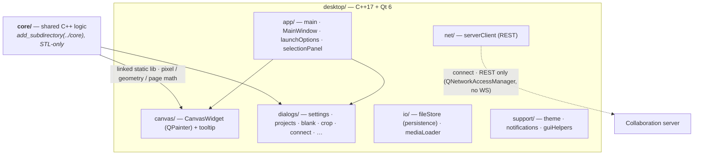

# Stencil — Desktop app (C++ / Qt)

The desktop front-end of Stencil: a C++17 + Qt 6 port that shares its pure logic
with the browser app. For the project overview see the
[repository README](../README.md).

## Architecture



> **Surface diagrams:** [core](../core/README.md#architecture) · [server](../server/README.md#architecture) — or the whole-system view in the [repository README](../README.md#architecture).

## Dependencies

Per the project's dependency policy, only **two** third-party libraries are used:

| Purpose | Library | How it's provided |
|---|---|---|
| Desktop GUI | **Qt 6** (Widgets, Network, Multimedia) | system package (e.g. `qt6-qtbase-devel`) |
| C++ unit tests | **Doctest** | single header fetched into `../core/third_party/doctest.h` (not committed) |

Everything else is the C++17 standard library. The shared logic lives in the top-level
[`../core/`](../core/) library — **GUI-free and STL-only** (it never includes Qt) — which
this app pulls in via `add_subdirectory(../core)`. The same sources also compile to
**WebAssembly** for the browser app and into the **Zig CLI** (`../cli/`).

### Installing the toolchain

```bash
# Fedora
sudo dnf install -y gcc-c++ cmake qt6-qtbase-devel

# Debian / Ubuntu
sudo apt install -y g++ cmake qt6-base-dev
```

## Layout

The shared logic lives in the sibling [`../core/`](../core/) library (see its
[WASM.md](../core/WASM.md) and the repo README for the module list). This directory holds
only the Qt GUI and its integration test:

```
src/                  # Qt GUI, grouped by role (headers included bare across groups)
  app/                # main.cpp, mainWindow, launchOptions, selectionPanel
  canvas/             # canvasWidget (QPainter rendering) + canvasTooltip
  dialogs/            # settings / projects / blank / links / crop / info / shortcuts / connect
  io/                 # fileStore (persistence) + mediaLoader (image/video --src)
  net/                # serverClient: REST + connection manager for the collaboration server
  support/            # theme, notifications, guiHelpers
tests/                # Qt headless integration tests (crop + image fixture)
  fixtures/           # sample.png used by the image test
resources/  packaging/
CMakeLists.txt        # builds stencil; pulls the core via add_subdirectory(../core)
```

### Collaboration server

The **🖧 Servers…** button on the main toolbar (mirroring the browser's connect icon) — also
**Project ▸ 🖧 Servers…** — opens the connect dialog (`dialogs/connectDialog`), which connects to,
reconnects, and disconnects one or more [Stencil collaboration servers](../server/README.md)
through `net/serverClient` (a `QNetworkAccessManager` REST client + a multi-connection
`ConnectionManager`). The desktop talks to the server over Qt Network (REST) only — **no
`QWebSocket` / third-party WebSocket dependency**.

A connected row with a saved credential offers an **invite** action: it mints a fresh
session token (`POST /auth/token`, label `invite`) and copies `<server-url>#token=<token>`
to the clipboard. Pasting such a link into the dialog's **URL** field (Token left empty)
adopts the fragment as the credential — a typed Token always wins over it.

Connected servers expose their stored projects in the **Projects** dialog as a **golden band
(gold fill + bold gold text) with a 🖧 badge**, listed alongside local projects and refreshed live by a short
periodic re-list while the dialog is open (the REST stand-in for the browser's WebSocket
project-event feed). **Open** on a golden row downloads the project's original image + layout
and loads them into the editor, linking the session to `{address, remoteId, version}`. When a
server is connected, **New Project / Save** offers a target — this computer or a server;
saving a server-linked session does a version-guarded `PUT` of name + layout (a 409 surfaces
an "edited elsewhere" message) and uploads the rendered result. Live *co-editing* over a TCP
edit transport is **not** implemented on the desktop.

### AI assistant (LLM chat)

> Getting a model running (Ollama / an OpenAI-compatible server / the collaboration
> server's Anthropic proxy), verification and troubleshooting:
> [root README → AI assistant](../README.md#ai-assistant--setting-up-a-model).

The **✦ Assistant** toolbar button (also **View ▸ Assistant**, `Alt+G`) toggles a chat
dock (`app/chatDock`) that — unlike the fixed selection panel — is fully movable: dock it on
any of the four window edges or float it as a free window (drag to move, resize normally);
the placement persists via `QMainWindow::saveState()` in the settings file. Docked, it slides
in and out from its edge (`MainWindow::setChatShown`, ~0.34 s in / 0.26 s out, browser panel
parity) and reopens at the width it was dismissed at. Prompts go to the provider configured
in the dock's own gear (the composer's **…** menu ▸ Settings, **View ▸ AI Assistant Settings…**, or
`Alt+Shift+G` — the shared `openAssistantSettings` hotkey, rebindable in the Shortcuts window; pressed
again inside the dialog it closes it) — a dedicated **Assistant** dialog (`dialogs/assistantSettingsDialog`,
browser `llmSettingsModal` parity) with only the provider/base URL/model/API key/server rows,
hiding whichever are irrelevant to the chosen provider; the same fields also stay in the full
**Settings ▸ AI assistant** group, and both write the same keys. Choose Ollama or any local
OpenAI-compatible server (LM Studio etc.) called directly over Qt Network (`llm/qtLlmTransport`), or Anthropic
Claude proxied by a connected collaboration server — the API key never leaves the server. The
model answers with a validated *op-plan* (see [`../llm-contract/llm-contract.md`](../llm-contract/llm-contract.md))
executed through the same appliers the toolbar uses (`llm/planExecutor`): crop, quarter
rotates, filters/tint, layout lines (including vision-based "extract the lines from this
image"), formulas, page formats, blanks — and can return several **variant** images per
prompt, each opened as its own project entry. Attach SEVERAL images and one plan can work
them in turn (contract §2.1): an `image` op switches the working image to the Nth attachment
and a `save` persists that result as its own local project (one project per image, named
after it; the layout self-check sits those turns out). It can also read and write the **local
filesystem** where you point it: `{"op":"openFile","path":"~/Pictures/a.png"}` opens a file
(image/video, a `.json` layout, or a `.stencil` project) and `save`'s optional `path` writes the
result to a folder or file — both only for a path **you** wrote in the conversation (the same
user-echo rule `openUrl` has), gated to the formats the editor opens; an un-echoed path blocks
the `openFile` and is dropped with a note for a `save`. Attach images ("use as working image" or
"analyze") or videos — frames are extracted with the existing Qt Multimedia pipeline
(`io/mediaLoader`), can open as separate projects, and the source video can be uploaded to a
connected server (file kind `video`); the video itself is never sent to the model. Provider,
endpoint URL (editable, localhost defaults pre-filled), model, and key live in the settings
JSON (`llm*` fields). The dock's header carries a **trash** button ("Clear the conversation")
that wipes the transcript, the attachments, and the replayed history in one go — the provider
settings and the working image stay put; it is disabled while a turn is in flight. The canvas
right-click menu also carries an **Assistant ▸** submenu (hidden when the provider is `none`),
a nested entry in the top group just above the drawing actions — a capped transcript
over a resizable composer (drag the splitter, as in the dock) that drives the same pipeline and
the same history as the dock, so you can prompt without opening it, with the dock's own
composer trio — send/stop, attach, and the settings gear with its provider dot. Both views
render the one conversation: whichever surface you send from, the other shows the same rows in
the same order, and a surface opened later renders what already happened. The menu and its submenu stay open while you chat; attach
and the gear dismiss the menu first (a modal dialog can't live under a popup grab) and stage
into the same attachment state; variant results are announced there but rendered with
thumbnails in the dock. New
transcript cards fade and slide in (~140 ms), matching the browser's motion, and cards
dissolve toward the transcript's edges as it scrolls (`src/app/scrollReveal.hpp`, the
desktop port of the browser's `.reveal-item`; the projects list rows fade the same way
through `ProjectRowDelegate`). Nothing is dimmed when there is nothing to scroll.

### Architecture parity with the browser app

The C++ app deliberately mirrors the JS module structure so the two read the same, and
its shared logic *is* the same code the browser runs (compiled to WebAssembly). The
behavioral-parity contract and the core's design principles — including the one deliberate
divergence, the eval-free recursive-descent `formulaParser` that replaces the browser's
`new Function(...)` — are documented with the core: see
[`../core/README.md`](../core/README.md).

Like the browser app, each project carries an optional **accent colour** that paints its
name everywhere it appears — the toolbar project-name field, the window title field, and
the rows in the Projects window. Set or clear it from the swatch button next to the
project name or the per-row "Set color…" / "Clear color" actions in the Projects window
(empty = a neutral muted grey, readable on light and dark). The colour is saved with the project and, for a
server-backed project, pushed to the collaboration server so every connected client
(browser/desktop/CLI) re-renders the name in it.

## Build

```bash
# from this directory (desktop/)
cmake -S . -B build -DCMAKE_BUILD_TYPE=Release
cmake --build build -j
```

- `stencil_core`  — static library of the shared logic (defined in `../core/`, pulled in
  here via `add_subdirectory`; its own Doctest suite is turned **off** for the desktop
  build and run by the dedicated core build instead).
- `stencil`       — the Qt desktop app (built only if Qt 6 is found; otherwise
  configuration prints a notice and skips it, so the core still builds on a machine
  without Qt).
- `stencil_crop_headless` — a Qt offscreen integration test of the crop canvas (ctest).

To build and run the **core's** unit suite directly: `cmake -S ../core -B ../core/build &&
ctest --test-dir ../core/build`.

The plain build above bakes a repo-local `desktop/.stencil` runtime-state dir
(handy for development) and links Qt dynamically — it is **not** a distributable
binary. For that, see below.

## Release packaging

A distributable build differs from the dev build in two ways: runtime state goes
to the **per-user config dir** instead of the repo (`-DSTENCIL_DEV_STATE_DIR=OFF`),
and Qt is **bundled alongside the app** so it runs on a machine without Qt
installed. Both are handled by the install + CPack flow:

```bash
# from this directory (desktop/)
cmake -S . -B build -DCMAKE_BUILD_TYPE=Release -DSTENCIL_DEV_STATE_DIR=OFF
cmake --build build --config Release -j
cpack --config build/CPackConfig.cmake -B build/dist
```

`cpack` runs Qt's deploy helper (`macdeployqt` / `windeployqt`, best-effort on
Linux — Qt ≥ 6.3) to copy the Qt libraries and plugins next to the app, then wraps
the result into one self-contained package in `build/dist/`:

| Platform | Package | Form |
|---|---|---|
| macOS | `stencil-<ver>-Darwin-<arch>.dmg` | `stencil.app` bundle |
| Windows | `stencil-<ver>-Windows-<arch>.zip` | `bin/stencil.exe` + Qt DLLs |
| Linux | `stencil-<ver>-Linux-<arch>.tar.gz` | `bin/` + `.desktop` entry & icon |

The shipped binary is the same `stencil` — packaging only changes how it's laid
out and where it stores state, not what it is. On macOS, signing/notarization is
out of scope here; an unsigned `.dmg` warns on first launch.

**App icon.** The macOS bundle's icon is generated at configure time by
`packaging/make-icns.sh`, which rasterises `../browser/favicon.svg` (the shared
single-source artwork) into a multi-resolution `stencil.icns` via `sips` +
`iconutil` and lands it in `Contents/Resources/` with `CFBundleIconFile` wired up.
Nothing binary is committed — the icon stays derived from the SVG. If `sips`/
`iconutil` are missing CMake warns and builds iconless.
This is a flat `.icns`, so it renders full-colour and does **not** follow the
macOS 26 Dock *tint* appearance — system tinting only applies to layered,
appearance-aware icons authored as an Icon Composer `.icon` and compiled with
`actool`, which needs a full Xcode install (the Command Line Tools alone can't
build it). Adding a tintable layered icon is a future follow-up.

CI builds these for all three platforms on every `v*` tag and attaches them to the
GitHub release (`.github/workflows/release.yml`); a manual `workflow_dispatch` run
produces the same packages as downloadable workflow artifacts without cutting a tag.

> On Qt < 6.3 the install step can't bundle Qt automatically — run the platform's
> `*deployqt` tool against the built app manually before packaging.

## Project files (`.stencil`)

The **Data** menu's *Open Project… (Ctrl+Shift+F)* / *Save Project As… (Ctrl+Shift+S)* read
and write a portable **`.stencil`** file — the original image, the layout (crop/rotation/
filter/lines/page), project metadata, and the current colour theme, all in one document that
opens on any Stencil surface (see `browser/README.md`). Serialization lives in
`fileStore::buildProjectFile` / `parseProjectFile` (QtCore-only, base64 image — the QImage
codec work stays in `MainWindow::openProjectFile` / `saveProjectFileAs`); `openPathFromOS`
routes a `*.stencil` double-click / drag / file-arg to the same open path.

Packaging registers the type so the OS shows `.stencil` files with the Stencil icon and
opens them on double-click: **macOS** via an exported `com.stencil.project` UTI +
`CFBundleDocumentTypes` in `packaging/MacOSXBundleInfo.plist.in`; **Linux** via
`packaging/stencil-mime.xml` (shared-mime-info) + a themed mimetype icon + the
`application/x-stencil` entry in `packaging/stencil.desktop`. (Windows has in-app open/save
but no installer-based association.)

## Test

The **core's** Doctest suite (one suite per core module, the WebAssembly ABI, and the new
CLI image-pipeline modules) lives with the core and is built/run there:

```bash
cmake -S ../core -B ../core/build -DCMAKE_BUILD_TYPE=Release
cmake --build ../core/build -j
ctest --test-dir ../core/build --output-on-failure   # or ../core/build/stencil_tests
```

Doctest is a single header (pinned **v2.4.11**), fetched into `../core/third_party/doctest.h`
at configure time with SHA-256 verification — nothing to commit or install.

The **desktop** build registers several Qt offscreen CTest cases of its own. Most exercise a
component in isolation; `stencil_mainwindow_gui` is a full GUI **end-to-end** built with the
**Qt Test framework** — it drives the real `MainWindow`:

- `stencil_mainwindow_gui` — GUI e2e (QtTest): loads an image via the OS-open path, then
  drives the **real, shared QActions** (menu bar / toolbar / context menu reuse the same
  objects) and sends real mouse clicks to the live canvas, asserting on observable widget
  state. Five flows: action-enablement on load, a **Rotate** round-trip (asserting the
  quarter-turn W↔H dimension swap, not just the counter), **draw → New Line → Undo → Redo**
  (exact point count + history availability), a **filter** action landing on the canvas
  (exclusive group), and **Clear All Lines** emptying it. It verifies MainWindow's *action
  wiring* end-to-end; the underlying canvas *logic* is covered by the isolated headless
  suites below.
- `stencil_crop_headless` — crop canvas integration (`CanvasWidget` + the core crop geometry).
- `stencil_image_headless` — loads a real PNG from `tests/fixtures/` and runs it through the
  load → crop → core image-filter path (the desktop analogue of the CLI's fixture tests).
- plus `stencil_holddraw_headless`, `stencil_layout_headless`, `stencil_projectcolor_headless`,
  `stencil_deeplink_headless`, and `stencil_livefeed_headless`.

```bash
ctest --test-dir build --output-on-failure   # runs every headless test (needs Qt)
```

> **Where desktop e2e lives.** This QtTest target is the desktop app's only end-to-end test;
> the repo's cross-surface [`e2e/`](../e2e/) Playwright harness deliberately does **not** cover
> desktop (a native Qt binary is not a wire-protocol surface it can drive) — it exercises the
> browser app, the Chrome extension, and the Go server binary instead. The two are complementary.

## Run the GUI

```bash
./build/stencil
```

Open an image, left-click to add polyline points, **New Line** (Alt+S) to finish
the current line, and right-click for the canvas context menu. The status bar shows
the cursor's pixel and page (cm) coordinates, computed by the shared `core` exactly
as the browser app does.

### Launch options (CLI)

The executable accepts flags that pre-open content at startup — the desktop
counterpart of the browser app's URL deep-links (`#stencil=` / `?open=`):

```bash
./build/stencil [options]
```

| Flag | Description |
| --- | --- |
| `--theme <dark\|light>` | Set (and persist as) the default theme for this launch, overriding the saved/system choice. |
| `--project <name>` | Open an existing, editable saved project by name (case-insensitive). Takes precedence over `--src`. |
| `--src <path\|url>` | Open an image by local path, fetch and open a remote image URL, or grab a frame from a video file / direct media URL. |
| `--frame <n>` | The 0-based video frame to open (default: first frame; ignored for still images). |
| `--incognito` | Edit without saving. Honored unless a saved `--project` is being opened — so `--incognito` alone starts a blank incognito editor. |
| `--layout <path\|url>` | A layout JSON applied once the `--src` image loads successfully (local file or URL). Ignored without an image. |
| `--projects` | Open the Projects window at launch. |
| `<file>` (positional) | A bare image / video / layout-JSON path — the form an OS file-association or "Open With" passes. `*.json` is applied as a layout, anything else opened as an image/video. Lower priority than `--src`. |
| `stencil://…` (positional) | A `stencil://open?…` deep link (the argv form a Linux scheme handler passes via `%u`). See **Deep links** below. |
| `--help` | Show the full option list. |

Examples:

```bash
# Force dark mode for this launch
./build/stencil --theme dark

# Open a local image, starting in light mode
./build/stencil --src ~/Pictures/floorplan.png --theme light

# Fetch and open a remote image
./build/stencil --src https://example.com/diagram.jpg

# Grab the 120th frame of a video file and edit it without saving
./build/stencil --src ~/clips/walkthrough.mp4 --frame 120 --incognito

# Open an image and immediately apply a saved layout (local file or URL)
./build/stencil --src floorplan.png --layout floorplan-layout.json
./build/stencil --src floorplan.png --layout https://example.com/layout.json

# Reopen an existing saved project by name
./build/stencil --project "Kitchen remodel"

# Launch straight into the Projects window
./build/stencil --projects
```

The image / URL / video and layout resolution runs asynchronously on the event
loop after the window appears; a toast reports success or failure. Remote images
and video frames are adopted in-memory (like a clipboard paste), so they carry no
on-disk path; a local image `--src` keeps its path for session / project saves.
Video support reads **direct** media files/URLs (it does not resolve streaming
*page* links such as a YouTube watch URL).

### Deep links (`stencil://`) and "Open In…"

The desktop app registers the **`stencil://` URL scheme** (macOS via
`CFBundleURLTypes` in the bundle plist, Linux via `x-scheme-handler/stencil` in the
`.desktop` file; Windows registration is not shipped yet). Opening a link launches a
fresh window — the same "separate client" a user would open manually:

```
stencil://open?server=<origin|host[:port]>&id=<projectId>[&version=<n>][&incognito=1]
stencil://open?src=<http(s) url|data:…>[&layout=<inline JSON>][&frame=<n>][&incognito=1]
```

A `server`+`id` link connects to that collaboration server like a fresh client —
reusing a saved token for the origin, else minting one via `POST /auth/token` (no
token ever rides a link) — and opens the project; with `incognito=1` it opens an
unlinked incognito copy (nothing pushed back). A `src` link opens an image (http(s)
URL or inline `data:` URL — never a local path; links are remotely clickable) and
applies the inline `layout` JSON once loaded. Connecting to a server the machine has
never used first asks for confirmation, so a drive-by link can't silently add one.

Outbound, **Project ▸ Open In…** (also on the toolbar) mirrors the current session
the other way: into the **browser app** (the `#stencil=` fragment; base URL set in
Settings → "Browser app URL") or the **Telegram bot** (server projects only; set
Settings → "Telegram bot" to your bot's username). The browser's `launch.html`
bounce page carries bot→desktop links, since chat apps only linkify http(s).

### OS-shell integration

The same open paths are wired into the desktop shells:

- **Drag-and-drop** — drop an image, video, or layout `*.json` onto the window to
  open / apply it (Photoshop-style). Cross-platform.
- **File associations / "Open With"** — opening a declared file type launches (or,
  on macOS, signals a running) Stencil with that file:
  - **macOS** — a `QFileOpenEvent` (Finder double-click, drag-onto-Dock, "Open
    With") routed to the open window; the bundle declares image / movie / JSON
    document types in its `Info.plist`. Events arriving during launch are buffered
    until the window is ready.
  - **Linux** — the `.desktop` file declares `MimeType=` and opens the file via the
    `%f` positional argument.
  - **Windows** — registering a file association (in your installer) makes a
    double-click launch the app with the file as a positional argument, which the
    same code path opens.
- **App-icon menu** — right-click the icon for quick actions:
  - **macOS Dock menu** — *New Incognito Editor*, *Open Projects…*, and the most
    recently updated projects (each opens in its own window). Set via
    `QMenu::setAsDockMenu()`.
  - **Linux launcher actions** — *New Incognito Editor* and *Open Projects* via the
    `.desktop` `Actions=` entries (static; the freedesktop spec has no dynamic
    "recent" list).
  - **Windows Jump List** — *not implemented.* Qt 6 dropped the `QtWinExtras` jump-
    list API, so this needs native Win32 (`ICustomDestinationList`) code; the Dock /
    launcher equivalents above cover macOS and Linux.

> **Install-time caveat:** file associations, the macOS Dock document-type hooks,
> and the Linux launcher actions only take effect once the app is **installed**
> (`cmake --install build`, then `update-desktop-database` on Linux / LaunchServices
> registration on macOS) — not when running the binary straight from `build/`.
> Drag-and-drop onto the window and the CLI flags work regardless.

The desktop app mirrors the browser app's interaction surface:

- **Light / dark theme** (default light) — Ctrl+D or Settings; QSS derived from
  `browser/css/theme.css` tokens.
- **Top menu bar** (File / Edit / View / Project / Help) plus a toolbar, sharing the
  same actions.
- **Keyboard shortcuts** ported from `browser/js/config/hotkeysConfig.json`
  (embedded as a Qt resource) with **tooltips** showing label + shortcut. Project
  actions include *Remove Current Project* (`Ctrl+Alt+R`, the trash) and *Rename
  Project* (`Ctrl+Alt+N`, which opens the toolbar name field for inline editing —
  the ✎ beside it). `shareImage` (`Ctrl+Alt+S`) is browser-only: this app has no
  share action, so the shortcut appears in the Shortcuts window but does nothing.
- **Right-click context menu** on the canvas (New Line, Delete Last Point, Clear
  All, Deselect). `Shift+F10` (shared hotkey `contextMenu`) opens it from the keyboard,
  under the pointer when it rests over the canvas, else at the canvas centre.
- **Page formats** — the toolbar page selector offers the full ISO 216/269
  series (A0–A10, B0–B10, C0–C10) plus a custom W×H size. Every option shows its
  physical size in the active display unit (cm/in), and the toolbar combo is
  searchable: type to filter the list (e.g. `b5`), case-insensitively. The same
  option list backs the Settings dialog and the Image Links quick-crop picker.
- **Image filters** — none / B&W / sepia / invert / contour / custom duotone
  tint, from the Style toolbar row, the canvas context menu, or the Alt+B
  cycle (none → B&W → sepia → invert → contour → tint). Contour runs the
  core's Sobel edge detection (dark edges on white); every mode produces the
  same pixels as the browser app by construction (shared `core/` math).
- **Selection panel** dock — the active line's points and live measurements (point
  count, segment count, total length).
- **Visuals & Settings** dialog (theme, motion, menu-bar placement, autosave, show
  points/lines, default visuals, page size), a **Projects** dialog (save / open /
  delete, with the `core/projectsStore` one-week expiry sweep), a **Controls &
  Shortcuts Info** dialog (the browser's info modal, rendered from the shared
  `infoConfig.json`), and a **Keyboard Shortcuts** editor (the browser's hotkey table
  drawn in the tooltips' keycaps: click a combo and press the new chord; edits apply
  and persist live, with a per-row reset and Reset All). All three wear the shared
  modal shell (`support/modalChrome`), as do every prompt and picker the app asks with
  — the New Project name, the server pickers, the expired-session token (shown, not
  echoed as dots: a pasted token you cannot read is one you cannot check, and the Token
  field above it is plain text too) — through `promptModal` / `chooseModal`, the
  browser's `app.prompt` / `app.choose` twins; no native `QInputDialog` /
  `QMessageBox` is left in the app.
  - *Use the system menu bar* (`nativeMenuBar`, default **on**) puts the menus where
    the platform does — the macOS menu bar, a GNOME/Unity app menu — and turning it
    off keeps them inside the window. That escape hatch matters because Qt's export
    leaves an empty in-window bar on some GNOME setups; it takes effect on restart,
    and the Visuals & Settings shortcut (`Alt+V` by default, from the shared
    hotkey registry) reopens this dialog even with no menus showing. Inert on
    Windows, which has no global bar (the checkbox is disabled there).
  - *Motion* (the browser's Motion section, same two rows): **Drawing animation**
    (`drawingAnimations`, default **on**) is the canvas stroke flight — a new vertex
    travels to where you put it, popping and rippling as it lands — and **Interface
    animation** (`motionMode`, default **particles**) is how everything else moves:
    *Particles (dust)* has windows, menus, checkbox marks, list rows and the canvas form
    out of grains and come apart into them; *Sliding (no dust)* keeps every flight but
    none of the particles, so each surface travels as a ghost between the icon and its
    box instead; *None* stops motion altogether — the same end state `STENCIL_NO_ANIM=1`
    has always given (that env var still overrides the setting). Both apply live and
    persist in `settings.json`; the gates themselves are `support/motionPrefs.hpp`.
- **Toolbar sections**: every group in all three tool rows carries an uppercase header
  (`makeToolSection`) — IMAGE / DESCRIPTION & ATTRIBUTES / PROJECTS / CONNECTIONS & CHAT /
  EDIT / DRAW / ZOOM / SETTINGS on the main row, PAGE / FORMULA on the second, FILTER /
  VIEW / LINE / POINT on the third — mirroring the browser toolbar's named clusters.
  DESCRIPTION & ATTRIBUTES (description · keywords · image links, `Alt+Shift+D` /
  `Alt+Shift+K` / `Ctrl+Shift+L`) edits the saved project's metadata through the same
  store path as the Projects window's row menu, and is greyed out — with the reason on the
  tooltip — until a project is saved. Fields inside a group keep
  their own inline label, so a colour swatch reads as "LINE ▸ Color". Section buttons carry
  a solid accent (or danger) fill; **Fit to window** is the browser's ghost box instead
  (outlined, glyph in the text colour), and anything unavailable — buttons *and* combos, e.g.
  the image filter with no image — drops to the muted disabled face.
- **Removal motion**: a cleared chat card and a cleared image don't blink out — a snapshot
  is scattered cell by cell (`support/disintegrateOverlay.hpp`, the port of the browser's
  `disintegrate()`), and toasts rise in and drop away instead of only fading.
- **Palette swap**: changing theme or accent snapshots the window, restyles, then erases the
  snapshot with a circle growing from the centre (`support/themeSwapOverlay.hpp`).
- **Drag-and-drop motion**: the split drop-zones overlay leaves on a fade rather than
  blinking out, and a dropped image's canvas fades up into place — so the file is visibly
  the thing that just arrived. Entering fullscreen plays the canvas **stretching** out of
  the viewport box it had, and leaving **minimises** it back (`beginFullscreenZoom`); the
  ramp only ever ends on the zoom you picked, so the motion never changes your view. Both
  mirror `browser/js/ui/motion.js`.
- **Toast notifications** and **autosave**: the in-progress drawing (points, page
  format, zoom, image path) is autosaved to a gitignored temp config
  (`desktop/.stencil/session.autosave`) and **restored on next launch**; settings and
  projects live alongside it in `desktop/.stencil/` (path baked via the
  `STENCIL_STATE_DIR` build define; the directory is in `.gitignore`).

> Out of scope: rectangle/area drawing, the editable coordinate table, the per-line
> styling panel, drag-and-drop, the fullscreen overlay layer, and
> clipboard copy/paste of the image + layout JSON.
