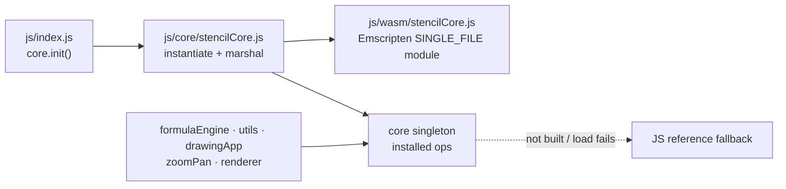

# Stencil core → WebAssembly

The `desktop/core/` library is GUI-free and STL-only, so the same sources that
back the Qt desktop app can compile to WebAssembly and back the **browser** app —
replacing its hand-written JS engines with one shared, tested implementation.

`desktop/core/wasmApi.cpp` is a thin `extern "C"` surface over the core. The
`if(EMSCRIPTEN)` block in `desktop/CMakeLists.txt` builds it into
`stencil_core.js` + `stencil_core.wasm`.

The browser app runs the shared C++ core via WebAssembly. The module is built with
`SINGLE_FILE=1` (wasm embedded as base64 in the `.js`, so it loads under `file://`
with no `fetch`) and emitted to `browser/js/wasm/stencilCore.js`. That file is a
generated artifact, not committed (it is gitignored): CI builds it for the parity
check, and you build it locally to exercise the wasm path (steps below).

At boot, `js/index.js` calls `core.init()` on the `core` singleton exported by
`js/core/stencilCore.js`, which instantiates the module and installs typed wrappers
into the singleton. Every consumer calls through it and falls back to its built-in
JS when no wasm op is installed — so on a fresh checkout (module not built), or if
wasm fails to load, the app degrades to the JS reference path, which is also what
Node tests (which never load wasm) exercise.



A normal native `cmake` build never enters the Emscripten branch and produces the
same `stencil_core`, `stencil_tests`, and `stencil_gui` targets; only `emcmake`
(which defines `EMSCRIPTEN`) builds the wasm module. To rebuild it after editing the
core, follow *Build the wasm module* below and copy `stencil_core.js` to
`browser/js/wasm/stencilCore.js`.

## What it replaces

| Browser JS call site (wasm-backed) | Exported wasm function(s) |
|---|---|
| `core/formulaEngine.js` validate / apply | `stencil_formulaValidate`, `stencil_formulaApply` (`stencil_formulaEvaluate` available) |
| `utils.js` `distToSegment` | `stencil_distToSegment` |
| `utils.js` `parseHex` (also feeds `hexToRgba`) | `stencil_parseHex` |
| `drawingApp.js` `getPageDimensions` / `pixelToPageCoords` (raw) | `stencil_pageDimensions`, `stencil_pixelToPageRaw` |
| `drawingApp.js` `#shouldCloseShape` gate | `stencil_shouldCloseShape` |
| `renderer.js` `drawImageWithFilter` (custom duotone) | `stencil_applyFilterRGBA` |
| `drawingApp.js` `#rotateSelectedLine` rotation + bbox pivot | `stencil_rotatePoints`, `stencil_boundingBoxCenter` |
| `zoomPan.js` `clampScale` | `stencil_clampScale` (`anchoredZoom` / `rectZoom` available) |

The bw/sepia filters stay on the browser's native CSS `ctx.filter` (GPU-fast,
exact); only the custom duotone — which the JS already did as a per-pixel loop —
routes through `stencil_applyFilterRGBA` (grayscale + tint in one pass).

The image-filter math lives once in `core/imageFilter.{hpp,cpp}`
(`filterPixel` / `applyFilterRGBA`); the desktop canvas routes its bw / sepia /
duotone-tint pixels through it, and `stencil_applyFilterRGBA` is the same code
for the browser. `applyFilterRGBA` takes a canvas `ImageData.data` buffer
(interleaved RGBA8) and filters it in place, preserving alpha — so the browser
computes grayscale + tint in one pass instead of a CSS `grayscale()` followed by a
per-pixel tint.

(`historyStack.js` and `projectsStore.js` remain available in the core; add
wrappers to `wasmApi.cpp` the same way if the browser should consume them too.
The multi-line hit-testers — `findLineAt` / `findNearestPoint` /
`findNearestSegment` — are core-only: they take a whole `Lines` tree, which wants a
handle-based ABI rather than the flat `double*` surface used here.)

## Testing

Three layers, run by the three CI jobs (`.github/workflows/ci.yml`):

1. **C++ side of the ABI** — `wasmApi.cpp` is plain STL, so it is compiled
   **natively into `stencil_tests`** and every export is exercised by
   `tests/wasmApi.test.cpp` (the `desktop` job). Covers the C++ marshalling (flat
   point arrays, output pointers, filter-mode enum codes, char-code var names)
   even on a machine without `emcc`. `core/imageFilter` has its own suite in
   `tests/imageFilter.test.cpp`.
2. **JS side of the ABI + wasm↔JS parity** — `browser/tests/wasm-parity.test.js`
   loads the real wasm module in Node and asserts each wrapper agrees with the JS
   reference, covering `js/core/stencilCore.js` (strings, char codes, in/out point
   arrays, output pointers, the RGBA pixel buffer). The module is a gitignored
   artifact, so this suite **self-skips when it hasn't been built** (e.g. the
   `browser` job, which runs only `node --test`); the `wasm` job builds the core
   **fresh** and runs the suite against that — failing if `core/` behavior changes
   in a way the JS reference does not match.
3. **JS fallback** — every other `browser/tests/*.test.js` suite runs with the
   backend slots null, so the hand-written fallback stays a faithful stand-in.

## Install Emscripten (emsdk)

```sh
git clone https://github.com/emscripten-core/emsdk.git
cd emsdk
./emsdk install latest
./emsdk activate latest
source ./emsdk_env.sh   # puts emcc / emcmake / emmake on PATH
```

## Build the wasm module

From `desktop/`:

```sh
emcmake cmake -S . -B build-wasm -DCMAKE_BUILD_TYPE=Release
emmake cmake --build build-wasm -j
# -> build-wasm/stencil_core.js  +  build-wasm/stencil_core.wasm
```

`emcmake` defines `EMSCRIPTEN`, so only the `stencil_wasm` target is produced
(no Qt, no Doctest binary). With `emcc` on `PATH`, the browser app wraps these
steps (build + copy into `js/wasm/`) in one convenience script:

```sh
cd browser && npm run build-wasm
```

The native build is untouched:

```sh
cmake -S . -B build -DCMAKE_BUILD_TYPE=Release && cmake --build build -j
```

## How it is wired into the browser app

The module is built `MODULARIZE=1 EXPORT_ES6=1 SINGLE_FILE=1`, so it imports
cleanly and embeds its wasm. `js/core/stencilCore.js` owns instantiation + all the
marshalling (strings, flat point arrays, output pointers, the pixel buffer) and
installs typed wrappers into the `core` singleton. The raw Emscripten surface it
wraps looks like:

```js
import createStencilCore from '../wasm/stencilCore.js';
const mod = await createStencilCore();

const formulaApply = mod.cwrap('stencil_formulaApply', 'number',
  ['string','number','number','number']);
formulaApply('x+9', 'x'.charCodeAt(0), 3, 1); // 12
```

Functions that return multiple doubles (`stencil_pageDimensions`,
`stencil_pixelToPageRaw`, `stencil_anchoredZoom`, `stencil_rectZoom`) take an
output pointer: `stencilCore.js` allocates a small Float64 buffer with `_malloc`,
passes it, reads it back with `getValue(ptr + i*8, 'double')` and `_free`s it.

Each consumer (`formulaEngine.js`, the geometry/color helpers in `utils.js`, the
page-calc + rotate + close-shape helpers in `drawingApp.js`, `zoomPan.js`'s
clamp, `renderer.js`'s custom filter) calls through the `core` singleton and keeps
its JS body as the fallback. Because the wasm is compiled from the same source the
desktop uses, the two front-ends stay in lock-step by construction.

**Building/rebuilding the module:** it's gitignored, so build it locally to run
the wasm path (otherwise the app uses the JS fallback and the parity suite skips).
After editing anything in `core/`, rebuild (see *Build the wasm module*) and copy
the artifact into the browser tree:

```sh
cp build-wasm/stencil_core.js ../browser/js/wasm/stencilCore.js
```

## Notes / decisions

- **`extern "C"` over embind.** The surface is plain C functions over doubles and
  C strings, exposed via `ccall`/`cwrap` with no extra runtime — minimal and
  ABI-stable. embind would also work but is Emscripten-only and heavier; if
  adopted it must live solely in this translation unit and never link into the
  desktop build.
- The wasm translation unit stays **STL-only + core** (no Qt), exactly like the
  rest of `core/`.
