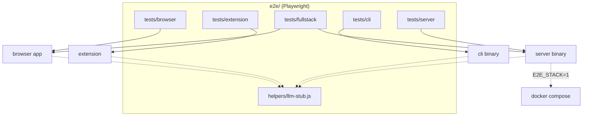

# E2E harness architecture

The system-wide design — the parity contract, canonical data, the layer model, the pattern vocabulary — is in the root [`ARCHITECTURE.md`](../ARCHITECTURE.md).

## Where things go

| Path | Holds | Rule |
|---|---|---|
| `playwright.config.js` | the five projects, workers, the `webServer` | `browser-app`, `extension`, `cli` run parallel (4 workers); `fullstack` and `server-protocol` serial — they share one server's state |
| `helpers/config.js` | the app's host/port (`127.0.0.1:8188`) | the one place; never `:8080`, so a stray `npm run serve` is never reused |
| `helpers/static-server.js`, `compose.js`, `compose-teardown.js`, `compose.llm.yml` | the Node static server; compose up (only `E2E_STACK=1`) / down (only `E2E_STACK_DOWN=1`); the server's LLM env pointed at the stub | the stack is left running between runs on purpose |
| `helpers/boot.js` | `gotoApp(page, { motion })`: navigate, clear state, await `window.stencil` | every browser spec boots through it; `{ motion: 'none' }` for specs that measure geometry mid-gesture |
| `helpers/extension.js` | the persistent-context launch + service-worker/extension-id resolution | headed (`headless: false`, `channel: 'chromium'`); CI wraps in xvfb |
| `helpers/cli.js` | spawns the Zig binary and reads its argv/outcome contract | the same stderr grammar mcp and bot parse |
| `helpers/serverApi.js`, `wire.js` | REST helpers (token issuance with `X-Admin-Token`, project CRUD); WS + raw-TCP clients for the live-edit protocol | |
| `helpers/chat.js`, `drag.js`, `uiPin.js` | LLM wire-shape readers + the chat gestures; the real-finger CDP touch driver; the computed-style + DOM-shape pin recorder | |
| `helpers/llm-stub.js` | the scriptable stub LLM (openai-compat / ollama / Anthropic Messages) | **all model traffic ends here**; no spec reaches a real provider |
| `fixtures/` | host pages the extension scanner loads over http, `project.stencil`, `cli-layout.json` | `project.stencil` is opened by BOTH the browser and the cli specs, so the two surfaces are proven on the same bytes |
| `pins/<platform>/` | the UI-pin baselines, one JSON per pinned state | only `macos/` is recorded; other platforms skip |
| `tests/browser/`, `tests/extension/`, `tests/fullstack/`, `tests/server/`, `tests/cli/` | one representative flow per surface, named by what it proves | a spec drives the real artifact through its public contract (`window.stencil`, the wire protocol, argv) — never an internal |

## Rules

1. **Real artifacts, public contracts.** A spec drives `window.stencil`, the REST/WS/TCP
   wire and the CLI's argv; none imports app code.
2. **One stub for every model**, on a fixed port for the stack specs (`LLM_STUB_PORT`, 8189,
   overridable via `E2E_LLM_STUB_PORT`) because compose bakes it into `LLM_BASE_URL` at boot
   — which is why the `E2E_STACK=1` run goes single-file. Every other spec takes an ephemeral
   port.
3. **State isolation.** `boot.js` clears `localStorage` per navigation and the config blocks
   the app service worker.
4. **Pins are computed styles + DOM shape, not screenshots**, so a failure names the element
   and the property that moved. They freeze the app's own motion and pin the light theme (a
   driven Chrome reports `prefers-color-scheme: light` regardless of the OS).
5. **Motion is switched off through the app's own setting** (`drawingApp_motion`, read
   before first paint), not by emulating `prefers-reduced-motion`, for the specs that measure
   geometry mid-gesture (`drag`, `modal-layout`, `project-open-gestures`).
6. **Server auth is always admin-gated** (`ADMIN_TOKEN`, default `e2e-admin`), so the LLM
   proxy enables and the llm-proxy spec runs instead of self-skipping.
7. **Stack-dependent specs self-skip** without `E2E_STACK=1`; the `cli` project self-skips
   without a binary. A skip is reported as a skip, not as a pass.
