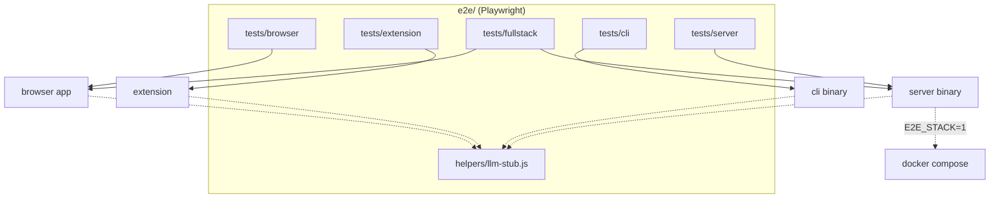
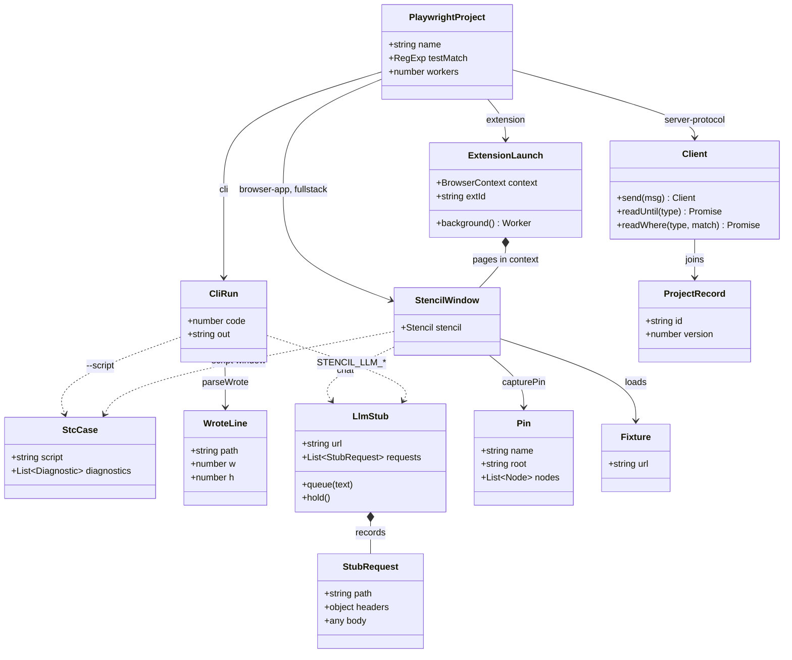

# E2E harness architecture

The system-wide design — the parity contract, canonical data, the layer model, the pattern vocabulary — is in the root [`ARCHITECTURE.md`](../ARCHITECTURE.md).

`e2e/` is one Node/Playwright harness that drives the **built artifacts** of four surfaces
from outside: the served `browser/` app in a real Chromium, the unpacked MV3 `browser-extension/`,
the Zig `cli/` binary as a subprocess, and the Go `server/` over its REST/WS/TCP wire. It
imports no app code, never links or recompiles `core/`, and reaches no real LLM: every model
call ends at its own stub. The desktop app's GUI e2e is a QtTest target in `desktop/tests/`,
not here.



## Layers

`helpers/config.js` → the helpers (`serverApi.js` feeds `wire.js`, `cli.js` feeds
`consoleCli.js`; `boot.js` and `static-server.js` read `config.js`; every other helper stands alone on `@playwright/test`
and Node built-ins) → `tests/<project>/*.spec.js`. A spec imports helpers, Playwright and
Node built-ins only; specs never import each other, and no helper imports a spec.
`playwright.config.js` sits above all three, reading `config.js` for `APP_URL`. By
convention; no lint.

## Where things go

| Path | Holds | Rule |
|---|---|---|
| `playwright.config.js` | the test projects, their workers, the `webServer` | `browser-app`, `browser-extension`, `cli` run parallel; `fullstack` and `server-protocol` serial — they share one server's state |
| `helpers/config.js` | the app's host/port (`127.0.0.1:8188`) | the one place; never `:8080`, so a stray `npm run serve` is never reused |
| `helpers/static-server.js`, `compose.js`, `compose-teardown.js`, `compose.llm.yml` | the Node static server; compose up (only `E2E_STACK=1`) / down (only `E2E_STACK_DOWN=1`); the server's LLM env pointed at the stub | the stack is left running between runs on purpose |
| `helpers/boot.js` | `gotoApp(page, { motion })`: navigate, clear state, await `window.stencil` | every browser spec boots through it; `{ motion: 'none' }` for specs that measure geometry mid-gesture |
| `helpers/extension.js` | the persistent-context launch + service-worker/extension-id resolution | headed (`headless: false`, `channel: 'chromium'`); CI wraps in xvfb |
| `helpers/cli.js` | spawns the Zig binary and reads its argv/outcome contract | the same stderr grammar mcp and bot parse |
| `helpers/consoleCli.js` | pipes `/command` lines into `stencil --console` and collects the run | async spawn, never `spawnSync`: a stub LLM lives in this process and a sync child would block it out |
| `helpers/stcCases.js` | reads the shared `.stc` corpus (`browser/js/config/script/fixtures/cases.txt`): a case's script and its expected diagnostics | script inputs come from the corpus, so the cli and the browser run what the core is proved on |
| `helpers/serverApi.js`, `wire.js` | REST helpers (token issuance with `X-Admin-Token`, project CRUD); WS + raw-TCP clients for the live-edit protocol | |
| `helpers/chat.js`, `drag.js`, `uiPin.js` | LLM wire-shape readers + the chat gestures; the real-finger CDP touch driver; the computed-style + DOM-shape pin recorder | |
| `helpers/png.js` | `solidPng(w, h, rgb)` / `pngFile(w, h, name)`: a real truecolour PNG encoded with Node's own `zlib` | the picture a spec hands a file input; `fixtures/pixel.png` is 1x1, too small for a preview, a crop or a dust stage |
| `helpers/llm-stub.js` | the scriptable stub LLM (openai-compat / ollama / Anthropic Messages) | **all model traffic ends here**; no spec reaches a real provider |
| `fixtures/` | host pages the extension scanner loads over http, `project.stencil`, `cli-layout.json` | `project.stencil` is opened by BOTH the browser and the cli specs, so the two surfaces are proven on the same bytes |
| `pins/<platform>/` | the UI-pin baselines, one JSON per pinned state | only `macos/` is recorded; other platforms skip |
| `tests/sizeBudget.test.js`, `sizeBudget.json` | the surface's size + comment ratchet: the 230-line cap, the recorded floors, the per-directory comment share | a `node --test` lint, not a spec — it reads `playwright.config.js` to prove every spec is claimed by a project; `npm test` runs it before Playwright |
| `tests/browser/`, `tests/browser-extension/`, `tests/fullstack/`, `tests/server/`, `tests/cli/` | one representative flow per surface, named by what it proves | a spec drives the real artifact through its public contract (`window.stencil`, the wire protocol, argv) — never an internal |

## Entities



| Entity | What it is | Owned by / lifetime | Relates to |
|---|---|---|---|
| `PlaywrightProject` | one entry of `projects[]` in `playwright.config.js`: `name`, `testMatch`, `workers`, `fullyParallel`, `use` | the config; one run | selects which `tests/<dir>/` runs, and whether serially |
| `StencilWindow` | the booted app page, the `Window & { stencil }` typedef in `helpers/boot.js`; `gotoApp()` resolves it once `window.stencil` exists | the spec; one `page` per test (browser-app), one per context (fullstack) | every facade call, `expectPin`, `seedLlmSettings` |
| `ExtensionLaunch` | `launchExtension()` in `helpers/extension.js`: `{ context, background, extId }`, `extId` read from the service worker's URL host | a `test.describe` via `beforeAll` / `afterAll` | host tabs and `chrome-extension://<extId>/...` pages opened on `context` |
| `CliRun` | `runCli()` in `helpers/cli.js`: `{ code, stdout, stderr, out }` of one `spawnSync` of `CLI_BIN` | the test; `cwd` is `testInfo.outputPath()` | `parseWrote`, `pngSize` on the written file |
| `StcCase` | `stcCase(name)` in `helpers/stcCases.js`: one corpus case as `{ script, diagnostics }`, each diagnostic `{ line, col, len, severity, message, code }`; `writeStcCase` drops the script into a run directory as `<name>.stc` | the repo; read per call | the cli's `--script` / `--script-check` / `/script`, and the browser's script window |
| `WroteLine` | `parseWrote()`: the `wrote <path> (<w>x<h> px · <page>)` success line as `{ path, w, h }` | derived from `CliRun.out` | the CLI contract mcp and bot also parse |
| `ProjectRecord` | the server's project as returned by `createProject()` / `listProjects()` in `helpers/serverApi.js` | the running server; per test | `Client.join` targets its `id`; PUT guards on its `version`. Canonical in `server/internal/protocol` |
| `Client` | the class in `helpers/wire.js`: one promise-based shape over WS (`dialWS`, one JSON frame per message) and raw TCP (`dialTCP`, NDJSON); `T` names the frame types | the test, `close()` in `finally` | the `WSMessage` envelope, canonical in `server/internal/protocol` |
| `LlmStub` | `startLlmStub()` in `helpers/llm-stub.js`: `url`, `port`, `requests`, `queue`, `hold`, `release`, `reset`, `close` | a `test.describe` via `beforeAll` / `afterAll`, `reset()` per test | the app, the CLI and the server dial it; specs assert on `requests` |
| `StubRequest` | one recorded POST, `{ method, path, headers, body }`; GET probes are not recorded | `LlmStub.requests` | `contentText`, `imageUrls` in `helpers/chat.js` read it |
| `Pin` | `capturePin()` in `helpers/uiPin.js`: `{ name, root, nodes }`, settled by two agreeing reads; each node is `{ path, tag, classes, style, text }` | `pins/<PIN_PLATFORM>/<name>.json`, per platform | `diffPins(baseline, actual)` names the first differing paths |
| `Fixture` | a file in `fixtures/` served at `APP_URL + '__e2e__/'` by `static-server.js`, or read from disk (`project.stencil`, `cli-layout.json`) | the repo | the scanner's host pages, the CLI's inputs, the browser's project file |

## Patterns

| Pattern | Where | Notes |
|---|---|---|
| Fixture | `fixtures/` at `/__e2e__/`; `test.beforeAll` in every extension and stub-backed suite; the `.stc` corpus through `helpers/stcCases.js` | `project.stencil` is decoded by `tests/browser/projects/project-file.spec.js` and rendered by `tests/cli/pipeline.spec.js`, so two surfaces are proven on one file; the corpus does the same for a script, down to the diagnostic a case expects |
| Stub / Fake | `startLlmStub` (`helpers/llm-stub.js`) | one Node `http` server answering the openai-compat, ollama and Anthropic Messages shapes; a FIFO `queue` of scripted replies with a chat-only `FALLBACK_TEXT`; `hold` / `release` keep upstream calls in flight for the rate-limit spec |
| Golden / Pin | `expectPin`, `capturePin`, `diffPins` (`helpers/uiPin.js`); `pins/<platform>/` | computed styles + DOM shape, never screenshots; `freezeMotion` pins the app's own motion switch and the light theme first |
| Driver (page-object style) | `gotoApp`, `seedProjectsAndOpenList`, `settleModalAnimations` (`boot.js`); `openChatPanel`, `sendChat`, `openCanvasMenu` (`chat.js`); `finger`, `ghostBox` (`drag.js`); `launchExtension` | each helper wraps one seam of the artifact; specs compose them and hold no selectors of their own for those seams |
| Adapter over the wire | `Client` with `dialWS` / `dialTCP` / `join` (`wire.js`); `issueToken`, `createProject`, `bearer` (`serverApi.js`) | one `send` / `readUntil` shape over two transports; `T` mirrors `protocol.go` |
| Adapter over the CLI | `runCli`, `parseWrote`, `pngSize` (`cli.js`) | the argv/stderr grammar of `cli/`, read the way `mcp/` and `bot/` read it; `pngSize` checks the IHDR so the file, not the claim, is asserted |
| Serial-vs-parallel project split | `playwright.config.js` | `browser-app`, `browser-extension`, `cli` are `fullyParallel`; `fullstack` and `server-protocol` run serially because they share one server and one fixed stub port, and a stack run serialises the whole suite |
| Capability gate (self-skip) | `stackEnabled` (`serverApi.js`), `cliAvailable` (`cli.js`), the `PINS_DIR` check in `expectPin`, `GET /llm/info` in the LLM specs | a missing prerequisite is a reported skip, never a pass |
| Lifecycle hook | `globalSetup` (`compose.js`), `globalTeardown` (`compose-teardown.js`), `webServer` in the config | compose up + `/healthz` poll before any project; the static server for every project |

## Design

- **A browser spec.** `gotoApp(page, { hash, motion })` adds an init script that clears
  `localStorage` (seeding `drawingApp_motion` when asked), navigates to `APP_URL + hash` and
  waits for `window.stencil`. The spec then works through the facade in `page.evaluate`
  (`blank`, `layout`, `rotateRight`, `crop`, `connect`, `serverProjects`) and real clicks,
  with `expectModalOpen` and `settleModalAnimations` as the waits.
- **An extension spec.** `launchExtension()` opens a headed persistent context with
  `--load-extension`, resolves the MV3 service worker and derives `extId` from its URL. The
  suite seeds `chrome.storage.sync` through `background().evaluate` (`editorUrl` at
  `APP_URL`, `exposeWindowStencil`), opens a host fixture tab such as
  `__e2e__/page-with-image.html`, and drives the popup or side panel as an ordinary
  `chrome-extension://<extId>/src/popup/popup.html` page.
- **A fullstack spec.** `globalSetup` runs `docker compose up -d --wait db redis server`
  with the `compose.llm.yml` override (`ADMIN_TOKEN`, `AUTH_RATE_PER_MINUTE=0`,
  `LLM_BASE_URL` at `host.docker.internal:LLM_STUB_PORT`) and polls `/healthz`. The spec
  starts `startLlmStub({ port: LLM_STUB_PORT, host: '0.0.0.0' })`, takes a token from
  `issueToken(request)`, boots a page and calls `window.stencil.connect({ url, token })`,
  then drives a second client (another context, or a REST PUT) or sets the
  `stencil-server` provider and chats; `stub.requests[0]` carries the `/v1/messages` path,
  `x-api-key`, `anthropic-version`, model and system prompt.
- **A server-protocol spec.** No browser: `issueToken` + `createProject` over REST, then
  `dialWS()` or `dialTCP()` and `join(client, { token, projectId, clientId })`, which sends
  `hello` + `subscribe` and resolves `welcome`. One client `send({ type: T.edit })`s, the
  other `readUntil(T.edit)`; a save resolves `T.synced` with the bumped version;
  `readWhere` picks a specific peer's `peer-join` or `peer-leave`.
- **A cli spec.** `runCli(args, { cwd: testInfo.outputPath() })` runs the binary once;
  `parseWrote(r.out)` reads the outcome line and `pngSize(file)` reads the IHDR of the file
  it names. The `/prompt` spec spawns `--console` asynchronously with `STENCIL_LLM_*` at
  `stub.url`, pipes command lines on stdin, and asserts the queued op plan changed the
  written PNG's dimensions.
- **A script spec.** `stcCase(name)` takes a case out of the shared corpus. The cli spec
  writes it into the run directory, drives `--script` over a `-i` input and reads the saved
  PNG's IHDR, checks `--script-check`'s exit code and rebuilds the
  `file:line:col: severity: message [CODE]` line from the case's own expected diagnostic, and
  pipes the one-liner form through `runConsole` as `/script` + `/save`. The browser spec fills
  the same text into `#script-editor`, reads the highlight layer's `stk-*` spans, clicks Run
  and asserts on `stencil.lines`; an erroring case leaves the window open with `#script-diag`
  naming the line and no op run. `stencil.execScript` is the facade's own door onto it.
- **A UI pin.** `freezeMotion(page)` emulates light + reduced motion and sets the facade's
  `motionMode` / `darkTheme` (or the extension's `StencilMotion` / `StencilTheme`); the spec
  drives a state, and `expectPin(page, { name, root })` captures the subtree until two reads
  agree, then deep-equals it with `pins/<PIN_PLATFORM>/<name>.json`, printing up to
  `MAX_DIFFS` element paths with the property that moved.

The pin file the harness owns:

```json
{ "name": "toolbar-default", "root": ".controls-wrapper",
  "nodes": [ { "path": ":root/div[1]", "tag": "div", "classes": "controls-topbar",
               "style": { "display": "flex", "margin": "0px 0px 8px" }, "text": "…" } ] }
```

`style` holds only `PIN_PROPS` values outside the `DROPPED` defaults, rounded to 0.1px; `text`
appears on leaves only; `<svg>` children are not walked; hidden subtrees are skipped but counted.

## Rules

1. **Real artifacts, public contracts.** A spec drives `window.stencil`, the REST/WS/TCP
   wire and the CLI's argv; none imports app code.
2. **One stub for every model**, on a fixed port for the stack specs (`LLM_STUB_PORT`, 8189,
   overridable via `E2E_LLM_STUB_PORT`) because compose bakes it into `LLM_BASE_URL` at boot
   — which is why the `E2E_STACK=1` run goes single-file. Every other spec takes an ephemeral
   port.
3. **State isolation.** `boot.js` clears `localStorage` per navigation and the config blocks
   the app service worker.
4. **Pins are computed styles + DOM shape, not screenshots**, so a failure names the element
   and the property that moved. They freeze the app's own motion and pin the light theme (a
   driven Chrome reports `prefers-color-scheme: light` regardless of the OS).
5. **Motion is switched off through the app's own setting** (`drawingApp_motion`, read
   before first paint), not by emulating `prefers-reduced-motion`, for the specs that measure
   geometry mid-gesture (`drag`, `modal-layout`, `project-open-gestures`).
6. **Server auth is always admin-gated** (`ADMIN_TOKEN`, default `e2e-admin`), so the LLM
   proxy enables and the llm-proxy spec runs instead of self-skipping.
7. **Stack-dependent specs self-skip** without `E2E_STACK=1`; the `cli` project self-skips
   without a binary. A skip is reported as a skip, not as a pass.

## Tests

A smoke harness, not a port of any unit suite: each project proves one surface's public
contract end to end. `browser-app` drives the facade, deep links and fragment privacy,
`.stencil` files, the chat panel, real-finger drag and the UI pins; `browser-extension` the scanner
over every HTML and CSS image reference, the editor hand-offs and the panel chrome;
`fullstack` two browser clients through one server and the browser-to-server-to-stub LLM
round trip; `server-protocol` the REST lifecycle and last-writer-wins guard, the handshake,
edit fan-out, presence, keepalive reaping and the spend controls, with no browser at all;
`cli` the argv and stderr grammar against the written PNG's real dimensions, and the `.stc`
flags and console verb over the shared corpus — which the browser's script window runs too.

The ratchet beside the specs is the one test here that drives nothing: it caps a new file at
230 lines, holds every recorded file and the shared `helpers/` folder at today's count, and
fails on a spec no project's `testMatch` claims — which would otherwise report neither pass
nor skip.

A missing prerequisite is a reported skip, never a pass: the stack-backed specs skip without
`E2E_STACK=1`, the `cli` project without a binary, the LLM specs when the server reports its
proxy disabled, and the pin specs on a platform with no recorded baselines. Pins are recorded
per platform because font metrics and native scrollbars differ by OS. All model traffic
terminates at the stub, so the suite needs no network beyond loopback and the compose network.
