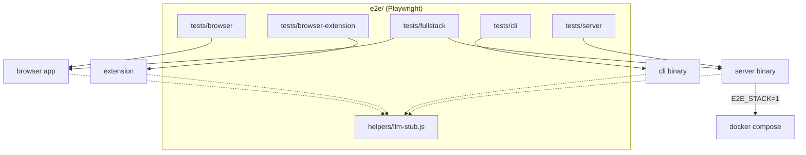
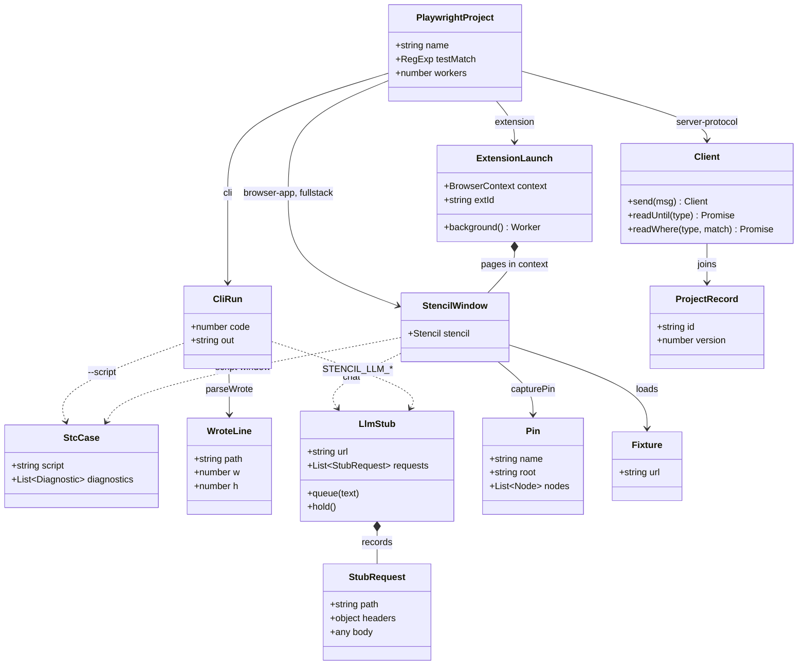

# E2E harness architecture

The system-wide design — the parity contract, canonical data, the layer model, the pattern vocabulary — is in the root [`ARCHITECTURE.md`](../ARCHITECTURE.md).

`e2e/` is one Node/Playwright harness that drives the **built artifacts** of four surfaces
from outside: the served `browser/` app in a real Chromium, the unpacked MV3 `browser-extension/`,
the Zig `cli/` binary as a subprocess, and the Go `server/` over its REST/WS/TCP wire. It
imports no app code, never links or recompiles `core/`, and reaches no real LLM: every model
call ends at its own stub. The desktop app's GUI e2e is a QtTest target in `desktop/tests/`,
not here.


```mermaid
graph TD
    subgraph E2E["e2e/ (Playwright)"]
      TB["tests/browser"]
      TE["tests/browser-extension"]
      TF["tests/fullstack"]
      TS["tests/server"]
      TC["tests/cli"]
      STUB["helpers/llm-stub.js"]
    end
    WEB["browser app"]
    EXT["extension"]
    SRV["server binary"]
    CLI["cli binary"]
    STACK["docker compose"]

    TB & TF --> WEB
    TE --> EXT
    TF & TS --> SRV
    TC --> CLI
    WEB & EXT & CLI & SRV -.-> STUB
    SRV -.->|"E2E_STACK=1"| STACK
```

## Layers

`helpers/config.js` → the helpers, grouped per artifact in `helpers/compose/`,
`helpers/server/` and `helpers/cli/`, each importing only `config.js`, a sibling helper,
`@playwright/test`, `ws` and Node built-ins → `tests/<project>/*.spec.js`. A spec imports
helpers, Playwright and Node built-ins only; specs never import each other, and no helper
imports a spec. `playwright.config.js` sits above all three, reading `config.js` for
`APP_URL`. By convention; no lint.

## Where things go

| Path | Holds | Rule |
|---|---|---|
| `playwright.config.js` | the test projects, their workers, the `webServer` | projects that share one server's state run serially |
| `helpers/config.js` | the app's host and port | the one place; a port of its own, so a stray dev server is never reused |
| `helpers/static-server.js`, `helpers/compose/` | the Node static server; compose up / down with the server's LLM env at the stub | up only under `E2E_STACK=1`, down only under `E2E_STACK_DOWN=1` |
| `helpers/boot.js` | `gotoApp(page, { motion })`: navigate, clear state, await `window.stencil` | every browser spec boots through it |
| `helpers/extension.js` | the persistent-context launch + extension-id resolution | headed; CI wraps in xvfb |
| `helpers/cli/` | one run of the Zig binary read by its argv/outcome contract; lines piped into `stencil --console` | the stderr grammar mcp and bot parse; the console spawns async so the in-process stub stays reachable |
| `helpers/stcCases.js` | reads the shared `.stc` corpus (`common/fixtures/script/cases.txt`) | script inputs come from the corpus, so the cli and the browser run what the core is proved on |
| `helpers/server/` | REST helpers; WS + raw-TCP clients for the live-edit protocol | |
| `helpers/chat.js`, `drag.js`, `uiPin.js`, `openImage.js` | the chat readers and gestures; the touch driver; the pin recorder; the Open Image driver | |
| `helpers/png.js` | a real PNG encoded with Node's own `zlib` | the picture a spec hands a file input |
| `helpers/llm-stub.js` | the scriptable stub LLM for every wire shape | **all model traffic ends here** |
| `fixtures/` | host pages the extension scanner loads, `project.stencil`, `cli-layout.json` | `project.stencil` is opened by both the browser and the cli specs |
| `pins/<platform>/` | the UI-pin baselines, one JSON per pinned state | a platform without baselines skips |
| `tests/specGuard.test.js` | the test-count floor, and that every spec is claimed by a project | a `node --test` lint; `npm test` runs it before Playwright |
| `tests/<project>/` | one representative flow per surface, named by what it proves | a spec drives the real artifact through its public contract — never an internal |

## Entities


```mermaid
classDiagram
    class PlaywrightProject {
      +string name
      +RegExp testMatch
      +number workers
    }
    class StencilWindow {
      +Stencil stencil
    }
    class ExtensionLaunch {
      +BrowserContext context
      +background() Worker
      +string extId
    }
    class CliRun {
      +number code
      +string out
    }
    class StcCase {
      +string script
      +List~Diagnostic~ diagnostics
    }
    class WroteLine {
      +string path
      +number w
      +number h
    }
    class ProjectRecord {
      +string id
      +number version
    }
    class Client {
      +send(msg) Client
      +readUntil(type) Promise
      +readWhere(type, match) Promise
    }
    class LlmStub {
      +string url
      +List~StubRequest~ requests
      +queue(text)
      +hold()
    }
    class StubRequest {
      +string path
      +object headers
      +any body
    }
    class Pin {
      +string name
      +string root
      +List~Node~ nodes
    }
    class Fixture {
      +string url
    }
    PlaywrightProject --> StencilWindow : browser-app, fullstack
    PlaywrightProject --> ExtensionLaunch : extension
    PlaywrightProject --> CliRun : cli
    PlaywrightProject --> Client : server-protocol
    ExtensionLaunch *-- StencilWindow : pages in context
    CliRun --> WroteLine : parseWrote
    CliRun ..> StcCase : --script
    StencilWindow ..> StcCase : script window
    Client --> ProjectRecord : joins
    LlmStub *-- StubRequest : records
    StencilWindow --> Pin : capturePin
    StencilWindow ..> LlmStub : chat
    CliRun ..> LlmStub : STENCIL_LLM_*
    StencilWindow --> Fixture : loads
```

| Entity | What it is | Owned by / lifetime | Relates to |
|---|---|---|---|
| `PlaywrightProject` | one entry of `projects[]` in `playwright.config.js` | the config; one run | selects which `tests/<dir>/` runs, and whether serially |
| `StencilWindow` | the booted app page, resolved once `window.stencil` exists | the spec; one `page` per test or per context | every facade call, `expectPin` |
| `ExtensionLaunch` | `launchExtension()`'s `{ context, background, extId }` | a `test.describe` via `beforeAll` / `afterAll` | host tabs and extension pages opened on `context` |
| `CliRun` | `runCli()`'s exit code and output of one run of `CLI_BIN` | the test; `cwd` is `testInfo.outputPath()` | `parseWrote`, `pngSize` on the written file |
| `StcCase` | one corpus case as `{ script, diagnostics }` | the repo; read per call | the cli's script flags and console verb, the browser's script window |
| `WroteLine` | `parseWrote()`: the `wrote` success line as `{ path, w, h }` | derived from `CliRun.out` | the CLI contract mcp and bot also parse |
| `ProjectRecord` | the server's project as the REST helpers return it | the running server; per test | `Client.join` targets its `id`; PUT guards on its `version`. Canonical in `server/internal/protocol` |
| `Client` | one promise-based shape over WS (`dialWS`) and raw TCP (`dialTCP`); `T` names the frame types | the test, `close()` in `finally` | the `WSMessage` envelope, canonical in `server/internal/protocol` |
| `LlmStub` | `startLlmStub()`'s scriptable server: its recorded `requests` and its reply `queue` | a `test.describe`, `reset()` per test | the app, the CLI and the server dial it |
| `StubRequest` | one recorded POST, `{ method, path, headers, body }` | `LlmStub.requests` | read by the helpers in `helpers/chat.js` |
| `Pin` | `capturePin()`'s `{ name, root, nodes }`, settled by two agreeing reads | `pins/<PIN_PLATFORM>/<name>.json` | `diffPins(baseline, actual)` names the first differing paths |
| `Fixture` | a file in `fixtures/` served at `/__e2e__/`, or read from disk | the repo | the scanner's host pages, the CLI's inputs, the project file |

## Patterns

| Pattern | Where | Notes |
|---|---|---|
| Fixture | `fixtures/` at `/__e2e__/`; `test.beforeAll` in stub-backed suites; the `.stc` corpus | two surfaces are proven on one `project.stencil` and one script corpus |
| Stub / Fake | `startLlmStub` (`helpers/llm-stub.js`) | one Node `http` server for every wire shape; a FIFO `queue` of scripted replies; `hold` / `release` keep calls in flight |
| Golden / Pin | `expectPin`, `capturePin`, `diffPins` (`helpers/uiPin.js`); `pins/<platform>/` | computed styles + DOM shape, never screenshots |
| Driver (page-object style) | `boot.js`, `chat.js`, `drag.js`, `openImage.js`, `extension.js` | each helper wraps one seam of the artifact; specs hold no selectors for those seams |
| Adapter over the wire | `Client` and `join` (`server/wire.js`); the REST helpers (`server/api.js`) | one `send` / `readUntil` shape over two transports; `T` follows `protocol.go` |
| Adapter over the CLI | `runCli`, `parseWrote`, `pngSize` (`cli/run.js`) | the argv/stderr grammar of `cli/`; `pngSize` checks the IHDR so the file, not the claim, is asserted |
| Serial-vs-parallel project split | `playwright.config.js` | projects sharing one server and stub port run serially; the rest are `fullyParallel` |
| Capability gate (self-skip) | `stackEnabled` (`server/api.js`), `cliAvailable` (`cli/run.js`), the `PINS_DIR` check in `expectPin`, `GET /llm/info` in the LLM specs | a missing prerequisite is a reported skip, never a pass |
| Lifecycle hook | `globalSetup` (`compose/setup.js`), `globalTeardown` (`compose/teardown.js`), `webServer` in the config | compose up + `/healthz` poll before any project; the static server for every project |

## Design

- **A browser spec.** `gotoApp` clears `localStorage`, navigates to `APP_URL + hash` and waits
  for `window.stencil`; the spec works through the facade in `page.evaluate` and real clicks.
- **An extension spec.** `launchExtension()` opens a headed persistent context with
  `--load-extension` and derives `extId` from the service worker. The suite seeds
  `chrome.storage.sync` through `background().evaluate`, opens a host fixture tab, and drives
  the popup or side panel as an ordinary extension page.
- **A fullstack spec.** `globalSetup` brings up the compose stack with the
  `helpers/compose/llm.yml` override pointing the server's LLM at the stub, and polls
  `/healthz`. The spec takes a token, boots a page, calls `window.stencil.connect`, then drives
  a second client or chats through the server; the stub's recorded request carries the
  upstream wire.
- **A server-protocol spec.** No browser: a token and a project over REST, then `dialWS()` or
  `dialTCP()` and `join`, which resolves `welcome`. One client sends an edit, the other reads
  it; a save resolves `T.synced` with the bumped version.
- **A cli spec.** `runCli` runs the binary once; `parseWrote` reads the outcome line and
  `pngSize` the file it names. The `/prompt` spec spawns `--console` with `STENCIL_LLM_*` at the
  stub and asserts the queued op plan changed the written PNG.
- **A script spec.** `stcCase(name)` takes a case out of the shared corpus. The cli spec runs
  it through `--script`, `--script-check` and the console; the browser spec runs the same text
  in the script window and asserts on `stencil.lines`, an erroring case running no op.
- **A UI pin.** `freezeMotion(page)` pins light theme and the app's own motion switch; the spec
  drives a state, and `expectPin` captures the subtree until two reads agree, then deep-equals
  it with the platform baseline, printing the element paths that moved.

The pin file the harness owns:

```json
{ "name": "toolbar-default", "root": ".controls-wrapper",
  "nodes": [ { "path": ":root/div[1]", "tag": "div", "classes": "controls-topbar",
               "style": { "display": "flex", "margin": "0px 0px 8px" }, "text": "…" } ] }
```

`style` holds only `PIN_PROPS` values outside the `DROPPED` defaults; `text` appears on leaves
only; `<svg>` children are not walked.

## Rules

1. **Real artifacts, public contracts.** A spec drives `window.stencil`, the REST/WS/TCP
   wire and the CLI's argv; none imports app code.
2. **One stub for every model**, on a fixed port (`LLM_STUB_PORT`) for the stack specs because
   compose bakes it into `LLM_BASE_URL` at boot, so a stack run goes single-file. Every other
   spec takes an ephemeral port.
3. **State isolation.** `boot.js` clears `localStorage` per navigation and the config blocks
   the app service worker.
4. **Pins are computed styles + DOM shape, not screenshots**, so a failure names the element
   and the property that moved. They freeze the app's own motion and pin the light theme.
5. **Motion is switched off through the app's own setting**, not by emulating
   `prefers-reduced-motion`, for the specs that measure geometry mid-gesture.
6. **Server auth is always admin-gated** (`ADMIN_TOKEN`), so the LLM proxy enables and the
   llm-proxy spec runs instead of self-skipping.
7. **Stack-dependent specs self-skip** without `E2E_STACK=1`; the `cli` project self-skips
   without a binary. A skip is reported as a skip, not as a pass.

## Tests

A smoke harness: each project proves one surface's public contract end to end. `browser-app`
drives the facade, deep links, `.stencil` files, the chat panel, drag gestures and the UI pins;
`browser-extension` the scanner, the editor hand-offs and the panel; `fullstack` two browser
clients through one server and the browser-to-server-to-stub LLM round trip; `server-protocol`
the REST lifecycle, the handshake, edit fan-out and presence, with no browser; `cli` the argv
and stderr grammar against the written PNG's real dimensions, and the `.stc` flags over the
shared corpus.

`tests/specGuard.test.js` drives nothing: it holds the spec tree at its floor and fails on a
spec no project's `testMatch` claims. The LLM specs skip when the server reports its proxy
disabled, and the pin specs on a platform with no baselines, since font metrics differ by OS.
All model traffic ends at the stub, so the suite needs no network beyond loopback and the
compose network.
