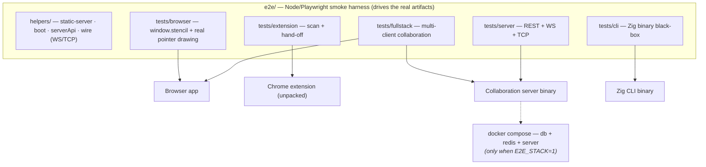

# Stencil E2E

End-to-end **smoke** tests — one platform-agnostic Node/Playwright harness that drives
every user-facing surface and black-boxes the collaboration server. This is the
*foundation*: one representative flow per surface, meant to grow.

Unlike the per-subproject unit suites (`node --test`, Doctest, `go test`, …), these tests
run the **real** artifacts: the browser app in a real Chromium, the unpacked MV3 extension,
and the actual Go server binary over its REST/WS/TCP wire protocol.

Like `mcp/`, `server/`, and `bot/`, this harness is an external adapter — it **never
compiles or links `core/`**, so it sits outside the parity contract in the repo `CLAUDE.md`.

## Architecture



> Click a node to open that surface's own architecture diagram, or see the whole-system
> view in the [repository README](../README.md#architecture). Desktop (Qt) e2e lives
> elsewhere — see the [known gaps](#known-gaps-deliberate) below.

## Layout

```
helpers/
  static-server.js   tiny Node static server for browser/ (+ fixtures) — no python dep
  compose.js         globalSetup: docker compose up db+redis+server (only when E2E_STACK=1)
  boot.js            gotoApp(page): navigate, clear state, await window.stencil
  serverApi.js       REST helpers (token issuance, project CRUD) over Playwright's request
  wire.js            WS (ws lib) + raw-TCP (net) clients for the live-edit protocol
fixtures/            host page (+ pixel.png) the extension scanner loads over http
tests/
  browser/   app.smoke     — window.stencil: blank/draw/rotate/crop, deep link
             editor        — real pointer drawing, undo/redo, crop tokens + px↔page, apply(), save→reload
  extension/ handoff.smoke — scan images+CSS bg, new-tab AND in-page-modal hand-off, pin/unpin
  fullstack/ collab.smoke  — two clients + real server: create → cross-client visibility
             liveedit      — A auto-reloads a peer's server-side edit (live co-edit path)
  server/    rest.smoke, ws.smoke — REST lifecycle + hello→subscribe→welcome→edit/save/TCP
             events        — global /events feed (created/updated/deleted), peer-join, cursor relay
             files         — file-endpoint error paths + result-kind round-trip
  cli/       pipeline      — Zig binary black-box: blank/rotate/crop/filter/layout/URL-input,
                             ext auto-fill, error contract; asserts the written PNG's IHDR dims
```

### Known gaps (deliberate)

- **peer-leave isn't asserted.** The server has no WS keepalive/read-deadline, so a dropped
  peer (graceful close OR abrupt TCP reset) isn't detected within a bounded window — see the
  note in `tests/server/events.spec.js`. This is a real server characteristic, flagged rather
  than papered over.
- CLI, MCP, and bot have no e2e here; no visual-regression baselines. (The CLI *is* driven
  end-to-end by the `cli` project above; MCP/bot are not.)
- **Desktop (Qt) e2e lives elsewhere, on purpose.** The desktop app is a native Qt binary, not
  a wire-protocol surface this Node harness can drive, so its end-to-end test is a QtTest target
  built with the desktop CMake project: [`../desktop/tests/mainWindow.gui.cpp`](../desktop/tests/mainWindow.gui.cpp)
  (run via `ctest --test-dir desktop/build`). It drives the real `MainWindow` offscreen.

## Test projects

| Project | Needs Docker stack? | What it drives |
|---|---|---|
| `browser-app` | no | Served `browser/` app via `window.stencil` |
| `extension` | no | Unpacked `extension/` in a persistent Chromium context |
| `fullstack` | **yes** | Browser app + real server (multi-client collaboration) |
| `server-protocol` | **yes** | REST + WS + TCP against the running server binary |
| `cli` | no | The Zig CLI binary (self-skips unless built / `STENCIL_CLI` set) |

The stack-dependent projects **self-skip** unless `E2E_STACK=1` is set. The `cli` project
needs the built binary — `(cd cli && zig build)` or point `STENCIL_CLI` at one.

## Running

```bash
cd e2e
npm install
npx playwright install chromium        # add --with-deps on Linux CI

# UI surfaces only — no Docker needed:
npm run test:ui                        # browser-app + extension

# Full stack (brings up db+redis+server via ../docker-compose.yml):
E2E_STACK=1 npm test                   # all four projects
npm run test:stack                     # just fullstack + server-protocol

npm run report                         # open the HTML report after a run
```

The static app server is started automatically by Playwright's `webServer` on a
dedicated port (`127.0.0.1:8188`, see `helpers/config.js`) so a stray `npm run serve`
on `:8080` is never silently reused. The backing stack is left running between runs for
fast iteration; tear it down with `docker compose down -v` (repo root), or set
`E2E_STACK_DOWN=1` to have the run do it.

**Already have a server running?** Point the stack suites at it instead of starting
compose:

```bash
E2E_STACK=1 E2E_SKIP_COMPOSE=1 npm test   # uses whatever is on SERVER_URL (default :8090)
```

## Notes & gotchas

- **Extension = headed Chromium.** MV3 extensions require a persistent context and load
  most reliably headed, so the `extension` project launches with `headless: false`. In CI
  the job is wrapped in `xvfb-run`; locally on macOS/Windows a browser window opens briefly.
  It uses `channel: 'chromium'`, so `npx playwright install chromium` is required.
- **No wasm build needed.** The app runs its JS fallback when `js/wasm/` is absent and is
  behaviorally identical for these flows (the committed wasm artifact is used if present).
- **State isolation.** `boot.js` clears `localStorage` per navigation and the config blocks
  the app service worker, so runs don't leak projects/servers between tests.
- **Server auth.** The compose server ships dev defaults (`ADMIN_TOKEN` empty → open token
  issuance, `CORS_ORIGINS=*`), which the harness relies on. Don't point these tests at a
  locked-down server without adjusting `helpers/serverApi.js`.

## CI

The `e2e` job in `.github/workflows/ci.yml` runs this harness on push/PR to `main`,
parallel to the nine unit jobs: `npm install` → `playwright install --with-deps chromium`
→ `docker compose up -d --wait db redis server` → `xvfb-run -a npm test` with `E2E_STACK=1`.
The Playwright HTML report is uploaded as an artifact on failure.
