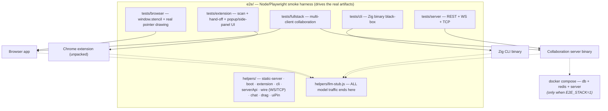

# Stencil E2E

End-to-end **smoke** tests — one platform-agnostic Node/Playwright harness that drives
every user-facing surface and black-boxes the collaboration server. This is the
*foundation*: one representative flow per surface, meant to grow.

Unlike the per-subproject unit suites (`node --test`, Doctest, `go test`, …), these tests
run the **real** artifacts: the browser app in a real Chromium, the unpacked MV3 extension,
and the actual Go server binary over its REST/WS/TCP wire protocol.

Like `mcp/`, `server/`, and `bot/`, this harness is an external adapter — it **never
compiles or links `core/`**, so it sits outside the parity contract in the repo `CLAUDE.md`.

## Architecture


```mermaid
graph TD
    subgraph E2E["e2e/ — Node/Playwright smoke harness (drives the real artifacts)"]
      HELP["helpers/ — static-server · boot · extension · cli ·<br/>serverApi · wire (WS/TCP) · chat · drag · uiPin"]
      TB["tests/browser — window.stencil + real pointer drawing"]
      TE["tests/extension — scan + hand-off + popup/side-panel UI"]
      TF["tests/fullstack — multi-client collaboration"]
      TS["tests/server — REST + WS + TCP"]
      TC["tests/cli — Zig binary black-box"]
      STUB["helpers/llm-stub.js — ALL model traffic ends here"]
    end
    WEB["Browser app"]
    EXT["Chrome extension (unpacked)"]
    SRV["Collaboration server binary"]
    CLI["Zig CLI binary"]
    STACK["docker compose — db + redis + server<br/><i>(only when E2E_STACK=1)</i>"]

    TB --> WEB
    TE --> EXT
    TF --> WEB
    TF --> SRV
    TS --> SRV
    TC --> CLI
    WEB -.-> STUB
    EXT -.-> STUB
    CLI -.-> STUB
    SRV -.-> STUB
    SRV -.-> STACK
```

> **Surface diagrams:** [browser](../browser/README.md#architecture) · [extension](../extension/README.md#architecture) · [server](../server/README.md#architecture) · [cli](../cli/README.md#architecture) — or the whole-system view in the [repository README](../README.md#architecture). Desktop (Qt) e2e lives
> elsewhere — see the [known gaps](#known-gaps-deliberate) below.

## Layout

120 tests in 33 spec files across five projects.

```
helpers/
  config.js          the one place the app's host/port live (127.0.0.1:8188 — see Running)
  static-server.js   tiny Node static server for browser/ (+ fixtures) — no python dep
  compose.js         globalSetup: docker compose up db+redis+server (only when E2E_STACK=1)
  compose-teardown.js  globalTeardown: compose down -v ONLY when E2E_STACK_DOWN=1 (see gotchas)
  compose.llm.yml    compose override applied by compose.js: server LLM env (stub key/model
                     + LLM_BASE_URL at the host's llm-stub) for the fullstack llm-proxy spec
  boot.js            gotoApp(page): navigate, clear state, await window.stencil; pass
                     { motion: 'none' } to seed the app's motion switch before first paint
  extension.js       the persistent-context launch + service-worker/extension-id resolution
                     every extension suite shares (headed — see gotchas)
  cli.js             spawns the Zig binary and reads its argv/outcome contract (the same
                     `wrote {path} ({w}x{h} px · {page})` / `error: …` stderr mcp and bot parse)
  chat.js            shared LLM wire-shape readers (§4 system prompt, §5 settings, message
                     text/images) + the browser chat panel and Assistant-flyout gestures
  drag.js            real-finger CDP touch driver, the drag-ghost box, drag-image spy
  serverApi.js       REST helpers (token issuance, project CRUD) over Playwright's request
  wire.js            WS (ws lib) + raw-TCP (net) clients for the live-edit protocol
  uiPin.js           UI regression pins: capture a subtree's computed styles + DOM shape
                     and deep-equal it against pins/<name>.json (UPDATE_PINS=1 re-records)
  llm-stub.js        scriptable stub LLM server (openai-compat / ollama / Anthropic
                     Messages wire shapes) — ALL model traffic in the suite ends here
pins/                21 recorded UI-pin baselines (one JSON per pinned state)
fixtures/            host pages (+ pixel.png / site.webmanifest) the extension scanner loads over http
                     (page-with-image.html · all-image-sources.html — one of every image reference),
                     plus project.stencil and cli-layout.json, opened by BOTH the browser and
                     the cli specs so the two surfaces are proven on the same bytes
tests/
  browser/   app.smoke     — window.stencil: blank/draw/rotate/crop, deep link
             editor        — real pointer drawing, undo/redo, crop tokens + px↔page, apply(), save→reload
             project-file  — .stencil open (image+layout+theme) + save→re-open round-trip via the facade
             fragment-privacy — the headline "nothing local goes outward" guard: every request
                             the page makes is captured, and none carries the `#stencil=` payload
             chat          — AI assistant panel vs the stub LLM: §1 op-plan executes on the
                             facade, variant cards render, dock/float placement persists
             ctx-keyboard  — the canvas context menu walked with real key presses (↑/↓, → opens
                             a flyout, ← closes it, Enter picks, Escape) without panning the canvas
             ui-pins       — computed-style + DOM-shape pins for 15 editor states
                             (toolbar, modals, chat placements, fullscreen strip, toast)
             canvas-scrollbar — the canvas thumb is grey, and takes the accent only with the real
                             pointer on the bar's own strip (not on any hover of the canvas)
             custom-selects — every <select> wears the app's own dropdown, never the OS popup
                             (zoom, a number field with a preset list, is the deliberate exception)
             modal-popover — a toolbar icon's dblclick/right-click compact anchored modal:
                             classes, placement, transparent backdrop, both close routes
             modal-layout  — the Projects + Settings dialogs at phone width (nothing clipped or
                             parked aside, filters/footer/hotkey columns) and the 680px breakpoint
             drag          — the drag ghost on mouse and finger (row-sized, anchored, cleaned up)
             project-open-gestures — the projects list's open matrix: dblclick, ⌘/Ctrl-dblclick,
                             Enter, tap, press-and-hold-to-reorder, drag-out zones, swipe-scrolls
  extension/ handoff.smoke — scan images+CSS bg, new-tab AND in-page-modal hand-off, pin/unpin
             popup.smoke   — popup + side-panel UI: filter accordion, ⋯ menu + on-screen flyout, side-panel re-scan
             scan-sources  — every HTML/CSS image reference (img/srcset/input/svg/icons/meta + CSS) is scanned
             editor-mode   — what the panel becomes on a tab that IS the editor (one flow only:
                             these runs are headed under xvfb, where pointer choreography flakes)
             ui-pins       — the same pins for 6 extension states (popup list/filters/
                             row menu/assistant, side panel, options page)
             chat.smoke    — popup → AI chat page vs the stub LLM: `focus` highlights on the
                             page, `open` hands off `#stencil=` with the translated filter
  fullstack/ collab.smoke  — two clients + real server: create → cross-client visibility
             liveedit      — A auto-reloads a peer's server-side edit (live co-edit path)
             llm-proxy     — browser chat → server /llm/chat → stub Anthropic upstream
                             (x-api-key / anthropic-version headers, /llm/info)
  server/    rest.smoke, ws.smoke — REST lifecycle + hello→subscribe→welcome→edit/save/TCP
             events        — global /events feed (created/updated/deleted), peer-join, cursor relay
             files         — file-endpoint error paths + result-kind round-trip
             authz         — the shared-workspace model black-boxed: any token reads/edits any
                             project, 401 at the door, and delete is the one guarded op (409
                             while two or more clients hold the live session)
             ws.robustness — the live-edit endpoint under hostile input: a bad token is
                             `unauthorized`, a malformed frame is dropped without tearing the
                             sender or its peers down
             llm-rate-limit — /llm/chat spend controls: in-flight gate (held stub) +
                             per-session burst bucket, both → 429 rateLimited
             chat-file-lifecycle — contract-§12 `chat` file kind: PUT → GET round-trip →
                             DELETE → 404 (filestore-only; original stays undeletable)
             ws-peer-leave — WS keepalive reaps a half-open peer (~40s); peer-leave
                             reaches the survivor (deliberately slow)
  cli/       pipeline      — Zig binary black-box: blank/rotate/crop/filter/layout/URL-input,
                             ext auto-fill, error contract; asserts the written PNG's IHDR dims.
                             Also opens the SAME fixtures/project.stencil the browser spec opens
                             (cross-surface parity) + bundles an image back into a .stencil
             llm-prompt    — /prompt vs the stub LLM: piped --console session, a §1
                             op-plan executes for real (saved PNG dims swap)
```

### Known gaps (deliberate)

- **peer-leave is detected, but only within ~40s.** The server now runs a WS keepalive
  (30s ping + 10s pong timeout — `server/internal/transport/ws.go`), so a half-open peer
  is reaped and `peer-leave` reaches the survivors within that window. Asserted end-to-end
  by `tests/server/ws-peer-leave.spec.js` (deliberately slow: it waits out a real
  ping/pong-timeout cycle). Departure is still not instant — presence can lag a dead peer
  by up to ~40s.
- **MCP and bot have no e2e here**, and there are no screenshot/visual-regression baselines
  (the UI pins are computed styles + DOM shape instead — see below). The CLI *is* covered, by
  the `cli` project above.
- **Desktop (Qt) e2e lives elsewhere, on purpose.** The desktop app is a native Qt binary, not
  a wire-protocol surface this Node harness can drive, so its end-to-end test is a QtTest target
  built with the desktop CMake project: [`../desktop/tests/MainWindow.<area>.gui.cpp`](../desktop/tests/)
  (run via `ctest --test-dir desktop/build`). It drives the real `MainWindow` offscreen.

## Test projects

| Project | Needs Docker stack? | What it drives |
|---|---|---|
| `browser-app` | no | Served `browser/` app via `window.stencil` |
| `extension` | no | Unpacked `extension/` in a persistent Chromium context |
| `fullstack` | **yes** | Browser app + real server (multi-client collaboration) |
| `server-protocol` | **yes** | REST + WS + TCP against the running server binary |
| `cli` | no | The Zig CLI binary (self-skips unless built / `STENCIL_CLI` set) |

`browser-app` (56 tests), `extension` (22) and `cli` (13) run `fullyParallel` with
`workers: 4`; the two stack projects — `fullstack` (3) and `server-protocol` (26) — stay
serial (`workers: 1`) because they share one server's state. The total cap is 8, so two
projects overlap — except under `E2E_STACK=1`, where the whole run goes single-file:
`fullstack`'s llm-proxy spec and `server-protocol`'s llm-rate-limit spec both bind the
**same fixed stub port** (`helpers/llm-stub.js` `LLM_STUB_PORT`, 8189 — it has to be fixed,
because compose baked it into the server's `LLM_BASE_URL` at boot), so they can never
coexist. Override it with `E2E_LLM_STUB_PORT`, which `compose.llm.yml` reads too; every
other spec takes an ephemeral port.

The stack-dependent projects **self-skip** unless `E2E_STACK=1` is set. The `cli` project
needs the built binary — `(cd cli && zig build)` or point `STENCIL_CLI` at one.

## Running

```bash
cd e2e
npm ci
npx playwright install chromium        # add --with-deps on Linux CI

# UI surfaces only — no Docker needed:
npm run test:ui                        # browser-app + extension

# Full stack (brings up db+redis+server via ../docker-compose.yml):
E2E_STACK=1 npm test                   # all five projects
npm run test:stack                     # just fullstack + server-protocol

npm run report                         # open the HTML report after a run
```

The static app server is started automatically by Playwright's `webServer` on a
dedicated port (`127.0.0.1:8188`, see `helpers/config.js`) so a stray `npm run serve`
on `:8080` is never silently reused.

The backing stack is **deliberately left running between runs** for fast iteration:
`helpers/compose-teardown.js` tears it down only when `E2E_STACK_DOWN=1` is also set. So a
stack you left up — including one from an older server image — is silently reused by the next
run, and `compose.llm.yml`'s env (the stub key/model/`LLM_BASE_URL`) is whatever *that* boot
baked in. After changing `server/` or the compose env, bring it down first:
`docker compose down -v` from the repo root, or `E2E_STACK_DOWN=1 E2E_STACK=1 npm test`. CI
discards the VM, so it never needs this.

**Already have a server running?** Point the stack suites at it instead of starting
compose:

```bash
E2E_STACK=1 E2E_SKIP_COMPOSE=1 npm test   # uses whatever is on SERVER_URL (default :8090)
```

## Notes & gotchas

- **Extension = headed Chromium.** MV3 extensions require a persistent context that
  Playwright's default `page` fixture can't create, so the suites launch their own through
  `helpers/extension.js` — `headless: false` (extensions load most reliably headed) and
  `channel: 'chromium'`, which is why `npx playwright install chromium` is required. In CI
  the job is wrapped in `xvfb-run`; locally on macOS/Windows a browser window opens briefly.
- **No wasm build needed.** The app runs its JS fallback when `js/wasm/` is absent and is
  behaviorally identical for these flows (the committed wasm artifact is used if present).
- **State isolation.** `boot.js` clears `localStorage` per navigation and the config blocks
  the app service worker, so runs don't leak projects/servers between tests.
- **Motion off for geometry.** `gotoApp(page, { motion: 'none' })` seeds the app's own
  interface-motion switch (`drawingApp_motion`, read by `prePaintTheme.js` in `<head>`) rather
  than emulating `prefers-reduced-motion`, so no entrance ever starts and
  `settleModalAnimations` returns at once — worth ~2s a test. The three specs that measure
  geometry mid-gesture use it: `drag`, `modal-layout`, `project-open-gestures`. Every other
  spec boots normally, because motion is either what it asserts on (ui-pins freezes it its own
  way) or simply not in its way.
- **Wall times** (16-core macOS): `npm run test:ui` ≈ 26s for 78 tests, the whole non-stack
  `npm test` ≈ 26s for 91 (29 stack cases skip) — a serial run is ~6× that. With the stack,
  `E2E_STACK=1 npm test` is all 120, nothing skipped, in **≈2.8 min**: it runs single-file (see
  above), and `ws-peer-leave` alone waits out a real ~40s ping/pong cycle.
- **Server auth.** Token issuance is always admin-gated (an unset `ADMIN_TOKEN` makes the
  server generate a per-boot token, printed once). The harness starts compose with
  `ADMIN_TOKEN` (default `e2e-admin`; override via env) and `helpers/serverApi.js` sends it
  as `X-Admin-Token`. With `E2E_SKIP_COMPOSE=1`, export `ADMIN_TOKEN` matching your server.
  Side effect: with an admin token always set, the server's LLM proxy enables whenever the
  stub provider is configured, so the fullstack llm-proxy spec runs instead of self-skipping.
- **UI pins.** `tests/browser/ui-pins.spec.js` + `tests/extension/ui-pins.spec.js` record
  each UI state's computed styles and DOM shape (`helpers/uiPin.js`) and deep-equal them
  against `pins/<name>.json` — no screenshots; a failure names the element path and the
  property that moved. They freeze the app's own motion (`motionMode 'none'` /
  `StencilMotion.set('none')` + emulated `prefers-reduced-motion`) and pin the light theme.
  After an INTENDED visual change, re-record: `UPDATE_PINS=1 npm run test:ui`.

## CI

The `e2e` job in `.github/workflows/ci.yml` runs this harness on push/PR to `main`, parallel
to the nine per-surface unit jobs: `zig build` in `cli/` (so the `cli` project has a binary
rather than self-skipping) → `npm ci` → `playwright install --with-deps chromium` →
`docker compose up -d --wait db redis server` → `xvfb-run -a npm test` with `E2E_STACK=1`, so
CI is the full 120-test run. The Playwright HTML report is uploaded as an artifact on failure.
