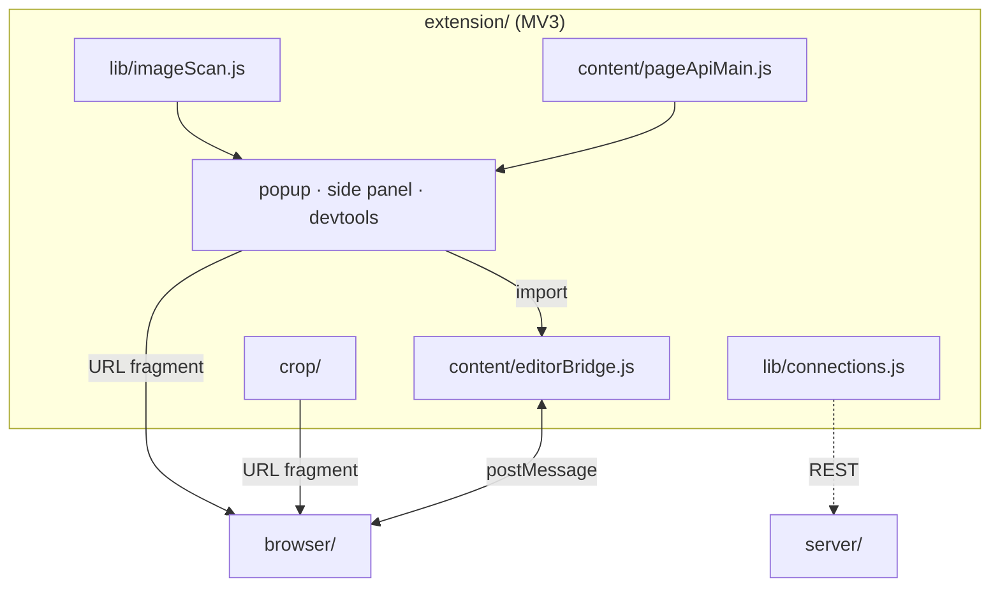

# Extension architecture

The system-wide design — the parity contract, canonical data, the layer model, the pattern vocabulary — is in the root [`ARCHITECTURE.md`](../ARCHITECTURE.md).

## Layers

`lib/` → `config/` → `llm/` → `background/` → `content/` → `popup/`, `options/`, `crop/`.
`lib/` is the dependency-free bottom. The extension never reads `../browser` at runtime.

## Where things go

| Path | Holds | Rule |
|---|---|---|
| `manifest.json` | MV3 manifest | CSP `script-src 'self'`, no `unsafe-inline`; `web_accessible_resources` is exactly one file (`src/crop/crop.html`) — `tests/manifestSecurity.test.js` |
| `src/config/` | copies of `browser/js/config/{,llm/}` tables (`motion`, `opRegistry`, `providers`, `systemPrompt`) | byte-pinned to the browser originals by `tests/dataParity.test.js` |
| `src/lib/` | the shared bottom: `urlGuard` (the ONE fetch guard), `stencil.js` (settings, guarded `imageData`, `editorLaunch`), the scanner, filters, pins, `connections` (+ model/store/rest), `editorTabs`, the menus, `dropZones`, `pollClock`, `overlay` + `shellTheme`, `rasterize`, `videoFrames`, `messages.js`, the ported browser modules, `theme/`, `animations/`, `accent.js` + the pre-paint scripts, `motion/` | pure where possible and node-tested; ported browser files stay byte-identical (`tests/portParity.test.js`) |
| `src/llm/` | settings, client, surface, the registry-driven validator (`opSchema` + `opValidate` + `opPlan`, byte-identical to the browser's), the extension profile (`opProfile`, `opPrompt`), executors, the chat controller | plans validate before any executor runs |
| `src/background/` | the service worker: `background.js` is wiring only; menus, registrars, tab state, the editor relay, `handlers/` (one per message group), frame capture, context actions | every function handed to `chrome.scripting.executeScript` stays self-contained (`tests/injectedFuncs.test.js`) |
| `src/content/` | `ctxTarget.js` (the one always-on content script), `pageApiMain` + `pageApiBridge` (MAIN ⇄ ISOLATED for `window.stencil`), `editorApiMain` + `editorBridge` (editor origin only, for `stencil.extension`) | MAIN-world files cannot import modules; they mirror `lib/pageImages.js` |
| `src/popup/` | `popup.html` + `popup.js` (wiring only) and the extracted pieces; `editorMode.js` + its sections; `assistant.js` + `assistant/` | the same controller runs the popup, the side panel and the DevTools panel |
| `src/sidepanel/`, `src/devtools/` | the docked and the DevTools surfaces | reuse `popup.js` and the popup CSS set; DevTools targets `inspectedWindow.tabId` |
| `src/crop/` | the quick-crop tool: stage (zoom + drag), controls (page/orientation), handoff | the only web-accessible resource |
| `src/options/` | `options.html|js` (boot order only) + one section file per group | |
| `tests/` | `node --test` suites, `helpers/` (chrome/DOM stubs), `pins/css.json`, `fixtureOverrides.json` | |

## Rules

1. **One fetch guard.** Every fetch — thumbnails, the hand-off, an LLM attachment, a scraped
   poster — goes through `lib/urlGuard.js`. Non-`http(s)`, loopback, private, link-local,
   CGNAT/ULA and the metadata IP are refused; `data:`/`blob:` pass. Two narrow unlocks
   (`allowSameHostAs` for a scanned page's own host, `allowLoopback` for a URL the user
   typed); neither ever unlocks the metadata IP.
2. **The hand-off is a fragment.** Bytes are fetched here (host permissions bypass page
   CORS), converted to a `data:` URL and passed as `#stencil=<encodeURIComponent(JSON)>` —
   `{ dataUrl, name, crop?, page?, incognito? }`. The fragment never reaches a server; the
   editor consumes it in `DrawingApp.applyExternalLaunch()` and strips it.
3. **Ports stay byte-identical.** `controlTooltip`, `numericInput`, `dropdownMenu`,
   `tipContent`, `scrollbarHover`, `dustCloud`, `motionIcons`, `llmClient` and the three
   `op*` validator files are copies of the browser's, pinned by `tests/portParity.test.js`.
4. **Bridges share one shape.** A MAIN-world script defines a hard-guarded, non-enumerable
   object and postMessages requests to an ISOLATED script that relays them to the worker and
   answers on the same id. "Is this the editor?" is an origin match against the Options
   editor URL (`lib/editorTabs.js` `isEditorTab`) — the same rule scopes the content script.
5. **Imports into an editor go through the editor's own methods** (`loadImageFromFile`,
   `replaceProjectImage`, `switchToProject`); the extension never touches the editor's
   project registry. "New project" is the fallback whenever the editor's state is unknown —
   the only mode that cannot destroy work on screen.
6. **Two context-menu roots.** The static root declares only `action`/`image`/`video`
   contexts so Chrome hides it itself; the dynamic root is revealed *with* its children by
   the `ctxTarget.js` probe (on hover as well as `mousedown`/`contextmenu`). The failure mode
   is "no Stencil entry", not an empty submenu.
7. **One poll.** MV3 popups are short-lived, so shared pins and editor previews refresh on
   the single 8 s `lib/pollClock.js` heartbeat while a surface is open — never a background
   `/ws` socket, never a second timer.
8. **No native `title`.** Tooltips come from `data-title` via `lib/controlTooltip.js`; the
   injected modal shell (`lib/overlay.js`) is the one exception, themed through
   `lib/shellTheme.js` as data because it cannot link the theme sheets.
9. **Attachments are rasterised** to PNG (`lib/rasterize.js`) before they are sent; the
   contract accepts only png/jpeg/webp/gif and Chrome refuses SVG in `createImageBitmap`.
10. **Motion** mirrors `browser/js/ui/motion/` value for value.
