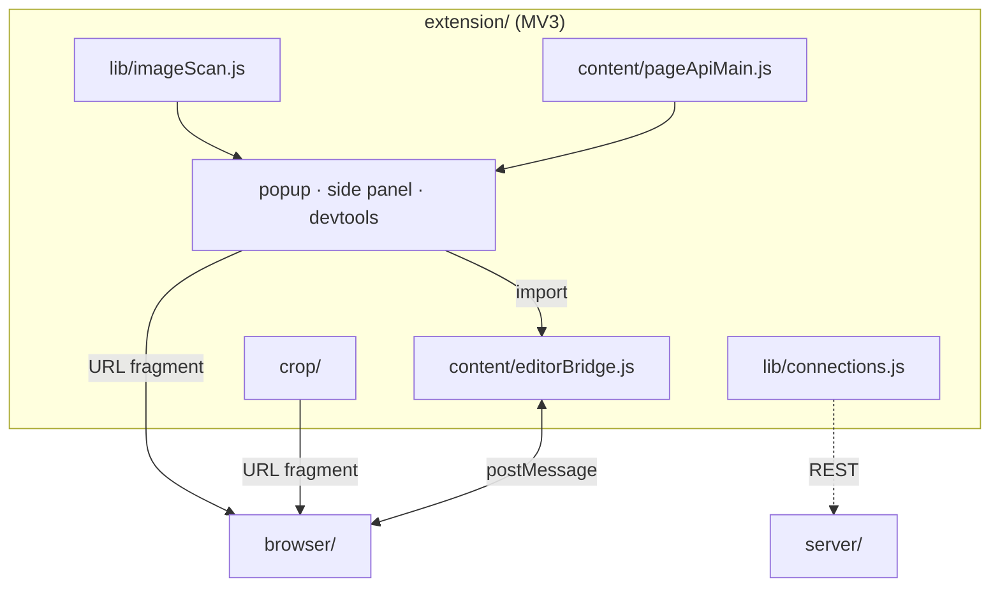
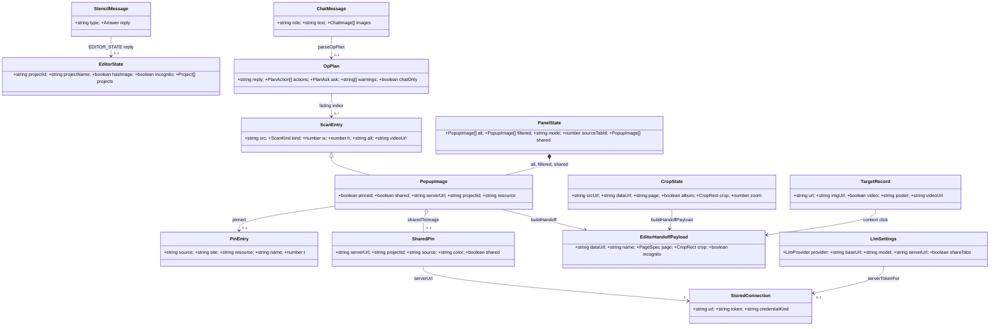

# Extension architecture

The system-wide design — the parity contract, canonical data, the layer model, the pattern vocabulary — is in the root [`ARCHITECTURE.md`](../ARCHITECTURE.md).

The extension is a Chrome MV3 adapter: it scans the images on any page, lists them in a
popup, side panel or DevTools panel, and hands one to the `browser/` editor through a URL
fragment. It runs no `core/`, parses no `.stencil` file and never reads `../browser` at runtime.



## Layers

`lib/` → `config/` → `llm/` → `background/` → `content/` → `popup/`, `options/`, `crop/`.
`lib/` is the dependency-free bottom. The extension never reads `../browser` at runtime.
Enforced by `tests/layerBoundary.test.js` over every relative import in `src/`.

## Where things go

| Path | Holds | Rule |
|---|---|---|
| `manifest.json` | MV3 manifest | CSP `script-src 'self'`, no `unsafe-inline`; `web_accessible_resources` is exactly one file (`src/crop/crop.html`) — `tests/manifestSecurity.test.js` |
| `src/config/` | copies of `browser/js/config/{,llm/}` tables (`motion`, `opRegistry`, `providers`, `systemPrompt`) | byte-pinned to the browser originals by `tests/dataParity.test.js` |
| `src/lib/` | the shared bottom: `urlGuard` (the ONE fetch guard), `stencil.js` (settings, guarded `imageData`, `editorLaunch`), the scanner, filters, pins, `connections` (+ model/store/rest), `editorTabs`, the menus, `dropZones`, `pollClock`, `overlay` + `shellTheme`, `rasterize`, `videoFrames`, `messages.js`, the ported browser modules, `theme/`, `animations/`, `accent.js` + the pre-paint scripts, `motion/` | pure where possible and node-tested; ported browser files stay byte-identical (`tests/portParity.test.js`) |
| `src/llm/` | settings, client, surface, the registry-driven validator (`opSchema` + `opValidate` + `opPlan`, byte-identical to the browser's), the extension profile (`opProfile`, `opPrompt`), executors, the chat controller | plans validate before any executor runs |
| `src/background/` | the service worker: `background.js` is wiring only; menus, registrars, tab state, the editor relay, `handlers/` (one per message group), frame capture, context actions | every function handed to `chrome.scripting.executeScript` stays self-contained (`tests/injectedFuncs.test.js`) |
| `src/content/` | `ctxTarget.js` (the one always-on content script), `pageApiMain` + `pageApiBridge` (MAIN ⇄ ISOLATED for `window.stencil`), `editorApiMain` + `editorBridge` (editor origin only, for `stencil.extension`) | MAIN-world files cannot import modules; they mirror `lib/pageImages.js` |
| `src/popup/` | `popup.html` + `popup.js` (wiring only) and the extracted pieces; `editorMode.js` + its sections; `assistant.js` + `assistant/` | the same controller runs the popup, the side panel and the DevTools panel |
| `src/sidepanel/`, `src/devtools/` | the docked and the DevTools surfaces | reuse `popup.js` and the popup CSS set; DevTools targets `inspectedWindow.tabId` |
| `src/crop/` | the quick-crop tool: stage (zoom + drag), controls (page/orientation), handoff | the only web-accessible resource |
| `src/options/` | `options.html|js` (boot order only) + one section file per group | |
| `tests/` | `node --test` suites, `helpers/` (chrome/DOM stubs), `pins/css.json`, `fixtureOverrides.json` | |

## Entities



| Entity | What it is | Owned by / lifetime | Relates to |
|---|---|---|---|
| `PanelState` (`popup/model.js`) | the one live state of a panel document: scanned rows, the filtered view, page/editor mode, the tabs it stands on | module singleton `state`; lives as long as the popup/panel document | composes `PopupImage`; refreshed by `popup/scan.js` and the `pollClock` |
| `ScanEntry` (`lib/imageScan.js`) | one image or video the injected scanner found, deduped by `src` across frames | produced per scan by `scanPageForImages`, merged by `mergeScanFrames` | base of `PopupImage`; the model's listing indexes into it |
| `PopupImage` (`popup/model.js`) | a `ScanEntry` attributed (tab, resource, name) and annotated with pin/opened state, or a server project standing in for one | `PanelState.all`, rebuilt on every scan | `PinEntry`, `SharedPin`, `EditorHandoffPayload` |
| `PinEntry` (`lib/pins.js`) | a pinned source URL keyed by (site, source), with keywords and a colour | `chrome.storage` under `PINS_KEY`; `background/tabState.js` keeps a synchronous `pinsCache` | annotates `PopupImage`; mirrored on a server as `SharedPin` |
| `SharedPin` (`lib/connectionModel.js`) | a server project projected onto the pin shape; `ServerProject` is canonical in `server/internal/protocol` | derived on each `collectSharedPins` poll, never stored | `StoredConnection`; becomes a `PopupImage` via `sharedToImage` |
| `StoredConnection` (`lib/connectionStore.js`) | a server URL, its bearer token and whether it is an admin credential; `Connection` adds the live `credential` | `chrome.storage` under `CONNECTIONS_KEY`, edited from `options/connections.js` | `SharedPin`, `LlmSettings` (`stencil-server` token) |
| `EditorState` (`lib/messages.js`) | what one editor tab reports about itself: project, image, incognito, its project list; `lib/editorTabs.js` joins it with the chrome tab into an `EditorRow` | answered by `content/editorBridge.js` per request, with a 1500 ms timeout | `StencilMessage` (`EDITOR_STATE`, `EDITOR_LIST`) |
| `EditorHandoffPayload` (`lib/stencil.js`) | the `#stencil=` fragment body; the receiving side (`normalizeLaunchPayload`, `DrawingApp.applyExternalLaunch`) in `browser/` is canonical | built by `buildHandoff`/`buildHandoffPayload` per launch, capped at `MAX_PAYLOAD` | `PopupImage`, `CropState`, `TargetRecord`, `OpenLaunch` (`llm/openActions.js`) |
| `CropState` (`crop/cropHandoff.js`) | the quick-crop page's whole mutable state: source, decoded size, page format, orientation, rect, zoom | one per `crop.html` document, seeded from `chrome.storage.session` | `EditorHandoffPayload` |
| `TargetRecord` (`background/tabState.js`) | what the `ctxTarget.js` probe last resolved under the cursor in one tab (image, CSS background, video, poster) | `lastTargetByTab` in the worker, overwritten per probe | the context-menu click handlers (`background/ctxActions.js`) |
| `StencilMessage` (`lib/messages.js`) | a `chrome.runtime` message: a `MSG` channel tag plus that channel's fields; request/response channels answer `Answer<T>` | transient; one handler per `type` in `background/handlers/` | `EditorState`, every popup and content module |
| `OpPlan` (`llm/opPlan.js`) | a validated model reply: prose, whitelisted `PlanAction`s, an optional `PlanAsk`, leniency warnings; the registry `browser/js/config/llm/opRegistry.json` is canonical | per model round inside `ChatController.send` | `ChatMessage`, `ScanEntry` (index-bound), `ExecContext` (`llm/opExecutors.js`) |
| `ChatMessage` (`llm/llmClient.js`) | one replayed turn with base64 `ChatImage`s; the wire shape shared byte-for-byte with the browser client | `ChatController.history`, in memory only, trimmed to `HISTORY_LIMIT` | `OpPlan`, `LlmSettings` |
| `LlmSettings` (`llm/llmSettings.js`) | the explicit provider configuration: provider, endpoint, model, key, server URL, `shareTabs` | `chrome.storage` under `LLM_SETTINGS_KEY`, edited from `options/llm.js` | `StoredConnection`; `createLlmClient` reads it |

## Patterns

| Pattern | Where | Notes |
|---|---|---|
| Facade | `window.stencil` (`content/pageApiMain.js`, a frozen `Proxy` via `guard`) and `stencil.extension` (`content/editorApiMain.js`, `StencilExtensionApi`) | Not a facade over core: the extension has no core. Every page-side call becomes a `MSG` relay; nothing else is reachable from a page. |
| Mediator | `background/background.js` `messageHandlers` + `resolveClickHandler`; `llm/chatController.js` over `ChatCapabilities` | The worker routes by `msg.type` and menu id; the popup, bridges and editor never address each other. The controller owns history, prompt and rounds and calls injected capabilities only. |
| Strategy | `llm/llmClient.js` over `providers.json` `wire`; `lib/dropZones.js` `quadrantAt` → `background/handlers/dropZones.js` | The provider and the drop action are picked by table lookup. |
| Observer | `chrome.storage.onChanged` in `background.js` and `popup/storageSync.js`; `lib/pollClock.js` (`POLL_MS` 8 s) for shared pins and editor previews; `watchAccentActionIcon` | One heartbeat per open panel document; no background socket. |
| Repository | `lib/pins.js`, `lib/ledger.js`, `lib/connectionStore.js`, `lib/settings.js`, `llm/llmSettings.js` | Each wraps one `chrome.storage` key behind load/save/upsert functions; callers never touch storage. |
| Chain of Responsibility | `lib/urlGuard.js` → `lib/imageData.js` `fetchAsDataUrl` → `lib/rasterize.js`; `background/frameCapture.js` routes tried in order by `ctxActions.js` | A fetch passes the guard, then decoding, then re-encoding. A video still is tried in-tab, then via fetch, then from a screenshot. |
| Adapter | `llm/openActions.js` `translateOpenActions`; `popup/sharedPins.js` `sharedToImage`; `lib/editorTabs.js` `editorRow` | An op plan onto launch options, a server project onto a row, a chrome tab plus `EditorState` onto an `EditorRow`. |
| MAIN ⇄ ISOLATED bridge | `pageApiMain` ↔ `pageApiBridge`; `editorApiMain` ↔ `editorBridge` (`SRC.EXT_API`/`EXT_API_RES`, `SRC.EXT_REQ`/`EXT_RES`) | Id-correlated `postMessage` envelopes, same window only; the ISOLATED half owns `chrome.*`. |
| Injected function | `scanPageForImages`, `mountDropZones`, `mountStencilModal`, the probe in `registrars.js` | Handed to `chrome.scripting.executeScript({ func })`; each closes over nothing and carries its own mirror of `MSG`. |
| Table-driven validator | `llm/opSchema.js` `createSchema` + `llm/opValidate.js` `OP_REGISTRY` / `EXT_VALIDATORS` | The op registry is the schema; per-op code adds only listing-bound rules. |

## Design

- **A page scan.** `popup/scan.js` runs `scanPageForImages` in every frame of the source tab
  via `chrome.scripting.executeScript`; `mergeScanFrames` dedupes the `ScanEntry`s, the panel
  attributes them into `PopupImage`s in `PanelState.all`, then `annotatePinned` and
  `annotateOpened` join pins and the ledger. The worker scans another tab on `MSG.SCAN_TAB`.
  The right-click path is separate: `ctxTarget.js` primes on `pointerover`, `mousedown` and
  `contextmenu`, and `handlers/ctxProbe.js` stores the `TargetRecord` that relabels the menu.
- **The hand-off.** `fetchAsDataUrl` fetches the bytes through `urlGuard` (`allowSameHostAs`
  the scanned page), `buildHandoff` folds provenance into an `EditorHandoffPayload`, and
  `buildLaunchUrl` appends it as `#stencil=<encodeURIComponent(JSON)>` (`MAX_PAYLOAD` bytes).
  `openEditorTab` opens a tab, `launchEditorModal` injects `mountStencilModal` to frame the
  editor in the page, and `resumeInOpenEditor` sends `MSG.EDITOR_SWITCH` to an open editor
  tab instead. Into an editor tab, `MSG.EDITOR_IMPORT` carries `src`, `mode` and `crop`.

  ```
  { dataUrl, name, page: { size, width?, height? }, source, resource, incognito,
    open?: 'resume' | 'copy', crop?: { x, y, w, h } }
  ```
- **The crop page.** `launchCrop` puts the source URL and `{ source, resource }` in
  `chrome.storage.session` (`CROP_SRC_KEY`, `CROP_META_KEY`) and frames `crop.html`, the one
  web-accessible resource, through `mountStencilModal` (`SRC.MODAL` is the ready/close
  handshake). `crop.js` seeds `CropState`, `cropStage` owns fit/zoom and the drag box,
  `cropControls` locks the aspect to a `cropGeometry` page format, and `buildHandoffPayload`
  keeps the original plus the rect (`apply`) or bakes the region (`cut`) for `openEditorTab`.
- **An LLM turn.** `popup/assistant/turnRunner.js` drains the attachment tray (`toLlmImage`
  rasterises to PNG) and calls `ChatController.send`. One round is: the `opPrompt` system
  prompt plus the `chatListing` of `ScanEntry`s and, if `shareTabs`, the open tabs;
  `LlmClient.chat` over the provider wire (token from `llmSurface.serverTokenFor`);
  `parseOpPlan` against `{ listingLength, tabsLength }`; the `opExecutors` run each
  `PlanAction` through the injected capabilities into cards. If every action only gathered
  context (`continuationOnly`), one more round runs; `clearChat` resolves last.
- **A server connection.** `addServer(rawUrl, token)` in `lib/connections.js` calls
  `connect` (a session from `POST /auth/token`, proven by `GET /projects`), then
  `upsertConnection` persists a `StoredConnection`. `collectSharedPins` lists every
  connection's projects into `SharedPin`s, `sharedToImage` turns them into rows and
  `fetchProjectImage` pulls bytes with the bearer token, all refreshed on the `pollClock`;
  `isLoopbackHost` unlocks a user-typed loopback URL and nothing else.
- **The message contract.** `MSG` names every `chrome.runtime` channel and `SRC` every
  `window.postMessage` envelope; each handler lives in one `background/handlers/` module.
  Fire-and-forget channels return nothing. The editor-mode group is request/response:
  `answers` guarantees `{ ok:true, … } | { ok:false, error }`, `privileged` admits only the
  extension's own pages and the editor origin, and `askEditorTab` times out after 1500 ms.
  A two-hop channel keeps one name on both legs; the two `chrome` send APIs cannot cross.

  | Group | Channels | Direction |
  |---|---|---|
  | probe | `WAKE`, `CTX` | `ctxTarget.js` → worker |
  | page API | `PAGE_OPEN`, `PAGE_CROP`, `PAGE_PIN`, `PAGE_DISABLE` (`PAGE_REQUEST_SYNC`, `PAGE_SET_FILTERS` stop at the bridge) | page → bridge → worker |
  | drop zones | `DROPZONES_ARM`, `DROPZONES_DISARM`, `PAGE_DROP` | panel ⇄ worker ⇄ overlay |
  | editor mode | `EDITOR_LIST`, `EDITOR_STATE`, `EDITOR_IMPORT`, `EDITOR_SWITCH_PROJECT`, `EDITOR_CROP`, `EDITOR_FOCUS_TAB`, `SOURCE_TABS`, `SCAN_TAB` | panel / editor API → worker → `editorBridge` |
  | misc | `REGISTRY`, `EDITOR_SWITCH`, `HL_HOVER`, `OPEN_TAB`, `OPEN_OPTIONS` | bridge / overlay / devtools ⇄ worker or panel |

## Rules

1. **One fetch guard.** Every fetch — thumbnails, the hand-off, an LLM attachment, a scraped
   poster — goes through `lib/urlGuard.js`. Non-`http(s)`, loopback, private, link-local,
   CGNAT/ULA and the metadata IP are refused; `data:`/`blob:` pass. Two narrow unlocks
   (`allowSameHostAs` for a scanned page's own host, `allowLoopback` for a URL the user
   typed); neither ever unlocks the metadata IP.
2. **The hand-off is a fragment.** Bytes are fetched here (host permissions bypass page
   CORS), converted to a `data:` URL and passed as `#stencil=<encodeURIComponent(JSON)>` —
   `{ dataUrl, name, crop?, page?, incognito? }`. The fragment never reaches a server; the
   editor consumes it in `DrawingApp.applyExternalLaunch()` and strips it.
3. **Ports stay byte-identical.** `controlTooltip`, `numericInput`, `dropdownMenu`,
   `tipContent`, `scrollbarHover`, `dustCloud`, `motionIcons`, `llmClient` and the three
   `op*` validator files are copies of the browser's, pinned by `tests/portParity.test.js`.
4. **Bridges share one shape.** A MAIN-world script defines a hard-guarded, non-enumerable
   object and postMessages requests to an ISOLATED script that relays them to the worker and
   answers on the same id. "Is this the editor?" is an origin match against the Options
   editor URL (`lib/editorTabs.js` `isEditorTab`) — the same rule scopes the content script.
5. **Imports into an editor go through the editor's own methods** (`loadImageFromFile`,
   `replaceProjectImage`, `switchToProject`); the extension never touches the editor's
   project registry. "New project" is the fallback whenever the editor's state is unknown —
   the only mode that cannot destroy work on screen.
6. **Two context-menu roots.** The static root declares only `action`/`image`/`video`
   contexts so Chrome hides it itself; the dynamic root is revealed *with* its children by
   the `ctxTarget.js` probe (on hover as well as `mousedown`/`contextmenu`). The failure mode
   is "no Stencil entry", not an empty submenu.
7. **One poll.** MV3 popups are short-lived, so shared pins and editor previews refresh on
   the single 8 s `lib/pollClock.js` heartbeat while a surface is open — never a background
   `/ws` socket, never a second timer.
8. **No native `title`.** Tooltips come from `data-title` via `lib/controlTooltip.js`; the
   injected modal shell (`lib/overlay.js`) is the one exception, themed through
   `lib/shellTheme.js` as data because it cannot link the theme sheets.
9. **Attachments are rasterised** to PNG (`lib/rasterize.js`) before they are sent; the
   contract accepts only png/jpeg/webp/gif and Chrome refuses SVG in `createImageBitmap`.
10. **Motion** mirrors `browser/js/ui/motion/` value for value.

## Tests

`tests/` runs under `node --test`, offline and without Chrome: `helpers/chromeStub.js`
stands in for `chrome.storage` and `chrome.runtime`, `helpers/domStub.js` for the document,
and every REST and LLM function takes an injected `fetch`. Cross-surface drift is pinned,
not re-tested: `portParity.test.js` holds the ported modules byte-equal to the browser's,
`dataParity.test.js` the `src/config/` copies to `browser/js/config/`, and
`pageApiMainMirror.test.js` the MAIN-world inline helpers equal to `lib/pageImages.js`.
`fixtureWalkers.test.js` walks the shared corpus under `browser/js/config/` (opPlan for
profile `extension` under a fixed listing-and-tabs context, providerWire, sanitizer,
deepLink), with measured divergences in `fixtureOverrides.json`. Structure is
asserted from source text: `layerBoundary` (import direction), `dts` (every `.d.ts` names
live exports), `injectedFuncs` (injected functions close over nothing), `messages` (every
`MSG` mirror), `manifestSecurity` (CSP, the one web-accessible resource), `assistantHostMarkup`
(the three host pages share composer ids). `cssInventory.test.js` pins every CSS declaration
per document in `pins/css.json`; `urlGuard` and `imageScanManifest` are negative suites
over private, loopback and metadata addresses.
