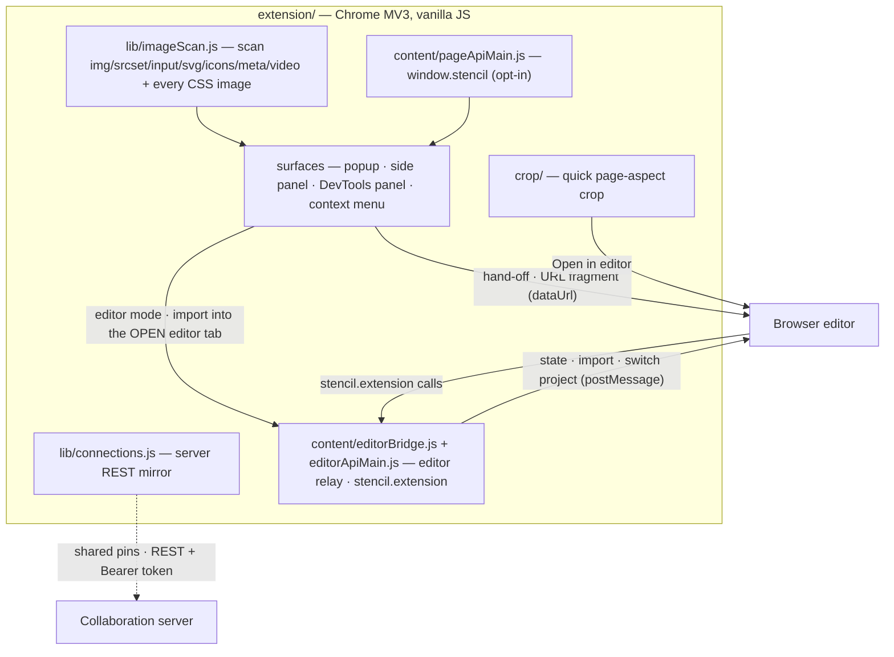

# Stencil Image Picker — Chrome extension

A Manifest V3 Chrome/Edge extension that lists, searches and filters every image
on the current page and lets you download it, open it in a tab, or send it to the
[Stencil browser editor](../browser/) — as an **in-page modal** by default —
including a quick page-aspect crop. Vanilla JS, no build step.

## Architecture



> **Surface diagrams:** [browser](../browser/README.md#architecture) · [server](../server/README.md#architecture) — or the whole-system view in the [repository README](../README.md#architecture).

## Features

**Toolbar popup** (click the extension icon)
- Scans the active tab for **every way an image URL can appear** (deduped by absolute URL,
  capped at 1000): `` (incl. `srcset`/`<picture><source>` alternates), `<input type=image>`,
  inline `<svg><image>`/`<feImage>`, `<video>` (current frame + poster), favicons /
  `apple-touch-icon` / `mask-icon` `<link>`s, image `preload`/`prefetch` hints,
  `og:image`/`twitter:image` (and `itemprop=image`) `<meta>`, web-app-manifest icons, and
  **every CSS image reference** — `background-image`, `content` (`::before`/`::after`),
  `border-image-source`, `list-style-image`, `mask-image`, `cursor`, `shape-outside`, and
  `image-set()`. Inline-SVG data URIs are included (`lib/rasterize.js` renders them to PNG
  for attach / hand-off); only `url(#id)` paint/clip/filter refs are skipped — those name a
  paint server, not an image. Each source maps onto the existing `img`/`bg` kinds, so the filters,
  badges and include-toggles are unchanged.
- **Search** by file name or URL, a **format pill per type** (the common web formats:
  png/jpg/gif/webp/svg/avif/bmp/ico/tiff, the video containers, plus any others the page
  uses — same accent on/off chips as the include toggles, with Select/Deselect all),
  **min/max width & height** (empty = no bound), and toggles to **include ``**
  and/or **background-image** sources. Background images have no size in the DOM, so
  they're shown by default and measured lazily so the size filters can apply once known.
- **Lazy rendering**: rows are added in batches as you scroll (good for image-heavy pages).
- Hover a thumbnail for an enlarged preview.
- **Light / dark**: the header's moon/sun button flips the theme for every extension
  surface; **Options → Appearance** offers the full System / Light / Dark choice. The mode
  lives in `localStorage` and `lib/accent.js` stamps `<html data-theme>` before first paint,
  so there's no flash and already-open surfaces re-theme without a reload (same `data-theme`
  contract as the browser app's `js/prePaintTheme.js`).

**Server connections & shared pins** (`lib/connections.js`)
- Connect to one or more [Stencil collaboration servers](../server/README.md) from
  **Options → Server connections** (URL + optional token). `addServer()` validates/issues a
  token via `POST /auth/token` and persists the connection in `chrome.storage.local`, so it
  survives popup reopen and is readable by the side panel / DevTools panel; `removeServer()`
  drops it. Each connection is listed there with a remove button.
- Each connected server's stored projects (those with an image) become **shared pins** in
  the popup list: `loadConnections() → collectSharedPins()` pulls them over REST and they
  render **after** the page's own images with a **golden outline + server badge** (the
  `server` icon glyph) to set them apart from local (gray) pins. Their bytes are fetched over
  the connection's **Bearer-authed** download endpoint (`fetchProjectImage` →
  `GET /projects/{id}/files/{kind}`), since a bare `` can't send the token. The
  **thumbnail** pulls the edited **`result`** variant (the project's saved filter + lines
  baked in — what the editor exported), falling back to the **`original`** when no result was
  ever saved; the **editor/crop hand-off** always pulls the **`original`** so the editor can
  re-apply the saved filter/lines (the `result` has them baked in and couldn't be re-edited).
  Clicking a shared row opens the (original) server image in the editor; the `⋯` menu offers
  open/incognito/here/crop on it, plus **Open in…** (Desktop app via the server reference,
  and — the only place it appears — the Telegram bot, when a bot username is configured).
- **Real-time refresh:** the popup re-pulls shared pins on a light **poll while open**
  (`SHARED_POLL_MS`, ~8 s) — MV3 popups are short-lived, so this is simpler and more robust
  than holding a background `/ws` events socket open. It also reacts to `chrome.storage`
  connection changes immediately (add/remove a server in Options → the popup updates without
  a rescan).
- **Pin target picker:** pinning an image (the 📌 button) always makes the local pin, and —
  when a server is connected — offers to **also store it on a server** via `createProject`
  (`POST /projects` with the image's `source`/`resource`): a **checkbox** for a single
  connection, a **picker** for several (`pinTargetMode` / `connectionByUrl`). The new project
  shows up as a shared pin on the next poll.
- **Click** a thumbnail or name → open it in the editor (a quick prompt picks
  incognito vs normal). **Double-click** → quick crop.
- A `⋯` button opens a floating menu **next to the icon** with: **Download**,
  **Open in new tab**, **Open in editor**, **Editor (incognito)**, **Crop…**. For a
  **video** the menu also carries a **Video preview image** group (open in a tab,
  download, open/crop the poster in the editor) — the poster acts independently of
  the current frame, mirroring the page right-click menu's submenu.
- An **Open in…** submenu hands the image off to another Stencil front-end, mirroring
  the browser app's toolbar *Open In…* menu (ports its link builders in `lib/openIn.js`):
  - **Desktop app** → a `stencil://open?…` link the OS routes to the installed desktop
    app (the image bytes ride **inline**; a shared server row sends only its server
    reference instead). Shown whenever a desktop URL scheme is configured; an oversized
    inline image is refused (a merely-large one warns), same guards as the browser.
  - **Telegram bot** → a `t.me/<bot>?start=…` deep link carrying a (server, project id)
    reference. Shown **only for shared (server) rows** and only when a bot username is
    configured — a start payload can't carry image bytes, so it needs a saved server
    project. Both the scheme and the bot username are set on the **Options** page.
- The `⇥` header button **docks the same view as a side panel** (Chrome side panel).

**Side panel** (the `⇥` button, or `chrome.sidePanel`) — the identical search /
filters / image-video list, but **persistent**: it stays open while you work the
page and **re-scans automatically** when you switch tabs or a page finishes loading.
Runs the same `popup.js` controller (`src/sidepanel/`).

**DevTools panel** — a **Stencil** tab inside Chrome DevTools (next to Elements,
Console, …), the same view again but **pinned to the inspected tab** rather than
the focused one, and **re-scans when that page navigates**. Registered by
`src/devtools/devtools.js`; the panel page (`src/devtools/panel.html`) reuses the
same `popup.js` controller, which targets `chrome.devtools.inspectedWindow.tabId`.

**Image right-click menu** — a **Stencil** submenu next to the browser's own
“Open image / Save image”: *Open in editor*, *Open in Stencil (incognito)*,
*Crop image in Stencil…*, and — when a desktop URL scheme is configured — **Open in
desktop app** (a `stencil://` link with the image embedded inline; hidden when no scheme
is set). The Telegram bot target isn't offered here: it needs a saved server project, so a
raw page image has nothing to reference — use the popup's *Open in…* on a shared (server)
row for that.

It also works on media the browser gives no image context for — a CSS
`background-image` (inline-SVG data URIs included), a photo buried under a click-catcher
overlay, or a link straight to an image file. Those actions live in a **second group with
its own “Stencil” root**, revealed together by the `ctxTarget.js` probe. Two roots, not
one, because Chrome decides a parent's visibility from its own `contexts` alone: a single
`contexts:['all']` parent rendered everywhere and painted as **“Stencil ▸ (empty)”**
wherever none of its children applied. Now the static root declares only
`action`/`image`/`video`, so Chrome hides it itself, and the dynamic root is revealed
*with* its children — so the failure mode is **no Stencil entry**, never an empty submenu.
The probe resolves on **hover** (throttled, deduped by outcome) as well as on
`mousedown`/`contextmenu`, so the reveal — and the worker wake-up it needs — happens long
before the menu renders instead of racing it.

**How things open**
- **Open in editor** → the full editor in a **new browser tab** (so its own
  multi-project / cross-tab UI shows any editors you already have open).
- **Resume in open editor** (an already-opened row's ⋯ menu) → instead of a new tab,
  **focus the editor tab that's already open** and switch it to that image's project
  (via the same-origin `editorBridge` → a `stencil:switch-to-source` DOM event →
  `DrawingApp.switchToProject`). No navigation, so nothing in the tab is lost. Falls
  back to opening a new tab when no editor is open.
- **Crop** → a small **in-page modal** (an iframe of the quick-crop tool) so you
  stay on the page; only when you press *Open in editor* there does it spawn the
  full tab. On pages whose CSP `frame-src`/`child-src` blocks the frame, the crop
  tool **falls back to its own tab** (the tool posts a `ready` handshake; if the
  modal host doesn't hear it in time it reopens the tool as a tab).

**Drag a row out** — list rows are **draggable** (`lib/dropZones.js` + the row
`dragstart` in `popup.js`). Drop a row onto the editor tab / another app to import the
image by URL, or drag it **onto the page** to get a **4-quadrant drop overlay**
injected on the tab: `top-left = open in editor here · top-right = open incognito ·
bottom-left = open image in new tab · bottom-right = crop`. Dropping outside a quadrant
(or Esc) cancels. Only the **side panel** shares the page's window, so the on-page
overlay reliably appears there; the **popup** dismisses as soon as you drag out and the
**DevTools panel** lives in a separate window, so the browser won't hand either a page
drag — on those two the row is still draggable out, but the quadrants won't show (same
platform limit as drag-*to-pin*, which is side-panel-only too).

**Quick crop** — mirrors the editor's crop model (a page-aspect rectangle in
original-image pixels; drag inside to move, corner-only resize, **scroll/buttons to
zoom**). Page size is any **ISO A/B/C format (A0–A10, B0–B10, C0–C10) or Custom**
(custom takes width × height in cm). Then
choose **Keep original** (full image + crop applied, lossless/movable) or **Cut
cropped part** (bake the region into a new image). Both honour an **incognito**
checkbox; the chosen page size is carried into the editor.

The in-page modal **shell** (title bar, frame, pop-out / close buttons) is injected into
someone else's page, so it can't link `lib/theme.css` — its palette is handed to it as
data (`lib/shellTheme.js`: the same Appearance choice and accent every other surface
follows, read from the `chrome.storage.local` mirrors that `lib/accent.js` writes). The
mode travels unresolved so the target page answers `system` with its own OS preference,
the values land as CSS variables on the shadow host, and a theme/accent change re-paints
an already-open modal. The shell lives in a shadow root with inherited properties reset,
so the host page's CSS can't restyle it.

### Drag page media onto the logo

The header's Stencil mark (and the title beside it) is **spring-loaded**: grab an image
or video **on the web page**, hover the mark, and after ~300 ms a four-item menu opens
right there, **mid-drag, with nothing dropped** — **Open in editor** (the in-page modal,
the same default the row's Open ▸ uses), **Open in new tab**, **Open incognito**,
**Crop**. Each item is itself a drop target: keep dragging onto the one you want and
release there. Release anywhere else (or press Escape, or end the drag) and it closes
having done nothing; leaving the mark keeps the menu up briefly so you can travel to it.
The full row menu (download, pin, open in…) stays a click away on the row's ⋯ — this is
the drag-only shortcut.

The released payload is normalised into a scan-row entry (`lib/dropEntry.js`), preferring
the **scanned row** when the URL is one already listed (so its real dimensions, opened
badge and pin state come along); otherwise the entry is derived from the URL or file,
and SVG sources rasterise on the way to the editor. Unknown dimensions cost nothing — the
editor measures the bytes it fetches — but an action that can't apply (opening a frameless
video in the editor) is omitted, leaving just "Open in new tab". Only the brand zone
springs the menu, so it never steals a drag meant for the list (drag-to-pin) or the
assistant, and the section spring ignores it. Usable on the surfaces that stay open while
you drag the page: the **side panel** and the **DevTools panel**.

While *any* compatible drag is live on the surface — not only over the mark — the logo
**pulses** (a gentle scale plus a breathing accent ring, pure CSS keyframes toggled by
one class) so you know it's a target before you get there; hovering it settles the pulse
at its enlarged end and hands over to the stronger dashed cue, and the drag ending clears
both. `prefers-reduced-motion: reduce` keeps the ring and drops the motion.

A URL dropped onto the list becomes a **new pinned row**, and that row announces itself:
it drops in from the drag and pulses the accent ring once (`.row.just-dropped`) so it is
findable mid-list — distinct from the plainer flash a row that was merely pinned gets. The
list itself and the assistant transcript ride a **scroll reveal** (`src/lib/motion.js`,
the mirror of `browser/js/ui/motion.js`): rows fade and lift in as they scroll into view
and dissolve again at the top edge. Both collapse under `prefers-reduced-motion: reduce`,
and neither runs at all without an `IntersectionObserver` — a row is never left dimmed. A row
being **removed** comes apart instead of fading: `disintegrate()` (`src/lib/motion.js`, the
mirror of the browser's) clones it per grid cell and scatters the cells. Changing the accent
or the light/dark mode floods the new palette out of the CONTROL that changed it — the
popup's moon button, the options page's Appearance / Main theme pickers — as a growing
circle (`src/lib/accent.js`, native View Transitions with a colour cross-fade fallback).
Nothing to anchor to (a change pushed from another extension page) blooms from the centre;
the last click is never the origin, which is how the circle used to end up in a corner.

## AI assistant (LLM chat)

> Setting a provider up end to end (Ollama / LM Studio / the collaboration server's
> Anthropic proxy) — with verification and troubleshooting steps — is documented once in
> the [root README](../README.md#ai-assistant--setting-up-a-model).

An **embedded "Assistant" section** sits at the bottom of the popup, side panel, and
DevTools panel (all driven by `popup.js`). It is collapsed by default; expanding it —
or clicking the **✦ (sparkle) header button**, which expands and focuses it — lazily
boots the chat. The assistant chats over the surface's **live scan state** (the images
currently scanned/listed), and its conversation lives with the surface only: the
popup's chat dies when the popup closes, docked panels keep theirs while open —
nothing is persisted. The assistant implements the **extension profile** of the shared
LLM contract — [`llm-contract/llm-profiles.md`](../llm-contract/llm-profiles.md) (contract §8) is authoritative:

- Every turn's system prompt carries a **numbered listing of the scanned images**
  (index, kind, dims, format, name, alt; ≤ 100 entries); the model answers with a
  strictly validated JSON op-plan over three ops: **`focus`** (scroll + highlight the
  image on the page, via the existing injected marking), **`open`** (hand the image to
  the browser editor via the existing `#stencil=` launch payload — optional core
  `crop`/`rotate`/`filter`/`layout`/`page` sub-actions are translated onto launch
  options), and **`attach`** (fetch the image bytes, downscale to ≤ 1568 px, attach for
  vision analysis, then auto-continue the turn **once**).
- **Switched off (`provider: 'none'`) means gone**: no Assistant section (not even a
  collapsed header) and no ✦ header button — the same gate the browser and desktop menus
  use. Picking a provider in Options brings both back live, no reload; while it's off a
  drag simply never considers the section (it isn't a collapsed drop target).
- Providers: **Ollama**, any **OpenAI-compatible** server, or a **Stencil collaboration
  server** (Anthropic proxy — auth reuses the matching stored connection's token).
  Configured in **Options → AI assistant**; persisted under the `chrome.storage` key
  `llmSettings`. Providers are reached through the extension's host permissions
  (no CORS setup needed) — the manifest's required `<all_urls>` already covers every
  origin, so no optional-permission prompt is involved.
- **Drag & drop / paste**: drop an image from any web page (or a popup/side-panel row),
  or a local image/video file, onto the Assistant section — or just **paste** one from
  the clipboard — and it queues as an attachment chip (thumbnail + analyze/remove) for
  the next message. A dropped URL that matches the current scan registers as *that*
  entry (so focus/open by index keep working); anything else attaches as a plain vision
  image; video files/URLs are sampled into frames in-surface (`<video>`+canvas — videos
  themselves never go to the LLM). URL parsing reuses `lib/dragUrl.js`, the same
  extraction the drag-to-pin feature uses. While a drag hovers the section, the drop cue
  is the editor's: a dashed accent outline over a faint accent tint.
- **Collapsed sections are spring-loaded** (`lib/dragSections.js`): a folded body is
  `display: none` and can never accept a drop, so while an image/video drag is live —
  a list row of your own or something from another window — the section you *hover*
  unfolds after a ~300 ms dwell, and only that one: hover the Assistant header to open
  the chat, hover **Found resources** to open the drag-to-pin list. Nothing opens up
  front, and a section the pointer never visits is never touched; sweeping across a
  header on the way somewhere else doesn't pop it open. Expansion goes through the same
  toggler a header click uses, so `aria-expanded`, the chevron and the
  `search-collapsed` coupling stay in sync. A sprung section folds back when the drag
  ends elsewhere — but stays open if you dropped into it, or if you toggled it yourself
  mid-drag; a drag that merely leaves the window gets a short grace period so the layout
  never flaps.
- **Every attachment is rasterised** (`lib/rasterize.js`) before it is sent: the bytes
  come through the extension's host permissions (so cross-origin / hotlink-protected
  sources work exactly like the popup's thumbnails), then decode via
  `createImageBitmap`, falling back to an `` + canvas draw at an explicit size.
  That fallback is what makes **SVG** work — Chrome's `createImageBitmap` refuses an
  `image/svg+xml` blob outright, and contract §7 accepts only png/jpeg/webp/gif, so an
  SVG (often with no intrinsic pixel size — 512 px on the long edge then) is always
  rasterised to PNG, never sent as-is.
- **Chat controls**: the send button becomes **Stop** mid-turn (aborts the request,
  transcript says "Stopped."), 🗑 clears the conversation, empty-state **suggestion
  chips** prefill the input (they never send), and error/notice entries carry a **×** —
  attach failures also clear themselves after a few seconds.
- Code: `src/llm/` (`llmSettings.js`, `llmClient.js`, `opPlan.js`, `chatController.js`)
  + `src/popup/assistant.js` (the embedded section), `src/lib/chatDrop.js`,
  `src/lib/chatUi.js`, `src/lib/rasterize.js`; unit tests in `tests/llm*.test.js`,
  `tests/chatDrop.test.js`, `tests/chatUi.test.js`, `tests/rasterize.test.js`.

## Editor mode

When the active tab **is** the configured Stencil editor, the panel is useless as it stands:
the editor page has no page images worth listing, and *Open in editor* would spawn a second
editor next to the one you're already looking at. So on an editor tab the **popup** and the
**side panel** switch surface — `body.editor-mode` reveals two extra sections (`#sec-editors`,
`#sec-source-tab`) built from the same `.fsection` accordion markup as the filters, so
collapsing, the drag spring and the styling all work as they do everywhere else. The
**DevTools panel** stays the classic surface: it is pinned to the one tab it inspects, so its
markup carries no editor sections and the controller (`popup/editorMode.js`) reports itself
unavailable there rather than flipping into a mode that document can't render. "Is this the
editor?" is an **origin** match against the Options editor URL (`lib/editorTabs.js`
`isEditorTab`), the very rule that scopes the editor content script, so the panel and the
injected bridge can never disagree.

- **Open editors** — every open editor tab, in every window, with a **live canvas preview**
  (the tab's `#canvas` downscaled to ≤ 256 px, so unsaved edits show), the project name, the
  image name and size, and `this tab` / `incognito` badges. A **search box** narrows the list
  by project name, tab title or URL — `lib/editorTabs.js` `matchEditors`, which delegates to
  the very `matchesSearch` the image list uses, so plain text is a case-insensitive substring
  and regex mode behaves identically here. Clicking a row **focuses** that tab and raises its
  window; the row's `⋯` menu repeats that as **Focus this editor** and adds **Switch
  project ▸** (that tab's own projects, the active one ticked, switched in place — no
  navigation) and **Open in new tab**. Previews refresh when the surface enters editor
  mode, on the section's own refresh button, and on a light poll while the panel is open
  (`EDITOR_POLL_MS`, the same ~8 s poll-while-open the shared pins use, for the same reason:
  an MV3 popup is too short-lived to be worth a background channel). A tab whose
  bridge doesn't answer — an older editor build, a page still loading — is still listed, just
  without a preview: hiding an editor the user is looking at would be worse than a blank row.
- **Images from another page** — pick any other open tab from the picker, and the familiar
  scan runs **on that tab** instead of the one you're standing on (blocked schemes and editor
  tabs are never offered). The rows, filters, badges, preview, drag and `⋯` menu are the
  ordinary ones; only where an image *goes* changes: clicking a row, dropping it, or choosing
  *Open in editor* **imports it into the editor tab you're standing in** — no new tab, no
  navigation, nothing in that tab lost. If that editor is blank the image lands straight away;
  if it already holds one, a chooser asks first — **new project**, **replace image**, or
  **replace, keeping annotations** (`lib/editorTabs.js` `importModeFor` decides which of the
  two paths applies, and "new" is the fallback whenever the editor's state is unknown, because
  it is the only mode that can't destroy work on screen). *Download*, *Open in new tab*,
  *Crop…*, *Open in…* and the pin actions are untouched.
- **Assistant** — the same embedded chat section, over the picked page's scan. Its `open` op
  imports into the editor tab you're on instead of spawning a `#stencil=` tab; the op set is
  unchanged (see [`llm-contract/llm-profiles.md`](../llm-contract/llm-profiles.md) §8).

On any other tab the panel is exactly what it always was — the two sections stay hidden.

### `stencil.extension` — the same capabilities from the editor's console

The editor page's own facade gains a `stencil.extension` slot: the extension injects a
MAIN-world script (`content/editorApiMain.js`) **only on the configured editor origin**, which
defines `window.__stencilExt` — hard-guarded and non-enumerable, exactly like the page API's
`window.stencil` — and the editor's `js/console/stencilApi.js` hands it through. The main world
has no `chrome.*`, so every call is postMessage'd to the ISOLATED `content/editorBridge.js`,
relayed to the service worker, and answered back on the same id — the same shape as
`pageApiMain.js` → `pageApiBridge.js`, plus a reply.

`stencil.extension` is **`null`** when the extension isn't installed, or when its editor-page
API is switched off — **Options → Editor page scripting API** (`editorPageApi`, **default ON**). Unlike
the all-pages *Page scripting API* (default OFF, injected everywhere), this one touches the
configured editor origin and nothing else, which is why it can ship on by default.

Every method that has an answer is **async** (it crosses to the service worker) and rejects
with a real `Error` when the call can't be served, so `await` in the console reads properly.
The two fire-and-forget hand-offs are the exception: `openInNewTab` and `crop` are one-way
sends, exactly like the page API's own `open`/`crop`, and return the facade for chaining
rather than a promise — there is no answer to wait for.

```js
await stencil.extension.editors();                  // every open editor tab
await stencil.extension.current;                    // …this tab's state alone
await stencil.extension.focus(tabId);               // raise that tab + its window
await stencil.extension.switchProject('p3');        // this tab → another of its projects
const tabs = await stencil.extension.tabs();        // other open pages worth scanning
const imgs = await stencil.extension.images(tabs[0].tabId);   // scan one of them
await stencil.extension.open(0, { mode: 'new' });   // import imgs[0] into THIS editor tab
stencil.extension.openInNewTab(imgs[2]);            // the ordinary #stencil= hand-off
stencil.extension.crop('https://example.com/pic.png');   // the quick-crop tool
```

| member | arguments | resolves to |
|---|---|---|
| `editors({ thumbnails = true } = {})` | `thumbnails: false` skips the canvas capture (a cheap refresh) | `[{ tabId, windowId, url, title, active, current, ready, projectId, projectName, hasImage, imageName, imageSize, incognito, thumbnail, projects }]` — one row per open editor tab, every field normalised (`imageSize` is `{w,h}` or `null`, `projects` is `[{id,name,active}]`); `current` marks the tab you're calling from, `ready:false` a tab whose bridge stayed silent |
| `current` | — (a getter) | `{ projectId, projectName, hasImage, imageName, imageSize, incognito, thumbnail, projects }` for **this** tab — answered by the bridge from the page itself, without waking the worker or asking the other tabs |
| `focus(tabId)` | `tabId: number` (any tab, not just an editor's) | `{ tabId, windowId }`; the tab is activated and its window raised |
| `switchProject(projectId, { tabId } = {})` | project id; `tabId` defaults to this tab | `{ projectId, projectName }`; an id the target doesn't have rejects with `unknown project` (the editor is never cleared) |
| `tabs({ currentWindowOnly = false } = {})` | — | `[{ tabId, title, url, host, label }]` — the open http(s) pages that can be scanned, editor tabs and blocked schemes dropped, in Chrome's tab order |
| `images(tabId, { limit } = {})` | `tabId: number`; `limit` caps the scan (default 1000) | the scan entries for that tab — `{ kind, src, videoUrl, posterUrl, w, h, poster, meta }` as the panel lists them, plus `tabId` / `resource` (where they came from), a derived `name`, and their own `open()` / `crop()`; the result is remembered, so it is what `open()`'s index form indexes into |
| `open(target, { tabId, mode, page, crop, incognito, resource } = {})` | `target` = a scan entry, an index into the last `images()` result, or a URL string | imports into an **open** editor tab (`tabId` defaults to this one) → `{ tabId, mode, projectId, projectName }`. `mode` is `'new'` (a fresh project), `'replace'`, `'replace-keep'` (replace the image, keep the annotations) or `'ask'` — the default, which imports straight away into a blank editor and otherwise rejects with `editor already holds an image` rather than overwriting anything (that rejection carries `err.needsChoice` + `err.state`, so a script can re-issue with an explicit mode without re-querying) |
| `openInNewTab(target, { incognito, resource } = {})` | as `open` | nothing — one-way: the existing `#stencil=` hand-off in a **new** tab (`openEditorTab`), returning the facade |
| `crop(target, { album } = {})` | as `open` | nothing — one-way: the existing quick-crop path (`launchCrop`), returning the facade |

`target` is the same union the page API's `open`/`pin` accept: a scan entry object, an index
into the most recent `images()` result, or a URL string (a string is always a URL, never a CSS
selector). Nothing here reads or writes the editor's project registry — the editor app stays
the sole source of truth for that; the bridge only asks it for state and relays imports through
the very methods the toolbar uses (`loadImageFromFile`, `replaceProjectImage`,
`switchToProject`), so console scripting, the panel and the UI can't drift apart.

## How the hand-off works

The extension fetches the image bytes (host permissions bypass page CORS → the
editor never sees a tainted canvas), converts them to a `data:` URL, and opens the
editor with the payload in the URL **fragment**:

```
http://localhost:8080/#stencil=<encodeURIComponent(JSON)>
```

`JSON = { dataUrl, name, crop?, page?: {size, width?, height?}, incognito? }` —
`page.size` is any ISO format name (`'A0'`…`'A10'`, `'B0'`…`'B10'`, `'C0'`…`'C10'`)
or `'custom'` (custom carries `width`/`height` in cm).
The fragment never reaches the server. The editor consumes it in
`DrawingApp.applyExternalLaunch()` (`browser/js/core/drawingApp.js`), applies the
page size, loads the image (with the crop), then strips the fragment.

## Install (unpacked)

1. Serve the editor: from [`../browser/`](../browser/) run `npm run serve`
   (default `http://localhost:8080/`).
2. `chrome://extensions` → enable **Developer mode** → **Load unpacked** → select
   this `extension/` folder.
3. (Optional) **Options**: editor URL, open mode (modal / tab), default page size.

## Project structure

```
manifest.json            MV3 manifest
package.json             `npm test` → node --test
src/
  background/background.js  service worker: image context menu + tab-fallback relay
  popup/    popup.html|css|js   image list, search/filters, floating actions, preview
            editorMode.js       editor mode: open-editor list, source-tab picker, import here
  sidepanel/ sidepanel.html|css  docked side-panel surface (reuses popup.js + popup.css)
  devtools/ devtools.html|js, panel.html|css  DevTools "Stencil" panel (reuses popup.js)
  crop/     crop.html|css|js    quick page-aspect crop (zoom, custom size)
  options/  options.html|js     editor URL, page size, pinned-images viewer, server connections
  lib/
    stencil.js       settings, fetch→dataURL, launch-URL builder, launchEditor
    overlay.js       in-page editor modal (also injected into pages)
    cropGeometry.js  port of the editor's crop math (kept behaviour-identical)
    imageScan.js     the page scanner (injected via chrome.scripting)
    filters.js       format / search / size filtering (pure)
    editorTabs.js    editor-tab detection, rows, search, source-tab choices, import mode (pure)
    actionMenu.js    the rows' floating ⋯ menu: item/submenu builders, flyout placement, Escape
    hoverPreview.js · filterUi.js · rowModel.js · collapsibleSections.js · logoDragMenu.js
                     the popup controller's extracted pieces (each node-tested)
    pins.js          pinned-images store, keyed by (site, source URL) (pure + storage)
    connections.js   collaboration-server connections + SHARED pins (REST mirror of server/internal/protocol)
    messages.js      cross-context message `type`/`source` constants (no magic strings)
    theme.css        shared light/dark palette, keyed on <html data-theme> (linked by popup/crop/options)
    accent.js        pre-paint accent + appearance (light/dark/system) resolver, localStorage-backed
tests/                   node:test unit tests for the pure modules
```

## Page scripting API (`window.stencil`, opt-in)

Off by default. Enable **Options → Page scripting API** to inject a `window.stencil`
object into every page's main world, mirroring the popup/context-menu actions for
scripting from the DevTools console. Entries hold the **live DOM element**.

```js
// Lists (these honor the live filters below):
stencil.items;                     // every image reference on the page (all of the below)
stencil.images;                    // kind 'image':  (+ srcset/<picture> alternates),
                                   //   <input type=image>, <svg><image>/<feImage>, favicons,
                                   //   preload/prefetch hints, og:image/twitter:image <meta>
stencil.backgrounds;               // kind 'background': every CSS image reference —
                                   //   background-image, content, border-image-source,
                                   //   list-style-image, mask-image, cursor, shape-outside, image-set()
stencil.icons;                     // icon/metadata images (e.meta): favicons, og:/twitter: <meta>,
                                   //   preload/prefetch hints — excluded from `images`
stencil.videos;                    // just the <video> elements
stencil.posters;                   // the poster image of every <video> that has one
stencil.pins;                      // just the entries currently pinned on this site
// (The synchronous page API omits web-app-manifest icons — those need an async fetch and
//  surface only in the popup/side-panel/DevTools list.)

// ── Live filters (mirror — and stay in two-way sync with — the popup's controls) ──
stencil.formats;                   // a per-format toggle map: { png: true, jpg: true, mp4: true }
stencil.formats.png = false;       // …turn a format off (Object.keys lists those present)
stencil.kinds;                     // a per-category toggle map: { image, background, video, poster, meta }
stencil.kinds.video = false;       // …hide a whole category (the popup's include checkboxes)
stencil.searchText = 'logo';       // name/URL substring filter
stencil.minWidth = 200;            // size bounds: minWidth/maxWidth/minHeight/maxHeight (or null)
stencil.maxHeight = 1000;
stencil.highlightOnPage = true;    // outline the (filtered) images on the page (alias: highlightOnImage)
stencil.resetFilters();            // clear all filters + the highlight → the facade

// One-off queries (ignore the live filters above):
stencil.search('logo');            // entries whose name or URL contains "logo"
stencil.format('png');             // entries of a given format ('png' or '.png')
stencil.size({ minW: 200, minH: 200 });  // entries within pixel bounds (unknown sizes pass)

const e = stencil.items[0];
e.element; e.kind;                 // live DOM node; 'image' | 'background' | 'video'
e.url;                             // the image/video/background URL
e.name;                            // a derived "file.ext" name
e.format;                          // 'png' | 'jpg' | 'webp' | … ('' if undetectable)
e.width; e.height;                 // intrinsic px where known (0 if not, e.g. unloaded bg)
e.poster;                          // true for a stencil.posters entry
e.meta;                            // true for an icon/metadata image (favicon/meta/manifest/preload)
e.pinned;                          // pinned on this site? — assignable get/set
e.isEdited;                        // was/is this image opened (edited) in an editor? (read-only)
e.open();                          // → open in the editor (in-page modal); returns the facade
e.open({ newTab: true, incognito: true });   // open opts: newTab, incognito, poster, frame
e.crop();                          // → quick-crop tool
e.crop({ album: true });           // crop opts: album, poster
e.pin(); e.unpin();                // pin/unpin this entry (chainable); same as e.pinned = true/false

// Or act on a raw element / URL directly (throws if it isn't a loadable image):
stencil.open(document.querySelector('video'), { poster: true });
stencil.open('https://example.com/pic.png', { newTab: true });   // a string is a URL, NOT a selector
stencil.crop('https://example.com/pic.png', { album: true });

// Pin / unpin a target — an entry, a stencil.items index, an element, a URL, or an array:
stencil.pin(0);                    // pin stencil.items[0]
stencil.pin(document.images[2]);   // pin an element
stencil.pin(document.querySelector('img.hero'));   // a querySelector result is just an element
stencil.pin(['https://example.com/a.png', 3]);   // mixed array, chainable
stencil.unpin(0);

// Inspect a target before acting on it (entry | items-index | element | URL) — never throws:
stencil.grabbable(el);             // → boolean: can Stencil grab this? (valid open/crop/pin target)
stencil.grabbable(document.querySelector('div.banner'));   // false if it has no image/video/bg source
stencil.detect(el);                // → { kind, url, name, format, element, hasFrame, hasPoster,
                                   //     pinned, isEdited, listed } — or null if nothing grabbable
stencil.detect(0).listed;          // does the target currently appear in stencil.items?
[a, b, c].every(stencil.grabbable);   // validate a batch before stencil.pin([...])

stencil.enabled = false;           // turn the whole feature back off (get/set)
```

The filters and the highlight **stay in two-way sync with the popup**: the filters share the
popup's persisted `chrome.storage.local` state (the MAIN-world API can't touch `chrome.*`,
so the ISOLATED `content/pageApiBridge.js` proxies storage for it), and the highlight shares
the popup's `<style id="stencil-hl-style">` element. So `stencil.formats.png = false` or
`stencil.kinds.video = false` here is reflected in the popup's checkboxes (and vice-versa),
and `stencil.highlightOnPage = true` ticks the popup's highlight box.

`pinned` and `isEdited` are backed the same way: the bridge pushes the current site's pinned
source URLs and the opened-images ledger into the page so the getters answer synchronously.
Pinning here writes the shared pin store, so it lights up the popup's row (gray outline, the
📌 button) and appears in **Options → Pinned images** — a cross-site browser of every pin,
filterable by the site it was pinned on, with open-in-new-tab and unpin. `isEdited` reflects
the **already-opened** ledger (an image opened in an editor); it's read-only here.

`open`/`crop`/`pin` accept a **DOM element** (so `document.querySelector('img')` works), a scanned
entry, a `stencil.items` index, or a **URL string** — a string is always a URL, never a CSS
selector (use `querySelector` yourself and pass the element). To check a target *before* acting,
`stencil.grabbable(target)` returns whether Stencil can grab it (it carries an image/video/background
source, or a capturable video frame), and `stencil.detect(target)` returns a descriptor of what it
sees (`kind`, `url`, `name`, `format`, `hasFrame`, `hasPoster`, `pinned`, `isEdited`, `listed`) or
`null` — both never throw, unlike the actions. `listed` says whether the target currently survives
the live filters (appears in `stencil.items`).

The **Options-page settings** are a different layer: `editorUrl`, default page size,
**Mark already-opened images**, **Sort opened first**, **Show pinned** are the extension's
cross-page preferences (also in `chrome.storage`, behind the service worker) and are *not*
part of this page API — there's no `stencil.markOpened`, because this surface is about the
images on the *current page*. Set those in the Options page (or the popup's own toggles).

Like the editor's `window.stencil`, this object is **hard-guarded**: every method, read-only
getter, and scanned entry rejects reassignment (`stencil.open = 0` / `e.url = 'x'` throw),
so only the documented setters (`enabled`, the filter controls) mutate anything. It's also
non-enumerable, so `console.log(stencil)` stays clean while access and autocomplete still work.

Architecture: a MAIN-world script (`content/pageApiMain.js`) defines the API and
scans the DOM; since the main world has no `chrome.*`, action requests are
postMessage'd to an ISOLATED bridge (`content/pageApiBridge.js`) that relays them to
the service worker, which reuses the same `openEditorTab` / `launchEditorModal` /
`launchCrop` hand-off as the popup. The pure scan helpers live in `lib/pageImages.js`
(unit-tested); the MAIN-world file mirrors them (it can't import modules).

This is **not** the editor-page API: `stencil.extension` (above) is a separate object, on a
separate default-ON toggle, injected only on the configured editor origin, and it is about
*editor tabs* rather than the images of the page you're on. Turning this one on doesn't affect
that one, or the reverse.

## Tests

Pure logic (crop geometry, filtering, launch-URL/filename helpers) runs under
Node's built-in runner — no dependencies:

```bash
# from this directory (extension/)
npm test        # or: node --test
```
