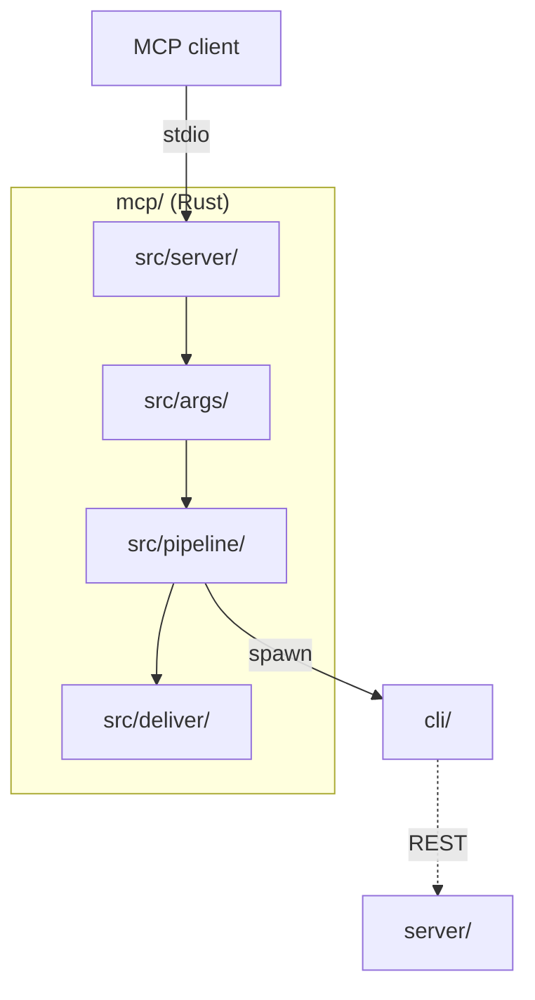
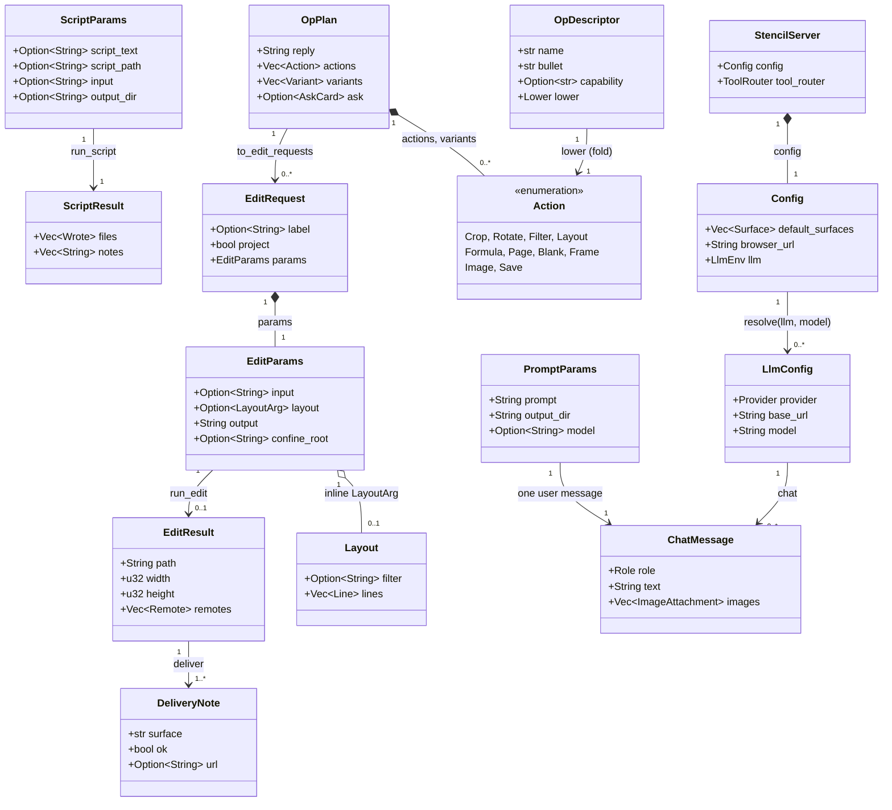

# MCP server architecture

The system-wide design — the parity contract, canonical data, the layer model, the pattern vocabulary — is in the root [`ARCHITECTURE.md`](../ARCHITECTURE.md).

A thin, typed adapter with **no image logic**: it maps tool parameters to the CLI's argv and
parses the CLI's stderr back into results. Its whole contract is the CLI's documented flags
and stderr grammar ([`cli/CONTRACT.md`](../cli/CONTRACT.md)); the `core/` parity rules do not
reach it.

## Layers

`server/` + tools → `opplan/` → `args/` → `pipeline/` → `llm/` (`llmtransport/` beside it).
Enforced by `tests/layer_boundary_test.rs`, an import-direction scan over `src/` whose two
`pipeline → args` crossings are a frozen allowance.
`src/` mirrors `cli/src/` — the module names echo the CLI's so the two wrappers read the
same way; a module becomes a directory once it holds more than one job.

## Where things go

| Path | Holds | Rule |
|---|---|---|
| `Cargo.toml`, `Cargo.lock` | exactly pinned crates (`rmcp`, `tokio`, `serde`, `serde_json`, `schemars`, `tempfile`, `base64`) | the lock is committed; CI builds `--locked`; no `tracing`/`anyhow`/`thiserror` |
| `toolDescriptions.json` + `toolDescriptions/` | the canonical tool + `get_info` prose, and the generated shards the `#[tool]` attributes `include_str!` | one home for wire descriptions, instructions and the README's Tools table |
| `src/main.rs`, `lib.rs` | entry (config, stderr logging, stdio serve) and the module surface for integration tests | **stdout is the JSON-RPC channel** — all logging is `eprintln!` |
| `src/server/` | `StencilServer` + the `#[tool]` methods; `tools/` holds one file per tool body (`prompt/` splits the auto-continuation loop, the round's steps, the response, the merges); `testwire.rs` reads a result back as the wire JSON | a `#[tool]` delegates its whole body to `tools/` |
| `src/config/` | defaults ← `.env` ← env ← `--surface` arg; the `Surface` enum | |
| `src/args/` | the DTOs schemars publishes, the page-format + colour tables, the CLI's option strings (`flags.rs`, single-sourced), `ArgvBuilder`, the scrape params + guard, the script params + guards | mirrors `cli/src/args.zig` flag for flag |
| `src/pipeline/` | locate → spawn → parse; `runner.rs` holds `CliRunner`, the one place this crate spawns a process | `pipeline::run` is generic over `CliRunner` so tests use a recording runner |
| `src/deliver/` | per-surface delivery: file, desktop launch, the `#stencil=` browser URL | an unavailable surface is a failed `deliveries[]` note, never a sunk call |
| `src/locate.rs`, `imagesize.rs`, `layout.rs`, `outcome.rs`, `confine.rs` | binary discovery (`STENCIL_CLI` → checkout → `PATH`), header-only pixel size, inline-layout temp files, stderr parsing, the `--confine-output` spawn rewrite | every run passes `--confine-output`; `confine_dir` is the form for a run with no positional output |
| `src/llmtransport/` | the hand-rolled plain-http HTTP/1.1 client: url, guards, client, response, sanitize | no TLS: `https://` is rejected and credential headers go only to loopback, decided from the resolved peer before the socket opens |
| `src/llm/`, `registry.rs`, `src/opplan/` | providers (one wire mapping per file behind one trait), the op registry, and the plan surface: parse → registry-driven `schema/` (a port of `browser/js/llm/plan/opSchema.js`) → per-op `actions` → `lower/` (plan → `EditParams` runs, with the run-fusing collapse) → `ask` cards | plans validate before anything spawns; only `model` is overridable per call |
| `tests/` | pure suites per band (`args_*`, `outcome_*`, `opplan_*`, `llm*`, `guards`), the fake-runner pipeline suites, `dispatch_test` (through the real `tools/call`), the goldens + prose pins, the shared fixture walkers (`common/walk.rs`, one named test per case), the self-skipping `e2e_*` | |

## Entities

| Entity | What it is | Owned by / lifetime | Relates to |
|---|---|---|---|
| `StencilServer` | the rmcp handler exposing `stencil_edit`, `stencil_probe`, `stencil_prompt`, `stencil_script`, `source_site` | `main.rs`, one per process, cloned per request | holds `Config`; each `#[tool]` delegates to `server/tools/` |
| `Config` | the resolved operator configuration: default surfaces, desktop binary, browser URL, `LlmEnv` | built once by `Config::load` from defaults, `.env`, env, `--surface` | resolved per prompt call into `LlmConfig` |
| `EditParams` | one `stencil_edit` request, the DTO schemars publishes; `layout_frame` and `confine_root` are executor-only | per call; built by the client or by `collapse` from a plan | becomes an `Argv` via `build_argv`, then an `EditResult` |
| `PromptParams` | one `stencil_prompt` request: prompt, working image, `output_dir`, the one `model` override | per call | one `ChatMessage` per round; results land in `output_dir` |
| `ScriptParams` | one `stencil_script` request: the `.stc` source (inline text or a path), an optional working image, and the directory the run is confined to | per call; inline text lives as a temp `.stc` for the span of the run | becomes an `Argv` via `build_script_argv`, then a `ScriptResult` |
| `ScriptResult` | a successful script run: one `Wrote` per `@save`, plus the CLI's `note:` lines | per call, from `outcome::parse_all_wrote` + `parse_notes` | summarised into the tool result; a script names its own outputs, so nothing is delivered |
| `Layout` | the lines drawn onto an image, in image pixels; canonical shape is the browser's layout export, parsed by `cli/src/media/layout.zig` | per call, materialised to a temp file by `layout::write_temp` | rides `EditParams.layout` as `LayoutArg::Inline` |
| `OpPlan` | the validated model reply: `reply`, `actions`, `variants`, `warnings`, `chat_only`, `ask`; canonical shape is `browser/js/llm/plan/opPlan.js` over `opRegistry.json` | per round, from `parse_op_plan` | lowered to `EditRequest`s; `AskCard` reported as data |
| `Action` | one validated op (`Crop`, `Rotate`, `Filter`, `Layout`, `Formula`, `Page`, `Blank`, `Frame`, `Image`, `Save`) | inside an `OpPlan` | found again by `op_name()` in the registry |
| `OpDescriptor` | one §13 registry entry for profile `mcp`: bullet, flags, capability, and its `Lower` fold | static, built once from `opplan::schema` | validates and lowers an `Action`; generates the prompt's ops section |
| `EditRequest` | one CLI run derived from a plan: base result, variant, or `.stencil` save | per round, from `to_edit_requests` | wraps an `EditParams` with `confine_root = output_dir` |
| `EditResult` | a successful edit: resolved path, dimensions, collaboration-server `Remote`s | per run, from `outcome::parse_wrote` + `parse_remotes` | delivered to surfaces; summarised into the tool result |
| `DeliveryNote` | one surface's outcome (`cli`, `desktop`, `browser`, `browser-live`, `extension`) | per delivery; its `Serialize` is the payload object | one per resolved `Surface` |
| `LlmConfig` | the resolved provider settings for one call; the endpoint and key come only from `LlmEnv` | per prompt call, `LlmConfig::resolve` | drives `ProviderMapping::request` |
| `ChatMessage` | the canonical message shape (contract §7): role, text, base64 `ImageAttachment`s | per round; no history is kept | mapped by the provider into its wire body |

## Patterns

| Pattern | Where | Notes |
|---|---|---|
| Adapter | `args::build_argv` + `ArgvBuilder` (`args/argv.rs`), `build_scrape_argv`, `build_script_argv`; `outcome::{parse_wrote, parse_all_wrote, parse_notes, parse_remotes, parse_scraped, extract_errors}` | typed request in, the CLI's documented flags out; stderr lines in, typed results out |
| Strategy | `ProviderMapping` with `Ollama`, `OpenaiCompat`, `StencilServer` (`llm/providers/`), chosen by `mapping_for(provider)` | one wire mapping per file; `llm::chat` never branches on the provider |
| Chain of Responsibility | `parse_http_url` → `validate_request_parts` → `guard_credentials` (`llmtransport/guards.rs`); `run_cli`'s clobber guard → `confine::confine` → spawn | each guard refuses or passes on; a socket opens only after the last one |
| Table-driven registry | `OpDescriptor` + `opplan::schema::Schema` from `browser/js/config/llm/opRegistry.json`; `registry::descriptor(name).lower` | validation, prompt generation and lowering come off one table |
| Pipeline | `pipeline::run::run_cli`; `Fold` in `opplan/fold.rs` (source → frame → crop → rotate → filter → layout) | the CLI's fixed order is why a plan collapses into one run |
| Ports for the two side effects | `CliRunner` (`ProcessRunner` vs a recording runner), `LlmTransport` (`PlainHttpTransport` vs a mock); `run_prompt` takes `Arc<dyn LlmTransport>` | the only process spawn and the only socket sit behind traits |
| Fixture walker | `tests/common/walk.rs` `Walk`; `opplan_fixtures_test`, `llm_wire_fixtures_test`, `layout_fixtures_test`, `sanitizer_fixtures_test` | one named case per shared fixture under `browser/js/config/llm/fixtures/` |
| Golden pin | `tests/goldens/*.txt` with `text_golden_test.rs`, `tool_prose_test.rs` | tool descriptions, instructions and the README table are byte-pinned to `toolDescriptions.json` |

## Design

- **A tool call.** rmcp decodes the stdio JSON-RPC into `EditParams` and calls
  `tools::edit::run`. `pipeline::run_edit` runs `run::run_cli`: the clobber guard, an inline
  `Layout` written to a temp file, `args::build_argv` (`Source::try_from` validates; the output
  is the last token), then `confine::confine(root, argv)` when `confine_root` is set, which
  makes `-i`/`-l` paths absolute, appends `--confine-output <relative>` and spawns inside the
  root. `ProcessRunner` runs `locate::find_cli()` with `NO_COLOR=1`, stdin null, under
  `config::cli_timeout()`. A failed exit is `EditError::Runtime(extract_errors(stderr))`;
  success is `parse_wrote` + `parse_remotes` → `EditResult`, rejoined via `confine::rejoin`,
  then `deliver::deliver` → one `DeliveryNote` per `Surface` → `ok_result(summary, EditPayload)`.
- **A prompt turn.** `run_prompt` resolves `LlmConfig` (only `model` overridable) and runs
  at most two rounds: `attach` (the local input via `attach_local_image`, plus the §7 edge map
  rendered through the CLI, `edge_map_attachment` + `edge_map_suffix`) → `chat_once` on the
  blocking pool → `parse_op_plan` → `prepare_outputs` (lowering) → `execute_concurrently`
  over `run_edit` / `run_project`. When round one `loads_without_tracing`, the same prompt is
  re-sent once over the rendered base result and `merged_response` joins both rounds.
- **Plan validation.** `parse_op_plan`: `strip_fences` → `first_json_object` (none = a
  chat-only turn) → the `reply`/`actions`/`variants` walk → `validate_actions`, where each
  action's op is looked up in the registry: forbidden fails the plan, unknown becomes a
  `warnings` note, known runs `Schema::validate_action` + `normalize` (table-driven) and the
  typed `lower` into an `Action`. An `ask` becomes an `AskCard` whose option previews are
  dropped and labels kept.
- **Lowering.** `to_edit_requests` walks the actions, splitting at `image` (index 1 restarts
  the working image) and `save` (a `.stencil` write, path honoured inside `output_dir`), and
  `collapse` folds each list through `descriptor.lower` into a `Fold` (crop, summed
  quarter-turns, last filter, concatenated lines, blank, page, frame) → one `EditParams` with
  `layout_frame = "source"` and `confine_root = output_dir`. Variants replay the base actions
  first; labels are sanitised and deduped.
- **The LLM transport.** `llm::chat` → `build_request` → `ProviderMapping::request` gives
  `(url, headers, body)`; `LlmTransport::post_json` on `PlainHttpTransport` parses the URL
  (`http://` only), vets header bytes, sends credential headers only to a loopback peer, and
  reads a bounded reply (64 KiB headers, 8 MiB body) under `DEFAULT_TIMEOUT` from
  `providers.json`. A non-2xx body is sanitised into `LlmError::Status { status, reason, code }`;
  code `llmDisabled` maps to `ChatError::Disabled`; `extract_reply` returns the text.
- **A script run.** `tools::script::run` validates `ScriptParams` (exactly one of
  `script_text` / `script_path`, the byte cap, the `.stc` suffix, no dash-leading value)
  before anything is written, materialises inline text to a temp `.stc`, and calls
  `pipeline::run_script`. That builds `--script <file> [-i <input>]` — no positional output,
  because the script's own `@save` ops name the writes — creates `output_dir`, and hands the
  argv to `confine::confine_dir`, which makes the script and input paths absolute, appends a
  bare `--confine-output` and spawns inside the root. The CLI prints one `wrote` line per
  `@save`, so `outcome::parse_all_wrote` + `parse_notes` are the whole result; each path is
  rejoined onto the root. A script with any diagnostic error runs nothing and the CLI's
  `file:line:col: error: … [CODE]` lines come back as the tool error.
- **Scrape and probe.** `source_site` builds `build_scrape_argv(ScrapeParams)` after
  `validate_surface`, spawns, and `parse_scraped` yields `ScrapeResult { dir, host, files }`.
  `stencil_probe` answers from `imagesize::sniff` on a local header, else renders a throwaway
  PNG through the CLI and reads its `wrote` line.
- **Tool result schema.** Every success is two content blocks, a text summary then a JSON
  payload; a failure is `is_error` with the message alone.

| Tool | Payload |
|---|---|
| `stencil_edit` | `{ path, width, height, surfaces[], deliveries[{surface, ok, detail, url}], server[{action: "updated" \| "created", …}] }` |
| `stencil_probe` | `{ width, height }` |
| `stencil_prompt` | `{ reply, notes[], results[{label, path, width, height}], ask?: {question, multi, allow_custom, options[]} }` |
| `stencil_script` | `{ files[{path, width, height}], notes[] }` |
| `source_site` | `{ dir, host, files[{path, width, height}] }` |

## Rules

1. **No pixels.** No codec, no `core/`, no HTML parsing (the CLI scrapes); that work lives
   in the CLI and reaches this adapter as a parameter.
2. **stderr in, stdout sacred.** The CLI is run with `NO_COLOR=1`; `wrote {path} ({w}x{h})`
   and `error:` lines are parsed from stderr; nothing but JSON-RPC is written to stdout.
3. **Model-chosen paths are confined.** `--confine-output` on every run; `confine.rs` spawns
   inside the sandbox root. A script picks its own output paths, so `--script` is one of
   confine's path flags and every `@save` is fenced into `output_dir`.
4. **Provider and endpoint are operator configuration.** A tool call may override `model`,
   never the URL or key.
5. **One model round per turn**, bounded to a single §7 auto-continuation (a plan that only
   loads an unseen picture is applied, re-sent once with the rendered result, both replies
   joined). A plan that does not fit one CLI run is rejected with an explanation.
6. **Prose has one home.** Descriptions, instructions and the README table come from
   `toolDescriptions.json` and are byte-pinned.

## Tests

Three bands: pure suites per module, fake-`CliRunner` pipeline suites and the real
`tools/call` dispatch cover everything up to the spawn without a binary; the `e2e_*` suites
drive the real CLI and self-skip without it. The timing suite is opt-in and asserts only
ratios (validation linear in points, the sanitizer's bounded window, argv building tracking
the flag count).
