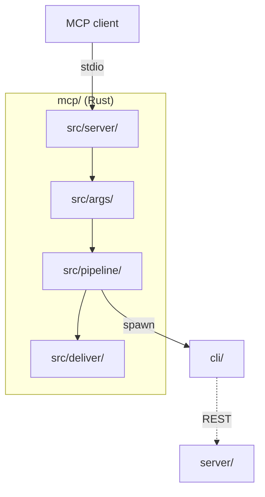

# MCP server architecture

The system-wide design — the parity contract, canonical data, the layer model, the pattern vocabulary — is in the root [`ARCHITECTURE.md`](../ARCHITECTURE.md).

A thin, typed adapter with **no image logic**: it maps tool parameters to the CLI's argv and
parses the CLI's stderr back into results. Its whole contract is the CLI's documented flags
and stderr grammar ([`cli/CONTRACT.md`](../cli/CONTRACT.md)); the `core/` parity rules do not
reach it.

## Layers

`server/` + tools → `opplan/` → `args/` → `pipeline/` → `llm/` (`llmtransport/` beside it).
`src/` mirrors `cli/src/` — the module names echo the CLI's so the two wrappers read the
same way; a module becomes a directory once it holds more than one job.

## Where things go

| Path | Holds | Rule |
|---|---|---|
| `Cargo.toml`, `Cargo.lock` | exactly pinned crates (`rmcp`, `tokio`, `serde`, `serde_json`, `schemars`, `tempfile`, `base64`) | the lock is committed; CI builds `--locked`; no `tracing`/`anyhow`/`thiserror` |
| `toolDescriptions.json` + `toolDescriptions/` | the canonical tool + `get_info` prose, and the generated shards the `#[tool]` attributes `include_str!` | one home for wire descriptions, instructions and the README's Tools table |
| `src/main.rs`, `lib.rs` | entry (config, stderr logging, stdio serve) and the module surface for integration tests | **stdout is the JSON-RPC channel** — all logging is `eprintln!` |
| `src/server/` | `StencilServer` + the `#[tool]` methods; `tools/` holds one file per tool body (`prompt/` splits the auto-continuation loop, the round's steps, the response, the merges) | a `#[tool]` delegates its whole body to `tools/` |
| `src/config/` | defaults ← `.env` ← env ← `--surface` arg; the `Surface` enum | |
| `src/args/` | the DTOs schemars publishes, the page-format + colour tables, the CLI's option strings (`flags.rs`, single-sourced), `ArgvBuilder`, the scrape params + guard | mirrors `cli/src/args.zig` flag for flag |
| `src/pipeline/` | locate → spawn → parse; `runner.rs` holds `CliRunner`, the one place this crate spawns a process | `pipeline::run` is generic over `CliRunner` so tests use a recording runner |
| `src/deliver/` | per-surface delivery: file, desktop launch, the `#stencil=` browser URL | an unavailable surface is a failed `deliveries[]` note, never a sunk call |
| `src/locate.rs`, `imagesize.rs`, `layout.rs`, `outcome.rs`, `confine.rs` | binary discovery (`STENCIL_CLI` → checkout → `PATH`), header-only pixel size, inline-layout temp files, stderr parsing, the `--confine-output` spawn rewrite | every run passes `--confine-output` |
| `src/llmtransport/` | the hand-rolled plain-http HTTP/1.1 client: url, guards, client, response, sanitize | no TLS: `https://` is rejected and credential headers go only to loopback, decided from the resolved peer before the socket opens |
| `src/llm/`, `registry.rs`, `src/opplan/` | providers (one wire mapping per file behind one trait), the op registry, and the plan surface: parse → registry-driven `schema/` (a port of `browser/js/llm/opSchema.js`) → per-op `actions` → `lower/` (plan → `EditParams` runs, with the run-fusing collapse) → `ask` cards | plans validate before anything spawns; only `model` is overridable per call |
| `tests/` | pure suites per band (`args_*`, `outcome_*`, `opplan_*`, `llm*`, `guards`), the fake-runner pipeline suites, `dispatch_test` (through the real `tools/call`), the goldens + prose pins, the shared fixture walkers (`common/walk.rs`, one named test per case), the self-skipping `e2e_*` | |

## Rules

1. **No pixels.** No codec, no `core/`, no HTML parsing (the CLI scrapes); that work lives
   in the CLI and reaches this adapter as a parameter.
2. **stderr in, stdout sacred.** The CLI is run with `NO_COLOR=1`; `wrote {path} ({w}x{h})`
   and `error:` lines are parsed from stderr; nothing but JSON-RPC is written to stdout.
3. **Model-chosen paths are confined.** `--confine-output` on every run; `confine.rs` spawns
   inside the sandbox root.
4. **Provider and endpoint are operator configuration.** A tool call may override `model`,
   never the URL or key.
5. **One model round per turn**, bounded to a single §7 auto-continuation (a plan that only
   loads an unseen picture is applied, re-sent once with the rendered result, both replies
   joined). A plan that does not fit one CLI run is rejected with an explanation.
6. **Prose has one home.** Descriptions, instructions and the README table come from
   `toolDescriptions.json` and are byte-pinned.

## Tests

Three bands: pure suites per module, fake-`CliRunner` pipeline suites and the real
`tools/call` dispatch cover everything up to the spawn without a binary; the `e2e_*` suites
drive the real CLI and self-skip without it. The timing suite is opt-in and asserts only
ratios (validation linear in points, the sanitizer's bounded window, argv building tracking
the flag count).
