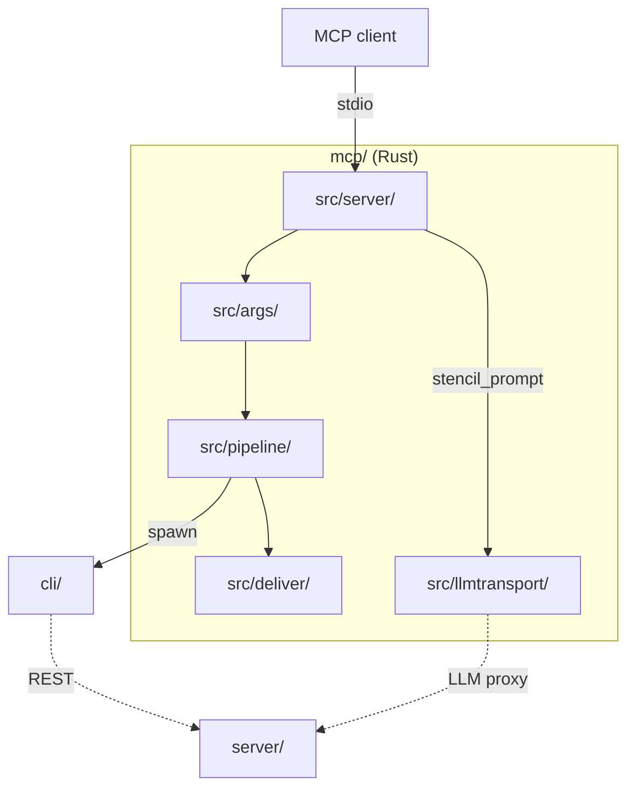
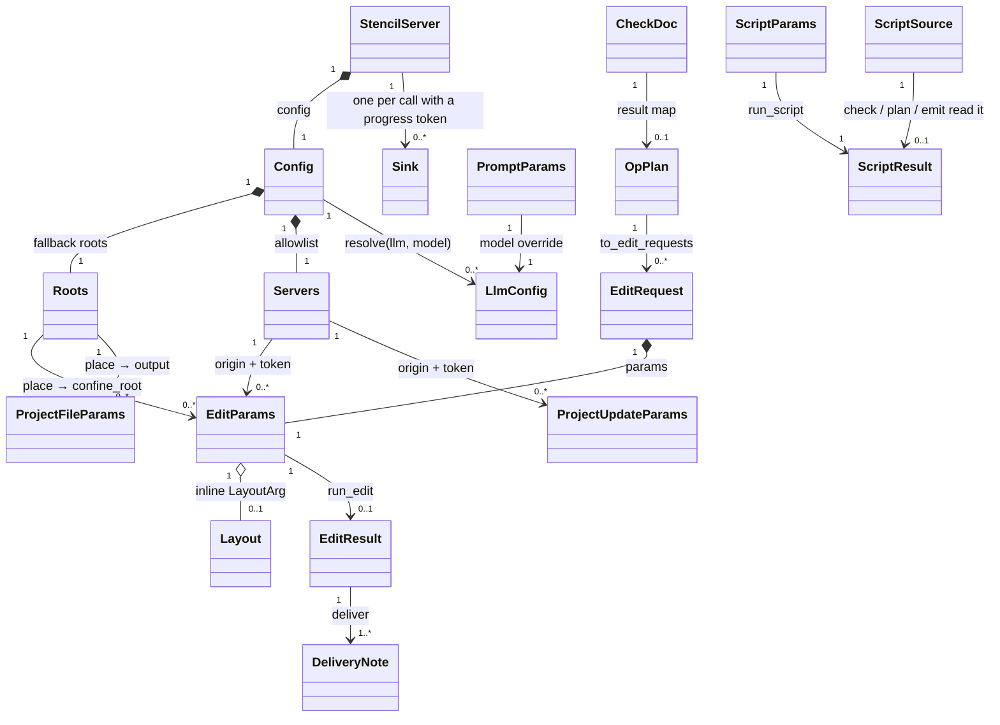

# MCP server architecture

The system-wide design — the parity contract, canonical data, the layer model, the pattern vocabulary — is in the root [`ARCHITECTURE.md`](../ARCHITECTURE.md).

A thin, typed adapter with **no image logic** and no plan validator: it maps tool parameters to
the CLI's argv and parses the CLI's output back into results; core judges a model's reply
through the CLI's `--plan-check`. Its whole contract is the CLI's documented flags and output
grammar ([`cli/CONTRACT.md`](../cli/CONTRACT.md)); the `core/` parity rules do not reach it.

```mermaid
graph TD
    CLIENT["MCP client"]
    subgraph MCP["mcp/ (Rust)"]
      SERVER["src/server/"]
      ARGS["src/args/"]
      PIPE["src/pipeline/"]
      DEL["src/deliver/"]
      HTTP["src/llmtransport/"]
    end
    CLI["cli/"]
    SRV["server/"]

    CLIENT -->|"stdio"| SERVER
    SERVER --> ARGS
    ARGS --> PIPE
    PIPE -->|"spawn"| CLI
    PIPE --> DEL
    SERVER -->|"stencil_prompt"| HTTP
    HTTP -.->|"LLM proxy"| SRV
    CLI -.->|"REST"| SRV
```

## Layers

`llm/` (+ `llmtransport/`) → `pipeline/` → `args/` → `opplan/` → `server/` + tools; a layer
may use everything to its left. `tests/layer_boundary_test.rs` scans every `crate::` reference
in `src/` and fails one that points right, beyond the frozen allowance in that file: the
`pipeline → args` crossing of `pipeline/mod.rs` and `pipeline/run.rs`, where the runner takes
`args::EditParams` and builds its argv, an upward reference. The helper modules (`config`,
`confine`, `deliver`, `imagesize`, `layout`, `llmtransport`, `locate`, `outcome`, `registry`)
sit outside the row, pinned by name. A module becomes a directory once it holds more than one
job.

## Where things go

| Path | Holds | Rule |
|---|---|---|
| `Cargo.toml`, `Cargo.lock` | exactly pinned crates | the lock is committed; CI builds `--locked` |
| `toolDescriptions.json` + `toolDescriptions/` | tool, `get_info`, resource and prompt prose, and the generated shards the `#[tool]` attributes `include_str!` | the one home of wire prose and the README's Tools table |
| `src/main.rs` | entry: config before the runtime, then stdio serve | **stdout is the JSON-RPC channel** — all logging is `eprintln!` |
| `src/server/` | `StencilServer`, the `#[tool]` methods, the call wrapper, resources, prompts; `tools/` one body per tool | a `#[tool]` delegates to `tools/`, which fences the call (roots, allowlist) before the pipeline sees it |
| `src/config/` | the operator configuration: defaults ← dotenv file ← env ← `--surface` | the dotenv file is the one beside the executable, else the one in `mcp/` of the checkout the executable sits in; never the CWD's |
| `src/args/` | the published DTOs, the CLI option strings, each tool's params, guards and argv | the CLI's flags, single-sourced |
| `src/pipeline/` | locate → spawn → parse; `CliRunner` in `runner.rs`, the one place a CLI child is spawned or fed stdin | generic over `CliRunner` so tests record; an edit run with no root is refused |
| `src/deliver/` | per-surface delivery: file, desktop launch, the `#stencil=` browser URL | an unavailable surface is a failed `deliveries[]` note, never a sunk call; a launched child never shares our stdio |
| `src/confine.rs`, `locate.rs` | the `Roots` and the `--confine-output` spawn rewrite; binary discovery (`STENCIL_CLI` → the executable's checkout → `PATH`) | the one write fence |
| `src/llmtransport/` | the hand-rolled plain-http `POST` client | no TLS; credential headers go only to a loopback peer, decided per resolved address; one deadline bounds the reply; no redirect followed; a non-2xx body is sanitised |
| `src/llm/`, `src/registry/`, `src/opplan/` | providers behind one trait; the embedded `opRegistry.json` and its fingerprint; the plan surface: check → typed result → actions → `lower/` → ask cards | core judges every plan before an edit spawns; a CLI built from another registry is refused |
| `tests/` | every suite, goldens and the shared fixture walkers | flat: Cargo sees an integration test only directly in `tests/` |

## Entities

```mermaid
classDiagram
    StencilServer "1" *-- "1" Config : config
    StencilServer "1" --> "0..*" Sink : one per call with a progress token
    Config "1" *-- "1" Roots : fallback roots
    Config "1" *-- "1" Servers : allowlist
    Config "1" --> "0..*" LlmConfig : resolve(llm, model)
    PromptParams "1" --> "1" LlmConfig : model override
    EditParams "1" o-- "0..1" Layout : inline LayoutArg
    Roots "1" --> "0..*" EditParams : place → confine_root
    Servers "1" --> "0..*" EditParams : origin + token
    CheckDoc "1" --> "0..1" OpPlan : result map
    OpPlan "1" --> "0..*" EditRequest : to_edit_requests
    EditRequest "1" *-- "1" EditParams : params
    EditParams "1" --> "0..1" EditResult : run_edit
    EditResult "1" --> "1..*" DeliveryNote : deliver
    ScriptParams "1" --> "1" ScriptResult : run_script
    ScriptSource "1" --> "0..1" ScriptResult : check / plan / emit read it
    Servers "1" --> "0..*" ProjectUpdateParams : origin + token
    Roots "1" --> "0..*" ProjectFileParams : place → output
```

| Entity | What it is | Owned by / lifetime | Relates to |
|---|---|---|---|
| `StencilServer` | the rmcp handler exposing the tools, resources and prompts | one per process, cloned per request | holds `Config` |
| `Config` | the operator configuration: surfaces, desktop binary, browser URL, `LlmEnv`, fallback `Roots`, `Servers` | built once at startup | resolved per prompt call into `LlmConfig` |
| `Roots` | the directories a call may write inside; the first anchors every relative path | per call: the client's `roots/list`, else `STENCIL_MCP_ROOTS`, else the CWD | `place` gives an output its `confine_root` |
| `Servers` / `ServerEntry` | the collaboration-server allowlist, each origin with its token | once, from `STENCIL_MCP_SERVERS` + `STENCIL_MCP_SERVER_TOKENS` | `find` maps a caller's URL to an allowed origin |
| `EditParams` | one `stencil_edit` request; `confine_root` and `server_tokens` are server-set, never in the schema | per call; from the client or `collapse` | argv, then an `EditResult` |
| `PromptParams` | one `stencil_prompt` request; `model` is its one override | per call | results land in its `output_dir` |
| `ScriptParams` / `ScriptSource` | a `stencil_script` run; the script — inline text or a path, exactly one | per call | a `--script*` argv |
| `ProjectUpdateParams` / `ProjectFileParams` | one project write with an optional `if_version` guard; or a stored file and its `output` | per call | an argv against the entry `Servers` picked |
| `ScriptResult` | a script run's images, `.stencil` projects and `note:` lines | per call | a script names its own outputs, so nothing is delivered |
| `Layout` | lines in image pixels plus their page format, in the shape `cli/src/media/layout.zig` parses | per call, a temp file | rides `EditParams.layout` |
| `CheckDoc` | the line `--plan-check` prints: the CLI registry's fingerprint and core's `result` (`cli/CONTRACT.md` §7) | per round | maps to an `OpPlan` or an `OpPlanError` |
| `OpPlan` | core's checked reply, typed over `opRegistry.json` | per round | lowered to `EditRequest`s; its `AskCard` is data |
| `EditRequest` | one CLI run of a plan: base result, variant, or `.stencil` save | per round | wraps an `EditParams` confined to `output_dir` |
| `EditResult` | a successful edit: path, dimensions, server `Remote`s | per run | delivered; summarised |
| `DeliveryNote` | one surface's delivery outcome | per delivery | one per resolved `Surface` |
| `Sink` | where one call's progress lines go | per call, re-scoped into every task it spawns | drained to `notifications/progress` |
| `LlmConfig` | one call's provider settings; endpoint and key come only from `LlmEnv` | per prompt call | drives `ProviderMapping::request` |

## Patterns

| Pattern | Where | Notes |
|---|---|---|
| Decorator | `server/call.rs` `decorate` | around every call: `Roots` resolved, a progress `Sink` scoped, the future dropped on cancel — taking the CLI child and the LLM request with it |
| Adapter | `ArgvBuilder` + one `build_*_argv` per CLI mode; `outcome::parse_*`; `opplan::result::map` | typed request in, documented flags out; output lines or core's plan document in, typed results out |
| Strategy | `ProviderMapping` (`llm/providers/`) | one wire mapping per file; `llm::chat` never branches on the provider |
| Chain of Responsibility | URL → header bytes → per-address credential guard; `Roots::place` + `Servers::find` → no-root refusal → `--no-clobber` → `confine` | each guard refuses or passes on; a socket or a child opens only after the last one |
| Table-driven registry | `OpDescriptor` from `common/config/llm/opRegistry.json` | prompt and lowering come off one table; validation off the CLI's copy, the same bytes by fingerprint |
| Pipeline | `Fold` in `opplan/fold.rs` (source → frame → crop → rotate → filter → layout) | the CLI's fixed order is why a plan collapses into one run |
| Bounded pool | the process-wide `Semaphore` in `pipeline/runner.rs` | every CLI child waits for a slot, a plan's fan-out included |
| Ports | `CliRunner`, `LlmTransport` | the only CLI spawn and the only socket sit behind traits |
| Fixture walker | `tests/common/walk.rs` | one named case per shared fixture under `common/fixtures/` |
| Golden pin | `tests/goldens/` | tool prose and the README table are byte-pinned to `toolDescriptions.json` |

## Design

- **An edit.** The tool anchors every path on the call's `Roots`; `Roots::place` gives the
  output its `confine_root`, and `server`/`remote` pass `Servers::find`. `run_cli` refuses a
  run with no root, adds `--no-clobber` unless `overwrite`, and `confine` makes `-i`/`-l`
  absolute and appends `--confine-output`. The child takes a pool slot and runs inside the root
  under the CLI deadline; failure is `extract_errors(stderr)`, success an `EditResult` delivered
  once per `Surface`.
- **A prompt turn.** `run_prompt` attaches the input (plus the §7 edge map rendered through the
  CLI), chats, checks and lowers the plan, and runs it as a `JoinSet` inside the call's progress
  scope, results in request order; a cancel or the first failure aborts the runs still going.
- **Plan checking.** The raw reply goes on stdin to `--plan-check - --plan-surface mcp`; a
  `CheckDoc` whose fingerprint differs from the embedded registry's is refused, and `main`
  probes the same at startup. `chatOnly` is a chat-only turn, `invalid` an `OpPlanError` with
  core's `message`, `valid` each normalized action lowered through the typed `lower`. An `ask`
  becomes an `AskCard`. A CLI that cannot judge the reply ends the turn.
- **Lowering.** `to_edit_requests` splits the actions at `image` (restarting the working image)
  and `save` (a `.stencil` write inside `output_dir`); `collapse` folds each list into a `Fold`
  → one `EditParams`. Variants replay the base actions first.
- **Scripts.** A run validates its source before anything is written, then spawns `--script`
  via `confine_dir` into `output_dir`; a script with an error diagnostic runs nothing, its
  diagnostics the tool error. Check and plan print on stdout, so they run through
  `run_capturing`; an emit is confined like an edit output.
- **Projects.** A project tool picks an allowlisted `ServerEntry`, checks `id` against the
  server's id shape, and hands the child that entry's token alone. A download is confined like
  an edit.
- **A preview.** `preview: true` renders the written file through `--thumbnail` into a confined
  temp PNG and attaches it as an image block; a failed render is one summary line, never a
  failed call.
- **Resources and prompts.** Each resource is an embedded canonical file or a table read out
  of one; a prompt fills its template's `{argument}`s.
- **Tool result schema.** A success is three views of one payload — text summary, JSON text
  and `structuredContent` matching the tool's `outputSchema` — then one image block per
  preview; a failure is `is_error` with the message alone. Every tool carries its
  read-only / destructive / open-world hints.

| Tool | Payload |
|---|---|
| `stencil_edit` | `{ path, width, height, surfaces[], deliveries[{surface, ok, detail, url}], server[], preview? }` |
| `stencil_probe` | `{ width, height, format, alpha, bytes, duration_ms, frames }`, null where unknown |
| `stencil_prompt` | `{ reply, notes[], results[{label, path, width, height}], ask? }` |
| `stencil_script` | `{ files[{path, width, height}], projects[], notes[], previews? }` |
| `stencil_script_check` | `{ valid, errors, warnings, diagnostics[] }` |
| `stencil_script_plan` | the CLI's §4.3 envelope |
| `stencil_script_emit` | `{ path, target }` |
| `source_site` | `{ dir, host, files[{path, width, height}] }` |
| `stencil_projects` | `{ server, projects[], next_cursor }`, public metadata only |
| `stencil_project_update` | `{ server, project }` |
| `stencil_project_file` | `{ server, id, kind, path, bytes, format }` |

## Concurrency

One multi-threaded tokio runtime serves the stdio session; rmcp runs each request as its own
future, and `server/call.rs` `decorate` wraps every tool call in one: it races the call against
the client's cancel token, and a cancel drops the call future and everything it owns. A CLI
child lives inside that future from spawn to exit, its pipes read concurrently with the stdin
feed and joined before the wait. A prompt turn's blocking LLM socket runs on the blocking pool,
and a plan's runs on a `JoinSet` the call owns. Process-wide state is two lazily set statics:
`SLOTS` and the resolved CLI path.

| Owner | Runs on | Shares | Guard | On overflow or teardown |
|---|---|---|---|---|
| `decorate` (`server/call.rs`) | one future per tool call | the call's `Roots` and progress `Sink` | `tokio::select!`, cancel first | a cancel drops the call, killing its children and aborting its LLM socket |
| `SLOTS` (`pipeline/runner.rs`) | every CLI spawn in the process, a plan's fan-out included | the CLI child budget | a `Semaphore` of `STENCIL_MCP_MAX_CONCURRENT_CLI` (default 2), held from spawn to exit | a spawn past it waits and reports `waiting for a free stencil CLI slot` |
| CLI child (`pipeline/runner.rs`) | another process; its pipes read on the call's future | stdout, stderr, stdin | `kill_on_drop`; the stdin feed and both readers joined before `wait`; `STENCIL_CLI_TIMEOUT_SECONDS` (120 s) | the deadline drops and kills it; stderr keeps a 1 MiB tail; stdout past 16 MiB is read to its end, discarded and refused |
| plan fan-out (`server/tools/prompt/execute.rs`) | a `JoinSet` per prompt turn, each task re-entering the call's progress scope | the runner | results in request order | dropping the set (a cancel or the first failure) aborts every run it holds |
| LLM request (`llmtransport/client.rs`) | `spawn_blocking`, one per model round | the socket in flight | `AbortOnDrop` armed around the await; the `aborted` atomic and the `live` mutex | a dropped call shuts the socket, which wakes the blocked read; one deadline bounds the exchange |
| progress forwarder (`server/call.rs`) | one task per call with a progress token | an unbounded channel from the `Sink` | in order, numbered | the call waits at most 1 s for it after the result, so a late notification may follow the result |
| `RESOLVED` (`locate.rs`) | the first spawn | the CLI path | `OnceLock` | set once per process, never re-resolved |

## Rules

1. **No pixels, no validator.** No codec, no `core/`, no HTML parsing, no op-plan validation:
   that work lives in the CLI and reaches this adapter as a parameter or a document.
2. **stderr in, stdout sacred.** The CLI runs with `NO_COLOR=1`; `wrote …` and `error:` lines
   come from stderr, stdout only from the modes that print a result there. Nothing but
   JSON-RPC reaches our stdout and no child gets our stdio; the plan check's stdin carries only
   the model's reply.
3. **Every write is confined.** A write — a downloaded project file included — lands inside
   the call's roots, symbolic links resolved, the child spawned there with `--confine-output`;
   an edit with no root is refused. `--script` is one of confine's path flags, so every `@save`
   is fenced into `output_dir`. The server's own scratch renders (a preview, the §7 edge map)
   run confined too.
4. **Endpoints and credentials are operator configuration.** The LLM provider, endpoint and
   key come from the environment — a call may override only `model`. A collaboration server
   is reachable only from the `STENCIL_MCP_SERVERS` allowlist, its token only from
   `STENCIL_MCP_SERVER_TOKENS`: never a parameter, never in a URL, never on a command line.
5. **Children get only what they need.** A CLI child runs on an allowlisted environment: no LLM
   key, no server token but the run's own. Its pipes are bounded; it dies with a cancelled call.
   The desktop app and the OS opener run on the same allowlist widened by what a GUI session
   needs.
6. **One model round per turn**, bounded to a single §7 auto-continuation. A plan that does not
   fit one CLI run is rejected with an explanation.
7. **Prose has one home.** Tool, resource and prompt prose and the README table come from
   `toolDescriptions.json` and are byte-pinned.

## Tests

Module, fake-`CliRunner` pipeline and request-handler suites cover everything up to the spawn
without a binary; the `e2e_*` and projects suites drive the real CLI and self-skip without it. A
stub CLI over a raw JSON-RPC session proves that `roots/list` fences writes, that progress
precedes the result, and that a cancelled call's child is killed, saw no secrets and stayed under
the concurrency cap; stub launchers prove a GUI launch sees no secrets either. The op-plan walker
types every mcp result of core's golden (`generated/normalized.json`) and, with a binary, proves
`--plan-check` prints it byte for byte. A source scan proves every file embedded from outside
`mcp/` reaches the image's build stage. The opt-in timing suite asserts only ratios.
