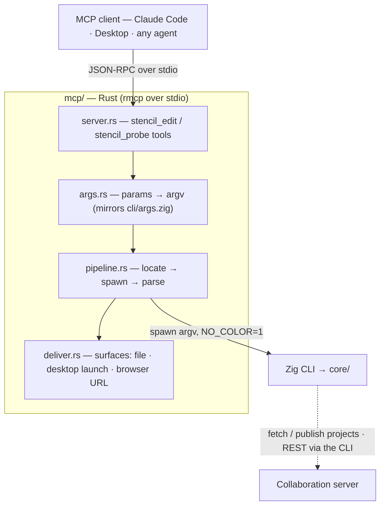
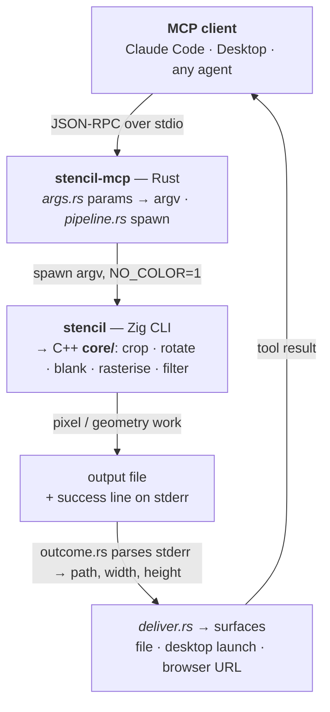

# Stencil — MCP server (Rust)

A Model Context Protocol (MCP) server that exposes Stencil's
image/video editing pipeline as tools any MCP client (Claude Code, Claude Desktop, or your
own agent) can call: load an image, video frame, or blank page, crop / rotate it, draw a
layout, apply a filter, and write the result — or read an image's dimensions. It can also
fetch, edit, and publish projects on a Stencil [collaboration server](../server/README.md)
(even fanning across more than one). It is a thin, typed adapter that **shells out to the Zig
CLI** (`cli/`), which wraps the shared C++ core, so results match the browser, desktop, and
CLI editors. For the project overview see the [repository README](../README.md).

```jsonc
// register with an MCP client (e.g. Claude Desktop's mcpServers, or `claude mcp add`):
{
  "mcpServers": {
    "stencil": {
      "command": "/path/to/stencil-mcp",
      // optional defaults (see Configuration):
      "env": {
        "STENCIL_SURFACES": "cli,browser",
        "STENCIL_BROWSER_URL": "http://localhost:8080" // this is the default; change if served elsewhere
      }
    }
  }
}
```

## Architecture



> Click a node to open that surface's own architecture diagram, or see the whole-system
> view in the [repository README](../README.md#architecture). The result data-flow is
> detailed under [How it works](#how-it-works).

## Dependencies

| Purpose | Tool | How it's provided |
|---|---|---|
| Build + language | **Rust 2021** (stable) | the `cargo`/`rustc` toolchain |
| MCP protocol over stdio | **`rmcp`** | the official Rust MCP SDK (server + stdio transport + macros), fetched by cargo |
| Async runtime + subprocess | **tokio** | spawns the CLI and serves the stdio transport |
| Tool schemas / (de)serialization | **serde**, **serde_json**, **schemars** | typed tool params → JSON Schema, advertised in `tools/list` |
| Browser launch-URL data URLs | **base64** | encode the result image into the `#stencil=` fragment (already in the tree) |
| The actual pixel/geometry work | **`../cli/`** (and through it, **`../core/`**) | invoked as a subprocess; **not** linked or recompiled here |

The server contains **no image logic** — it never touches `core/`, codecs, or the DOM. It
maps tool parameters to the CLI's command line and parses the CLI's output back into
structured results. That keeps it decoupled from the `core/` source-list parity rules the
other front-ends share: its only contract is the CLI's documented flags.

## Layout

```
mcp/
  Cargo.toml           # package + pinned deps (rmcp, tokio, serde, schemars, tempfile, base64, tracing)
  .env.example         # config template; copy to .env (gitignored) and adjust
  src/
    main.rs            # entry: load config, stderr logging, serve(stdio()).waiting()
    lib.rs             # module surface (so integration tests can reach the wrapper)
    server.rs          # the MCP surface: StencilServer + the #[tool] methods + get_info
    config.rs          # Surface enum + Config (defaults ← .env ← env ← --surface arg)
    args.rs            # typed tool params (EditParams/ProbeParams) → CLI argv  (mirrors cli/src/args.zig)
    pipeline.rs        # orchestration: locate → spawn → parse           (mirrors cli/src/pipeline.zig)
    deliver.rs         # deliver a result to surfaces: file · desktop launch · browser URL
    locate.rs          # find the stencil binary (STENCIL_CLI → repo cli/zig-out/bin → PATH)
    layout.rs          # Layout/Line/Point types + write an inline layout to a temp file
    outcome.rs         # parse the CLI's `wrote …` success line and `error:` lines (stderr)
  tests/
    args_test.rs       # param → argv mapping + surface resolution + guards (pure)
    outcome_test.rs    # stderr parsing (pure)
    e2e_test.rs        # real CLI runs, self-skipping when the binary is absent
  Dockerfile           # builds the Zig CLI + the Rust server into one runtime image
```

`src/` is kept flat to mirror `cli/src/`; the module names (`args`, `pipeline`) echo the
CLI's so the two wrappers read the same way.

> **stdout is the JSON-RPC channel.** All logging goes to **stderr** (writing to stdout
> would corrupt the protocol). `main.rs` configures `tracing` accordingly.

## Build

```bash
# from this directory (mcp/)
cargo build              # -> target/debug/stencil-mcp
cargo build --release    # -> target/release/stencil-mcp
```

The first build fetches the `rmcp` SDK and its dependencies (network required once; cached
afterwards). The server then needs the Stencil CLI at runtime — build it once with
`zig build` in [`../cli`](../cli), or set `STENCIL_CLI` to an existing binary (see below).

### Docker

A multi-stage [`Dockerfile`](Dockerfile) builds **both** the Zig CLI (recompiling `core/`)
and the Rust server, then ships a slim runtime with `ffmpeg` for video input and
`STENCIL_CLI` pre-wired. Because it pulls in `core/` and `cli/`, **build from the repo
root** and select the Dockerfile with `-f`:

```bash
# from the repo root
docker build -f mcp/Dockerfile -t stencil-mcp .

# speaks MCP over stdio — run with -i and mount a working directory for inputs/outputs
docker run --rm -i -v "$PWD:/work" -w /work stencil-mcp
```

## Configuration

The CLI always does the pixel work; **surfaces** decide where each result is delivered. The
default surface(s) are configured once, and any tool call can override them with a `surface`
parameter.

| Surface | Delivery | Needs |
|---|---|---|
| `cli` | writes the output file (always implied) | the Stencil CLI |
| `desktop` | also launches the Qt app showing the result (`stencil_gui --src`) | a built `desktop/` binary |
| `browser` | also builds (and optionally opens) an editor launch URL with the result loaded | the `browser/` app served |
| `browser-live` | **delegated** to the [`stencil-operator` agent](../.claude/agents/stencil-operator.md) for live tab driving; still returns a launch URL | Chrome + the served app |
| `extension` | **delegated** to the `stencil-operator` agent for page scanning; still returns the edited file + URL | Chrome + the extension |

Configuration is read from **built-in defaults ← a `.env` file ← process env (the
`mcpServers` `"env"`) ← the `--surface` arg**, and a per-call `surface` parameter overrides
the resolved default for that one call. Copy [`.env.example`](.env.example) to `.env`
(gitignored) to set local values:

| Variable | Default | Meaning |
|---|---|---|
| `STENCIL_SURFACES` | `cli` | default surfaces (see list form below), e.g. `cli,desktop,browser` |
| `STENCIL_CLI` | auto-discovered | path to the `stencil` CLI binary |
| `STENCIL_DESKTOP` | `<repo>/desktop/build/stencil_gui` | path to the Qt desktop binary |
| `STENCIL_BROWSER_URL` | `http://localhost:8080` | base URL of the served editor — only for the browser surfaces, only if not on the default |
| `STENCIL_AUTO_OPEN` | `false` | open the browser URL with the OS opener (`open`/`xdg-open`) |

**List form.** An env var is always a **string**, so `STENCIL_SURFACES` takes a comma list
(`"cli,browser"`); a bracketed string (`"[\"cli\",\"browser\"]"`) is tolerated too. The
per-call **`surface`** tool parameter additionally accepts a real JSON array
(`["cli","browser"]`) or a single string (`"browser"`). `cli` is always included.

**Editor address.** You only need `STENCIL_BROWSER_URL` if you use a browser surface **and**
the editor isn't on the default `http://localhost:8080` (e.g. you served it with
`ADDR=0.0.0.0 PORT=3000 npm run serve`). It's irrelevant to `cli`/`desktop`.

```jsonc
// in an mcpServers entry, or via `.env` / the --surface arg (env values are strings):
"env": { "STENCIL_SURFACES": "cli,desktop", "STENCIL_BROWSER_URL": "http://localhost:3000" }
```

## Usage

The server speaks MCP over **stdio**; you don't run it by hand so much as register it with a
client. It locates the CLI binary in this order: the `STENCIL_CLI` env var, then
`cli/zig-out/bin/stencil` under the repo checkout, then `stencil` on `PATH`.

```bash
# Claude Code:
claude mcp add stencil -- /path/to/stencil-mcp
# …or with an explicit CLI path:
STENCIL_CLI=/path/to/stencil claude mcp add stencil -- /path/to/stencil-mcp
```

### Tools

| Tool | Purpose | Key parameters |
|---|---|---|
| `stencil_edit` | Run the full pipeline, write a file, deliver to surface(s), optionally fetch/publish on a collaboration server | `input` \| `blank`, `crop`, `rotate`, `layout`, `filter`, `frame`, `output`, `overwrite`, `surface`, `server`, `remote_update`, `remote`, `remote_name` |
| `stencil_probe` | Read an image's pixel size | `input` |

`stencil_edit` maps directly onto the CLI (`source → crop → rotate → layout → filter →
encode`):

- **`input`** — a local path or `http(s)://` URL to an image or video. Mutually exclusive
  with **`blank`** (`{ page?, width?, height?, color? }`; `page` is an ISO format name —
  `A0`–`A10`, `B0`–`B10`, `C0`–`C10`, case-insensitive — mutually exclusive with explicit
  `width`/`height`; omit all of them for A4 @ 96dpi).
- **`crop`** — either a spec string (`"x1=10% x2=90% y1=10% y2=90%"`) or an object of edges
  (`{ x1, x2, y1, y2 }`). Each edge is a length token: `px`, `cm`, `mm`, `in`, `%`, or a
  bare pixel delta; a leading `-` measures from the far edge. `album: true` derives a missing
  axis from the page proportion.
- **`rotate`** — quarter-turns clockwise (`1` = 90°, `-1` = −90°, `2` = 180°).
- **`layout`** — a path/URL string, **or an inline layout object** (same schema the browser
  exports); coordinates are image pixels. The server writes inline layouts to a temp file.
- **`filter`** — `bw`, `sepia`, `invert`, `contour`, or a CSS color / `#hex` (duotone
  tint); overrides a filter baked into the layout.
- **`output`** — the result path (extension auto-filled from the input format). `overwrite`
  defaults to `false`, so the server won't clobber an existing file unless asked.
- **`frame`** — video frame index (0-based); needs `ffmpeg` on `PATH`.
- **`surface`** — override the configured default delivery for this call: a single value
  (`"browser"`) or a list (`["cli", "desktop"]`). See [Configuration](#configuration). The
  result includes a per-surface `deliveries` array (each with `ok`, `detail`, and any `url`).
- **`server`** / **`remote_update`** / **`remote`** / **`remote_name`** — talk to a Stencil
  [collaboration server](../server/README.md). See [Collaboration server](#collaboration-server)
  below.

#### Collaboration server

The Stencil [collaboration server](../server/README.md) stores and shares projects across
every front-end. `stencil_edit` drives the CLI's server client (over the server's REST API),
so the same tool both fetches a server project to edit and publishes results — no separate
tool and no extra dependency (the CLI does all the networking with native TLS). The result is
**always saved locally too**; the server delivery is in addition to the local write.

| Parameter | Effect |
|---|---|
| `server` (URL) + `input` (name) | Connect to the server and treat `input` as a **project name**: fetch that project's image and edit it instead of a local file. Incompatible with `blank`. |
| `remote_update` (bool) | With `server`, write the edited result **back into** the fetched project (updates its stored result image). |
| `remote` (URL) | Publish the result as a **new** project on this server. Works with any source — a local/web `input`, a `blank`, or a `server`-fetched project. A web `input`'s URL is recorded as the project's source. |
| `remote_name` (string) | Name for the `remote` project (default: the input image's base name). |

A client may hold **several connections at once**: `server` and `remote` can point at
**different** servers, so one call can fetch a project from server A and publish (or copy) it
to server B. The result `server` array reports each delivery the CLI performed — `{ action:
"updated", id, width, height }` or `{ action: "created", name, id }` — and the human summary
adds an `↑ server: …` line per delivery.

> The CLI's *interactive* console additionally supports ad-hoc multi-server sessions
> (`/connect`, `/connections`, `/fetch`, `/sync`, plus live update notices over the raw-TCP
> edit channel). That is a stdin REPL, not a one-shot command, so it is out of scope for the
> MCP, which covers the full **headless** server surface: fetch-by-name, update-in-place, and
> publish-as-new, against one or more servers.

Inline `layout` object (a polyline through `points`; close + fill a shape by repeating the
first point and setting a non-`transparent` `fillColor`):

```jsonc
{
  "imageWidth": 800, "imageHeight": 600, "filter": "none",
  "lines": [
    {
      "points": [ { "x": 50, "y": 50 }, { "x": 750, "y": 50 }, { "x": 400, "y": 550 } ],
      "color": "#ff0000", "thickness": 3, "markerSize": 0,
      "style": "solid", "locked": false, "fillColor": "transparent"
    }
  ]
}
```

### Example prompts

Once registered, just ask your MCP client in plain language — it picks the tool and fills
the arguments. The configured `surface` default decides where each result is delivered (add
"open it in the browser/desktop" to override per request):

- "Crop **photo.jpg** to its center 80%, rotate it a quarter-turn right, and save it as
  **out.png**."
- "Make **scan.png** black and white and save as **scan-bw.png**."
- "Give **logo.png** a duotone **#7c3aed** tint."
- "Create a blank red 800×600 canvas, draw a blue rectangle around the middle, tone it
  sepia, and save as **card.png**."
- "Make a blank **B5** page and save it as **page.png**."
- "Grab frame 24 of **clip.mp4** as **frame.png** and open it in the browser editor."
- "Crop **https://example.com/pic.png** to the left half and save it next to my project."
- "What are the pixel dimensions of **photo.jpg**?"
- "On the server **http://host:8090**, open the project **Floor plan**, tone it sepia, and
  save the result back to that project."
- "Upload **photo.png** to **http://host:8090** as a new project called **Shared**, after
  rotating it a quarter-turn right."
- "Fetch **Plans** from **http://a:8090**, crop it to the top half, and publish the result as
  a new project on **http://b:8090**."

### Example tool calls

These are the underlying calls a client makes for prompts like the above:

```jsonc
// center-crop to 80% and rotate a quarter-turn clockwise
{ "name": "stencil_edit", "arguments": {
    "input": "photo.jpg", "crop": "x1=10% x2=90% y1=10% y2=90%", "rotate": 1, "output": "out.png" } }

// blank red 800x600, draw a box, tone it sepia
{ "name": "stencil_edit", "arguments": {
    "blank": { "width": 800, "height": 600, "color": "red" }, "filter": "sepia",
    "layout": { "lines": [ { "points": [ {"x":100,"y":100}, {"x":700,"y":100},
      {"x":700,"y":500}, {"x":100,"y":500}, {"x":100,"y":100} ], "color": "#00f" } ] },
    "output": "card.png" } }

// blank B5 page (ISO format name instead of pixel dims)
{ "name": "stencil_edit", "arguments": { "blank": { "page": "B5" }, "output": "page.png" } }

// grab the 24th frame of a video
{ "name": "stencil_edit", "arguments": { "input": "clip.mp4", "frame": 24, "output": "frame.png" } }

// crop, then deliver to the CLI file AND open it in the browser editor
{ "name": "stencil_edit", "arguments": {
    "input": "photo.jpg", "crop": "x1=10% x2=90% y1=10% y2=90%",
    "surface": ["cli", "browser"], "output": "out.png" } }

// read an image's dimensions
{ "name": "stencil_probe", "arguments": { "input": "photo.jpg" } }

// fetch the server project "Floor plan", tone it sepia, write the result back to it
{ "name": "stencil_edit", "arguments": {
    "server": "http://host:8090", "input": "Floor plan", "filter": "sepia",
    "remote_update": true, "output": "floor.png" } }

// publish a local image as a NEW server project after rotating it
{ "name": "stencil_edit", "arguments": {
    "input": "photo.png", "rotate": 1,
    "remote": "http://host:8090", "remote_name": "Shared", "output": "out.png" } }

// fetch from one server, publish the result to another (two connections, one call)
{ "name": "stencil_edit", "arguments": {
    "server": "http://a:8090", "input": "Plans", "crop": "y2=50%",
    "remote": "http://b:8090", "remote_name": "Plans (top)", "output": "plans.png" } }
```

## How it works



The Rust layer owns only the protocol, the argument mapping, result parsing, and delivery;
every pixel/geometry transform happens in the CLI/core, so output is identical to the other
front-ends by construction. The CLI writes all human output (including the success line) to
**stderr** and leaves stdout empty, so the server runs it with `NO_COLOR=1` and reads the
result from stderr. Non-zero exit codes surface the CLI's `error:` line(s) as a tool error;
a surface that's unavailable (e.g. the desktop binary isn't built) yields a failed
`deliveries[]` note without sinking the call.

## Test

```bash
cargo test
```

Two layers run together:

- **Pure unit/integration tests** (`src/config.rs`, `src/deliver.rs`, `tests/args_test.rs`,
  `tests/outcome_test.rs`) — surface parsing, the `.env`/arg config, the `encodeURIComponent`
  + launch-URL building, the parameter→argv mapping, surface resolution, and stderr parsing.
  No binary needed.
- **End-to-end tests** (`tests/e2e_test.rs`) — drive the **real CLI** against the shared
  `../cli/tests/fixtures/sample.png`: probe its dimensions, rotate (dimensions swap), crop +
  filter + inline-layout in one call, and the clobber guard. They **self-skip** when the
  `stencil` binary isn't built or findable, so `cargo test` stays green without a Zig
  toolchain (set `STENCIL_CLI`, or build the CLI, to exercise them — CI does both).
