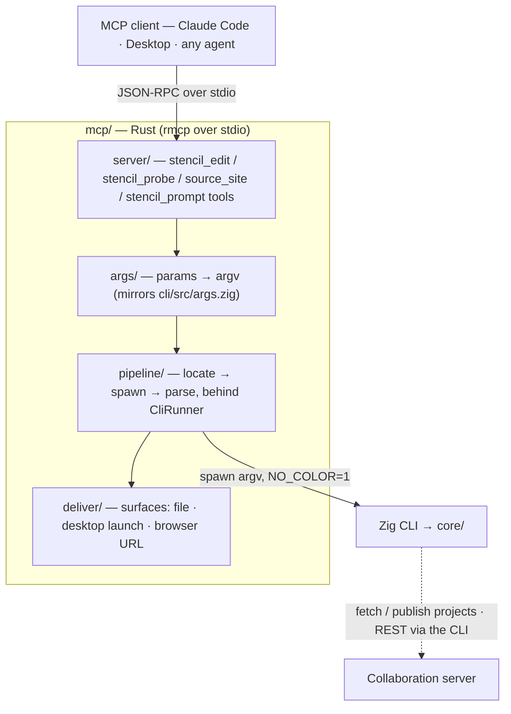
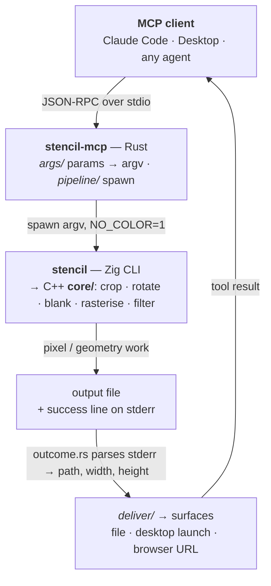

# Stencil — MCP server (Rust)

A Model Context Protocol (MCP) server that exposes Stencil's
image/video editing pipeline as tools any MCP client (Claude Code, Claude Desktop, or your
own agent) can call: load an image, video frame, or blank page, crop / rotate it, draw a
layout, apply a filter, and write the result — read an image's dimensions, or scrape a web
page's media into a directory. It can also
fetch, edit, and publish projects on a Stencil [collaboration server](../server/README.md)
(even fanning across more than one). It is a thin, typed adapter that **shells out to the Zig
CLI** (`cli/`), which wraps the shared C++ core, so results match the browser, desktop, and
CLI editors. For the project overview see the [repository README](../README.md).

```jsonc
// register with an MCP client (e.g. Claude Desktop's mcpServers, or `claude mcp add`):
{
  "mcpServers": {
    "stencil": {
      "command": "/path/to/stencil-mcp",
      // optional defaults (see Configuration):
      "env": {
        "STENCIL_SURFACES": "cli,browser",
        "STENCIL_BROWSER_URL": "http://localhost:8080" // this is the default; change if served elsewhere
      }
    }
  }
}
```

## Architecture


```mermaid
graph TD
    CLIENT["MCP client — Claude Code · Desktop · any agent"]
    subgraph MCP["mcp/ — Rust (rmcp over stdio)"]
      SERVER["server/ — stencil_edit / stencil_probe / source_site / stencil_prompt tools"]
      ARGS["args/ — params → argv (mirrors cli/src/args.zig)"]
      PIPE["pipeline/ — locate → spawn → parse, behind CliRunner"]
      DEL["deliver/ — surfaces: file · desktop launch · browser URL"]
    end
    CLI["Zig CLI → core/"]
    SRV["Collaboration server"]

    CLIENT -->|"JSON-RPC over stdio"| SERVER
    SERVER --> ARGS
    ARGS --> PIPE
    PIPE -->|"spawn argv, NO_COLOR=1"| CLI
    CLI -.->|"fetch / publish projects · REST via the CLI"| SRV
    PIPE --> DEL
```

> **Surface diagrams:** [cli](../cli/README.md#architecture) · [server](../server/README.md#architecture) — or the whole-system view in the [repository README](../README.md#architecture). The result data-flow is
> detailed under [How it works](#how-it-works).

## Dependencies

| Purpose | Tool | How it's provided |
|---|---|---|
| Build + language | **Rust 2021** (stable) | the `cargo`/`rustc` toolchain |
| MCP protocol over stdio | **`rmcp`** | the official Rust MCP SDK (server + stdio transport + macros), fetched by cargo |
| Async runtime + subprocess | **tokio** | spawns the CLI and serves the stdio transport |
| Tool schemas / (de)serialization | **serde**, **serde_json**, **schemars** | typed tool params → JSON Schema, advertised in `tools/list` |
| Temp files handed to the CLI | **tempfile** | inline layouts, fetched bytes and LLM attachments written for the subprocess |
| Browser launch-URL data URLs | **base64** | encode the result image into the `#stencil=` fragment (already in the tree) |
| The actual pixel/geometry work | **`../cli/`** (and through it, **`../core/`**) | invoked as a subprocess; **not** linked or recompiled here |

Every crate is pinned **exactly** (`=x.y.z`) in `Cargo.toml`, and `Cargo.lock` is committed
so the transitive tree is pinned too — CI builds and tests with `--locked`. That list is the
whole of it: logging is `eprintln!` to stderr and errors are hand-written, so there is no
`tracing`, no `anyhow`, no `thiserror`.

The server contains **no image logic** — it never touches `core/`, codecs, or the DOM. It
maps tool parameters to the CLI's command line and parses the CLI's output back into
structured results. That keeps it decoupled from the `core/` source-list parity rules the
other front-ends share: its only contract is the CLI's documented flags.

## Layout

```
mcp/
  Cargo.toml           # package + exactly pinned deps (rmcp, tokio, serde, schemars, tempfile, base64)
  Cargo.lock           # committed: CI builds and tests --locked
  .env.example         # config template; copy to .env (gitignored) and adjust
  toolDescriptions.json  # canonical tool + get_info prose (→ the shards and README's Tools table)
  toolDescriptions/    # generated, committed shards the #[tool] attributes include_str!
  src/
    main.rs            # entry: load config, stderr logging, serve(stdio()).waiting()
    lib.rs             # module surface (so integration tests can reach the wrapper)
    server/
      mod.rs           # the MCP surface: StencilServer + the #[tool] methods + get_info
      tools/           # one file per tool — the whole body each #[tool] delegates to
        mod.rs         #   the shared ok_result / err_result wrappers
        edit.rs        #   stencil_edit: run, deliver, report
        probe.rs       #   stencil_probe: pixel dimensions
        source_site.rs #   source_site: scrape a page, report every file
        prompt/        #   stencil_prompt: one LLM turn → validated plan → CLI runs
          mod.rs       #     the §7 auto-continuation loop
          execute.rs   #     the round's four steps: attach · chat · prepare · execute
          response.rs  #     the payload types + the single success exit
          merge.rs     #     the §7 round merges: kept work, joined replies
    config/            # defaults ← .env ← env ← --surface arg
      mod.rs           #   Config + the resolution order
      surface.rs       #   the Surface enum and its parsing
      env.rs           #   the .env reader (one of this repo's four)
    args/              # typed tool params → CLI argv  (mirrors cli/src/args.zig)
      params.rs        #   the DTOs schemars publishes
      tables.rs        #   the canonical page-format + colour-name tables
      flags.rs         #   the CLI's option strings, single-sourced
      errors.rs        #   EditError: one Display per failure
      argv.rs          #   ArgvBuilder + the normalized Source + build_argv
      scrape.rs        #   the source_site params, surface guard and argv
    pipeline/          # orchestration: locate → spawn → parse      (mirrors cli/src/pipeline.zig)
      mod.rs           #   the results + the entry points, bound to the real runner
      runner.rs        #   CliRunner: the one place this crate spawns a process
      run.rs           #   the guards, temp files and parsing around the spawn
    deliver/           # deliver a result to surfaces: file · desktop launch · browser URL
      mod.rs           #   DeliveryNote + the per-surface dispatch
      launch.rs        #   the #stencil= launch URL, encodeURIComponent, the OS opener
    locate.rs          # find the stencil binary (STENCIL_CLI → repo cli/zig-out/bin → PATH)
    imagesize.rs       # pixel size from an image header (PNG/GIF/BMP/JPEG/WebP) — probe's fast path
    layout.rs          # Layout/Line/Point types + write an inline layout to a temp file
    outcome.rs         # parse the CLI's `wrote …` success line and `error:` lines (stderr)
    confine.rs         # rewrite a run to spawn inside its sandbox root, under `--confine-output`
    llmtransport/      # hand-rolled plain-http HTTP/1.1 POST transport (no TLS, no deps)
      url.rs · guards.rs · client.rs · response.rs · sanitize.rs
    llm/               # LLM providers, system prompt + wire mappings (llm-contract.md)
      config.rs · message.rs · error.rs · attach.rs
      providers/       #   one §6 wire mapping per file, behind one ProviderMapping trait
    registry.rs        # the §13 op registry: the ops this server may plan + the prompt's ops section
    opplan/
      mod.rs           # the op-plan surface the rest of the crate calls
      types.rs         # the validated plan types + the one error enum
      parse.rs         # §1 extraction: fences, the first balanced JSON object, plan shape
      schema/          # the registry-driven schema engine (port of browser/js/llm/opSchema.js)
        json.rs · path.rs · grammars.rs · rules.rs · load.rs · checks.rs · fields.rs
      actions.rs       # §2–§3 per-op validation, registry-gated
      lower/           # map a validated plan onto EditParams runs
        mod.rs · names.rs (output naming) · collapse.rs (the run-fusing stage)
      fold.rs          # the per-op folds the registry entries dispatch on
      ask.rs           # §11 `ask` cards: validation + text rendering
  tests/
    args_test.rs       # param → argv mapping + surface resolution (pure)
    args_blank_test.rs · args_server_test.rs · args_scrape_test.rs  # the same, per flag band
    args_hardening_test.rs # the dash guard, path rejection and length caps (negative)
    outcome_test.rs · outcome_scrape_test.rs  # stderr parsing: edits, then scrape runs (pure)
    locate_test.rs     # find_cli's precedence: STENCIL_CLI, then the checkout, then PATH
    imagesize_test.rs  # header sniffing agrees with the CLI, and declines what it can't measure
    layout_test.rs     # the layout JSON mcp writes for --layout, pinned byte by byte
    opplan_*_test.rs   # op-plan parse tables + EditParams mapping, banded per file (pure)
    lowering_test.rs   # one table: a validated op is an op with a lowering to run it
    pipeline_test.rs   # the tool summary an edit reports back (pure)
    pipeline_run_test.rs # edit/project/scrape against a fake CliRunner — no CLI binary
    pipeline_probe_test.rs # the probe + edge-map renders, same fake runner
    dispatch_test.rs   # a real tools/call reaches the tool body (ServerHandler::call_tool)
    registry_test.rs   # the registry + the schema engine it drives, against the contract
    prompt_assembly_test.rs # the prompt's ops section generated from the registry
    timing_test.rs     # #[ignore]d benchmarks, ratio-asserted — `cargo test -- --ignored`
    llmtransport_test.rs # HTTP transport against a canned local TcpListener
    llmtransport_guards_test.rs # the URL and request guards on their own (negative)
    llm_test.rs        # provider wire shapes via a mock recording transport
    llm_server_test.rs · llm_prompt_test.rs · llm_turn_test.rs · llm_variant_test.rs
    guards_test.rs     # the spawn deadline, the response-body cap, and output confinement (negative)
    text_golden_test.rs # goldens/*.txt: the wire descriptions + get_info instructions, byte-exact
    tool_prose_test.rs # toolDescriptions.json → the committed shards + README's Tools table
    size_budget_test.rs # the per-file size + comment-share ratchet
    *_fixtures_test.rs # the shared cross-surface corpora, one reported case per fixture
    fixtures_test.rs   # the CLI's stderr-grammar goldens (cli/testdata/), shared with the bot
    fixture_overrides.json # the measured, mcp-side divergences from those corpora
    goldens/           # the *.txt text goldens text_golden_test.rs compares against
    size_budget.json   # the per-file line + comment-share numbers the ratchet reads
    common/            # helpers: the corpus/override loaders, the recording CliRunner, walk.rs
    e2e_test.rs · e2e_prompt_test.rs  # real CLI runs, self-skipping when the binary is absent
  Dockerfile           # builds the Zig CLI + the Rust server into one runtime image
```

`src/` mirrors `cli/src/` — the module names (`args`, `pipeline`) echo the CLI's so the two
wrappers read the same way; a module becomes a directory once it holds more than one job.

> **stdout is the JSON-RPC channel.** All logging goes to **stderr** (writing to stdout
> would corrupt the protocol). `main.rs` logs with plain `eprintln!` — no logging crate.

## Build

```bash
# from this directory (mcp/)
cargo build              # -> target/debug/stencil-mcp
cargo build --release    # -> target/release/stencil-mcp
```

The first build fetches the `rmcp` SDK and its dependencies (network required once; cached
afterwards). The server then needs the Stencil CLI at runtime — build it once with
`zig build` in [`../cli`](../cli), or set `STENCIL_CLI` to an existing binary (see below).

### Docker

A multi-stage [`Dockerfile`](Dockerfile) builds **both** the Zig CLI (recompiling `core/`)
and the Rust server, then ships a slim runtime with `ffmpeg` for video input and
`STENCIL_CLI` pre-wired. Because it pulls in `core/` and `cli/`, **build from the repo
root** and select the Dockerfile with `-f`:

```bash
# from the repo root
docker build -f mcp/Dockerfile -t stencil-mcp .

# speaks MCP over stdio — run with -i and mount a working directory for inputs/outputs
docker run --rm -i -v "$PWD:/work" -w /work stencil-mcp
```

## Configuration

The CLI always does the pixel work; **surfaces** decide where each result is delivered. The
default surface(s) are configured once, and any tool call can override them with a `surface`
parameter.

| Surface | Delivery | Needs |
|---|---|---|
| `cli` | writes the output file (always implied) | the Stencil CLI |
| `desktop` | also launches the Qt app showing the result (`stencil --src`) | a built `desktop/` binary |
| `browser` | also builds (and optionally opens) an editor launch URL with the result loaded | the `browser/` app served |
| `browser-live` | **delegated** to the [`stencil-operator` agent](../.claude/agents/stencil-operator.md) for live tab driving; still returns a launch URL | Chrome + the served app |
| `extension` | **delegated** to the `stencil-operator` agent for page scanning; still returns the edited file + URL | Chrome + the extension |

Configuration is read from **built-in defaults ← a `.env` file ← process env (the
`mcpServers` `"env"`) ← the `--surface` arg**, and a per-call `surface` parameter overrides
the resolved default for that one call. Copy [`.env.example`](.env.example) to `.env`
(gitignored) to set local values:

| Variable | Default | Meaning |
|---|---|---|
| `STENCIL_SURFACES` | `cli` | default surfaces (see list form below), e.g. `cli,desktop,browser` |
| `STENCIL_CLI` | auto-discovered | path to the `stencil` CLI binary |
| `STENCIL_CLI_TIMEOUT_SECONDS` | `120` | per-invocation deadline; a CLI run past it is killed and reported as an `error:` |
| `STENCIL_DESKTOP` | `<repo>/desktop/build/stencil` | path to the Qt desktop binary |
| `STENCIL_BROWSER_URL` | `http://localhost:8080` | base URL of the served editor — only for the browser surfaces, only if not on the default |
| `STENCIL_AUTO_OPEN` | `false` | open the browser URL with the OS opener (`open`/`xdg-open`) |

**List form.** An env var is always a **string**, so `STENCIL_SURFACES` takes a comma list
(`"cli,browser"`); a bracketed string (`"[\"cli\",\"browser\"]"`) is tolerated too. The
per-call **`surface`** tool parameter additionally accepts a real JSON array
(`["cli","browser"]`) or a single string (`"browser"`). `cli` is always included.

**Editor address.** You only need `STENCIL_BROWSER_URL` if you use a browser surface **and**
the editor isn't on the default `http://localhost:8080` (e.g. you served it with
`ADDR=0.0.0.0 PORT=3000 npm run serve`). It's irrelevant to `cli`/`desktop`.

```jsonc
// in an mcpServers entry, or via `.env` / the --surface arg (env values are strings):
"env": { "STENCIL_SURFACES": "cli,desktop", "STENCIL_BROWSER_URL": "http://localhost:3000" }
```

## Usage

The server speaks MCP over **stdio**; you don't run it by hand so much as register it with a
client. It locates the CLI binary in this order: the `STENCIL_CLI` env var, then
`cli/zig-out/bin/stencil` under the repo checkout, then `stencil` on `PATH`.

```bash
# Claude Code:
claude mcp add stencil -- /path/to/stencil-mcp
# …or with an explicit CLI path:
STENCIL_CLI=/path/to/stencil claude mcp add stencil -- /path/to/stencil-mcp
```

### Tools

<!-- generated from toolDescriptions.json — rewrite with `MCP_UPDATE_PROSE=1 cargo test` -->
| Tool | Purpose | Key parameters |
|---|---|---|
| `stencil_edit` | Run the full pipeline, write a file, deliver to surface(s), optionally fetch/publish on a collaboration server | `input` \| `blank`, `crop`, `rotate`, `layout`, `filter`, `frame`, `output`, `overwrite`, `surface`, `server`, `remote_update`, `remote`, `remote_name` |
| `stencil_probe` | Read an image's pixel size | `input` |
| `source_site` | Scrape a web page and download its matching media into a **directory** | `source_site`, `output`, `count`, `group`, `filter`, `format`, `min_width`/`max_width`/`min_height`/`max_height` |
| `stencil_prompt` | Ask a configured LLM to plan edits from natural language and run them (see [LLM assistant](#llm-assistant-stencil_prompt)) | `prompt`, `input`, `output_dir`, `model` override |
<!-- /generated -->

`stencil_edit` maps directly onto the CLI (`source → crop → rotate → filter → layout →
encode`):

- **`input`** — a local path or `http(s)://` URL to an image or video. Mutually exclusive
  with **`blank`** (`{ page?, width?, height?, color? }`; `page` is an ISO format name —
  `A0`–`A10`, `B0`–`B10`, `C0`–`C10`, case-insensitive — mutually exclusive with explicit
  `width`/`height`; omit all of them for A4 @ 96dpi).
- **`crop`** — either a spec string (`"x1=10% x2=90% y1=10% y2=90%"`) or an object of edges
  (`{ x1, x2, y1, y2 }`). Each edge is a length token: `px`, `cm`, `mm`, `in`, `%`, or a
  bare pixel delta; a leading `-` measures from the far edge. `album: true` derives a missing
  axis from the page proportion.
- **`rotate`** — quarter-turns clockwise (`1` = 90°, `-1` = −90°, `2` = 180°).
- **`layout`** — a path/URL string, **or an inline layout object** (same schema the browser
  exports); coordinates are image pixels. The server writes inline layouts to a temp file.
- **`filter`** — `bw`, `sepia`, `invert`, `contour`, or a CSS color / `#hex` (duotone
  tint); overrides a filter baked into the layout.
- **`output`** — the result path (extension auto-filled from the input format). `overwrite`
  defaults to `false`, so the server won't clobber an existing file unless asked.
- **`frame`** — video frame index (0-based); needs `ffmpeg` on `PATH`.
- **`surface`** — override the configured default delivery for this call: a single value
  (`"browser"`) or a list (`["cli", "desktop"]`). See [Configuration](#configuration). The
  result includes a per-surface `deliveries` array (each with `ok`, `detail`, and any `url`).
- **`server`** / **`remote_update`** / **`remote`** / **`remote_name`** — talk to a Stencil
  [collaboration server](../server/README.md). See [Collaboration server](#collaboration-server)
  below.

#### Scraping a page (`source_site`)

`source_site` fetches a web page, parses its HTML **in the CLI** (the server never parses
HTML), extracts the media it references, filters that set, and **downloads the matches into a
directory**. Unlike `stencil_edit`, its `output` is a **directory** (created if missing;
default the current directory), and it only writes files locally — the `cli` surface — so it
takes no `surface` beyond `cli`.

| Parameter | Effect |
|---|---|
| `source_site` (URL) | The page to scrape (`http(s)://`). Required. |
| `output` (dir) | Destination directory for the downloads (created if missing). Default `.`. |
| `filter` | Category tokens, `\|`-separated: `img`, `video`, `background`, `poster`. Default all. |
| `format` | Format tokens, `\|`-separated normalized extensions (`png\|jpg\|webp\|mp4`…). Default all. |
| `min_width` / `max_width` / `min_height` / `max_height` | Inclusive px bounds, measured from image bytes; video/unmeasurable items always pass. |
| `count` | Items per page — omit for the CLI's default of **5**; `0` = **all** matches. |
| `group` | 0-based page index over the filtered list (window `[group*count .. group*count+count]`); needs `count`. |

Returns `{ dir, host, files: [{ path, width, height }] }` — `width`/`height` are `null` for
video and any unmeasured item — plus a `wrote …` / `scraped N file(s) …` text summary.

```jsonc
// download up to 10 PNG/JPG images at least 400px wide from a gallery page into ./shots
{ "name": "source_site", "arguments": {
    "source_site": "https://example.com/gallery", "output": "shots",
    "filter": "img", "format": "png|jpg", "min_width": 400, "count": 10 } }
```

#### LLM assistant (`stencil_prompt`)

`stencil_prompt` implements the shared Stencil LLM contract —
[`llm-contract.md`](../llm-contract/llm-contract.md) is authoritative for the system prompt,
the op-plan schema/limits, and the provider wire formats. The tool sends the `prompt` (and,
for vision, a local `input` image ≤ 8 MiB, png/jpg/webp/gif) to the configured provider,
strictly validates the returned op-plan (crop / rotate / filter / layout / formula / page /
blank / frame / image / save; unknown ops are skipped with a note), and executes it through
the **same CLI pipeline** as `stencil_edit`: the plan's base actions are written to
`{output_dir}/result.png` and each variant to `{output_dir}/{sanitized-label}.png`. A plan
with no actions is a chat-only answer — text back, nothing written.

The contract's §7 **auto-continuation** applies: a plan whose actions only LOAD a picture
the model has not seen (`blank`/`frame`, possibly with pixel-independent crop/filter/page
edits, but no layout line drawn — and no variants or `ask`) is applied and the prompt is
automatically re-sent **once** with the freshly rendered `result.png` attached (plus its
edge map), so "create a blank page and draw something on it" completes in one call. The
follow-up plan is executed normally, whatever it contains — bounded to a single
continuation, so a second load-only answer never loops. Both replies come back joined, and
a follow-up failure keeps the loaded image with a note rather than erroring the call.

The contract's §2.1 multi-image ops land here as follows. A `save` writes the image + layout
built so far as a project — `{output_dir}/{name}.stencil`, the CLI's own bundle format, named
from the op's `name`, else the input file, deduped so one save never overwrites another. An
`image` op restarts the working image from `input`: this tool carries exactly ONE image, so
index 1 is it and any higher index is skipped with a note (the rest of the plan still runs),
never a failed plan — as is a `save` with no working image. Both are top-level only: a variant
that holds one is dropped with a note naming it (an ask option keeps its place and loses only
its preview) and the rest of the plan still runs — the misplacement costs that variant, never
the turn.

A turn is **one model round** (contract §3.0): the plan executes, the reply comes back, and
nothing runs after it — no extra pass re-checks or re-traces the lines the model drew. (§7's
auto-continuation above is part of the turn, not a post-plan pass, and is bounded to one
re-send.)

Configuration (contract §5; env / `.env`. Only `model` is overridable per call — the
provider and its endpoint are operator configuration, so a caller cannot redirect the
configured API key to a host of its choosing) — see the
[root README](../README.md#ai-assistant--setting-up-a-model) for getting a provider
running behind these keys:

| Variable | Default | Meaning |
|---|---|---|
| `STENCIL_LLM_PROVIDER` | `ollama` | `ollama` \| `openai-compat` (LM Studio, llama.cpp, vLLM…) \| `stencil-server` |
| `STENCIL_LLM_BASE_URL` | `http://localhost:11434` (ollama) / `http://localhost:1234/v1` (openai-compat) | provider endpoint |
| `STENCIL_LLM_MODEL` | empty | model name (empty = server default) |
| `STENCIL_LLM_API_KEY` | empty | `openai-compat` bearer key (LM Studio needs none) |
| `STENCIL_LLM_SERVER_URL` | — | `stencil-server` only: a Stencil collaboration server proxying Anthropic |
| `STENCIL_LLM_SERVER_TOKEN` | empty | bearer token for that server |

> **Plain-http only, and credentials stay on the box.** Per the contract's
> no-new-dependency rule, the transport is a small hand-rolled HTTP/1.1 client
> (`src/llmtransport/`) — `https://` endpoints are rejected. Because there is no TLS, it also
> **refuses to send `Authorization` / `x-api-key` to anything but loopback** (decided from
> the resolved peer address, before the socket opens), so a key can never leave in
> cleartext. Use a local provider (Ollama / LM Studio), a local TLS proxy, or a
> stencil-server on loopback; the collaboration server holds the Anthropic key and does the
> TLS hop.

Notes vs. the richer clients: this tool is single-turn (no chat history is kept between
calls; the §7 continuation re-sends the turn once, still without history), attached images are not downscaled (the adapter is codec-free), and a plan's
actions are collapsed into the CLI's fixed pipeline order — plans needing two crops on one
image, a `formula`, a standalone `page`, or several frames at once are rejected with an
explanation.

```jsonc
// "rotate photo.jpg right and give me a sepia and a b&w variant" → out/result.png,
// out/sepia.png, out/b-w.png
{ "name": "stencil_prompt", "arguments": {
    "prompt": "rotate it right and give me a sepia and a b&w variant",
    "input": "photo.jpg", "output_dir": "out" } }
```

#### Collaboration server

The Stencil [collaboration server](../server/README.md) stores and shares projects across
every front-end. `stencil_edit` drives the CLI's server client (over the server's REST API),
so the same tool both fetches a server project to edit and publishes results — no separate
tool and no extra dependency (the CLI does all the networking with native TLS). The result is
**always saved locally too**; the server delivery is in addition to the local write.

| Parameter | Effect |
|---|---|
| `server` (URL) + `input` (name) | Connect to the server and treat `input` as a **project name**: fetch that project's image and edit it instead of a local file. Incompatible with `blank`. |
| `remote_update` (bool) | With `server`, write the edited result **back into** the fetched project (updates its stored result image). |
| `remote` (URL) | Publish the result as a **new** project on this server. Works with any source — a local/web `input`, a `blank`, or a `server`-fetched project. A web `input`'s URL is recorded as the project's source. |
| `remote_name` (string) | Name for the `remote` project (default: the input image's base name). |

A client may hold **several connections at once**: `server` and `remote` can point at
**different** servers, so one call can fetch a project from server A and publish (or copy) it
to server B. The result `server` array reports each delivery the CLI performed — `{ action:
"updated", id, width, height }` or `{ action: "created", name, id }` — and the human summary
adds an `↑ server: …` line per delivery.

> The CLI's *interactive* console additionally supports ad-hoc multi-server sessions
> (`/connect`, `/connections`, `/fetch`, `/sync`, plus live update notices over the raw-TCP
> edit channel). That is a stdin REPL, not a one-shot command, so it is out of scope for the
> MCP, which covers the full **headless** server surface: fetch-by-name, update-in-place, and
> publish-as-new, against one or more servers.

Inline `layout` object (a polyline through `points`; close + fill a shape by repeating the
first point and setting a non-`transparent` `fillColor`):

```jsonc
{
  "imageWidth": 800, "imageHeight": 600, "filter": "none",
  "lines": [
    {
      "points": [ { "x": 50, "y": 50 }, { "x": 750, "y": 50 }, { "x": 400, "y": 550 } ],
      "color": "#ff0000", "thickness": 3, "pointSize": 0,
      "style": "solid", "locked": false, "fillColor": "transparent"
    }
  ]
}
```

### Example prompts

Once registered, just ask your MCP client in plain language — it picks the tool and fills
the arguments. The configured `surface` default decides where each result is delivered (add
"open it in the browser/desktop" to override per request):

- "Crop **photo.jpg** to its center 80%, rotate it a quarter-turn right, and save it as
  **out.png**."
- "Make **scan.png** black and white and save as **scan-bw.png**."
- "Give **logo.png** a duotone **#7c3aed** tint."
- "Create a blank red 800×600 canvas, draw a blue rectangle around the middle, tone it
  sepia, and save as **card.png**."
- "Make a blank **B5** page and save it as **page.png**."
- "Grab frame 24 of **clip.mp4** as **frame.png** and open it in the browser editor."
- "Crop **https://example.com/pic.png** to the left half and save it next to my project."
- "What are the pixel dimensions of **photo.jpg**?"
- "On the server **http://host:8090**, open the project **Floor plan**, tone it sepia, and
  save the result back to that project."
- "Upload **photo.png** to **http://host:8090** as a new project called **Shared**, after
  rotating it a quarter-turn right."
- "Fetch **Plans** from **http://a:8090**, crop it to the top half, and publish the result as
  a new project on **http://b:8090**."

### Example tool calls

These are the underlying calls a client makes for prompts like the above:

```jsonc
// center-crop to 80% and rotate a quarter-turn clockwise
{ "name": "stencil_edit", "arguments": {
    "input": "photo.jpg", "crop": "x1=10% x2=90% y1=10% y2=90%", "rotate": 1, "output": "out.png" } }

// blank red 800x600, draw a box, tone it sepia
{ "name": "stencil_edit", "arguments": {
    "blank": { "width": 800, "height": 600, "color": "red" }, "filter": "sepia",
    "layout": { "lines": [ { "points": [ {"x":100,"y":100}, {"x":700,"y":100},
      {"x":700,"y":500}, {"x":100,"y":500}, {"x":100,"y":100} ], "color": "#00f" } ] },
    "output": "card.png" } }

// blank B5 page (ISO format name instead of pixel dims)
{ "name": "stencil_edit", "arguments": { "blank": { "page": "B5" }, "output": "page.png" } }

// grab the 24th frame of a video
{ "name": "stencil_edit", "arguments": { "input": "clip.mp4", "frame": 24, "output": "frame.png" } }

// crop, then deliver to the CLI file AND open it in the browser editor
{ "name": "stencil_edit", "arguments": {
    "input": "photo.jpg", "crop": "x1=10% x2=90% y1=10% y2=90%",
    "surface": ["cli", "browser"], "output": "out.png" } }

// read an image's dimensions
{ "name": "stencil_probe", "arguments": { "input": "photo.jpg" } }

// fetch the server project "Floor plan", tone it sepia, write the result back to it
{ "name": "stencil_edit", "arguments": {
    "server": "http://host:8090", "input": "Floor plan", "filter": "sepia",
    "remote_update": true, "output": "floor.png" } }

// publish a local image as a NEW server project after rotating it
{ "name": "stencil_edit", "arguments": {
    "input": "photo.png", "rotate": 1,
    "remote": "http://host:8090", "remote_name": "Shared", "output": "out.png" } }

// fetch from one server, publish the result to another (two connections, one call)
{ "name": "stencil_edit", "arguments": {
    "server": "http://a:8090", "input": "Plans", "crop": "y2=50%",
    "remote": "http://b:8090", "remote_name": "Plans (top)", "output": "plans.png" } }
```

## How it works


```mermaid
graph TD
    CLIENT["<b>MCP client</b><br/>Claude Code · Desktop · any agent"]
    SERVER["<b>stencil-mcp</b> — Rust<br/><i>args/</i> params → argv · <i>pipeline/</i> spawn"]
    CLI["<b>stencil</b> — Zig CLI<br/>→ C++ <b>core/</b>: crop · rotate · blank · rasterise · filter"]
    OUT["output file<br/>+ success line on stderr"]
    DELIVER["<i>deliver/</i> → surfaces<br/>file · desktop launch · browser URL"]

    CLIENT -->|"JSON-RPC over stdio"| SERVER
    SERVER -->|"spawn argv, NO_COLOR=1"| CLI
    CLI -->|"pixel / geometry work"| OUT
    OUT -->|"outcome.rs parses stderr → path, width, height"| DELIVER
    DELIVER -->|"tool result"| CLIENT
```

The Rust layer owns only the protocol, the argument mapping, result parsing, and delivery;
every pixel/geometry transform happens in the CLI/core, so output is identical to the other
front-ends by construction. The CLI writes all human output (including the success line) to
**stderr** and leaves stdout empty, so the server runs it with `NO_COLOR=1` and reads the
result from stderr. Non-zero exit codes surface the CLI's `error:` line(s) as a tool error;
a surface that's unavailable (e.g. the desktop binary isn't built) yields a failed
`deliveries[]` note without sinking the call.

## Test

```bash
cargo test
```

Two layers run together (plus an opt-in third):

- **Pure unit/integration tests** (`src/config/`, `src/deliver/`, `tests/args_test.rs`,
  `tests/outcome_test.rs`) — surface parsing, the `.env`/arg config, the `encodeURIComponent`
  + launch-URL building, the parameter→argv mapping, surface resolution, and stderr parsing.
  No binary needed. `tests/pipeline_run_test.rs` and `tests/pipeline_probe_test.rs` take this
  as far as the spawn itself: `pipeline::run` is generic over `CliRunner`, so a recording
  runner drives the clobber guard, the inline-layout temp file, the confinement rewrite and
  the outcome parsing with no toolchain present; `tests/dispatch_test.rs` enters through the
  real `tools/call` handler.
- **End-to-end tests** (`tests/e2e_test.rs`) — drive the **real CLI** against the shared
  `../cli/tests/fixtures/sample.png`: probe its dimensions, rotate (dimensions swap), crop +
  filter + inline-layout in one call, and the clobber guard. They **self-skip** when the
  `stencil` binary isn't built or findable, so `cargo test` stays green without a Zig
  toolchain (set `STENCIL_CLI`, or build the CLI, to exercise them — CI does both).
  The `*_fixtures_test.rs` suites walk the shared cross-surface corpora through
  `common/walk.rs`, which reports **one named test per fixture case** rather than one per
  file, so a single divergent case names itself. The whole run is **594 tests** (3 `ignored`:
  the benchmarks below).
- **Benchmarks** (`tests/timing_test.rs`) — `#[ignore]`d, so out of CI, like the core's
  `bench` suite and `cli`'s `zig build bench`. Run them with
  `cargo test -- --ignored --nocapture`. Every case prints ns/call and asserts only a RATIO
  between two sizes of the SAME call, never a wall-clock threshold, so a loaded machine
  cannot fail one.

### Benchmark baseline

Best-of-5 batches, **debug build**, Apple silicon laptop, 2026-09-12. Release is several
times faster; the ratios are the contract, the ns/call are only a drift reference.

| Case | ns/call | Ratio asserted | Measured | Ceiling |
|---|---|---|---|---|
| `validate_action` — `crop`, 5 spec keys | 18,200 | — | — | — |
| `validate_action` — `layout`, 64 points | 245,500 | 512 points ÷ 64 points stays linear | 7.0x | 16x |
| `validate_action` — `layout`, 512 points | 1,729,000 | | | |
| `sanitize_detail` — 280 chars | 23,500 | 5,600 chars ÷ 280 chars: the 800-char scan window bounds it | 1.8x | 4x |
| `sanitize_detail` — 5,600 chars | 42,500 | | | |
| `build_argv` — input + output only | 295 | loaded ÷ bare tracks the flag count | 5.1x | 12x |
| `build_argv` — crop + rotate + filter + layout | 1,509 | | | |
